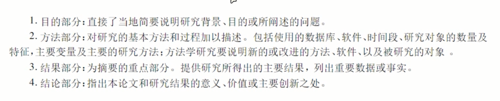
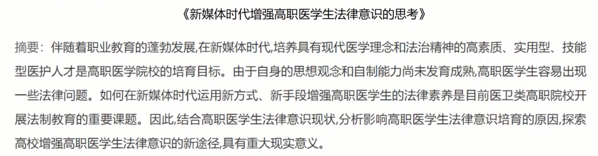
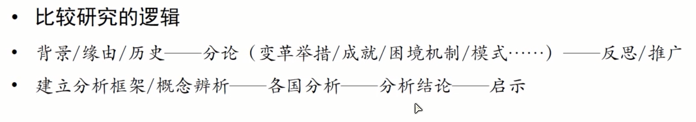
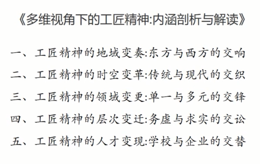
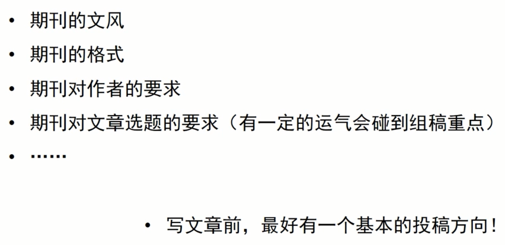

## 怎样写一篇小论文？

> 什么样的论文才是好论文，剖析标杆论文。

### 一、好论文的七大必备要素

#### 1.论文题目要干净利落

大部分的好题目中都包含**研究对象、解决问题、核心概念**，一般字数不超过25个字，可采用多种形式：**普通式，冒号，破折号，提问式**。

因为题目供人搜索，所以一定要包含关键字（对象、问题、核心），又因为是题目，所以要干净利落，要将研究方向聚焦于一点。

如*职业教育的产教融合：障碍及其消解*；

*中国经济集聚与绿色经济效率*：两个概念及之间关系

*美国社区学院校长领导力建设：背景、举措与成效*冒号之前是研究对象，冒号之后说自己针对该核心概念做了什么

*城市规模、人口结构与不合贸易品多样性——基于“大众点评网”的大数据*破折号前是主题，后面是补充说明。

*生产率进步影响农村人力资本积累吗？——基于围观数据的研究*

仅仅是问题有些单调，可通过破折号进一步补充。

#### 2.摘要明确简洁

简洁传达论文信息，注意**期刊**对结构化摘要的**需求**（上图就是某期刊的要求。）

用了什么方法、什么数据、从几个方便、做了什么、发现了什么...告诉你实质做了什么

大背景、小背景、为什么要这么做，以及做了什么，意义是什么。叙述性语言，很失败，不想读。

#### 3.逻辑清晰明了

##### (1)洋八股逻辑（实证）

问题，理论（文献）、假设、数据、测量、方法、发现和结论。

##### (2)政策研究逻辑

- 政策动机类论文：（围绕政策制定的动机于对未来政策执行的预判）政策背景——政策价值——政策障碍——执行策略
- 政策机制类论文：（围绕政策阶段性实施的经验与问题）政策现状——问题——问题背后的深层次原因、解决策略（对下一阶段实施的启示）
- 运行效果类论文：围绕政策实施的一个或多个周期结束后的效果。

##### (3)思辨研究逻辑

- 对比、因果、归纳、演绎（文科类如管理类常用）

### 4.文献综述完备

侧面了解在这片文章中投入的精力及研究功底

##### **(1)结构化论文中综述单独呈现——文献回顾**

是批判还是支持，要先写别人的观点，是否批判再说。

##### **(2)非结构化论文中综述融入论文各部分**

#### 5.论点独特创新

> 自己的论点别人研究过了吗？（雷同）

不同：论证方法不同、论证视角的不同、论据不同、论点方向不同——研究落实。

> 为什么要提出这个论点？（研究是否有效？）

查文献，反思是不是该问题没意义，和朋友讨论，

有可能捡到宝了。

#### 6.论据充实有力

##### (1)多读经典名著

传承的经典著作、当代著名学者的著作、跨学科的经典著作

##### (2)权威论文

核心期刊、cssci期刊，sci期刊，Ssci期刊

高水平的学位论文

权威会议讨论论文集

##### (3)实证数据

#### 7.参考文献权威

最好是cssci权威论文、最好包含著作、研究国外论文，必须要充实的国外资料、研究历史的论文，必须要有充实权威的史料。

### 二、好论文的三大可选要素

#### 1.排比式的二级标题

能让编辑审稿人和读者眼前一亮——文科类尤其重要

帮助自己树立思路、凝练文章的核心要点

#### 2.领域系列论文

论文最好保持在一定领域内，不要摇摆

#### 3.符合期刊要求

