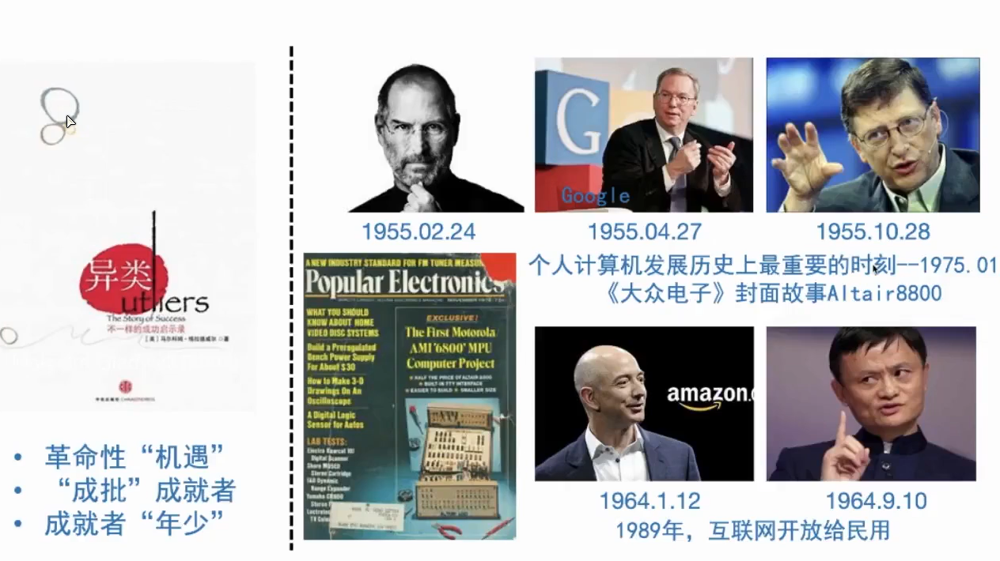
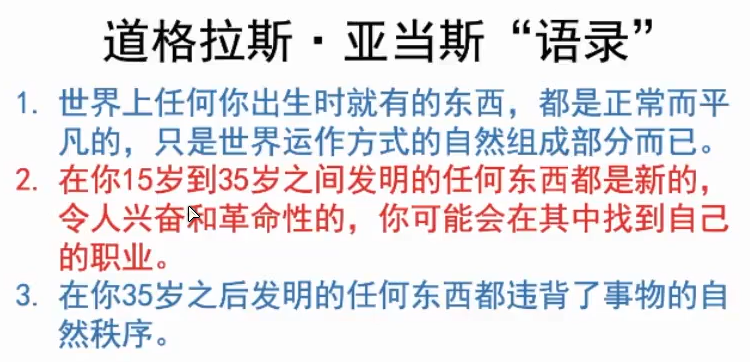
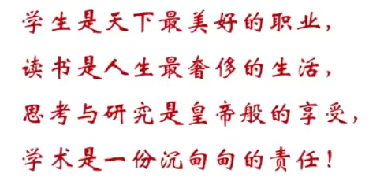
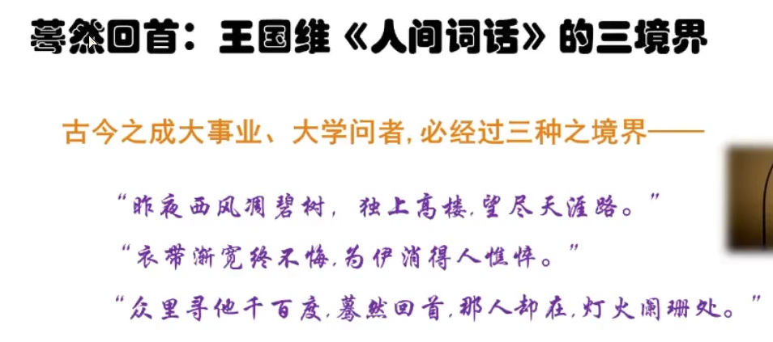
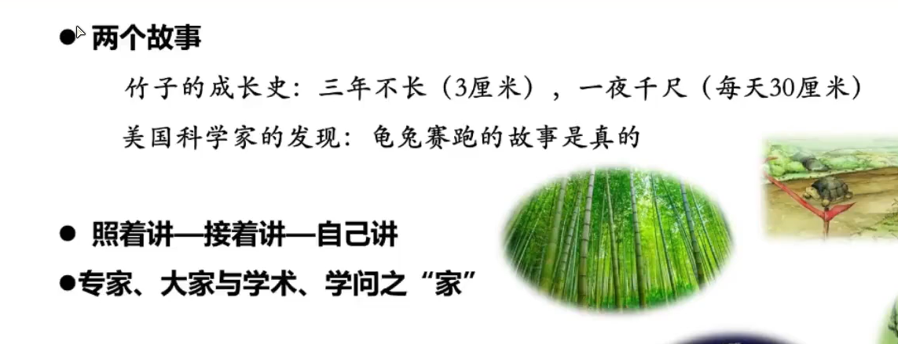

## 研究生科研素养与科研思维

清华大学，郑泉水院士

东南大学，文科***

读研——意味着什么？

读研，学会运用学理知识，运用学理方法，发现问题、解决问题。

把学术后的道理讲清楚，强化问题意识

进行学理探究，科学的研究方法。

知识的运用者

注意三个方面，课程知识的前沿性（选题区域——理论前沿、实践前沿）、掌握科学的研究方法和方法论（学理分析、学术表达、知识转化为生产力、解决实际问题）、学习学术思想史、科技发展史（历史上的创新创造如何发生的？）

学术论文应明确提出问题、讲清楚论文过程中运用的方法、阐述清学理研究结果。

赵老师完毕。

#### 我的二十年的跨界创新研究与研究生和本科生的培养——郑泉水（清华大学院士）

做研究——六条

 1.一个好的老师非常重要，因为一个人不可能从阅读文献中学习科研。

2.找到一个还没有被其他人找到的主题，因为总有比你更优秀的人。

> 对于一个研究生，对他影响最大的，不是学会一两个技术或方法，而是找到了一个很好的研究领域。

3.机遇也很重要，他们称为异类，因为在他们20岁时，世界上诞生了计算机。

#### 如何做个学问人——樊和平

道：酸甜苦辣

术：真

**学士是学术与人格的统一之士，所以要学习知识，储备知识。**草根的要义在于根，学术研究重要的也是根，这里的根既是无数默默无闻的学根，也指学术的基础。所以做学术需要必要的储备知识而不是完全利用所谓的万能网络。**万物森严于方寸之间。**

**硕士是硕学之士，所以要运用知识。**做学术，要以学术为业；学术即生活，生活中处处皆学问，学术并不庄严，因为学术就是生活本身。学术的积累获取在图书馆，但关键的突破往往在生活中，在应用中。生活中包含着无限的可能性，所以硕士一定要学会在生活中寻找灵感。

**博士更强调知识上的的博度，创造知识。**

### **真**

**最好的老师并不是兴趣，学会强迫自己。**一个人成功的概率，在于其强迫自己的能力。

**限制就是发展。**精力是有限的的，世界这么大，好东西那么多，人可以做的事想做的事太多了，是否有资格去看看？每个人天生都有表达的欲望，有几人知道自己该表达什么，不该表达什么。**要管理自己的精力，约束自己。**人之所以取得一点成功，关键在于笨，如果你是一个聪明人，怕是没时间来考虑你现在所思考的，走马观花，无所成。

**马虎是最大的浪费。**功亏于溃，世界上最大的浪费多在于没把事情做到极致完美。日本人的成功从抵制差不多开始。

**给自己一颗糖。**学会激励自己、给自己压力、给自己希望、为自己找兴趣，树立愿景和理想。

**读一本书，读天下之书。**世界上书很多，但99%的书并不值得读，一本书上往往含括天下同领域知识。

### 善

**读书与写作同行，拒绝做学术纨绔。**我们读古人的书，后人读什么？在消费前人成果时要记得创造。

**作文是制作而论文是创作，区分学术制作与学术创作。**拒绝工业学术，拒绝死套路。

**学习与科研良性循环。**文化与安身立命应同在，生活与学习应该并存。

**读书与思考并存。**思维不足的论文有如夹生的米饭，让人食难下咽。

**知识、见识与学识的统一。**

**顶天立地，文化传承与服务国家战略。**学者需要经费支持，所以要服务国家，

**做负责任的研究**，学者与学术的底线是学者的担当与良知。

### 美

学术研究与课题申报的四大难关：话题（文章—想做什么）—问题（questions）—主题（point）—标题(将point转化为一个具有冲击力的表现)。

小题大做与大题小做。

人贵有自知之明，know yourself?人在神面前是脆弱的，要有自知之明，要回归自己的初心。

学问始于精致。致广大，尽精致，综罗万代。宽可跑马，密难藏针。好的学问既是泼墨画又是工笔画。大胆泼墨小心修饰。

### 如

学术之境：自信：一只笔走天下；硬功：一支笔，一张嘴，怕什么？追求：立言、立功、立德。

目中有人，手中有绳。写给谁看？雅还是俗，写给谁看？学术是纯粹的事业。（自由而不放任）。驾驭住奔腾不息的思想，围绕主题。

心有猛虎，细嗅蔷薇！——动若脱兔，静若处子。

在入世中出世：为身后做学问，不要急功近利，知世故而不世故。

1.孤独——独上高楼，西风凋碧树，忘尽天下路

2.坚持——终不悔，人消瘦。

3.

根扎的深，才能长得快；一只乌龟一声所走的路程比兔子走的要多多多。

专家：用大家都不懂的话说大家都不懂的道理，一般人是无知的片面而专家是深刻的片面。

大家：用大家都懂得话讲大家都不懂的道理。

**给阳光，就灿烂。**

机会很少，认真对待每一次机会，别遇到阳光，没机会灿烂。

#### **如何培养自己的学术水平？**

一个班上考试在前几名的，往往不是最优秀的。天赋是重要的，但不是绝对的。

你没有画好，不是因为你没天赋，是因为你没努力。这句话在否定你的努力而不是在否定你的天赋，这句话是如此的宽容。天赋不够有时候是在为自己不够努力找一个无知的借口。

**该背的把他背下来！！！把知识融化到血液中，把学问融化在生活中，学术都是积累出来的。**

有书读好幸福！