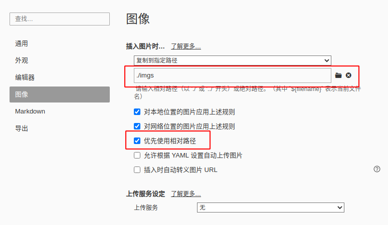
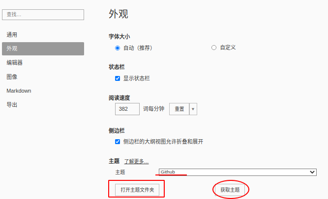
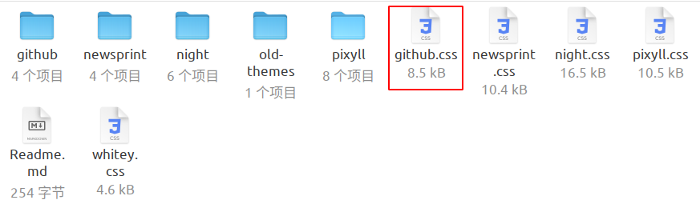
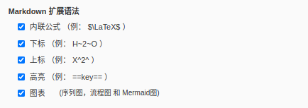
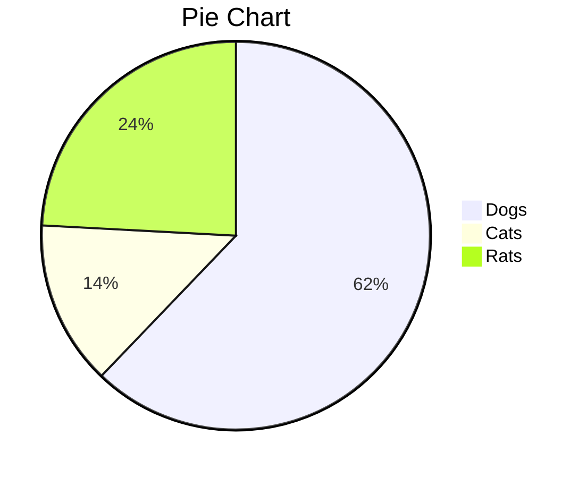
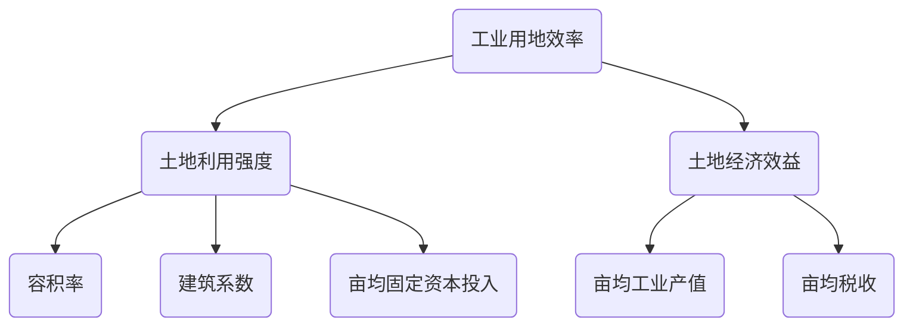
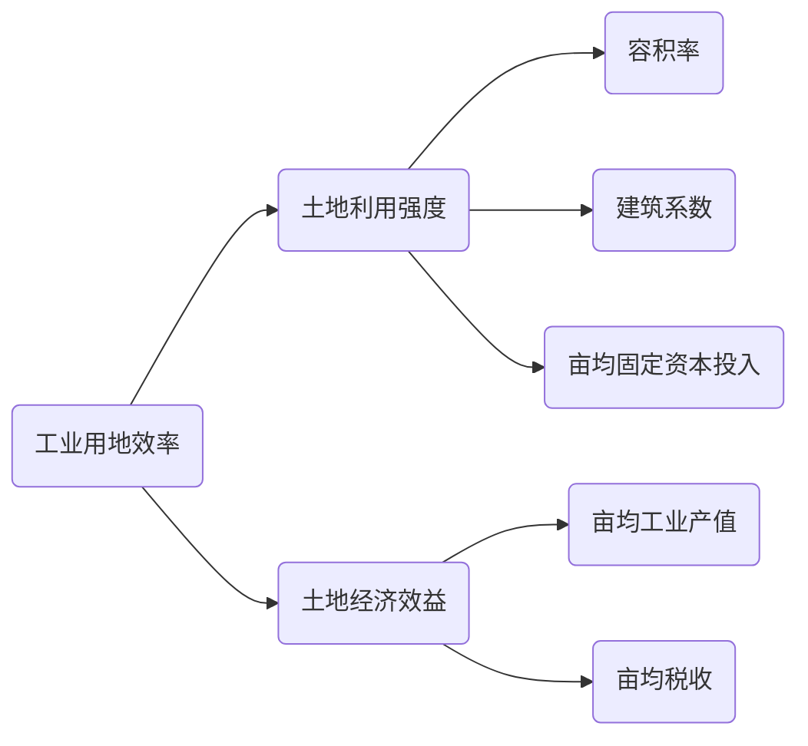

### 01.`Typora`基础使用

https://markdown-zh.readthedocs.io/en/latest/

https://www.lianxh.cn/news/dbbd90d8b96ac.html

https://www.markdown.xyz/getting-started/

https://www.runoob.com/markdown/md-tutorial.html

https://www.cnblogs.com/hider/p/11614688.html

[官方教程](https://support.typora.io/Quick-Start/)

[Markdown Reference - Typora Support](https://support.typora.io/Markdown-Reference/)

`typora`利用`mermaid`绘制各种图形。

https://mermaid.js.org/ecosystem/tutorials.html

主题中文站点

https://theme.typoraio.cn/

#### 1.基础操作

##### (1)常用

`Ctrl+C`:复制

`Ctrl+V`:粘贴

`Ctrl+Z`:撤销

`Ctrl+Y`:重做

`Ctrl+B`:加粗    或在字体两边各加**两**个`*`

`Ctrl+I`:倾斜    或在字体两边各加*一*个`*`

`Ctrl+U`:添加<u>下划线</u>

`Ctrl+ F` ：查找

`Ctrl+Shift+Q`：创建引用  或使用`>`加空格    

> 这是一个引用

`Ctrl+Shift+L`：大纲    左下方圆圈可显示大纲、文件树或文档 

特殊字符：使用***& nbsp***实现换行；使用< br>也可以实现换行；

空格键实现空格

`---`加`空格`:生成下划线

`--删除这些--`：~~删除x线~~

```
# 生成分割线
***
	
*****
	
- - -
```

---

`Ctrl+/`:直接查看文档的markdown源码

`Ctrl+\`：清除格式

`Ctrl+Shift`加 `+`：视图放大，同理加`-`视图缩小。

这是一个脚注：[^sample_footnote]

[^sample_footnote]: 这里是脚注信息

##### (2）标题级别

在“#”后加一个空格后在输入表示标题，每加入一个“#”标题等级减一级。

也可以在`菜单>段落>选择标题等级`

```markdown
# 第一级标题 `<h1>` 
## 第二级标题 `<h2>` 
### 第三级标题 `<h3>` 
#### 第四级标题 `<h4>` 
##### 第五级标题 `<h5>` 
###### 第六级标题 `<h6>` 
```

> `Ctrl+数字`可以快速创建标题

> `Ctrl+0`或者重复设置相同标题将取消标题。

##### (3）有序列表与无序列表

加号或减号和空格组合为无序列表

* 项目一 无序列表 `* + 空格键`
* 项目二
  * 项目二的子项目一 无序列表 `TAB + * + 空格键`
  * 项目二的子项目二
    * 子项目
      * 子项目

> 创建列表后用delete删除列表，但不会删除缩进。

> 用回车将删除列表并取消缩进。

```markdown
* 项目一 无序列表 `* + 空格键`
* 项目二
	* 项目二的子项目一 无序列表 `TAB + * + 空格键`
	* 项目二的子项目二
		* 子项目
			* 子项目
```

使用 数字加点加空格 可创建有序列表

1. 项目一 有序列表 `数字 + . + 空格键`
2. 项目二 
3. 项目三
   1. 项目三的子项目一 有序列表 `TAB + 数字 + . + 空格键`
   2. 项目三的子项目二
4. 项目四

```
1. 项目一 有序列表 `数字 + . + 空格键`
2. 项目二 
3. 项目三
	1. 项目三的子项目一 有序列表 `TAB + 数字 + . + 空格键`
	2. 项目三的子项目二
```

`Ctrl+Shift+[`:快速创建有序列表

`Ctrl+Shift+[`:快速创建无序列表

##### (4)代码展示与公式

使用两边的三个 反单引号“'''” 或者 `Ctrl+Shift+K`来展示代码。

在三连单引号后加入语言名称可以设置相应的语法高亮：

```python
print('Hello World')
```

~~~markdown
```python
print('Hello World')
```
~~~

在简单公式两侧各添加一个  反单引号 “\`”创建行内代码块。

"`Ctrl`+`Shift`+`":创建行内代码块。

##### (5)表格

`Ctrl+T`迅速创建表格

或通过`菜单>段落>表格`来设置。

一个简单的表格是这么创建的： 项目 | Value -------- | ----- 电脑 | $1600 手机 | $12 导管 | 

| 哈哈哈 |      |
| :----: | ---- |
|   1    | 1    |

```markdown
第一格表头 | 第二格表头
--------- | -------------
内容单元格 第一列第一格 | 内容单元格第二列第一格
内容单元格 第一列第二格 多加文字 | 内容单元格第二列第二格
```

##### (6)超链接与图片

`+空格` 插入图片 或使用快捷键`Ctrl+Shift+I`

设置图片宽度的方法是在图片描述后加 `-w + 图片宽度` 即可，比如说要设置上面的图片的宽度为 140，语法如为 ``

当需要一行插入多个图片时，需要使用HTML语法：

```html
<center class="half">

</ center>
```

> 插入图片时，为防止文档迁移间丢失，这里提共两种解决思路。
>
> 一种在本地使用，在写有图片的笔记时，将文档很好的分类，每种文档写在一起，图片放在一起，使用相对路径。

在`菜单>文件>偏好设置>图像`中设置如下：



> 思路二，使用自建服务器或花瓣、gitee等图片网络服务，将所用图片直接传到互联网上，在文档中仅留下图片连接即可。

`[标题](链接)+空格`  插入链接或使用快捷键`Ctrl+K`

##### (7)任务列表

```
- [ ] 任务一 未做任务 `- + 空格 + [ ]`
- [x] 任务二 已做任务 `- + 空格 + [x]`
    - [ ] 任务三 未做任务 `- + 空格 + [ ]`
- [x] 任务四 已做任务 `- + 空格 + [x]`
```

- [ ] 任务一 未做任务 `- + 空格 + [ ]`
- [x] 任务二 已做任务 `- + 空格 + [x]`
  - [ ] 任务三 未做任务 `- + 空格 + [ ]`
- [x] 任务四 已做任务 `- + 空格 + [x]`

#### 2.进阶使用

##### (1)主题

在`菜单栏>主题`中给出了常用的几种主题，设置也不太满意，可以自行调整。

在`菜单栏>文件>偏好设置>外观`下可以进行选择主题、获取主题、打开主题文件夹。



通过打开`主题文件夹>编辑对应的CSS`文档来自定义主题



比如想改变字体大小，可以改变`html`中的font-size属性。

```css
html {
    font-size: 20px;
    -webkit-font-smoothing: antialiased;
}
```

想改变字体样式，可以改变`Body`中font-family属性。

```css
body {
	/*"Open Sans","Hannotate SC"*/
    font-family: "Clear Sans","Noto Sans CJK SC", "Helvetica Neue", Helvetica, Arial, 'Segoe UI Emoji', sans-serif;
    color: rgb(51, 51, 51);
    line-height: 1.6;
}
```

这里将中文字体改为`ubuntu`中常用的`"Noto Sans CJK SC"`字体，当然，计算机中必须已经安装所更改的字体。

> 通常只是第一个值；第一位表示文章遇到的英文都显示为`Clear Sans `字体（也只有英文）；其次遇到的中文，再用 `Noto Sans CJK SC `字体来显示；倘若本机中没有底这两种字体，再顺延尝试第三个 `Helvetica Neue` 字体和第四个 `Helvetica` 字体。

熟悉`Css3`的话就可以轻松的自定义自己的笔记了，包括任何部分。

##### (2)Markdown扩展语法

在`菜单>文件>偏好设置>Markdown`中设置后，则可以各种扩展语法



- LaTeX语法—插入公式

##### `$$`+`文字`+``$$`+`空格`:将插入一个公式

示例：$$f(x)=x+1$$

- 上下标

2^3^			H~2~O代表水分子

- 高亮

高亮的设置需要更改主题，因为默认并没有配置样式。在使用的主题中添加如下代码，就可以使用==语法高亮==了，而且语法高亮的样式可以自己设置。

```css
/*==背景高亮==*/
mark {
    background: #ffffff;
    color: #db3f1e;
    font-weight: 400;
    /*border-bottom: 0px solid #ffffff;*/
    padding: 0.0px;
    margin: 0 0px;
  }
```

- 选中高亮

在主题中增加如下代码，当鼠标选中笔记中字体时会出现选中特效，如下设置效果是背景颜色变为绿色。

```css
  /*选中高亮*/
  ::selection { background-color: #d1ff79; }
```

- 图表

  Typora可以直接在markdown中画流程图，而且语法简洁易懂

  Typora支持三类流程图：

  - sequence
  - flowchart
  - gantt

  ```markdown
  # 输入以下code，然后语言选择sequence就可以了
  李雷 -> 韩梅梅: Hello 梅梅, How are you?
  Note right of 韩梅梅: 韩梅梅心想
  韩梅梅 --> 李雷: I'm fine, thanks, and you?
  ```

  ```sequence
  李雷 -> 韩梅梅: Hello 梅梅, How are you?
  Note right of 韩梅梅: 韩梅梅心想
  韩梅梅 --> 李雷: I'm fine, thanks, and you?
  ```

  ```markdown
  # 多以Flowchart，使用以下code，语法选择flow
  flowchat
  st=>start: 闹钟响起
  op=>operation: 睁眼
  op=>operation: 与床板分离
  cond=>condition: 分离成功?
  e=>end: 快乐的一天
  
  st->op->cond
  cond(yes)->e
  cond(no)->op
  ```
  
  ```flow
  flowchat
  st=>start: 闹钟响起
  op=>operation: 与床板分离
  op=>operation: 睁眼
  cond=>condition: 分离成功?
  e=>end: 快乐的一天
  
  st->op->cond
  cond(yes)->e
  cond(no)->op
  ```
  
  ```markdown
  # Mermaid是另一个流程图生成的引擎，在官网中它是这么介绍自己的
  # Generation of diagrams and flowcharts from text in a similar manner as markdown.
  # 除了Sequence和Flowchart两类图之外，Mermaid还提供一种叫做gantt的图。插入下面的代码，然后语法选mermaid就会自动渲染成gantt图了。
  gantt
          dateFormat  YYYY-MM-DD
          title 快乐的生活
          section 吃一把鸡就学习
          学习            :done,    des1, 2022-07-16,2022-07-16
          疯狂学习               :active,  des2, 2022-07-17, 3d
          继续疯狂学习               :         des3, after des2, 5d
          吃鸡！               :         des4, after des3, 4d
          section 具体内容
          学习Python :crit, done, 2021-05-06,72h
          学习C++          :crit, done, after des1, 2d
          学习Lisp             :crit, active, 3d
          学习图形学        :crit, 4d
          跳伞           :2d
          打枪                      :2d
  ```
  
  ```mermaid
  gantt
          dateFormat  YYYY-MM-DD
          title 快乐的生活
          section 吃一把鸡就学习
          学习            :done,    des1, 2022-07-16,2022-07-16
          疯狂学习               :active,  des2, 2022-07-17, 3d
          继续疯狂学习               :         des3, after des2, 5d
          吃鸡！               :         des4, after des3, 4d
          section 具体内容
          学习Python :crit, done, 2022-07-16,72h
          学习C++          :crit, done, after des1, 2d
          学习Lisp             :crit, active, 3d
          学习图形学        :crit, 4d
          跳伞           :2d
          打枪                      :2d
  ```

<http://bramp.github.io/js-sequence-diagrams/>, <http://adrai.github.io/flowchart.js/>

##### (3)HTML框架实现自定义笔记

或许大家已经发现，这里的`Makdown`语法实质就是前端的静态语言，主要是`html`和`css`那就简单多了，直接使用`html`框架来写笔记，还有比这更花哨的吗？

<span style="color:red;background:#ccc;font-size:25px;font-family:'微软雅黑';">一段文字</span>

```markdown
<span style="color:red;background:#ccc;font-size:25px;font-family:'微软雅黑';">一段文字</span>
```

<span style="color:red;background:#fff;font-size:25px;font-family:'Noto Sans CJK SC';">我在想是不是<span style="color:blue;background:#fff;font-size:25px;font-family:'微软雅黑';font-weight:700;">我可以找到他的head</span>，还可以插入**js**或者**css选择器**，<u>搞一个花里胡哨的笔记</u>，<span style="color:pink;background:#111;font-size:25px;font-family:'微软雅黑';">事实上没那个必要</span>，<span style="color:red;background:#ccc;font-size:25px;font-family:'微软雅黑';">下面我进行了尝试</span>，==结果似乎并不尽如人意==。</span>

<div class="map">
    <div class="city">
    	<div class="dotted"></div>
        <div class="pulse1"></div>
        <div class="pulse2"></div>
        <div class="pulse3"></div>
	</div>
	<div class="city tb">
         <div class="dotted"></div>
         <div class="pulse1"></div>
         <div class="pulse2"></div>
         <div class="pulse3"></div>
     </div>
</div>


==文本高亮==，__加粗__，*斜体*，==***斜体高亮加粗***==，~~删除线~~，<u>下划线</u>。`<font>`标签被我用于一款小标签样式（[小康](https://www.antmoe.com/posts/3b43914f/)）：<font>红色小标签</font>，可以通过设置`background-color`属性控制背景色，如：<font style="background-color:#8bc34a">绿色小标签</font>，为了方便，我提供了五种预定义的颜色（包括前面的红色、<span alt="glow">绿色</span>）：<font title="blue">蓝色小标签</font>、<font title="yellow">黄色小标签</font>、<font title="gray">灰色小标签</font>。一些强调型格式：<span alt="underline">下划线</span>、<span alt="emp">着重号</span>、<span alt="wavy">波浪线</span>。其他：<span alt="hide">隐藏文本</span>，<span alt="hollow">空心字</span>，<span alt="blink">字体闪烁</span>

提供另一种常见表格样式：

<div alt="three-table"> <!--alt还可取值为"notitle-table"，一种无表头的小型表格-->
<table>
  <tr>
    <th alt="left">标题1</th>
    <th alt="center">标题2</th>
    <th alt="right">标题3</th>
  </tr>
  <tr>
    <td alt="left">居左：alt="left"</td>
    <td alt="center">居中：alt="center"</td>
    <td alt="right">居右：alt="right"</td>
  </tr>
  <tr>
    <td alt="left">x</td>
    <td alt="center">y</td>
    <td alt="right">z</td>
  </tr>
</table>
</div>
<div alt="fig">表1.&nbsp;&nbsp;&nbsp;&nbsp;三线表</div>

插入音频

<audio controls="controls">
  <source src="./temp/The Sound Of Silence.mp3" type="audio/mp3" />
</audio>

可以将`<audio>`音频包裹在`<center></center>`中居中显示

Typora导出的HTML文件，图片不显示注释及阴影等特效，部分样式地址为<span alt="str">file://</span>本地文件，一旦将HTML文件拷贝到其他计算机，就会显示异常，这些问题可以通过脚本修复，执行`python export_html_help.py <HTML文件>`，这会在HTML文件所在目录下生成一个<span alt="str">.temp/</span>文件夹，其中是<span alt="str">file://</span>本地文件的拷贝，为方便，可考虑将引用的资源（图片、视频等）文件均放在此目录下，当然，也可以通过`--output`参数更改默认的<span alt="str">.temp</span>名字

插入网易云的外链播放器（`<iframe>`，可嵌入油管等平台视频）：

<iframe frameborder="no" border="0" marginwidth="0" marginheight="0" src="//music.163.com/outchain/player?type=2&id=1342183925&auto=0"></iframe>

<video src="./temp/难破船.mp4"></video>

<details>
    <summary>折叠标签</summary>
    青青子衿，悠悠我心
</details>

目前支持绘图



更多绘图参考[官方文档][]（这是另一种参考链接写法）

任务列表：

- [ ] 未完成任务1
- [ ] 未完成任务2
- [x] 已完成任务1
- [x] 已完成任务2






https://mermaid.js.org/syntax/flowchart.html#graph

https://baijiahao.baidu.com/s?id=1747381825446999628&wfr=spider&for=pc
