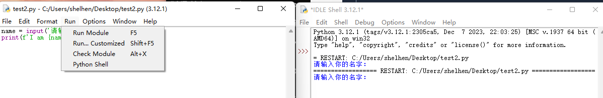
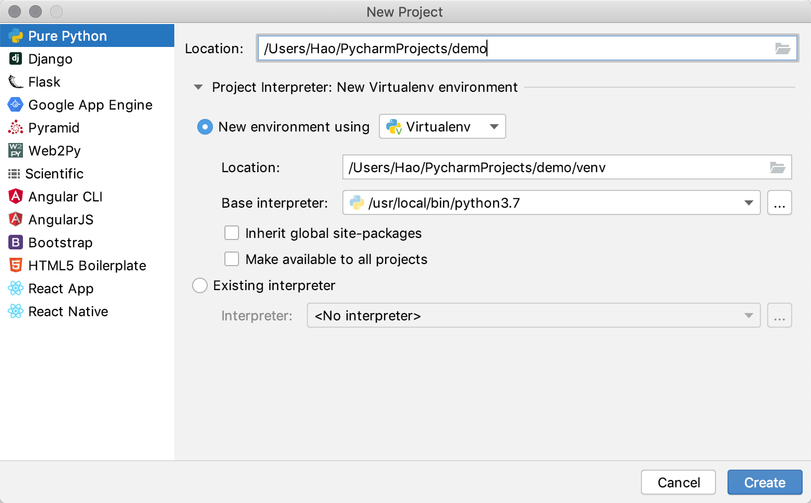

# 01.`Python`使用入门

## 一、程序设计语言概述

### 1.程序设计语言与计算机程序

程序设计语言也叫编程语言，是计算机能够理解和识别用户操作意图的一种交互体系，它按照特定规则组织计算机指令，使计算机能够自动进行各种运算处理。程序设计语言发展经历了机器语言、汇编语言到高级语言的 3 个阶段。其中，机器语言和汇编语言都是直接操作计算机硬件的编程语言，只有计算机工程师在编写操作系统与硬件交互的底层程序或对程序进行反编译等情况下使用，这两类语言与具体 CPU 结构相关，不是当今程序设计主流方式。相比机器语言和汇编语言，高级语言是一种与计算机硬件无关、用于表达语法逻辑、更接近自然语言的一类计算机程序设计语言。

**计算机程序就是按照程序设计语言规则组织起来的一组计算机指令。**

> 为什么不能用自然语言，如中文直接编写程序呢?
>
> 自然语言具有不严密和模糊的缺点，存在计算机无法理解的二义性，现代计算机还不具备准确理解这种模糊性的完备智能。相比自然语言，程序设计语言在语法上十分精密，在语义上定义准确，在规则上十分严格，进而保证语法含义的唯一性。

### 2.编译语言和解释语言

高级语言根据计算机执行机制的不同可分成两类：静态语言和脚本语言，静态语言采用编译方式执行，脚本语言采用解释方式执行。如C、Java等是静态语言，PHP、Shell等是脚本语言。无论哪种执行方式，用户使用方法都是将源代码（高级语言代码）转换成目标代码（机器语言代码）的过程。执行编译的语言是利用编译器(compiler)将源代码转换成目标代码，执行所有代码后获得输出（执行编译的计算机程序称为编译器），执行解释的语言是利用解释器(interpreter)将源代码逐条转换成目标代码同时逐条运行目标代码。

编译和解释的区别在于编译是一次性地翻译，一旦程序被编译，不再需要编译程序或者源代码。解释则在每次程序运行时都需要解释器和源代码。这两者的区别类似于外语资料的翻译和同声传译。

|      | 解释式语言                                                   | 编译式语言                                                   |
| :--: | ------------------------------------------------------------ | ------------------------------------------------------------ |
| 优点 | 一般支持跨硬件或操作系统平台，具有良好的平台兼容性，在任何环境中都可以运⾏，修改代码的时候直接修改就可以，可以快速部署，不⽤用停机维护。 | 编译器一般会有预编译的过程对代码进行优化。因为编译只做一次，运行时不需要编译，所以编译型语言的程序执行效率高，可以脱离语⾔言环境独立运行。 |
| 缺点 | 解释执行方式逐条运行代码，无法通过纵览全部代码进行优化，因此执行性能略低。 | 编译之后如果需要修改就需要整个模块重新编译，编译的时候根据对应的运⾏环境⽣成机器码，不同的操作系统之间移植就会有问题，需要根据运⾏操作系统环境编译不同的可执行⽂件。 |

Python 语言是一种被广泛使用的高级通用脚本编程语言，可以采用解释方式执行，但它的解释器也保留了编译器的部分功能，随着程序运行，解释器也会生成一个完整的目标代码。这种将解释器和编译器结合的新解释器是现代脚本语言为了提升计算性能的一种有益演进，目前大部分代码都开始结合编译与解释执行方式 ，如Javascript、Matlab等。

> 动态语言与静态语言：
>

从计算机诞生到应用的 70 余年历史上出现过 600 多种编程语言，至今仍然广泛使用的不超过20种，很多编程语言生命周期都十分短暂。一个编程语言能否流行，受到内因即语言设计的先进性及外因即技术时代对编程的支持和需求等多方面因素的影响。

### 3.程序执行原理

计算机中包含有较多的硬件，但是一个程序要运行，有 **三个** 核心的硬件，分别是：

| 硬件     | 功能                                                         |
| -------- | ------------------------------------------------------------ |
| **CPU**  | 中央处理器，是一块超大规模的集成电路，负责 **处理数据**/**计算**。 |
| **内存** | **临时** 存储数据（断电之后，数据会消失），速度快，空间小（单位价格高）。 |
| **硬盘** | **永久** 存储数据，速度慢，空间大（单位价格低）。            |

程序 **运行之前**，程序是 **保存在硬盘** 中的，当要运行一个程序时，操作系统会首先让 **CPU** 把程序复制到 **内存** 中，其次**CPU** 执行 **内存** 中的 **程序代码**。

![image-20230927003900133](data:image/png;base64,iVBORw0KGgoAAAANSUhEUgAAAvYAAAC6CAIAAABKhp5JAAAgAElEQVR4nO3deVyNef8/8M/Z2hdLKS1Hi5IiqZsiwk2IihlaVJYWcmPshq+MbSzJEpJsUWkha+5G2Rt3pHuGkLVFm442UUrbOZ3fH9fM+Z07yVqnrl7Px/xxXZ9rOe/T9MnrXNfncx3GiRMnoqOjCUArc3Nzc3FxkXQVrevkyZPoTdDaOnpXQjeBtuHm5saMjo5OTU2VdCVAc6mpqZ3hjxp6E7Q2GnQldBNoA1RPYRNCLC0t4+LiJF0P0NmkSZMkXUIbQW+CVkWProRuAq2N6ilMSZcBAAAA8P0h4gAAAAANIeIAAAAADSHiAAAAAA0h4gAAAAANIeIAAAAADSHiAAAAAA0h4gAAAAANIeIAAAAADSHiAAAAAA0h4gAAAAANIeIAAAAADSHiAAAAAA0h4gAAAAANIeIAAAAADSHiAAAAAA0h4gAAAAANIeIAAAAADSHiAAAAAA0h4gAAAAANIeIAAAAADSHiAAAAAA0h4gAAAAANIeIAAAAADSHiAAAAAA0h4gAAAAANIeIAAAAADSHiAAAAAA0h4gAAAAANIeIAAAAADSHiAAAAAA0h4gAAAAANIeIAAAAADSHiAAAAAA0h4gAAAAANIeIAAAAADSHiAAAAAA0h4gAAAAANIeIAAAAADSHiAAAAAA0h4gAAAAANIeIAAAAADSHiAAAAAA0h4gAAAAANIeIAAAAADSHiAAAAAA0h4gAAAAANIeIAAAAADSHiAAAAAA0h4gAAAAANIeIAAAAADSHiAAAAAA0h4gAAAAANIeIAAAAADSHiAAAAAA0h4gAAAAANIeIAAAAADSHiAAAAAA0h4gAAAAANIeIAAAAADSHiAAAAAA0h4gAAAAANIeIAAAAADSHiAAAAAA0h4gAAAAANIeIAAAAADSHiAAAAAA0h4gAAAAANIeIAAAAADSHiAAAAAA0h4gAAAAANIeIAAAAADSHiAAAAAA0h4gAAAAANIeIAAAAADSHiAAAAAA0h4gAAAAANIeIAAAAADSHiAAAAAA0h4gAAAHQ8755m3pkwXVBTI+lC2i+2pAsAAADoXKpf5D1dtVW8RcPJPs1rWbM7m+7foj19imj1xZ7Q6hd5hJC3fzx4n1f4ROw83Ydbakyd2Dold0iIOAAAAG2KJS+nbGH6+uad9zkF2jOdCCFdBg0Y+eAytTU/9MS7p1kmO9ZQq9Kq3cWP5Z2K53RVVhpg3GXQgO4jrBgsFtVekpgk5AsQccQh4gAAwLeqqqpSUFCQdBUdhoyaqsHKeZUPnmi6OhqsnEc1ll5Lrsl7SQipzsqtKyp5nZRCCGEpyGs6OzQ5vOcP47lerhmb9xZduDIwbJdiXwNCSMObirZ9Ex0AxuI0VVdWXlPAEwqFki4EgD4yt+0vPBH3+TsXXbjcqvV0BmlpaRs3bmyzl4uIiDA0NNy4cWN2dnabvWhHV3b9lsroYaLVnODwnJDjpVeTqzJzal+VlF5NLoyNf7z8148dbui3kOvtmjLWreEtwk3zEHH+IqipSf/plys6VpdUB1zhWl5UMHy4YE1dSdlfW+vqLmlYiP93rY9N6iSv8tt/UjvkhcZc0rCg7o+Kyz0YeUnD4n1+YZu+mY6spv0NnWuHJXU4pZd/r85u2juaJaipyfh1N4PDae2S6KqioiIkJMTCwsLc3PzQoUNt9rosFiszM3Pnzp29e/ceOnTo/v37X79+3Wav3hFVPn7Or37fdbCZeCPX09kiep+W+w/dhw+2iN7Xd/PPok1lv6fctHK4aeVQ8eBJxuYgajn/6AlO1y4p4z1uWjm8OnPx1ZmLN60cHviubPN3007hRhUhhNQUvrpjN+N9bkHvFXO7WQ8SvK8p/u1aQcTp10kpw5LPcrooE6Gw7lVJ91FDek4eTwhpbGh4k3K39GpycfzV4SlxXQcPFFTX1L0qEfIFTc7Mr6que1Ui5PMl8bY6mFu3boWFhcXGxlZUtK9PJKNGjdLU1Jw1a5adnR2bjS7zNfjvqlnych/b+qfrvLLrt6hlIV8gqK6557GQwWrmA5iGs4Ppvk2tVWUHd/PmzSNHjpw+fbqhoWHixIlcLjclJaXNXp3FYhFCioqKLly4EBkZuWjRosWLF9vZ2Xl4eDg4OMjIyLRZJR1F3qEo0tiYPPxHQgiDxRp+6zwhpDD6fOWDJ5UPn9a/fvPAd2Vdablof/neOr2X+TbW16d5LtP513S5XlrvcwvkdLT//wlDTxBCenm7Sql0a/N3007h7zUhhDz9P/+aAt6w5HPKpn2pFnX7McoD+z30XZW142DfTX/l6C7m/fUWeomOqnj49PcBY7MDj/wjJlgCRdNFQUFBREREeHh4ZmamrKxsO7xkUl9fn5CQcPbs2R49enh4eMyaNat///6SLqpdu2YwvP71G/GWhsp3lY+eZ2zcLd446NxhlRFDCCGGfj/p/Gs6IUQoaLzntkB3wayeUyc0e2ZpNdVWq7qjKi4uDg8PDw0NzcjIMDAwWLdu3cyZM9XV1f39/ZOTk9usDCr9S0tLu7i4uLi4lJWVnThxIjIy0tnZWVlZeerUqR4eHiNGjGAwGG1WUntW+6o471B0Y22d4eqf6l+/eTBnJSGECIVyutpdLQc2vK0kDEZXy4Hv8wrf/vmAOkRWs6esk33B8TPS6qr6y3zrikoeLljTa7Zbn3VLmBwOIaQsKYUQouFkL7m31e4g4pB3z7JeRp0zWP2TKN9Qes12q0h71Fhb97EDlU37yhvovP+8y+/QRE1NzdmzZ8PCwq5fvy4rKztlypSDBw9mZWXNmTNH0qU1w9PT09fXNywsLDIycteuXebm5rNmzXJzc+vevfunD+58Gioqe6+a1816ELXaWFuXYjut/54NCsYGon1SbN2EDX9d3VTq/1fXywmJYHDYfbetZsvJtnHNHY5AIEhMTDxy5Eh8fDyHw5k6deqhQ4dGjBghvk9tbe21a9cEAoFAIODz+YK/ff4yn89vbGz8nP3z8vIIIXw+X0pKihCioqKyYMGCBQsWZGZmRkVFBQcHh4aGamtru7u719fXU/t0ZlnbDygaG1Tce6Q61qaWVyxq7zrEguvlWv+mgiktxfVyfXv3Yf6xk6KtFWmP0n/6pe/mnxkMhkxPtRF/Xrw7bX7K7T8HHPAvS0opPHlBd95MSbyb9gsRh7xJuUsahVpuk5u0MxiMASFbmz2EUssrqn6Rrzbhn61ZHQ2Jbki9e/fOxsYmNDR06tSp1FyMFy9eSLq6jzI1Nd21a1dAQMDFixfDwsKWL1++fPlye3t73MBqlqKxYfe/I075nXtESDSc7TnKSqIdPrwPVVdW/swvoH/wJgaD3LGb/uE5lUz7Gm9b3Xo1dyDXrl3z9PQsKCgghEycODEsLExFRaXJPk+fPq2qqhozZkzLp2L9jc1mf8syh8MhhAgE/3Ozvrq6Ojk5+cqVK2VlZaqqqs7OzjNmzHjy5Ml3/WF0SEoDjHtOmXBr2I//08pgPN8Q+GJPaMObisa6+mt9bJp8xq4tLu01x113/ixqVVZbY2jSqeqsXMJglF39j/aMqTpzPdrsLXQI+LtMqjJeEAaR09X+5J51xaVv7z4khAj5gjd37hWevEAEjZqujq1fIx3U1NRs3ryZuiGlo6OzZMmSmTNn6urqiu9TXFxMCJk0aZKEamxedna2lpYWtcxmsx0dHR0dHcvKyqKjo8PCwhwdHUU3sCRbZ7tVkphECMk/elJ/yewWdnu8ZL2isYHWtMmNDQ3qP4wX31SdmfNi9xFl836tW2jHMXr06JSUlOjo6MjIyN9++83Y2NjFxWX69OmDBw8W7WNhYREbG/v06dMWognr70eqfLuTJ0+6urqKIs5///vf0NDQmJiY6upqW1vbU6dOTZo0iYNR5H/jznSqK206HNt42+q6V8VSKt0eL/9VaYAx9bg/8aH3qqOHFUafvzdj0YcnZMpI15eVP1m1tZevh+jTBSDikMa6evJ5M8RfRp57GXlOtMruomQcsFrL7YfWqoy+PnY/vgPN1Wf8TdKFtHd1ZeUvAg9zZ097viGQwWHrLfBsdrenawJeRp4zO7aTEMLkcHTmuIs25YRE5B87OeBwAHeWcxsV3RFoamquWLFixYoV6enpx48fj46O3rdvn4GBgYeHh7u7u76+PovFEgqFOjo6bVMPdSGzpKTk6NGjR44cSU9P53K5y5Yt8/T05HK5bVNDR1d243ZO0LEhl6PKU+7127tRobdukx2EAsHL42cN1izkdFF6GXVOWrW76libmvzCvMMxRr8uJ4Tk7D2qamuDiCOCiEPk9XsRQmryChX66DfZVHzxemX6M9FzmbjergarF1DLbAV56R5iV4YZhBAibGxscgZqjhWDicn5RFZW1s/Pz8/Pj7pRFRgYuHHjRhsbm1mzZoluVKmrqxNC4uI+9wEqbcPc3Fxb+6+LfHw+PyEhISwsLD4+nhBib2+/fv163KhqQcavu6V7qJju26Tt8WPK+OlsOVmul2uTfbJ3Hcr0D2YpyjM+uKiQHXg4a/uBoVdilAfiEk7z+vfvHxAQ4O/vn5SUdPz48R07dqxbt27IkCEqKipNbhu1KuqCkJGREYPBcHR03L59u62tLRN/+j6l6MKVhvK31LLOHPeqZ1m/m9vJamt8mG9EdOa4y2prVNxNlzfU673M901q2svjZ3sv8yWE8E7Ft1HdHQR+/4iSmQkhhHfm4oebMrcEvTqbIFrldFGS1+tF/fc/+YYQuV5ahJCaAl6TM7z+PYWwmDIaat+/7g7L2tr68OHDRUVFx48f53A43t7e6urqs2bNSkpKas9XcdLT05ctW6apqeno6Jibm7tjxw4ej3fmzBkHBwfkm4/JDNifE3TMZNdappRUdxsr88i9D+f5vb55R3yf6pz8J//nbxEVpGCoRwhpqHz37kmG6L/qrFwFQz2mtBS1WpWZI6G30t4xmcx//vOfx44dKy4uPnHiRPfu3RMSEto44vTt29ff37+wsPDUqVPjxo1DvvkcuQeO885cpB4A2MjnS/dQqS8rr8l7+XDBmg8ftAZfCn+aSXfrQd2GDXqxJ1TL/QcqqVBe37xTfvtPo19XfM5JFE0MCSG8k//uYWsjamyoqCy9dkvBUI/Z6acPfEhWVtbd3d3d3V00aTw8PFxWtp3Oozl27Nj+/fsxafwLNDamL1qbG3Lc7NgudQdbqk3jR7u3S3z+mDJnxP1Loh3ldbmjHl9T6K2btf0AIaT0yn/uus4TbRU2NhKhMGnAWGpVTld7dMZ/2vBtdDyysrLi07bb7HXHjRvn4ND0ewbgk6wuRrBkZIRC4fNfd+eHnmBKS1n/56y0areMLftumIxW6NtbqV8fNfsxms4Of0yZ/fbeI0JI8rAfGGx2XXEpU0rq5fEzgtq6horKq/rWhJDawqLHyzY+X79rcFyoUj8jSb85yUPEIYSQfoHrUsa6/8fSwWjTim7Wg5hSnJLLN5/+n79Sf6PeK+Z+zhnk9XW4s6flH4lhycpwvV1lNNSqs/OebwgU1jf03YIHTbZEW1tb/AZWbGyspCtqSkpKys7ODjOnvgyDIaiusboYoTpmuHhz300/sxUVmjzeRvyavMaUCRoNuaLVZ+t3Vdx9aPnvsNaul36oadtt9nKYB/6lpFS6jSu5z5KRIYQwGAyp7l3779ukZjeKul07MHRH3y0r3/73fsX9x0QoJIT02bhcUPX+M08up4vxT4Qg4lC6/GPAiHsJ931WPJy/RljfQAghTAbXy7Xv1lWffwGm3+4N0mqqLwIP5+z768+xtIbawIjd1AOR4ZOsra2tra337t0r6UKaunHjRru9vNR+MRhmR7Y308xiGa7+qe3LAWhvGAyG+FeIf/hIGxk1VXUHW9FFUCWTPm1XHF0g4vxFTkd76NUTjQ0N7x5nMNgseQNdlrS0aCtLRsZRWNDyGdhysn1/XdFn7eKa/MLaolI5rqaMVk/MuPlS7TBMtMOSOrpGPl/YwCefM1bjgyH8AACfCRHnfzA5HGUzk288g7y+jrx+G03UBOhAqrJyHi/dyJSWqisqFTY2dvn4c24aKt9l7zxEGIyXkWfV7D/x8DoAgGYh4gDAd9bzRztZTfUP2+V0tLtaDiSEMDjs/sGbOV2UxbeqjBoqq61BLXOUFOvLygW1dZruP+CBrQDwdRBxAOA7G3DAv9l2Jptt6LfwY0eZbF8jvmoavPk7lwUAnQyeWwAAAAA0hIgDAAAANISIAwAAADSEiAMAAAA0hIgDAAAANISIAwAAADSEiAMAAAA0hIgDAAAANISIAwAAADSEiAMAAAA0hC9wAJCYkydPRkdHS7oKkDA3NzcXFxdJV9HeobMA+fLOgqs4ABITHR2dmpoq6SpAklJTU/Ev9+dAZ4Gv6Cy4igMgSZaWlnFxcZKuAiRm0qRJki6hw0Bn6eS+orPgKg4AAADQECIOAAAA0BAiDgAAANAQIg4AAADQECIOAAAA0BAiDgAAANAQIg4AAADQECIOAAAA0BAiDgAAANAQIg4AAADQECIOAAAA0BAiDgAAANAQIg4AAADQECIOAAAA0BAiDgC0O+Hh4f/+97+/9KjXr1//9ttvv/zyS3V1dWtUBdDhvHz58urVq19xYEVFxZw5c0pKSr57SW2JLekCAKBjKC0tbWxsVFNTa+0Xqq6uXrp06ZQpU96+fUsIsbOzKyws3Lt3b5PdhgwZ4uPj8+bNm/nz5+fk5OTm5paUlBgbGw8bNuzx48ejR4/+8Mw5OTkqKirUMofDEd/E4/E4HI6qqqp444sXL7S1tb/ne4PO7f3790VFRbq6ugwGo/VeJSkp6eLFi2lpaffv3y8rK1NWVn7y5Imdnd3Dhw+b7Mnj8Xr27Ekt379/v8lng9TU1HXr1nl4eIg3du/e3cjIqPWK/74QcQDoLD8/38rKSrTKYDDU1NSMjY2XL19uZmbW8rF8Pv/Zs2f9+vWjVpctW/bmzZuvuLjypUJCQpSUlAQCwblz5+Li4p4/f66oqGhsbMzj8YKDgzdt2sRgMBITE1kslo+Pj7Kysrm5+ZQpU16+fLlz58709PT79+/r6OhER0dPnz791q1bsrKyhJCoqKioqKhu3bqJv7sXL16oqqry+fyuXbsSQoRCIZ/PLy0tlZGRIYQ0iTvQaX1LJyKEpKWlDRw4kFq+fv26g4NDTU0N9TvWSh49evT8+XM5OTlCyP379/v3789kMgkhISEhLi4u1D4VFRW6urriR82cOfPVq1eKiorijZcvX758+bJ4y9ixY0NCQlqv+O8LEQeAzvh8/qtXr3bs2GFiYkKt3rlzJz4+fvDgwXfu3DE3N2/h2NmzZ1dXV8fGxrZVsYQQ8vjx43Xr1iUkJNjY2MydO9fb27t3796EkGXLlm3ZssXBwWH58uWEkMLCQqFQSAhhMplxcXE7duyQl5cnhAiFwokTJ8bHxzs4OFhYWISHhwcEBGRkZOzZsycoKIj6Qy+ioKCgoKDA5/ObNLbqPz/Q4XxLJ7p48eLEiROp39U2s2DBggULFly9ejUtLW3AgAGidnl5eSrNf4y/v7+Xl1frF9h2EHEA6M/Kysra2ppatre3X716tYaGxs6dO6Oiolo4qq6urk2q+x9+fn4cDufAgQPBwcGnT5+2tbV1c3Pbv3//rVu3tm3bRl1Dqq+vT09Pt7e3pw6xtbU9ePCgs7MzISQ1NVVaWpr60BwVFTV8+HAej3f58uWZM2dOmzatyWs1e79AdPGmtra2Vd8pdCwdqBPV1NQIBIKamhqhUFhVVUUIUVBQIIQ8evRINC6Ham+Wvb19UVHRh+1SUlK3b99unZJbCyIOQKcjJyfn4ODw/PnzxMTE8+fPBwcHs1gsalN1dfXChQsHDhyYlpaWmpra2Njo7e3dq1evtWvXUjtkZWUFBATcu3dPR0dn7dq1pqamotMmJiZGREQ8f/5cT0/PycmJyhyEkCNHjrx//37UqFGBgYEPHjzQ19f38/MT/3ApLigoSFdXd9iwYcnJyePGjZs6derixYsXL17s4uISGRlpY2MzaNCg7Ozsfv36TZ48mTpkzpw5rq6u1AflvLy8mTNnEkIaGxvT09N79eoVFRUlJSXVs2fP0tJS8XtP5eXlouWSkpJNmzZt3bqVagwKCjI2Nh49erSysvJ3+pED3XyyE02bNi0mJiYvL48Q4u3tTQjx9/endmhoaNi2bdvVq1elpaXd3d09PT1Fp/1YJ3rw4MHevXt37doVEBBw48YNBQUFV1fXj11xcXZ2jo+Pp5apG081NTV9+vRJTExMTEwU7WZqatpkRBpl/fr1TZJZXl7ekiVLVqxY8TU/KYnCjCqATkcoFCYnJ2tpaRkYGBw6dCghIUG06cyZMxEREUZGRlwuV05OTk5OjsvlqqurU1sLCws9PT2trKxcXV3T09Otra1Fn/a2b98+adIkHR0dPz8/U1NTLy+vZcuWUZtu3rwZHBzs6urK5XJdXFzS09OHDh3K4/GarU1bW5vBYMyYMcPKyoo6j4yMjLa29t27d6nP0Bs2bLh27drNmzd79epFCKmtrQ0PD7ezszt16lRlZWVubq6MjMypU6d0dHSok+Tm5p4/f/7atWva2tpUScXFxVevXr0rZsOGDUlJSbdv36ZWq6qqVq5ceffu3evXrxcXF7fa/wfowD7Zifr06cPlcqnh7Vwul8vlstl/XVPw9PQUCAS+vr4cDsfLyyssLIxqb6ETFRQUHD161NHRMT8/39vbm8Ph+Pj4HDlypNnaIiIieDyej4+PhoYGj8fj8XgyMjKxsbEPPiAafS/uH//4h4WFhZ+f34MHDywtLUtLS1etWnX48GHqHnEH4+jo6OjoKARoTZ3k1+xL32Yb/Fiys7MJIZcvX3737t27d+/Ky8sTEhJmz55NCDl79qxQKBw7duzkyZNF+48aNerHH3+klqdNm+bk5CTaNH36dELI7du3qdWsrCxCyO7du4VCYWZmppSUVEhIiGjn+Ph4BoORkpIiOjA5OZnaVFBQQAjZvn37x2pms9lLliwZPXq0paXlypUrZWVleTze77//3qdPH6FQaGFhERERIdq5qqrKycnJycmpX79+srKy1PLdu3dPnz5dX18vFAqHDRt28uRJoVD47NkzqvjExESLv5mbm3M4nK5du1Kr+vr6DAZj4MCBoh0SExO/6X/Ap7TD35nW9nVvQYJv/Fs60dmzZwkhok3UndbFixeLWgYOHGhtbS38VCeiDly4cKFo65AhQwYPHvyxmuvq6lRVVRkMBtVZ4uPjpzfHz89PdIihoWFMTIxo9cmTJ2PHjtXU1FRXV79///5X/Ny+uy/6HaB2xo0qAPobO3as+Kqenl5oaOgPP/xACJk7d66zs3NxcbGamlpubi413fRj59HS0hJNLdHX1zcyMsrNzSWEXLhwoaGhYcqUKaI9x40bp6ioePr0aWp/ExMT0TgGLS2tAQMG5OTktFBwly5d5OTkqLlO1Bjh2NjYsrKykSNHPn/+fMuWLaGhodra2sePH5eXl6cGRJubm0tLS4eEhHTv3p0QUl1dfe3aNUJIfn7+H3/8oaSkRJVB1TZu3Dhq09y5c6uqqhITE6nZJXw+39PTMy8v7+jRo9QwZwDK9+pEhBDR7SdCiIODA3Ux5pOdiBDi6+sr2mpvbx8YGPixlzhz5oyenh6LxQoKCuratauqqir1y19XV7du3bpFixZRc8V79OghOqS4uFhDQyM+Pv7du3dUy6xZs+Li4k6fPp2YmPjkyROqcciQITo6Oi3+qNoRRBwA+ouNjbWwsCCEMJlMNTU1ah41xcHBoUePHuHh4T///HNERASXy23yp1ycmZmZ+PhcdXX1+vp6QkhWVlb//v3FR7qw2WwbGxvqSg8hpMn01J49e7Y8mHfp0qVHjx7l8XgrV67cuXNnWlpaREREUFCQnJzcqlWrxowZY2NjIz679cKFC9nZ2XV1dWPGjLl06VKPHj127NhBxa/i4uKTJ09SE1/Xrl1LPefmzz//PHr0aHR0tJOTU2RkpGgyOZvNpl5o5MiRtra2M2bMGDlyZKs+wgQ6iu/ViQghojnkhBA1NbWGhgbyGZ2IEKKnpydaVldX/1gnqqio8Pf3/+WXX5YuXXrs2LHhw4c/ffp05cqVhJCqqqp169Z5eXmJj6IjhNTW1lZUVGhoaBw4cCA/P1/UnpKSYmxsTF1DEgqFKSkp58+fR8QBgHZEQ0ND/I+jODab7ePjc/To0RUrVoSHh3t7ezeZWd0C4d9TYVVUVHJzcxsaGsRHL2ZkZAwfPvxLSxUIBAKB4NSpU3fv3n3z5k1MTExtba2cnNyuXbuoccTbtm0bPHiwk5OT6JDy8vI1a9Zs3rw5ICDAxcVl5MiRN27ciIuLo7aamJisWrWKullGCQwMXL16NYvFGjx4sJyc3IYNGwgh1DiDHTt2UPuMHDkyMjLy/PnzS5YsEQ21hs6slTqRyHfsRIsWLXJ1de3SpQshxMTEJCEhQVlZ+dChQ+TveYKnT5++c+cOIWT8+PFcLpcQQo0509TUjI6OFj+VoqIilfgJIevXr1dQUHBwcPjSeiQIw40BOjsfH5+srKytW7fm5eV93VMxrKysKisrb926JWrJzs7OyMgQf2DaZyopKWEymQkJCQ8fPszIyDh37lx9fX1ubu7NmzdnzJgxY8aMnJycgwcPUsu5ubl8Pt/Z2XnOnDnUfaVVq1bZ2trm5eXF/K2ioiIlJYVapj6MUo+lNzMzMzQ01NfX19fXj4qKKikpKSkpiYqKolosLCz4fH52drZovCdAC9pPJxIIBH/88cfChQtFLZaWlvX19dR0KmrS+K1bt6hV0fcz5Ofnd+nSRfzSVBMXLlwIDg4+duxYx7qoias4AJ2dtrb2xIkT165da2dnp6mpKWo3NDSMjY199uyZmppay08MmzBhwsiRIxcvXnz69OnevXsXFp+akSkAAATqSURBVBb6+PgYGRlR112+CI/Ho1537969PB7P39+/R48eqqqqoknmN27c4HK51KqsrCw1s33+/PmXLl2idtizZ09sbOyePXuo1fLy8suXL9+7d48Qoqmp6eDgQD0kkBAyefLk8ePHU4dQLcrKytS/DXw+f+nSpVJSUqKdAVrQQicihCQkJJiamoq3f+h7dSIWi5WYmNjk91ZJSYka+FxVVaWoqBgYGNjkRlV8fPyIESNaOO2rV69CQkI0NDS+qBiJQ8QBAOLt7X3hwoU5c+aIN3p4eKSmpvbr18/X1zc4OLjlM1CH9+nTR1FRsbKycty4cUlJSc0+daNlycnJ/fv3b9Jobm4+ceJEajkmJsbOzk5040lVVfX48eNNPlk6OzuLRnR+eKNKpKqq6s2bN4QQgUBAtQgEAqqlySOPAT6p2U5kYmIyf/58d3d3Npv9ya+0/F6dqMkXqzU2NlZUVFDL1BP/Kisrqd9zQoiSkhKLxTpz5szmzZtbOKf4SOcOBBEHgM709PSEn/Hw+GfPnmlqak6YMEG8sXfv3uJP+4iIiGhyVFJSkmhZUVExJiYmNDQ0MzNTV1eXmsH0sQPFT9vEiRMn5s2bRy3n5OSsWrWqoqKiyffmiGMymS1/OG6Bu7s7NWZC9KCz/Pz8Dvc5FVrbt3QiQsi+ffv27dtHLdvb2zc51bx580S/8C10og8P9PLy+sw7Yrm5ufr6+uIt4uN77ty5o6CgUFRUJD7IJiIiQiAQPHjwoKqq6qv7V3uAiAPQ2QkEgv3793t6eooez/rV5OTkPvbY4s/k4uJCDSW2sbHR0dFJSUk5c+YM9fh5ytChQ5tNIerq6qKvdBA3ceLEZieA2NjYBAUFUXNb/vWvf1FjM319famvGGxsbJw6daroWW0ALWtXnYiipaXl7u5OCNHR0RFds/mQoqIik8mMjY2lvraT8uTJk8ePH7NYrN27dxsYGHx7MZKCDgzQ2cXHxxcUFFDPmJe4xYsXUwtmZmZmZmaOjo5Ndti7d2+zB5qZme3fv//D9oCAgGb337Jli2hZ9M3JogUmk0mNXQD4HO2qE1GMjIy2bt1KCGEymVSCb0GTi0+i75ro6DCjCqCz09PTu3LlSgd61gVAe4NO1D7hKg5AZ/fh8F4A+CLoRO0TruIAAAAADSHiAAAAAA0h4gAAAAANIeIAAAAADSHiAAAAAA0h4gAAAAANIeIAAAAADSHiAAAAAA0h4gAAAAANIeIAAAAADSHiAAAAAA3hO6oAJCk1NXXSpEmSrgIkJjU11dLSUtJVdAzoLJ3cV3QWRBwAiXFzc5N0CSBhlpaW+DX4HPgpwVd0FkQcAIlxcXFxcXGRdBUAHQA6C3wFjMUBAAAAGkLEAQAAABpCxAEAAAAaQsQBAAAAGkLEAQAAABpCxAEAAAAaQsQBAAAAGkLEAQAAABpCxAEAAAAaQsQBAAAAGkLEAQAAABpCxAEAAAAaQsQBAAAAGkLEAQAAABpiS7oAAADoXFJTUydNmiTpKoDOUlNTLS0tEXEAAKDtuLm5SboEoD9LS0s3NzdEHAAAaDsuLi4uLi6SrgI6BYzFAQAAABpCxAEAAAAaQsQBAAAAGkLEAQAAABpiE8zfg9ZHzd+TdBVtAb0JWlXn6UoA346N+XvQBqj5e5KuotV1hvcIktVJuhLAd/H/AGgroRrhU6tpAAAAAElFTkSuQmCC)

- 操作系统会首先让 **CPU** 把 **Python 解释器** 的程序复制到 **内存** 中
- **Python 解释器** 根据语法规则，**从上向下** 让 **CPU** 翻译 **Python 程序中的代码**
- **CPU** 负责执行翻译完成的代码

### 4.程序基本编写方法

#### （1）理解问题的计算部分

计算机程序只能解决计算问题，不能解决非计算问题，因此理解和分析问题的计算部分非常重要，这是设计和编写程序的前提。例如对于某一数学问题，通常有如下方式求解，第一，完全编写程序或者编写部分程序结合个人理解交互完成；第二，利用互联网搜索练习题答案或者别人已经完成的计算程序，参考案例修正并寻找最有可能的答案；第三、让使用人工智能等技术让计算机直接理解练习题并给出代码设计求取答案。据此可知，对问题计算部分的不同理解将产生不同的求解方法，也将产生不同功能和复杂度的程序。理解问题的计算部分需要结合当代计算机发展水平和实际技术能力。如何有效地利用计算机解决问题，这不只是编写程序的问题而且是更重要的思维问题。

#### （2）IPO程序编写方法

设计计算机程序的目的是**解决特定计算问题。**小型程序或程序片段可以为其他程序提供特定计算支持，较大规模的程序提供丰富的功能，解决完整计算问题。无论程序规模如何，每个程序都有统一的运算模式：**输入数据、处理数据和输出数据，**这种朴素的运算模式形成了程序的基本编写方法：IPO（input、process、output）方法。
输入(input)是一个程序的开始。程序要处理的数据有多种来源，形成了多种输入方式，包括文件输人、网络输入、控制台输人、交互界面输人、随机数据输人、内部参数输入等。输出(output)是程序展示运算结果的方式。程序的输出方式包括控制台输出、图形输出、文件输出、网络输出、操作系统内部变量输出等。处理(process)是程序对输入数据进行计算产生输出结果的过程。计算问题的处理方法统称为“算法”，它是程序最重要的组成部分，算法是一个程序的灵魂。

IPO 是非常基本的程序设计方法，能够帮助初学程序设计的读者理解程序设计的开始过程——了解程序的运算模式，进而建立设计程序的基本概念。

> Python 程序可能不需要外部输入信息即可运算，这不代表没有 IPO 方法的输入。IPO是对Python 程序中具体功能逻辑的表达，其输入可能是代码内部的初始化参数，不一定表现为对程序的显式信息输入。

## 二、`Python`语言概述

### 1.`Python`的历史

Python是由荷兰人吉多·范罗苏姆（Guido von Rossum）发明的一种编程语言，是目前世界上最受欢迎和拥有最多用户群体的编程语言。

- 1989年圣诞节：Guido开始写Python语言的编译器。
- 1991年2月：第一个Python解释器诞生，它是用C语言实现的，可以调用C语言的库函数。
- 1994年1月：Python 1.0正式发布。
- 2000年10月：Python 2.0发布，Python的整个开发过程更加透明，生态圈开始慢慢形成。
- 2008年12月：Python 3.0发布，引入了诸多现代编程语言的新特性，但并不完全兼容之前的Python代码。
- 2020年1月：在Python 2和Python 3共存了11年之后，官方停止了对Python 2的更新和维护，希望用户尽快过渡到Python 3。

**说明**：大多数软件的版本号一般分为三段，形如A.B.C，其中A表示大版本号，当软件整体重写升级或出现不向后兼容的改变时，才会增加A；B表示功能更新，出现新功能时增加B；C表示小的改动（例如：修复了某个Bug），只要有修改就增加C。

### 2.`Python`的优缺点

Python的优点很多，如简单易学、开源免费、易用高效、应用广泛、可移植可扩展可嵌入、拥有庞大的社区和生态圈、跨平台使用。

Python的优点很多，简单的可以总结为以下几点。

- 简单明了，学习曲线低，跟其他很多语言相比，Python更容易上手。
- 开放源代码，拥有强大的社区和生态圈，尤其是在数据分析和机器学习领域。
- 解释型语言，天生具有平台可移植性，代码可以工作于不同的操作系统。
- 对两种主流的编程范式（面向对象编程和函数式编程）都提供了支持。
- 代码规范程度高，可读性强，适合有代码洁癖和强迫症的人群。

Python的缺点主要集中在以下几点。

- 执行效率稍低，对执行效率要求高的部分可以由其他语言（如：C、C++）编写。
- 代码无法加密，但是现在很多公司都不销售卖软件而是销售服务，这个问题会被弱化。
- 在开发时可以选择的框架太多（如Web框架就有100多个），有选择的地方就有错误。

> Python **拥有一个强大的标准库**，Python 语言的核心只包含 **数字**、**字符串**、**列表**、**字典**、**文件** 等常见类型和函数，而由 Python 标准库提供了 **系统管理**、**网络通信**、**文本处理**、**数据库接口**、**图形系统**、**XML 处理** 等额外的功能，并且Python中存在大量优秀的第三方模块，使用方式与标准库类似。它们的功能覆盖 **科学计算**、**人工智能**、**机器学习**、**Web 开发**、**数据库接口**、**图形系统** 多个领域。

简单的说，Python是一个“优雅”、“明确”、“简单”的编程语言。

 - 学习曲线低，非专业人士也能上手
 - 开源系统，拥有强大的生态圈
 - 解释型语言，完美的平台可移植性
 - 动态类型语言，支持面向对象和函数式编程
 - 代码规范程度高，可读性强

### 3.`Python`应用

目前Python在Web服务器应用开发、云基础设施开发、**网络数据采集**（爬虫）、**数据分析**、量化交易、**机器学习**、**深度学习**、自动化测试、自动化运维等领域都有用武之地。

|   应用   | 说明                                                         |
| :------: | ------------------------------------------------------------ |
|  云计算  | 云计算最火的语言， 典型应用OpenStack                         |
| WEB开发  | 众多优秀的WEB框架，众多大型网站均为Python开发，YoutubeDropbox，豆瓣等，典型WEB框架有Django、Flask等。 |
| 科学运算 | 典型库NumPy, SciPy,Matplotlib, pandas                        |
| 系统运维 | 运维人员必备语言。                                           |
| 网络爬虫 | requests,https,                                              |
| 深度学习 | sklearn,tenflow                                              |
| 图形GUI  |                                                              |

作为一名Python开发者，根据个人的喜好和职业规划，可以选择的就业领域也非常多。

- Python后端开发工程师（服务器、云平台、数据接口）
- Python运维工程师（自动化运维、SRE、DevOps）
- Python数据分析师（数据分析、商业智能、数字化运营）
- Python数据挖掘工程师（机器学习、深度学习、算法专家）
- Python爬虫工程师
- Python测试工程师（自动化测试、测试开发）

## 三、`python`解释器

Python也是一个名为解释器的软件包。解释器是一种让其他程序运行起来的程序。当你编写了一段Python程序，Python 解释器将读取程序，并按照其中的命令执行，得出结果。实际上，解释器是代码与机器的计算机硬件之间的软件逻辑层。Python解释器将Python代码转化为机器语言，因此想要开始Python编程之旅，首先得在计算机上安装Python解释器环境。

### 1.`Python`程序的执行流程

#### （1）程序员视角

一个Python程序仅是一个包含 Python语句的文本文件，一般情况下该文本文件往往以`.py`作为后缀，当将这些语句保存在文本文件后，必须告诉 Python 去执行这个文件。可以通过`命令行`，从`IDE中点击`其图标或者`其他标准技术`来运行 Python 程序。在执行文件后将会看到程序的执行结果。

#### （2）计算机视角

执行程序时，Python内部会先将源代码(文件中的语句)编译（简单的翻译步骤）成一组字节码指令，字节码是一种低级的、与平台无关的表现形式，比起文本文件中原始的源代码语句，字节码的运行速度要快得多。如果 `Pvthon` 进程在机器上拥有写入权限，那么它将把程序的字节码保存为一个以`pyc`为扩展名的文件(`.pyc`就是编译过的“`py`”源代码)，旧版本的`.pyc`文档将位于源代码同级目录下，新版本的`.pyc`文档则存储在名为`_pycache_`的子目录中，这个子目录位于与源文件相同的路径下，`_pycache_`子目录能够避免将太多的文件挤在同一个路径下而新的字节码文件命名规范确保了同一台电脑上安装的不同版本的 Python 所生成的字节码不会相互覆盖。

一旦程序编译成字节码，之后的字节码发送到通常称为Python虚拟机(Python Virtual Machine，简写为PVM)的程序上来执行。本质上，PVM就是迭代运行字节码指令的一个大循环，一个接一个地完成操作。PVM是Python的运行时引擎，它时常表现为 Python 系统的的最后，并且是实际运行脚本的组件。

![image-20231016010807616](data:image/png;base64,iVBORw0KGgoAAAANSUhEUgAAAjoAAAC4CAIAAABlzdFtAAAgAElEQVR4nOy993Mb95k/vsACu4veQbCBTSTFJlKmqqtsx44vmcmMk7ubu5mbzM39R/fT/QW5SbnJTTJxoti6SJatqFmiJEpik9gbCtEW2IrFfn54ffH+rpcSTbGIpLivHzQisNj63qe+nuex6bpOWbBgwYIFC4cb9oM+AQsWLFiwYOGHYakrCxYsWLBwBGCpKwsWLFiwcARgqSsLFixYsHAEYKkrCxYsWLBwBGCpKwsWLFiwcARgqSsLFixYsHAE4DjoE3itkCTJ6XTabDZSbWaz2WRZrlarDofD6XTSNC1JkvEnDofDZrPZbLYX7pCm6VqtJkmSzWZjGMb01ebtdV3HobFDTdMURWFZFufGsqzD4dA0jWxvs9nsdsukOAKoVquiKNpsNq/Xq+u6pmnGNWNaDMZHTFEUtnc4HLVaDd/abDaWZUVRNC0qXdcdDgdFUYqiyLLMMIzdbqdp2maz1Wo1026xbrF+jOWV1qI6WNRqNePjMFW+4vm+cEtAFMVqter3+1VVdTqddrtdkiRBEAKBANlGVdVqtWq32x0OB03Tpp2YpBlN09VqtVarYSFhFdE0fQgXie34lAnjkTAMg2dJFIbD4WAY5mUKKZ/PO51Op9MJvWW8XZqmGaWJSVgYJZSmabquYzWQk5EkCctRkqRQKITNXC6Xpa6OIoxWCLVJ0GyhrvCIa7UaHjT5z+YtKYpSFIXjOByFbKnreq1WMy0VnudpmoYRRmSQ8Yh7cM0WXh16HeQT09qoVqvGP41yqVwu0zTNMIwgCA6Hw263syyLn2ua9kL7GOvQ9MQ3SyoiGzef7csE44HguHhXkiTBDoV96nQ6KYrSdV0QBE3TYNViDeH/BMFgkKovGtNX5M9SqeRyubYQAYqi1Go1l8sFwQHV5XK5yJ4ZhiGnYeEogqyQbDbr9Xo5jtvmDzVN43le07RwOGz8cGNjIxQKmRaVpmmSJNE0TYRUrVaDrDGJJIZhdF1XVVUURV3XfT7fHlykhV0AjwNGhsmWNW4myzL5v8PhMDpbEBo0TQuC4HQ6dV2HbrPb7Xa73fhDWCoURZks7JcBBpMkSUbxCFX3Qi14UDgu6gqBPl3Xi8Xi0tJStVptbm4OBoM2m01RFEVRNE2rVqvwb4w/hCpyu93EkCGAhMrlcjdv3tR1/R/+4R9ednSapuG2V6vVbDa7vLzMcVxXV5fT6ZRl2e/3l0qlsbExhmHOnDljWb5HEYgn8zx/5cqVYDB45syZSCSynR8uLCw8ePDA5XJ99NFHLpdLEASv17u8vHzz5s3u7u6RkRHjxhzHlctlURTtdjuWn9Pp5DiOYRhTMBCChuM4otj29HItvDJqtZqiKKqqMgxjlCSqqho3M77+Js/G7XYrivLw4cPZ2dkLFy60tLSoqsrzvK7rJhVYqVQ0TXM6nS6XC6aw8ShGFUhRlCzLLMvquj4xMZHNZpubm1taWvx+P7UpUHngOC7qCs9S1/VKpXL79u25ublz586dOXPG4/HMzMxMT09Xq1VVVREONv5Q07Tm5ubW1tbGxsZgMGhcE1hYhUJhcnKyWCxuoa7guVMUVa1WS6XSw4cP4Xp7PJ5CodDW1vb06dPLly9HIpHm5ubm5ub9ugsW9g2IKguCMDEx4ff7Ozs7t6muMpnMkydPQqHQxYsXOY6TJInjuEwmMzk5qeu6SV1NTk4uLS3lcjk4VZqmeTyeaDTq9XorlUqpVCJbqqrq9Xqj0WhjY6Pb7Ua02cIBAhlKmDXGz7/55hvjn16vl/zfJA1qtdrS0tLf/va3iYmJYDCo63oul1taWpJl2bTPYDCIVeFwOFiWVVXVmJKHKiJA1pyiqNXV1dnZWZvN5vP5/H7/Fjn7g8JxUVflctnr9SL32NbWJorilStXVlZWTp069fTp07t372qaFovFkKDKZrOiKHq9XpZlPR6PoihtbW2IzMBBRrYAtIhgMNjf3/+nP/3pz3/+8/nz5+PxuKqqxscMC0UURex8cXFxaWnp7NmzNpvtV7/6VaVS+bd/+ze/38+ybCKRCIfDsK8pilIURdf17YeVLLwGSJIEgsPy8nKhUHj69GkgEADrQdO0XC7Hcdz6+vrvfve7np6eaDTKcRwiNpVKpbe3t62tTZKkTCaztLTEcZyqqhMTExsbGxRFjY+POxwOn8/36NGjsbExnudXVla+/PLLYDCoqmo8Hk8mk+Fw+MqVK3Nzc6IoKooSi8UoikomkydOnJibm5ufn0fCXJblcDj8/Pnz3t7eX/7yl9Fo1PKuDhyiKN68efPWrVssy/7kJz8ZGBjQNO3LL7+8cuUKMT5qtVooFEJQLhgMvvfee36/3+VyORwORVGy2ez//M//zMzMfPTRR2fPnpUkaWVl5auvvtJ1PRaL5fN5ciyO4+Lx+NmzZ1tbW1dXV+/fv3/9+nVYME6nMxwO//SnP8VS1HUd5CCapt1udz6fZ1k2GAxCXlWrVVO06WBxXNQVx3GI70ej0bfffntgYOD+/fuCIMzPzy8vL585c+bs2bONjY3FYvH58+e3b9/2er2ffPJJIpFAmCUSiaiqurS0ZEyTwipBjNFut4+PjzudzhMnTsiy7HK5QBVjGCYWi3m9XsQDl5aWnjx5QtN0a2trNpstFAqyLOu6vrGxgQhPqVQKh8OEqXjYnHELRvz2t79dWlpqbm7meR55b4qioDBKpdKDBw9A4alWq7Is5/P5jz/+uLGxkeO4W7duPXr0COZ2oVDI5XKFQmFjYwPOPTKdqqpms9nJyUmknQYHBxVFOXny5D/+4z8uLi6OjY3l8/nR0dFwOByPx91ud0tLy8mTJ+FLQXH+4Q9/wNEJscjCQUHTNI7jenp6WJadmJj4zW9+89Zbb3366aeXLl26ePEizF/jvxRFORwOEuadn59fXFx88OCBqqo///nPz5w5wzBMIBD44IMP+vv7YTobw0KKolSr1VgshpxWOp1mWfatt94Kh8OpVOrRo0dzc3P4idPp5HkegaXV1dVyuYzlim9NTtuB43Cdzf6BRIRpmvZ4PB6PJxAI8Dy/tLQ0NzfHMEwkEvF4PHhaiqLQNO3z+TweD1SO3W7PZDJ/+ctfZmdnSSIKC0tV1UKhkEqlVlZWIKRKpZLb7eZ5vlQqJZPJTz/9dHBwkKZpVVWnpqbW1taampri8fidO3egou7fvw8y/crKyhdffBEOh51OZywW6+zsbGhoONj7ZmELuFyu/v7+Dz/80OfzIbmNBBJsGhjLNpuNpum5ubkHDx6gUIGiqI8//ripqclms2FJjI2NBYPBjz76iKIom83Gcdzs7OzY2FgikTh//jwSWo2NjQMDAxRFtbS0uFyupaUll8t16tSphoYG7JPn+Ww229XVhYys2+32eDx2u90U3LZwIIBGaWxsDAQCNE3ncjkQg4PBoJEFo+s6TB+qTjwGVXh+fv7q1avlcvnSpUvDw8Oqqt6/f7+/v5/juPb2diw2Y7iPYRhC81NVVdf1ZDL53nvvNTQ0jI+PP3nyZHV1dXV1dWFhoVarOZ1Ot9sdiUQWFxdXVlauXbv28OHD7u7uzz777FDxLKjjo65Q3mSz2SqViizLHo+H4ziPxwOe1erq6o0bN0RRLBQKxWIxn8/ruv7VV19RFFWr1UZHR5Hlam5urtVqPM+n02me54PBYENDg91uTyQSvb29mqZFo9FMJrO2tkbTdHNzczgcbmtrAyEQYcCxsTGKomACIwTk9XqfPn0qCMLq6qqiKE+fPkXas6Wl5dy5cxcuXDCWU1g4VKBpOhKJJJNJlmUlSXI4HCBrgf1Vq9VAB/X5fNBAPM8XCgVd1+PxeCgUgiPFMEylUkkkEm+//Tb0md1uD4VCPM93d3e/9957LMtWq1VQihFnTqVSpVLJ7/f7fD6YTVjYs7Ozw8PDcO8kSapUKuFwGJ69RTo9WECjsCzLsuzZs2fb29th2UxNTbW1tWHZwL5BwoKiKEmSisUiwzBerzeRSPT394fD4bNnz2YymVu3bqXT6UQi4Xa7KYqiadpUVGO32xVFoeqUP6QVoAVlWZZluVwua5qGiB82oCiK53lZlpHoEkVRkiSPx3Mw9+slOC7qSlVVjuOgD549exaPx1tbW9vb25EogjO0urra1NTU1tYGH7xSqRQKhZs3b7a2tjocjmAw+NOf/hTxurGxsW+++YbjuH/9139tbGyEhKpWqwzD3LhxQxAEhmH+4z/+IxKJOJ1OsFdzudz9+/dnZ2fj8Xg8Hp+ZmVldXW1oaDh58mQ4HF5eXnY6nY2Nje3t7V1dXaqqQjsihkmuwiINHiwgTeBVe73ewcFBl8u1sbExPT29uLgoCEKlUgEZz+FwiKIoimJDQ8Pw8HB7e/uJEydgJDkcjmKxiCCwrutOp7O3tzcWi2WzWbvd7nK58OFbb73l8XhSqRTHceFwGKWgTqdTEITJyclsNhuJRBRFyWQyPp+PYZhMJoNyHI/HU6lUisXixsZGc3MzTdOKooDmbqvjoG/ksQOCK7lczul0sizrdDo1Tbt27dqVK1eQUxcEgYTgWJat1WqVSgVr4/333+/p6env769Wq8+ePbt8+XKlUhkZGalWq+vr68+ePQOfYm1tLRqN4nFD87nd7r6+Prj+0EBkTTY3N585c0aSpHg8brPZ8vm8zWa7f/++zWZ77733BgYGfD6f2+02VQEeOI6LuoLLAiNCVdU7d+7cuHHjF7/4ha7rpVIJz7tSqeRyOZ/Ph+oomCTIQ1IUBfOkVqt5PJ6enp7Z2dm5ubnl5eXGxkZs4HK5FEWZnZ11Op3wu6l6G4KNjY3f/va3T58+1TStUql4vd6ZmRmn03np0qX+/n6GYaanp1dXV0Oh0EcffeT1eklMSdO0Q7VcjjlIGQoqmT755BOHwwGPx+/3I7wTCASq1erCwsK9e/cKhYLP52ttbU0kEk1NTaRTQD6f/+6772ZmZsrlMjGoVVV1u91os0KOiPzl559/3t3djRW4vr4+Nze3urqqqmo+n69Wq++8805nZ6csy8Fg0OPxIHYtiqLT6fT7/eCgovEKCnQO7PYdY9hstpmZmS+++GJtbY3jONi+p0+f7u3tLZfLc3NzU1NTPp+vu7s7EAisr68jMFMoFFiW7ezshIe9vLz897//fXJy8ty5cwMDA7dv306n08vLy0hwZLNZjuOy2ayu66FQyOPxNDY2trS0MAzjcDjm5+f/8Ic/MAzz/PlzhmGQWf/iiy98Pt9nn30WjUahJhmGCQaDkUgEsajDljs/LurK6XRCLnR1dbndbq/Xu7KyQtUrG1ArjrTk9evXEZMh4RSyE2xst9tjsdjp06cLhcLY2Fh7e3s0GoUsmJycnJubGxoaOnPmjPHokiQtLy9TFBWNRgVBQMeB1tbWWCyG7k2IBhC+O1rskOy9hcMJRVGgaaLRaCwWC4fDNputXC4vLCysra21tbWNjo4ODQ11dHQgha5pGqwQr9cbi8XK5XKhUID3nE6ns9lsZ2dnOBw2qqu7d+8qinLu3Lnu7m6syWfPni0vL0uSVK1Wc7lcKpVKJBKhUKhYLK6srIyNjYXDYVEUx8bGMpnM/Pz8nTt3Wltbk8nkwd0nC/+ffTMwMBCLxdbX1+E54aHgsS4uLg4ODr799tvr6+uzs7NNTU09PT3Gn8/MzNy4cePJkyeapsXj8ebm5n/6p38qlUpou8OyrKIoi4uLt27d8vl8Z86cQUFxOBwmjEHYVbDFkdEslUqTk5PxePzSpUtwyw65NXNc1BUCLw6HIxAIeL3ejo4O0DqfP3/ucrk8Ho/T6QwEAm1tbb/4xS+IuiqXy7/+9a+N+0H+wOVyJZPJ9vb28fHxv//972+99VYymURpJ8Mwp0+fNjFqYrHYpUuXVFVNpVJTU1O1Wq2/vx/GcqFQyGQyz58/L5fLmUzm4cOHnZ2dKP0LBAKb26JYODyAM0RRVCQSQUBYkqRvvvnmzp07giCMjo5euHAhEomIoqiqKlgPKGZwOp0nT57s7u622+2IEd27d4+iqOHh4ZGREZPImJubc7vduq6Xy+X19fWJiYlisdjU1PTxxx+HQqFr164h7aFpWrFYvH37tizLYNs7HI7V1dXLly93dXX9+7//+8HcIwsURVEUTdPJZLKpqUmSpBs3bty9exeFvaIoZrPZ6elpXdfBQ5ZlGQy9tra2WCwGv+r58+fXrl2bm5tTVdXhcKD4V1EUl8vlrEPTtEwmk8lkbDZbZ2cnyXkjO9Xa2vrZZ59FIpHp6emvvvrKZrMlEokf/ehHV69enZiY6O3tTSQSh40HuBmH/fz2CqiMQSaJoihU2Dkcjmw2u76+Ho1GfT6fJEnj4+PZbNboXZn2A44yWgm8/fbbPM//5S9/yefz77777l/+8peFhYXz58+jrstI+LHZbOfPn2cY5ve//z3kzvPnz58+fep2u5E8UxSF5/l8Pr+0tISwtdfr7ezs/PDDD41GloVDhW+++QY8UhDQA4GAqqrj4+OZTKahoQGEwHQ6TVEUz/Mcx0UikWAwCBGDMkywJAKBwKNHjyqVit/vj0ajxmwlIszoCIeuKKlUSpKkWCzW3d3N1tHY2PjZZ58h3VUsFu12u9frRenF3bt3t1mwbGH/IAiCzWbD00RXCyybVCr1t7/9bWpq6p133unr60NTgo6OjidPnjx48OCdd94BTWZ2dnZ1dTUSicTj8ZWVFXQ9RbzX7XaTFgRoe0GYPvhQlmXQTcHNAS8D/K/29vZTp0793//93+PHjxFJPuR5zeOirlwulyRJoDAg63jlyhVN09ra2tCqpKmpqbu7O5PJFIvFdDpdKpXefvvtaDQaCoVOnjyZy+XQhMJms4Eo7PP5fD5fX1/f0tLSgwcPFhYWnj59Ojg4ePHiRafTWSwW0WwQgKyB6VStVsEbRBsCcNbz+fzc3JzT6Wxvb9c0rbOzMxgMoij9AG+aBRNAR6YoCmnO3/72t2hvgyhKuVxGB4FqtVooFKamplDuDYaxw+Ho7u6+cOHC6dOnTaXf6Cbn9/s9Hg8J1JTL5VKphHKISqWCyphYLPb22297vV5JkuBFcRzn9Xohqjo7O1EFT4SOy+W6du2atYoOHBzHiaJIUZSqqjCCnU4nwzDlcvnLL78cGho6efIkUhIsy/74xz/O5/Pj4+PDw8PBYJBhmP7+/q6urng8fv369dXVVSSWsLoQZKYoClQa0DTQjh3kLxT/+f1+0OKRmy+Xy/l8PhqNvv/++6urq0tLS6urq6RtKWk4p6rqocpHHJd1TNoSo1IKnWzi8XipVJIkqaurq7e3l+f5vr4+nucfPXqUz+f7+/t5nnc6nUhX4vGTwRDIuvf29mYymStXrhQKhf7+/vPnzzc0NEClbdHMOJFIdHd3nz592mazgSe2tLRE07Tf7//www9DoRBMZjT/f733ycJWIGE6ZBx/9rOfgRSjqioaj2qaNjs7m8lkurq6mpqavF6vzWZD6R6a2J44ccLYZWczsD5BRg+FQoFAgLDeYTU3NjZOTk4i3IftU6nU5OQkhCCaoqLpRiwWQ6oMdGcLBwgy+cXlciHPBHPk6tWraKB1/fr1b7/9VhAEkMIQ9xsfHw8Gg4FAoKmpCc0Gd3Z0MEXT6bTT6Zyfn2dZFm2WHA6HLMtnzpzZ2NgIh8OZTAY5USy/Pb0Be4NjpK7QfkKW5Ww2+91335VKpe7u7vn5eVmWOY5bWlr6v//7v5GRkU8++QS0q0Qioev6nTt3hoeHE4kEuILGaSPIey8tLYHdXqvVJicnW1tbBwYGYEyB0Lw5ewkHKxwOQyH5fL5yuYza5GQyCSozVc+3HXL3/FgBSwjtAQOBwCeffILP8ZhQqvn73/++UCj09vZeunQJlilINNBDKDDf4hB2ux3t2KF+wB5EhAcs587Ozu+++y6bzZbLZYZhRFHExvPz8zzPE3VVq9USiQSoYiDEWjhAEE4pmQ8C4gNpmpXJZFAs1dXVVavVzp8/v7y8fO/evWAw+NZbb+GZ7lgU2O32mZmZQqEQj8cXFxfL5XIul4MVpapqf3+/JEk+n29lZUXXdfT32nrO30HhuKgrRP/RhHRjY2NlZcXn87lcLp7nu7q6PB7P1NRULpeDLYycuSiKbrd7YmLi1q1bH374Icq2SHa9UqnMzc1dvnw5lUqdOHGiu7t7YmLi4cOHCMu0tLSQ6XmbxZPD4SD7oSiKZdlwOIwRJCQSDbxwPpuFgwU0Bypp7HVQFIVyCBjOUDDYnozCQvt/iqK26AOpqurCwsL4+PjCwgLSmfgtJAjWsMvlqlQqX3/9tSAIS0tLZ86cOX369PDwMJx1CBqKomRZ3tjYyOfzfX19r+G2WNgCpAxmeXk5m82ib2SlUvnwww/7+/t9Pl9LS0ssFuM4DrUuLMtOTU199913FEXJsiwIAkr9dnZ09DcpFos+ny8SiYTDYbfbjcQEzgqpLNQU4nNYYJa6OhhAxKCFWqlUEkUxmUyCeREOhxcWFp49e9bQ0HD27Fld1yORSKFQcLvd7e3tw8PDjx8/7uzsHBwcRLtStCV99OjRzMyMLMsDAwOjo6MdHR2Li4sPHz789ttvf/3rX58+ffrs2bNgOW/2kCCGEDCsVqvIl6LbiqqqJK9+CJeLBdQII70EBxq8LFC2UKULSieiN6CSwiEzTbJ+IdApDjWCqqqOjo5SFNXe3k5CfygWlmV5YmICHn8kEuno6MAhSGmXqqpra2urq6soF30t98bCVqjVaqIoLiwsLC8vp1Kp+/fvw4saGBjAqoChg6Vlt9t7enr8fn8kEkGqErbIjo8OCdbf3w8+ocfjgX2M5rnw/pGzR/JV//640UOC46KuEKXlOC6VSv3hD39ob29PJpP37993OBwNDQ3Pnz+vVCqffvopAnHT09Ngq/v9/h//+MdffPFFNpvNZDKpVApVEYuLiyCejo6O9vT0BIPBarU6Ojra1dXV3Nx869atP/3pT5cvX+7o6Ojv7x8YGGhoaJAkCclVeG8o/8ScPU3TYNFwHEdasADW4NfDBrvdTnwjJMaRuM5kMph3BcoMmeHLMIxJW9i+P9sXPAuwQ8vlMkVRiUTiZz/7GTmE8beiKILv09HRcfHixebmZgwHQYIdUk8QBDTMVRRlenq6ra2tqamJDCBF8tVaVK8ZYDH85je/mZ2d7erq+vzzz0ul0szMzNdffz0yMgIrB/R0+DeoyZNlGTZ0a2srAi0ox8Q4K1i0iqJsbGzwPM/z/PPnzwVBQAcvrFIsrXfffVcURXQsNBnBNE3funWrWCxms9lsNptIJMBcLZfLgUDgsJF0DtfZ7CtI74lEIgG/G63W4/F4S0sL2A2XL1+WJGlqaqqzsxPz6ZPJ5EcffdTS0mK32+/cuXPv3r1qtTo0NPT222+3tLSEw2EIFKyAYDB4+vTpeDxeqVSuXr168+bNJ0+eQBHCtkIsyNSrolQqraysoD9YsVi0RhMdFUAiwC6+d+/ezMwMRVHLy8stLS3o5keo6lvsRJZlJD7Re2LzxDUjYGK3tra6XC7Up5PWuohMiqI4Pz8/Ozv7u9/9LhKJ+Hy+kZGRw2YjH0PYbLa1tTVN006ePHnx4sWenh5ZlicnJ7/55purV6+SbSiKSiQSoPZVq1WWZdHHBDIBnr3L5arVaujFg2qZ+/fvP3r0aGlpCb0rUVpq5EpEIhEUp7+we+Ti4uLjx4/z+XwoFBocHOzo6IA/dwgT58dIXVH12vIPPvggFosxDPPhhx+63W5kpNGOHSWcg4ODfX19wWAQfSWGhoYQfuns7HS73Rhw1d7eDt2Dx486TdTQYPpZPB4fGhrSdf3UqVNutxv0ipGRkWg02tXVhSAhFoTX6w0EAn19fQ0NDdaQ8iME8j6jpjuRSFAU1dDQ0NfXh0ds3OZlwDSA3t5ejuPa2trgrr1sYzjfnZ2dzc3NWLdUXYpRFIWRReFwmOf5c+fO+f1+NEew+tseOJxOZ0NDw7vvvuvxeEKhEEqm+vr6Wlpa3nnnHVgbAEl4I3nh8/lAMaUoqlqt9vX1+f3+rq4u0vSLpunOzk6O43p7eyGyuru7kWggRw8EArCPXxiIvnDhQjKZVBQFw2gaGxtxdISXX9st2g4OXVeofQICblAStVoNWSiYsRjxieSWIAhgWLjdbtDAYCBD2SAJgQk0oiiC8UUSBpIkoXMBFhyCM1R97jgePOhASGlS9dWD8DFGUJv4o1bc5jADk2IQZ0buCnInEAgQjgx5xMYfGoOBeMTVapXneZ/Pt8WWVJ0sikVClBCWGfYDm4nUh6ErPESP6Yh7eics/ABQHYz/QwRB5qDejnyIT6g6MYeiKIgXLA8UUWGgBGQIkkzYM2I2sKE3E1ARc8bGLzNfsHIQFUDU8bB11TlcynO/gSFpaG6NCYqY+wDNBHYyy7IwWmVZJq210fca/QOh5zZXz5k+geyA2MLKUxQFyXn01yCDiVE/6PP5MFXP2KXQwmFGuVxG9hFBG1u96znYEMQ22toiRJUVGQKCBMbLNkaugtQRw7hGvyVwOvL5PBIhhUIhEongDA+bjXwMgblFEDKSJLndbggZjuMKhQJVtyFI8S8oXVg/WGOEgAPjhqIodMeQZRk920A2JuNmTCeAcSFYq6avoA7h2JE+4CgxPmzxwOPiXW2BrQWK0d0xbbl9K3XHP7RgwYIFC4AlNC1YsGDBwhGApa4sWLBgwcIRgKWuLFiwYMHCEYCVg32Fym3Tlq/hhxYOM4wMq83pSVt9mCd4VoSshUw46BJgiCGXrqqqIAg0TbtcLqqe4OR5XlEUzAhG/3UMEUWPXePJgFEGfgfy5K/lHliw8Ppgqav/X7Ls4ZZ79UMLhxkv1E/kK7CqoMbAHhYEAZ9jkA1N0xgznU6nwRpFY2VMQEd5w+zs7Nrams/ni8VigiBggij2QAotoBHxp5GJasHCGwZLXVmwsAcwsT1RdczViR4AACAASURBVAdyOc/zFEVls9nV1VWMiYnFYvCoRFFcXl4eGxuDxgoEAidPnkwkEhgFK4ri5OTk5OSkzWZramrCILSmpiaO48rlsiAImNzIsqzH40HVF0o7LXVl4Y2Epa4sWNgDoMbT+AmqnTRNy+fzExMT6Dnpcrmi0eiPfvQjlJYj9Of3++F4xWKxaDSK9tikEw8KszDxobW1lewfjQrz+bymaV6v1+fzhUKhSCRi6SoLbyosdWXBwh5AlmVZlsmfmK5JUVStVisUCs+fPyczyBmG8Xq9KOqkafrkyZNtbW3lctlut2M8OQpIMf/sJz/5yejoKKqD19bWotEokl4oRn7+/Pns7GwqleI4LhQKjY6OXrhwAQe1CvssvHmwyoQtWNghRFHE7NdisVgoFNbX1zHVt6WlZXBwsKWlhWx5+/ZtTDULBAIulwuxvh3A2EsJQ/Y2NjYWFxdzuZzD4ejr6xseHkaDMUyPDYVCiUQC7UrB4MB4ml1euAULBwLLu7JgYbtAuyxbHei9VK1WFUVZWFiYmprKZDLQFhjHR344NDSEOdROp3OvtIXH4+E4LhwOR6PRSqUiSVIkEoHvhTEii4uLq6urhCXocrlUVZUkyev1WgFDC0cRlrqyYGG7QL81TI1Cs2N8joZsuq63tLQkk8mWlpZ4PG7s1IcJDqDtoTnb7k8G0wOcTqff78fcUUQX8VWxWHz8+PHKysqdO3dYlh0YGLh48SLpLrj7o1uw8PphqSsLFrYLOEzFYrFYLAqC0NHRgXnBHMclk8mGhoZIJNLQ0ICwmxGyLNcM2BN1hamvYCRi4gPx22ia9ng88XhckqRCoZDL5RoaGtDf2Qr+Wzi6sHJXFixsFzzPF4vF2dnZ5eXlfD7/z//8zx6Ph2VZsNVpmg4EAhgPTX2/OTI+IbVZO/ZvTPNEMN2GqleAoeKKpmmbzSZJ0vr6uqIoi4uLk5OTvb29H3zwAYZZo1v8Tu+BBQsHBktdWbDwPWh1UBTldDrJtPhMJnP79u1sNru+vs6ybCgU+vnPfw4yusPhOPw6gMQw19fX792753A4BgYGMLuWZVmGYdBWY8c0EAv7DVPnlO0nQXf8w8OGQ/2CWbDw+qFpGmZs4g0HPQFfZTIZTdM6OjpaWlqamppQO4URnUeIOJ7JZO7fv7+xsTExMfH+++/39vZC0VqTsSwcclir04KF74EMjK5UKhgnT3JRFy9exDzySCTi8XjIeEborYM97e2jvb39gw8+ePLkyerq6vj4eGdnJ/iEmIV90GdnwcJLYakrCxbMQCnV0tKSIAgnTpyIRqP4vKenh6IoJIfImFf8eaDn+2rw+/3Dw8MNDQ23b98WRbFarWqaRvJeB312Fiy8FG+sujJ1xAEQvjc2BrXb7diSFNMYNyaNSre2nbFbEkhBEMm4KxyC7AQbkLS5aedHyE5/I+F0OguFwqNHjyYnJwuFQqFQeOuttwKBAJjoUFQURYHgRxbSQZ/1toClJcuyw+Ho7Oz0eDzFYtHr9aKJO3rGkxfHtGgpq1PzK2LzDQRMdAHTLUVnfTBIYQyREggkSsmWgiAQXujWMkrTNCxdbCmKInZFDK9tXhEOAamIP7FyCMFnm/vZMd5YdWVaE5IkgemL5LmmaajlpCgKj41kI51OJ54BecbQQ3a7HZ+QfRpXj/FRbX5sWHBIilD15411Rm2ie1k4WGiaNjMz8+TJk3Q6jdaxsEWMohw4Wr4IlA1WHfo8tbe3UxRF03SlUsE2Gxsb6H/BsqzNZgPNxLST13/mRxRoIKLrOjoRw/DdbN+YJBVq+wDSiBLKQNM0KDOA47jtGxBQLUTTmL7a/hXhlLATvBRQV68n6/nGqisTnE4nug9QFMWyLHrnqKqqKArROmgnCnIwHglIU2R54ROyT0VRarUaMu00TcPYIcvRuCXIzfl83ul0hsNhtHSzvKjDiUwmMzU1lc/nY7FYe3t7Z2dnKBSCQXPQp7ZfwBitQqFw//59hmESiURjY6PH47GW6I4BkxfDyTKZTCQSgWTH5Bdj4Z3pJq+vr4PzwjAMRJbD4WBZlqZpIsEAosmI0/yyk0FtuKIokiTJshyJRGq1mqqq6J7s8Xi2eVGKorAsC5tb07RcLtfW1gZF+Cr3Zuc4Lurqxo0ba2tr6+vroiiGQiGPx6MoCkYw+Hw+/ClJkiRJLpcLzbBhSkAVASbrRpZlVVUddRQKBSxEaDhCJwMEQSgWi83NzSMjI11dXY2NjajZLJfLbrf7td8PCy+F3W4PBoMMw7S2tra1tUWjURi8pMjpjQRmnRQKhXw+n8/nBUHo7Oz0+XwHfV5HFbquI+haLpdnZmb+8z//MxgMot+xzWYzFpKbfHSe551OJ8dxLperUqnwPM8wjNvtRkcSo27b2NgwElO30DpQMHIdkUgE4SVVVdHOf5sXlcvl/H4/wzA8z/M8f/r0acixarX6andnpzgu6urWrVvFYrFarTY1NUG1wC/GEDy46hijB7+b5J8EQTBqLOPaQtiwVqtJkqRpGuKNdrsdKQ2jYkMcSRCE2dlZSZIymczIyEh3dzfspgO4HRZejkQi8c4772D+L7xwNEc/WqG/7QNWttvtDgaDyWQyk8mk02ld18PhsKWudgzksymKkiQplUqpqtrY2NjW1kZt6jJcLBaNP0RsjaIoJISgnxC2QX0F2XJ9fR1ROCJ2XnYyiBWRSCDcPsJo3b4RZrfbsSQWFxfT6fT8/DyuxVJXuwXpMaqqKlrghEKhCxcudHR0BAIBRVGMUTtE57AmjLlNiCqSyXwhX5lUlWInaONmt9vRDhWAJ3737t1vvvmmUCg8fvyY53mWZTs7OxmGIYk0LDhj0MlKbu8HyMMlawANjVDtS1FUMBikKIo8FxIKNu1HVVWS6DZ9RaQDWV3U958mPkdyiPS9Je0w8BVyZiT2oigKXH+Sw99ZsM50tmTqMU3TXV1dgiBks9lqtVoulyVJQqiAXJEpd7uDox8T1Go1zC3Dux8Khc6cOdPX1+d0OreZDiQWs1HTbP7tduSDiV8my/LLpJkpuWXaP1ZytVpta2t79OjR3bt3JUny+XwkMfayE9irpfLGqiuq/mg1TcPsO4ZhhoaG3G438swEppJvE3ZsUxv9fcgCn88HM9br9c7Nzf3Xf/3X6dOn33vvvYaGBpJLkyTJ5NRb6mrPASUB6Lo+Pz+fyWRUVe3q6kokEmQxwPgg3rYkSSYr0jhp3vRiE0uIZED1elOJWq1G/HJ8guAPRVGSJCH+TCTLwsJCMBj0+XxIuCLzsUsWlulUCf2MoqhwOPzuu+8WCgVRFIPBIMdxgiC43W673a4oCrGoLPwgdF13u914uLjDkUgEfIRtPjuy2e5tVpMQ2yKis1nrbCaRaZrmdrsRckDC7AfV1V7hTVZXRqDNzEHFcyB6YDu7XC6Px9Pc3JxOp2dmZiqVyqlTp7q6uqLR6NFqjnB0AZUAESxJ0sOHD9PpNE3TsVgskUgYtySeE2ZZra+vG78NBoPIfkuSpKqq8XUlTEIkQcPhcLVaFUVRluVqtQruOPHwWJaFcSOKYqVSQZ0yctqpVCocDre3t4+MjLjd7tcwd5FhmHg8Tv50uVx4a1iWtSisOwbGdR719CfCCRRFMQyzfYLGHuK4qCtMcSVhjdfsssA+glHvdrsRaaEoKp/Pr62traysdHd3Dw8P9/T0eL1eSyjsN/A4RFFMpVJra2upVMput0ciEZfLZZIm4HchfvvVV1+Zmj4gagd+qe37NbYwj0igeG1tDb4Uqaex1wE9B7oNuD8kf+5wOBYXF+12O8yarq6ucDjs9/vxq2q1urn1++6BVh0o29A0zeVyFYtF/Ac+4p4f8TiA4zhjEcsRDZlgxWIZH4iYOnbq6gCXC1FXoVCoUCh4vd4zZ87Isjw1NXXr1q2JiYl333335MmTra2tr//cjhUQk8nlchMTE0+ePAkGg8PDwydPnvR4PJVKxagDoIQCgUA4HPZ6vZ9//rlxP4iHgHNMfT+5RUJ/AAg7Ho/H5XIxDIOSBoSJiM9NUZQoilgkYG1Vq9Xl5eWpqanl5eWrV68+ffq0p6dneHgYdKF9crM8Hg/eEaRgv/vuu3v37gmC0NXVdf78edLgw8IrAb7yUfeuSHGVKIomhshrOoHXf8jXA4fDIUkSOKC5XC6Xy3k8nmq1urmaZJ9e+82Bx1qtJooimOs+n08QhHw+r6pqe3v74uLi8vLy//7v/wYCgc8//3xkZASWviAIFEWBwUiarm5xCAsvhKZpCOvhliKXEIvFLly4MDAwgPQM9ISJ1Ivoh8Ph2NjYwEiO/v7+aDQKtvEWhCjQ7V72bTKZfOGWhK9MKtnX19efPn0qSRLHcePj4+Pj46BBIw9K1Q3ezWt4+2tj85ZGYy4YDKJkMJPJrK6uer1ehmGsxu0/CPhSNptNkqRKpYLaAJ/Pd8hbdm0tDPEeURSFFagoSiqVoiiqVqtxHGeMGSBIQMZnm1yxHQuuN1ZdHUKAjYOCDCOTkKKoQCAAfprNZvvyyy8dDkdfX5/L5TLOSkeLjQO9gqMK4+uBGB0Ybh6Px+12w/VB+cFeHdH2Q427Xral6Ryampqam5ur1WpHR0epVCqXy7du3VpZWRkdHe3v72cYBskwMuZ4r86fwOv1dnR01Gq1TCYzMTHR2NgYjUaxjK3VuAUURYF9yXGcx+PheZ5kIg761PYMiKhjjrYkSZBmCBqT2g/osL1aKpa6eh3Q6+2d0AKqUqmglguWu6qqsVgsGo3mcjme59fW1n71q191dHScO3euv78fYUyYaVbD7J2BzK9C7I703IIECYfDe35EPNkdbGlScoQrCLpwKBR68uTJ0tLS3Nzc6OhoZ2dnIpGIxWLIKOzxNVAURVFut/vixYvJZHJsbIzneZS+Op1OZOD244hvBkRRxP0BKwF+MyGLvhmanqZp1H5BOtlsNo7jfD6fy+VCWQhhz1tE9qMElP7BNQaXDGxmWKmk+ZPD4eA47uTJk8+ePXvy5EmxWEyn0x0dHa2trcFg8E2yy14zyIjFbDY7PT3NMExDQ0MymbTVq7kJr32vjrj9V9S0pSm9sb6+ns1m8f7ruu7xeAYHB4vFYqFQuHHjxsTERHd396lTpzDQZD9Y5qiV9vv9MKdAGnxjBO7+AYzKWq2mKAoSojBKjjTVwgSaplOpFFwoVVVdLpcgCLlcjqKoWCwGMiSC23vVUdBSV68Der2BMalBpurBPfwpiiI4Y3C2ent7RVFcXV0dGxtjWdbn8yFaeNDXcVRB5Hg6nb569arf7z916lRLSwteJ8yth9OwVzd5a+W3dSW4UV2h7MHr9YZCIbTMAS0+Go2WSqV0Ov3gwQNZlk+fPp1MJvdDXRHiSSQSCYVCpJLdWo1bA74UyV2RlPmbZHSiGQLCgFS9GYIgCLIsB4NBwiHcw0s+LuqKJIHgpb7mozMMI9XBMEwoFELzLgSCMAYQZiyKxl0uF0ri0+n05cuX//73v585cwa8LGg1sLb2KoH5RsJ4c3DHCoXC1NSUoihOp9Pr9aK/J8MwW7QagjesqqrH41FVlcRyZVnmOM7YFtKUgkJ6EirQ4XCY2o+aViBohKjQAiGQfKUoCjq8bWxsGPeDUs1wOLy4uHjnzp319fXu7u7e3t5kMulyuYzNLe0/NF1im3A4HCSQ5XQ68/k8TdN+vx/RggOpwjnMUFXVmLtaWFgoFov75AG/NsC8VlUVzQwXFxe7u7slSUIHn0qlIggCWm6urKxEo9F4PI7mvHt1AsdFXR0qIO7PsizKSGGJ2OozY2w2myAI2CYcDhcKhZWVlXw+v7CwcP78+aamppaWFuolA70svBA0TedyuVu3bj169MjpdJ49e7a7u5vjOFmWXykyQ/pQkGQYgSzLxm7ZxFfDI97+qW5OZUGZgVJhPFWENDmOy2Qya2trq6uri4uLyDO5XC70TyK8kj1po4zFqSjK6urq9PT0iRMnwAcjXcN3f4g3FbAvX9hI6QhBr8/cQhk7TdNI0aF2EP8yDIP1sB8nYKmrAwBGA6ChDgpxdAOKxWIsFmMYplQq1Wq1lpaWaDRaLBZnZ2crlcqJEycuXboUjUb3L7v+RkJRFFEUHQ5Ha2trZ2cn6Qr4SpQBOEAvVFfo6Uf+RLyedFravnNjKjeGaIMHY/t+J29RFJ1OZzAYdDgcqVSqXC4/f/6c5/m33nprZGQkFothP2jBvM2jbweapmE1gvePA2G0xB4e5Q0D6uT0+hzXo6uxKIqCunK5XAgG6oZhfuCFKYqyT1MmLHV1AICRggEiFEUhKlWtVqvVKtjt4IPRNO3xeFiWdbvdCMWsrKyUSiVZlgcHBzs6OqwIzDZRq9WCweDQ0FAgEEgkEgjIoBvFKwlZ7fswfmUaYkTKTYDth4BMrF+EX+BdUZsaUaKY1+/3I/RULBbz+fyTJ09KpdLIyEhDQ4PX691DyYg1CUdBluXHjx/HYrF4PI7w414d5Y0EacoF2+WIxu2NOXgyJgm1iejyDqfKaLftLd5YdQXaAlWv9CSlNgfSlA/0v1qtJssyz/PoWIq2TNVqFfwLyDVd1+EEgFNEBtVomhaLxTRNKxQK33zzzdzcXEdHx4ULF3w+H+xrciCqTtw60hbc7oFp7vgPYhQnTpxobW1FHhGyfvtcc2QWtXoDdXA7Te3JjZrPlGc2xQNhryClpNfb/78ww0TOEDwrLGZsib4+siyLooj+s42NjSzLbmxsXL9+fXp6uru7e2ho6MSJEwjXEAqiKfW9/TcCVwFWvc/nm5iYmJmZaWxsDAaDiGyTLa3lB8DnxmA8oqiO7p0hvr4sy4IgwKMiahgzkmBeQ77JsixJEoyqPTmBN1ldwYTBi0oEx4GoK4RNMNkMgR17fV4Jum8Yt7Tb7WQYOfX9cThutxuleWANSJKUSCR6enpaWlqQnyARxT0szTuiEAQhFApR32/YiHnhaH++fX4tpAzaqMOuhP1oSh8ab7jR/YLtadySjP2kDCOqEQY0aUHEMEEcdTgcxWKRTF+DwY6cGS7K6/WC8o4eOePj46VSCXoaB8Vp7FiXkK7bHo8nmUwWi8VarVYsFtHqYotO3scQtvrQGYT9YXHuYQXSgQC+PtRVuVyGukL0j6qTcWq1mtfrhe8FVW1RLY4eICkgSjCk0eVycRxnUlfU999zkwiAMAJ5TFXVhYWFjY0NTCtnWRZUQ8uwBaCKKpVKqVRCsT101avSaqFO8Iruz5luBXt9EAlCl8Y+N2A3QJXCg0QbFI/Hgwbwa2trDx480DRtfn5+ZGQkEAiQ9k47y4TDRq7Vah6PZ2hoCAz7cDj8+qm2hx/EOIZAJ7kr6igrckK1wEVh4eFy0BTRbreD1UwW6t7ONbXW2esAQj0tLS3nzp1Dyxy0uEY8p1AoGDc2znUk0/kAUG5Ap1ZVdXx8fGlpyeFwNDc3u1yuQCDgrOPovhJ7BbSInJiYmJycbGlpGRwcRKoPQfZX2hWJfuzPmW6FhoaGWCyG+BumTxHvCo4XiSWCUkFUl9frbW1trVQq8/Pzz549m5iYuHDhQldXFxo970zBkLAPx3FutzsSieC4R507sB+AZgKXyuPxlEolcveO7pwgXBTsJJDyEeREpNq4JcQUqjj20Jqx1NXrAOI8ra2tn3zyicfj8fv9W6SXjJFA08MuFAowXlD6wDDMgwcPEKQiQaFXGgH3BgPTFBcWFqanp51OZ29vLz7fwcgoEgDZh9P8ARQKhVwuh6IrhmE2NjZIKzZ4iqQfB/KgVN0h4zgO0ZhisVgul51O51//+te2trZTp0719PTs7GQQ3kTMB113sfD28oLfFBBHCtFjIzPwSIcEsdjIRQmCYLPZkLlEax6O40RRRGNJy7vaLkgTbnJz8UrvOBKyG5BEdygUQkAPJrCxcx2Bif1lzGT4/X7wMhwOh9/vd7vdKM1LpVJYPZDFdH2s9bFSWqZMEs/z+Xx+eXm5VquFw2G4pETQb3OfENBg36EFda1WK5VKryp0TKlmDAqBCNtMBSSpVjz9UCiEzgho50+2xHxho7rC2WKf5XKZ6DOv1+vxeBYXF5FnampqAmPwVc18W31uMkVRpKspYpWapomiiILrN6bJ0G4AIUMYXrb6eOgjratgDxlDmrhMXCNeMaS1kJhA4cceVoi+yeqKiAPkpaH/D6S6lkgrqCJ7vRE7YLI+jJxg0+IGddC4MVhhhULB5/Nls1mv1wtdiPAxiSDvx0UdNpjujCRJs7Ozq6urbrc7kUhwHAcd80rGClYLy7Jer9fr9drtdiSWEanf8VoyRvZNX9nrI9mgA4aGhpqbm3O5nCiKNpvN5/MRcjziMMYfGh80+gvAO7fb7fl8vlQqqapaKpXy+TzeDtT8GZXQD542+Q+sLoqiisXi+vp6Op2ORCI9PT0cx1kF7JRBXWFZ5nK5SqWC9OHRfR+RZUAaled5QvmDaMUlIwxgqatdQZZlQg876HPZM0C0qapaLpexYsDCUBRFVVUkxkjvsoM+2dcNNFpsa2sLBoOgA+zgJpCfgNyFdGO1WuU4jmVZY9h2a5jKktAMAjA2TNoMh8MRjUYjkQjxw4xVX0ZtZ0pzYqkTrK2tPX/+PJ1OI45Xq9UwGph0XCUe+fYB8cTz/PT09NOnT0dGRkKhEFquoA7slfb2hoHEnEFMyOVy5XK5Wq0e6dtC1pssy6bFj4IKCBy/379PJ3Bc1BWy0G9YMSOZnoXaYTSXRK1DtVr1+/0IFh3pUo8dIxwODw4ORqNRl8sVi8UgtSFEdnA3VFWVJEmrT6/fXCa8NUwbk3AKTmmLH6ZSKUK1QodDykAoNx3C+CHDMORUKYry+Xxut9vpdMLBstvtpO8AYqQMw7yqJIW3ipik3W5PpVKLi4uBQMDr9b5JjVx3BvI44OOibJyEZw/67HYIcvKbM1LGeoz9cx+Pi7rCnJ43TF3Bu4JjLkmSw+FQFAW1DoRzAd/86MYfdoxisej3+wOBALgAUO1wRrcvl231lvnwrsrlcqVSUevYflzRVHdFhhQTH+tlPwQx3ev1IiuA2kzEWDiOQwEZgOdO/oRxRqbVgFII1zCXyzkcDpRRo1MUzuRVJen6+nokEonH46dOnWJZ9vHjx/Pz89FotLe31xrMhvJ/qh75b2pqQgL1SEdKYfRTFMVxHNqYEaCO3mazVavV/Rs2fUjVFR42Sn3By3ph2f/2OSehUCifzzMMAzrTwRo4WyuP7V+Urd4gGQPdETLWNM3tdqNUyO12e73eI9rx5VVB0zSq0LxeryzLEPEYdbHjhAExkF0ul9frRWd3+Dqaphmp7VtrHZNiM3VU0w0d2ZFnxUHh8ei6zvM8tgQ52HR6xv9jA5qmobrA2qLqma1cLoeTDwaDUG/5fB5FvoFAwOPxIIBsPLctLqqxsRHBSZZlm5ubx8bGoA4FQTDq0eMJ2IiKomiaJklSuVxGrffRda0oioJ9g+y46YWCH49gzxbB7V3iMKorUszB8zzmxIAo8Yb5RnsO9Lyw2WyCIIiiiJ4OxwfIx3AcV6lU5ubmWJYNhUKQxfskIzb3ot3OliYQI4zEUnZ2MoR7BuW3+VuiFCVJQst/OFXG/mSvZNnAoSdxxV/+8pcejwedT61g4DEE7MJ9dawPo7qCZ+BwONLptKZpPp8PHcqPtB/9GpDL5cLhMMoSj2E0hkS3VlZW7t2753a7T58+HQgEID33Q2NtX7hvsSVh9L1QzezgZGDkmq7X2D6H53m44Di02+3Gb+Egbl/T4EAoGkUdBcKthOWx42uxcOSArDAoSPtnrBzGlAZsQDQg/+Mf/3jz5s1MJkNa1lp4GXRdh+DQvj/M4pgAQh/89UePHq2srCCehoDVfhzRYcDWwUbH92E67e3vZwuQroZo0GX6lnRykiQpn8+n0+mNjQ2e5yuViqIoSK29KjkQreHwqtI0LUkSz/M8z++gENvCUQfinC6XC5mIfTrKIVUAKJMsl8tPnjyhKGpwcLChoeGY5GB2DJK9Jw0OjhXQd1wURQhNiqJIBmWfzD2jUN76EFuLb+L/kaKrHZwM4awTjpbpW6qeYEDuAQVkUDY7G1Zgq/fkRSwEeS/MXN7B+Vs46kAwcF8ZbYdOXWHWA4w1SZIaGxsLhcK1a9eKxWJ/fz8EkL3eh994X0xEDGKo4g42NDQgcIGhiG9GpAI9T5E8h5hIpVKqqjY3N6NjHrL31KuErY40nE7n+vr6xsaGy+U6e/YsVsvm2uodA/KdMPpMIzOMbpOpHYnpBIy+7+a6K+PiND24LZxmhOMIwQ/dssmwtFKp5Ha7UTcGswYkjlqtlkqlotEoyWy9assPJK7g1VWr1aWlJUEQWltbcYuwOLe5wzcYXq8XHZZ343qSsRJ7ix0/INNSkWU5l8uhXyWqL1DsuIfnfOjUFert0ZoIRdSapqXT6cePH+dyuYsXL6KLObWplmVroKXeLrPZhw24EFCcybRZsLSPIS2F53mbzcYwTG9vbzAYjEQixMw/8NiUqabSqNhMqxEtA8ifaGv0wh+aQJJGsMZAuCdDq413ANrR6/UifYUA8u6ViqZps7OzX3/9tSRJn376aXt7OwxtjJA45rOGCV/ujRE+1CYhQ6oy9i9rc+jUFbFJjYTAcrm8uLi4sbGBBtXRaBQZmu2/Y5IkQV29SUlgQvdSFAU0LVjN1LFUV6il9/l8kUgEQ07hQBx43QK1qZ+hcd1uHhO1hXLdYsEjKEeaipLwA4arGRtRYp2gOCQQCECXYHsyJW4HYFk2HA5zHFcqlSqViizLmCixf7TmIwQsyMOwFPcQpuAWnHtHfZDbfuAwqivE03H9xCSBeXL37t3u7m673R6Px1/JxzR6V28MiHcFGxZ+J1yKY6iuyHpA/SziWofEnzb5Fsb32RQ23Lq7xNbqinhXdrvd6/Xi882vCe4Msk3QVQi/v3DjADhcIQAAIABJREFUV0I8Hu/u7i6Xy5lMJhQKIRRp1WBRde9qcz/rIw2jkEHyha53Yd+nI76aujLlge310d0o+EAqha7P8EU/eXsdiPVje1MyFlYhabGFjIvD4UBXaXL9tVrt+fPn6DDkdrtJ4TQRRltoo2q16vP5Do+5vSdAvgrXAvI6QkmQEUh9723seE9gWkVwAnRdx1o3PcQtXm/TfjY2NsjUONRgUd/vHr0DEF8c6xO1nzhD9BAxbmk81c2ZVNNuX7YlycvincJEK73evN/klhkvH7KDEC5A0KrVp5JDXOLNgq7CzEDS0mLrMueX3Rzjn3j9I5EITdN4c+HAYbrEK+35ALH5VLE48SqZspXbX1fk9r6S8NnMuwG9s1wuu91uZA1rtVqhUAiHw4IguFwuGK+ZTMbv9/v9fkEQyuUyTdOhUAjKElZ7NpsNh8PIcO9Yu5CFShpakgpi0qUM9tPO9r8Zu1JXVN02JCoKf5I2Waaf43lvZi4Z94ku9PgEaW3jBjRNZzIZh8PR2NjIcRxCHIT1tLVcDgQCaGnxxqgrRVGIXQzlrSiKIAjBYBB5dURjDpuwMK0i5FewbF6pX5RpPz6fD/rb5F/u5lkTXYIXEs3x4Po7nc6t1ZVxPyaipil3ZdwY0V3Svweq19irkGy5mc1hq4/2ICC/Rddj/B8JcNRgkUjd1kHIF8K0PZzCRCIxOjrKMEwoFCL1wkfIpTDJECj4FxrZ1KssLRBhXnUpmla4IAi3bt0qFov5fB4ysKWlpbGx8euvv2ZZ9tSpU8lk0maz8Tx/48aNYDA4MjLy7Nmzubm5eDz+7rvvot2JpmmPHj2am5sbHBwcHh4WBGHHXXcRVSbleuj4hZfCSDfdw6e/q2AgRlfwPI/mRqSzGd43u92OVwLRc7uhnzzmuhLwPI+gJ1Q0cuYcx6GpqHFLXddVVc1kMo8ePUqlUhcuXCBFjhaOLiAIqtVquVzecTtnm822sLCgqmpXVxcJhb02mIp8D3OKFMaBw+EQRRF6ZU92i2RVKBQaHR2VZbn2RkwZhtkNdUWs54MCz/PXr18vl8uxWAzss56enk8++WR5eXl8fDyRSCSTSbvdjh75LS0tvb296XT66dOn2Wy2p6enoaGBYRhN065evZrNZn0+39DQ0G6qDl7/gItd3X1Jkp49e/bw4cNMJkPKfRBz8Pl8GGcnCIKiKF6v1+/3E3W1mddLtDRabDmdTrfbPT8/b/IM8FtFUcbHx6enpx0Ox4kTJ5qamqy+L0cXsGMQlAgEAjt+jrOzs1988YWmaT/96U/b2tpMnLr9hmlV7yC2dtSBLsAURaEVFnW4dfY2AeMbXBUEfg7wZOBqNzc3/+xnPxME4cqVK0tLS+vr66Cera+vw8NOp9P5fH54eLi5ufnRo0eyLKdSqXQ6jbkEqVQKw7coirLb7SbP4ZWAYC/wehzoXakr2B2VSqVQKOBZInzBMEylUsnlclTdn8UQbqKuTJnnQqFAvCsoPI7j3G43ZnwZtySsXFEURVH87rvvGIYJh8OmnqEWjhDy+fzs7CzP88FgsK+vb8eZ+XK5XCgU3G53JBIJBoOvWbKYQnN7G7LfWzidTgTS0YNgr3br9XoRC3qTVPWdO3d4nnc4HAMDA8lk8mBPRhTFarXq9Xrj8bjX6/3uu++ePXu2sbHh8XgYhoGfUKvVMIcTtOp8Pl+pVOAaIgK8urqq14fkYdjQjrunw7syJk339HJfgF2pK3jKaOuHfs8IYkJpoTst4nugAJAEsqnaESkBW72qn6IoJOs29wlEA02iw1Kp1MOHD91uN5lZQPKZsHaRLdtN8mbHvzW1PNjCadixYWK322VZRh2ooih+vx9cA0h8URR3EyndJUlhi58bP0Ra5f79+4uLi8FgMJPJDAwMYGYS/GzSt5ckY2CybNZq5XIZSbu9NfRwXJwMMj2IcZnU4ebclfGJmxY8XZ9mgj0TO89en8VFUrzGsUkmiWCvD+ekKIqMU7LX2w++8FrAXyed10HBQICL9FLazY2iKMrlctVqtXK5jLwpmTZLHiJmMb/SPgm2vxphGROS1xa5Q5N8MG05Pz8/MTFB0/Ti4mIymezr6wuHwwg144dGMo4xIGw6VVLBvZtaGpRdY23wPB8KhTwej9/v9/l8NE1ns1nY9xsbGz6fD9wKQRBgnSwvLw8ODtZqtbW1NTTRz2QyxWJRFEVjHGLrc4PoRvoWFg9Zw+DsIJVO/uQ4bm/Hw+5KXWECUDqdxttLUnYkyUbWAaI9+P9mw9P4J10fYoY33BQsNgmparU6NTUF3dba2orsLkVRYL9gre9SXe1JjHFrdbVj0DQNdYW0P7IFnAFutxuiwfQSmgT6a+ZiQPISFgDDMMVicW1tLZVKFQqFGzdutLe39/X19fT0eDweh8MhCIKqqrhMIsE330+apjs7O/eWCQmLh7yTuI0IA/wgg9Goz0zfkq/IheClMGoswFiGSH1/NZKGWxRFET7k1pcDdUVMQ8IPhN39QjbB9oFH43Q6s9ns3bt3NU1rbm4eGBiAWMBFgaKy+QEZ6SHkXtnqo5PJZlu0FjM2YzRaqy8UlOVy+YU/pDapGZfLVSqVdF1Pp9MTExNXrlxpa2vr7OxsbW1tbW0NBoPQUtAKpNyN2lRJYlxF9E676uDnhUIBqcG5uTmbzRaNRn0+H8uy6XQaVkIqlWpqampubkboC7TAdDqNUO3k5GRnZ6emaS6XKxqNbk7N/KC64jiuVqu5XC4Uv8IywHWRhA5uLNTVHrItdqWuRFFEqyQsLGN+26Qk9kogmtYrTdOKoszNzSmK0t3dPTQ0lEgkUK111IPmOwDP86BKSpIEowke7WareQtmJjE18Krv0rnEMtA3MbApg/uFEAfHcaqqrq+vh0KhBw8ePHz4MBqN+v3+WCx28eLFZDIJMYcsAjFjjU+5t7e3qamJoqhIJLKzc94MnCSKk14pbmZa/yarCxEz6Bv05tnmbo3r376jschUvYU0RVEul2sP55QTRVgoFObm5sC8GBoaoihKURQ8NepFTG5jHTEsGKjSzaERY7Ez9aLyNfDToHeNPpzp/hv3Y3KLTW8KBmnabLZKpYJA3L1797777juPx9PT0zM6OtrR0RGLxTweD+r0cWl4vsb9IIW/G9eKoih4KgsLC1evXhUEIZ1OgxmoaVp3d/f8/Dzm5uRyudOnTyeTSThbfr8/EoksLy8vLy9zHKcoSjgcXltb29jYqFQqplv6SjAGzF4PdWC3uStgMwvWpLT36mI2t/2w2+2SJGUyGbh3DMNEIpHNr8RxAOlWgKwhIoFQ3o2NjcYtN99G41e4kzu2AU37xFtqNNuNS7xWqxWLxVKphFed5/lqtVqpVCRJQpu76enppaWl/v7+oaGheDyuaRqCn9QmwReNRoPB4C5dBBPIukVEZfs/NJHOTWZWrV6qCEeNuG6bIwEmqWfcJ1gAoihih6Q52XYuCo0KMWJ4r1iUJOaGETaCIECC0/UOTDBN1tfXGxoajD/EjFq8y8h+4W7DmTbeukKhYPyh8Xo9Ho/b7SaDnovFIlwQrGfTkjBaHtie/Gl6UrlcTpZlMpEHwQBcy+zsbDabbWtr6+np6enpqVarwWDQ7/frui6KoumukjLh3bxWeJ3R4kdV1TNnzrS2tvp8PkEQent7nz17try87Ha7i8Wi1+vFzVRV1ev1xmKxhw8fTk9Po/MWy7KCIBQKBZAGdtwfC/Qo4PVEaHalrlx1wLsyVYHsB6/XJGdr9RFzuq6vrq66XK7GxsbdcF2ONBAuAx18dnZ2bGwMQW1Zlk02lCmVYiy8gBAEuYtlWWPY5JXg8/mq1aooioIgVKtVoxUPwUTCCLquFwoFpNwwOdBut2M4hdPpzGQyMzMz4OMODg6eOHEiFou9kHtN6j/Ql303ZuNmwN7f/vam9Q+lQoCkLNQ2sneoWSE3hGxpulLjPtF5CxONSaOK7Z8eJomIogiXdPcgxaGhUCgYDM7NzS0vL5dKpWAwWKlUkMkWBOHp06f//d//bToZZMHBrRdFEb4sppMghAWY+jkZlzFSOIqiYCQKFkO1DpNENsoikyVtUleapgmC4PP54ARvbGwEg0FEw2w2WzabXVpaGh8fb29vR4RwaGiIZdnNFgCK3nZptUuSpOt6JBIZGBhoa2traWnBWSmKkkwmq9VqPp8HGZuiKMwvVhQlEAig4/Dy8rLT6RRFsb29Hfa93+93u907JiUZu6jsU77DhF2pKwy6ttvtmUzG4/EY1RX4geTP7SeQ9O8XEW+RI6UoCn3haJpG+n1jY+P27ds8z4+MjBCHj9Syra6uoqznlW4rTdMwQjVNQ2N4URSLxSLLsolEwufzpdPpbDYbjUa7u7v7+/tBBqlUKm63e25ubmxsDKvc6XQmEol33nmnVqtdvny5q6trZGRE07T79+8Xi8XR0VF4Bq9k6SBcTtUrbWFOKoqSzWbRGhkSDYUEpvtm2s82j1h7eVU/yaXDsTZ521skt/EnvCufz4d3TNd1XF0kEsnn8+vr6/l8fm1t7cmTJ+fOnTt79qzX6yVLBcFxFE1jweyVx4Cr0DQN2bWmpqYXTv6mNpVDulyu2dnZe/fura6u2mw2SZKam5vdbnc6nS4WixRFtbe3/+QnP8GNQiJhenr62rVr8LEURYlEIufOncvn89evXxdF8V/+5V+cTufk5OTt27cvXrzY09MzPz+/sbExMzNTKpXef//94eFhU6N3yvA2gfggimI4HEa5la7r0Wi0s7MTUz2N3dx3dq90Xfd4PDAXWJZtaGhIJpPlchkznbGNJEljY2Pz8/PGH26xNkx3FXqClDwb/d21tbWdnbYJkGPE2UXziFwuh5OEKazV23Dj8VUqlefPn4M+Ho/HoRtMOgCdrsgLu02QhCXsGIQcTpw4ce7cOSOrMxwOUxTV2to6Pz/PsmxjY+Pw8DDuOfzCcDg8Ojp68+bNUCiEdYgoNMuym+OWW58Px3GyLDMMI4oi7gncUzwpQRBYlg0EAljz8N7g6hn3s2NGz67UFdGosD1N7tTO9mkiYmytWmw2G2Q0TMuGhobm5makr/aDxzw1NfXtt99yHNfa2lqpVK5du9bS0tLU1FQoFMbGxiKRCGL0FEWhWG9paen69es0TTudTlmWIYLb2toymYwgCF1dXZlM5ubNm+FwGAQtUmG9s9ODbHI4HB6PRxRFxM2Iz2Hccotg4NYwalMynQSABEE8Fkac8YdbiCSHw1EsFhHcF0UxkUhUKhVRFJG6SKVSWPHBYLC3t/fkyZPt7e1EphiJOXiLNpMgdg+syVeKMZZKpcnJyYcPH8qy3N/fXyqVHj16pChKKBSKRCKVSiWfzxcKBTJXgsQDc7mc3++HLRyJRIaHh2maLpVKxWIxHo8XCgV0NMjn899++60gCJFIpKurCwLC+BwrlQqYFBjhgQFgpiuy2+0QNHtyl8h+HA5Hd3d3c3Ozz+dDIR1Z1YFAANksI7avruBEksjhfjTPBfWOlNwoikJawVWr1VAohMeE5Y0QXywW6+vr6+rqSiQSDQ0N+5fIwQMlLFDTt7FY7MGDBxRFnThxgvRnIoQ91Aivrq52d3cnEgm32724uAhH9ghVHexKXZEAvYldsxuYXp4fHDMIogfC5U1NTR0dHRjkuB/qimXZUCjU3d398ccfz8zM/O1vf2ttbf3xj38siuIf//hHUEUR9aJpulKplEqlXC7X1tZ26dIlWZZv3ry5uLgI62ZjY8PhcPA8D8eUWLVg+u3s9BCKcTgcoVAIDcG8dexVZMzotZCGKwAUJIkPw4cg2EIk5XI5uK26rsuyXCqVRFEEFVDX9Vgslkwm29vbwcUKh8Moe0CVCd5bFJEsLy+Hw+FwOOxyufaqAQGxxl41dwWDSRTFQCBw5syZEydO3Lx5M5/Pj4yM9Pf3//Wvf83n8/DRSW9DjPoNBALnz5/XNO3u3bsrKyuY8YaUD1x5iqJomp6fn8/n862trefPnw8GgxgcY5Q7SINTdRlnVFdYbLiNoijuVfCcKF2WZdvb23Ey5EPk6jiOO3369OnTp033ivx/a3UFnhuixPCn9+TMTSej16sLNE3785//nEqlqHqLyFKpBDWGpd7V1dXZ2dnT09PZ2YlHQFJce35iFEWheQL6OW02MpqammRZrlar0ExE6TIMw7Jsc3NzLBbLZDKICSFwyvO83W4/QrNddhsMJNReU+OpHdPHN9tTW59ArVYLh8Otra3Nzc3/r73z+JHjTM94VafqWJ3z5MxhECVRYWXJ1gpOgGEYPhkwDPvPMPzX2FcffPHFBha2d7XetYK5S+1aIrUSh8MJPd0znVN1qmoffugPpR5yOKGH5PTUcyCGE6qqq7763vS8z7u+vp7NZhEGPMepX4jBYMBu8uabb7ZarWg0mkqllpeXe71eLBbb2tqi0kNB1e12l0olv9//7rvvfvTRR+Vymba+9fX1RCLx3XffHRwc5PN5h8OxvLxMOC/9sIx0jsujPTAcDqfTaXoJEfY1FwCkYznVF/oEz/zDsUesj2RqSevFYrFT/mE0Gv38889brRZdU7Vajfh1c3MzkUj4fL65ubl4PM4bKMDfsvMOBoNarfZv//Zvc3Nz7777Lk9kguZKkiSn03kmk+92u4PBYDgcTqVSGxsb+Xz+/v37qqouLCyoqorcAFueoihkCLrdLsHlrVu3oAh/9tlnpVIpEok4nc6dnR23253P52/cuCFJ0v/93//NzMx8+OGHt27dIg/s+OHgBtF/hgra2Idik3I4HFSVLn6jAPs4BDbz6QQncDAYzMzMjL2eJ3QoHk84Syae+iWFBRwfZLPZhw8fkrwZDAZOpzORSMRiMYLamzdvRiIRrD6bvrkkOfELoyomUiZjP00kEvPz85Ik3bp1iytBxA73MZlM3rhxQ5blGzdu9Pv9QCDg9Xopl078Oi8PF42uhqOh3fYfjoA7t8E4TjI8+QJgamYymYWFhVQqhQt8SeZK0zSsIwVYrhOPj/IG5B+2A1mWC4UC+4gx6ioPBAKLi4sejyeXyz18+JB4fG5uji3jTNXy4+DUxJqKorA7MBxvLJE1dofPTaQ2H5ZNSiS1Tjij7YeKWVwqWSnaxWKx2MbGxscffwwVkDez2Wxyq3HSRQ5NGvUaf/PNN7qur6+vXwYp9KxUC6qG3P9WqxUIBAhzo9Goruv06+DT0DM3HKnSNZvNQqGQSqXC4bBhGJgTj8fTaDRgRszNzRmGQblUlmWCUdsxdWBiUwoex0uJgik+2XzacNQGK7p02RY4O5zP41JGY31mJ0RXwlyRNr8kUpU5Gej3+1lmLNpMJrOysrK6urq4uEi/hEhp1Ot1SZIg0F+StCAvstBWHfupy+XKZrOO0eR0aeRB4sdgaKEvotOBQ/NyGH2TwkVVLUhP0/13dHQUCoWcTme73W61WkNTnzNhkOjmgVIiLJN5+YqsNDvjccdQtFLytdfrnZ+ff/PNN3lUgpElphRCY6UH2zEaQ3z69TQYDJDlNwyDLwhiZmZm7HZ7s9mkXFmr1Xw+H1r9zWbTMIxAIBAKhXw+H/tOKpVaXV199OhRv99PJBJzc3NHR0eNRiMajSYSiVarReXzIo9DFELa7TYscLb1Fxrv0/sHLwz+sLgn394xD5qXyu12p1KpmZmZhYWFZDKZSqVUVUVhnV9jux+7GDJCEDTm5+f9fj8k6TG+05l8IDPMVItcLof5PI0zxPJuNpvLy8sET8PhsN1uF4tF0bOZz+dnZ2ep2LG5p9Npckrs7JIkKYqSyWQymUyj0UAUjhGI0O0qlQqdnjabjeDseRfDusWIejwev9+P5QiFQslkEnIvr9W565qC9tJqtUT7lN/v5wt2/FAoJJ24ik7zmGw22+WJrrE1CV3/QqFQLBbdbvf777+vquqNGzd8Pl8gEOCOmf+Qj/Y8CPt3pm45Y9QOhNl2u91/+7d/y/slJgcJJJPJv/u7v+Nr9sZMJvMP//APfMfpdH7wwQd8HQgEEonERx99dMrLMF8PNONutxuJROLxeLFYVFVV1/VKpeIdQdSVaaaE13PWcz0TFyWy805WKhXDMNxut8j52kx9psNRryWuE7dyOJLuwKqJY5JzVxQF2zDm/ZFBhpqFg/Dee+998MEHiUTiJbSqwZAW0EeN3HiRw+GQG8J6Yvd58OBBPp9/5513+v1+qVTCcQsGg/F4/Ouvv+71ehsbG4KUdakX/9rC4XC8/fbbm5ub6+vr9AWbcz4n/CGbYKvVarVauVyOFvoL0tuedyJa9E8/yZBqPH30/NtqtQh8VVVlwbOYa7Wa3W7Hl2q325yFTI6madFolMhpb28PWxUMBvHh8vn82toa7j+j7k8wLdwTh8NB4efw8DCVShHX6iZMinaRz+cfPXrUbrdv3769tLR0kRT3q8WtW7f8fn82m7179y4MZCzHWRdYJpMhqXuRaIZdBRxf5Cdoc1wSYJo88xPB4CAwmOC6uqiqBTqJhmH0+31VVfkApGuINIWt4mHjZfDY4JKRXRXH5FXEcaZ/0HxGjkmQ7vP53njjjXfeeSedTpP4mtRNeR5ERCi+wDKxU+C9FovF+/fvK4ryox/9iJ4n+snr9Xqj0chkMrT3UzaPRqObm5vUjTG3L2edvVYIBALvvPMOX+DaD0ZTBE/zQFkPaMMgKTTBaxuOpDdoC/N4PCxs+RR6H6LuAlXdMAzh2XCRLper1+s9ffrU6XTOzs4Oh0NeqGKxSA9NIBAg4xQKhchYrK2tqapaLpfj8Xi1Wi2VSrlcjqqe3+8/2VyxXNlHms2mKDTyDooXcyL3rdvtHhwcVKvVtbU1MWRuIkd+yVhbW4vH44T11Wr15BDqBExkZZK/5WYSqJl/enpC9aSAiqYo15l/RNM6a553cyJnvNAdRC7hvffe44JSqRTpdWGuCI8wSE6ns9PpYM+CwSD1YYqB5rI8CQ2/369p2u7u7pMnT46f1+PxZLPZZDL57rvvRqNR42UNOHc6nT4T4FaxeYkUZS6X+/LLL51O582bNxGdzOfz//Vf/0Vl66233oLvvrCwQE4jnU6LdSxolpf9QV430ESFp2+M2maJA074K6w75Z9oNLq/vz/x6cniUPQRiksSZcLn/aHL5WKR4FfRJITQc7vdJgQkunr48CFOKG/E0dHRV1991Ww2B4PB8vKyqqqdTieVSvl8vn6/T0hks9nW1taOjo729vZoiF5eXj65kMMHITnf7/c9Hg9qI2REhOzbpCoZ/X4faRIS++dOxr5yyLKMigopH1HFOOtuUyqVGo3GxYfaiJTV8SdlvsPGi2bVTgQiujruJwmt29fIXIXD4WAwePPmTRFqEDOJQq7YgIRQBy+GuQiEYyiOCTWA/vb//d///fbbb6k8ISuH/EEwGNzY2Lh161Y6neaAY0SP4xDnks5u2ET6mLl/0WhUUZRQKLSxsRGLxbiA2dlZBDWcTufGxgYnqlQqkiS53W4k/Tc2NlZXV7lXDD0JhUJi6Z/DAyWm5M6w79hGIzFl01Dqc3zkS8XYxcgjJVMiD8rCxunU1dhEJElaWlrq9XpMUpBHaqrPO+PpQbKe0MQwDHIJ3FWu0PybvJZs0A6HIxaLvf3225RUHQ7HwsICokQ8rKWlJd5htDwajUaz2STeQiAnEomwWpigiNz+wsICWnyolG5tbdG3nkqlhj/U0XhmpEVRod/vJ5NJfEdyGKKAf5F7JY8mKkCF6Ha7gUAgnU7zoc53zJePsY9Pp8Fw1NFICkdw9E8+DkaFTG+pVGq322eNX4+/KeKLk7e7izzE0/8yAbpId4mOY5rVFEXx+Xws4PNdzHFcyFzJo5Y9/ou/KS7OnAYUP6WGyftPS+nYMSnQCRsm2hhh1kmS5PP5FhYWVldXY7EYBxEHP+ERsq2LavCZPiMHt9vtm5ubs7Oz6GL4fL579+4Fg0E8+vfee4+WTK/Xi3CAqqp+vz8Wi929e3dlZcUwjEQiASXM6XRWq1WbzbayssJGw7nO4YFi9Tkm+QGazAUj6/U0V8fT7mMx5SlL7nyh63okErl16xYr6ri5OjfIEMBDY64b2ttsYWb3AiaFSA4bhhEKhd58802xwhcXF+EExmKxhYWFhYWFQCDgdDo/+ugj4g+arux2+71799rtdjAYXFpaMgxD0zQ0SlRVDYfDmqbRKHr37t10Ok3vhN/vZ1CsuJ4xcyV8R2E5xGslNERYyRfZ6URoS1Ciqiom+ZkO+OuJZy68sY3ulMcZjGayUJg0K9OfEs97HPKLpqld5DmeHpA8CVFisZgYTzgYDOr1uiBVCnXji+M1zTvxasFC0XWd7jxZlsPh8OLiIhLd1KVf5lUlEol4PM5WhdgJrr3D4ZifnxdLRJDx6M9Fn4kdQZIk2MlbW1uZTObu3btoL53vehwmgVQ8AMFMfa3s0yVB7Iy8JOFwmE/N7j+RnCqGgXfyebw7cTH4YXxhs9lwaxwOB7oShL9UmGZnZ+GmG4axuLiIOdzb22u326qqzszMQHwPhUL5fP7JkyffffedoiiRSERUv4hBha/zwv1r7ENBKSRpMdkuUdbhysoKCV5a4K8WW/oy4Pf78WNIQU1Hwl+k0LBY8ohWSrDOgpwshee1u2u20eAJ1Co9Hg8ZGGaR3blz5/3330dffILC26cEZQNJkobDIfVtam/ySFqbGA4Xm7JKp9M5PDxkJJ2u681ms1wuf/nllw8ePPjrv/7rlZUV5JPPdz3mYUVcEtHVNaFsiDwzL788GmwoWmEmchYiV8Fsfh5EHcg20lWj+434TFVVtDZsNpumaQjPM0gJDSqahRFYomsNybVer5fL5fb29jY2NjKZDEsLc9XpdCQTfRylPvP1PO9SHQ5Ht9slzTXBkpKo5zmdznA4HIvFaNbmBZnUWSy8PsCZG45EpSHTyaO+T9qKCN9fi9rV5YFbQB08rtoXAAAgAElEQVSLBCMCPD/+8Y95M3ldJ6u6/UKI6rR4ybEQ+BeifsY3NU1bXV0tlUoItIjfd7vdiUTixz/+8RtvvKH/cEjYWSGiK8wVTr1+bBDUtALLJFjF+mh67AS3YFGy9ng8z5SBF8BdYNC4y+Wq1+uGYRCIt9tt9MglSULA12aztVotxHLa7Xa3200mk+vr6zs7O9FoNBQKDYdDjBncJZfL9fbbb8fjcRr7ADyOUqkkSVI0Gm00GuaUywnmajgccgqSBJO6V4JSAUtWSO1hwCZ1liuKWq2GBPNk1+erBRuOSDLjrkkjN9oxGro9QeGMs5mrl3CjhaoTbbZoqJNLoVYkfpMcyykPC+dSZE5Ofz3mU4ydTvxXpGLwrMUvLC0tLS0tSZIkemJcLlcikUgkEs87xZmAjfR6veFwmFt0dHSUyWQCgQDqYWBSmbHXDaITvNfr6bqey+WYjJVIJMRMd3BuZpptNOgEivnq6qqqqtxPJP4YkNHv9yFQELgQJGGTOA58HBiPogWK6U12uz0ajVarVY/H82d/9mcET6yoXq+XTCb/9E//VB+p3wYCgXq9Hg6HqdsLbS2M1glgBibrczgcNptN1iQNpwxZheM+Vk4+/eIUcviiokx2tNPpXF5X72sLoVoJ/xkVeUZ5vepLmxgODg7gneGWaZomxisjherz+ajuT+qMr90uJmhyBFUo2H700UfvvPPORSaf2s47evUiZxRfX9Kp2R9ZKHj38qgf6DpEV2P42c9+tr+/3+/3P/74406nM6kZImZAghKkLxE3iBiXIqJI6Is/JG/5PEKQ4PLwh4JAeNxUUPyArHgmL2csECfDSUL7vDdjHCLHMBgM9vf3C4XC3Nwcbc6TOsXVxfOUk640KEOwaIWqE1mxS8p7vXbmShToHA5HMBiMRCJ37979kz/5E/N8o3NAtOmdI8A6H15CQENugcQLamB4/dIFIrarCya2xGKxt95665K2SBGtSqNZ7xhFs9MgCHJjORARVI0xzknKEZHAD0RsMBqNyrI8RgEn5QI58EwLTJgrwa6+uOjXGMjNIpnx05/+9ODg4IMPPrh3795URvZnhdfrHRN1nALIsgwb1m63o0PEC6JfwjQM8NqtJNtIpc1utwcCgQ8//JBZfLic5zYzYkiMMZoBM9GrfgbMBuOSuvZEIYTCpq7rDGCVXkra9nXD+vp6oVDAh72k7BMkDgySPtKipBmWkrKg7R23SdgqFuEzzRWVAHoTcTue+RCHI3XzM115vV6nEsy+iXHVNC2dTjN89uLAXMmyXKlUcrkcHif5wIkc/0qDBnNz6uhVX9EEIMsyncJut5umKybBBgKBS3ror92mJvhd1IH/4A/+wO/3DwYDuvHPfVjbSOVIv/AI6tcH9Xq93W5T20dZ8jonA2mNoufhktwRIf0g7BZFGgIXNMaEOdF/CJEMHAt8BaEObjqTSgihxsa+SJIkdNjkU6hAmcEcGV3XkT9GMi0QCEzKVkkmjcd2uz0cDpPJZCwWw4uamjfu3CAaFubqVV/OZCDLMqk/GsMhDTmdTjPDYLJ47aIr3moIC3Nzc+L71GbOneMSHcqiIPwycUmxDt664NYzThdFK8MwkHgQXMHpw5gi5Y9+9KP19XW8vAnmQrE0iqLATRA8CHpNdnd3I5HIcDhkkHSn0zEMA6VjofiMvDpFncPDQ2SZbDYbHb5I/jcaDd5zpgCLKlej0cCMeTwem81Gdwe0WJfLdYKoz5jB5kpY/Hj6jUYjEonk8/mZmRniOXO7zDngcDhUVa3VauVyWVEUuCeTmpN51VGr1Y6OjiCXjrUcXCGIoizNGHQH2+32druN6+ZwOFqt1u7ubiAQkE2qqpO6AGslTQ/Y4/BwySldq0iLFARSTJd0ijGqhVlMBBY7+gX1en2sk1+YrnA4LOaJ4GeQORQpRLJnUCoGgwEDONggSGKTJ7iIXRHnhXouxFInIoXg8/nm5+cNw2C0EMIHU5P+OjfsprlfVzdRL5Y0zo3Qz7SNRJ/52j6ayzXxCrplrqYH5mQgLGeGzVyTnYLpTeSNL+kUY7UrSZIg11E+bLVaeM2NRmOMGUUqG1NK954ooIoyGDs7VSsiIR4fVTFRweavLjIDUNO0VqvFAGtUNydiroYjFV2Eymw2GzfB9sNpnNcToltOuuLuI4uEqi1NESxayrf81DGatsPnnaAEl2WupgeCRixJkq7rotXs6npzZwU+LO78ZTS4jDED4XRAAnI4HAxv7Pf7VFvNr+hwNEoU5TBKXGI3Z9wwDHUu2+l0kkajc0seKfl2u10UNUnzno8oy3k9Hg+KKqKcBi/53PdNmCU2MqE9T/r0fMecGoi2WenqR1ckFbxer8fjoS+eqbCImNC65/P56MSQJzoh4areOAvHITp+pBFNS5T3X/WlvTyQD5wgg8AM44cgQhJvYzgcxtkkg2f+QyIYRVFQyB2O5hUBkUKBdiGZzJWmaTCM3G43h8WBvUh9zuPxMP6GGVrmZOBFdhZB38cY018xrXXTs8LcdHWl30eWHxZLtAbxHTOZSEiFSROllrx20dUluR7UA8BlHP/lYGyHCgQC8CnYNJETpQfA6/Ui0sN3rq5Dd3rUajVd1588eaJpWjabRRDv+IzwM0FokrK/c0tR12YkDQEEDAjMJGfkSfHGulwuFNXIopCwZX6VeaSkrusEXrz5xMdIt1QqlWg0GggEsDFut7vRaCiKkkgkUPdxu910wIgr73a7jUaDwXKDwYB10u12fT5fqVQKh8MHBweMCCDrqGna4eEhAaL5DpxgFMd+E9NLjQ3VOLQ99VNP2pwmEDRDkMlkMmZ5xouEsK8cXq93OBw2Gg1d17e3t6PRqNfrhRzYbDZjsZiu65VKxefzeTweyskTfPTXZQ3V63UEMl6oVXp1gSgq4YVICU5fL/3zQPXot7/97b/8y7/84z/+IzwCwS+/yJEpWXU6nXK5zItKusNhgqIotVoNDnqtVhtbY6L5nZ4n/n2mohoNgtAFBQme9J2maRhgaZRcOjo64tT1en2sYmez2Wg+E6MrzD/q9XrCI4aF2+12I5HIRZw5qmvffPPNL37xi0ajce7jTCVyuVy1WsXAT43lZoki842Pgpt1eRoFU3LjXgh9cpNSX1uQoRKMZEH6uiaFbrfbnc1mZ2dng8Ggw+GoVCrCYp07JUXqA5olym/oE5oJ9IAUn3CGnikvSc0JWjzW4ri5IpGCWaLLCtMlSZLwt+TR9OpOp0NV7Hg7lyzL8OmPywBSZhBsLttoBgJx5PluFEeoVquPHz/e2tq6pGTs1QX0mSl7E7FPyJNirvTRkIRLOuN1MVc080ujPf1VX86lAB0QRVFUVYXMzRsyZS/J88AWGY1GGcnBYHj293OT6ETTOjOa6Vii2ZaOKDPji9Flw+Hw+AwzodUC8V0oDR5XrBEKScK2kSSUJAn5DGGu+D48w1AoNHblqNmK7uOxD4W5IrpC58nlcjUajQuSKvf29orFojQSqrYgEIlEGHUmTVGbMO0ZwoFj0V5q6eG6mKtAIEALp+hGuoo4XuqngsIGZ7fbo9GoYONMPclC/iEQMcpms0tLS0zRFEzxc7t73EYiHq/Xy/xf2AT8FJNAUMXrSlsVXQSEd5IkwaQg5OWqCGuOPyAOjjWirIVsqCRJdGLxcO2jwTqsBBGuiRZ7sQDYUATLnFSkNOorx9pJowzheR+FJElSo9F49OhRoVBga77IoaYAgpvKc1RVdQpaSsb6rmjdQ2hbsFXhlwq9Ma/XO8FP/dpRLS4JdrudAUJXet7MmF/GZsRmzfhHjDESCWLAytX9vCdjrE+Ieq/H4/m93/u9O3fupFKpi/cLi6QfMldmfT+32y1GsmEnuADShuIIQjQPQ4UpYkw4b/Xxp4PF4hcoQSF1QUuWeQgFnorNZut2u5grcVjDMMrlss/nM5cTxLxjRpBAizAnKi9yr2w2WzAYnJ+fX15evjwZnisEKpSYq8PDQ+rKF3GeXhOwklmEg8GASICQPRQKEei7XC7sGTdhUqeezo3smsBhmjBNSym6PtehUPdMULDJZrPr6+sTGWAqkoGi7VoysSFkWa5Wq6TUxkgKgs5r1hgUECK20jFngv8KVQvR9dzr9WjwIqMoH9MM1EdzxxuNBmEc6QTBzhBguopoc774XQKqqt65c+ejjz5aXl6+6mHExFEul5vN5hSrzKByCXWWBmGAJZvUWa5LdDWVYN8kw0lHsFAyPa6OOvWAjyBsAOMM2NwvEl8K/h5UC2k0twVynTjj8cCXpJ/IB479lA4q6Zg+twjF+IXhaKwwST/zSLPjx+TXCK0Mw/B6vcRVLBLxm/1+v9lsIj0wQbfG4XDE4/FIJDKtzNuLQEyEkKZIkd0MQcEVbxyZg3MMuzkBVnR1hSFSSURXrBjaj66hrqiu661WCx+WPRqzfZFOVRFdkffDCRBjxjqdTjAYZLDvcWKeuAasnRlOp1PonI5dHv9FUZc9bm9vbzhSeeebZB3HHjEXIPjovV4vk8mIeG7sc21vb1OKm6BbI0ruV7o8fEnIZDKRSESoUb/qy5k8oDWVy+VqtUoSm/WvadoEW8Wn1lyJt5T8aTAYDIfDfOfqdtrbf4hGo9Fut8U8xm63m0gklpaWMplMPB4XLUFXPVd+erjdblVVyZg1Go1/+qd/+vTTT0ulEjTi5+3dJwALEQqFwuHwysoKcUO328Uustdz/3Vdp/MXYUBd1zVNq1arNBSTc+v3+4FAgKZdj8fj9/s9Hg/auDxQVAdFzy8Mjmw263K53G631+tF30hMwzHzbvBnWe12u71WqxUKhWq1Wq/XMeGqqvZ6Peqa6NZz2bRz+v1+6IKnvzkcodPpsPZarZbb7caaClEDMK3V0xPAqiDIhjIjVNivri3HS4O5Lnxl1iGpnXa7TT3CMIxWq1WtVrPZ7ASVGa6LDy4Gk7/qC5kkzBrPEHIgWMM4uKT501cF1Wq1VCpJkrSwsICc67nBCylmWcmmyQjNZlOIsvO1JEmtVktIK5H5odClKEqz2URFQpZlgiTiMMHpwJpiWmCXoTQoYjWhiSCUsM3sIXGuYDAIpWI40umH04j5JChstVqqqooMFRWv078jqDZIkrS1taVpWrvdvnPnjsvlujyJ4auLUqmEJJV9ihQUaRBmHAE1CIao4TDZ7XZFUQQTdSK4Ll4Po8MEj+5VX85kYFZVgPRVr9eLxWK9Xkca9TrD5XIpivL1119/9tln2K1zwNwmrGkafjFVHxwCTdMwP4ZhdDodoh/kJyRJEiLrWAsGYimKAnWQLKJoWEFggqyj6NGhi05EV/AvhLkSLeFCPhWdXLvdHo/H+TccDvt8PlmW0c8mhZhOpwkERdMYXVxn8ueazaYsy/V6/d///d//+7//+/Hjx5VKRR6p8VowA6oFvsjU7D9kffG3UICDGcgypsEDUuukznhdzBV18ilj5rDXiMQL6toEAVc34TkphMPhGzdu2Gy2/f39er1+voOYa1dISMD8xn7Y7XboDNxtrIIsy7y6kiSRlkTcFqvA75Bj5GER8QgmBZEcKTvapMrlsizL6BNyNJHlNoMLFhyQ4XAI8x5mIGRC3F5FURRFCQaDGEK7SSDqTMuGQKFUKlWr1WKxGI/HkX2yeoSPA83JKUuK+nw+Ugvdbpd5obwLsizXarVms9npdIrFormv44KYqtt3AtgXBB1rOkAWSKSDCMPJlU/TxzwfHA7H8vJyOp32+/0X5KoJ7qXwJQlrkJMQ86tCoRC0dcZuSZIExx2BCfL+CF5gVOyjkcSYJTN7AjFA0nd7e3uGYWiaVqlUqBlAUKR4IMAf2kZjh1DCRXhXGs3l4jIQ0o3FYpFIhKViphSe/raQCaxUKn6/32azra+vq6qKiNxF7vZUIhaLBQIB0eL2qi9nMmDDYVh2vV4n191sNgeDQbVabTQarVarWCxSzZoIrkvtijdTn6g4tDEavv5MXAbBYcz5VRQlHA4fHh62Wq2tra0bN25QMJckidZR/F/oZBO/mNcNYze83W77/f6//Mu/tNvtqqoOR8M+jhd+T3hSNput3W57vV6v15tOpwOBQLVaTaVSMDANwyCQoiO70+lomoa1IKYRIc7R0REp/nq9DkcGGXX4gfl8HhmIfD4PadDj8eRyOfKZ8XgcEgSRnGEYwWCwWq1KP+zZIgtnt9tTqVShUJBluVKpSCZmf6VScblcvV5PURR+QZKkWCxWrVZDoZDH40HF6oTUzdiCx5q2223DMG7fvp1Op1mfXq9XSBFeW9D2RyqYt7LX68HNGXsZ9VNL4E8KJ8TQJ2+Pwj+WRgo7EG2I3W02W71el2U5FAql02kW0htvvDFB9+W6mKuphFlrVQyhwOufGg/u3PB6vXNzc0Q56CERPWiadnqJIOHfwInvdrvb29vtdlsM+S0UCp1OhxkK/X6/1WrRr40KBhI1vV7v6dOnkMSE8ARPCmIexTBpxLJD+UJEXebrIbzDtIxVYRHaICar1WpjDHXDMJ48eVKr1eAfBoNBl8sVCARUVT33HWaTmp+fdzgci4uL5z7OdUCr1SIynqYOE/YZBmRLksR4RlYFS3cwGLjdbiu6siBJI5lnaWSuGB2C7qRVP2BnJx1HA5M0UgE+PaFAaBQNh8NoNLqzs7O3t2cbzaaDASj6cDFCwhRJkkScBAXDfFjBjJCOdeGMuRqnf47YSEHtG9sjVFXN5XKdTgcmfTQalUY06wuWOWdmZkKhUCwWu8hBph5kkqcs4sRKEfQLZizV0Ha7zRRQkTmYCCxzdYUhJjnR1TEcDmlcFRqs1xnNZhN5TW5Fo9E4PDxUFCWbzZ5+18BWDQYDRVH+8A//UNf1Wq0G7aLX69VqtaOjI5fLVS6XqYx6PB40I6RRpKtpmgh8sWTGaAwxin/on5KI83q9iNZAfMDama8HZnyr1WLwptnUwYynLSYajY79YblcttlsELeokFer1YODA5vNhuk6B2A5ihnn5zvINQExNHHzM6WNryJqtRr5Z4KqYrGYSCSYSIm58nq9+Xx+fX19Ume0zNUVhqgliGI7nrKVDJQkyefziYhK07RHjx49evQIgngmkznlQUi4Ue+5efMmuwxC5tVqtVKpPHnyxOFwPH36tFwuY2kwNl6vl9e1UqmQcEMZnYBY0Nkp/zCMWJIkh8OBOgDGj/OOXY8kSZTHxi6VVGSv19M0TYzLEYAN6Ha7mUCt6zqtHV6v99zmir4xSZKoygQCgfMd5zrA6/WKEFzMj77qYAEL9inuF/aY7EKv17tItvk4puGunQaqqjqdzkqlUiqVFEUhMOfm9no9atpihBqbvt/vFy8kkEczGqRRDsf8U/sxGR6hO/DMAqY4wphpGTujeWOCpI6VMgyj2WyKAEvQvbrdLsmZfr9fqVQikch0uHLngEhz9fv9YrH4xRdfbG5uQjcQGhAnH4FHIyaliUZdKBIOh+P27duffvqp0+lks+YFvnHjBpk3hMkVRVlZWdnf33/8+HEmk8nlcuRsl5aWDg8PKWil02nDMPBPe70eX6AUsLe3F41GqY1R1ubKmWkCUTgWizUaDZ/PV6/XNzc34dw7nc5Op9NsNnu9XjKZbLValBkgysdiMajV5XLZ7/ezSo+rSZlThazGTqezvb394MGDO3fuhMPhZDJJ6e76iKecA/F4vFar0VAhj6Zriq4+XmdFUeD1iL9i9xBxOYv2hLMYowFJPGXWCVvWcf91OMIYYcf8X4a6hUIhKEJjBdFoNFoul58+fcpw7dXVVbZQWgNhveLtTapT+LqYK5vN1ul0fvKTn/z85z8XLy2PFmovyjTCb4WIBUdTHEQegaU2pugzln+jGs/vjFGqkN4hoTQYDMYcEPPYC6Y8iP8Gg0FRI2E5VioVDBUbpaZpKysr3W4XHjP9p9eBFngynE7n0tLSG2+8cXR09K//+q9/8zd/M5HD1uv1RqMB76vdbqdSqd3dXdydSCQCrSMSidjt9u+++67f76uquru7m8lkMA+UwRRFKZVKMzMzNpuNiNDr9aZSKSGsnk6nqTYpinJ4eIipYw1ks1nYGdDPhNtOXW17e3t1dZXMzHA4nJmZKZVKgUCg2WxWq1U6nRVFgciH4t/JSwUeYLVaffDgwePHj6PRqCzLiURCGuVLJ3JXpxL379/f29tzu92dTofHgdsBL4YiImVO84aDsWHfx56dMGdAUHjgB/G3YExqpFqtik1MlmVzWEzmQPyX3QPSEAvJfEaRAOeq2u226HxH8r/b7WYymQlqCV0Xc3Xv3j2v11utVjVNg0CsaVqj0UCqoF6vw8cdDoelUonWJX00xVVAVB3wrBEgED8dc3zM5mqsmt1qtWCF4T2NLQLzemVsjPlHZnMljeIt/G5ZljVNg1Q2QZ2uKYAsy0tLSy6X6z/+4z8mmyatVCrhcDifz/OkstksjyOZTPb7/Xw+HwqFHA7H/v6+z+eLx+PII6mqSgCkqqrH44nFYsjmJhKJdrtts9k8Hs/R0RGxFJETLk44HIZ5iAOby+UymcxgMNje3l5YWJAkKRKJVKtVh8MRDocbjQYMflVVDcOIxWJMK+f4rBAEA1E47Pf7J1fFsWp7e3s7OzvhcJgKGQHZdGS3Lg9///d/LzK0xWKxWCwSNhmG8d1339Fpa7PZUFATf6UoChsR5ko6cXYdfjb/QnnAc2KHMe8qQgcHWgRNEcD2w3EznU6nXC6XSiWfz4c7ZT5juVz2er3i9xuNBiZKfBxxrgvdOxOuyyJLJBKJRALhmWq1ur+/32w2aWEjoqIkLoInrJGZwSWN6D2Ux4+PchiLlIXQHE6r2fdECNLtdlNRGAvLzM4OhQ3x32QyKY5JLYQwETopLK9isRgOh7ls5FanTCnxHKBDdnV1dWdnJ5lMTuqwPp+vWCwGg0FqUc1mc2lpSZbl/f39SCTS6XTq9brT6VRVVdO0QCAQCATC4fDR0ZHP54NhQQV+dnZ2a2uLAGh7e1vXdRqh6NphEXa73WazGQqFSEjij29tbcF0SKVSgsVerVbtdns6nUbtV9Q1e71eKpUikstkMv/zP//D4CtcfhbVyXljlJwqlYrNZnvzzTdv374tJklaodXJmJubk0apNt7iRqNRq9UajYaiKJqmFYvFdrvd6XTM65PeCX00dtXr9Z7gT4h8j4iu9NFk+jF/Al9HURSWn/mhj/nW2DOSBNKxBJKI9qA1dTod4nW/30+zBxP4UqnUpLagqTVXYy+epmlk6qk2k3DHqeSV9ng89Xq91+tR7KEa4fP5qtUqqja4z0JBR8x3oXYqpitJkuR2u0nLtFqtQCBAwprZelTjqU/6/X52sUajEQwGNU1jadIWSpIHh7dYLEqS5Pf76/U6JjMYDKIsxxhZwimsVLlcDgaDLFDb9A4seCHMCwANWcMwNjY2SKjylsJ9YKsV6ZHnHUQacRwo0vAgSN/FYjGn05nP51EuECXomZmZbrerqqrb7WblpNNpCBT8lFlW8Xj86OiIFL+qqhQbkskkuuzlcjkUCjWbzXa7zZpkj5NlORaL8aBnZ2fr9brL5WJ6SLPZDAQC8/Pze3t77Er7+/uqqi4uLmqaVq/XfT4fTWl8Cnq2RInueXcAZy6Tybjd7mw2SzoLd2r6WNoTgUjKEdeSKGMH8Pl83W630WhEo9HDw0O2eG4mspPsLcjzi/Ymwi/hrWIeNE3TNI1edciHfCH6BTEqtECxupxOJxqG/DlBf6fTgfXKozRG89VokiH4s9lsFKi4JPxpXhzWj300QZjKmaZp5vnXF8TUmquxl8c8g5lqQTAYVBSFNAt1ZpwFdEsHg0Emk0HEE2lRHsn6+vrW1la73ab8iJGLRqMi9UfCkIoUz57d0OVyQcRaX18/PDwkdJMkCQlIeDVkVxh4kUgkOLuoCghVQFFXMwzj6Ogok8lUKhUUugKBABoW+E2stutJtTAvADH0PZVKSSNSDHGqaMmSRuyY4xu0+C8vHn/CcsLrXFhYMAwjFAoxmG5paQmLQoylKAoMQPJ4c3NzFErJ0dlstlqtlkgkyE7DgKjX66qqilIW/D2y04jeYiey2SyuTCwW29/f9/v90Wh0bm7ud7/7nd/v9/v9qVRK1EhcLle73Y7H44FAYGtrKx6Ps4lQNQkEAmxqY84NHxk3C5N248YN83wDNqnr6RK9EGP6WIK+Sz8fq4XFKeSGCYZEqrDdbosePpxg5I6kkSK+z+frdDosM953vGrsH2nharUKH4fn2Ol0fD5fqVQST42uc4YAaJoGRYiiGt3NpVJJVVVCKPKTXKHD4Wg0Gslk0uVy+f3+Uqkk9lKUxhYXF5vNZjgcnsj9nFpzdQLYkvArk8kkJC62oUAgAJlY0zToWKT+MTaM54jH44Rluq6nUqlEIhEMBnd2dobDYSwWU1V1Z2cHNR12CoY1eDyefD4fiUTefPPNX/3qV5qmFQqFaDSKI0wqiapmtVqNRqOs4GQy+fjxY0IBzCobVqFQQGk7kUg4nc5IJEKtAi/eGuJwGhwcHFQqlWg0mk6n+Q5+xgmeoGgbgEpqTuXrup5MJmu1miRJ0WiUPQiRQKJzqMztdjsWi/l8Pk3TarUaI6xqtRohdS6X42/xS7AfqqrWajVMjiRJ8D9hw0ejUdg0iqIsLy9jkwjLcJ+TySROOj/d29uLxWLD4XB7exvlbDZQkdw+/pG73S4jrFDdFk3TY11fFs6NXC5Xr9dhwcRisUKhQDhFDqBcLpNI3NnZSSQSg8EATwg/xjAMhqVRpKSGTcEikUjs7+9LkkRBlDArHo9LkvT9998Te0mShGM9GAzQ6BoOh4IO3e12SQOwbunNgOnDUhGsCnKGENb4EeYK13mC1eLraK663e7S0hJDerLZ7MHBAW4p3quu69BaBoMBzZhCyXFmZqZQKJCBabVaKysrRDmSJKXTaTx3XddnZxRXqCcAAA8lSURBVGdTqRResN/v393dZbAQ4xPp5aQsTyWD6jqSo7gh1BLm5+clSfL7/WwTHo8HKRdd1wuFAtHh5ubm999/H4vFYrHY9vY2lRKIghNsJp8y1Go1p9P5/ffff/PNN8Fg8JNPPgmHw2K27wnmitAZh2BscjwSt0Rdbrc7Ho9TcMYy0fbLkSORCAFNr9fjITI+lF0GagY8CE4RDAZxmaHgo/nU6/WYg5VKpQaDQbFYhApPOEi1ACUOmqJYV8FgMBgMQlxkKjmkLxI48rOGXfn9/lar9fTpU5/PB4VV8GMvKIdhAeCnOhyOo6OjZrPJgoFZMxgMxOA6j8dDhi0ej9OKG4vFkJQNBoPpdPro6IiVSfrOMAyel2EYjD2rVqtirIyu6yw5IqRQKCRJEhNkSMxIkpRIJFgSdrudUciclJQAaZ6joyP2Q0mSxGUTkZOR2t7exkZOBNfRXPEg2VnK5XI2m8V9mJubw+cNhUJ+v/+zzz6bn59Pp9PUhyD2ELPDDMR1TaVS33//vc/nY5gs7gaqbjx7m83m9/sdDsfc3FwwGPz8889DoRA+SKfTmZ2dNQzj8ePHt27dKhQKDx48WFhYSCaTsCS63S77Gkxlqly4M8lk0uPxyLLs8/mi0Shpn/39/WQyWSqVXC6XpYvzPNAs7Pf7Dw4OeJ0WFxdnZ2dfqGQv7BNrwNxpBDOTiJwQCtImsk9EJ5QxvF4v9PdMJsNCisfjwmXB7eWJC2oywZY0GsmIWUIlgSAsk8mQVqKPCptETpi8jSzLrVYL4iKFDWEgBaMMCzR2B46Ojr744ov//M//TKfTf/VXf0XwN2Xad68WOzs7qAMfHh5GIhGamYicyuXy7Owsy2x2dpbv37x5s1AoQNkolUpQqyKRCDUtJJWppM7OzkqStLu7Ozc3R3pGkiS73X7r1q2vv/46mUyWy2XUlhOJRDQaJR4KhUJPnz6VJGl+fn5/f99ms3W73YWFhadPnw6Hw5WVld3dXbFmSDPACfj2228XFxfpHoMTwNcTXCpnGB56pWH2BLvdLvIzpVIpl8vxgIl2eQyEMhSfzG1PODK44d1ulyRyt9uFJRGNRh2jwX3Yv6OjI5hUhNipVErX9fv379+5cweXqlqtBoNBXBsBwmrSleVyeXFx8cmTJ+xTd+7cyefzuVxuc3Pz4OCgXq9T9M7n8/l8PhgMCmsqSdLCwsLS0hJ7k7W5mGGMhv9+/vnnv/zlLw8ODt5+++0PPvhgbW3t3L2uY6118uSE/y8bY0ESjvNwOKQg+utf//rBgwfD4fDOnTsffvihWQLD6gs+N7rdrsPhODw8bDQahUKhVqvl83nq6MQiv/nNb9bX13FEfvKTn8iy/Bd/8Re/+c1v8BWIivB7sA3E2bVaDcJOKBRqt9szMzOapn311VdYEZ/PRxmpVCohJ4a9gaEu+vmWl5e/+eab4XC4tLT0+PHjYrEYCoVu3ry5tbUFlTEcDhuGQZKgWq3WarWZmRl4ZOID2u32ZDK5sbHRarWWl5fH9p9zr5zruIuJ7mCv1xuPx0m5EHSbPU3cWLP2GlxSbj3BGY8ZvilWityOoIfizEKqYTTfe++9J/K8VLbGsnakm4jPMIGsD5EgDgQC8FAjkYjb7fb7/UxaikQipLaxdpRPJKsMfgw8fafTmUwmV1dXg8Hg7OxsIBBgm242m6IMPjXybqcHIZckSci+lMvlfr+/trZ269atyQrqXGdgqzRNo/IEgfD27du5XI6FNzs7i9OpaRr6Jnt7ezQ5wRamwoQUAD1VyWQyGo3WajVYynTLOJ3O27dvs6FR33I6nel0OhgMkhNC+5i8tGjijEQiuq6Xy+VUKkWfb7/fn5mZYWfjCskchsNhKF1QVcUHJDo8PDzkpJO6b9cxumo0GmxJgLtslj+BJCrLMkkb8YeQkqkrUH+mygVo/LaPpr9II3EB0S7HTHRKoKJFBnUo86Vi/6LRaLVaVRRF6EJRD0cUzu/3V6tVn8+H+YQaFAqFWNZ4TIyHgA1vtcWYgZ6NJElwZ0ixBoNB+Hui21829V2+EFMTXbFaZFluNpuapn355ZcHBwcffvjh2traWKrQiq7OjX6/zwjmcrmMuBGt5WwXhUKBGgQZQrL6xWKRsgWvv5mxKY30GxVFqVarsGxoeAiFQouLi/gcnU5HbAjo6VBPhYpMt7jL5arVavR+USDHb4aq6na7Dw8P6a8KBAJw4iEZjvUXh0KhSqXS6XQ2NzePz6mxoqszwOVymUfeIWxFvMKzpEeH1L+ZYgeLBr1teKKYAfapwWiArCgDmE2X2+1mdhnREi4JRmXs8ihX8H0Yz/Rh4IJ5vd5wOIwf5PV6obHCWsa2odYjm0bOXBOP5PSALgyzhsofXos+msZy3SIqM2Bz2Ucy22+88cbMzMzMzIwkSccldy2cD+RCUDaBGtpoNHZ2du7du0edkmLn5ubm/fv3KQ7Nzs7Oz8+TwZNleX5+HmF+kkPtdhtiOjzkeDy+srKSz+cRcCI92O/30+n0wcEBOcM7d+7kcrlcLpdMJgnXyDBtbW3B9wkEArVajYZRaERIi1HfovAhvGQMnviADJhGQmiCzMDrGF1JkoRZYsOi3gNhlx5PVC0co5Hk4q/I7KFegRqFbII0YnZiV8RPJdMsCVEhlySJZUrUbL42jsDxOSBeP7xS9gu4f9TYGo0GtpamV1Fyl0ZpT2k0p9yCACLoFBolSTK3cP7iF7+Ix+Ozs7Nnyn1NTXSFQgF+UrfbhdyMKvTYWGorujo36K6FrS40B7a3t1dWVmq1GkEPm0+lUoETSOEcXl+hULDb7fSu9Pt9qgxEw1Dh8YZxiCl7cxYsH1I+8AMhIQtW13A4RM0Wchn1S1jTXq+32WxWKhVFUeAE0QhMxyc8avEBRcWEM4455edeOdfFXJlhnDi0fgzmO3umPzwBp9/LJnVGa2c5AY1Gg9fp8PCwUCj88z//s9fr/aM/+qO5uTn4u+I3p+M2ji0q9qlarQb19LPPPrt582Ymk4FMaNWrJo6TX2qz6BrViouf8bi00il/cwxjf2i+1JN/c1IvznVMBlqwYIYwSIzkWFtb++1vf/uzn/1scXHx/fffp51uioErLcvy1tbWr371q+3tbbx+hL4sc/WSYd7ZJ5WUlkfKYRP8TelVeG+WubJw3SEUlZDsu3Pnzvb2Nl0mm5ub18FctVqtn/70p7u7u7/73e/W1tZIRkHkedVXd+1wGTbg9HnpM2WwLXNlwcLLBo0skiQxucfr9f75n//59vY2Usiv+uouHQ6Ho1AofPfddzabbW1t7Y//+I9RV7GNJpFaeJl4CdWHE9J9J9cpjjMATvmbk8J1rF2dSe7M/PAmpZMmKBgvxKTOeFXK/q8EgupiVnaAFyO6SQzDqFar6P49U9T19M/0lUAfjQmG9WqmQdK2sb29jRxlIpHgNxEbHBtxZOHiOPmlfgkbzglUvZOX8dgfnrCrnP43z4TraK4sWDgBZscQSqcsyzs7O19++WUkEonH4wsLC4qijHWzveZUQEHqEyIsQhJlrGB+wrxaCxZeLaxkoAULzwVDRvr9fi6Xe/DggWEYqVTqrbfeWlxcHJPOes0hj8Z1FgqFvb29QqFwdHQ0Pz8vYikLFl5/WObKgoXnQowJX11d/eSTTx4+fFgsFj/99FNd199///1XfXVnAPpStVrt+++//+qrr6rVqizLqVQKca9XfXUWLJwKlrmyYOG5EPk9VVXffvvteDz+7bff7u3t0ZF9teKS4XDY6XToLVMUZWFhYWVlZWz2uQULrzMsc2XBwg9g3r5lWRaCF16vd2Zmxuv1LiwsqKpKQyVSkNVqlVHCIlJB+sQ2wphJMBeiz8TR4A/Nf0LtmetEp4MaFdwKBv0xtk2SJKfTiTyPqqqrq6sMmLBg4arAolpYsHBaYIQEOp2O2+1++PDhz3/+c2YEZ7PZjY0NJp+hQwMTT+hvMcXq3HJNyHcJsqKZ6Ez7FFMFdnZ2qtVqv98vFAqpVOru3bvoig0Gg3q93mq16DBDuttKBlq4KrCiKwsWToux7B+Ck7VabXd39/Hjx7quLy8vRyKRubk55Acl0zAaMVAGHvn5LkBEe/xrs9kYK0PUhTx/oVC4f/9+uVyu1+vFYvHevXtra2uMR2Fop5jbKS7SgoUrActcWbBwWoyZK+alLi4uvvvuuwcHBzs7O6j7oygKer1er9cLh8N8n9Dq3BrVNptN13XIirAnCJWYcIb5MQyDkzLOjZkR9FeZDSfB2dUqv1m45rCSgRYsnBPMVhgOh5qmaZr27bffdrvd3//93xfq+Pv7+0+fPt3b24vFYn6/P5vNJhKJMXXqMyUDGUvd6XR6vV61Wj04ODg8PPR6vcvLy9lsloE4mqb9+te/rtVqa2trbrebiIoBoUwAYWgs48mPz6+xYOG1hRVdWbBwToiOWqfTqaqqWbHJ5XLV6/VKpZLL5R4/fvzll186HI5PPvkkGo0yuYbBrF999ZXD4YjFYpFIxOVydTodBtkw1oRmXqfTWavVIpGIqqqMOOr3+w8fPvzlL3/JqXVdz2azPp+PuE1RlPfff/942GS2TAwruvQbZMHCRGGZKwsWLgXk4rrdrtvtLhaLuq7HYjEGR1FwajabT5482dvbGw6HoVBoY2NjeXmZWVOSJB0eHn777be7u7uQDzc2Nt566y2OzJROhsn6fD5d12u1GgNkX+kntmDhcmGZKwsWLgUej2dubi6RSDAKslarxeNxn8/Xbrfpdmq324VC4fDwUNf1g4MDn8+3tLSEJRsOh0dHR1988YWmaVi4ubk5acQJdLvdmUzm448/DoVCDHj1+XyKoliJfQvTDat2ZcHC5CFmE0uj6hRWyuVyaZomWqMePXrEtA5d1/1+PzroDGkluuKb3W43FAqlUqlWq0UIxXRpxsUy1xWqhbgAi0NhYfpgmSsLFiYPuHnCXHm93l6vhynqdDqYFrfbTeOUMC3tdpteLlG70nXd5/MNBoN2u62qarvdHptBRbnL4/FA+hDft8yVhemDZa4sWLBgwcIVwOs78sCCBQsWLFgQsMyVBQsWLFi4ArDMlQULFixYuAKwzJUFCxYsWLgCsMyVBQsWLFi4ArDMlQULFixYuAKwzJUFCxYsWLgCsMyVBQsWLFi4ArDMlQULFixYuAL4f5GprJJhOVpoAAAAAElFTkSuQmCC)

Python执行模型导致了两种结果。第一，在Python工作模式中没有类似于C和C++这类完全编译语言的构建（make）的步骤，代码在写好之后立即运行，并且Python字节码不是机器的二进制代码（Intel或ARM芯片的指令集）。因此 Python代码无法运行得像C或C++代码一样快，PVM循环需要解释字节码，并且字节码指令比CPU指令需要更多的工作，因此python内部仍有编译步骤，因此纯 Python代码的运行速度介于传统的编译语言和传统的解释语言之间。第二，因为编译和执行源代码的系统是同一个系统，因此其开发和执行的环境实际上并没有区别。当然，由于Python完全不需要初始的编译阶段，所有的事情都是在程序运行时发生的，其编译器总是运行程序系统的一部分，因此使用Python程序去构建并执行另一个Python程序非常方便，可以大大缩短开发周期。

### 2.解释器版本

python解释器的版本分为python2和python3，python3是对python2的继承创新，已经对Python2语法不在兼容，因此二者之间语法存在较大区别，为了照顾现有的程序，官方提供了一个过渡版本 —— **Python 2.6**但在2021年已经停止维护。

```shell
# 使用 python 2.x 解释器
python xxx.py
# 使用 python 3.x 解释器
python3 xxx.py
```

Python解释器本身可以用C程序实现，除此之外，Python解释器还有Java语言实现的Jython、C#语言实现的IronPython以及PyPy、Brython、Pyston等版本。无论采取何种形式，编写的Python代码必须在解释器中运行。

- `CPython`

一边情况下，我们使用的Python就是官方版本的解释器`CPython`，，通常称之为CPython。该解释器底层基于C语言实现，是目前使用最广的python版本。除非想要使用 `Pvthon`脚本化`Java`和`.NET`应用，或是利用`Stackless`和`PyPy`的编译优势否则通常你只需要使用标准的`CPython`系统。因为`CPython`是这门语言的标准参照实现所以与其他的替代系统相比，它运行速度最快、最完整、最新，而且也最健全。

- `Jython` 

Jython系统(最初称为JPython)是一种Python语言的可选实现方式，其目的是与Java编程语言集成。Jython 包含Java类，这些类将Python 源代码编译成Java 字节码，并将得到的字节码定向到Java虚拟机(JVM)上。Jython的目标是让 Python代码能够脚本化Java应用程序，就好像CPython允许 Python脚本化C和C++组件一样。它实现了与Java的无缝集成。由于Python 代码被翻译成Java字节码，因此在运行时看起来就像真正的Java程序一样。Jython 脚本可以应用于开发 Webapplet和servlet，构建基于Java的GUI等。此外，Jython 包括对集成的支持，允许 Python代码导人并使用Java的类(把这些类当作用Python 编写的一样)，以及让Java代码能够把Python代码当作内嵌的语言来运行。虽然相较于CPython，Jython既不快也不够健壮，但是它解决了希望寻找一门作为前端脚本语言的Java 开发者的诉求。

- `IronPython`

`IronPython`和`Jython`类似，只不过`IronPython`是运行在微软，`Net`平台上的`Python`解释器，可以直接把`Python`代码编译成`.Net`的字节码。其设计目的是让Python程序可以与Windows平台上的NET框架以及与之对应的Linux上开源的Mono编写成的应用相集成。本着像微软早期的COM模型一样的精神，NET和其C#程序语言的运行系统旨在成为语言无关的对象通信层。IronPython 允许 Python程序同时扮演客户端和服务器端的角色，与NET语言进行来回访问，以及在Python代码中利用诸如Silverlight框架的NET的技术。lronPython 起初由微软公司开发，现在成了一个开源项目。它同时也为了得到更优异的性能而利用了一些重要的优化工具。

- `Stackless`

还有一些其他的方案可以用来运行 Python程序，它们具有更加专注的目标。例如,Stackless Python系统是标准CPython针对并发性而优化的一个增强版实现，因为StacklessPython不会在C语言调用栈上保存状态，这使得Python 更容易移植到较小的栈架构中，提供了更高效的多处理选项，并且促进了像协程(coroutine) 这样的新颖的编程结构的出现。在Stackless为Python带来的所有优化中，微线程是 Python 原生多线程工具的一个更高效和更轻量的替代品。微线程带来了更好的程序结构、更可读的代码以及更强的开发效率。

- `PyPy`

PyPy系统是CPython标准的另一个实现，它更注重性能。它提供了一个带有即时编译器(just-in-time，JIT)的Python 快速实现，能够在安全环境中运行不信任代码的“沙箱”模型的工具，默认对前一节中Stackless Python 系统的支持以及对大型并行需求的微线程支持。

PyPy是原先的Psyco即时编译器的继任者，并将Psyco纳人一个追求速度的纯Python实现即时编译器事实上只是 PVM的一个扩展。它将你的字节码中的部分直接转换成运行速度更快的二进制机器码。这一切发生在你的程序运行的时候，而非运行前的编译阶段。而且即时编译器能够通过追踪程序中的对象数据类型，创建针对 Python语言动态特性的机器代码。通过这种方式部分地替换字节码，程序将在运行的时候越跑越快。此外，一些 Python 代码在 PyPy下运行也会占用更少的内存。PyPy 如今号称在一系列测评代码上比CPython 提速5.7倍。在某些情况下，它利用动态优化机会的优势让 Python代码运行得跟C代码一样快，甚至有时超越C。这点对算法密集和计算密集型的程序尤为明显。

> 在同版本不同解释器中，绝大部分Python代码都可以正常运行，但是也会有少许不同，有可能同一段代码在不同的解释器中会出现不同的结果，因此具体使用时需要了解其中的不同点。

### 3.解释器安装

根据平台的不同，Python 的安装细节也不同。

#### （1）windows环境

可以在[Python官方网站](https://www.python.org)下载到Python的Windows安装程序（exe文件），需要注意的是如果在Windows 7环境下安装Python 3.x，需要先安装Service Pack 1补丁包（可以通过一些工具软件自动安装系统补丁的功能来安装），安装过程建议勾选“Add Python 3.x to PATH”（**将Python 3.x添加到PATH环境变量**）并选择自定义安装，在设置“Optional Features”界面最好将“pip”、“tcl/tk”、“Python test suite”等项全部勾选上。

**建议选择自定义的安装路径并保证路径中没有中文。**安装完成会看到“Setup was successful”的提示。如果稍后运行Python程序时，出现因为缺失一些动态链接库文件而导致Python解释器无法工作的问题，可以按照下面的方法加以解决。

如果系统显示api-ms-win-crt\*.dll文件缺失，可以参照[《api-ms-win-crt\*.dll缺失原因分析和解决方法》](<https://zhuanlan.zhihu.com/p/32087135>)一文讲解的方法进行处理或者直接在[微软官网](https://www.microsoft.com/zh-cn/download/details.aspx?id=48145)下载Visual C++ Redistributable for Visual Studio 2015文件进行修复；如果是因为更新Windows的DirectX之后导致某些动态链接库文件缺失问题，可以下载一个[DirectX修复工具](<https://dl.pconline.com.cn/download/360074-1.html>)进行修复。

> 如果在安装时未将python添加至`path`，可以[参考这里](https://blog.csdn.net/xushu_me/article/details/104075095)。

#### （2）mac环境

macOS也自带了Python 2.x版本，可以通过[Python的官方网站](https://www.python.org)提供的安装文件（pkg文件）安装Python 3.x的版本。默认安装完成后，可以通过在终端执行`python`命令来启动2.x版本的Python解释器，启动3.x版本的Python解释器需要执行`python3`命令。

安装完毕后，**默认情况下，mac中输入 python 会报无此命令，执行python命令需要准确输入python3，甚至，如果不加以设置，还需要准确输出为python3.10.16**这样，如下是简化步骤。

-  首先查看当前python2 和python3 对应的版本

```python
python2 --version
# zsh: command not found: python2 
# 不存在 python2 
python3 --version
# Python 3.12.6

where python3
# /Library/Frameworks/Python.framework/Versions/3.12/bin/python3
# 刚才安装的python，实际上是python3.12
# /usr/local/bin/python3  # 安装python3.12后，建立的引用，用于环境配置
# /usr/bin/python3  # -- 机器自带的python 实际上是3.9
```

- 创建并激活 `~/.bashrc`配置

```python
vim ~/.bashrc

# alias python2='/usr/bin/python'
alias python3='/usr/local/bin/python3.12'
alias python=python3

# shell运行
source ~/.bashrc
python --version
# Python 3.12.3
```

- Pytharm安装激活

直接下载安装官方版本即可，先打开使用`mac2024.2.zip`来激活，解压后终端打开`mac2024.2>Script`文件夹，执行如下命令激活即可：

```python
chmod +x install.sh
sudo sh ./install.sh
```

等待出现`done. The "kill Dock" command can fix the crash issue.`，说明激活成功。

#### （3）Linux环境

基于`Deadsnakes PPA`安装：

```sh
# 安装依赖
sudo apt install software-properties-common

# 添加 deadsnakes PPA 源
sudo add-apt-repository ppa:deadsnakes/ppa
# 更新包目录
sudo apt update
# 安装 Python 3.12
sudo apt install python3.12 -y
# 等待片刻 安装成功
# 查看已经安装的python版本
ls -l /usr/bin/python*
# -rwxr-xr-x 1 root root 8458152 12月 10 23:16 /usr/bin/python3.12
# -rwxr-xr-x 1 root root 5465880 11月 22 18:22 /usr/bin/python3.8
# 查看系统版本
python3 -V
# Python 3.8.10
update-alternatives: using /usr/bin/python3.12 to provide /usr/bin/python (python) in manual mode
# 设置python3.12的优先级为2，————越大优先级越高
sudo update-alternatives --install /usr/bin/python3 python3 /usr/bin/python3.12 2
sudo update-alternatives --install /usr/bin/python3 python3 /usr/bin/python3.11 1
python3 -V
# Python 3.12.1
python3
# Python 3.12.1 (main, Dec 10 2023, 15:16:41) [GCC 9.4.0] on linux
# Type "help", "copyright", "credits" or "license" for more information.
# >>> 
# 安装完毕
python3 -m pip install --upgrade pip
```

自编译安装

前往官网 https://www.python.org/downloads/source/寻找合适的python版本，找到[Gzipped source tarball](https://www.python.org/ftp/python/3.12.1/Python-3.12.1.tgz)的版本，复制其下载链接，直接使用 curl 命令下载。

```sh
# 下载源码，https://www.python.org/ftp/python/3.12.1/Python-3.12.1.tgz
sudo curl -O https://www.python.org/ftp/python/3.12.1/Python-3.12.1.tgz
# 解压源码包到当前文件夹
sudo tar -zxvf Python-3.12.1.tar.xz
# 获取执行权限，并进入文件夹
sudo chmod -R 777 Python-3.12.1
cd Python-3.12.1
# 安装所需要的 编译器 和 依赖
sudo apt-get update
# 同时安装多个软件包（已安装的会自动忽略）, -y 表示对所有询问都回答 Yes
sudo apt-get install -y gcc make build-essential libssl-dev zlib1g-dev \
libbz2-dev libreadline-dev libsqlite3-dev wget curl llvm libncurses5-dev \
libncursesw5-dev xz-utils tk-dev libffi-dev liblzma-dev
# 配置安装环境, 生成 Makefile 文件, 指定安装到 /usr/python3.12
sudo ./configure --enable-optimizations --prefix=/usr/python3.12
# make编译：把源码包里面的代码编译成linux服务器可以识别的代码
# make install编译安装 ，执行以后才会最终生成 /usr/local/python3.12
make && make install

sudo cp  /usr/python3.12/bin/python3.12 /usr/local/bin
sudo cp  /usr/python3.12/bin/python3.12-config /usr/local/bin
# 设置python3.12为python3
sudo update-alternatives --install /usr/bin/python3 python3 /usr/local/bin/python3.12 2
sudo update-alternatives --install /usr/bin/python3 python3 /usr/bin/python3.8 1

# 为了方便并优先使用 Python 3.12 的命令，把/usr/python3.12/bin目录添加到系统 PATH
# 将pip 添加至系统变量
sudo vim ~/.bashrc
# 在文件最后添加路径，该路径来源于第一步中安装 pip 时发出的警告
export PATH=/usr/python3.12/bin:$PATH
source ~/.bashrc
python3 -m pip install --upgrade pip
```

### 4.`Python`环境变量

环境变量 (有些人称为 `shell`变量或 `DOS` 变量)存在于 `Python` 之外，可用于在给定的计算机上定制解释器每次运行时的行为。程序和可执行文件可以在许多目录，而这些路径很可能不在操作系统提供可执行文件的搜索路径中。`path`(路径)存储在环境变量中，这是由操作系统维护的一个命名的字符串。这些变量包含可用的命令行解释器和其他程序的信息。`Unix` 或` Windows` 中路径变量为 `PATH`（`UNIX` 区分大小写，`Windows` 不区分大小写）。

操作系统的环境变量可以为程序提供信息和做信息交换介质，进程可以共享操作系统中的环境变量，也可以为进程指定环境变量，其中 `PATH`是很重要的环境变量，用于为操作系统和程序提供可执行文件的访问路径，例如写一个程序 `a.exe`，存放在 `D:\MyProgram `中，在命令行中执行 `a.exe` ，会得到提示“ 无法找到程序 `a.exe`”，为了让系统找到，可以将 `D:\MyProgram` 路径加入到` PATH `环境变量中，当输入 `a.exe` 时，操作系统就会从 `PATH` 所提供的路径中逐个查找，这时就可以找到了。`Linux` 和 `MacOS` 具有相似的特性，甚至比 `Windows` 的功能更丰富。

安装好 `Python`后，正常而言需要配置`python`的环境变量，从而改变 `Python` 执行代码的方式。对于初学者而言可以暂时忽略这一节，因为对于简单的程序来说，通常没必要进行任何系统设置的修改。`Python` 解释器的一部分行为能够通过环境变量设置和命令行选项来配置。`Python` 能够识别许多环境变量的设置，但只有少数是常用的且值得在这里进行说明。表 A-1 总结了与`Python` 相关的主要环境变量的设置 (你可以在`Python`的参考资源中找到有关其他环境变量的信息)，要获得更多细节参考其他文档资源。

下面几个重要的环境变量，它应用于`Python`：

| 变量名          | 描述                                                         |
| :-------------- | :----------------------------------------------------------- |
| `PYTHONPATH`    | `PYTHONPATH`是`Python`搜索路径，默认我们`import`的模块都会从`PYTHONPATH`里面寻找。 |
| `PYTHONSTARTUP` | `Python`启动后，先寻找`PYTHONSTARTUP`环境变量，然后执行此变量指定的文件中的代码。 |
| `PYTHONCASEOK`  | 加入`PYTHONCASEOK`的环境变量, 就会使`python`导入模块的时候不区分大小写. |
| `PYTHONHOME`    | 另一种模块搜索路径。它通常内嵌于的`PYTHONSTARTUP`或`PYTHONPATH`目录中，使得两个模块库更容易切换。 |

#### (1)`Unix/Linux `设置环境变量

**在 sh 或者 ksh shell 输入**

```sh
sudo vim ~/.bashrc
# 在文件最后添加路径，该路径来源于第一步中安装 pip 时发出的警告
export PATH=/usr/python3.12/bin:$PATH
source ~/.bashrc
```

> `/usr/python3.12/bin` 是 `Python` 的安装目录。

#### (2)在 `Windows `设置环境变量

**在命令提示框中(cmd) :** 输入

```python
set PYTHONPATH=C:\Python312
```

也可以通过以下方式设置：

- 右键点击"计算机"，然后点击"属性"；
- 然后点击"高级系统设置"；
- 选择"系统变量"窗口下面的`Path`,双击即可！
- 然后在`Path`行，添加`python`安装路径即可(我的`D:\Python312`)，所以在后面，添加该路径即可， **路径直接用分号`;`隔开！**
- 最后设置成功以后，在`cmd`命令行，输入命令`python`，就可以有相关显示。


> `C:\Python` 是`Python`的安装目录。

### 5.解释器使用

#### （1）交互式运行

最简单的运行Python程序的办法就是在Python交互式命令行中输入程序，有多种方式可以开始这样的命令行，在IDE、系统终端中等假设解释器已经作为一个可执行程序安装在系统中，对于各平台打开交互解释器会话的通用方式，一般是在操作系统的提示命令行下输入 python，且不带任何参数。

在交互式终端中输入 python 时，依赖于系统帮我们在程序搜索路径中定位 Python程序的位置。根据 Python 版本和平台的不同，如果没有设置系统的PATH环境变量来包括 Python 的安装路径，可能需要用你机器上的 Python 可执行文件的完整路径来代替单词“python”。例如，在UNIX或Linux上，你可以输入/usr/local/bin/python(或/usr/bin/python3)。在Windows上，你可以输人C:\Python312\python(对于3.12版本)：

推荐设置PATH变量，使得简单的“python”就可以启动。如果不知道 PATH是什么或如何设置它，参阅的[不同平台下Python解释器的安装]()，其中涵盖了这种在每个平台上都不同的环境变量，也包括在本书中不太会使用的Python命令行参数。

```sh
PS C:\Users\shelhen> python
Python 3.12.1 (tags/v3.12.1:2305ca5, Dec  7 2023, 22:03:25) [MSC v.1937 64 bit (AMD64)] on win32
Type "help", "copyright", "credits" or "license()" for more information.
>>>
```

在`win`系列系统中，还可以鼠标点击`IDE GUI`直接进入python解释器。


> 在终端交互式编辑python代码时，仍需要注意缩进，并且连续按两次`Enter`键才代表执行，否则代表换行。

#### （2）命令行脚本

尽管交互命令行对于实验和测试来说都很好，但是它也有一个很大的缺点：代码一旦执行了输入的程序之后就消失了。为了能够重新运行，可以考虑使用脚本式执行代码。脚本是一个包含了 Python语句的简单文本文件，一旦编写完成，可以让Python解释器多次运行这样的文件中的语句，并且可以以多种方式去运行——通过系统命令行，通过点击图标，通过在IDLE用户界面中选择等方式。无论它是如何运行的，每一次当你运行模块文件时，Python都会从头至尾地执行模块文件中的每一条代码。

可以在终端直接运行`python *.py`运行Python脚本文件，如果没有将python 加入系统变量，则需要在命令处定位`python.exe`文件。

```sh
PS C:\Users\shelhen\Desktop> python .\test.py
请输入你的名字：Groot
I am Groot
```

也可以在解释器自带的启动器来运行python代码，直接点击`**.py`文件对应的图标使用启动器打开，依次点击'RUN'>'Run Module'即可以通过解释器自带的shell运行该代码。



#### （3）代码内运行

python提供了一系列函数如`eval()`可以在代码中执行代码字段，这将在后续进一步学习。

#### （4）IPython

IPython是一种基于Python的交互式解释器。相较于原生的Python交互式环境，IPython提供了更为强大的编辑和交互功能。可以通过Python的包管理工具pip安装IPython，其优势在于支持自动补全、自动缩进、支持 `bash shell` 命令、内置了许多很有用的功能和函数、IPython 是基于 BSD 开源的。

```sh
pip install ipython
exit()  # 退出程序。
# 热键 ctrl + d 可以退出解释器
```

> 优点：适合于学习/验证 Python 语法或者局部代码；缺点：代码不能保存，不适合运行太大的程序。

#### （5）集成开发环境（IDE）

文本编辑工具、[Sublime](<https://www.sublimetext.com/>)、[Visual Studio Code](<https://code.visualstudio.com/>)、[Anaconda 集成环境]()及PyCharm等不仅可以直接运行代码，还提供了如虚拟环境管理、代码调试等一系列方便的操作，关于PyCharm的安装、配置和使用将在《PyCharm的安装、配置和使用》中进一步说明。

## 四、PyCharm的安装、配置和使用

PyCharm是由JetBrains公司开发的提供给Python专业的开发者的一个集成开发环境，它最大的优点是能够大大提升Python开发者的工作效率，为开发者集成了很多用起来非常顺手的功能，包括代码调试、高亮语法、代码跳转、智能提示、自动补全、单元测试、版本控制等等。此外，PyCharm还提供了对一些高级功能的支持，包括支持基于Django框架的Web开发。

### 1.PyCharm的下载和安装

可以在[JetBrains公司的官方网站](<https://www.jetbrains.com/>)找到PyCharm的[下载链接](https://www.jetbrains.com/pycharm/download/)，有两个可供下载的版本，一个是社区版（PyCharm CE），一个是专业版（PyCharm Professional）。社区版在Apache许可证下发布，可以免费使用；专业版在专用许可证下发布，需要购买授权后才能使用，但新用户可以试用30天。社区版本仅支持使用默认的功能，专业版提供了更为强大的功能和对企业级开发的各种支持。

安装非常简单，windows下双击桌面的运行程序然后持续的点击“Next”（下一步）按钮就可以安装完成。

**用PyCharm创建项目**

启动PyCharm之后会来到一个欢迎页，在欢迎页上我们可以选择“创建新项目”（Create New Project）、“打开已有项目”（Open）和“从版本控制系统中检出项目”（Get from Version Control）。


如果选择了“Create New Project”来创建新项目就会打一个创建项目的向导页。下图所示是PyCharm专业版创建新项目的向导页，可以看出专业版支持的项目类型非常的多，而社区版只能创建纯Python项目（Pure Python），没有这一系列的选项。



接下来，为项目创建专属的虚拟环境，每个Python项目最好都在自己专属的虚拟环境中运行，因为每个项目对Python解释器和三方库的需求并不相同，虚拟环境对不同的项目进行了隔离。在上图所示的界面在，可以选择新建虚拟环境（New environment using Virtualenv），这里的“Virtualenv”是PyCharm默认选择的创建虚拟环境的工具，我们就保留这个默认的选项就可以了。

项目创建完成后就可以开始新建各种文件来书写Python代码了，如下图所示。左侧是项目浏览器，可以看到刚才创建的项目文件夹以及虚拟环境文件夹。我们可以在项目上点击鼠标右键，选择“New”，在选择“Python File”来创建Python代码文件，下图中我们创建了两个Python文件，分别是`poker_game.py`和`salary_system.py`。当然，如果愿意，也可以使用复制粘贴的方式把其他地方的Python代码文件复制到项目文件夹下。


在工作窗口点击鼠标右键可以在上下文菜单中找到“Run”选项，例如要运行`salary_system.py`文件，右键菜单会显示“Run 'salary_system'”选项，点击这个选项我们就可以运行Python代码啦，运行结果在屏幕下方的窗口可以看到，如下图所示。


### 2.常用操作和快捷键

下表列出了一些PyCharm中特别常用的快捷键，也可以通过设置窗口中“Keymap”菜单项自定义快捷键，PyCharm本身也针对不同的操作系统和使用习惯对快捷键进行了分组。

| 快捷键                                        | 作用                                   |
| --------------------------------------------- | -------------------------------------- |
| `command + j`                                 | 显示可用的代码模板                     |
| `command + b`                                 | 查看函数、类、方法的定义               |
| `ctrl + space`                                | 万能代码提示快捷键，一下不行按两下     |
| `command + alt + l`                           | 格式化代码                             |
| `alt + enter`                                 | 万能代码修复快捷键                     |
| `ctrl + /`                                    | 注释/反注释代码                        |
| `shift + shift`                               | 万能搜索快捷键                         |
| `command + d` / `command + y`                 | 复制/删除一行代码                      |
| `command + shift + -` / `command + shift + +` | 折叠/展开所有代码                      |
| `F2`                                          | 快速定位到错误代码                     |
| `command+ alt + F7`                           | 查看哪些地方用到了指定的函数、类、方法 |

> **说明**：Windows系统下如果使用PyCharm的默认设置，可以将上面的`command`键换成`ctrl`键即可，唯一的例外是`ctrl + space`那个快捷键，因为它跟Windows系统切换输入法的快捷键是冲突的，所以在Windows系统下默认没有与之对应的快捷键。

### 3.恢复 PyCharm 的初始设置

`PyCharm` 的 **配置信息** 是保存在 **用户家目录下** 的 `.PyCharmxxxx.x` 目录下的，`xxxx.x` 表示当前使用的 `PyCharm` 的版本号

如果要恢复 `PyCharm` 的初始设置，可以按照以下步骤进行：

* 关闭正在运行的 `PyCharm`
* 在终端中执行以下终端命令，删除 `PyCharm` 的配置信息目录：

```bash
$ rm -r ~/.PyCharm2023.1
```

* 重新启动 `PyCharm`

