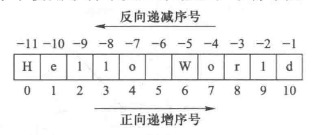

# 03.基本数据类型

Python中包含六种基本数据类型：数值、字符串、元组、列表、集合、字典，可以按照如下的方式进行分类：

|    类名    | 包含类型                                                     |
| :--------: | ------------------------------------------------------------ |
|  其他类型  | `None`类型                                                   |
|  数值类型  | 整数（`Int`）、浮点数（`Float`）、复数（`Complex`）、布尔类型（`Bool`） |
|  序列类型  | 字符串（`Str`）、`Range`类型、元组（`Tuple`）、列表（`List`） |
|  集合类型  | 集合（`Set`）、不可变集合（`Frozenset`）                     |
|  映射类型  | 字典（`Dict`）                                               |
|            |                                                              |
|  可变类型  | 列表、集合、字典                                             |
| 不可变类型 | 数值类型、布尔类型、字符串类型、元组类型、不可变集合（`Frozenset`） |
|            |                                                              |
|  基本类型  | 数值类型、布尔类型、字符串类型、`None`类型                   |
|  容器类型  | `Range`类型、元组、列表、集合、字典                          |

这里先了解非容器类型。

## 一、布尔类型与None

| 说明 | 布尔类型                                   | None类型                             |
| :--: | ------------------------------------------ | ------------------------------------ |
| 数值 | `True` 表示真(成立)；` False `表示假(假的) | `None`表示空，表示不存在的特殊对象； |
| 作用 | 二值选择应用。                             | 用来占位 或变量解除绑定              |

## 二、数值类型

表示数字或数值的数据类型称为数字类型，Python语言提供3种数字类型：整数类型、浮点数类型和复数类型，分别对应数学中的整数、实数和复数。

### 1.整数类型

整数类型与数学中整数的概念一致，理论上的取值范围是$[-\infty,+\infty]$，只要计算机内存能够存储，Python 程序可以使用任意大小的整数。整数类型并没有取值范围限制，但可以通过四种进制表示：十进制、二进制、八进制和十六进制，默认情况下整数采用十进制，其他进制需要增加引导符号。

| 进制类型 |  引导符号  | 描述                                                |
| :------: | :--------: | --------------------------------------------------- |
|  十进制  |     无     | 默认情况，例`1010`，`-1010`                         |
|  二进制  | `0b`或`0B` | 由字符`0`和`1`组成，例`0b1010`，`0B1010`            |
|  八进制  | `0o`或`O0` | 由字符`0-7`组成，例`0o1010`，`0O1010`               |
| 十六进制 | `0x`或`0X` | 由字符`0-9`、`a-f`或`A-F`组成，例`0x1010`，`0X1010` |

进制只是整数值表示的展示形式，用于辅助理解和开发，不同进制的整数之间可以直接运算或比较，程序处理时只要数值相同就无区别，实际上数据在计算机内部都以相同格式方式储存。

```python
0x1010 ==4112  # True
```

### 2.浮点数

浮点数类型与数学中实数的概念一致，表示带有小数的数值。Python 语言中的浮点数类型必须带有小数部分，小数部分可以是0。浮点数有2种表示方法：**十进制形式的一般表示**和**科学计数法**表示。除十进制外，浮点数没有其他进制表示形式。

Python浮点数类型的**数值范围和小数精度**受不同计算机系统的限制，一般来说浮点数的取值范围在$-10^{308}$到 $10^{308}$之间，浮点数之间的区分精度约为$2.22\times10^{-16}$，对于大部分日常计算，其数值范围和小数精度已经足够可靠了，可以认为浮点数类型没有范围限制（**对于一些高精度的科学计算不适宜使用一般的浮点数进行**）。

浮点数运算存在一个“不确定尾数”问题，即两个浮点数运算，有一定概率在运算结果后增加一些“不确定的”尾数。

> `1010`是整数，`1010.0`是浮点数，二者值相等，但进行计算时，结果可能不同，整数的运算精度比浮点数更高。

```python
print(pow(1010, 32))
print(pow(1010.0, 32))
print(0.1+0.2)
```

> **原因：**在计算机内部使用二进制表示浮点数，0.1对应的二进制表示`0.00011001100110011001100110011001100110011001100110011010`，受限于计算机表示浮点数使用的存储宽度，这个二进制数并不完全等于0.1，而是计算机能表示的最接近0.1 的二进制数。因此,0.1+ 0.2的运算，在计算机内部是最接近0.1和0.2的两个数的加运算，因此产生的数字接近 0.3，但未必是最接近的，反映到十进制表示上，可能产生一个尾数，至于这个尾数具体是多少，计算机内部会根据二进制运算确定产生。从用户角度来看，该尾数是不确定的，本文称“不确定尾数”，不确定尾数问题在其他编程语言中也会出现，这是程序设计语言的共性问题。

不确定尾数问题将会对浮点数**运算结果的判断**造成一定困扰，`0.1+0.2`的运算结果存在不确定尾数与`0.3`是否相等的判断会出错。可以使用函数`round()`限定运算结果保留的位数以去掉浮点数运算中的不确定尾数来解决这一问题。

**`round()`函数的使用**

```
round(number, digits)
number:待处理数值；
digits：四舍五入保留的位数，默认为0，保存为最接近的整数；digits>0，四舍五入到指定的小数位；digits<0,表示在整数位部分四舍五入，但结果仍是浮点数。
```

> `round()`函数的四舍五入实际是四舍六入，当末位数`5`时，会先判断下一位，其后存在数值则进位`5.2151->5.22`，若其后不存在数值，则进一步考察前一位的奇偶性按照”奇进偶不进“进位（但是由于浮点数存在不确定尾数问题，有时奇进偶不进也会存在误差）。

### 3.复数类型

复数类型表示数学中的复数，复数有一个基本单位元素`j`，它被定义为$\sqrt{-1}$，叫作“虚数单位”，含有虚数单位的数被称为复数。Python语言中，复数可以看作是二元有序实数对$(a,b)$表示$a+bj$，其中$a$是实数部分，简称实部，$b$是虚数部分，简称虚部，无论实部还是虚部都是浮点类型。对于一个虚数对象`z`，可以用`z.real`和`z.imag`分别获得它的实数部分和虚数部分

> `b=1`时，`1`并不能省略，`1j`表示复数而`j`则表示`Python`程序中的一个变量。


复数类型在科学计算中十分常见，基于复数的运算属于数学的复变函数分支，该分支有效支撑了众多科学和工程问题的数学表示和求解。

### 4.数值类型计算

数值类型支持几乎所有的数值运算操作，运算结果也符合一般的数学意义，但是对数值类型进行计算可能会改变其类型：

```python
# 整数和浮点数混合运算,输出结果是浮点数;
print(1+1.0)  # 2.0
# 整数之间运算,产生结果类型与操作符相关,除法运算(/)的结果是浮点数
print(1+1, 1/2, 2*4)  # 2 0.5 8
# 整数或浮点数与复数运算,输出结果是复数。
print(10-(1+2j))  # (9-2j)
```

| 函数                | 描述                                                         |
| ------------------- | ------------------------------------------------------------ |
| `abs(x)`            | 可以计算整数、浮点数、复数的绝对值，复数的绝对值等价于$\sqrt{a^2+b^2}$。 |
| `divmod(x,y)`       | 计算`x`除以`y`的结果，返回`（x//y, x%y）`元组。              |
| `pow(x,y[,z])`      | 计算`x`的`y`次幂，与`x**y`相同，第三个参数`z`表示对`z`取余`x**y%z`。 |
| `round(x[,d])`      | 对`x`四舍五入操作，详细用法见上面。                          |
| `max(x1,x2,...,xn)` | 对多个数值类型，直接返回其最大值；                           |
| `min(x1,x2,...,xn)` | 对多个数值类型，直接返回其最小值；                           |

## 三、字符串类型

计算机程序经常用于处理文本信息，文本信息在程序中使用字符串类型来表示。字符串是字符的序列，在Python语言中采用一对双引号`""`或者一对单引号`''`将其包裹起来的一个或多个字符来表示，双引号和单引号作用相同，当使用单引号时，双引号可以作为字符串的一部分，使用双引号时，单引号可以作为字符串的一部分。
$$
s = a_1a_2 \cdots a_n \,\,\,\,\, (0 \le n \le \infty)
$$
多行字符串可以由一对三单引号`'''`或三双引号`"""`作为边界来表示，两者作用相同。

```python
s1 = 'hello, world!'
s2 = "你好，世界！"
s3 = '''
hello, world!
你好，世界！
'''
```

> 使用`len()`函数获取**序列**的长度，一个中文字符和一个西文字符的长度都记为`1`。

### 1.字符串中的转义字符

可以在字符串中使用`\`（反斜杠）来表示转义，即`\`后面的字符不再是它原来的意义，例如字符串本身又包含了`'`、`"`、`\`这些特殊的字符，必须要通过`\`进行转义处理。

| 转义字符 | 描述       |
| :------: | ---------- |
|   `\\`   | 反斜杠符号 |
|   `\'`   | 单引号     |
|   `\"`   | 双引号     |
|   `\n`   | 换行       |
|   `\t`   | 横向制表符 |
|   `\r`   | 回车       |

### 2.字符串的索引、切片与遍历

#### （1）索引

如果希望从字符串中取出某个字符，我们可以对字符串进行索引运算，运算符是`[n]`，其中`n`是一个整数，假设字符串的长度为`N`，那么`n`可以是从`0`到`N-1`的整数，其中`0`是字符串中第一个字符的索引，而`N-1`是字符串中最后一个字符的索引，这通常被称之为正向索引。在Python中，字符串的索引也可以是从`-1`到`-N`的整数，其中`-1`是最后一个字符的索引，而`-N`则是第一个字符的索引，通常称之为负向索引。

索引包括两种序号体系：正向递增序号和反向递减序号。



如果字符串长度为 L，正向递增需要以最左侧字符序号为 0，向右依次递增，最右侧字符序号为L-1；反向递减序号以最右侧字符序号为-1，向左依次递减，最左侧字符序号为-L。这两种索引字符的方法可以同时使用。

> 在进行索引操作时，如果索引越界（正向索引不在`0`到`N-1`范围，负向索引不在`-1`到`-N`范围），会引发`IndexError`异常，错误提示信息为：`string index out of range`（字符串索引超出范围）。

#### （2）切片

如果要从字符串中取出多个字符，我们可以对字符串进行切片，运算符是`[i:j:k]`，其中`i`是开始索引，索引对应的字符可以取到；`j`是结束索引，**索引对应的字符不能取到**；`k`是步长，默认值为`1`，表示从前向后获取相邻字符的连续切片，所以`:k`部分可以省略，当`k`取值为`-1`时，则表示从后向前逆序获取相邻字符的连续切片。

如果没有给出`i`和`j`的值，则`i`的默认值是`0`，`j`的默认值是`N`，也可以理解为`i`的默认值是`-1`，j的默认值是`-N - 1`，当`k < 0`时表示负向切片（从后向前获取字符）。

```python
s = 'abc123456'

# i=2, j=5, k=1的正向切片操作
print(s[2:5])       # c12

# i=-7, j=-4, k=1的正向切片操作
print(s[-7:-4])     # c12

# i=-7, j=9, k=2的正向切片操作
print(s[-7::2])     # c246
```

#### （3）遍历

可以使用`for`循环对字符串进行遍历获取字符串中每个字符：

```python
s1 = 'hello'
for i in range(len(s1)):
    print(s1[i])

s1 = 'hello'
for ch in s1:
    print(ch)
```

> **字符串是不可变类型**，所以**不能通过索引运算修改字符串中的字符**。

### 3.字符串运算

Python为字符串类型提供了非常丰富的运算符，我们可以使用`+`运算符来实现字符串的拼接，可以使用`*`运算符来重复一个字符串的内容，可以使用`in`和`not in`来判断一个字符串是否包含另外一个字符串，我们也可以用`[]`和`[:]`运算符从字符串取出某个字符或某些字符。

```python
# 拼接与重复运算
s1 = 'hello' + ' ' + 'world!'
print(s1)    # hello world
print(s1*2)  # hello world!hello world!
# 成员运算
print('wo' in s1)    # True
print(s2 in s1)      # False
# 获取字符串长度
print(len(s1))
# 比较运算
```

字符串在计算机内存中是以二进制形式存在的，对于两个字符串类型的变量，可以直接使用比较运算符比较两个字符串的相等性或大小，实际上字符串的大小比较比的是每个字符对应的编码ACSII的大小。

如`A`的编码是`65`， 而`a`的编码是`97`，所以`'A' < 'a'`的结果相当于就是`65 < 97`的结果，很显然是`True`；而`'boy' < 'bad'`，因为第一个字符都是`'b'`比不出大小，所以实际比较的是第二个字符的大小，显然`'o' < 'a'`的结果是`False`，所以`'boy' < 'bad'`的结果也是`False`。

如果不清楚两个字符对应的编码到底是多少，可以使用`ord()`函数来获得，例如`ord('A')`的值是`65`，而`ord('a')`的值是`97`，`ord()`函数以一个字符（长度为1的字符串）为参数，返回该字符的ASCII 值，函数`chr()`是其反函数。如果所给的 Unicode 字符超出了 Python 定义范围则会引发一个 TypeError 的异常。

### 4.字符串方法

可以通过字符串类型自带的方法对字符串进行操作和处理，对于一个字符串类型的变量，可以用`变量名.方法名()`的方式来调用它的方法，所谓方法就是对象内部的函数。

```python
'sm_str'.__dir__()
# 'encode', 'replace', 'split', 'rsplit', 'join', 'capitalize', 'casefold', 't
itle', 'center', 'count', 'expandtabs', 'find', 'partition', 'index', 'ljust', 'lower', 'lstrip', 'rfind', 'rindex', 'rjust', 'rstrip', 'rpartition', 'splitl
ines', 'strip', 'swapcase', 'translate', 'upper', 'startswith', 'endswith', 'removeprefix', 'removesuffix', 'isascii', 'islower', 'isupper', 'istitle', 'issp
ace', 'isdecimal', 'isdigit', 'isnumeric', 'isalpha', 'isalnum', 'isidentifier', 'isprintable', 'zfill', 'format', 'format_map'
# 以上记为字符串的所有方法
```

#### （1）类型判断

| 方法                 | 说明                                                         |
| -------------------- | ------------------------------------------------------------ |
| `string.isspace()`   | 如果 `string` 中只包含空格，则返回 `True`                    |
| `string.isalnum()`   | 如果 `string` 至少有一个字符并且所有字符都是字母或数字则返回 True |
| `string.isalpha()`   | 如果 `string` 至少有一个字符并且所有字符都是字母则返回 True  |
| `string.isdecimal()` | 如果 `string` 只包含数字则返回 `True`，`全角数字`            |
| `string.isdigit()`   | 如果 `string` 只包含数字则返回 `True`，`全角数字`、`⑴`、`\u00b2` |
| `string.isnumeric()` | 如果 `string` 只包含数字则返回 `True`，`全角数字`，`汉字数字` |
| `string.istitle()`   | 如果 `string` 是标题化的(每个单词的首字母大写)则返回` True`  |
| `string.islower()`   | 如果 `string` 中包含至少一个区分大小写的字符，并且所有这些(区分大小写的)字符都是小写，则返回` True` |
| `string.isupper()`   | 如果 `string` 中包含至少一个区分大小写的字符，并且所有这些(区分大小写的)字符都是大写，则返回 `True` |

#### （2）大小写转化

| 方法                  | 说明                             |
| --------------------- | -------------------------------- |
| `string.capitalize()` | 把字符串的第一个字符大写         |
| `string.title()`      | 把字符串的每个单词首字母大写     |
| `string.lower()`      | 转换 string 中所有大写字符为小写 |
| `string.upper()`      | 转换 string 中的小写字母为大写   |
| `string.swapcase()`   | 翻转 string 中的大小写           |

#### （3）查找查询

| 方法                                           | 说明                                                         |
| ---------------------------------------------- | ------------------------------------------------------------ |
| `string.startswith(str)`                       | 检查字符串是否是以 `str` 开头，是则返回 `True`               |
| `string.endswith(str)`                         | 检查字符串是否是以 `str` 结束，是则返回 `True`               |
| `string.find(str, start=0, end=len(string))`   | 检测 `str` 是否包含在 `string` 中，如果 `start` 和 `end` 指定范围，则检查是否包含在指定范围内，如果是返回开始的索引值，否则返回 `-1` |
| `string.rfind(str, start=0, end=len(string))`  | 类似于 `find()`，不过是从右边开始查找                        |
| `string.index(str, start=0, end=len(string))`  | 跟 `find() `方法类似，不过如果 `str` 不在 `string `会报错    |
| `string.rindex(str, start=0, end=len(string))` | 类似于 `index()`，不过是从右边开始。                         |

#### （4）替换修改

| 方法                                                      | 说明                                                         |
| --------------------------------------------------------- | ------------------------------------------------------------ |
| `string.replace(old_str, new_str, num=string.count(old))` | 把 string 中的 old_str 替换成 new_str，如果 num 指定，则替换不超过 num 次 |
| `string.ljust(width)`                                     | 返回一个原字符串左对齐，并使用空格填充至长度 width 的新字符串 |
| `string.rjust(width)`                                     | 返回一个原字符串右对齐，并使用空格填充至长度 width 的新字符串 |
| `string.center(width)`                                    | 返回一个原字符串居中，并使用空格填充至长度 width 的新字符串  |
| `string.lstrip()`                                         | 截掉 string 左边（开始）的空白字符                           |
| `string.rstrip()`                                         | 截掉 string 右边（末尾）的空白字符                           |
| `string.strip()`                                          | 截掉 string 左右两边的空白字符                               |
| `string.partition(str)`                                   | 把字符串 string 分成一个 3 元素的元组 (str前面, str, str后面) |
| `string.rpartition(str)`                                  | 类似于 partition() 方法，不过是从右边开始查找                |
| `string.split(str="", num)`                               | 以 str 为分隔符拆分 string，如果 num 有指定值，则仅分隔 num + 1 个子字符串，str 默认包含 '\r', '\t', '\n' 和空格 |
| `string.splitlines()`                                     | 按照行('\r', '\n', '\r\n')分隔，返回一个包含各行作为元素的列表 |
| `string.join(seq)`                                        | 以 string 作为分隔符，将 seq 中所有的元素（的字符串表示）合并为一个新的字符串 |

#### （5）常用方法梳理

find()：检测某个子串是否包含在这个字符串中，如果在返回这个子串开始的位置下标，否则则返回-1。

```python
# 字符串序列.find(子串, 开始位置下标, 结束位置下标)
mystr = "hello world and itcast and itheima and Python"

print(mystr.find('and'))  # 12
print(mystr.find('and', 15, 30))  # 23
print(mystr.find('ands'))  # -1

# - rfind()： 和find()功能相同，但查找方向为==右侧==开始。
# - rindex()：和index()功能相同，但查找方向为==右侧==开始。
# - count()：返回某个子串在字符串中出现的次数
```

### 5.字符串格式化


### 6.基本数据类型之间的相互转化

有时候数据并不是自己所需要的数据类型，则需要对数据类型之间进行相互转化：

|           函数           |                        说明                         |
| :----------------------: | :-------------------------------------------------: |
|    `int(x [,base ])`     |                  将x转换为一个整数                  |
|       `float(x )`        |                 将x转换为一个浮点数                 |
| `complex(real [,imag ])` |        创建一个复数，real为实部，imag为虚部         |
|         `bool()`         |              将一个对象转化为布尔值。               |
|        `str(x )`         |                将对象 x 转换为字符串                |
|        `repr(x )`        |             将对象 x 转换为表达式字符串             |
|       `eval(str )`       | 用来计算在字符串中的有效Python表达式,并返回一个对象 |
|       `tuple(s )`        |               将序列 s 转换为一个元组               |
|        `list(s )`        |               将序列 s 转换为一个列表               |
|         `set(s)`         |               将序列s转化为一个集合。               |
|        `chr(x )`         |          将Unicode字符转化为其对应的单字符          |
|        `ord(x )`         |           将字符转化为其对应的Unicode字符           |
|                          |                                                     |
|        `hex(x )`         |         将一个整数转换为一个十六进制字符串          |
|        `oct(x )`         |          将一个整数转换为一个八进制字符串           |
|        `bin(x )`         |          将一个整数转换为一个二进制字符串           |

> 注意：布尔转化时，`0` ，`0.0 `， `None`，空的序列、集合、映射这类数值都会被转化为`False`，有值的则会被转化为`True`

## 四、列表类型

计算机不仅能对单个变量表示的数据进行处理，也可以对一组数据进行批量处理，这种能够表示多个数据的类型称为容器类型，**容器类型可分为三类：集合类型、序列类型和映射类型。**字符串实际上是一种仅能包含字符的特殊容器类型。

集合类型是一个元素集合，元素之间无序，相同元素在集合中唯一存在。序列类型是一个元素向量，元素之间存在先后关系，通过序号访问，元素之间不排他。序列类型的典型代表是字符串类型、列表类型和元组类型。映射类型是“键-值”数据项的组合，每个元素是一个键值对，表示为(key，value)，映射类型的典型代表是字典类型。

> 集合类型是一个具体的数据类型名称，而序列类型和映射类型是一类数据类型的总称，序列类型与集合类型最大的区别在于集合是无序不可重复的。

在Python中，**列表是由一系元素按特定顺序构成的数据序列**，一个列表类型的变量，**可以保存多个数据**，而且**允许有重复的数据**。列表同字符串一样，也是一种结构化的、非标量的序列数据类型，支持同样的索引、切片和遍历操作，但列表是一种可变类型，可以对列表元素进行增删改查操作。

```python
list1 = [] 
litt2 = list('hello') # ['h', 'e', 'l', 'l', 'o']
list3 = ['Python', 'Java', 'Go', 'Kotlin']
```

### 1.列表的运算符与遍历

和字符串类型一样，列表也是序列类型，支持拼接、重复、成员运算、索引和切片以及比较运算，对此我们不再进行赘述。

```python
items1 = [35, 12, 99, 68, 55, 87]
items2 = [45, 8, 29]

# 列表的拼接
items3 = items1 + items2
print(items3)    # [35, 12, 99, 68, 55, 87, 45, 8, 29]

# 列表的重复
items4 = ['hello'] * 3
print(items4)    # ['hello', 'hello', 'hello']

# 列表的成员运算
print(100 in items3)        # False
print('hello'  not in items4)    # False

# 获取列表的长度(元素个数)
print(len(items3))                 # 9

# 列表的索引
print(items3[0], items3[-len(items3)])        # 35 35

# 列表的切片
print(items3[-5:-7:-1])    # [55, 68]
print(items3[::-2])        # [100, 45, 55, 99, 35]

# 列表的比较运算
items5 = [1, 2, 3, 4]
items6 = list(range(1, 5))
# 两个列表比较相等性比的是对应索引位置上的元素是否相等
print(items5 == items6)    # True
items7 = [3, 2, 1]
# 两个列表比较大小比的是对应索引位置上的元素的大小
print(items5 <= items7)    # True
```

> 值得一提的是，由于列表是可变类型，所以通过索引操作既可以获取列表中的元素，也可以修改更新列表中的元素。对列表做索引操作一样要注意索引越界的问题，对于有`N`个元素的列表，正向索引的范围是`0`到`N-1`，负向索引的范围是`-1`到`-N`，如果超出这个范围，将引发`IndexError`异常，错误信息为：`list index out of range`。

同字符串一样，列表也可以进行遍历操作：

```python
items = ['Python', 'Java', 'Go', 'Kotlin']

for index in range(len(items)):
    print(items[index])

    for item in items:
    print(item)
```

### 2.列表的方法

同字符串，列表也具备自己的一些方法，调用列表对象的`__dir__()`方法，可以查看其支持的所有方法：

```python
'__new__', '__repr__', '__hash__', '__getattribute__', '__lt__', '__le__', '__eq__', '__ne__', '__gt__', '__ge__', '__iter__', '__init__', '__len__', '__get
item__', '__setitem__', '__delitem__', '__add__', '__mul__', '__rmul__', '__contains__', '__iadd__', '__imul__', '__reversed__', '__sizeof__', 'clear', 'copy
', 'append', 'insert', 'extend', 'pop', 'remove', 'index', 'count', 'reverse', 'sort', '__class_getitem__', '__doc__', '__str__', '__setattr__', '__delattr__
', '__reduce_ex__', '__reduce__', '__getstate__', '__subclasshook__', '__init_subclass__', '__format__', '__dir__', '__class__'

# 重要方法
# 'append', 'insert', 'extend', 'pop', 'remove', 'clear'
# 'index', 'count', 'reverse', 'sort', 'copy'
```

> 列表元素的修改可以直接通过索引赋值的方式直接修改。

#### （1）添加和删除元素

|         方法          | 说明                                                         |
| :-------------------: | ------------------------------------------------------------ |
|    `append(item)`     | 在列表尾部添加一个元素。                                     |
| `insert(index, item)` | 在列表指定索引位置插入元素，若index超出列表最大索引将引发异常。 |
|    `extend(序列)`     | 向列表尾部中增加一个序列。                                   |
|      `remove()`       | 删除指定的第一个元素。                                       |
|     `pop(index)`      | 删除指定索引位置的元素，若不指定`index`，则默认删除最后一个（last）。 |
|      `del`关键字      | 删除指定索引位置的元素，性能低于`pop`。                      |
|       `clear()`       | 清空列表中的元素。                                           |

```python
items = ['Python', 'Java', 'Go', 'Kotlin']
_items = ['C++', 'Javascript', 'PHP', 'C#', 'Matlab', 'R']

# 使用append方法在列表尾部添加元素
items.append('Swift')
# 使用insert方法在列表指定索引位置插入元素
items.insert(2, 'SQL')
# 使用extend方法向列表中更新一个序列-添加多个元素
items.extend(_items)

# 删除指定的元素
items.remove('Java')
# 删除指定索引位置的元素
items.pop(0)
del items[1]
# 清空列表中的元素
items.clear()
```

> 在使用`remove`方法删除元素时，如果要删除的元素并不在列表中，会引发`ValueError`异常，错误消息是：`list.remove(x): x not in list`。在使用`pop`方法删除元素时，如果索引的值超出了范围，会引发`IndexError`异常，错误消息是：`pop index out of range`。

#### （2）查询和计数元素

列表类型的`index`方法可以查找某个元素在列表中的索引位置；因为列表中允许有重复的元素，所以列表类型提供了`count`方法来统计一个元素在列表中出现的次数。

|          方法          | 说明                 |
| :--------------------: | -------------------- |
| `index(item [,index])` | 查找元素的索引位置。 |
|     `count(item)`      | 查找元素出现的次数。 |

```python
items = ['Python', 'Java', 'Java', 'Go', 'Kotlin', 'Python']

# 查找元素的索引位置
print(items.index('Python'))       # 0
print(items.index('Python', 2))    # 5
# 注意：虽然列表中有'Java'，但是从索引为3这个位置开始后面是没有'Java'的
print(items.index('Java', 3))      # ValueError: 'Java' is not in list

# 查找元素出现的次数
print(items.count('Python'))    # 2
print(items.count('Go'))        # 1
print(items.count('Swfit'))     # 0
```

#### （3）排序与反转

列表的`sort`操作可以实现列表元素的排序，而`reverse`操作可以实现元素的反转。

|    方法     | 说明 |
| :---------: | ---- |
|  `sort()`   |      |
| `reverse()` |      |

```python
items = ['Python', 'Java', 'Go', 'Kotlin', 'Python']

# 排序
print(items.sort())    # ['Go', 'Java', 'Kotlin', 'Python', 'Python']
# 反转
print(items.reverse())    # ['Python', 'Python', 'Kotlin', 'Java', 'Go']
```

> `items[::-1]`也可以实现列表的反转。

### 3.列表嵌套

Python语言没有限定列表中的元素必须是相同的数据类型，也就是说一个列表中的元素可以任意的数据类型，当然也包括列表。如果列表中的元素又是列表，那么我们可以称之为嵌套的列表。可以用嵌套列表表示多维矩阵，如想保存5个学生3门课程的成绩，可以定义一个保存5个元素的列表保存5个学生的信息，而每个列表元素又是3个元素构成的列表，分别代表3门课程的成绩。

> 在使用多维列表时要注意引用与内存占用的关系，这将在数据类型进阶中来学习。

```python
scores = [[0] * 3] * 5
print(scores)    # [[0, 0, 0], [0, 0, 0], [0, 0, 0], [0, 0, 0], [0, 0, 0]]
scores[0][0] = 95
print(scores) # [[95, 0, 0], [95, 0, 0], [95, 0, 0], [95, 0, 0], [95, 0, 0]]
```

### 4.列表生成式

Python中列表还可以通过一种特殊的字面量语法来创建，这种语法叫做生成式。

```python
# 创建一个由1到9的数字构成的列表
items1 = [x for x in range(1, 10)]
# 创建一个由'hello world'中除空格和元音字母外的字符构成的列表
items2 = [x for x in 'hello world' if x not in ' aeiou']
# 创建一个由个两个字符串中字符的笛卡尔积构成的列表
# 多个for循环实现列表推导式
items3 = [x + y for x in 'ABC' for y in '12']
```

## 五、元组类型

容器型的数据类型不止列表一种，元组（tuple）也是Python中的一种重要的容器类型。元组也是多个元素按照一定的顺序构成的序列，元组和列表的不同之处在于，元组是不可变类型，这就意味着元组类型的变量一旦定义，其中的元素不能再添加或删除，而且元素的值也不能进行修改。

> 注意列表和元组是容器类型，元组和字符串是不可变数据类型，列表、元组、字符串都是序列类型。

定义元组通常使用`()`字面量语法，元组类型像字符串、列表一样，支持重复、拼接、成员运算、长度、索引、切片、比较、遍历等序列操作，元组实际上就是不可更改的列表，这里不在赘述。

```python
# 定义一个一元组，这里的逗号不能省略。
t1 = ()
t2 = (30, )
# 定义一个四元组
t3  = (30, 10, 55, 80)
t4 = tuple(['Python', 'Java', 'Go', 'Kotlin', 'Python'])
```

> 如果定义的元组只有一个数据，那么这个数据后面也要添加逗号，否则数据类型为唯一的这个数据的数据类型。

### 1.元组方法

|         方法          | 说明                 |
| :-------------------: | -------------------- |
| `index(item[,index])` | 查找元素的索引位置。 |
|     `count(item)`     | 查找元素出现的次数。 |

> 这些方法也是序列方法。

### 2.元组和列表的区别

- 元组是不可变类型，**不可变类型更适合多线程环境**，它降低了并发访问变量的同步化开销。

- 元组是不可变类型，通常**不可变类型在创建时间和占用空间上面都优于对应的可变类型**。

  可以使用`sys`模块的`getsizeof`函数来检查保存相同元素的元组和列表各自占用了多少内存空间。我们也可以使用`timeit`模块的`timeit`函数来看看创建保存相同元素的元组和列表各自花费的时间。

  ```python
  import sys
  import timeit
  
  a = list(range(100000))
  b = tuple(range(100000))
  print(sys.getsizeof(a), sys.getsizeof(b))    # 900120 800056
  
  print(timeit.timeit('[1, 2, 3, 4, 5, 6, 7, 8, 9]'))
  print(timeit.timeit('(1, 2, 3, 4, 5, 6, 7, 8, 9)'))
  ```

Python中的元组和列表是可以快速相互转换的：

```python
# 将元组转换成列表
info = ('骆昊', 175, True, '四川成都')
print(list(info))       # ['骆昊', 175, True, '四川成都']
# 将列表转换成元组
fruits = ['apple', 'banana', 'orange']
print(tuple(fruits))    # ('apple', 'banana', 'orange')
```

### 3.生成器推导式

与列表不同的是，元组类型无法使用推导式生成，这主要是因为`Python`另一种重要对象`生成器对象`在创建时使用圆括号创建，这与元组类型的圆括号冲突，更多关于生成器对象的知识，将面向对象后了解。目前可以将这一点理解为，**元组推导式的结果是一个生成器对象，不是列表，也不是元组。**

```python
nums = (i^2 for i in range(5))
print(type(nums))  # <class 'generator'>
print(tuple(nums))  # (2, 3, 0, 1, 6)
print(list(nums))  # []
print(tuple(nums)) # ()
```

可以使用`__next__()`或者内置函数访问生成器对象，生成器中的元素可以根据需要将其转化为列表或元组，但不管使用何种方法访问其元素，当所有元素访问结束以后，如果需要重新访问其中的元素，必须重新创建该生成器对象。

### 4.元组的应用

#### （1）打包和解包

当我们把多个用逗号分隔的值赋给一个变量时，多个值会打包成一个元组类型；当我们把一个元组赋值给多个变量时，元组会解包成多个值然后分别赋给对应的变量，如下面的代码所示。

```python
# 打包
a = 1, 10, 100
print(type(a), a)    # <class 'tuple'> (1, 10, 100)
# 解包
i, j, k = a
print(i, j, k)       # 1 10 100

l = [(0,1,2),(1,2,3),(2,3,4),(3,4,5)]
for a,b,c in l:
    print(a)
```

在解包时，如果解包出来的元素个数和变量个数不对应，会引发`ValueError`异常，错误信息为：`too many values to unpack`（解包的值太多）或`not enough values to unpack`（解包的值不足）。

```python
a = 1, 10, 100, 1000
# i, j, k = a             # ValueError: too many values to unpack (expected 3)
# i, j, k, l, m, n = a    # ValueError: not enough values to unpack (expected 6, got 4)
```

有一种解决变量个数少于元素的个数方法，就是使用星号表达式，我们之前讲函数的可变参数时使用过星号表达式。有了星号表达式，我们就可以让一个变量接收多个值，代码如下所示。需要注意的是，用星号表达式修饰的变量会变成一个列表，列表中有0个或多个元素。还有在解包语法中，星号表达式只能出现一次。

```python
a = 1, 10, 100, 1000
i, j, *k = a
print(i, j, k)          # 1 10 [100, 1000]
i, *j, k = a
print(i, j, k)          # 1 [10, 100] 1000
*i, j, k = a
print(i, j, k)          # [1, 10] 100 1000
*i, j = a
print(i, j)             # [1, 10, 100] 1000
i, *j = a
print(i, j)             # 1 [10, 100, 1000]
i, j, k, *l = a
print(i, j, k, l)       # 1 10 100 [1000]
i, j, k, l, *m = a
print(i, j, k, l, m)    # 1 10 100 1000 []
```

解包语法对所有的序列都成立，字符串、元组、列表及之前学习的`range`对象都是序列类型。

```python
a, b, *c = range(1, 10)
print(a, b, c)
a, b, c = [1, 10, 100]
print(a, b, c)
a, *b, c = 'hello'
print(a, b, c)
```

#### （2）交换两个变量的值

交换两个变量的值是编程语言中的一个经典案例，在很多编程语言中，交换两个变量的值都需要借助一个中间变量才能做到，如果不用中间变量就需要使用比较晦涩的位运算来实现。在Python中，交换两个变量`a`和`b`的值只需要使用如下所示的代码。

```python
a, b = b, a
```

同理，如果要将三个变量`a`、`b`、`c`的值互换，即`b`赋给`a`，`c`赋给`b`，`a`赋给`c`，也可以如法炮制。

```python
a, b, c = b, c, a
```

> 注意：三个以内的变量值互换并没有使用打包和解包语法，而是直接调用了字节码指令`ROT_TWO`和`ROT_THREE`，效率是非常高的，但是多于三个变量的值要依次互换，执行的原理则是利用了上面的打包和解包操作。

#### （3）函数的 参数 和 返回值

一个函数可以接收 **任意多个参数**，或者 **一次返回多个数据**，有关 **函数的参数 和 返回值**，在函数章节进一步学习。

#### （4）格式字符串

格式化字符串后面的 `()` 本质上就是一个元组。

## 六、序列类型

序列类型是一维元素向量，元素之间存在先后关系，可以通过序号访问。序列的基本思想和表示方法均来源于数学概念，在数学中,经常给每个序列起一个名字。例如，$n$ 个数的序列 $S$，可以表示为：

$$S = s_0,s_1,s_2,...,s_{n-1}$$

当需要访问序列中某个特定值时，只需要通过下标标出即可。

由于元素之间存在顺序关系，所以序列中可以存在数值相同但位置不同的元素。Python 语言中字符串、`range`对象、元组、列表和以后的`Numpy.ndarray`数组/`pandas.series`都是序列（sequence）类型，序列类型之间共享许多相同的接口。

### 1.区别

字符串是单一字符的有序组合，其中只能包含字符，不能包含数值或其他类型，字符串是不可变序列，不能修改元素，可迭代；

`range`对象是一系列有序整数的组合，它也是一种不可变序列、可迭代，但是注意`range`对象不支持加法拼接与乘法重复操作。

元组是标准的不可变序列，它的元素可以是任意对象，无序且可重复，注意元组类型可迭代并且可以作为迭代器使用。

列表是标准的可变序列，它与元组一样，唯一的区别在于它是可变的。

### 2.公共运算符和函数

|   操作符/函数    | 说明                                                         |
| :--------------: | ------------------------------------------------------------ |
|     `x in s`     | 如果x是s的元素，返回True，否则返回False。                    |
|   `x not in s`   | 如果x不是s的元素，返回True，否则返回False。                  |
|      `s+t`       | 连接s和t。                                                   |
|   `s*n`或`n*s`   | 将序列s复制n次。                                             |
|      `s[i]`      | 索引，返回序列的第i个元素。                                  |
|     `s[i:j]`     | 切片，返回包含序列s第i到j个元素的子序列(不包含第个j元素)。   |
|    `s[i:j:k]`    | 步骤切片，返回包含序列s第i到个元素以为步数的子序列。         |
|     `len(s)`     | 序列s的元素个数(长度)                                        |
| `del `或` del()` | 删除元素或序列。                                             |
|     `min(s)`     | 序列s中的最小元素                                            |
|     `max(s)`     | 序列s中的最大元素                                            |
|   `s.index(x)`   | 序列s中第一次出现元素x的位置                                 |
|   `s.count(x)`   | 序列s中出现x的总次数                                         |
|  `enumerate()`   | 函数用于将一个可遍历的数据对象(如列表、元组或字符串)组合为一个索引序列，同时列出数据和数据下标，一般用在 for 循环当中。 |

> `range`对象不支持加法拼接与乘法重复操作。
>
> `del`关键字对列表进行操作时，既可以删除元素，也可以删除整个列表，`del`对其他不可变序列操作代表删除该序列。

```python
str1 = 'abcdefg'
print(max(str1))  # g

list1 = [10, 20, 30, 40]
del(list1[0])
print(list1)  # [20, 30, 40]

str1 = 'abcdefg'
del str1
print(str1)
```

**`enumerate()`方法**：为循环免费赠送一个计数器，以保持自动选代的简洁性。实际上，`enumerate`函数会返回一个生成器对象，是一种支持迭代的对象，将在后续深入讨论，简而言之，该对象有一个方法，可以被内置函数`next`调用，并且在循环的每次迭代返回一个`(index，value)`元组。`for`循环会自动遍历这些元组，并允许我们通过元组赋值将元组内的值解包。

```python
# enumerate(可遍历对象, start=0)
list1 = ['a', 'b', 'c', 'd', 'e']

for i in enumerate(list1):
    print(i)  # 一次输出 (0, 'a'),(1, 'b'), (2, 'c') ...

for index, char in enumerate(list1, start=1):
    print(f'下标是{index}, 对应的字符是{char}')
```

### 3.类型转换

|   函数    | 说明                           |
| :-------: | ------------------------------ |
| `tuple()` | 将某个序列转换成元组。         |
| `list()`  | 将某个序列转换成列表。         |
|  `str()`  | 将某个序列、数值转化为字符串。 |
|  `set()`  | 将某个序列转换成集合。         |

## 七、集合类型

`Python`中的集合类型与数学中的集合概念一致，即包含`0`个或多个数据项的无序不重复组合。集合是无序组合，用大括号()表示，因为其无序，它没有索引和位置的概念，集合中的元素可以动态增加或删除。

集合中的元素不可重复，`==`元素类型只能是不可变数据`（hashable）`类型，如整数、浮点数、字符串、元组等`==`，列表、字典和集合类型本身都是可变数据类型，不能作为集合的元素出现。

创建集合使用`{}`或`set()`， 但是如果要创建空集合只能使用`set()`，因为`{}`用来创建空字典。

```python
s1 = {10, 20, 30, 40, 50}
s2 = set('abcdefg')
s3 = set()
```

> 集合元素间没有顺序，不能比较，不能排序。由于集合元素独一无二，使用集合类型能够过滤掉重复元素。

### 1.集合运算符

| 运算符号 |              符号名称              | 说明                                               |
| :------: | :--------------------------------: | -------------------------------------------------- |
|   `in`   |             成员运算符             | 如果x是S的元素，返回True，否则返回False。          |
| `not in` |             成员运算符             | 如果x不是S的元素，返回True，否则返回False          |
|   `&`    |     交集运算符：`intersection`     | 返回一个新集合，包括同时在集合S和T中的元素。       |
|   `|`    |        并集运算符：`union`         | 返回一个新集合，包括集合S和T中所有元素。           |
|   `-`    |      差集运算符：`difference`      | 返回一个新集合，包括在集合S中但不在集合T中的元素。 |
|   `^`    | 补集运算符：`symmetric_difference` | 返回一个新集合，包括集合S和T中非共同元素。         |
|   `==`   |              比较运算              | 二者相等返回`True`，否则返回`False`。              |
|   `!=`   |              比较运算              | 二者不等返回`True`，否则返回`False`。              |


```python
# 通过成员运算`in`和`not in `检查元素是否在集合中
set1 = {11, 12, 13, 14, 15}
print(10 in set1)        # False 
print(20 not in set1)        # True
print(len(set1))

# 集合跟数学上的集合一样，可以进行交集、并集、差集等运算，而且可以通过运算符和方法调用两种方式
set2 = {1, 2, 3, 4, 5, 6, 7}
set3 = {2, 4, 6, 8, 10}
# 交集
print(set2 & set3)                # {2, 4, 6}
print(set2.intersection(set3))    # {2, 4, 6}
# 并集
print(set2 | set3)         # {1, 2, 3, 4, 5, 6, 7, 8, 10}
print(set2.union(set3))    # {1, 2, 3, 4, 5, 6, 7, 8, 10}
# set2.update(set3)
# print(set2)

# 差集
print(set2 - set3)              # {1, 3, 5, 7}
print(set2.difference(set3))    # {1, 3, 5, 7}
# 对称差
print(set2 ^ set2)                        # {1, 3, 5, 7, 8, 10}
print(set2.symmetric_difference(set3))    # {1, 3, 5, 7, 8, 10}
# 对称差相当于两个集合的并集减去交集
print((set2 | set3) - (set1 & set3))      # {1, 3, 5, 7, 8, 10}

# 比较运算
set4 = {1, 3, 5}
set5 = {1, 2, 3, 4, 5}
set6 = set5
print(set6==s5)   # True
print(set4==s5)   # False

# 字集判断———— <运算符表示真子集，<=运算符表示子集
print(set4 < set5, set4 <= set5)    # True True
print(set5 < set6, set5 <= set6)    # False True
# 通过issubset方法也能进行子集判断
print(set4.issubset(set5))      # True
# 反过来可以用issuperset或>运算符进行超集判断
print(set5.issuperset(set4))    # True
print(set5 > set4)              # True
```

> 可以看出，由于集合是一种无序互异的序列，因此序列中一些方法无法使用，但还是可以使用`in`\\`not in`\\`len()`\\`!=`\\`==`等符号。

集合的交集、并集、差集运算还可以跟赋值运算一起构成复合赋值运算。

```python
set1 = {1, 3, 5, 7}
set2 = {2, 4, 6}
# 将set1和set2求并集再赋值给set1
# 也可以通过set1.update(set2)来实现
set1 |= set2
print(set1)    # {1, 2, 3, 4, 5, 6, 7}
set3 = {3, 6, 9}
# 将set1和set3求交集再赋值给set1
# 也可以通过set1.intersection_update(set3)来实现
set1 &= set3
print(set1)    # {3, 6}
```

### 2.集合方法

```
'add', 'update', 'union', 'copy', 'discard', 'pop', 'remove', 'clear'
'intersection', 'difference', 'difference_update', 'isdisjoint', 
'intersection_update'
'issubset', 'issuperset'
```

#### （1）增加

|                             方法                             | 说明                               |
| :----------------------------------------------------------: | ---------------------------------- |
|                           `add()`                            | 如果数据项x不在集合S中将x增加到S。 |
| `update()`\\`union()` | 向集合中添加一个序列，注意`update()`改变原集合，没有返回值，`union`则不改变原集合，返回新集合。 | `union`实际是去并集。              |

```python
# 创建一个空集合
s1 = set()

# 通过add方法添加元素
s1.add(33)
s1.update({1, 10, 100, 1000})
print(s1)    # {33, 1, 100, 1000, 10}
```

#### （2）删除

|    方法     | 说明                                                         |
| :---------: | ------------------------------------------------------------ |
| `discard()` | 删除指定元素，如果元素不存在，则忽略。                       |
| `remove()`  | 如果x在集合S中移除该元素，不在则产生KeyError异常，删除前需要判断成员是否存在。 |
|   `pop()`   | 从集合中随机删除一个元素并返回该元素。                       |
|  `clear()`  | 清空集合中的元素。                                           |

#### （3）判断

|      方法      | 说明                                                         |
| :------------: | ------------------------------------------------------------ |
| `isdisjoint()` | 判断两个集合有没有相同的元素，有则返回`True`，否则返回`False`。 |
|  `issubset()`  | 通过`issubset`方法或`>`进行子集判断。                        |
| `issuperset()` | 可以用`issuperset`或`>=`运算符进行超集判断。                 |

```python
set1 = {'Java', 'Python', 'Go', 'Kotlin'}
set2 = {'Kotlin', 'Swift', 'Java', 'Objective-C', 'Dart'}
set3 = {'HTML', 'CSS', 'JavaScript'}
print(set1.isdisjoint(set2))    # False
print(set1.isdisjoint(set3))    # True
```

### 3.不可变集合

Python中还有一种不可变类型的集合，名字叫`frozenset`。`set`跟`frozenset`的区别就如同`list`跟`tuple`的区别，`frozenset`由于是不可变类型，能够计算出哈希码，因此它可以作为`set`中的元素。除了不能添加和删除元素，`frozenset`在其他方面跟`set`基本是一样。

```Python
set1 = frozenset({1, 3, 5, 7})
set2 = frozenset(range(1, 6))
print(set1 & set2)    # frozenset({1, 3, 5})
print(set1 | set2)    # frozenset({1, 2, 3, 4, 5, 7})
print(set1 - set2)    # frozenset({7})
print(set1 < set2)    # False
```

> 集合推导式与列表推导式形式一致`set1 = {i ** 2 for i in list1}`，这里不在赘述。

## 八、字典类型

“键值对”是组织数据的一种重要方式，键值对的基本思想是将“值”信息关联一个“键”信息，进而通过键信息查找对应的值信息这个过程叫映射，Python中通过字典类型实现映射。**序列是一种特殊的映射，其将正向递增序号作为键进行具体元素值的索引。**字典是一种映射类型，每个元素是一个键值对，即元素是`(key,value)`，元素之间是无序的，键和值通过冒号连接，不同键值对通过逗号隔开。

$$\{<键1>:<值1>,<键2>:<值2>,...,<键n>:<值n>\}$$

由于大括号口还可以表示集合，因此字典类型也具有和集合类似的性质，键值对之间没有顺序且不能重复，可以简单地把字典看成元素是键值对的集合，但是集合与字典是不同的类型。

```python
person = {
    'name': '王大锤', 'age': 55, 'weight': 60, 'office': '科华北路62号',
    'home': '中同仁路8号', 'tel': '13122334455', 'econtact': '13800998877'
}
d1 = {}
d2 = dict()
d3 = dict(name='王大锤', age=55, weight=60, home='中同仁路8号')
# 通过Python内置函数zip压缩两个序列并创建字典
d4 =  dict(zip('ABCDE', range(1, 10)))
```

> **字典中的键必须是不可变类型**如整数、浮点数、字符串、元组等类型的值。

### 1.字典的索引

索引是按照一定顺序检索内容的体系。列表类型采用元素顺序的位置进行索引，由于字典元素“键值对”中键是值的索引，因此，可以直接利用键值对关系索引元素。

```python
# 键值对的索引模式
<值>=<字典变量>[<键>]
```

利用索引和赋值(=)配合，可以对字典中每个元素进行修改或新增。

```python
person = {
    'name': '王大锤', 'age': 55, 'weight': 60, 'office': '科华北路62号',
    'home': '中同仁路8号', 'tel': '13122334455', 'econtact': '13800998877'
}
print(person['name'])
# 修改或添加操作
person['tel2'] = 10086
person['age'] = 18
print(person)
```

> 如果当前查找的key存在，则返回对应的值，否则则报错。

### 2.字典的遍历

|    方法    | 说明                                                         |
| :--------: | ------------------------------------------------------------ |
|  `keys()`  | 将字典中所有`key`打包为一个类元组（`dict_keys`对象）。       |
| `values()` | 将字典中所有`value`打包为一个类元组（`dict_values`对象）。   |
| `items()`  | 把字典中的每对key和value组成一个元组，并把这些元祖放在列表中返回。 |

```python
dict1 = {'name': 'Tom', 'age': 20, 'gender': '男'}
for key in dict1.keys():
    print(key)
for value in dict1.values():
    print(value)
# 遍历字典的元素
for item in dict1.items():
    print(item)
# 遍历字典的键值对
for key, value in dict1.items():
    print(f'{key} = {value}')
```

**并行遍历：`zip()` 

内置函数range允许我们在for循环中以非穷尽的方式遍历序列，内置的zip函数允许在同一个循环内同时并行访问多个序列。

```python
L1 = [1, 2, 3, 4]
L2 = [5, 6, 7, 8]
for x, y in zip(L1, L2):
    print(f'{x}+{y}={x+y}')
# 使用zip函数来进行截断。
for i in zip(L1, L2[:3]):
    print(i)  # 截至输出到 (3, 7)

# 可以使用zip来构造字典/列表，
print(dict(zip(L1, L2)))  # {1: 5, 2: 6, 3: 7, 4: 8}
print(list(zip(L1, L2)))  # [(1, 5), (2, 6), (3, 7), (4, 8)]
```

在基础用法中，zip的输入参数是一个或多个序列，而它的返回值是将这些序列并排的元素配对得到元组的`迭代器`。

### 3.字典的运算

|  方法/操作符  | 说明                         |
| :-----------: | ---------------------------- |
|    `len()`    | 计算并返回字典中元素个数。   |
| `in`/`not in` | 判断某个键是否存在于字典中。 |
|    `max()`    | 字典中键的最大值。           |
|    `min()`    | 字典中值的最小值。           |

### 4.字典的方法

字典类型存在一些操作方法，使用语法形式是：`<字典变量>.<方法名称>(<方法参数>)`

|        方法        | 描述                                                         |
| :----------------: | ------------------------------------------------------------ |
|     `update()`     | 旧字典中更新新字典。                                         |
| `get(key,default)` | 键存在则返回相应值，否则返回默认值 default，未设置且不存在则返回`None`。 |
| `pop(key,default)` | 键存在则返回相应值，并删除键值对否则返回default，未设置default将引发异常。 |
|    `popitem()`     | 随机取出一个键值对，以元组(key，value)形式返回并将该键值对从字典中删除。 |
|     `clear()`      | 删除所有的键值对，清空字典。                                 |
|   `del`/`del()`    | 删除字典或删除字典中指定键值对。                             |

跟列表一样，从字典中删除元素也可以使用`del`关键字，在删除元素的时候如果指定的键索引不到对应的值，一样会引发`KeyError`异常。

### 5.字典与列表排序

#### （1）sort()方法

`sort() `方法在原列表上进行修改，返回值为 None。

```python
list_name.sort(reverse=..., key=... )

# reverse 指定列表是按升序还是降序排序。它需要一个布尔值，这意味着该值为 True 或 False。默认值为 False，表示列表按升序排序。将其设置为 True 会按降序对列表进行降序排序。
# key key参数的值为一个函数，此函数只有一个参数且返回一个值用来进行比较。

def func(x):
    ...
    return y
# 这里将通过y值进行排序s
```

> sort方法只能用于列表排序。

#### （2）sorted()函数

`sorted()`函数用于序列排序，可用于任意序列，不改变原序列，返回对序列排序后生成的列表对象。

```python
sorted(series, reverse=..., key=...)
```

#### （3）以sorted()字典排序为例

```python
d = {'lilee':25, 'wangyan':21, 'liqun':32, 'age':19}

# 按照字典的值进行排序
d1 = sorted(d.items(), key=lambda item:item[1])

# 按照字典的键进行排序
d2 = sorted(d.items(), key=lambda item:item[0])
```

### 6.字典推导式

字典同集合、列表一样，可以通过推导式快速创建，字典推导式能够快速合并列表为字典或提取字典中目标数据。

#### （1）创建一个字典：字典key是1-5数字，value是这个数字的2次方。

```python
dict1 = {i: i**2 for i in range(1, 5)}
print(dict1)  # {1: 1, 2: 4, 3: 9, 4: 16}
```

#### （2）将两个列表合并为一个字典

```python
list1 = ['name', 'age', 'gender']
list2 = ['Tom', 20, 'man']

dict1 = {list1[i]: list2[i] for i in range(len(list1))}
print(dict1)
```

#### （3）提取字典中目标数据

```python
counts = {'MBP': 268, 'HP': 125, 'DELL': 201, 'Lenovo': 199, 'acer': 99}

# 需求：提取上述电脑数量大于等于200的字典数据
count1 = {key: value for key, value in counts.items() if value >= 200}
print(count1)  # {'MBP': 268, 'DELL': 201}
```

### 7.字典的解包

```python
dict1 = {'name': 'TOM', 'age': 18}
a, b = dict1

# 对字典进行拆包，取出来的是字典的key
print(a)  # name
print(b)  # age

print(dict1[a])  # TOM
print(dict1[b])  # 18

# 同时对字典或元组进行拆包
gl_nums = (1, 2, 3)
gl_xiaoming = {"name": "小明", "age": 18}
demo(*gl_nums, **gl_xiaoming)
```

