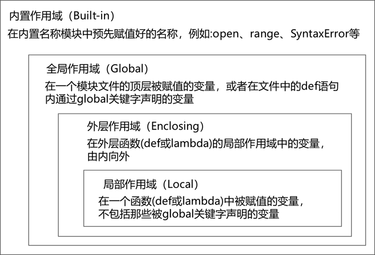

# 05.函数与模块化编程

程序由一系列代码组成，如果代码是顺序但无组织的，不仅不利于阅读和理解，也很难进行升级和维护。一旦程序过于长，程序的执行效率、整理复杂度及可读性将变得非常糟糕，因此编程中大量使用函数对程序合理划分为功能模块，并基于模块设计程序已经成为一种编程范式，被称为”函数式编程“或”结构化设计“。函数式编程的主要思想是通过函数的封装将程序划分成主程序、子程序和子程序间关系的表达，这能够使代码编写更简洁、更易于理解、计算机执行更高效。结构化设计是使用函数设计程序的思考方法，以功能块为基本单位，一般有两个基本要求：

- 紧耦合：尽可能合理划分功能块，功能块内部耦合紧密；
- 松耦合：模块间关系尽可能简单，功能块之间耦合度低。

耦合性指程序结构中各模块之间相互关联的程度，它取决于各模块间接口的复杂程度和调用方式。耦合性是影响软件复杂程度和设计质量的一个重要因素，紧耦合指模块或系统间关系紧密存在较多或复杂的相互调用。紧耦合的缺点在于更新一个模块可能导致其他模块变化，复用较困难。松耦合一般基于消息或协议实现，系统间交互简单提示，松耦合代表了模块化，从系统观点来看，松耦合是总体设计原则。

通俗来讲，我们应尽可能地把函数和其他编程组件对外部的依赖性最小化。函数的自包含性越好，它就越容易被理解、复用和修改。使用函数只是模块化设计的必要非充分条件，根据计算需求合理划分函数十分重要。一般来说，完成特定功能或被经常复用的一组语句应该采用函数来封装，并尽可能减少函数间参数和返回值的数量。

> Python混合支持多种编程范式:过程式(使用基础的语句)、面向对象式(使用类)和函数式(使用函数和模块)。

## 一、函数的定义与调用

数学上的函数通常形如`y = f(x)`或者`z = g(x, y)`这样的形式，在`y = f(x)`中，`f`是函数的名字，`x`是函数的自变量，`y`是函数的因变量；而在`z = g(x, y)`中，`g`是函数名，`x`和`y`是函数的自变量，`z`是函数的因变量。Python中的函数跟这个结构是一致的，每个函数都有自己的名字、自变量和因变量。一般将函数的自变量称之为参数，将函数的因变量称为返回值。

函数是程序的一种基本抽象方式，它将一些语句组织成一个组件通过命名供其他程序使用，，从而能够不止一次地在程序中运行，函数还能够计算出一个返回值，并允许指明输人的实际参数，而这些参数在每次使用函数的时候各不相同。以函数的形式编写一个操作可以使它成为一个能被广泛应用的工具，让我们能在各种不同的情形下使用它。简而言之，**程序中的函数是一段具有特定功能的、可重用的语句组，通过函数名来表示和调用。**使用函数主要有两个目的：**最大化代码复用和实现过程分解**。

python中的函数主要包括了两个方面：定义 (def 创建了一个函数)以及调用(表达式告诉Python去运行函数体)。

### 1.函数的定义

函数的定义也叫函数“声明”，Python的`def`语句是一条真正可执行的语句，它运行的时会创建一个新的函数对象并将其赋值给一个变量名。

```python
def funcName(arg1,arg2,...,argN):
    statements
    return None
```

def 包含了头部和一段紧随其后的代码块，这个代码块通常都会缩进(或者是在冒号后边加一条简单语句)。而这个代码块就成为了函数的函数体。

和变量一样每个函数也具有自己的名字，命名规则跟变量的命名规则一致。在函数名后面的圆括号中可以放置传递给函数的参数，参数可以有零个、一个或多个，当传递多个参数时各参数由逗号分隔，当没有参数时也要保留圆括号，括号内的参数是形式参数，简称形参，相当于实际参数的一种符号表示或符号占位符。

函数体内部包含每次调用函数时需要执行的代码，由一行或多行语句组成，在函数结束时，通常包含一条 `return` 语句，Python的`return `语句可以在函数体中的任何地方出现。当`return `被调用的时候，它将结束函数调用并把结果返回至函数调用处。如果函数中不包含`return`语句，在函数执行结束后默认返回一个` None` 对象。

函数也可以使用 yield 语句，它被设计用来随着时间的推移产生一系列的值。

>  因为 **函数体相对独立**，**函数定义的上方**，应该和其他代码（包括注释）保留 **两个空行**。
>
>  注意：`def`语句执行于运行时，可以将其理解为一个赋值号`=`，他在运行时为函数对象赋值，与变量一样，函数名只不过是个引用，重要的是其引用的对象。

### 2.函数的调用

`def`语句创建了一个函数但是没有执行，在函数定义后，可以在程序中通过在函数名后增加括号调用(运行)这个函数。括号中可以包含一个或多个对象参数，这些参数会传递(赋值)给函数头部的形式参数名，这时括号内的参数又称实际参数，简称实参。

```python
函数名()
```

**未经定义的函数无法调用，若调用一个不存在的函数，则会引发`NameError`异常，我们使用的函数，要么是自定义的函数，要么是Python标准库或者三方库中提供的函数。****

### 3.函数执行

函数被调用后，将被被解释器执行，函数的执行过程实际是使用实际参数(赋予形式参数的实际值)参与函数内部代码的运行，如果有结果则进行输出的过程。

* **形参**：**定义** 函数时，小括号中的参数，是用来接收参数用的，在函数内部 **作为变量使用**
* **实参**：**调用** 函数时，小括号中的参数，是用来把数据传递到 **函数内部** 用的

### 4.函数返回

函数执行结束后，希望 **一个函数执行结束后，告诉调用者一个结果**，以便调用者针对具体的结果做后续的处理。在函数中使用 `return` 关键字可以返回结果。函数若存在`return`关键字，其后续的代码都不会被执行。函数若没有`return` 语句，在函数执行结束后默认返回`None`。

```python
return a, b
```

函数的返回值可以是多个结果，当返回多个结果时，Python解释器会将多个结果打包为一个元组返回。

### 5.函数的说明

在开发中，如果希望给函数添加注释，可以在 **定义函数** 的下方，使用 **连续的三对引号**为函数添加说明文档。

```python
def 函数名(参数):
    """ 说明文档的位置 """
    代码
    ......

# 查看函数的说明文档
help(函数名)
```

> 在`Pycharm`中可以使用快捷键`CTRL + Q` 查看函数的说明信息。

### 6.函数对象

在Python中函数也是一种对象，具有名称、类型、属性方法等，可以通过`type(funcName)`获得函数类型，具体为`function`类型，这是一种 Python 的内置类型。因为还没有学习面向对象，因此这里可能对”对象“这一概念充满疑问，可以先带着疑问来学习。由于函数是对象，我们可以用常规的对象工具来处理函数。实际上，函数比我们所预期的更灵活。我们可以利用这些信息来管理函数。

```python
def func(a, b):return a+b

print(type(func))
# <class 'function'>
# 定义函数属性
func.atrib = 1
print(func.atrib)

print(func.__name__)  # func
print(func.__code__)
# <code object func at 0x000002891EE94030, file "C:\...\test.py", line 1>
print(func.__code__.co_varnames)  # ('a', 'b')
print(func.__code__.co_argcount)  # 2
```

这样的属性可以用来直接把状态信息附加到函数对象，而不必使用全局、非局部和类等其他技术。和非局部不同，这样的属性可以从函数自身所在的任何地方被访问，其至可以从其代码外部访问。从某种意义上讲，这也是模拟其他语言中的“静态局部变量”的一种方式一一这种变量的名称对于一个函数来说是局部的，但是，其值在函数退出后仍然保留。属性与对象相关而不是与作用域相关。

#### （1）函数名可以赋值给其他变量

由于函数本身是对象，变量是对象（内存地址）的引用，因此，函数名可以赋值给其他变量。

```python
def func():print('my name is func')
a = func
a()  # my name is func
```

#### （2）函数名可以当做容器类的元素

容器内的元素可以是任意对象，所以函数名可以当做容器类的元素。

```python
def func1():
    return 1
lst = ['a', (1,2,3), {'key':'value'}, func1]
lst[3]()
```

#### （3）函数名可以当做函数的参数

函数的参数也可以是任意类型的对象，**因此函数可以作为函数的参数**。

```python
def func(f):
    k = f()
    k +=1
    return k
```

#### （4）函数名可以作为函数的返回值

函数的参数与返回值可以是任意类型的对象，这就意味着**函数本身也可以作为函数的参数或返回值**。

```Python
# 多个参数求乘积甚至更多的二元运算
def calc(*args, init_value, op, **kwargs):
    result = init_value
    for arg in args:
        if type(arg) in (int, float):
            result = op(result, arg)
    for value in kwargs.values():
        if type(value) in (int, float):
            result = op(result, value)
    return result
```

## 二、命名空间与与变量作用域

当在一个程序中使用变量名时，Python 创建、改变或查找变量名都是在所谓的命名空间 (变量名存在的地方)中进行的，作用域这个术语指的就是命名空间。命名空间是指变量被赋值的位置决定了这个变量名能被访问到的范围，变量名在第一次赋值时才能存在，并且必须经过赋值后才能使用。由于变量名最初没有声明，Python将一个变量名被赋值的地点关联为(绑定给)一个特定的命名空间，**作用域则指的是变量的有效范围。**

### 1.变量作用域

除了打包代码以便重用之外，函数还为程序增加了一个额外的命名空间层来最小化相同变量名之间的潜在冲突，在默认的情况下，一个函数内赋值的所有变量名都与该函数的命名空间相关联。这意味着在def内赋予的变量名只能够被 def内的代码使用，不能在函数的外部引用该变量名。在 def 内赋值的变量名与在 def 外赋值的变量名并不冲突，即使是相同的变量名。在def 外被赋值的变量名X 与在 def 内赋值的变量名X 是两个完全不同的变量。

变量可以在 四 个不同的地方被赋值，分别对应4 种不同的作用域：



|      作用域       |     名称     | 说明                                                         |
| :---------------: | :----------: | ------------------------------------------------------------ |
| `B （Built-in）`  |  内建作用域  | python预先定义好的内置变量，如`open()`。                     |
|  `G （Global）`   |  全局作用域  | 如果一个变量在所有 def 外赋值，它对整个文件来说是全局的。    |
| `E （Enclosing）` | 函数外作用域 | 如果一个变量在一个外层的 def 中赋值，对于内层的函数来说，它是非局部的。 |
|  `L （Local） `   |  局部作用域  | 如果一个变量在 def 内赋值，它对于该函数而言是局部的。        |

```python
x = int(2.9)  # 内建作用域，查找int函数

global_var = 0  # 全局作用域
def outer():
    out_var = 1  # 闭包函数外的函数中
    def inner():
        inner_var = 2  # 局部作用域
```

当需要使用变量时，Python解释器将以**`L –> E –> G –>B`**的规则查找变量，若最终找不到相应的变量将引发异常。

### 2.全局作用域与内置作用域

- **别被“全局”所迷惑，全局指的是在一个文件的顶层的变量名仅对于这个文件内部的代码而言是全局的**

在 Python中是没有一个跨文件的单一且无所不包的全局作用域慨念的。变量名被划分到一个个模块中，并且必须明确地导人一个模块文件才能使用这个文件中定义的变量名。

- **python中的内置作用域实际上是伪全局作用域**

正如刚才所说，` Python`中没有跨文件的单一且无所不包的全局作用域慨念，因此内置作用域实际上是伪全局作用域。实际上，内置作用域仅仅是一个名为 `builtins `的内置模块，但是必须要导人` builtins `之后才能使用内置作用域，因为名称`builtins`本身并没有预先内置。

```python
import builtins

# ['ArithmeticError', 'AssertionError',..., '__build_class__', '__debug__', '__doc__', '__import__', '__loader__', '__name__', '__package__', '__spec__', ..., 'sum', 'super', 'tuple', 'type', 'vars', 'zip']
```

这个列表中的变量名组成了 Python 中的内置作用域。概括地讲，前一半是内置的异常，而后一半是内置函数。能够使用这些变量名而不需要导人任何模块。因此，有两种方式引用一个内置函数：**利用LEBG法则，或者手动导入`builtins `模块。**

- **由于LEGB 查找的流程，会使它在第一处找到变量名的地方生效。**

在局部作用域中的变量名可能会覆盖在全局作用域和内置作用域中有着相同变量名的变量，而全局变量名有可能覆盖内置的变量名。变量名使用一个内置的名称不会有任何本质上的错误，只要你不再使用原始的内置版本。

`python`并不禁止这样做，因为完整的内置名称清单中超过140个内置变量，没必要全部记住。而且在高级编程中可能真的需要在自己的代码中重定义内置名称来替换原有的名称。但是，不要重定义一个你需要使用的内置名称。如果你偶然在交互式命令行下用这种方式重新赋值了一个内置名称，你要么重启会话，要么执行一条 `del name `语句来移除你作用域中的重定义，从而恢复内置作用域中的原始名称。在函数内部使用局部变量名隐藏同名的全局变量有着广泛的用途，这也是局部作用域存在的意义——因为它们使潜在的名称冲突最小化，函数是自包含的命名空间作用域。

从技术上讲 Python 中还有另外三种作用域：推导语法中的临时循环变量、try处理语句中的异常引用变量以及class 语句中的局部作用域。前两个是特殊的情形，极少会影响到真实代码，第三个则遵循LEGB 的原则。

### 3.全局变量与局部变量

根据程序中的作用域可将变量分为局部变量和全局变量，局部变量存在于函数内部，且作用域也在函数内部，全局变量的作用域跨越多个函数。**局部变量**指在函数内部定义的变量，仅在函数内部有效，当函数退出时变量将不再存在。**全局变量**指在函数之外定义的变量，在程序执行全过程有效。

| 变量名称     | 说明                                                         |
| ------------ | ------------------------------------------------------------ |
| **局部变量** | 在 **函数内部** 定义的变量，**只能在函数内部使用**，函数执行结束后，**函数内部的局部变量，会被系统回收**，不同的函数，可以定义相同的名字的局部变量， **彼此之间** 不会产生影响。 |
| **全局变量** | 在 **函数外部定义** 的变量，所有函数内部都可以使用这个变量。 |

```python
num = 10  # 定义一个全局变量
def demo1():
    print(num)
    num = 10  # 定义一个局部变量
    print(num)

def demo2():
    print(num)
    num = 100  # 定义一个局部变量
    print(num)

demo1()
demo2()
print("over")
```

为了避免局部变量和全局变量出现混淆，在定义全局变量时，往往会有一些要求，如变量名称全部大写或者增加 `g_` 或者 `gl_` 前缀。在其他的开发语言中，大多 **不推荐使用全局变量** —— 可变范围太大，导致程序不好维护！

局部变量在函数内部使用，**临时** 保存 **函数内部需要使用的数据**。

### 4.局部作用域内操作全局变量

因为作用域的原因，我们可以在局部作用域内直接使用全局变量名称，这里涉及三个问题：a.修改全局变量的引用；b：修改全局变量引用的对象。

#### （1）修改全局变量的引用

一个函数内部任何类型的赋值都会把一个名称划定为局部的。这包括`=`语句、`import` 中的模块名、def中的函数名、函数形式参数名等。如果你在一个def 中以任何方式赋值一个名称，它都会默认成为该函数的一个局部名称，因此如何在局部作用域修改全局变量呢？

```python
la = []
num = 0

def func():
    num = 1
    la = [1,2,3]

print(num)  # 0
print(la)  #  []
func()
print(num)  # 0
print(la)  #  []
```

如何在局部作用域内控制或修改全局变量呢？

- global语句

```python
X=88
def func():
    global X
    X = 99
func()
print(X)  # 99
```

**`global `关键字允许我们修改一个 def 外的模块文件顶层的名称。**注意，这里我们修改的是变量名的引用，而不是变量引用的对象。

- nonlocal语句

```python
def funcA(start):
    state = start
    def funcB():
        nonlocal state
        state = 2
        print(state)
    funcB()

funcA(1) # 2
```

`nonlocal`语句允许内嵌函数修改定义在语法上位于外层的函数的作用域中的一个或多个名称。

#### （2）修改全局变量引用的对象

对于不可变类型对象而言，其本身是不可改变的，因此在无论在内部作用域还是在外部作用域都不能对其对象本身进行修改，如果想要改变变量的引用，只需要使用`Global`或`nonlocal`关键词即可。对于可变类型而言，作用域内部无法改变已经被全局占用的变量引用，但可以对对象本身进行改变：

```python
la = []
def func():
    la.append(1)
    lb = la
    lb.append(2)
func()
print(la) # [1,2]
```

于此类似的还有函数的参数，函数传入的形式参数实际是在函数内部作用域中定义了一个或多个局部变量，当传递的实参是可变类型时，在函数内部修改数据内容会影响到外部数据，当传递的实参是不可变类型时，在函数内部修改数据内容不会影响到外部数据。

**注意分清对象与变量名之间的引用关系：**

```python
la = []
lb = []
lc = []

def func():
    la = []
    la.append(0)
    lb.append(0)
    global lc
    lc = []
    lc.append(0)
func()
print(la) # []
print(lb) # [0]
print(lc) # [0]
```

这里函数内部的`la`是局部变量，其引用的是一个新的对象，不是全局变量`la`所引用的对象，此处`lb`则是改变了全局变量引用的对象。

> 无论参数是否可变，在函数内部使用针对参数的赋值语句后在对参数进行修改（不使用`global/nonlocal`的前提下），不会影响函数外部数据。
>
> 在函数内部，尽量避免使用全局变量，避免直接改变可变类型的`参数`/`全局变量`/`其他模块中的变量`。

## 三、函数的参数

函数的参数可以增加函数的**通用性**，针对 **相同的数据处理逻辑**，能够 **适应更多的数据**，在函数 **内部**，可以把参数当做 **变量** 使用，进行需要的数据处理，函数调用时，按照函数定义的**参数顺序**，把 **希望在函数内部处理的数据**，**通过参数** 传递给函数。

在 `Python` 中，函数的 **参数**和**返回值** 都是是靠 **引用** 来传递来的，参数的传递是通过自动将对象赋值给局部变量名来实现，函数参数(调用者传递的共享对象的引用)在实际中和局部作用域内部变量引用的修改或变量值的修改的一种例子，这里不再赘述。

这里补充一点，如果不希望函数内部的原位置修改影响到传入的对象，可以通过显式的创建可变对象的副本来实现，如`copy.copy()`、`copy.deepcopy()`或`list[:]`、`list.copy()`来实现。

```python
L = [1,2]
# 可以像这样传入可变对象的副本
change(L[:])
# 也可以像这样，创建局部作用域内的新拷贝。
def change(x):
    x  = x[:]
```

还可以通过在将可变对象转化为不可变对象来避免这类问题，可变对象在函数内部可以被改变这是`python`设计的一大特性，可修改或许是一个定义良好的`api`，但是必须认识到这一特性。

###  1.位置参数

位置参数：调用函数时根据函数定义的参数位置来传递参数，在没有特殊处理的情况下，函数的参数都是**位置参数**。

``` python
def user_info(name, age, gender):
    print(f'您的名字是{name}, 年龄是{age}, 性别是{gender}')

user_info('TOM', 20, '男')
```

> 注意：传递和定义参数的顺序及个数必须一致。

### 2.关键字参数

函数调用，通过“键=值”形式加以指定。可以让函数更加清晰、容易使用，同时也清除了参数的顺序需求。

``` python
def user_info(name, age, gender):
    print(f'您的名字是{name}, 年龄是{age}, 性别是{gender}')


user_info('Rose', age=20, gender='女')
user_info('小明', gender='男', age=16)
```

注意：**函数调用时，如果有位置参数时，位置参数必须在关键字参数的前面，但关键字参数之间不存在先后顺序。**

### 3.缺省参数

缺省参数也叫默认参数，用于定义函数，为参数提供默认值，调用函数时可不传该默认参数的值（注意：所有位置参数必须出现在默认参数前，包括函数定义和调用）。

``` python
def user_info(name, age, gender='男'):
    print(f'您的名字是{name}, 年龄是{age}, 性别是{gender}') 

user_info('TOM', 20)
user_info('Rose', 18, '女')
```

> 注意：函数调用时，如果为缺省参数传值则修改默认参数值，否则使用这个默认值。

### 4.强制关键字参数

放在*号后面的参数必须使用关键词来传递，放在/前面的参数只能作为位置参数传递，不能使用关键词。

```python
def add(*,a,b):
    return a+b
# 只能作为关键词参数使用
print(add(a=1,b=3))
#这种写法会报错
print(add(1,3))

def f(a,b,/):
    return a+b
# 只能作为位置参数
print(f(1,3))
# 这种写法会报错
print(f(a=1,b=3))
```

### 5.不定长参数

不定长参数也叫可变参数。用于不确定调用的时候会传递多少个参数(不传参也可以)的场景。此时，可用包裹(packing)位置参数，或者包裹关键字参数，来进行参数传递，会显得非常方便。

#### （1）包裹位置传递：参数名前增加 **一个** `*` 可以接收 **元组**

``` python
def user_info(*args):
    print(args)

# ('TOM',)
user_info('TOM')
# ('TOM', 18)
user_info('TOM', 18)
```

> 注意：传进的所有参数都会被`args`变量收集，它会根据传进参数的位置合并为一个元组(`tuple`)，`args`是元组类型，这就是包裹位置传递。

#### （2）包裹关键字传递：参数名前增加 **两个** `*` 可以接收 **字典**

``` python
def user_info(**kwargs):
    print(kwargs)

# {'name': 'TOM', 'age': 18, 'id': 110}
user_info(name='TOM', age=18, id=110)
```

无论是包裹位置传递还是包裹关键字传递，都是一个组包的过程。

> **提示**：**不带参数名的参数（位置参数）必须出现在带参数名的参数（关键字参数）之前**，即==位置参数 >`*args`  > 默认值参数 > `**kwargs`>关键字参数==，否则将会引发异常。

**补充：泛化函数**

很多程序需要以一种泛化的形式来调用任意的函数，即在运行前并不知道函数的名称和参数。实际上，特殊的“可变长参数”调用的真正强大之处在于，在编写一段脚本之前不需要知道一个函数调用需要多少参数。例如可以使用if逻辑来从一系列函数和参数列表中选择，并且泛化地调用其中的任何一个 (下面例子中的一些函数是假想的):

```python
if sometest:
    action,args = func1,(1,)
else:
     action,args = func2,(1,2,3)
action(*args)
```

这样就能同时利用“*”的形式以及函数本身是对象的事实 (也就是说，函数可以用任意的变量名来引用和调用)。更一般地说，每当你无法预计参数列表时，这种可变长参数调用语法都是很有用的。例如，如果你的用户通过一个用户界面选择了一个任意的函数，你可能在编写自己的脚本的时候无法直接硬编码一个函数调用。要解决这个问题，你可以直接用序列操作创建一个参数列表，并且用带星号的语法来解包参数以调用它。

### 6.参数注解

在一般的静态语言中，对变量定义时往往贵事先规定其类型，但对一动态语言而言，变量的类型是解释器在运行过程中自行计算出来的，比如如下代码：

```python
a,b
a=1
b='1'
```

首先定义了变量`a`,`b`但并没有规定其类型，当语句`a=1`执行时，变量`a`才指向不可变的数值类型，当`b='1'`执行时，解释器通过计算得知，变量`b`指向不可变的字符串类型。实际上，这种动态的变量定义规则降低代码效率、增加代码运行时间。在`Python 3.X`中也可以给函数对象附加注解信息，即与函数的参数和结果相关的任意用户定义的数据。

```python
def function(a:int, b:String, c:float)->int:
    return a + len(b) + int(c)
# 带有默认值的参数注解
def function(a:int=2,b:String='spam',c:float=3.1415926)->int:
    return a + len(b) + int(c)
```

与函数一样，可以向变量添加类型提示。虽然有帮助，但对于简单的函数和脚本来说，变量的类型提示可能过于冗长。

```python
a: int; b: float; c: str; d: bool; e: list;
f: tuple = (1, 2, 3)
g: dict = {'a': 1, 'b': 2}
```

> 使用 `Type hints`”仅可以用于方便自己（与编辑器）理解代码，对与`python`本身并无任何意义，扩展阅读：[python-hint](https://zhuanlan.zhihu.com/p/464979921)。

## 四、闭包与装饰器

### 1.函数嵌套

在实际中比较少见的一种函数情形是函数嵌套，实际上，嵌套是一种代码写法上的表面结构，我们实际要深入考虑的是函数的嵌套作用域。在增加了嵌套的函数作用域后，变量的查找规则变得稍微复杂了一些。

一个引用(X)首先在局部(函数内)作用域查找变量名，之后会在代码句法上的外层函数中的局部作用域，从内到外查找，之后查找当前的全局作用域(模块文件)，最后查找内置作用域(模块`builtins`)。当然，`global`声明会直接从全局(块文件)作用域进行查找。在默认情况下，一个赋值(`X=value`)会创建或改变当前作用域中的变量名`X`。如果`X`在函数内部声明为全局变量，它会创建或改变整个模块的作用域中变量名`X`。如果`X`(仅)在函数内声明为非局部变量，赋值会修改最近的嵌套函数的局部作用域中的名称 `X`。`global`声明会将变量映射至外层模块，当嵌套函数存在时，嵌套函数中的变量也许会被引用，但它们需要`nonlocal`声明才能修改。

#### （1）函数嵌套调用

函数嵌套调用指的是==一个函数里面又调用了另外一个函数==。

```python
def testB():
    print('---- testB start----')
    print('这里是testB函数执行的代码...(省略)...')
    print('---- testB end----')

def testA():
    print('---- testA start----')
    testB()
    print('---- testA end----')

testA()
```

这里是先执行函数`A`，在执行函数`B`，把函数`B`中的任务都执行完毕之后回到函数A执行的位置。

#### （2）嵌套函数

如果把被调用函数写在函数内部则形成了一种嵌套函数。

```python
def outer():               # 定义外层函数
    print('我是外层函数')
    def inner():           # 定义内层函数
        print('我是内层函数')
    inner()                # 执行内层函数
outer()   # 执行外层函数
```

这里是先定义并执行外部函数，在执行外部函数时定义并执行了内部函数，当内层函数执行完毕，外层函数才结束。

### 2.闭包(closure)

在函数嵌套的前提下，内部函数使用了外部函数的变量，并且外部函数返回了内部函数，我们把这个**能够使用外部函数变量的内部函数称为闭包**。从结果上看闭包函数（被返回的内部函数）能够记忆外层作用域里的值。因为一般情况下，如果一个函数结束，函数的内部所有东西都会释放掉，还给内存，局部变量都会消失。

> 闭包是内层函数对外层函数(非全局)的变量的引用。

闭包的构成条件：

- 在函数嵌套(函数里面再定义函数)的前提下
- 内部函数使用了外部函数的变量(还包括外部函数的参数)
- 外部函数返回了内部函数

#### （1）理解闭包

```python
# 定义一个外部函数
def func_out(maker):
    # 定义一个内部函数
    def func_inner(action):
        # 内部函数使用了外部函数的变量(maker)
        print(f'{maker} {action}')
    # 外部函数返回了内部函数，这里返回的内部函数就是闭包
    return func_inner

# 创建闭包实例
innerA = func_out('innerA')
# 执行闭包
innerA('喂猪')  # innerA 喂猪
```

> 这里可以看出，`innerA`实际上是`func_out`的返回值，而`func_out`返回了一个函数`func_inner`，因此`innerA`就是`func_inner`,可以看作`def innerA(action)：`，与之不同的是，`innerA`可以使用局部作用域`func_out`中的局部变量`maker`，闭包通过函数嵌套保存了外部函数内的变量。

#### （2）闭包的作用

- 闭包可以保存外部函数内的变量，不会随着外部函数调用完而销毁。

- 闭包可以提高代码的可重用性，不需要再手动定义额外的功能函数。

- 由于闭包引用了外部函数的变量，则外部函数的变量没有及时释放，消耗内存。

#### （3）修改闭包内使用的外部变量

同上，修改闭包内使用的外部函数变量使用 nonlocal 关键字来完成。

```python
# 定义一个外部函数
def func_out(num1):
    # 定义一个内部函数
    def func_inner(num2):
        # 这里本意想要修改外部num1的值，实际上是在内部函数定义了一个局部变量num1
        nonlocal num1  # 告诉解释器，此处使用的是 外部变量a
        # 修改外部变量num1
        num1 = 10
        # 内部函数使用了外部函数的变量(num1)
        result = num1 + num2
        print("结果是:", result)

    print(num1)
    func_inner(1)
    print(num1)

    # 外部函数返回了内部函数，这里返回的内部函数就是闭包
    return func_inner

# 创建闭包实例
f = func_out(1)
# 执行闭包
f(2)
```

### 3.函数装饰器

**函数装饰器是在不改变已有函数源代码及调用方式的前提下，通过闭包给已有函数扩展额外功能的函数**，函数装饰器本质是一个闭包函数，它的参数是被装饰的函数或类，它的返回值是一个带有装饰功能的函数。装饰器与一般函数相比具有以下功能特点：

- 不修改已有函数的源代码
- 不修改已有函数的调用方式
- 给已有函数增加额外的功能

```python
import time

# 装饰器函数
def get_time(func):
    def inner():
        begin = time.time()
        func()
        end = time.time()
        print("函数执行花费%f" % (end-begin))
    return inner

def func1():
    for i in range(100000):
        print(i)

# 使用装饰器来装饰函数
func2 = get_time(func1)
func2()
```

#### （1）装饰器的语法糖

如果有多个函数都需要添加登录验证的功能，每次都需要编写`func = check(func)`这样代码对已有函数进行装饰，这种做法还是比较麻烦。Python给提供了一个装饰函数更加简单的写法，那就是语法糖，语法糖的书写格式是: `@装饰器名字`，通过语法糖的方式也可以完成对已有函数的装饰。

```python
# ...
@get_time
def func1():
    for i in range(100000):
        print(i)
func1()
```

装饰器的主要使用场景是函数执行时间的统计与输出日志信息。

#### （2）通用装饰器的使用

- 装饰含参函数

```python
# 添加输出日志的功能
def logging(fn):
    def inner(num1, num2):
        print("--正在努力计算--")
        fn(num1, num2)=
    return inner
# 使用装饰器装饰函数
@logging
def sum_num(a, b):
    result = a + b
    print(result)
sum_num(1, 2)
```

- 装饰含返回值函数

```python
# 添加输出日志的功能
def logging(fn):
    def inner(num1, num2):
        print("--正在努力计算--")
        result = fn(num1, num2)
        return result
    return inner
# 使用装饰器装饰函数
@logging
def sum_num(a, b):
    result = a + b
    return result
result = sum_num(1, 2)
print(result)
```

- 装饰含不定长参数函数

```python
# 添加输出日志的功能
def logging(fn):
    def inner(*args, **kwargs):
        print("--正在努力计算--")
        fn(*args, **kwargs)

    return inner


# 使用语法糖装饰函数
@logging
def sum_num(*args, **kwargs):
    result = 0
    for value in args:
        result += value

    for value in kwargs.values():
        result += value

    print(result)

sum_num(1, 2, a=10)
```

- 通用装饰器

```python
# 添加输出日志的功能
def logging(fn):
    def inner(*args, **kwargs):
        print("--正在努力计算--")
        result = fn(*args, **kwargs)
        return result
    return inner

# 使用语法糖装饰函数
@logging
def sum_num(*args, **kwargs):
    result = 0
    for value in args:
        result += value
    for value in kwargs.values():
        result += value
    return result

@logging
def subtraction(a, b):
    result = a - b
    print(result)
result = sum_num(1, 2, a=10)
print(result)
subtraction(4, 2)
```

#### （3）多个装饰器的使用

多个装饰器可以对函数进行多个功能的装饰，装饰顺序是由内到外的进行装饰。

```python
def make_div(func):
    """对被装饰的函数的返回值 div标签"""
    def inner(*args, **kwargs):
        return "<div>" + func() + "</div>"
    return inner


def make_p(func):
    """对被装饰的函数的返回值 p标签"""
    def inner(*args, **kwargs):
        return "<p>" + func() + "</p>"
    return inner


# 装饰过程: 1 content = make_p(content) 2 content = make_div(content)
# content = make_div(make_p(content))
@make_div
@make_p
def content():
    return "人生苦短"

result = content()

print(result)
```

> 多个装饰器的装饰过程是: 离函数最近的装饰器先装饰，然后外面的装饰器再进行装饰，由内到外的装饰过程。

#### （4）含参装饰器

带有参数的装饰器就是使用装饰器装饰函数的时候可以传入指定参数，语法格式: `@装饰器(参数,...)`。

```python
# 添加输出日志的功能
def logging(flag):

    def decorator(fn):
        def inner(num1, num2):
            if flag == "+":
                print("--正在努力加法计算--")
            elif flag == "-":
                print("--正在努力减法计算--")
            result = fn(num1, num2)
            return result
        return inner

    # 返回装饰器
    return decorator


# 使用装饰器装饰函数
@logging("+")
def add(a, b):
    result = a + b
    return result


@logging("-")
def sub(a, b):
    result = a - b
    return result

result = add(1, 2)
print(result)

result = sub(1, 2)
print(result)
```

> 装饰器只能接收一个参数，并且还是函数类型。使用带有参数的装饰器，其实是在装饰器外面又包裹了一个函数，使用该函数接收参数，返回是装饰器，因为 @ 符号需要配合装饰器实例使用

## 五、函数递归

### 1.递归案例

Python中允许函数嵌套定义，也允许函数之间相互调用，而且一个函数还可以直接或间接的调用自身。如果一个函数在内部调用自身本身，这个函数就是递归函数。递归是略显高级的话题，并且它在Python中相对罕见，但他值得被学习和了解，它允许程序遍历拥有任意的、不可预知构型和深度的结构，递归是一种编程思想，在算法设计中有很大的应用场景。

假设需要使用函数实现高斯求和，$1+2+3+4+…+99+100$，不使用递归的话，我们可以用循环：

```python
def sum_number(n):
    total = 0
    for i in range(1, n+1):
        total += i
    return total

sum_number(100)
```

但如果使用递归函数来写，是这样的：

```python
def sum_number(n):
    if n <= 0:
        return 0
    return n + sum_number(n-1)

sum_number(100)
```

可以看出，当n小于等于0的时候，直接给出和值为0，这句不能省。当n大于0时，结果是n加上`sum_number(n-1)`。这里的`sum_number(n-1)`又是一次`sum_number`函数的调用，不过参数的值变成了n-1，要得`sum_number(n)`到的值就必须等待`sum_number(n-1)`的值被计算出来，同样要得到`sum_number(n-1)`的值必须等待`sum_number(n-2)`的值，如此一路推算下去，直到`sum_number(0)`，因为if语句的存在，它不需要等待`sum_number(-1)`的计算了，而是直接给出结果0。然后程序一路返回，直到回到最初的`sum_number(n)`，并给出最终结果。

在计算机中，函数调用会通过内存中称为“栈”（stack）的数据结构来保存当前代码的执行现场，函数调用结束后会通过这个栈结构恢复之前的执行现场。栈是一种先进后出的数据结构，这也就意味着最早入栈的函数最后才会返回，而最后入栈的函数会最先返回。每当进入一个递归时，栈就会加一层，每当函数返回一次，栈就会减一层。由于栈的大小不是无限的，所以**递归调用一定要确保能够快速收敛**。

可以尝试执行`sum_number(5000)`，看看是不是会提示`RecursionError`错误，错误消息为：`maximum recursion depth exceeded in comparison`（超出最大递归深度），其实就是发生了栈溢出。Python解释器默认将函数调用的栈结构最大深度设置为`1000`层。如果超出这个深度，就会发生`RecursionError`。当然，可以使用`sys`模块的`setrecursionlimit`函数来改变递归调用的最大深度，例如：`sys.setrecursionlimit(10000)`，这样就可以让上面的`sum_number(5000)`顺利执行出结果，但是我们不建议这样做，因为让递归快速收敛才是我们应该做的事情，否则就应该考虑使用循环递推而不是递归。

### 2.递归分析的步骤

递归最核心的思想是**每一次递归，整体问题都要比原来减小，并且递归到一定层次时，要能直接给出结果，**每一个递归程序都遵循相同的基本步骤：

- 初始化算法。递归程序通常需要一个开始时使用的种子值（seed value）。可以向函数传递参数或提供一个入口函数，这个函数是非递归的，但可以为递归计算设置种子值。
- 检查要处理的当前值是否已经与基线条件相匹配（base case）。如果匹配，则进行处理并返回值。
- 使用更小的或更简单的子问题（或多个子问题）来重新定义答案。
- 对子问题运行算法。
- 将结果合并入答案的表达式。
- 返回结果。

### 3.递归的应用

理论上所有的递归函数都可以写成循环的方式，但在上面的案例中，递归似乎未表现出自己的优点，递归的一大应用在于能够对任意形状的结构进行遍历，简单的循环语句和嵌套循环将无法实现这一目的，除非我们在其中添加很多`if`判断。

#### （1）计算一个嵌套的子列表结构中所有数字的总和

```python
lst = [1, [2, [3, 4], 5], 6, [7, 8] ]
def sumtree(L):
    tal = 0
    for x in L:
        if not isinstance(x, list):
            tal += x
        else:
            tal += sumtree(x)
    return tal
print(sumtree(lst))  # 36
```

#### （2）获取一个树形结构的评论系统内的内容

```
1--直接对文章的评论
    1.1--对评论1的回复
        1.1.1--对评论1.1的回复
        1.1.2--对评论1.1的回复
        1.1.3--对评论1.1的回复
    1.2 --对评论1的回复
        1.2.1--对评论1.2的回复
    1.3 --对评论1的回复   
2--直接对文章的评论
    2.1 --对评论2的回复
        2.1.1--对评论2.1的回复
    2.2 --对评论2的回复
3--直接对文章的评论
4--直接对文章的评论
```

`1.1.1`这种是方便大家理解评论层次，并不是真正的评论内容。每一个评论都有一个指向父评论的指针。现在的要求是，将所有的评论，根据评论的关系，放入一个列表内，然后逐一打印出来。需求的关键是我们必须穷举每个评论的子评论。

```python
# 循环实现
lis = []
all_top_comments = ["顶级评论1","顶级评论2","顶级评论3","....."]
for comment in all_top_comments:
    for child_comment in comment:
        for child_child_comment in child_comment:
            for child_child_child_comment in child_child_comment:
                # ....子评论的子评论的子评论的....
                # 很快你就没办法写下去了，这种代码必定会被老板“重视”
# 递归实习
lis = []
all_top_comments = ["顶级评论1","顶级评论2","顶级评论3","....."]

def get_comment(comments):
    for comment in comments:
        lis.append(comment)
        child_comments = comment.child() # 假设有一个child方法获取当前评论的所有子评论。
        if len(child_comments) > 0:  # 如果有子评论的话，就递归查找下去，否则回退
            get_comment(child_comments)

get_comment(all_top_comments)
```

#### （3）斐波那契数列

斐波那契数列前两个数都是`1`，从第3个数开始，每个数是前两个数相加的和，可以记为`f(n) = f(n - 1) + f(n - 2)`，这很类似于递归的定义，下面使用递归函数来计算第`n`个斐波那契数。

```Python
def fib(n):
    if n in (1, 2):
        return 1
    return fib(n - 1) + fib(n - 2)


# 打印前20个斐波那契数
for i in range(1, 21):
    print(fib(i))
```

需要提醒大家，上面计算斐波那契数的代码虽然看起来非常简单明了，但执行性能是比较糟糕的，原因大家可以自己思考一下，更好的做法还是之前讲过的使用循环递推的方式，代码如下所示。

```Python
def fib(n):
    a, b = 0, 1
    for _ in range(n):
        a, b = b, a + b
    return a
```

## 六、匿名函数

在Python中，不通过def来声明函数名字，而是通过lambda关键字来定义的函数称为匿名函数。lambda函数能接收任何数量(可以是0个)的参数，但只能返回一个表达式的值，lambda函数是一个函数对象，如果直接赋值给一个变量，这个变量就成了一个函数对象。**使用lambda函数可以省去函数的定义，不需要声明一个函数然后使用，而可以在写函数的同时直接使用函数。**

```
lambda 参数列表 ： 表达式
```

> lambda表达式的参数可有可无，函数的参数在lambda表达式中完全适用。

### 1.使用场景

```python
# 函数实现
def add(a, b):
    return a + b

result = add(1, 2)
print(result)

# lambda实现
fn1 = lambda a, b: a + b
print(fn1(1, 2))
```

- 需要将一个函数对象作为参数来传递时，可以直接定义一个lambda函数（作为函数的参数或返回值）
- 与一些Python的内置函数配合使用，提高代码的可读性
- 要处理的业务符合lambda函数的情况（任意多个参数和一个返回值），并且只有一个地方会使用这个函数，不会在其他地方重用，可以使用lambda函数

### 2.lambda的参数传递

#### （1）无参数

```python
fn1 = lambda: 100
print(fn1())
```

#### （2）一个参数

```python
fn1 = lambda a: a
print(fn1('hello world'))
```

#### （3）默认参数

```python
fn1 = lambda a, b, c=100: a + b + c
print(fn1(10, 20))
```

#### （4）可变参数：*args

```python
fn1 = lambda *args: args
print(fn1(10, 20, 30))
```

> 注意：这里的可变参数传入到lambda之后，返回值为元组。

#### （5）可变参数：**kwargs

```python
fn1 = lambda **kwargs: kwargs
print(fn1(name='python', age=20))
```

### 3.lambda的应用

#### （1）带判断的lambda

```python
fn1 = lambda a, b: a if a > b else b
print(fn1(1000, 500))
```

#### （2）列表数据按字典key的值排序

```python
students = [
    {'name': 'TOM', 'age': 20},
    {'name': 'ROSE', 'age': 19},
    {'name': 'Jack', 'age': 22}
]

# 按name值升序排列
students.sort(key=lambda x: x['name'])
print(students)

# 按name值降序排列
students.sort(key=lambda x: x['name'], reverse=True)
print(students)

# 按age值升序排列
students.sort(key=lambda x: x['age'])
print(students)
```

#### （3）模拟多分支`switch`语句

可以用Python中的字典或者其他的数据结构结合`lambda`构建更多通用的动作表，来实现想要的效果

```python
test={
    'already':(lambda:2+2),
    'got':(lambda: 2*4),
    'one':(lambda: 2**6)
}
print(test['got']())
```

当Python创建这个临时字典的时候，每个套的lambda都生成并留下一个在之后能够调用的函数。通过键索引来取回其中一个函数，而括号使取出的函数被调用。这样编写代码可以使字典成为更加通用的多路分支工具。

### 4.嵌套的lambda

```python
action =(lambda x: (lambda y: x + y))
```

## 七、函数式编程工具

对于函数式编程，Python 提供了一整套进行函数式编程的内置函数：把函数作用于序列和其他可迭代对象，前面提到过的`filter`和`map`函数就是高阶函数，前者可以实现对序列中元素的过滤，后者可以实现对序列中元素的映射，

### 1.`map(func, lst)`函数

将传入的函数变量func作用到lst变量的每个元素中，并将结果组成新的列表(Python2)/迭代器(Python3)返回。

```python
# 计算`list1`序列中各个数字的2次方。
list1 = [1, 2, 3, 4, 5]
def func(x):
    return x ** 2
result = map(func, list1)

print(result)  # <map object at 0x0000013769653198>
print(list(result))  # [1, 4, 9, 16, 25]
```

### 2.`reduce(func，lst)`函数

其中func必须有两个参数。每次func计算的结果继续和序列的下一个元素做累积计算。

```python
# 计算`list1`序列中各个数字的累加和。
import functools

list1 = [1, 2, 3, 4, 5]
def func(a, b):
    return a + b
result = functools.reduce(func, list1)
print(result)  # 15
```

> 注意：reduce()传入的参数func必须接收2个参数。

### 3.`filter(func, lst)`函数

用于过滤序列, 过滤掉不符合条件的元素, 返回一个 filter 对象。如果要转换为列表, 可以使用 list() 来转换。

``` python
list1 = [1, 2, 3, 4, 5, 6, 7, 8, 9, 10]

def func(x):
    return x % 2 == 0

result = filter(func, list1)

print(result)  # <filter object at 0x0000017AF9DC3198>
print(list(result))  # [2, 4, 6, 8, 10]
```

要去掉一个整数列表中的奇数，并对所有的偶数求平方得到一个新的列表，可以直接使用这两个函数来做到。

```Python
def is_even(num):
    return num % 2 == 0


def square(num):
    return num ** 2


numbers1 = [35, 12, 8, 99, 60, 52]
numbers2 = list(map(square, filter(is_even, numbers1)))
print(numbers2)    # [144, 64, 3600, 2704]
```

当然，要完成上面代码的功能，也可以使用列表生成式，列表生成式的做法更为简单优雅。

```Python
numbers1 = [35, 12, 8, 99, 60, 52]
numbers2 = [num ** 2 for num in numbers1 if num % 2 == 0]
print(numbers2)    # [144, 64, 3600, 2704]
```

