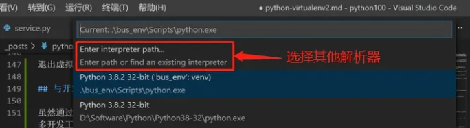
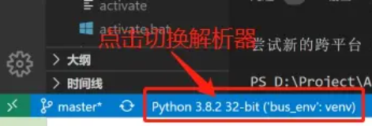
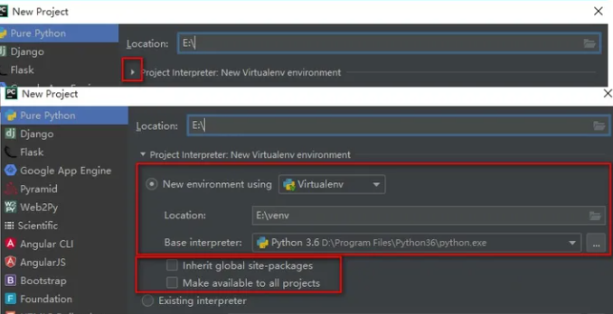

# 06.包模块及环境管理

## 一、模块

除了比较简单的脚本外，一个`Python`程序往往包括了多个含有`Python`语句的文本文件。程序拥有一个主体的顶层文件，辅以零个或多个被称为模块的支持文件。顶层文件 (又称为脚本)包含了程序的主要控制流程。而模块文件收集了顶层文件或其他模块要使用的组件，一个文件通过导人一个模块来获得这个模块定义的工具的访问权，这些工具被认为是这个模块的属性。模块提供了一种将部件组织为系统的一种可行方式，它将程序代码和数据封装起来以便再利用，同时提供自包含的命名空间从而避免程序出现变量名冲突。

实际上，模块(Module)就是一个包含了python定义和语句的`.py`文件，它就像是一个程序集的**工具包**，在模块中定义的 **全局变量** 、 **函数** 都是模块能够提供给外界直接使用的工具。

### 1.工作原理

有些`C`程序设计者喜欢把`Python`的模块导入操作比作C语言中的`#include`，其实并不相同，在`Python`中，导入并非只是把一个文件文本插入另一个文件，导入其实是运行时的操作，程序第一次导入指定文件时，会执行三个步骤：

- 找到模块文件；
- 编译成字节码(如果需要的话)；
- 执行模块的代码来创建其所定义的对象；
  - 为导入的模块创立新的名称空间；
  - 在新创建的名称空间中运行该模块中的代码；
  - 创建模块的名字，并使⽤用该名称作为该模块在当前模块中引⽤用的名字。

模块文件并不一定都是`.py`结尾的，如下文件都可以被作为模块导入。

```python
源代码文件b.py
字节码文件b.pyc
优化字节码文件b.pyo(一种相对不常见的形式)
目录b，对于包导入而言
编译扩展模块(通常用C或C++编写)，导时使用动态链接(例如Linux的bsoCygwin和Windows的bdll或b.pyd)
用C编写的编译好的内置模块，并被静态链接至Python
ZIP文件组件，导人时会自动解压缩
内存内镜像，对于冻结可执行文件而言
Java类，在Jython版本的Python中
NET组件，在IronPython版本的Python中
```

这三个步骤只在程序执行期间模块第一次导入时才会进行，在这之后导入相同模块时，会跳过这三个步骤，而只提取已加载的模块对象。事实上，第一次导入模块时，模块程序目录会发现一个 `__pycache__` 的目录，目录下会有一个 `module_name.cpython-312.pyc` 文件， `pyc` 文件是Python 解释器将 **模块的源码** 转换为的 **字节码**，有了模块的字节码文件之后，下一次运行程序时，如果在 **上次保存字节码之后** 没有修改过源代码，Python 将会加载 .pyc 文件并跳过编译这个步骤，当然，当 `Python` 重编译时，它会自动检查源文件和字节码文件的时间戳，如果又修改了源代码，下次程序运行时，字节码将自动重新创建。

> 是否还记得，`Python` 在解释源程序时是分成两个步骤的，首先处理源代码，**编译** 生成一个二进制 **字节码**，其次再对 **字节码** 进行处理，才会生成 CPU 能够识别的 **机器码**。

### 2.搜索路径及引用顺序

#### （1）搜素路径

当导入一个模块，Python解析器将按照模块名称对模块位置进行搜索，多数情况下，模块导入搜索路径是自动的，我们无需配置。不过，有时我们需要了解这一工作原理并进行定制。概括地讲，Python的模块搜索路径是下面这些主要组件拼接而成的结果，模块搜索路径存储在`sys`模块的`sys.path`变量中：

```python
# 程序的主目录
# shell变量PYTHONPATH目录(如果设置了的话)
# 标准库目录
# 安装目录的顶层下xxx.pth文件中的内容(如果存在的话)
# 第三方扩展应用的site-packages主目录
```

```python
import sys
print(sys.path)
#  ['...\\projects\\...\\tests', '...\\projects\\digital', '...\\pycharm_display', 'C:\\Users\\...\\AppData\\Local\\Programs\\Python\\Python312\\python312.zip', 'C:\\Users\\...\\AppData\\Local\\Programs\\Python\\Python312\\DLLs', '...\\Users\\...\\AppData\\Local\\Programs\\Python\\Python312\\Lib', '...\\Users\\...\\AppData\\Local\\Programs\\Python\\Python312', '...\\Envirment\\...', '...\\Envirment\\...\\Lib\\site-packages', '...\\pycharm_matplotlib_backend']
```

其中`任何.pth文件中的内容`是Python提供的一种替代`PYTHONPATH`设置的方案，允许用户把需要的目录添加到模块搜索路径中去，也就是在后缀名为`.pth` (路径path的意思)的文本文件中一行一行地列出目录。在window下，可以在Python安装目录的顶层`(C:Python33)`或者在标准库所在位置的`sitepackages`子目录中`(C: Python33 Lib sitepackages)`创建一个`myconfig.pth`文件，用来扩展模块搜索路径。在类UNIX系统中，该文件可能位于`usr/local/lib/Python 3.3/site-packages`或`/usr/local/lib/site-python` 中。

**修改/增加搜索路径**

修改如上任何一个路径都可以对搜索路径进行修改/增加，但推荐的增加方式，其一是通过增加`.pth`文件的方法，其二，直接向`sys.path`列表中增加新的路径字符串，其三是修改`PYTHONPATH`。

#### （2）引用顺序

默认情况下，模块导入会先引入内置模块，再引入扩展模块（第三方模块），最后引入自定义的模块。如果在不同目录同时出现了具有相同文件名称的模块，那么Python将总是由左至右搜索`sys.path`列表，依次导入相匹配的模块，同名后赋值的模块名将被保留。如果在同一目录下出现了相同名称的模块名，python解释器将会随机进行选择。

> 在模块取名时，尽量避免内置模块与第三方模块中已经使用的模块名，并且自定义模块名也应尽量取具有特征且不同的。

### 3.模块的使用

模块能定义函数，类和变量，模块里也能包含可执行的代码。

#### （1）模块命名

* 标示符可以由 **字母**、**下划线** 和 **数字** 组成
* **不能以数字开头**
* **不能与关键字重名**

> 一般建议将模块名首字母大写采用大驼峰命名法。

#### （2）模块导入

```python
- import 模块名1,模块名2,...
- from 模块名 import 功能名1,功能名2,...
- from 模块名 import *
- import 模块名 as 别名
- from 模块名 import 功能名 as 别名
```

> 官方文档提示并不推荐使用`from ...`语句，from语句其实是在导入者的作用域内对名称赋值，也就是名称复制运算，不是名称的别名机制。因此实际上`from` 和`import`都相当于赋值语句，会替换原本的变量名。<br>因此如果使用`from .. import ..`或`from .. import *`导入多个模块的时候，且模块内有同名功能。当调用这个同名功能的时候，调用到的是后面导入的模块的功能。

#### （3）制作模块

在Python中，每个Python文件都可以作为一个模块，模块的名字就是文件的名字。**也就是说自定义模块名必须要符合标识符命名规则。**新建一个Python文件，命名为`my_module1.py`，并定义`testA`函数。

```python
# my_module1.py
def testA(a, b):
    print(a + b)
# 无论是当前文件，还是其他已经导入了该模块的文件，在运行的时候都会自动执行`testA`函数的调用。
testA(1, 1)
# my_module2.py
import my_module1
my_module1.testA(1, 1) 
```

> 导入模块就会运行模块内的所有代码。

### 4.模块重载

#### （1）基本重载

一个模块的代码默认只为每个进程执行一次，如果要强制使模块代码重新载入并重新运行，那么就需要用到`reload`内置函数。`reload`函数会强制已加载模块的代码重新载入并重新执行，允许在整体程序不停止的情况下修改程序的一部分，文件中新的代码的赋值语句会在原位置修改现有的模块对象。

```python
# changer.py
message="First version"
def printer():print(message)

# testA.py
import changer
changer.printer()  # First version
```

不关闭解释器的前提下，直接修改`message`变量和`printer`函数体。

```python
# changer.py
message="After editing"
def printer():print('reloaded:',message)

# testA.py
import changer
from imp import reload
changer.printer()  # First version
reload(changer)
changer.printer()  # reloaded:After editing
```

> 注意：`reload`传入的参数是一个已经存在的模块对象，而不是一个新的名称，`from ... import ...`下若`from`跟的模块无法重载。

#### （2）递归重载

当我们重载一个模块时，Python 只重新载人这个指定模块的文件，而不会自动递归地重载被该文件导入的其他模块。一种更好的办法是编写一个通用工具来自动完成传递性重载，即通过扫描模块的`_dict_`命名空间属性并检查每一项的`_type_`以找到要重新载入的嵌套模块。这样的一个工具函数应该递归地调用自己，来遍历任意构型和任意深度的导入依赖链。

```python
# reloadall.py
import types
from imp import reload


def status(module):
    print('reload:' + module.__name__)


def tryreload(module):
    try:
        reload(module)
    except:
        print('Failed: %s' % module)


def transitive_reload(module, visited):
    if not module in visited:
        status(module)
        tryreload(module)
        visited[module] = True
        for attrobj in module.__dict__.values():
            if type(attrobj) == types.ModuleType:
                transitive_reload(attrobj, visited)


def reload_all(*args):
    visited={}
    for arg in args:
        if type(arg)== types.ModuleType:
            transitive_reload(arg, visited)


def tester(reloader,modname):
    import importlib,sys
    if len(sys.argv) >1: modname = sys.argv[1]
    module = importlib.import_module(modname)
    reloader(module)


if __name__ == '__main__':
    tester(reload_all, 'reloadall')

```

代码2：

```python
# reloadall2.py
import types
from imp import reload
from reloadall import status,tryreload,tester


def transitive_reload(objects,visited):
    for obj in objects:
        if type(obj) == types.ModuleType and obj not in visited:
            status(obj)
            tryreload(obj)
            visited.add(obj)
            transitive_reload(obj.__dict__.values(),visited)


def reload_all(*args):
    transitive_reload(args, set())


if __name__ == '__main__':
    tester(reload_all, 'reloadall2')
```

代码3

```python
# reloadall3.py
import types
from imp import reload
from reloadall import status,tryreload,tester


def transitive_reload(modules, visited):
    while modules:
        next = modules.pop()
        status(next)
        tryreload(next)
        visited.add(next)
        modules.extend(
            x for x in next.__dict__.values()
            if type(x) == types.ModuleType and x not in visited
        )
            
def reload_all(*modules):
    transitive_reload(list(modules), set())


if __name__ == '__main__':
    tester(reload_all, 'reloadall3')
```

### 5.模块高级技巧

#### （1）模块中的数据隐藏

如果一个模块文件中有`__all__`变量，**当且仅当**使用`from xxx import *`导入时，只能导入这个列表中的元素。

```python
# my_module1.py
__all__ = ['testA']

def testA():
    print('testA')

def testB():
    print('testB')
    
def _testB():
    print('testB')
    
# test.py
from my_module1 import *
testA()
testB()  # name 'testB' is not defined 
```

> python更建议使用`_X`的形式进行模块的私有声明，假如某个模块中变量以一个下划线开头，说明模块开发者不希望该变量被导入。

#### （2）混合使用模式

每个模块都有一个名为`__name__`的内置属性，Python会遵循下面的规则自动创建并赋值该属性:

- 如果文件作为顶层程序文件执行，在启动时串`__name__`就会被设置为字符串`__main__`；
- 如果文件被导人，`__name__`就会改设成客户程序所了解的模块名。

这样每个模块可以检测自己的`__name__`，来确定是在执行还是在导入。

```python
def tester():
    print("It's Christmas in Heaven...")
if __name__ == '__main__':
    # 其内的语句当且仅当“代码不是作为模块被导入时”才会执行
    tester()
```

这一功能被广泛应用于模块功能测试。

#### （3）模块文档帮助

使用help加模块名查看模块帮助。

```python
import sys
help(sys)
# Help on built-in module sys:
# NAME
#     sys
# MODULE REFERENCE
#     https://docs.python.org/3.12/library/sys.html
```

#### （4）导入字符串模块

在`import`或`from`语句中的模块名是被硬编码的变量名，有时候我们需要以一个字符串的形式获取要导入的模块名称，例如根据XML文档中解析出的导入。但是`import` 语句无法直接载入以字符串形式给出其名称的一个模块。

使用内置函数`eval()`或`exec()`执行导入代码，`exec`会编译一个代码字符串，并且把它传给Python解释器执行。由于字节码编译器在运行时可用，因此我们能像这样编写可以构建和运行其他程序的程序。

```python
exec('import String')
```

`exec`的缺点是每次运行时它必须编译import语句，而编译过程可能会很慢，对于那些多次运行的字符串，也许可以使用compile内置工具将其预编译为字节码来提速。但是最好的办法是使用`__import__()`函数或`importlib`模块来实现。

```python
string = __import__('string')

import importlib
string =importlib.import_module('string')
```

`__import__()`将直接返回模块对象，并将其赋值给变量。

## 二、包

随着功能越写越多, 当无法将所有功能都放在一个文件中时, 可以使⽤用模块去组织功能，随着模块越来越多, 就需要用文件夹将模块文件组织起来, 以此来提高程序的结构性和可维护性。包将有联系的模块组织在一起，即放到同一个文件夹下，并且在这个文件夹创建一个名字为`__init__.py` 文件，那么这个文件夹就称之为包。

### 1.创建包

直接新建文件夹，并在文件夹中新建一个`__init__.py` 就建好了包，在`pycharm`中可以直接右键新建包，包内部会自动创建`__init__.py`文件。

新建包`mypackage`，其中包含模块：`my_module1` 和 `my_module2`

```python
# my_module1
print(1)
def info_print1():
    print('my_module1')
# my_module2
print(2)
def info_print2():
    print('my_module2')
```

### 2.包的绝对导入

从包的外部导入包文件默认地跳过包自己的目录，导入只检查`sys.path`列表中的搜索路径，这称为绝对导人，和模块一样，包使用如下语句导入，这些语句中“带点号”的路径对应于机器上目录层次的路径，通过这个路径可以获得到文件。

```python
# 导入包
import 包名.模块名
from 包名 import *

# 示例使用包
import dir1.dir2.mod
from语句也是一样的:
from dir1.dir2.mod import x
```

点左边必须对应包名称，`dir1`必须在某个容器目录`dir0`，而`dir0`目录必须可以在`Python`模块搜索路径(`sys.path`)，除非它是顶层文件的主目录。 严格的说，包导入路径中最左边名称必须是`sys.path`模块搜索路径列表中的一个目录，从最左边的目录出发，脚本内的`import`语句需要显式地指出找到模块的目录路径。

`import`语句中的目录路径只能是以点号间隔的变量，不能在 import语句中使用任何平台相关的路径语法，如`C:\dir1`或`../dir1`。

```python
import C:\mycode\dir1\dir2\mod
# Error: illegal syntax

# 先添加C:\mycode 至 PYTHONPATH系统变量 或是 .pth文件中
import diri.dir2.mod
```

### 3.包的相对导入

对包导入的除了有从包的外部导入包文件外，还包括包内部彼此之间的互相导入，在包内部进行导入时，可以使用和外部导人相同的完整路径语法，还可以利用特殊的包内搜索规则来简化 `import`语句。这一搜索规则扩展了from语句的语法，允许`from`语句显式使用以点号`.`开头的子句来导入位于同一包中的模块，也就是包相对导入。

```python
from .import spam
from ..import string
```

以点号开头的导人只在包的内部目录进行搜索，而不会搜索到位于导入搜索路径`sys.path`上某处的同名模块，最终效果是包模块覆盖了外部的模块。不以点号开头的导入默认为一种先相对再绝对的搜索路径顺序，由左至右地搜索`sys.path`上的路径（首先搜索包自己的路径）。

> 点号开头的形式只能对from语句强制使用，import语句形式总是仅绝对导入的，并且会跳过内部的包路径。

### 4.`__init__.py `包文件

选择构建python包时，就必须遵循一条约束，包导入语句的路径中的每个目录内都必须有`__init__.py `包文件，否则包导入会失败。`__init__.py `除了应用构建包的结构外，还有以下作用：

- 将目录声明成一个Python包，这个文件夹时python包而不是任一和程序完全无关的目录文件夹。
- 初始化包内代码，包可以通过其初始化文件来创建所需要的数据文件、连接数据库等。
- 模块命名空间的初始化，脚本中的目录路径在导入后会变成真实的嵌套对象路径，两个不同包内相同名称的模块会被划分在两个命名空间中。
- 约束导入清单：可以在`__init__.py `文件内添加`__all__ = []`列表来规定当目录以`from*`语句形式导入时，应该导入的子模块的名称清单。

> 如果不使用`__init__.py `文件，可以让它们保持空白，实际上它们多数情况下确实是空的，但`__init__.py `文件必须要存在。

## 三、环境与环境管理

Python 之所以强大，除了语言本身的特性外，更重要的是拥有无所不及的第三方库。强大的软件库，让开发者将精力集中在业务上，而避免重复造轮子的浪费。但众多的软件库，形成了复杂的依赖关系，对采用 Python 开发的项目造成了不少困扰，所以 Python 建议，通过`虚拟环境`工具为项目创建纯净的依赖环境。

### 1.`python`版本与包库

`Python `版本指的是 `Python `解析器本身的版本，从大的方面讲可以分为`Python2`与`Python3`，从小的方面讲`Python2/3`又存在各个细分版本，目前最新版本的`python`解释器是`Python3.12.1`，随着版本的更新与第三方模块的更新，导致一些软件库需要设配多种版本的 `Python`解释器，因此开发者可能需要在一个环境中，部署不同版本的` Python`，对开发和维护造成了麻烦。因此出现了版本管理器 `Pyenv`，类似于 `nodejs `的 `nvm`，可以创建出相互隔离的 `Python` 环境，并且可以方便的切换环境中的 `Python` 版本。

包库或者叫软件源是` Python `第三方软件的库的集合，或者市场，可以发布、下载和管理软件包，如比较出名的爬虫库`requests`、科学计算库`numpy`、网站开发库`Django`...。其中 [pypi(Python Package Index)](https://pypi.org/)是官方指定的软件包库，基于其上的 `pip` 工具就是从这里查找、下载安装软件包的。为了提高下载速度，世界上有很多 `Pypi `的镜像服务器，在国内也有多个软件源，例如阿里的软件源是：http://mirrors.aliyun.com/pypi/simple/。除此之外，还有其他软件源，如正对科学计算的 `anaconda` 的软件源https://repo.anaconda.com/。

### 2.虚拟环境

Python 应用经常需要使用一些包第三方包或者模块，有时需要依赖特定的包或者库的版本，所以不能有一个能适应所有 Python 应用的软件环境，很多时候不同的 Python 应用所依赖的版本是冲突的，满足了其中一个，另一个则无法运行，解决这一问题的方法是 虚拟环境。虚拟环境是一个包含了特定 Python 解析器以及一些软件包的自包含目录，不同的应用程序可以使用不同的虚拟环境，从而解决了依赖冲突问题，而且虚拟环境中只需要安装应用相关的包或者模块，可以给部署提供便利。

#### （1）构建原理

`Python `虚拟环境主要是**利用了操作系统中环境变量以及进程间环境隔离的特性**构建的，在激活虚拟环境之时，激活脚本会将当前命令行程序的 `PATH `修改为虚拟环境的，这样执行命令就会在被修改的` PATH` 中查找，从而避免了原本 `PATH` 可以找到的命令，从而实现了` Python` 环境的隔离。为了让开发容易区分当前环境是否虚拟环境以及是那个虚拟环境，命令提示符前会加上特殊标记，例如:

```python
# windows
(digital) PS C:\project>
# linux
(digital)shelhen@shelhen-pc:
```

#### （2）构建工具

- **virtualenv工具**

在 `python3.3 `之前，只能通过 `virtualenv `创建虚拟环境，首先需要安装` virtualenv`

```text
pip install virtualenv
```

安装完后，在当前目录下创建一个名为 `myvenv` 的虚拟环境:

```text
virtualenv --no-site-packages myvenv
```

参数 `--no-site-packages` 的意思是创建虚拟环境时，不复制主环境中安装的第三方包，也就是创建一个 “干净的” 虚拟环境。

`virtualenv` 还有很多参数，用于不同的使用场景，例如:

```python
- -p: 用于指定 Python 解析器，就是安装好的 Python 应用程序，默认为当前环境中的 Python
- --no-pip：不需要安装 pip，默认为安装
- --clear：如果创建虚拟环境的目录已经有了其他虚拟环境，清楚重建
```

- **venv 模块**

`Python3.3 `之后，可以用模块` venv` 代替` virtualenv` 工具，好处是不用单独安装，`3.3 `及之后的版本，都可以通过安装好的 `Python`来创建虚拟环境：

```text
python -m venv myvenv
```

可以在当前目录创建一个名为 `myvenv `的虚拟环境

`venv `有些参数，不过相比 `virtualenv` 少了些，这里简单介绍几个：

```python
--without-pip: 不需要安装 pip，默认为安装
--clear：如果创建虚拟环境的目录已经有了其他虚拟环境，清楚重建
```

因为 `venv` 是依附于一个 `Python` 解析器创建的，所以不需要指定 `Python` 解释器版本

- **pipenv**

`pipenv` 是一款比较新的包管理工具，其借鉴了 `javascript` 的 `npm` 和 `PHP` 的 `composer` 等理念，通过一个依赖描述文件 `Pipfile` 来安装和管理依赖，以达到协同开发的目的。如果你熟悉` npm `或者` composer` 的话，那`pipenv `正合你胃口。`pipenv` 其实整合了` pip` 和 `virtualenv` 等库，在其上推出了更便捷的使用方式。

安装 pipenv

```text
pip install --user pipenv
```

创建虚拟环境

```text
pipenv --myvenv  # python3
```

然后编辑目录下的 `Pipfile`

```text
[[source]]
url = "https://pypi.python.org/simple"
verify_ssl = true
name = "pypi"

[packages]
requests = "*"


[dev-packages]
pytest = "*"
```

然后安装所有依赖

```text
pipenv install  # 类似与 npm install
```

命令行安装一个依赖并添加到 `Pipfile`

```text
pipenv install <package>  # 类似与 npm install <package>
```

依赖的安装详情也会写入 `Pipfile.lock` 文件，而新人接手旧的项目也只要`pipenv install`一下就好了。

- **conda**

`conda` 是一个神奇的库，它是著名的 `Python `发行版 [Anaconda](https://link.zhihu.com/?target=https%3A//www.anaconda.com/) 附带的包管理工具，它其实不是针对 `Python` 环境管理，而是 `Python, R, Ruby, Lua, Scala, Java, JavaScript, C/ C++, FORTRAN `等等语言的包、依赖和环境管理工具。它的野心很大，甚至还有 `UI `界面，具体细节将在下一章节包管理工具中进一步学习。

#### （3）虚拟环境激活

虚拟环境创建好后，需要激活才能在当前命令行中使用，可以理解成将当前命令行环境中 `PATH` 变量的值替换掉，通过` virtualenv` 和 模块` venv` 创建的虚拟环境，激活方式是一样的，即运行激活脚本`activate.bat`。

- Windows 系统中，激活脚本路径是 `<myvenv>\Scripts\activate.bat`，如果是 `powershell` 命令行，脚本换成 `Activate.ps1` , 注意将 `<myvenv>`换成你自己的虚拟环境目录
- Linux 系统中，激活脚本路径是 `<myvenv>/bin/activate`，默认脚本没有执行权限，要么设置脚本为可执行，要么用 `source` 命令执行，例如`source myvenv/bin/activate`。$ 

通过`pipenv`创建的激活环境激活方法：

```text
pipenv shell
```

激活后，可以在命令行中看到虚拟环境标记，如上图。打印 `PATH`，命令如下：

```sh
# Linux 下
echo $PATH
# Windows 下
echo %PATH%
```

这时可以看到创建的虚拟环境脚本目录被加载了最前面。

#### （4）退出虚拟环境

退出虚拟环境很简单，只需要执行 `deactivate` 命令就行，这个命令也在虚拟环境的脚本目录下，因为激活时，将脚本目录设置到 `PATH `中了，所以可以直接使用，退出虚拟环境相当于将 `PATH` 恢复成原来的。

#### （5）与开发工具配合

虽然通过激活脚本，很容易切换到虚拟环境，但是在实际开发中，还是不够方便，而且现在很多开发工具，特别是提供 `Python` 解析环境的开发工具，都可以和虚拟环境配合，在开发过程中几乎无感，对开发工作是很大的帮助。

- `vscode`

`VS Code` 是个后起之秀，功能强大且具有丰富的插件资源，无疑是这两年发展最快的综合开发工具。现在的版本配置 `Python` 虚拟环境很简单，只需要选择一个 P`ython` 解释器就好了。

同时按下` Ctrl+Shift+P`，在弹出的命令窗口中输入 "解析器"，然后在下拉列表中选择 "`Python`:选择解析器"，这里会缓存一些已经创建好的解析器，如果没有想要的，可以选择 "`Enter interpreter path`" 来选择解析器路径，即已经创建好的虚拟环境脚本文件夹中的 `Python` 程序，就可以创建一个新的解析器



如果编辑的是 `Python` 代码文件，在状态栏中也可以选择和切换解释器，更为方便。



- `pycharm`

`Pycharm` 应该是功能最好的 `Python` 开发工具，转为` Python` 开发而生，除了基本的开发功能外，还提供项目创建、打包、测试等丰富功能，有很大的市场占有率，创建项目时，在项目创建对话框中，可以创建或者选择已经已有的解析器。



选择创建新的解析器时，需要选择创建虚拟环境的工具，如 `virtualenv`；指定虚拟环境的目录；选择 `Python` 基础解析器，同 `virtualenv` 工具的` -p `参数的效果；以及是否要继承基础解析器的第三方库 和 是否将这个虚拟环境作为默认环境，即创建其他项目时默认选择。如果选择已存在的解析器，和 VS Code 差不多，可以选择已经缓存的或者指定解析器的路径。

#### （6）其他虚拟环境管理工具

- `virtualenvwrapper`：是对 `virtualenv` 的一个封装，还有针对 `vim` 用户和 `emacs `用户的 扩展，能支持 `bash/ksh/zsh`
- `virtualenvwrapper-win`：针对 `Windows batch shell` 的 `virtualenvwrapper`
- `pyenv`：用来解决这类问题。它可以安装、卸载、编译、管理多个 `python` 版本，并随时将其中一个设置为工作环境
- `pyenv-win`：针对 `Windows` 的 `pyenv`

### 3.包管理工具

软件包源中的软件包数量巨大，版本多样，所以需要借助于软件源管理工具，例如 `pip`、`conda`、`Pipenv`、`Poetry`等，这里主要学习两个最常用的，分别是`pip`和`conda`。

#### （1）`pip`工具

`pip `是 `Python` 包管理工具，该工具提供了对`Python `包的查找、下载、安装、卸载的功能。`Python 2.7.9 + `或 `Python 3.4+` 以上版本都自带 `pip` 工具，只要安装了上述版本的` python` ，则已经自带了` pip` 工具，[官方文档](https://pip.pypa.io/en/stable/getting-started/)。

```shell
python -m pip --version
```

在安装 `python 3.12` 时，由于自带的` pip (22.3.1) `版本较低，使用了在` python 3.12 `中删除的废弃` API pkgutil.ImpImporter`，其在` python 3` 中标记为 `deprecated`，引发异常：`module 'pkgutil' has no attribute 'ImpImporter'. Did you mean: 'zipimporter'?`，解决办法是升级 `pip `到最新的版本，并重新下载` Manim` 包。

```python
# 首先更新 pip
python3 -m ensurepip --upgrade
# 其次 使用新的 pip 卸载并重新下载 Manim 的包
pip uninstall -y setuptools
pip install setuptools
pip install manip
```

则可以使用以下方法来安装：

```shell
# Python 自带一个 module
python -m ensurepip --upgrade
# Python 脚本，它使用一些引导逻辑来安装
python setup.py install
curl https://bootstrap.pypa.io/get-pip.py -o get-pip.py
# zip安装
# 手动从https://bootstrap.pypa.io/pip/pip.pyz 下载zip文件
# 执行安装
python pip.pyz --help

# 升级pip工具
python3 -m pip install --upgrade pip
```

> 可能还有其他机制 可用于安装 `pip`，例如[使用 Linux 包管理器](https://packaging.python.org/en/latest/guides/installing-using-linux-tools/#installing-pip-setuptools-wheel-with-linux-package-managers)。

- 安装软件包

```python
python -m pip install sampleproject
py -m pip install sampleproject
# 前面不加入py -m/python -m也可以运行，
pip install sampleproject
# 包含版本
pip install SomePackage==1.0.4     # specific version
pip install 'SomePackage>=1.0.4'

# 从 GitHub 安装包
pip install git+https://github.com/pypa/sampleproject.git@main
# 直接从分发文件安装
pip install sampleproject-1.0.tar.gz
pip install sampleproject-1.0-py3-none-any.whl

# 使用需求文件安装多个软件包
pip install -r requirements.txt
```

> 当系统中同时存在`python2`和`python3`时间，要标明`pip2`/`pip3`。

- 软件包管理

```python
# 升级软件包
pip install --upgrade sampleproject
# 卸载软件包
pip uninstall sampleproject
# 列出软件包
pip list
# 列出过时的软件包，并显示可用的最新版本
pip list --outdated
# 显示有关已安装软件包的详细信息
pip show sphinx

# 搜索软件包
pip search "query"
```

`pip install --upgrade`现在有一个选项 控制 `pip` 如何处理依赖项的升级。

```python
# eager：升级所有依赖项，无论它们是否仍然满足 新的家长要求
# only-if-needed：仅当依赖项不满足新的 家长要求
pip install --upgrade --eager SomePackage
```

更多关于在应用中调用和按照用户安装的**更多细节**请参考官方文档。

- 需求文件`requirements.txt`

```python
# 安装
pip install -r requirements.txt
# 打包
pip freeze > requirements.txt
```

[了解更多文件格式](https://pip.pypa.io/en/stable/reference/requirements-file-format/)。

```python
# This is a comment, to show how #-prefixed lines are ignored.
# It is possible to specify requirements as plain names.
pytest
pytest-cov
beautifulsoup4

# The syntax supported here is the same as that of requirement specifiers.
docopt == 0.6.1
requests [security] >= 2.8.1, == 2.8.* ; python_version < "2.7"
urllib3 @ https://github.com/urllib3/urllib3/archive/refs/tags/1.26.8.zip

# It is possible to refer to other requirement files or constraints files.
-r other-requirements.txt
-c constraints.txt

# It is possible to refer to specific local distribution paths.
./downloads/numpy-1.9.2-cp34-none-win32.whl

# It is possible to refer to URLs.
http://wxpython.org/Phoenix/snapshot-builds/wxPython_Phoenix-3.0.3.dev1820+49a8884-cp34-none-win_amd64.whl
```

需求文件的每一行都表示要安装的内容， 或 [pip install](https://pip.pypa.io/en/stable/cli/pip_install/#pip-install) 的参数。支持以下形式：

- `[[--option]...]`
- `<requirement specifier>`
- `<archive url/path>`
- `[-e] <local project path>`
- `[-e] <vcs project url>`

- 切换源代理

默认情况下，pip 将从 [Python Package Index](https://pypi.org/) 获取包，一个 Python 编程语言的软件存储库，任何人都可以在其中上传包，但在国内可能访问会受到限制，使用国内镜像速度会快很多，比如下面的清华大学开源软件镜像。

```
# 常用源：
阿里云：http://mirrors.aliyun.com/pypi/simple/
中国科技大学：https://pypi.mirrors.ustc.edu.cn/simple/
豆瓣：http://pypi.douban.com/simple/
清华大学：https://pypi.tuna.tsinghua.edu.cn/simple/
中国科学技术大学：http://pypi.mirrors.ustc.edu.cn/simple/
华中理工大学：http://pypi.hustunique.com/
山东理工大学：http://pypi.sdutlinux.org/ 
```

**临时换源**

```python
pip install -i https://pypi.tuna.tsinghua.edu.cn/simple package_name
```

**永久换源，方案一：**

手动添加配置文件，在`C:\Users\Administrator`下创建一个`pip`文件夹，在里面创建`pip.ini`，并配置内容如下：

```
[global]
timeout = 6000
index-url = https://pypi.tuna.tsinghua.edu.cn/simple/ 
trusted-host = pypi.tuna.tsinghua.edu.cn
```

**永久换源，方案二：**

```sh
pip config set global.index-url https://pypi.tuna.tsinghua.edu.cn/simple
```

```sh
# 我常用的软件包
# 数据分析相关
pip3 install pandas numpy matplotlib jupyter openpyxl xlsxwriter scipy scikit-learn
# 爬虫相关
pip3 install requests
# 网站开发相关
pip3 install django pymysql redis
```

- 使用代理服务器

从 [PyPI](https://pypi.org/) 安装软件包时，pip 需要 Internet 访问，这 在许多企业环境中，需要出站 HTTP 代理服务器。

可以将 pip 配置为通过各种方式通过代理服务器进行连接：

- 使用命令行选项在表单中指定代理`--proxy``scheme://[user:passwd@]proxy.server:port`
- 在[配置文件](https://pip.pypa.io/en/stable/topics/configuration/#config-file)中使用`proxy`
- 通过设置标准环境变量 和 。`http_proxy``https_proxy``no_proxy`
- 使用环境变量包含 pip 请求中使用的 user-agent 变量中的 JSON 编码字符串。`PIP_USER_AGENT_USER_DATA`

#### （2）`conda` 

`conda` 是一个神奇的库，它是著名的 `Python `发行版 [Anaconda](https://link.zhihu.com/?target=https%3A//www.anaconda.com/) 附带的包管理工具，它其实不是针对 `Python` 环境管理，而是 `Python, R, Ruby, Lua, Scala, Java, JavaScript, C/ C++, FORTRAN `等等语言的包、依赖和环境管理工具。它的野心很大，甚至还有 `UI `界面。`Miniconda `是一个 `Anaconda` 的轻量级替代，默认只包含了 `python` 和 `conda`，但是可以通过 `pip `和 `conda `来安装所需要的包。由于这里只介绍包管理工具的使用，因此以`Miniconda `为例，[下载安装`min-conda`](https://docs.anaconda.com/miniconda/#latest-miniconda-installer-links)。

- 安装

`win`上直接安装`.exe`文件即可，`linux`上安装命令：

```shell
mkdir -p ~/miniconda3
wget https://repo.anaconda.com/miniconda/Miniconda3-latest-Linux-x86_64.sh -O ~/miniconda3/miniconda.sh
bash ~/miniconda3/miniconda.sh -b -u -p ~/miniconda3
rm ~/miniconda3/miniconda.sh
```

安装完毕后可以直接通过`Anaconda Prompt`打开使用，也可以将`min-conda`添加至用户/系统环境变量中直接使用，注意`C:\ProgramData`可能是被隐藏的。

```shell
# 需要添加至系统环境的路径
C:\ProgramData\miniconda3
C:\ProgramData\miniconda3\Scripts
C:\ProgramData\miniconda3\Library\bin
```

添加后如果打开`cmd`或命令行可以直接使用`conda`命令即安装成功。

- 基础配置

如果出现如下报错，主要原因是`conda`自带的`openssl`包需要更新所致，该包与`https`协议有关，将导致所有`https`协议都失败，更新此包默认仍使用`https`协议，因此也无法直接更新。

```python
 ...Failed to establish a new connection: [WinError 10061] 由于目标计算机积极拒绝，无法连接。')
```

修复方式：首先将`conda`安装源默认从`https`更新为`http`协议。

可以在`%userprofile%`下创建一个`.condarc`下载源文件（通过命令行`conda config --set show_channel_urls yes`也可直接创建），在其中添加需要更换的镜像源代码，注意将其中的`https`都更改为`http`（也可通过命令行添加`conda config --add channels http://mirrors.tuna.tsinghua.edu.cn/anaconda/pkgs/free/`），修改后保存并关闭文件。

```shell
# 下面https都要更改为http
channels:
  - https://mirrors.tuna.tsinghua.edu.cn/anaconda/pkgs/free/
  - https://mirrors.tuna.tsinghua.edu.cn/anaconda/pkgs/main/
  - https://mirrors.tuna.tsinghua.edu.cn/anaconda/cloud/conda-forge/
  - https://mirrors.tuna.tsinghua.edu.cn/anaconda/cloud/pytorch/
  - https://mirrors.tuna.tsinghua.edu.cn/anaconda/pkgs/pro/
  - defaults
show_channel_urls: true
```

其次更新`openssl`包，`conda update openssl`，更新完毕后，再将上述源文件中的`http`统一改为`https`，否则所有请求都默认使用`http`协议，上述给出了增加和配置源文件的命令，这里补充`conda config --remove`。

> 官方文档显示最新版`conda`已经解决上述问题。

- 常用命令

```python
# 创建环境
conda create --name $ENVIRONMENT_NAME python==3.7.16  # Virtualenv： cd $ENV_BASE_DIR; virtualenv $ENVIRONMENT_NAME 
# 查看目前所有环境
conda info --envs  # virtualenv wrapper：lsvirtualenv
conda env list
# 激活虚拟环境
conda activate <envname>  #Virtualenv： source $ENV_BASE_DIR/$ENVIRONMENT_NAME/bin/activate
# 退出虚拟环境
conda deactivate  # Virtualenv：deactivate

# 安装包
conda install $PACKAGE_NAME  # 等价于 pip install $PACKAGE_NAME
# 来自固定源
conda install --channel $URL $PACKAGE_NAME
# pip install --index-url $URL $PACKAGE_NAME
# 安装更新python
conda install python=x.x  #conda update python

# 更新包
conda update $PACKAGE_NAME==version  # pip install --upgrade $PACKAGE_NAME==version
conda update conda  # python -m pip install -U pip

# 删除某个环境中的某个包
conda remove --name $ENVIRONMENT_NAME $PACKAGE_NAME
# 删除某个环境
conda remove --name $ENVIRONMENT_NAME
# 删除某个包
conda remove --name $PACKAGE_NAME # pip uninstall $PACKAGE_NAME
# 查找一个包 
conda search $SEARCH_TERM  # pip search $SEARCH_TERM

# 列出所有包
conda list --name $ENVIRONMENT_NAME  # pip list

# 导出包为requirements
conda list --export  # pip freeze
```

> `conda update python`可以将`python`更新至当前版本下最新的版本，如将`python3.7.0->python3.7.19`。

[更多可参考Conda官方文档](https://conda.io/en/latest/index.html)。

### 4.部署流程

一般部署流程是：

- 开发完成后，使用 `pip freeze > requirements.txt` 命令将项目的库依赖导出，作为代码的一部分
- 将代码上传到服务器
- 在服务器上创建一个虚拟环境
- 激活虚拟环境，执行 `pip install -r requirements.txt`，安装项目依赖

