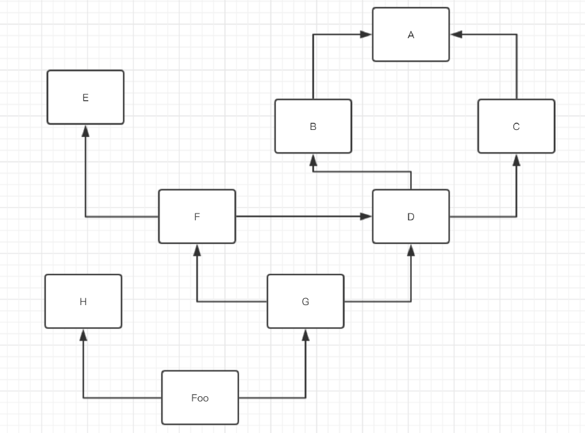

# 08.面向对象编程

在模块化阶段，我们使用函数和模块来简化程序的设计，**把相对独立且经常重复使用的代码放置到函数中**，在需要使用这些代码的时候调用函数即可。如果一个函数的功能过于复杂和臃肿，又可以进一步**将函数进一步拆分为多个子函数**来降低系统的复杂性。这一思路本质上是写程序的人按照计算机的工作方式通过代码控制机器完成任务，但是随着软件复杂性的增加，函数式编程思想使得代码过于复杂，使得开发和维护变得极为艰巨，如何用程序描述复杂系统和解决复杂问题，就成为了所有程序员必须要思考和直面的问题。

诞生于上世纪70年代的Smalltalk语言引入了一种新的编程范式叫面向对象编程。面向对象编程是一种非常流行的**编程范式**（programming paradigm），所谓编程范式就是**程序设计的方法论**，简单的说就是程序员对程序的认知和理解以及他们编写代码的方式。在面向对象编程的世界里，程序中的**数据和操作数据的函数是一个逻辑上的整体**，我们称之为**对象**，**对象可以接收消息**，解决问题的方法就是**创建对象并向对象发出各种各样的消息**；通过消息传递，程序中的多个对象可以协同工作，这样就能构造出复杂的系统并解决现实中的问题。面向对象提供了一种不同寻常而往往更有效的编程方式，该方式可以将代码分解从而把冗余程度降至最低，并且通过定制已有的代码来编写新的程序而不是在原处进行修改。

> **面向对象编程**：把一组数据和处理数据的方法组成**对象**，把行为相同的对象归纳为**类**，通过**封装**隐藏对象的内部细节，通过**继承**实现类的特化和泛化，通过**多态**实现基于对象类型的动态分派。——《面向对象分析与设计》

|                | 面向对象                                                     | 面向过程                                                     |
| -------------- | ------------------------------------------------------------ | ------------------------------------------------------------ |
| 思想           | 找出解决问题的人，然后分配职责。                             | 分析出解决问题的步骤，然后逐步实现。                         |
| 举例：婚礼筹办 | 找摄影公司（拍照片、制作请柬）<br>找酒店（告诉对方标准、数量、风格）<br>找婚庆公司（对方提供司仪、制定流程、提供设备、帮助执行） | 选照片、措词、制作<br>准备场地、厨师、桌椅餐具、菜品、食材<br>定婚礼仪式流程、请主持人 |
| 公式           | 程序 = 对象 + 交互                                           | 程序 = 算法 + 数据结构                                       |
| 优点           | 更接近于人的思维方式，有利于梳理归纳、分析解决问题。         | 所有环节、细节自己掌控。                                     |
| 缺点           | 代码执行效率相对较低。                                       | 考虑所有细节，工作量大。                                     |

> 和模块化设计与面向过程相同，面向对象也是完全是可选的。

## 一、面向对象实现方法

### 1.理解类和对象

在面向对象编程的世界中，世界上的一切都可以被抽象为对象，对象都有属性和行为，对象的属性是对象的静态特征，对象的行为是对象的动态特征。如果把拥有共同特征的对象的属性和行为都抽取出来，就可以定义出一个类。比如`list`、`set`、`dict`都是Python内置的类，类中封装了一系列属性与方法。之前我们一直直接使用已经定义好的内置类创建的具体的对象，列表、集合、字典对象就是我们指的对象，但是为了适应更复杂的开发环境，需要自定义类。简而言之，**类是对象的蓝图和模板，对象是类的实例**。**类是一个抽象的概念，对象是一个具体的概念**。

事实上，类只是运用**面向对象的思想**扩展了之前学习的内容，类和通过类产生的实例虽然是两种不同的对象类型，但二者具有类似的命名空间结构并且依赖一定的搜索继承机制，**即位置较高的对象可以为子对象提供共享的行为，而位置较低的对象可以重写父对象的名称覆盖父类的数据和行为。**从本质上讲，`Python` 中的`OOP `机制主要依托于两个基础：**一个特殊函数的第一位参数（self）以及继承属性搜索。**除此之外，这个模型基本上就是处理内置类型的函数（运算符重载）。从更具体的编程角度来看，面向对象和面向过程一样，面向过程使用函数和模块分解实现代码重构，而面向对象使用类与对象来实现代码的逻辑封装。**可以将类与对象理解成一个个模块，但是类对应`class`语句而模块对应文件。**虽然不是全新的一套体系，但`OOP` 相较于扁平的面向过程编程模型增加了额外的层次结构，从而成为了一个更好的模型。`OOP` 和之前见过的函数式工具一样，代表着一种在计算机硬件上进行抽象的步骤，以协助编写日益复杂精细的程序。

> 总结以上内容，在面向对象阶段我们重点研究以下内容，`class`语句及`self`参数、类与对象的命名空间、面向对象的继承属性搜索机制、运算符重载和面向对象的设计思想。

### 2.面向对象实现方法

#### （1）类的定义

类是实例工厂，类的属性提供了行为 (数据以及函数)，所有从类产生的实例都继承该类的属性。`python`中使用`class`语句创建类，`class `是复合语句，其缩进语句的主体一般都出现在头部行下边。在头部行中，父类列在类名称之后的括号内，由逗号相隔。

```python
class Washer(object):
    # 增加一部分类的说明文档。
    "describe about the class."
    
    def __init__(self, width, height):
        # 定义初始化对象时，对象可以继承的属性
        self.width = width
		self.height = height
    def wash(self, cloid):
        # 在类的内部定义对象的方法
        print(f"开始清洗衣服{cloid}")
        print(f"衣服{cloid}清洗完毕")

    def say(self):
        print('我会洗衣服')
        
    def get_class(self):
        # 非初始化属性只有当方法被调用时才会生成
        self.name = '洗衣机类'
    
    def introduce(self)
    	print(f'我是{self.name}')
    
    def __repr__(self):
        return 'Washer:%s,%s' % (self.name,self.pay)
    
    # def say():  # 不可以定义不包含self的方法
```

在class语句内，任何赋值语句都会产生**类属性**，类属性提供了对象共享的信息和行为。而且还有一些特殊的重载运算符，例如如果定义了名为 `__init__` 的构造函数就会在实例对象创建时调用，定义一个`__repr__`的打印显示函数就会在直接`print(class)`时自定义需要的内容，这将在后续进一步阐述。

> 注意类的命名规范，一般首字母大写，不添加下划线，采用大驼峰命名方法。

#### （2）类的实例化

对象代表程序领域中具体的元素，实例的属性记录了每个实例自己的数据。像函数那样调用类时会实例化出一个对象，每个对象将继承类的属性并生成自己的命名空间，对象内部包含`self`的属性做赋值运算会产生每个实例自己的属性，不会影响类的属性。

```python
# 实例化一个对象
haier1 = Washer()
# haier对象调用实例方法
haier1.say()
```

类定义了公用的、共享的数据和行为，并生成实例。实例反映了具体的应用程序中的实体，记录了每个实例自己随着对象变化的数据。

#### （3）`self`指针

`self`指向调用某函数的对象，打印对象和self得到的结果是一致的，都是当前对象的内存中存储地址。

```python
# 2. 创建对象
haier1 = Washer(10, 20)
# <__main__.Washer object at 0x0000018B7B224240>
print(haier1)
# haier1对象调用实例方法
haier1.wash('C00001')

haier2 = Washer(20, 10)
# <__main__.Washer object at 0x0000022005857EF0>
print(haier2)

# self 实际上就是指调用当前方法的对象，当由类调用时，需要手动传入调用对象。
Washer(20, 20).wash('C00001')
Washer().wash(haier1,'C00001')
```

### 3.对象的属性与方法

属性即是特征，比如：洗衣机的宽度、高度、重量...，方法即功能，例如洗衣、烘干....。对象属性与方法既可以在类外面添加和获取，也能在类里面添加和获取。

```python
from random import choice

class Dog(object):
    def __init__(self, name):
        # 在类的内部定义对象属性
        self.name = name
        self.color = choice(['red', 'black', 'white', 'stripe', 'spot'])
        self.master = None
        id2 = 'BXDGFAT2'
        # 在函数内部定义不包含self的属性含义为局部属性，该变量将在__init__()函数运行结束后彻底消失，因此不会被对象继承。

    def say(self):
        print('汪汪汪')

    def show_color(self):
        # 在类的内部获取对象属性
        print(self.color)


cg = Dog('小贵')
# 在类的外部获取对象属性/方法
cg.say()
print(cg.name, cg.color)

# 在类的外部定义对象属性/方法
cg.master = '小恒'
def show_master(name):
    print(name)
cg.show_master = show_master
cg.show_master(cg.master)
```

在创建类时直接定义对象的属性和方法，当实例化对象时，对象就可以继承这些属性与方法。对象实例化后，通过赋值语句可以直接修改或添加新的属性或方法。

> `cg`实例化后其本身包含着对类属性的引用，当需要用到该引用指向的内存时，`Python` 会顺着实例到类的连接搜索，这就是我们说的**对象对类的继承**，对实例本身进行赋值等价于建立了新的引用。继承是在属性点号运算时发生的，而且只与查找连接对象内的名称有关。

### 4.类的属性与方法

即使没有实例，类本身也是对象，可以使用赋值语句为其创建属性并访问。事实上，类其实只是自包含的命名空间。因此只要有类的引用值，就可以在任何时刻设定或修改其属性。

```python
class rec: pass

def say(obj):
    print(f'我的名字是{obj.name}')

rec.name = '小狗'
rec.say = say
```

类属性就是 **类对象** 所拥有的属性，它被 **该类的所有实例对象 所共有**，类属性可以使用 **类对象** 或 **实例对象** 访问。

```python
class rec: id = 'BXDGFAT'
# 定义类内部的全局属性，该属性可以对象被继承，可以被对象重写，但不能在类内的任何方法中被使用。

# 通过赋值变量名给这个类增加属性，这种使用方式甚至没有用到实例对象。
rec.name = '小狗'  # 将类当作对象赋予的属性也是类属性
rec.age = 40
print(rec.id, rec.name)  # BXDGFAT 小狗

x = rec()
y = rec()
print(x.id, x.name)  # BXDGFAT 小狗
print(y.id, y.name)  # BXDGFAT 小狗
# 这些实例会从创建他们的类中继承附加在类上的属性。
x.id, x.name = '123','小猫'
print(rec.id,rec.name )  # BXDGFAT 小狗
print(y.id,y.name)  # BXDGFAT 小狗

rec.id, rec.age = '3456',10
print(x.id, x.age)  # 123 10
print(y.id, y.age)  # 3456 10
```

把简单的非函数的对象赋值给类属性，就会产生被所有实例共享的数据属性，这种属性在继承此类的实例之间共享，像这样的类属性一种应用是用于管理横跨所有实例的信息（**记录的某项数据 始终保持一致时**），例如已产生实例数量的计数器。**实例属性** 要求 **每个对象** 为其 **单独开辟一份内存空间** 来记录数据，而 **类属性** 为全类所共有 ，**仅占用一份内存**，**更加节省内存空间**。

**类属性只能通过类对象修改，不能通过实例对象修改，如果通过实例对象修改类属性，表示的是创建了一个实例属性。因此对对象属性进行赋值总是会修改该对象属性。**事实上，命名空间对象的属性是以字典的形式实现的，而对象之间的继承只是互相连接的字典。

```python
def say(obj):
    print(f'我的名字是{obj.name}')
rec.say = say

rec.say(x)
z = rec()
z.say()
```

即使是方法也可以完全独立地创建在任意类对象的外部，但是要注意，这里的方法和类没关系，只是恰巧满足了接口，不过，如果我们把这个简单函数赋值成这里类的属性，该函数就变成了方法。方法既可以被任何实例调用，也可以手动传入一个实例通过类名称本身调用。

```python
class MixedNames:
    data='spam'

    def __init__(self,value):
        self.data= value

    def display(self):
        # 类内部访问类属性
        print(self.data, MixedNames.data)

mix = MixedNames(20)
mix.display()  # 20 spam 
```

## 二、类属性与类方法

有时候，程序需要处理与类而不是与实例相关的数据，如要记录由一个类创建的实例的数目或维护当前内存中一个类的所有实例的列表。这种信息通常存储在类自身上，而且不需要任何实例就可以处理。

一种思路是像如下一样在类外部编写的简单函数，它们能够通过类名访问类数据并且不需要通过一个实例，但是通过定义全局函数的方式实现这种功能一方面函数实现在结构与面向对象联系很小，函数可能定义在距离类比较远的地方，不利于后期维护，另一方面该函数不能通过继承定制和扩展。

```python
def say(cls):
    print(cls.name)
class rec:name='蔡贵'
# 完全函数
say(rec)  # 蔡贵

# 定义在类内部
rec.say = say
rec.say(rec)  # 蔡贵

# 该方法被实例继承！！
cai = rec()
cai.say()  # 蔡贵
```

另一种思路是将方法与实例绑定，通过实例来调用，但是这一思路下，如果我们不创建实例，就无法调用该方法，而有时例如创建类的计数器时，一旦创建新的实例，又会改变类的数据。

```python
class Rec:
    num=1
	def __init__(self):
        rec.num+=1
    def say(self):
        print(rec.num)
rec1 = Rec()
rec2 = Rec().
Rec().say() # 3
```

Python中提供三种与类相关的方法：实例方法、类方法和静态方法，实例方法即过去学习的首个参数为`self`的方法，实例方法必须通过实例调用，是类发送给对象的消息。

| 函数/方法 | 特征                                  | 说明                                                   |                                                              |
| --------- | ------------------------------------- | ------------------------------------------------------ | ------------------------------------------------------------ |
| 普通函数  | `def say()`                           | 任意调用，不可通过继承定制和扩展。                     | ——                                                           |
| 实例方法  | `def say(self):`                      | 只能通过实例调用，可通过继承定制和扩展。               | 实例方法一般用于方法内部需要访问实例属性的方法，可以在类内部通过**类名.类属性**的方式访问类属性，但是实例方法只能由实例调用。 |
| 类方法    | `def say(cls):`使用`@classmethod`装饰 | 可以通过类或实例调用，可继承扩展，其中必须传入类对象。 | 类方法一般用于方法内部仅仅需要访问 **类属性**的方法，类方法更适合处理对同一类树中的各个类之间相互区别的数据。 |
| 静态方法  | `def say():`使用`@staticmethod`装饰   | 可以通过类或实例调用，可继承扩展，无需传入类对象。     | 静态方法一般用于方法内部无需访问 **实例属性** 和 **类属性**的方法，静态方法更适合处理一个类的局部数据。 |

### 1.类方法

**类方法是嵌套在一个类中的没有`self`参数但有`cls`参数的简单函数，该方法旨在操作类属性而不是实例属性，该方法可以通过类或对象直接调用，支持继承和扩展，通常用于处理横跨所有实例的信息，而不是为实例提供行为。**类方法需要用装饰器`@classmethod`来标识其为类方法，对于类方法，**第一个参数必须是类对象**，一般以`cls`作为第一个参数。

```python
class Dog(object):
    __tooth = 10

    @classmethod
    def get_tooth(cls):
        return cls.__tooth
    
    def get_tooth2(cls):
        return cls.__tooth

    def say(self):
        print('11')
    # 等价于装饰器
    get_tooth2 = classmethod(get_tooth2)

wangcai = Dog()
print(Dog.get_tooth())  # 10
print(wangcai.get_tooth())  # 10
print(wangcai.say())  # 11
print(Dog.say())  # 报错
```

> 类方法一般和类属性配合使用，当方法中 **需要使用类对象** (如访问私有类属性等)时定义类方法。

### 2.静态方法

静态方法是嵌套在一个类中的没有`self/cls`参数的简单函数，并且旨在实现与类相关联的、可继承的且能通过类及实例调用的方法，**静态方法既不需要传递类对象也不需要传递实例对象（形参没有self/cls）。**静态方法需要用装饰器`@staticmethod`来修饰，静态方法 也能够通过 **实例对象** 和 **类对象** 去访问。

```python
class Dog(object):
    @staticmethod
    def info_print():
        print('这是一个狗类，用于创建狗实例....')

	def info_print2():
        print('这是一个狗类，用于创建狗实例....')
	
    # 等价于装饰器
    info_print2 = staticmethod(info_print2)
    
wangcai = Dog()
# 静态方法既可以使用对象访问又可以使用类访问
wangcai.info_print()
Dog.info_print()
```

> 由于静态方法**既不需要使用实例对象**(如实例对象，实例属性)，**也不需要使用类对象** (如类属性、类方法、创建实例等)，因此其有利于 **减少不必要的内存占用和性能消耗**

## 三、面向对象三大特性

### 1.继承

类除了可以作为工厂用于生产实例外还可以通过继承来进行修改，并且修改不会作用于父类。在`python`中，实例从类中继承，而类继承自父类。**位置较高的类可以为子类（对象）提供共享的行为，而位置较低的类（对象）可以重写父类的名称覆盖父类的数据和行为。**

#### （1）继承的特点

以下是属性继承机制的几个需要注意的点：

- 子类从其父类中继承属性，默认继承所有的属性和方法。
- 实例会继承所有可访问类的属性。
- 继承的目的是对父类的定制型修改
- 所有类默认继承object类，object类是顶级类或基类；其他子类叫做派生类。
- 每个`object.attribute`引用都会启动一个新的独立的搜索。

> `Python2`中的类可以分为经典类和新式类，`Python3`中的类都是新式类，其区别将在后续进一步了解。

```python
# 1. 师父类
class Master(object):
    def __init__(self):
        self.kongfu = '[古法煎饼果子配方]'

    def make_cake(self):
        print(f'运用{self.kongfu}制作煎饼果子')


# 2. 徒弟类
class Prentice(Master):
	pass


# 3. 创建对象daqiu
daqiu = Prentice()
# 4. 对象访问实例属性
print(daqiu.kongfu)
# 5. 对象调用实例方法
daqiu.make_cake()  # 运用[古法煎饼果子配方]2.0 制作煎饼果子
```

#### （2）方法重写

如果父类的方法不能满足需求，可以在子类重写父类的方法，子类和父类具有同名属性和方法，默认使用子类的同名属性和方法。有三种方法重写父类方法，**第一是直接覆盖父类的方法，第二是对父类方法进行扩展，第三是增加新的方法。**

| 方法             | 特征                                                         | 实现                                                         |
| ---------------- | ------------------------------------------------------------ | ------------------------------------------------------------ |
| **覆盖父类方法** | 父类的方法实现 和 子类的方法实现，完全不同                   | 在 子类中 定义了一个 和父类同名的方法并且实现                |
| **扩展父类方法** | 子类的方法实现 中 包含 父类的方法实现<br>父类原本封装的方法实现 是 子类方法的一部分 | 在 子类中 定义了一个 和父类同名的方法并且实现<br>在需要的位置使用 `super().父类方法` 来调用父类方法的执行<br>代码其他的位置针对子类的需求，编写 子类特有的代码实现 |
| **增加新的方法** | 按照需求定义父类中不包含的子类的全新方法                     | 在 子类中 定义了一个 和父类不同名的方法并且实现              |

```python
class Prentice(Master):
    # 在子类中定义父类的重名方法即可覆盖父类方法
    def __init__(self):
        self.kongfu = '[独创煎饼果子配方]'
        self.kongfu2 = '[独创烤肠配方]'

    def make_cake(self):
        # 如果是先调用了父类的属性和方法，父类属性会覆盖子类属性，故在调用属性前，先调用自己子类的初始化
        self.__init__()
        print(f'运用{self.kongfu}制作煎饼果子')

    # 拓展父类方法思路1
    def make_master_cake1(self):
        # 调用父类方法，但是为保证调用到的也是父类的属性，必须在调用方法前调用父类的初始化
        Master.__init__(self)
        Master.make_cake(self)

    # 拓展父类方法思路2
    def make_master_cake2(self):
        super().__init__()
        super().make_cake()

    # 创建新的方法
    def make_sausages(self):
        print(f'运用{self.kongfu2}制作烤肠')

daqiu = Prentice()
daqiu.make_cake()  # 运用[独创煎饼果子配方]制作煎饼果子
daqiu.make_master_cake1()  # 运用[古法煎饼果子配方]制作煎饼果子
daqiu.make_master_cake2()  # 运用[古法煎饼果子配方]制作煎饼果子
daqiu.make_sausages()  # 运用[独创烤肠配方]制作烤肠
```

> 请在这里留下疑问，使用`supper`还是使用`父类名.方法(self)`？

#### （3）多继承与多层继承

python⽀持多继承，一个子类可以拥有多个父类，并且具有所有父类的属性和方法，并且子类可以继续被继承。

```python
# class Master
class School(object):
    def __init__(self):
        self.kongfu = '[标准煎饼果子配方]'
    def make_cake(self):
        print(f'运用{self.kongfu}制作煎饼果子')

class Prentice(School, Master):
    # 多继承
    def __init__(self):
        self.kongfu = '[独创煎饼果子配方]'
    def make_cake(self):
        # 如果是先调用了父类的属性和方法，父类属性会覆盖子类属性，故在调用属性前，先调用自己子类的初始化
        self.__init__()
        print(f'运用{self.kongfu}制作煎饼果子')
    # 调用父类方法，但是为保证调用到的也是父类的属性，必须在调用方法前调用父类的初始化
    def make_master_cake(self):
        Master.__init__(self)
        Master.make_cake(self)
    def make_school_cake(self):
        School.__init__(self)
        School.make_cake(self)

# 徒孙类
class Tusun(Prentice):
    # 多重继承
    pass

daqiu = Prentice()
# 调用重写的方法
daqiu.make_cake()
# 调用继承来的方法1
daqiu.make_master_cake()
# 调用继承来的方法2
daqiu.make_school_cake()

xiaoqiu = Tusun()
xiaoqiu.make_cake()
xiaoqiu.make_school_cake()
xiaoqiu.make_master_cake()
```

> 在实际开发中， 如果父类之间存在同名的属性或者方法，应尽量避免使用多继承。

#### （4）`isintance`与`type`

在python里面，存在`isinstance`和`type`两个内置函数来判断变量否属于某个类，二者区别如下：

| 函数        | 用法                                    | 说明                                                         |
| ----------- | --------------------------------------- | ------------------------------------------------------------ |
| `isintance` | `isinstance(object, classname[,tuple])` | 判断某个对象是否属于某个已知类型，认为子类和父类是同一类型，考虑继承关系。 |
| `type`      | `type(object)`                          | 获得未知对象的所属的类型名称，不会认为子类和父类是同一类型，不考虑继承关系。 |

```python
class A(object): pass
class B(A): pass
class C: pass
a = A()
b = B()
c = C()

# 对象的类型与参数二的类型相同则返回True，即使A是b的父类
print(isinstance(b, A))  # True
# 若对象类型与元组中类型名之一相同即返回True，即使其中包含父类
print(isinstance(b, (B,C)))  # True
# 对象的类型与参数二的类型不同，或与元组中任一类型均不相同，则返回False
print(isinstance(b, (C, int)))  # False

print(A, type(a), B, type(b))
# <class '__main__.A'> <class '__main__.A'> <class '__main__.B'> <class '__main__.B'>

print(type(a) == A)  # True
print(type(a) is A)  # True
print(type(b) == A)  # False
print(type(b) is A)  # False
# == 判断二者是否值相等， is 判断二者是否为同一对象
```

> `type`主要用于获取未知变量的类型，`isinstance`主要用于判断`A`类是否继承于`B`类。

#### （5）`MRO`准则

多继承用起来简单，也很好理解。但是多继承中，当两个父类中出现了重名方法的时候，这时子类究竟会继承哪个方法呢？这就涉及到如何查找父类方法的这么一个问题——即`MRO(method resolution order) `问题。在`python`中这是一个很复杂的问题，因为对于新式类与经典类对应的`MRO`的算法不同，而新式类与经典类的问题遗留自`python2`与`python3`的版本变化。

- 经典类的`MRO`

虽然在`python3`中已经不存在经典类了，但是经典类的`MRO`还是值得一学，经典类的`MRO`是树形结构遍历的一个最直接的案例。在python的继承体系中，可以把类与类继承关系化成一个树形结构的图。

```python
class A:pass
class B(A):pass
class C(A):pass
class D(B, C):pass
class E:pass
class F(D, E):pass
class G(F, D):pass
class H: pass
class FOO(H, G):pass
```



经典类中的`MRO`算法采取深度优先遍历原则，即先一条路走到头，如果找不到，则回来继续找下一个。


如果是按照`123456`的顺序遍历就是深度优先遍历，如果按照`142356`的方式遍历则称之为广度优先遍历。因此对于上方树形类图而言，经典类的`MRO`算法选择`F00->H->G->F->E->D->B->A->C`的顺序继承。

- 新式类中的`MRO`

新式类的`MRO`是采用的`C3`算法来完成的，`c3`算法是一种广度优先的排序算法，如下继承关系中，假设`c3`算法为$L(x)$​，希望寻找`H`对象的继承顺序，计算方法如下。

```python
class A:pass
class B(A):pass
class C(A):pass
class D(B, C):pass
class E(C, A):pass
class F(D, E):pass
class G(E):pass
class H(G, F):pass
```

```python
首先从 H 开始寻找，则有：
L(H) = H + L(G) + L(F)
其次寻找 G 和 F 的父类
L(G)= G + L(E)
L(F)= F + L(D) +L(E)
继续找 E 和 D
L(E) = E + L(C) + L(A)
L(D) = D + L(B) + L(C)
继续找 B 和 C 
L(B) = B + L(A)
L(C) = C + L(A)
```

然后根据继承顺序进行排序，如下：

```python
# 排序后
L(H) = H + L(G) + L(F)
L(G) = G + L(E)
L(F)= F + L(D) + L(E)
L(E) = E + L(C) + L(A)
L(D) = D + L(B) + L(C)
L(C) = C + L(A)
L(B) = B + L(A)
L(A) = A
```

最后，将$L(A)=A $反向代入进行计算，再推回去。注意这⾥的 `+` 表⽰的是`merge`，`merge`的原则是如果一个序列`A`的第一个元素，在序列`B`中也是第一个元素或不在于序列`B`，则从序列`A`和序列`B`中删除该元素，并以此将该元素合并为`merge`的结果，以此类推直至序列`A`及序列`B`为空。

```python
(H, G, E, C, A) + (F, D, B, E, C, A)    ----> (H, G, F, D, B, E, C, A)
```

同理，对于多个序列而言，如果一个序列的第一个元素，在其他序列中也是第一个元素，或不在其他序列出现，则从所有执行merge操作序列中删除这个元素，合并到当前的`mro`中。依次递归地执行直到`merge`操作的序列为空。

```python
L(A) = A
L(B) = B + L(A)    ---->    L(B) = (B, ) + (A, )    ---->    L(B) = (B, A)
L(C) = C + L(A)    ---->    L(C) = (C, ) + (A, )    ---->    L(C) = (C, A)
L(D) = D + L(B) + L(C)    ---->    L(D) = (D, ) + (B, A) + (C, A)    ---->    L(D) = (D, B, C, A)
L(E) = E + L(C) + L(A)    ---->    L(E) = (E, ) + (C, A) + (A, )    ---->    L(E) = (E, C, A)
L(F)= F + L(D) + L(E)    ---->    L(F) = (F,) +  (D, B, C, A) + (E, C, A)    ---->    L(F) = (F, D, B, E, C, A)
L(G) = G + L(E)    ---->    L(G) = (G, ) +  (E, C, A)    ---->    L(G) = (G, E, C, A)
L(H) = H + L(G) + L(F)    ---->    L(H) = (H, ) + (G, E, C, A) + (F, D, B, E, C, A)
						  ---->    (H, G, E, C, A) + (F, D, B, E, C, A)    ----> (H, G, F, D, B, E, C, A)
```

最终结果为`H -> G -> F -> D -> B -> E -> C -> A -> object `，可以使用`python`自带的工具`类名.__mro__`获取到类的`MRO`信息。

```python
print(H.__mro__)
# (<class '__main__.H'>, <class '__main__.G'>, <class '__main__.F'>, <class '__main__.D'>, <class '__main__.B'>, <class '__main__.E'>, <class '__main__.C'>, <class '__main__.A'>, <class 'object'>)
# H -> G -> F -> D -> B -> E -> C -> A -> object
```

> `c3`算法其实是在深度优先的基础上，将多个类产生的共同继承留到最后去找，如果不存在共同继承关系，其等价于深度优先遍历。**即使目前`c3`算法提供了比较单调唯一的继承顺序，但是仍不推荐使用复杂的继承关系，否则，代码后期维护和升级会十分的困难。**

#### （6）`super`陷阱

在本章第三节我们曾留下问题“使用`supper`还是使用`父类名.方法(self)`？”。Python中提供了一个内置的super函数能够通用地调用父类的方法，但是是否应当将`super`用在在通常的代码中目前仍存在很多争议，因此目前仍建议使用传统的显式名称调用方案。

传统的显式名称调用方案即使用`父类名.方法(self)`去调用父类方法进行重构，其优点就在于它在`Python 2.X`和`3.X`中都能工作，并且避开了和`super `调用相关的限制和复杂性，相对更加清晰明了，不容易出错，缺点在于一旦父类发生了变化，方法调用位置的类名同样需要修改，如果需要对代码进行大规模的重构，将会增大工作量。

使用`super`函数重写父类方法则可以避免这一问题，`super`内置函数原名又叫**钻石多继承树中的协同多继承分发协议**。其工作原理如下：

```python
def super(cls, inst):
    # 获得  inst 的 MRO 列表
    mro = inst.__class__.mro()
    # 获得 cls 在 MRO 列表 中的下一个类
    return mro[mro.index(cls) + 1]
```

简洁而言使用`super`函数可以自动查找父类，调用顺序遵循 `__mro__` 类属性的顺序，这种做法的优点在于能够在调用中避免写出过长的父类引用路径，具有较好的适用性，并且需要动态调用不同类中有多重实现的同名方法时，`super`可以用于简化调用路由协议。

其存在的争议主要有以下几点：

- 在`python2`中使用`super`函数会拦截重载函数的运行，因此需要手动处理兼容性问题，比较复杂。

- `super`其实和父类没有实质性的关联，其继承路径源于实例对应类在实例`MRO`列表中的下一个类，该调用极为隐式的本质可能会代码编写者带来歧义，并且其适用场景在`python`中相对少见，而`super`的使用者往往是为了炫耀技巧而刻意为之，以上这违背了`python`的两条基本惯例——显式和简洁。

- 尽管在单继承中使用`super`是比较清晰的，但在复杂的多继承中使用多个`super`函数或是混用父类名和 `super() `两种方式，都可能会因形成递归调用链而出现死循环（除非你非常清晰该程序的`MRO`继承顺序），因此使用多继承时不建议使用`super`。

- 使用`super`仅能够重构最接近的一个父类方法，其余需要重构的方法需要手动补充，而使用`父类名.方法(self)`时，可选择重构所有父类方法，因此`super`并没有想象的简化代码，某些情形下也会增大工作量。

  ```python
  class A:def __init__(self):self.a = 1
  class B:def __init__(self):self.c = 2
  class C(A, B):
      def __init__(self):
          A.__init__(self)
          B.__init__(self)
          print(self.a, self.b)
  class D(A, B):
      def __init__(self):
          super().__init__()
          # 仅仅能重构一个父类A，其余代码需要自行补充
          self.b = 2
  ```

- `super`还存在一定的技术限制，如`super`锚定的方法必须存在尤其是后来不能修改，如果存在继承链，则继承链不能断开；`super`与类继承的顺序高度相关；`super`重构的方法必须具有相同的参数；`super`在`mix-in`耦合中也具有较弱的表现。

- `super`无法替代`父类名.方法(self)`，而后者可以完全替代前者，如果选择后者，就无需学习前者，而选择前者则需要学习两者。

#### （7）`mix-in`继承

多继承擅长为属于多个集合的对象建模，如一个人可以是工程师、作家、音乐家等，并因此继承了这些集合的特性。对象通过使用多继承获得了其所有父类中行为的并集，但如果当相同的方法(或其他属性)名称在不止一个父类中定义时，就会引发冲突，冲突要么通过继承搜索顺序自动解决，要么在代码中手动解决，因此如果**如果父类之间存在同名的属性或者方法，应尽量避免使用多继承。**

另外一种实现多继承而避免冲突的方式，就是当多个类都实现了同一种功能时，将该功能抽离成`Mixin `类，子类通过多继承的方式获得该功能，这样子类就可以通过多继承按需动态组合获取需要的功能，简化了代码量并且避免了冲突。`Mixin` 常被译为“混入”，是一种编程模式，通常它是实现了某一功能单元的类，用于被其他子类继承，将功能组合到子类中。

在定义`Mixin `类时，要注意一下几点：

- `mixin`类实现的功能要求单一且通用;
- `minin`类中的方法尽量不和其他基类关联，以便于可以和任意基类组合（不影响/不依赖）；
- `mixin `类自身不能进行实例化，仅用于被子类继承。
- `mixin`中尽量不要使用`super`方法，`super`会根据`mro`选择下一个调用对象；

```python
class GoodsListSet(CacheResponseMixin, mixins.ListModelMixin, mixins.RetrieveModelMixin, ...):
    """
    商品列表，分页，搜索，过滤，排序,
    """
    pass
```

> 这里一个类利用`mixin`就实现商品列表、分页、搜索、过滤的所有功能。

### 2.封装

利用抽象数据类型将数据和基于数据的操作封装在一起，使其构成一个不可分割的独立实体。数据被保护在抽象数据类型的内部，尽可能地隐藏内部的细节，只保留一些对外的接口使其与外部发生联系。用户无需关心对象内部的细节，但可以通过对象对外提供的接口来访问该对象。

- 减少耦合：可以独立地开发、测试、优化、使用、理解和修改
- 减轻维护的负担：可以更容易被理解，并且在调试的时候可以不影响其他模块
- 有效地调节性能：可以通过剖析来确定哪些模块影响了系统的性能
- 提高软件的可重用性
- 降低了构建大型系统的风险：即使整个系统不可用，但是这些独立的模块却有可能是可用的

#### （1）私有属性与方法

在Python中，可以为实例属性和方法设置私有权限，即设置某个实例属性或实例方法不继承给子类，设置私有权限的方法：在属性名和方法名 前面 加上两个下划线 `__`。

```python
class Master(object):
    def __init__(self):
        self.kongfu = '[古法煎饼果子配方]'
        # 定义私有属性
        self.__money = 2000000
    def make_cake(self):
        print(f'运用{self.kongfu}制作煎饼果子')
    # 定义私有方法
    def __info_print(self):
        print(self.kongfu)
        print(self.__money)
class Prentice(Master):
    pass
master = Master()
# 对象不能访问私有属性和私有方法
# 尝试访问私有属性
print(master.__money)  # AttributeError: 'Master' object has no attribute '__money'
# 尝试访问私有方法
master.__info_print()  # AttributeError: 'Master' object has no attribute '__info_print'

prentice = Prentice()
# 子类无法继承父类的私有属性和私有方法
print(prentice.__money)  # AttributeError: 'Prentice' object has no attribute '__money'
prentice.__info_print()  # AttributeError: 'Prentice' object has no attribute '__info_print'
```

#### （2）伪私有性

程序中的私有往往都是可以被突破的，只是`python`提供的更简单些，`python`提供私有属性以满足面型对象的封装特性，但实际上，这一私有属性仅是一种“名称重整”而已，对于添加了双下划线的私有属性或方法，`python`可以通过`_当前类名`+`属性(方法)名`获取，因此它并不能够阻止来自类外部代码的访问，重整后的变量名最好称之为“伪私有”，而不是“私有”。伪私有变量名是完全可选的高级功能，Python程序员通过在变量名前添加下划线进行声明该变量为内部名称，一般情况下不希望后者修改。

```python
master = Master()
print(master._Master__money)  # 2000000
master._Master__info_print()   # 2000000

prentice = Prentice()
# 注意这里的类名仍是_Master
print(prentice._Master__money)  # 2000000
prentice._Master__info_print()   # 2000000
```

> 私有属性被设计的真实目的或许在于避免命名冲突，尤其是在继承过程中。

除了可以通过`_当前类名`+`属性(方法)名`获取“伪私有属性”外，还可以通过定义一些非私有方法用来管理私有属性，一般定义函数名`get_xx`用来获取私有属性，定义`set_xx`用来修改私有属性值。

```python
class Master(object):
    def __init__(self):
        self.kongfu = '[古法煎饼果子配方]'
         self.__money = 2000000
    
    # 获取私有属性
    def get_money(self):
        return self.__money
    
    def __info_print(self):
        print(self.kongfu)
        print(self.__money)
    
    # 修改私有属性
    def set_money(self):
        self.__money = 500
 
# 徒孙类
class Prentice(Master):
    pass

master = Master()
print(master.get_money())  # 调用get_money函数获取私有属性money的值 ： 2000000
# 调用set_money函数修改私有属性money的值
master.set_money(500)
# 检查结果
print(master._Master__money)  # 500
print(master.get_money())  # 500

xiaoqiu = Prentice()
# 子类也可以这样操作
print(xiaoqiu.get_money())
xiaoqiu.set_money(10)
print(xiaoqiu._Master__money)  # 10
```

#### （3）反射

反射主要应用于类的对象上，在运行时，将对象中的属性和方法反射出来，通过字符串对对象成员（属性、方法）进行查找、获取、删除、添加成员等动作，是一种基于字符串的事件驱动技术。对应python 里的反射有下面四种常见方法：

> 一般使用场景：动态的向对象中添加属性和方法；也可以动态的调用对象中的方法或者属性。

| 方法                          | 用法                                                         |
| ----------------------------- | ------------------------------------------------------------ |
| `hasattr(obj,name_str)`       | 判断输入的`name_str`字符串在对象`obj`中是否存在(属性或方法)，存在返回`True`，否则返回`False`。 |
| `getattr(obj,name_str)`       | 将按照输入的`name_str`字符串在对象`obj`中查找，如找到同名属性，则返回该属性；如找到同名方法，则返回方法的引用；如果未能找到同名的属性或者方法，则抛出异常`AttributeError`。 |
| `setattr(obj,name_str,value)` | `name_str`为属性名或者方法名，`value`为属性值或者方法的引用。 |
| `delattr(obj,name_str)`       | 将你输入的字符串`name_str`在对象`obj`中查找，如找到同名属性或者方法就进行删除。 |

```python
class Person(object):
    # 定义类变量
    guoJi = "china"

    def __init__(self,name,age,id):
        self.name = name
        self.age = age
        self.id = id

    def my_info(self):
        my_name = self.name
        print(my_name)
# 创建类的对象
xiao_cai = Person("小蔡", 24, "101010")
```

```python
# 创建类的对象
print(Person.guoJi)
# 反射获取类变量
print(getattr(Person, 'guoJi'))
# 反射获取成员变量
print(getattr(xiao_cai ,"name"))
# 反射获取成员方法，返回方法是一个引用地址，要想执行该方法，需要在后面加上小括号
getattr(xiao_cai, "my_info")()

# 如果在对象或者类中找不倒指定的字符串，则报AttributeError出错误
# print(getattr(xiao_cai, "name11"))
# AttributeError: 'Person' object has no attribute 'name11'. Did you mean: 'name'?
# getattr(xiao_cai,"my_info11")()
# AttributeError: 'Person' object has no attribute 'my_info11'. Did you mean: 'my_info'?

print(hasattr(Person,"guoJi"))  # True
print(hasattr(xiao_cai,"name"))  # True
print(hasattr(xiao_cai,"my_info"))  # True
print(hasattr(xiao_cai,"my_info1"))  # False
```

```python
# 设置成员变量值
setattr(xiao_cai,"name","小李")
print(getattr(xiao_cai, 'name'))  # 小李

# 设置成员方法
def myName():
    print("我的名字不好记")
# 第二个参数是设置的方法名，第三个参数是方法引用
setattr(xiao_cai,"my_name", myName)
getattr(xiao_cai,"my_name")()  # 我的名字不好记
```

```python
delattr(Person,"guoJi")
# print(getattr(Person, 'guoJi'))  # AttributeError: my_info
delattr(xiao_cai,"name")
# print(getattr(xiao_wang, 'name'))  # AttributeError: my_info
delattr(xiao_cai,"my_info")
# getattr(xiao_wang,"my_info")()  # AttributeError: my_info
```

### 3.多态

多态类型近年来也被称为鸭子类型——其核心思想是，你的代码不必在意一个对象是不是一只鸭子，只需要关心它是否能像鸭子那样叫，像鸭子那样走。**从宏观上讲，多态是将所有相似的特征作为共性抽象出来，增强程序扩展性，从微观的程度上讲，多态是在共性的基础上，体现类型的个性化。**

#### （1）`python`中的多态

在其他静态语言中，多态被理解为**“父类的同一种动作或者行为，在不同的子类上有不同的实现。”**，这一定义隐含了这样一层含义，所有的子类都必须继承一个父类，通过检测类名来实现一端特定的代码可以生效于特定的类，可以通过定义**变量的类型**来实现多态。而由于`python`是一种动态类型的语言，它是没有变量的类型的，变量在赋值前可以指向任何一个类型的对象，因此从语言的层面上讲，`python`本身就是一个支持多态的语言。`python`实现多态不是去通过继承某一个类或者继承某一个类的接口去拥有某些特性，而是通过定义魔法函数来定义对象的特性，不同魔法函数就赋予了类不同的特性，即对象的“类型”取决于对象内部封装的魔法函数，这种特性在`python`中也成为协议。

`Python`的代码不应当关心特定的数据类型。在编写函数或方法时，只要对象支持所预期的接口 (也称为协议)，函数就能处理它们，无论它是哪种类型，也不管它是何时编写的。从宏观上来说，多态在 Python 中体现为对象接口编程，而不是数据类型。

这听起来很难理解，事实上，多态在 `Python `中随处可见，在` Python` 中基本所有操作都是多态的操作，比如`times `函数中表达式`x*y`的意义完全取决于`x`和`y`的对象类型，同样的函数，在一个实例下（数值）执行的是乘法，在另一个实例（序列）下执行的却是重复，当然还有`print`、`index`以及更多。Python 把对某一对象在某种语法下的合理性交给那个对象自身来判断，这种依赖类型的行为称为多态，其含义就是一个操作的意义取决于被操作对象的特征，这极大的提高了`python`代码的灵活性。

> 魔法函数与多态是构成python语言的基础。

#### （2）抽象基类

继承有两种用途，一是继承基类的方法，并且做出自己的改变或者扩展（代码重用），二是声明某个子类兼容于某基类，在一个接口类中定义预期由子类提供的功能，子类继承接口类需要实现接口类的所有功能。抽象基类就是用于类继承的第二种用途。**抽象类是一个特殊的类，它的特殊之处在于只能被继承，不能被实例化。**从设计角度去看，如果类是从现实对象抽象而来的，那么抽象类就是基于类抽象而来的，内容包括数据属性和函数属性。从实现角度来看，抽象类与普通类的不同之处在于：抽象类中有抽象方法，该类不能被实例化，只能被继承，且子类必须实现抽象方法。

```python
# 抽象类的简单实现
class Super:
    def method(self):
        print('in Super.method')
    def delegate(self):
        self.action()

class Provider(Super):
    def action(self):
        print('in Provider.action')

provider = Provider()
provider.delegate()
print(provider.hasa)
```

> 如果所预期的方法没有在子类中定义，那么当继承搜索失败时`Python`就会引发名称未定义的异常，可以通过结合一些异常工具实现更好的异常管理。

抽象基类在`OOP`的软件框架中有两种应用场景，第一是去检查某个类是否实现了某种方法，如果没有抽象基类的话，我们不得不使用`hasattr`方法实现这一功能，相比而言我们更希望去判定`provider`是否为抽象基类`Super`的子类。

```python
print(hasattr(provider, 'delegate'))  # True
print(isinstance(provider, Super))  # True
```

第二种情况是我们需要强制某个子类必须实现某些方法，比如我们在网站开发时留下一个接口可以用于调用各类非关系型数据库，当我们定义这些接口时，必须实现规定的一些方法，否则就将直接引发异常。

```python
class CacheBase:
    def get(self, key):
        raise NotImplementedError

    def set(self, key, value):
        raise NotImplementedError

class RedisCache(CacheBase):
    pass

rediscache = RedisCache()
rediscache.set(1,2)  # NotImplementedError

# 重新定义 RedisCache 并且实现 set 方法
class RedisCache(CacheBase):
    def set(self, key, value):
        print(key, value)

rediscache = RedisCache()
rediscache.set(1,2)  # 1 2
```

> 对于子类的实例，除非子类提供了预期的方法来替代父类中的默认方法，否则将得到异常。


`python`中提供了一个`abc`模块用于定义抽象基类。

```python
import abc

class CacheBase(metaclass=abc.ABCMeta):
    
    @abc.abstractmethod
    def get(self, key):
        pass
    @abc.abstractmethod
    def set(self, key, value):
        pass

class RedisCache(CacheBase):
    def set(self, key, value):
        print(key, value)

rediscache = RedisCache()
# TypeError: Can't instantiate abstract class RedisCache without an implementation for abstract method 'get'
```

初始化时就会检查我们是否实现了规定的所有方法，并且`python`中提供了两个`abc`模块，一个就是刚才我们使用的全局的`abc`，另一个是`collections.abc`，其中存放了`python`内置的一些抽象基类。

```python
from collections.abc import *

__all__ = [ "Awaitable", "Coroutine", "AsyncIterable", "AsyncIterator", "AsyncGenerator", "Hashable", "Iterable", "Iterator", "Generator", "Reversible", "Sized", "Container", "Callable", "Collection", "Set", "MutableSet", "Mapping", "MutableMapping", "MappingView", "KeysView", "ItemsView", "ValuesView", "Sequence", "MutableSequence", "ByteString"]
```

在更为实际的上下文中，还可以通过该方式填补的方法可用于处理GUI中的事件、提供组成网页的渲染数据，或处理XML文件中标签的文本等。
