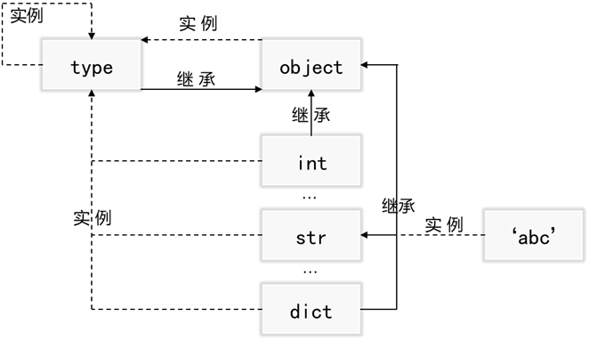

# 10.面向对象的设计思想

## 一、面向对象的高级主题

### 1.`python`中的一切皆对象

一些静态语言如`C++`、`java`都号称一切皆对象，但实际上，`python`的面向对象比其他语言的一切皆对象更加彻底，在`python`中，类、实例、函数及模块都是对象。我们之前简要了解过**变量的赋值与引用**，那里曾经提到过，所谓的对象，其实就是计算机内存，每当我们创建一个对象，其等价于我们在计算机内开辟了一片内存，内存被创建后都会被划分为三个部分：数据、类型标志符（标识对象的类型）和引用计数器（决定对象是不是进行回收）。这样我们就可以理解了，**所谓的一切皆对象是指`python`中存在的一切都是置于内存中的数据。**当时读那些话可能还不是很理解，现在是不是更清晰了。另外我们还提到，变量名会被存储在内存中的另一个位置，变量名本身是没有类型的，**类型**只存在**对象**中，**变量**只是**引用**了**对象**，建立变量与对象（数据）之间引用关系的操作叫做赋值。

**Python对象三要素：Id，Type，Value。**

|  标识   |       说明       |
| :-----: | :--------------: |
|  `Id`   | 唯一标识一个对象 |
| `Type`  |  标识对象的类型  |
| `Value` |     对象的值     |

### 2.`type`、`object`和`class`的关系

我们之前看了很多关于类与对象关系的文档，下面我们在解释器中看一下类与对象的关系，首先我们创建变量并建立引用，分别选择基本类型、函数及对象作为例子。

```python
a = 1
b = 'abc'
c = list()
d = dict()
def func(): pass
class Person: pass
class Student(Person): pass
```

首先我们尝试使用`type()`函数检查这些对象的类型，实例`per`和`stu`是类`Person`和`Student`没有问题，进一步不难发现`a`、`b`、`c`、`d`及`function`分别是类`int`、`str`、`list`、`dict`和`function`的实例，也就是说它们都是对象`object`。

```python
per = Person()
stu = Student()

print(type(a))  # <class 'int'>
print(type(b))  # <class 'str'>
print(type(c))  # <class 'list'>
print(type(d))  # <class 'dict'>
print(type(func))  # <class 'function'>
print(type(per))  # <class '__main__.Person'>
print(type(stu))  # <class '__main__.Student'>
```

既然，类也是对象，那我们也应该可以看类的类型，进一步我们检查他们各自的类的类型，发现这些类都是`type`的实例，甚至基类`object`也是`type`的实例，这证明了类也是对象。

```python
print(type(int))  # <class 'type'>
print(type(str))  # <class 'type'>
print(type(list))  # <class 'type'>
print(type(dict))  # <class 'type'>
# print(type(function))  # name 'function' is not defined
print(type(Person))  # <class 'type'>
print(type(Student))  # <class 'type'>
```

进一步我们查看这些类的继承关系，他们各自继承自哪个类？发现除了我们显式继承自`Person`类的`Student`，所有类都继承自基类`object`。

```python
print(int.__bases__)  # (<class 'object'>,)
print(str.__bases__)  # (<class 'object'>,)
print(list.__bases__)  # (<class 'object'>,)
print(dict.__bases__)  # (<class 'object'>,)
print(Person.__bases__)  # (<class 'object'>,)
print(Student.__bases__)  # (<class '__main__.Person'>,) 
```

现在我们知道，以上类继承自`object`并且都是`type`的实例，是否代表这`type`和`object`不是对象？

```python
# 基类object是type的实例
print(type(object)) # <class 'type'>
# type也是type的实例
print(type(type))  # <class 'type'>
```

上述代码说明`type`和基类`object`也是对象，并且他们都是`type`的实例。既然它们都死实例，那他们的父类是什么？

```python
print(type.__bases__) # (<class 'object'>,)
print(object.__bases__)  # ()
```

`type`也继承自`object`，基类`object`没有父类。

总结：

- python中一切皆对象，其中一般内置实例都由各自对应的类生成，而所有的类都是`type`的实例包括`type`类。
- 所有的类都继承自顶层类`object`（新式类），`object`也`type`的实例，`type`继承自`object`。



### 3.新式类补充

自`python2.2`起引入一种新的类，称为“新式类”，而从前的类又称“经典类”，经典类与新式类的区别在于定义方式不同。但是在`Python3.x`中类的区分已经融合了，无论如何定义都将得到新式类，鉴于此目前为止所谈到的类都是新式类，这里不会在去介绍“经典类”，但有必要了解新式类相较于经典类的区别。

```python
class Classic:
    # 经典类
    pass
class NewClassic(object):
    # 新式类
    pass
```

新式类一大特点在于该类在面向对象方面借鉴了大量其他语言，因此具备一系列高级性质。

- 所有的新式类默认都继承自`object`，这一点无需赘述。
- 类和类型合并，类型就是类：类是`type`的实例，`type` 可以用通过 `class`语句编写的元类来子类化，从而定制类的创建过程。

- `MRO`继承搜索顺序：正如前面所学写的，经典类沿用深度优先的搜索算法，而新式类使用`c3`算法。

- 新的高级工具：新式类提供了一组管理类的新高级工具，如`slot`、`property`、`super`、`__getattribute__`和描述符等，这些工具各自有自身的构建目的，这些操作在“经典类”中并不支持。
- 继承算法复杂化：新式类所使用的继承算法很大程度上比经典类的深度优先模型更加复杂，其中包括了描述符、元类和内置函数的特殊情况。
- 内置属性的搜索会忽略对实例的搜索：通用**实例属性**拦截方法`__getattr__` 和`__getattribute__`不再能拦截运算符重载方法，即对`___X__`这一类名称的搜索是从类开始，而非从实例开始。

> 如果一个类定义了`__getitem__`用于索引重载方法并且X是该类的一个实例，那么在进行`X[I]`计算时，若该类是经典类则等价于执行`X.__getitem__(I)`，而如果该类是新式类则等价于`type(X).__getitem__(X, I)`

```python
class C:
    data ='spam'
    def __getattr__(self, name):
        print(name)
        return getattr(self.data, name)
X =C()
print(X.__getattr__(1))  # 1
print(X[0]) 
```

## 二、类的关系

从类的设计者的角度看，类定义属性的集合，继承则是指明集合成员关系的方式。可以使用一种叫做[`UML`](https://zh.wikipedia.org/wiki/%E7%BB%9F%E4%B8%80%E5%BB%BA%E6%A8%A1%E8%AF%AD%E8%A8%80)（统一建模语言）的东西来进行面向对象建模，其中一项重要的工作就是把类和类之间的关系用标准化的图形符号描述出来。关于`UML`我们在这里不做详细的介绍，有兴趣的读者可以自行阅读[《UML面向对象设计基础》](https://e.jd.com/30392949.html)一书。类与类之间存在着多种关系，其中包括

- `use-a`关系：依赖
- `has-a`关系：关联 / 聚合 / 组合
- `is-a`关系：继承 / 实现

| 关系    | 名称            | 描述                                         | 说明                             | 代码表现                          |
| ------- | --------------- | -------------------------------------------- | -------------------------------- | --------------------------------- |
| `use-a` | 依赖合作        | 一种相对松散的协作，变化影响一个方法；       | A依赖B，意味A的某些功能靠B实现； | B不是A的成员，将作为A中方法的参数 |
| `has-a` | 关联(聚合/组合) | 部分与整体的关系，功能复用，变化影响一个类。 | A与B关联，意味着B是A的一部分；   | 在A中包含B成员                    |
| `is-a`  | 泛化            | 子类与父类的关系，概念的复用，耦合度最高     | B泛化A，意味B是A的一种；         | B继承A类                          |

### 1.`use-a`关系

“依赖”体现了逻辑上的"`use a`"的关系，依赖关系是指一个类`A`使用到了另一个类`B`，而这种使用关系是具有偶然性的、临时性的、非常弱的，但是类`B`的变化会影响到类`A`。比如某人需要借用一条船来帮助自己过河，此时人与船之间的关系就是依赖。表现在代码层面，类`B`作为参数被类`A`在某个`method`方法中使用。在`UML`类图设计中，依赖关系用由类`A`指向类`B`的带箭头虚线表示。

- A 类是 B 类方法的局部变量；
- A 类是 B 类方法的参数；
- A 类向 B 类发送消息，从而影响 B 类发生变化。


```python
class Person(object):
    def __init__(self, name):
        self.name = name
    def open(self, bx):
        bx.open_door(self)
    def close(self, bx):
        bx.close_door(self)


class Refrigerator(object):
    def __init__(self, name):
        self.name = name
    def open_door(self, p):
        print(f'{p.name}打开了冰箱。')

    def close_door(self, p):
        print(f'{p.name}关闭了冰箱。')


r = Person('蔡贵')
hr = Refrigerator('海尔')
r.open(hr)  # 蔡贵打开了冰箱。
r.close(hr)  # 蔡贵关闭了冰箱。
```

### 2.`has-a`关系

组合、聚合和关联体现了逻辑上的"`has a`"的关系，具体如下：

- 关联关系：关联体现的是两个类之间语义级别的一种 强依赖关系，比如男女朋友，这种关系比依赖更强、不存在依赖关系的偶然性、关系也不是临时性的，一般是长期性的，而且双方的关系一般是平等的。关联可以是单向、双向的。表现在代码层面，为被关联类B以类的属性形式出现在关联类A中，也可能是关联类A引用了一个类型为被关联类B的全局变量。在UML类图设计中，关联关系用由关联类A指向被关联类B的带箭头实线表示。


```python
class Boy:
    def __init__(self, name, girlFriend=None):
        self.name = name
        self.girlFriend = girlFriend

    def have_a_dinner(self):
        if self.girlFriend:
            print(f'{self.name}和{self.girlFriend.name}一起吃饭。')
        else:
            print(f'{self.name}自己吃饭。')

class Girl:
    def __init__(self, name):
        self.name = name

b = Boy('小贵')
# 没有女朋友时
b.have_a_dinner()  # 小贵自己吃饭。
g = Girl('小玉')
# 找到女朋友以后
b.girlFriend = g
b.have_a_dinner()  # 小贵和小玉一起吃饭。
```

- 聚合关系：聚合是关联关系的一种特例，它体现的是整体与部分的关系，此时整体与部分之间是可分离的，它们可以具有各自的生命周期，部分可以属于多个整体对象，也可以为多个整体对象共享。比如计算机与CPU、公司与员工的关系等。表现在代码层面，和关联关系是一致的，只能从语义级别来区分。在UML类图设计中，聚合关系以空心菱形加实线表示。（菱形指向整体）


```python
class School:
    def __init__(self, name, address):
        self.name = name
        self.address =address

class Teacher:
    def __init__(self, name, school=None):
        self.name = name
        self.school=school

s1 = School('师大','上海路')
s2 = School('矿大', '北京路')
s3 = School('徐工', '南京路')
t1 = Teacher('小白', s1)
t2 = Teacher('小杜', s2)
t3 = Teacher('小杨', s3)
t4 = Teacher('小蔡', s1)
print(t4.school.address)  # 上海路
```

- 组合关系：组合也是关联关系的一种特例，这种关系比聚合更强，也称为强聚合。它同样体现整体与部分间的关系，但此时整体与部分是不可分的，整体的生命周期结束也就意味着部分的生命周期结束，比如人和人的大脑。表现在代码层面，和关联关系是一致的，只能从语义级别来区分。在UML类图设计中，组合关系以实心菱形加实线表示。


```python
class School:
    def __init__(self, name, address):
        self.name = name
        self.address =address
        # 一个学校对应很多老师
        self.t_lst = []
    def add_teacher(self, teacher):
        self.t_lst.append(teacher)

class Teacher:
    def __init__(self, name, school=None):
        self.name = name
        self.school=school

s1 = School('师大','上海路')
s2 = School('矿大', '北京路')
t1 = Teacher('小白', s1)
t2 = Teacher('小杜', s2)
t3 = Teacher('小杨', s1)
t4 = Teacher('小蔡', s1)
s1.add_teacher(t1)
s1.add_teacher(t2)
s1.add_teacher(t3)
for t in s1.t_lst: print(t.name)  # 小白 小杜 小杨
```

### 3.`is-a`关系

泛化和实现体现了逻辑上的"is a"的关系，具体如下：

-  继承（泛化）关系：继承指的是一个类（称为子类、子接口）继承另外的一个类（称为父类、父接口）的功能，并可以增加它自己的新功能的能力。在UML类图设计中，继承用一条带空心三角箭头的实线表示，从子类指向父类，或者子接口指向父接口。


```python
class Base:
    def __init__(self, num): self.num = num
    def func(self):print(self.num)
class Foo(Base):pass
obj = Foo(123)
obj.func()  # 123
```

- 实现关系：实现指的是一个`class`类实现一个或多个（魔术方法），实现是类与接口之间最常见的关系，在[UML类图](https://so.csdn.net/so/search?q=UML类图&spm=1001.2101.3001.7020)设计中，实现用一条带空心三角箭头的虚线表示，从类指向实现的接口。 


## 三、类的属性管理工具

属性管理——主要学习porty_总结属性管理工具

新式类提供了一组管理类的新高级工具，如`slot`、`property`、`super`、`__getattribute__`和描述符等

### 1.`property`属性

`property`属性就是把方法当做属性进行使用，这可以简化代码使用。定义property属性有两种方式：装饰器方式和类属性方式。

- 装饰器方式

```python
class Person(object):

    def __init__(self):
        self.__age = 0

    # 装饰器方式的property, 把age方法当做属性使用, 表示当获取属性时会执行下面修饰的方法
    @property
    def age(self):
        return self.__age

    # 把age方法当做属性使用, 表示当设置属性时会执行下面修饰的方法
    @age.setter
    def age(self, new_age):
        if new_age >= 150:
            print("成精了")
        else:
            self.__age = new_age

# 创建person
p = Person()
print(p.age)  # 0
p.age = 100
print(p.age)  # 100 /n 成精了
p.age = 1000
```

> `@property` 表示把方法当做属性使用, 表示当获取属性时会执行下面修饰的方法。
>
> `@方法名.setter `表示把方法当做属性使用，表示当设置属性时会执行下面修饰的方法。

- 类属性方式

```python
class Person(object):

    def __init__(self):
        self.__age = 0

    def get_age(self):
        """当获取age属性的时候会执行该方法"""
        return self.__age

    def set_age(self, new_age):
        """当设置age属性的时候会执行该方法"""
        if new_age >= 150:
            print("成精了")
        else:
            self.__age = new_age

    # 类属性方式的property属性
    age = property(get_age, set_age)

# 创建person
p = Person()
print(p.age)
p.age = 100
print(p.age)
p.age = 1000
```

property的参数：第一个参数是获取属性时要执行的方法，第二个参数是设置属性时要执行的方法。

### 2.描述符


## 四、类装饰器

在函数章节我们学习了函数装饰器，那时只是简单学习了函数装饰器的实现形式，现在我们进一步学习其原理。首先我们复习一下装饰器的实现逻辑，再一次实现装饰器，发现当我们对函数`func`进行装饰后，实际上是将`func`作为函数`decorator`的参数传入了，并且在`decorator`的内部创建了一个形如`func`的新函数`wrapper`，而在`wrepper`内部，我们拓展了`func`的功能，并将`wrapper`作为结果返回，这时我们的`wrapper`实际上替代了我们的`func`。

装饰的原理就是把如下的第一行映射为第二行：

```python
def decorator(F):
    def wrapper(x, y):
        return F(x+1, y+1)
    return wrapper

@decorator
def func(x, y):
    return x + y
print(func(1, 2))
print(decorator(func)(6, 7))
```

> 装饰器装饰后的`func`实际上是新函数`decorator(func)`。

#### 1.装饰器的原理

概括地说，装饰器返回了一个包装器，而包装器把最初的函数状态保持在一个外层作用域中。从面向对象的角度理解，**装饰器以原函数对象为参数，内部拓展了原函数对象的功能，等价于实现一个新的函数对象，最后重构了原函数变量名与新函数对象之间的引用关系。**装饰器需要实现以下三点：用于重构原对象的外层可调用对象；用于拓展原对象的内层可调用对象；状态保持。只要实现了以上三点，我们可以任意地自定义装饰器。

#### 2.自定义结构的装饰器

实现了`__call__`方法的任一对象都是可调用的，**可调用对象的任意组合都可以用于构建装饰器或者被装饰**——这里的可调用对象一般是指函数或类。正如我们所看到的，`Python` 本身带有扮演特殊角色的内置装饰器，比如静态方法和类方法声明、`property` 等等。

- 定义一个函数装饰器用于装饰类：插入一个包装器层来拦截实例创建调用，返回最初类的一个新实例，并扩展以管理其接口。

```python
def func(cls):
    # 用于装饰类的装饰器
    class Wrapper(object):
        def __init__(self, *args):
            self.wrapped = cls(*args)
        def __getattr__(self, name):
            return getattr(self.wrapped, name)
    return Wrapper

@func
class C:
    def __init__(self, x, y):
        self.attr = 'spam'
```

上方代码中，装饰器把类的名称重新绑定到另一个类，这个类在外层作用域中保持了最初的类，并且当调用的时候，这个类创建并嵌入了最初类的一个实例。当之后从该实例获取一个属性的时候，包装器的`getattr `拦截了它,并且将其委托给最初的类的嵌入实例。此外，每个被装饰的类都创建一个新的作用域，它记住了最初的类。

- 定义一个装饰器类用于装饰函数：内部实现状态保持拦截函数调用， 并返回最初函数，并扩展函数的功能

```python
class Check(object):
    def __init__(self, fn):
        # 初始化操作在此完成
        self.__fn = fn

    # 实现__call__方法，表示对象是一个可调用对象，可以像调用函数一样进行调用。
    def __call__(self, *args, **kwargs):
        # 添加装饰功能
        print("请先登陆...")
        self.__fn()
# `@Check` 等价于 `comment = Check(comment)`, 所以需要提供一个`__init__`方法，并多增加一个`fn`参数。
@Check
def comment():
    print("发表评论")
comment()
```

当`@`装饰器包装可调用对象时将触发`__init__`并且当创建了一个主体类实例替代原对象的引用，当调用该对象的引用时将直接触发`__call__`函数，进而扩展函数的功能。类装饰器一般不会被用来包装单个函数或方法，反之，它常被用于管理类或是使用额外逻辑来完成实例构造与调用。 

#### 3.状态保持方案

装饰器有各种方案来实现状态保持，实例属性、全局变量、非局部闭包变量和函数属性等，这里要注意他们之间的区别。

- 类实例属性

```python
class Tracer:
    def __init__(self, func):
        # 将状态保持维持在类实例中。
        self.calls = 0
        self.func = func
    def __call__(self, *args, **kwargs):
        # 通过关键字参数扩展适应性
        self.calls +=1
        print(f'函数{self.func.__name__}被调用了{self.calls}次。')
        return self.func(*args, **kwargs)
@Tracer
def spam(a, b, c):
    print(a + b + c)
@Tracer
def aggs(x, y):
    print(x**y)
    
spam(1, 2, 3) # 函数spam被调用了1次。/n 6
spam(4, 5, 6)  # 函数spam被调用了2次。/n 15
aggs(2, 2)  # 函数aggs被调用了1次。/n 4
aggs(3, 4)  # 函数aggs被调用了2次。/n 81
```

这里使用类实例属性来显式地保存状态，每个实例都有各自的被包装函数和调用计数器的信息，因为每次装饰都创建一个新的类实例。

- 外层作用域和全局变量

```python
calls = 0
def trace(func):
    def wrapper(*args, **kwargs):
        global calls
        calls += 1
        print(f'函数{func.__name__}被调用了{calls}次。')
        return func(*args, **kwargs)
    return wrapper
@trace
def spam(a, b, c):
    print(a + b + c)
@trace
def aggs(x, y):
    print(x**y)
    
spam(1, 2, 3) # 函数spam被调用了1次。/n 6
spam(4, 5, 6)  # 函数spam被调用了2次。/n 15
aggs(2, 2)  # 函数aggs被调用了3次。/n 4
aggs(3, 4)  # 函数aggs被调用了4次。/n 81
```

使用声明把状态变量移出到全局作用域是一个备选项。遗憾的是，这会导致它们将被每个被包装的函数所共享，这实现了一种全局计数器，他们是跨程序的而不是针对每个函数的。

- 外层作用域和非局部变量

```python
def trace(func):
    calls = 0
    def wrapper(*args, **kwargs):
        nonlocal calls
        calls += 1
        print(f'函数{func.__name__}被调用了{calls}次。')
        return func(*args, **kwargs)
    return wrapper
@trace
def spam(a, b, c):
    print(a + b + c)
@trace
def aggs(x, y):
    print(x**y)
    
spam(1, 2, 3) # 函数spam被调用了1次。/n 6
spam(4, 5, 6)  # 函数spam被调用了2次。/n 15
aggs(2, 2)  # 函数aggs被调用了1次。/n 4
aggs(3, 4)  # 函数aggs被调用了2次。/n 81
```

闭包函数也可以实现相同的效果，由于外层作用域变量不能跨程序而成为全局的，因此每个被包装函数再次有了自己的计数器，就像是用类和属性实现的一样。

- 函数属性

```python
def trace(func):
    def wrapper(*args, **kwargs):
        wrapper.calls += 1
        print(f'函数{func.__name__}被调用了{wrapper.calls}次。')
        return func(*args, **kwargs)
    wrapper.calls = 0
    return wrapper
@trace
def spam(a, b, c):
    print(a + b + c)
@trace
def aggs(x, y):
    print(x**y)
    
spam(1, 2, 3) # 函数spam被调用了1次。/n 6
spam(4, 5, 6)  # 函数spam被调用了2次。/n 15
aggs(2, 2)  # 函数aggs被调用了1次。/n 4
aggs(3, 4)  # 函数aggs被调用了2次。/n 81
```

可以把任意属性分配给函数，并使函数附带上它们，因为工厂函数在每一次调用时都创建一个新函数，所以其属性就成为了与调用息息相关的状态。

> 这种方案似乎比`nonlocal `方式要晦涩难懂一些，但它拥有更多的优点，其一是它允许从装饰器代码的外部访问保存的状态，而`nonlocal`只能从嵌套函数自身的内部看到，其二是他们可以在`python2`和`python3`中都工作，`python2`中不存在`nonlocal `关键字。

#### 4.类装饰器的两个陷阱

- 类装饰器不支持方法级别的装饰

基于类的装饰器在拦截简单函数调用时是有效的，但当它应用于类级别的方法函数的时候，并不是很有效。

```python
class Tracer:
    def __init__(self, func):
        # 将状态保持维持在类实例中。
        self.calls = 0
        self.func = func
    def __call__(self, *args, **kwargs):
        # 通过关键字参数扩展适应性
        self.calls += 1
        print(self, *args, **kwarg)
        print(f'函数{self.func.__name__}被调用了{self.calls}次。')
        return self.func(*args, **kwargs)
class A:
    @Tracer
    def method(self, a, b, c):
        print(a + b + c)
a = A()
a.method(1, 2, 3)
# <__main__.Tracer object at 0x000002D7AEF68410> 1 2 3
# TypeError: A.method() missing 1 required positional argument: 'c'
# 手动传入self实现
A.method(A(), 1, 2, 3)
# <__main__.Tracer object at 0x000001D940AF8410> <__main__.A object at 0x000001D940AF8440> 1 2 3
# 函数method被调用了1次。/n 6
```

这里问题的根源当我们用`__call__`方法把被装饰方法名称`method`重绑定到一个类实例对象的时，`Python`只向 `self`传递了 `Tracer` 实例而没有在参数列表中传递`A`实例，实际上二者缺一不可，`__call__`方法和`method`方法中的`self`参数产生了冲突。使用嵌套函数的装饰器是同时支持函数和方法的装饰的，因为其并不会引发`self`冲突问题，这是一个非常值得注意的细节。

```python
def trace(func):
    calls = 0
    def wrapper(*args, **kwargs):
        nonlocal calls
        calls += 1
        print(f'函数{func.__name__}被调用了{calls}次。')
        return func(*args, **kwargs)
    return wrapper

class A:
    @trace
    def method(self, a, b, c):
        print(a + b + c)
a = A()
a.method(1, 2, 3)  # 函数method被调用了1次。/n 6
```

- 类装饰器不支持扩增类的多个实例

假如我们需要创建多个实例，并且希望扩增类的每一个实例，可以使用装饰器来扩展类的定义，这时可以免于要求所有的实例创建调用都通过一个包装器来手动地指向对象：

```python
def Tracer(cls):
    class Wrapper:
        def __init__(self, *args, **kwargs):
            self.fetches = 0
            self.wrapped = cls(*args, **kwargs)
        def __getattr__(self, attrname):
            print(f'Trace: {attrname}')
            return getattr(self.wrapped, attrname)
    return Wrapper
@Tracer
class Person:...
bob = Person('Bob', 40, 50)
sue = Person('Sue', rate=100, hours=60)
# 未使用装饰器进行扩展
class Person:...
bob = Wrapper(Person('Bob', 40, 50))
sue = Wrapper(Person('Sue', rate=100, hours=60))
```

当我们幻想将上文中的函数装饰器转化为类装饰器时，就会引发问题。

```python
class Tracer:
    def __init__(self, cls):
        self.cls = cls
    def __call__(self, *args):
        self.wrapped = self.cls(*args)
        return self
    def __getattr__(self, attrname):
        print(f'Trace: {attrname}')
        return getattr(self.wrapped, attrname)
@Tracer
class Person:
    def __init__(self, name):
        self.name = name
bob = Person('Bob')
Sue = Person('Sue')
print(bob.name)  # Trace: name /n Sue
```

这个基于类的装饰器尝试像之前一样包装多个类，但它对于一给定的类的多个实例并不是很有效，每个类的构建调用都会重新触发`__call__`并覆盖前面的实例，最终效果是`Tracer`内只能保存一个最后创建的实例。**我们为每个类创建了一个装饰器实例，但是不是针对每个类实例。**前面的基于函数的`Tracer`版本确实可用于多个实例，因为每个实例构造调用都会创建一个新的 `Wrapper `实例，而不是覆盖一个单个共享的`Tracer `实例的状态。**装饰器不仅仅功能强大，而且使用时也需要格外小心!**

## 五、元编程与元类


