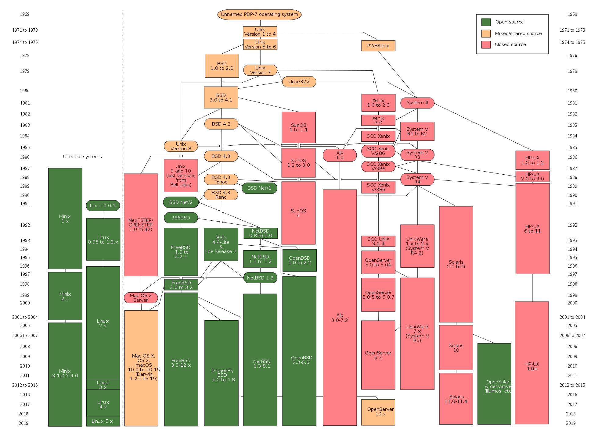

# 01.计算机操作系统

只有硬件没有软件的计算机系统被称之为“裸机”，“裸机”很难用来完成计算机日常的工作（如存储和运算），所以必须用特定的软件来控制硬件的工作。最靠近计算机硬件的软件是系统软件，其中最为重要的就是“操作系统”。**“操作系统”是控制和管理整个计算机硬件和软件资源、实现资源分配和任务调配、为系统用户以及其他软件提供接口和环境的程序的集合。**

> 操作系统能够向下**控制硬件**向上**支持软件的运行**，具有承上启下的作用。

**常见的操作系统**：`Windows`、`mac OS`、`Linux`、`iOS`、`Android `。

## 一、操作系统概述

### 1.操作系统发展史

在计算机诞生之初没有操作系统的年代，人们先把程序纸带（或卡片）装上计算机，然后启动输入机把程序送入计算机，接着通过控制台开关启动程序运行。当程序执行完毕，打印机输出计算的结果，用户卸下并取走纸带（或卡片）。第二个用户上机，重复同样的步骤。在整个过程中用户独占机器，CPU等待手工操作，资源利用率极低。

#### （1）批处理系统

首先启动计算机上的一个监督程序，在监督程序的控制下，计算机能够自动的、成批的处理一个或多个用户的作业。完成一批作业后，监督程度又从输入机读取作业存入磁带机。按照上面的步骤重复处理任务。监督程序不停的处理各个作业，实现了作业的自动转接，减少了作业的建立时间和手工操作时间，提高了计算机资源的利用率。 批处理系统又可以分为单道批处理系统、多道批处理系统、联机批处理系统、脱机批处理系统。

#### （2）分时系统和实时系统

分时系统是把处理器的运行时间分成很短的时间片，按时间片轮流把处理机分配给各联机作业使用。 若某个作业在分配给它的时间片内不能完成其计算，则该作业暂时中断，把处理机让给另一作业使用，等待下一轮调度时再继续其运行。由于计算机速度很快，作业运行轮转得很快，给每个用户的感觉是他独占了一台计算机。而每个用户可以通过自己的终端向系统发出各种操作控制命令，在充分的人机交互情况下，完成作业的运行。为了解决分时系统不能及时响应用户指令的情况，又出现了能够在在严格的时间范围内完成事件处理，及时响应随机外部事件的实时系统。

#### （3）通用操作系统

1960s：IBM的System/360系列的机器有了统一的操作系统OS/360。

1965年：AT&T的贝尔实验室加入GE和MIT的合作计划开始开发MULTICS。

1969年：MULTICS项目失败，Ken Tompson赋闲在家，为了玩“Space Travel”游戏用汇编语言在当时已经被淘汰的PDP-7上开发了Unics。

1970年~1971年：Ken Thompson和Dennis Ritchie用B语言在PDP-11上重写了Unics，并在Brian Kernighan的建议下将其更名为Unix。

1972年~1973年：Dennis Ritchie发明了C语言来取代可移植性较差的B语言，并开启了用C语言重写Unix的工作。

1974年：Unix推出了里程碑意义的第5版，几乎完全用C语言来实现。

1979年：从Unix第7版开始，AT&T发布新的使用条款，将Unix私有化。

1987年：Andrew S. Tanenbaum教授为了能在课堂上为学生讲解操作系统运作的细节，决定在不使用任何AT&T的源代码前提下，自行开发与Unix兼容的操作系统以避免版权上的争议，该系统被命名为Minix。

1991年：Linus Torvalds（林纳斯·托瓦兹）就读于芬兰赫尔辛基大学期间，尝试在Minix上做一些开发工作，但因为Minix只是作为教学用途的操作系统，功能并不强大，为了方便在学校的新闻组和邮件系统中读写和下载文件，Linus编写了磁盘驱动程序和文件系统，这些东西形成了Linux系统内核的雏形。

下图是Unix操作系统家族的图谱。

### 2.基本特征

#### （1）并发与并行

并发是指宏观上在一段时间内能同时运行多个程序，而并行则指同一时刻能运行多个指令。并行需要硬件支持，如多流水线、多核处理器或者分布式计算系统。操作系统通过引入**进程和线程**，使得程序能够并发运行。

#### （2）共享

共享是指系统中的资源可以被多个并发进程共同使用。有两种共享方式：**互斥共享和同时共享**。互斥共享的资源称为临界资源，例如打印机等，在同一时刻只允许一个进程访问，需要用同步机制来实现互斥访问。

#### （3）异步

异步指进程不是一次性执行完毕，而是走走停停，以不可知的速度向前推进。

#### （4）虚拟

虚拟技术把一个物理实体转换为多个逻辑实体，主要有两种虚拟技术：时（时间）分复用技术和空（空间）分复用技术。

- 多个进程能在同一个处理器上并发执行使用了时分复用技术，让每个进程轮流占用处理器，每次只执行一小个时间片并快速切换。
- 虚拟内存使用了空分复用技术，它将物理内存抽象为地址空间，每个进程都有各自的地址空间。地址空间的页被映射到物理内存，地址空间的页并不需要全部在物理内存中，当使用到一个没有在物理内存的页时，执行页面置换算法，将该页置换到内存中。

### 3.基本功能

| 功能名称 | 说明                                                   |
| -------- | ------------------------------------------------------ |
| 进程管理 | 进程控制、进程同步、进程通信、死锁处理、处理机调度等。 |
| 内存管理 | 内存分配、地址映射、内存保护与共享、虚拟内存等。       |
| 文件管理 | 文件存储空间的管理、目录管理、文件读写管理和保护等。   |
| 设备管理 | 缓冲管理、设备分配、设备处理、虛拟设备等。             |

### 4.系统调用

如果一个进程在用户态需要使用内核态的功能，就进行系统调用从而陷入内核，由操作系统代为完成，Linux 的系统调用主要有以下这些：

| Task     | Commands                          |
| -------- | --------------------------------- |
| 进程控制 | `fork()`; `exit()`;` wait()`;     |
| 进程通信 | `pipe()`; `shmget()`; `mmap()`;   |
| 文件操作 | `open()`; `read()`; `write()`;    |
| 设备操作 | `ioctl()`; `read()`; `write()`;   |
| 信息维护 | `getpid()`; `alarm()`; `sleep()`; |
| 安全     | `chmod()`; `umask()`; `chown()`;  |

### 5.宏内核和微内核

#### （1）宏内核

宏内核是将操作系统功能作为一个紧密结合的整体放到内核。由于各模块共享信息，因此有很高的性能。

#### （2）微内核

由于操作系统不断复杂，因此将一部分操作系统功能移出内核，从而降低内核的复杂性。移出的部分根据分层的原则划分成若干服务，相互独立。在微内核结构下，操作系统被划分成小的、定义良好的模块，只有微内核这一个模块运行在内核态，其余模块运行在用户态。因为需要频繁地在用户态和核心态之间进行切换，所以会有一定的性能损失。

### 6.中断分类

#### （1）外中断

由 CPU 执行指令以外的事件引起，如 I/O 完成中断，表示设备输入/输出处理已经完成，处理器能够发送下一个输入/输出请求。此外还有时钟中断、控制台中断等。

#### （2）异常

由 CPU 执行指令的内部事件引起，如非法操作码、地址越界、算术溢出等。

#### （3）陷入

在用户程序中使用系统调用。

## 二、进程管理

## 三、内存管理

### 1.虚拟内存

虚拟内存的目的是为了让物理内存扩充成更大的逻辑内存，从而让程序获得更多的可用内存。

为了更好的管理内存，操作系统将内存抽象成地址空间。每个程序拥有自己的地址空间，这个地址空间被分割成多个块，每一块称为一页。这些页被映射到物理内存，但不需要映射到连续的物理内存，也不需要所有页都必须在物理内存中。当程序引用到不在物理内存中的页时，由硬件执行必要的映射，将缺失的部分装入物理内存并重新执行失败的指令。

从上面的描述中可以看出，虚拟内存允许程序不用将地址空间中的每一页都映射到物理内存，也就是说一个程序不需要全部调入内存就可以运行，这使得有限的内存运行大程序成为可能。例如有一台计算机可以产生 16 位地址，那么一个程序的地址空间范围是 0\~64K。该计算机只有 32KB 的物理内存，虚拟内存技术允许该计算机运行一个 64K 大小的程序。

### 2.分页系统地址映射

内存管理单元（MMU）管理着地址空间和物理内存的转换，其中的页表（Page table）存储着页（程序地址空间）和页框（物理内存空间）的映射表。

一个虚拟地址分成两个部分，一部分存储页面号，一部分存储偏移量。

下图的页表存放着 16 个页，这 16 个页需要用 4 个比特位来进行索引定位。例如对于虚拟地址（0010 000000000100），前 4 位是存储页面号 2，读取表项内容为（110 1），页表项最后一位表示是否存在于内存中，1 表示存在。后 12 位存储偏移量。这个页对应的页框的地址为 （110 000000000100）。

### 3.页面置换算法

在程序运行过程中，如果要访问的页面不在内存中，就发生缺页中断从而将该页调入内存中。此时如果内存已无空闲空间，系统必须从内存中调出一个页面到磁盘对换区中来腾出空间。

页面置换算法和缓存淘汰策略类似，可以将内存看成磁盘的缓存。在缓存系统中，缓存的大小有限，当有新的缓存到达时，需要淘汰一部分已经存在的缓存，这样才有空间存放新的缓存数据。

页面置换算法的主要目标是使页面置换频率最低（也可以说缺页率最低）。

#### （1）最佳（OPT, Optimal replacement algorithm）

所选择的被换出的页面将是最长时间内不再被访问，通常可以保证获得最低的缺页率。这是一种理论上的算法，因为无法知道一个页面多长时间不再被访问。

举例：一个系统为某进程分配了三个物理块，引用序列为`7，0，1，2，0，3，0，4，2，3，0，3，2，1，2，0，1，7，0，1`，开始运行时，先将 7, 0, 1 三个页面装入内存。当进程要访问页面 2 时，产生缺页中断，会将页面 7 换出，因为页面 7 再次被访问的时间最长。

#### （2）最近最久未使用（LRU, Least Recently Used）

虽然无法知道将来要使用的页面情况，但是可以知道过去使用页面的情况。LRU 将最近最久未使用的页面换出。

在内存中维护一个所有页面的链表。当一个页面被访问时，将这个页面移到链表表头。这样就能保证链表表尾的页面是最近最久未访问的。

>  由于每次访问都需要更新链表，因此这种方式实现的 LRU 代价很高。

#### （3）最近未使用（NRU, Not Recently Used）

每个页面都有两个状态位：R 与 M，当页面被访问时设置页面的 R=1，当页面被修改时设置 M=1。其中 R 位会定时被清零，据此可将页面分成四类：`（R, M）`：`（0, 0)`、`（0，1）`、`（1，0）`、`（1，1）` 。

当发生缺页中断时，NRU 算法随机地从类编号最小的非空类中挑选一个页面将它换出。`NRU` 优先换出已经被修改的脏页面`（R=0，M=1）`，而不是被频繁使用的干净页面`（R=1，M=0）`。

#### （4）先进先出（FIFO, First In First Out）

换出最先进入的页面，该算法会将那些经常被访问的页面换出，导致缺页率升高。

#### （5）第二次机会算法

`FIFO` 算法可能会把经常使用的页面置换出去，为了避免这一问题，对该算法做一个简单的修改：当页面被访问 (读或写) 时设置该页面的 R 位为 1。需要替换的时候，检查最老页面的 R 位。如果 R 位是 0，那么这个页面既老又没有被使用，可以立刻置换掉；如果是 1，就将 R 位清 0，并把该页面放到链表的尾端，修改它的装入时间使它就像刚装入的一样，然后继续从链表的头部开始搜索。

#### （6）时钟（Clock）

第二次机会算法需要在链表中移动页面，降低了效率。时钟算法使用环形链表将页面连接起来，再使用一个指针指向最老的页面。

### 4.分页与分段

#### （1）分页与分段

虚拟内存采用的是分页技术，也就是将地址空间划分成固定大小的页，每一页再与内存进行映射。如果单纯的使用分页系统，某些表的增长可能导致覆盖后建立的表的开始，因此产生了分段技术。分段的做法是把每个表分成段，一个段构成一个独立的地址空间。每个段的长度可以不同，并且可以动态增长。

#### （2）段页式

程序的地址空间划分成多个拥有独立地址空间的段，每个段上的地址空间划分成大小相同的页。这样既拥有分段系统的共享和保护，又拥有分页系统的虚拟内存功能。

#### （3）分页与分段比较

- 对程序员的透明性：分页透明，但是分段需要程序员显式划分每个段。

- 地址空间的维度：分页是一维地址空间，分段是二维的。

- 大小是否可以改变：页的大小不可变，段的大小可以动态改变。

- 出现的原因：分页主要用于实现虚拟内存，从而获得更大的地址空间；分段主要是为了使程序和数据可以被划分为逻辑上独立的地址空间并且有助于共享和保护。

## 四、设备管理

### 1.磁盘结构

| 结构                       | 说明                                                         |
| -------------------------- | ------------------------------------------------------------ |
| `盘面（Platter）`          | 一个磁盘有多个盘面；                                         |
| `磁道（Track）`            | 盘面上的圆形带状区域，一个盘面可以有多个磁道；               |
| `扇区（Track Sector）`     | 磁道上的一个弧段，一个磁道可以有多个扇区，它是最小的物理储存单位，目前主要有 512 bytes 与 4 K 两种大小； |
| `磁头（Head）`             | 与盘面非常接近，能够将盘面上的磁场转换为电信号（读），或者将电信号转换为盘面的磁场（写）； |
| `制动手臂（Actuator arm）` | 用于在磁道之间移动磁头；                                     |
| `主轴（Spindle）`          | 使整个盘面转动。                                             |

### 2.磁盘调度算法

读写一个磁盘块的时间的影响因素有`旋转时间`（主轴转动盘面，使得磁头移动到适当的扇区上）、`寻道时间`（制动手臂移动，使得磁头移动到适当的磁道上）和`实际的数据传输时间`，其中，寻道时间最长，因此磁盘调度的主要目标是使磁盘的平均寻道时间最短。

#### （1）先来先服务（FCFS, First Come First Served）

按照磁盘请求的顺序进行调度，优点是公平和简单。缺点也很明显，因为未对寻道做任何优化，使平均寻道时间可能较长。

#### （2）最短寻道时间优先（SSTF, Shortest Seek Time First）

优先调度与当前磁头所在磁道距离最近的磁道。虽然平均寻道时间比较低，但是不够公平。如果新到达的磁道请求总是比一个在等待的磁道请求近，那么在等待的磁道请求会一直等待下去，也就是出现饥饿现象。具体来说，两端的磁道请求更容易出现饥饿现象。

#### （3）电梯算法（SCAN）

电梯总是保持一个方向运行，直到该方向没有请求为止，然后改变运行方向。

电梯算法（扫描算法）和电梯的运行过程类似，总是按一个方向来进行磁盘调度，直到该方向上没有未完成的磁盘请求，然后改变方向。因为考虑了移动方向，因此所有的磁盘请求都会被满足，解决了 SSTF 的饥饿问题。

## 五、链接

### 1.编译系统

在 Unix 系统上，由编译器把源文件转换为目标文件大致经过如下流程。

首先预处理以 `#` 开头的预处理命令，其次将源代码编译为汇编文件，随后将汇编文件翻译成可重定位目标文件，最后将可重定位目标文件和` printf.o `等单独预编译好的目标文件进行合并，得到最终的可执行目标文件，最后这一过程又称为链接，链接可以分为动态链接和静态链接。

> 目标文件包括：可执行目标文件（可直接在内存中执行），可重定位目标文件（可与其它可重定位目标文件在链接阶段合并，创建一个可执行目标文件），共享目标文件（这是一种特殊的可重定位目标文件，可以在运行时被动态加载进内存并链接）。

### 2.静态链接

静态链接器以一组可重定位目标文件为输入，生成一个完全链接的可执行目标文件作为输出。静态链接器主要完成以下两个任务：

#### （1）符号解析

每个符号对应于一个函数、一个全局变量或一个静态变量，符号解析的目的是将每个符号引用与一个符号定义关联起来。

#### （2）重定位

链接器通过把每个符号定义与一个内存位置关联起来，然后修改所有对这些符号的引用，使得它们指向这个内存位置。

### 3.动态链接

当静态库更新时，整个程序都要重新进行链接，并且对于 `printf`这种标准函数库，如果每个程序都要有代码，这会极大浪费资源。共享库是为了解决静态库的这两个问题而设计的，在 Linux 系统中通常用 .so 后缀来表示，Windows 系统上它们被称为 DLL。它具有以下特点：

- 在给定的文件系统中一个库只有一个文件，所有引用该库的可执行目标文件都共享这个文件，它不会被复制到引用它的可执行文件中；
- 在内存中，一个共享库的 .text 节（已编译程序的机器代码）的一个副本可以被不同的正在运行的进程共享。

