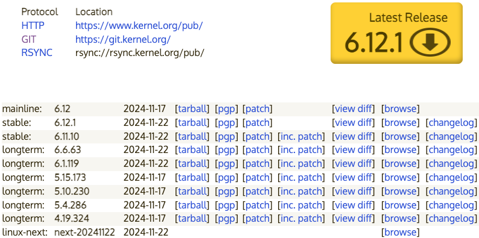

# 02.Linux概述与Ubuntu安装配置

## 一、Linux系统概述

Linux是一个通用操作系统，Linux内核是芬兰人Linus Torvalds开发的，于1991年9月发布。而Linux操作系统作为Internet时代的产物，它是由全世界许多开发者共同合作开发的，是一个自由的操作系统（注意自由和免费并不是同一个概念，想了解二者的差别可以[点击这里](https://www.debian.org/intro/free)）。

### 1.Linux系统优点

- 通用操作系统，不跟特定的硬件绑定。

- 用C语言编写，可移植性强，有内核编程接口。
- 支持多用户和多任务，支持安全的分层文件系统。
- 大量的实用程序，完善的网络功能以及强大的支持文档。
- 可靠的安全性和良好的稳定性，对开发者更友好。

### 2.Linux版本

#### （1）内核版本

官网：https://www.kernel.org

内核版本可分为三个部分：`主版本号`、`次版本号`和`末版本号`，其中，次版本号为奇数的为开发版，偶数的为稳定版。



#### （2）发行版本

| 名称                                | 说明                                                         |
| ----------------------------------- | ------------------------------------------------------------ |
| [Redhat](https://www.redhat.com/en) | 红帽`Linux`（专业版`Enterprise`+免费版`Fedora`）             |
| [CentOS](https://www.centos.org/)   | 在`Redhat`专业版基础上进行魔改构建的免费版。                 |
| [Ubuntu](https://www.ubuntu.com/)   | 社区比较完善，目前国内个人版使用最多的Linux，具有比较美观的桌面系统。 |
| [Debian](https://www.debian.org/)   | 个人版用户使用比较多，支持大量`windows`软件。                |

### 3.Linux目录结构

Linux没有盘符这个概念，只有一个根目录 `/` ，主要目录说明如下：

| 名称   | 说明                                                         |
| ------ | ------------------------------------------------------------ |
| /：    | 根目录                                                       |
| /lib   | 系统开机所需要最基本的动态连接共享库，类似于`Windows`里的`DLL`文件。几乎所有的应用程序都需要用到这些共享库，库一共分为两种：`*.so`后缀动态库文件，`*.a`后缀静态库文件。 |
| /boot  | 系统启动引导目录，连接文件、镜像文件。                       |
| /run   | 保存到下次引导前有效的关于系统的信息文件，如 `/var/run/utmp` 包含当前登录的用户的信息. |
| /bin   | 可执行二进制文件的目录，存放系统指令，比如`ls`，`mkdir`指令，另有`/sbin`保存给`root`管理员使用的超级指令目录。 |
| /etc   | 所有的系统管理所需要的配置文件和子目录。                     |
| /usr   | 用户的很多应用程序和文件都放在这个目录下，类似于`windows`下的`program files`目录，安装`Linux`软件包时默认安装到`/usr/local`目录下。 |
| /home  | 非管理员账号在`/home`目录下都有自己的家，另有`\root`超级管理员用户目录 |
| /opt   | 第三方程序目录，`qq`、`wps`、`mysql`等软件通常放置于此目录下。 |
| /proc  | 一个虚拟的目录，它是系统内存的映射，可以通过直接访问这个目录来获取系统信息。 |
| /sys   | 与/proc类似，是一个虚拟的文件系统，主要记录与系统核心相关的信息，入系统当前已经载入的模块信息等。 |
| /dev   | 系统设备目录，硬盘、光驱都是在此目录下`/dev/cdrom`           |
| /media | linux系统自动识别挂载的一些设备，例如U盘、光驱等等。         |
| /mbt   | 用户临时挂载别的文件系统的目录，用于特殊挂载。               |
| /var   | 存放着在不断扩充着的东西，习惯将那些经常被修改的目录放在这个目录下，如各种日志文件。 |
| /srv   | service缩写，存放服务启动之后需要访问的数据目录，如`www`服务需要访问的网页数据存放在`/srv/www`内。 |
| /temp  | 临时目录                                                     |

### 4.执行环境

云主机、虚拟机、无数据`pc`。

## 二、Ubuntu基本安装配置

双系统等安装配置目前而言包括如下几种：`WSL`、虚拟机、双系统等，鉴于安装方式等多样性，下面主要写非图形化配置，并补充一些虚拟机图形化配置需要注意的点。

### 1.更新软件源

`Ubuntu`内置了一款软件包管理工具`apt`，能够通过命令行的方式构建软件包，但是默认下载源来自于国外服务器，因此为优化体验，建议修改为国内服务器。这里以清华源为例，进入[清华大学开源软件镜像站](https://mirrors.tuna.tsinghua.edu.cn/)>[CRAN](https://mirrors.tuna.tsinghua.edu.cn/CRAN/)>[ubuntu | 镜像站使用帮助](https://mirrors.tuna.tsinghua.edu.cn/help/ubuntu/)，选择相应的版本（以下为20.04版本）：

```
# 清华源
deb https://mirrors.tuna.tsinghua.edu.cn/ubuntu/ focal main restricted universe multiverse
deb https://mirrors.tuna.tsinghua.edu.cn/ubuntu/ focal-updates main restricted universe multiverse
deb https://mirrors.tuna.tsinghua.edu.cn/ubuntu/ focal-backports main restricted universe multiverse
deb http://security.ubuntu.com/ubuntu/ focal-security main restricted universe multiverse
```

`ubuntu`中软件源文件地址为：`/etc/apt/sources.list`

```shell
# 要备份最初源头，防止丢失
sudo cp /etc/apt/sources.list /etc/apt/sources.list.bak
# 其次需要下载vim编辑器，但是下载vim需要暂时更新源
sudo apt-get update
sudo apt update
# 编辑软件源
sudo apt-get install vim
sudo vim /etc/apt/sources.list
# /etc/apt/sources.list.d/ubuntu.sources
```

进入`vim`后先按`i`进入编辑模式，将光标指针移动到最后一个字符后面，按`ESC`进入代码模式，输入`d1G`回车执行，快速删除删除光标所在行到第一行的所有数据。

若没删干净，切换编辑模式用`delete`删除，删除完后，复制添加如下条目，切换代码模式输入！`wq`并回车执行保存并推出`vim`

最后执行如下命令将更新地址激活，并基于新源更新系统软件。

```shell
# 更新源，如出现依赖问题：sudo apt-get -f install
sudo apt-get update
# 更新本地数据库
sudo apt update
# 更新所有已安装的包
sudo apt upgrade
```

手动修改镜像源，配置完成以后需要执行 **sudo apt-get update** 这个命令，更新镜像源保证可以下载最新的软件。

### 2.图形化界面额外配置

在图形化界面中，输入法、文件系统等都需要额外管理，如下留一些自己使用过程等文档。

#### （1）安装`vm-tools`

如果基于`vmware`安装虚拟机的话，可能需要实现宿主系统与子系统之间的文件系统交互，`vm-tools`可以很方便的实现，文件的拖放、复制保留等操作，因此如果是用`vmware`装的子系统的话，非常建议安装一下。

在VMware菜单栏里点击虚拟机选项，找到安装`VMware tools`选项，如果按钮是灰色的，说明当前处于虚拟镜像中或者本地仍连接着安装系统时的虚拟镜像，可以在配置中将挂载的磁盘全部取消，改为硬盘启动即可，并重启机器即可。

点击安装`VMware tools`后，会为虚拟机装载一个光盘，在其中找到`VMware Tools`压缩文件，并将其复制到桌面，可以选中压缩包右击，选择提取到此处。

```sh
# 也可使用命令解压
tar -zxvf VMwareTools-10.3.22-15902021.tar.gz
# 进入解压完成的文件夹
cd vmware-tools-distrib
# 执行
sudo ./vmware-install.pl
sudo reboot  # 重启
```

如果使用的是最新的`ubuntu-23`或`ubuntu-25`的话，自带的`vm-tools`可能已经不支持了，可以手动从如官网下载安装最新的：

```sh
sudo apt-get autoremove open-vm-tools  # 卸载
sudo apt-get install open-vm-tools-desktop # 安装
sudo reboot  # 重启
```

> 为防止忘记`wmware`的安装，这里留下`vmware`安装虚拟机的文档：https://blog.csdn.net/sobercq/article/details/134388272。

#### （2）语言与输入法

系统第一次安装时，建议在安装界面选择安装语言为英语，因为如果选择中文，后续很多文件名称都会被自动转为中文，这有时候会导致报错，或者在网络上寻求帮助时找不到对应的文件夹，因此安装时先设置为英文，开机后再修改语言为中文，开机后修改为中文的话，只是看起来是中文了，在终端中输入`cd ~/Documents`仍然是可以执行的，这样既方便中文阅读也方便管理。

打开语言支持，系统将会对语言进行自动更新，接下来将汉语（中国）用鼠标拖放至最顶部，点击应用，完毕后，重启更新系统即可，开机后将询问是否更改文件夹名称为汉语，这里选择保留旧名称。

`ubuntu`默认不支持中文输入法，需要手动添加，打开设置>区域与语言>输入源。点击"+"号，添加中文（智能拼音），完事就可以正常的使用系统输入法输入中文了，输入方式及快捷键与`windows`类似。

#### （3）安装浏览器

访问地址[这里](https://link.zhihu.com/?target=http%3A//www.google.cn/intl/zh-CN/chrome/browser/desktop/index.html)，点击下载即可，下载后，软件包存在于download中，访问该文件夹，打开终端执行：

```shell
sudo dpkg -i google-chrome-stable_current_amd64.deb
```

同理可以安装[edge](https://www.microsoft.com/zh-cn/edge/download?form=MA13FJ)

```shell
sudo dpkg -i microsoft-edge-stable_120.0.2210.144-1_amd64.deb
```

#### （4）安装`typora`

[前往 Typora 中文官网下载最新版本的Typora](https://typoraio.cn/releases/all)，下载完毕后安装。

```python
# 安装 Typora 软件包
sudo dpkg -i typora_1.7.6_amd64.deb 
```

直接克隆 `Yporaject `项目，若是报错“`Fatal to connect to github.com port 443`:拒绝连接”，说明网络异常，最好挂梯子。

```shell
# 打开hosts文件
sudo vim /etc/hosts
# 添加一行代码
# 140.82.112.3   github.com

# 直接克隆项目, depth=1 表示仅克隆最新版本,以减少等待时间
git clone https://github.com/hazukieq/Yporaject.git --depth=1
```

配置 `Rust `编译环境，或者通过`sudo apt install cargo`直接安装，`Cargo` 是 `Rust `的包管理器，它会自动安装` rustc`， `rustc`是用于 Rust 编程语言的 `Rust `编译器。

```sh
sudo apt install curl
# 运行官方脚本安装即可
curl --proto '=https' --tlsv1.2 -sSf https://sh.rustup.rs | sh

# 备注：卸载命令 在终端中，使用如下的命令从系统中移除 Rust：
# rustup self uninstall
# sudo apt remove cargo
# sudo apt autoremove
```

它会询问你输入所需的安装类型。选择选项 1，脚本完成安装后，你需要获取配置文件的来源，以使更改应用于你的 `shell`。

```shell
# 如果不将 cargo 添加至系统变量，每次执行前需要激活虚拟环境
source $HOME/.cargo/env
# 检查 cargo，若看到如下版本信息，则说明配置成功
cargo -V
cargo 1.70.0 (ec8a8a0ca 2023-04-25)
```

编译 `Yporaject `项目

```shell
# 进入 Yporaject 项目
cd Yporaject
# 运行编译命令
cargo build
# 查看二进制是否生成,程序名称为 node_inject
ls target/debug
```

> 务必确认当前项目目录 `target/debug` 下 是否生成了 `node_inject` 二进制程序。

复制二进制程序到安装目录下。

```shell
# 记录当前目录路径，待会返回需要用到
cur=`pwd`

# 复制二进制程序到相关目录下
sudo cp target/debug/node_inject /usr/share/typora
# 进入相关目录
cd /usr/share/typora
# 给予二进制程序执行权限
sudo chmod +x node_inject

# 运行二进制程序
# (请注意程序运行输出信息，观察是否运行成功！！)
# 若无读写权限,建议使用 sudo ./node_inject
sudo ./node_inject
```

获取许可证激发码：

```python
# 返回项目
cd $cur
# 进入 license-gen 文件夹
cd license-gen
# 编译代码
cargo build
# 运行二进制程序
cargo run
# 你将会得到以下输出
output:
    Finished dev [unoptimized + debuginfo] target(s) in 0.00s
     Running `target/debug/license-gen`
License for you: xxxxxx-xxxxxx-xxxxxx-xxxxxx
```

> 复制 `License for you: xxxxxx-xxxxxx-xxxxxx-xxxxxx `的那一串激发码，打开软件激活即可。

### 3.额外软件

#### （1）`Python`相关

- `Python`安装与切换系统版本

```shell
# 添加 deadsnakes PPA 源
sudo add-apt-repository ppa:deadsnakes/ppa
# 更新包目录
sudo apt update
# 安装 Python 3.12
sudo apt install python3.12 -y
sudo apt install python3.12-distutils python3.12-venv
# 查看已经安装的python版本
ls -l /usr/bin/python*

sudo update-alternatives --install /usr/bin/python3 python3 /usr/bin/python3.12 2

sudo update-alternatives --install /usr/bin/python3 python3 /usr/bin/python3.10 1
```

- `pip`更新

```shell
# sudo apt-get install python3-pip
# 不知怎的，这边装python3-pip装的不是最新版，最新版默认安装在了
# ~/.local/lib/python3.12/site-packages
# 而每次系统调用的都是来自于/usr/bin/pip中的pip

# 解决方案
# 1.更新pip工具
python3 -m ensurepip --upgrade
# /usr/lib/python3/dist-packages
# 手动从https://bootstrap.pypa.io/pip/pip.pyz 下载zip文件
python3 -m pip install --upgrade pip
# 查看安装位置，例如~/.local/lib/python3.12/site-packages
cd /usr/bin
# 查看书否存在pip和pip3，如果存在则卸载或者强制删除
sudo apt-get remove python3-pip
sudo cp ~/.local/lib/python3.12/site-packages/pip /usr/bin/pip

# 完成pip 就可以使用了
# 换源
pip config set global.index-url https://pypi.tuna.tsinghua.edu.cn/simple
```

- `min-conda`

```shell
wget https://repo.anaconda.com/miniconda/Miniconda3-latest-Linux-x86_64.sh
bash Miniconda3-latest-Linux-x86_64.sh

source ~/.bashrc
# 取消自动进入基本环境
conda config --set auto_activate_base false
source ~/.bashrc
```

安装`minconda`后如果每次启动终端一直在`base`环境下，执行如下命令：

```shell
conda config --set auto_activate_base false
```

#### （2）安装`git`

`git`一般默认是安装的。

```shell
# 检查git是否已经安装
git version
# 未安装时： sudo apt-get install git

# 配置git全局环境

git config --global user.name "用户名"
git config --global user.email "邮箱地址"

# 生成ssh密钥：会在用户目录~/.ssh/下建立相应的密钥文件。
ssh-keygen -t rsa -C "邮箱地址"

# 查看密钥
cat ~/.ssh/id_rsa.pub
# 复制其中的内容粘贴在github>setting>SSH公钥>添加公钥 上即可
```

其他命令：

```shell
git clone 项目地址  拉项目
git pull    拉代码
git push  提交到仓库
git init指令初始化一个git仓库
git add .添加文件
git commit -m "注释"提交至仓库。
git remote add origin https://git.oschina.net/你的用户名/项目名.
git，git push origin master即可完成推送
git checkout master   切换到master分支 
```

### 4.安装`Mysql`

Ubuntu存储库中可用的MySQL的最新版本是MySQL 8.0。要安装它，请运行以下命令：

```sh
sudo apt update
sudo apt install mysql-server
# 安装完成后，MySQL服务将自动启动。
# 验证MySQL服务器正在运行
sudo systemctl status mysql
# 如下输出代表正在运行中

● mysql.service - MySQL Community Server
 Loaded: loaded (/lib/systemd/system/mysql.service; enabled; vendor preset: enabled)
 Active: active (running) since Tue 2024-04-28 20:59:52 UTC; 10min ago
 Main PID: 8617 (mysqld)
 Status: "Server is operational"
 ...
```

现在MySQL安装随附一个名为的脚本`mysql_secure_installation`，可轻松提高数据库服务器的安全性。调用不带参数的脚本：

```sh
sudo mysql_secure_installation
```

系统将要求您配置`VALIDATE PASSWORD PLUGIN`用来测试`MySQL`用户密码强度并提高安全性的密码：

第一步，是选择密码验证策略，低，中和强；
第二步，根据验证策略设置`MySQL root`用户的密码；
第三步，验证密码插件脚本将向您显示新密码的强度。键入`y`以确认密码；
在`MySQL 8.0`上，`auth_socket`默认情况下，`root`用户通过插件进行身份验证，可以使用`root`用户身份登录`MySQL`服务器

```sh
sudo mysql
```

如果要使用外部程序（例如`phpMyAdmin`）以`root`用户身份登录到`MySQL`服务器，则有两个选择。

第一个是将身份验证方法从更改`auth_socket`为`mysql_native_password`。可以通过运行以下命令来做到这一点：

```mysql
mysql > ALTER USER 'root'@'localhost' IDENTIFIED WITH mysql_native_password BY 'Password123.';
mysql > FLUSH PRIVILEGES;
```

第二个选项是创建一个新的专用管理用户，该用户可以访问所有数据库：

```sh
GRANT ALL PRIVILEGES ON *.* TO 'administrator'@'localhost' IDENTIFIED BY 'Password123.';
```

MySQL的卸载：

```sh
sudo apt-get autoremove --purge mysql-server
sudo apt-get remove mysql-common
sudo rm -rf /etc/mysql/ /var/lib/mysql

# 清理残留数据
dpkg -l |grep ^rc|awk '{print $2}' |sudo xargs dpkg -P
sudo apt autoremove
sudo apt autoclean
```

### 5.安装`Redis`

只需要在终端依次输入以下命令，如果过程中没有错误提示，则redis安装完成

```sh
sudo apt install lsb-release curl gpg
curl -fsSL https://packages.redis.io/gpg | sudo gpg --dearmor -o /usr/share/keyrings/redis-archive-keyring.gpg
echo "deb [signed-by=/usr/share/keyrings/redis-archive-keyring.gpg] https://packages.redis.io/deb $(lsb_release -cs) main" | sudo tee /etc/apt/sources.list.d/redis.list
sudo apt-get update
sudo apt-get install redis
```

```sh
# 在终端输入redis-cli，会进入到redis的命令行模式，这时候就可以愉快地使用redis的各种命令了。
redis-cli
# 输入exit退出redis-cli。
exit
```

启动/关闭redis

```sh
# 查看redis状态
service redis-server status
# 启动
# 方式一
/etc/init.d/redis-server start
# 方式二
systemctl start redis-server
# 方式三
service redis-server start
# 重启
service redis-server restart
# 关闭
service redis-server stop
```

修改配置，默认情况下，redis的配置文件在`/etc/redis/redis.conf`。打开配置信息：

```sh
sudo apt install vim
sudo vim /usr/local/redis/redis.conf
sudo vim /etc/redis/redis.conf

# 绑定ip：如果需要远程访问，可将此⾏注释，或绑定⼀个真实ip
# bind 127.0.0.1
# 端⼝，默认为6379
# port 6379
# 如果以守护进程运⾏，则不会在命令⾏阻塞，类似于服务 如果以⾮守护进程运⾏，则当前终端被阻塞，设置为yes表示守护进程，设置为no表示⾮守护进程，推荐设置为yes
# daemonize yes
```

将配置⽂件，移动到/etc/⽬录下

```sh
sudo cp /usr/local/redis/redis.conf /etc/redis/
```

