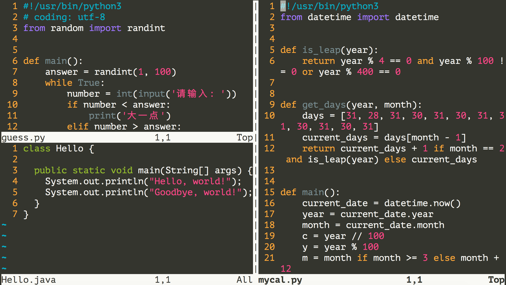

# 06.`Vim`编辑器

**修改与设定重要服务的配置文件**是服务器运维最基础常用的工作，`linux`系统中内置了一个强大的文本编辑工具`Visual editor`，简称`vi`，类似于`window`是中的`notepad`(记事本)一样，`vim` 是从 `vi` 发展出来的一个文本编辑器，支持 **代码补全**、**编译** 及 **错误跳转** 等方便编程的功能特别丰富，在程序员中被广泛使用，被称为 **编辑器之神**。

> `vi` 的核心设计思想 — 让程序员的手指始终保持在键盘的核心区域，就能完成所有的编辑操作。

## 一、打开文件

可以通过`vi`或`vim`命令来启动`vim`，启动时可以指定文件路径来打开一个文件，如果没有指定文件名，也可以在保存的时候指定文件名作新建文件。

```shell
# vi/vim 文件路径
vim guess.py
# 如果文件已经存在，会直接打开该文件，如果文件不存在，会新建一个文件。

# vi/vim 文件名 +行数 # 打开指定文件，并且将光标移动到指定行
vim +3 anaconda-ks.cfg
# 如果只带上 `+` 而不指定行号，会直接定位到文件末尾

# vim +/关键字 文件路径
# # 打开指定文件，高亮显示关键字，光标移动到关键字第一次出现位置所在行，第二次打开这个文件，光标会移动到关键字第二次出现所在行，以此类推。
vim +/part anaconda-ks.cfg

# 同时打开多个文件 ：vim 文件路径1 文件路径2 文件路径3 …
vim a.txt b.txt c.txt

# 为文档设置密码，设置密码后需要保存文件后生效
vim -x filename 
# 删除密码：
# 在末行模式执行，如下代码将更改密码，如果等号右边对应空值，则代表取消密码
:set key=abcdefg
```

多文件编辑时，`:n`编辑下一个文件，`:N`编辑上一个文件，输入`:files`或`:ls`指定列出目前这个`vim`开启的所有文件。

## 二、工作模式

`vim`支持多种工作模式，有人说三种，也有人说四种、五种，实际上确实有很多种编辑模式，但主要记住三种就够了，分别是`命令模式`、`末行模式`和`编辑模式`，其余模式包括末行模式都相当于在命令模式下的扩充。


### 1.命令模式

使用指令打开文件后，默认进入的就是命令模式，也有人称基本模式，命令模式下支持一系列快捷操作如**定位**、**翻页**、**复制**、**粘贴**、**删除**等操作，并支持各种模式之间的快速切换：

- 在任意模式下，按住`esc`都可进入命令模式。

- 命令模式下，按住键盘`v`进入可视模式、按住键盘`r`进入替换模式、按住键盘`:`进入末行模式，按住键盘`i,I,a,A,o,O`进入插入模式，具体而言：

  | 键   | 说明               | 键   | 说明             | 键   | 说明               |
  | ---- | ------------------ | ---- | ---------------- | ---- | ------------------ |
  | `i`  | 当前字符前插入内容 | `I`  | 当前行首插入内容 | `o`  | 在当前行后插入空行 |
  | `a`  | 当前字符后插入内容 | `A`  | 当前行末插入内容 | `O`  | 在当前行前插入空行 |

> 命令模式非常复杂，上面是些简单的操作，后续将进一步学习。

### 2.末行模式

在基本模式下，输入`:`即可进入末行模式，此时会在编辑器的最下方展示窗口，用于输入命令，相当于是基本模式的命令扩展，如上一步中所用的`:n`和`:N`就是末行模式。末行命令主要是针对文件进行操作的，支持如**文件保存**、**退出编辑**、**搜索替换**、**另存**、**新建**及一些**快速配置**，类似于记事本的菜单栏。

|         命令          | 功能                           |                                |                      |
| :-------------------: | ------------------------------ | ------------------------------ | -------------------- |
|         `:q`          | 退出，如果没有保存，不允许退出 | `:q!`                          | 强行退出，不保存退出 |
|         `:w`          | 保存                           | `:w <filename>`                | 另存为新文件         |
| `:n1,n2 w <filename>` | 将`n1~n2`行之间的内容保存      |                                |                      |
|         `:wq`         | 保存并退出                     | `:wq!`                         | 强行保存并退出       |
|         `:le`         | 整行向左对齐                   | `:ri`                          | 整行向右对齐         |
|        `:整数`        | 跳转到该行                     | `:ce`                          | 整行居中对齐         |
|        `:!cmd`        | 在`vim`中执行终端命令。        | `:{range}s/{old}/{new}/{flag}` | 搜索替换             |
|       `:%!sort`       | 排序                           |                                |                      |

```shell
# 在 vim 中执行 shell 命令：:!<command>

# 1.通过 vim 编辑文本的时候，不想退出 vim，打印当前目录，可以直接在 vim 中执行：:!pwd。
# 2.因为没有权限无法强制保存文件时，使用`:w !sudo tee %`以管理员权限保存当前文件
```

末行命令扩展：

```shell
# 补充命令
:set ignorecase                  # 查询结果显示忽略大小写查询
:set noignorecase                # 查询结果显示不忽略大小写查询
:set number                      # 显示行号
:set mouse=a                     # 激活鼠标，用鼠标选中时相当于进入可视模式
:syntax on /:syntax off          # 激活语法高亮/关闭语法高亮
:set key=abcdefg                 # 设置和清空文件密码
:set showcmd                     # 实时看到输入的命令
:set nohlsearch                  # 意为设置不高亮搜索
:set ruler                       # 显示标尺
:set ts=4                        # 设置Tab键的空格数
:help	                           # 查看帮助文档
# 在 vim 中输入 :，再按下 <Ctrl> + d，将展示所有可以在 vim 中使用的命令。
```

> 如果希望上面的这些设定在每次启动vim时都能自动生效，需要将这些设定写到用户主目录下的`.vimrc`文件中。

### 3.编辑模式

在命令模式下，使用插入命令都可以进入编辑模式，在插入模式下，按键直接向文本缓冲区插入文本。

| 快捷键     | 说明                    | 快捷键              | 说明               |
| ---------- | ----------------------- | ------------------- | ------------------ |
| `ENTER`    | 换行                    | `BACK SPACE`        | 删除光标前一个字符 |
| `DEL`      | 删除光标后一个字符      | `方向键`            | 在文本中移动光标   |
| `HOME/END` | 移动光标到行首/行尾     | `Page Up/Page Down` | 上/下翻页          |
| `Insert`   | 切换光标为输入/替换模式 | `字符按键`          | 输入字符           |

> 编辑命令和数字连用：正常开发时，在 **进入编辑模式之前，不要按数字**

在开发中，可能会遇到连续输入 `N` 个同样的字符的情景，例如：`**********` 连续 10 个星号，可以先在命令模式下输入 `10`，然后切换到编辑模式下输入`*`，切换回命令模式，上一步就会被重复10次。

## 三、命令模式详解

`vi` 的命令较多，不要期望一下子全部记住，个别命令忘记了，只是会影响编辑速度而已，为描述方便，将`vim`操作暂时分为动作类和操作类两个子模块。


### 1.动作符

#### （1）简单的上下左右移动

| 命令 | 功能       | 命令 | 功能       |
| ---- | ---------- | ---- | ---------- |
| `h`  | 向左       | `l`  | 向右       |
| `j`  | 向下       | `k`  | 向上       |
| `w`  | 至后单词首 | `b`  | 至前单词首 |
| `e`  | 至后单词尾 | `E`  | 至前单词尾 |

> `vim`中所有移动`<motion>`都可以和数字组合使用：`n<motion>`，例如`2h`表示向左移动`2`个单位，`2w`则表示向后移动两个单词。

#### （2）快捷移动指令

| 指令     | 说明                        | 指令     | 说明           |
| -------- | --------------------------- | -------- | -------------- |
| `0`或`^` | 移至行首，`^`不会跳过空格** | `$`      | 移至行末**     |
| `(:`     | 移至句头                    | `):`     | 移至句尾       |
| `{:`     | 移至段首                    | `}:`     | 移至段尾       |
| `[[:`    | 移至节头                    | `]]:`    | 移至节尾       |
| `%`      | 在一对`()/[]/{}`间跳跃      |          |                |
| `gg`     | 移动至文件首**              | `G`      | 移动至文件尾** |
| `数字%`  | 移至文件`n%`位置            |          |                |
| `数字gg` | 移动至某行**                | `数字G`  | 移动至某行**   |
| `Ctrl+b` | 全屏上滚                    | `Ctrl+f` | 全屏下滚       |
| `Ctrl+u` | 半屏上滚                    | `Ctrl+d` | 半屏下滚       |
| `H`      | 移动至屏幕顶部              | `M`      | 移动至屏幕中间 |
| `L`      | 移动至屏幕底部              |          |                |

> 在查看或编辑时，某一块内容可能**需要稍后处理**，例如：编辑、查看，此时先使用 `m+[a-z]` 增加一个标记，这样可以在需要时快速地跳转回来或者执行其他编辑操作，注意标记的 **行如果被删除**，**标记同时被删除**，如果 **在其他行添加了相同名称的标记**，**之前添加的标记也会被替换掉**。
>
> `m[a-z]`只能在同一个文件下标记和跳转，`m[A-Z]`则支持跨文件跳转。

```shell
# mx  ————————>  `x 跳跃至刚才标记的x的点
# `[  # 自动标记 上次开始更改的位置
# `]  # 自动标记 上次结束更改的位置
```

### 2.操作符

`Vim`中所有操作可以和动作组合：`<verb><motion>`组成新的动作，也可以与数字`n<verb>`组合使用，如`ggVG`可以全选内容，`2u`表示连续撤回两次。大部分命令都支持 `<verb><n><motion>` 和 `<n><verb><motion>` 两种模式，比如 `d2w` 和 `2dw` 都是删除后两个单词。但在语义上有区别：`d2w` 表示删除 `2w` 范围的内容，而 `2dw` 表示 `dw` 命令重复 2 次。

#### （1）文本选中与可视模式

在 `vi` 中可以利用**可视模式**快速选择，可视模式仍处于命令模式下，可视模式常用于和批量增加缩进或注释。

| 模式         | 快捷键   | 说明                                                         |
| ------------ | -------- | ------------------------------------------------------------ |
| 字符可视模式 | `v`      | 左右方向键正常，上下方向键选中原光标位置到现光标位置内到所有内容。 |
| 行可视模式   | `V`      | 不能在选择单个字符或单词，只能选择完整的行。                 |
| 块可视模式   | `Ctrl+v` | 选择形成一种矩形形状，常用于按列修改。                       |

> 当选中范围文本时，由于光标对应的是多行，因此后续想进入多行编辑模式，只能通过`I`和`A`键实现。

```shell
# 块可视模式下批量增加注释
# 1.普通模式下按 ctrl+v 进入块选择模式；
# 2.上下键(j/k)移动选择待注释的行；(ps:此处直接按 < >可以快速左右缩进。)
# 3.按A进入行首插入，(ps:按住后可能显示光标仅在第一行，不要在意，实际光标仍在多行);
# 4.按住 # + 空格 即可批量增加注释。
# 5.按住esc回到命令模式，此时插入结果将会生效。
```

#### （2）撤销和恢复和排版

学习高级动作前先学会怎样撤销之前一次 **错误的** 操作！

| 快捷键 | 说明           | 快捷键   | 说明           |
| ------ | -------------- | -------- | -------------- |
| `u`    | 撤销上一个操作 | `Ctrl+r` | 恢复上一个操作 |
| `.`    | 重复上一个操作 |          |                |
| `>>`   | 向右增加缩进   | `<<`     | 向左减少缩进   |

> **缩排命令**在程序开发时进行代码缩进，在可视模式下，缩排命令只需要使用 **一个** `>` 或者 `<` 。

#### （3）复制、剪切、删除及粘贴

| 快捷键   | 说明                 | 快捷键     | 说明                       | 快捷键 | 说明                   |
| -------- | -------------------- | ---------- | -------------------------- | ------ | ---------------------- |
| `d`或`x` | 删除                 | `xx`或`dd` | 删除当前行                 | `D`    | 删除至行尾             |
| `s`      | 删除，并进入编辑模式 | `ss`       | 删除整行，并进入编辑模式   | `S`    | 删除整行，进入编辑模式 |
| `c`      | 剪切，并进入编辑模式 | `cc`       | 剪切当前行，并进入编辑模式 |        |                        |
| `y`      | 复制                 | `yy`       | 复制当前行                 |        |                        |
| `p`      | 粘贴                 |            |                            |        |                        |

- 所有操作都可以与数字组合使用，如`2y`复制两个，`2yy`复制两行，`d2`删除到改行第二列。
- 所有操作都可以于动作组合使用，如`dw`删除到单词尾，`d0`删到行首，`d}`删到段尾，`d2G`删到第二行，`d"x`删到标记`x`。
- 删除、剪切及复制后到内容会暂存在缓存区，缓存区只有一个，后缓存的会替换先缓存的内容，`vi`缓存区与系统缓存区不冲突，在其他软件中使用 `CTRL + C` 复制的内容，不能在 `vi` 中通过 `P` 命令粘贴。

#### （4）大小写转化

| `~`  | 大小写转化               | `~~`  | 当前行大小写转化 |      |      |
| ---- | ------------------------ | ----- | ---------------- | ---- | ---- |
| `gu` | 将光标下的字符大写转小写 | `guu` | 整行大写转小写   |      |      |
| `gU` | 将光标下的字符小写转大写 | `gUU` | 整行小写转大写   |      |      |

> 大小写转化也支持`2gu`、`2guu`、`gu0`、`gu"x`等形式。

#### （5）查找和替换

- 查找

| 命令    | 说明                           | 命令           | 说明                           |
| ------- | ------------------------------ | -------------- | ------------------------------ |
| `/text` | 在文本中查找`text`             | ``/<pattern>`` | `/`后支持正则表达式            |
| `n`     | 跳转至`/text`查找的下一个结果  | `N`            | 跳转至`/text`查找的上一个结果  |
| `f<x>`  | 移动至下一个指定字符           | `F<x>`         | 移动至上一个指定字符           |
| `*`     | 向后查找当前选中对应的完整单词 | `#`            | 向前查找当前选中对应的完整单词 |

查找后，目标字符或字符串会进入高亮模式，如果想要取消高亮，可以在末行模式配置。

- 替换

命令模式下按`R`启动替换模式，替换模式可以在不进入编辑模式，对文件进行 **轻量级的修改**。

| 命令 | 说明                            | 工作模式 |
| ---- | ------------------------------- | -------- |
| `r`  | 替换当前一个字符，相当于`x`+`i` | 命令模式 |
| `R`  | 替换连续多个字符                | 替换模式 |

> 末行模式下执行`:{range}s/{old}/{new}/{flag}`可进行查找替换，默认全文件替换，如果需要局部替换，则可以先选中要替换文字的范围在执行替换。

```shell
# :{range}s/{old}/{new}/{flag}
# range：空至搜索区域
# 空：    当前行
# %:     全文
# n,m    n~m行
# .,+n   当前行到当前行+n行
# 选区

# flag  # 空至替换区域
# 空白    只替换一次
# g      全文替换
# i      忽略大小写
# c				交互模式


# 替换命令实现多行注释
可视模式下选择多行，进入末行模式，输入`%s/^/# /g`则可以批量在行首增加 # 
```

### 3.高级操作

- 已经多次强调，所有操作、动作和数字都组合使用。
- 高级操作：`<operator> <scope> <text>`

```shell
# <operator>支持 d 删除；y	复制；v选中；c	修改；
# <scope> 支持 i：inner不包括边界 ； a：around，包括边界在内

# 编辑 string: 'i am iron man' 单引号内的内容
ci'  
# 执行后会进入编辑模式，光标处于单引号之间，如果是ca',则会同时把单引号修改
di(  # 删除括号内的内容

# 删除const a = [1,2,3,4,5]中数组里的所有元素
ci[
# ps 因为边界是成对出现，因此我们也可以输入]
```

## 四、高级

### 1.配置文件

`vimrc` 是 `vim` 的配置文件，可以设置 vim 的配置，包括：**热键**、**配色**、**语法高亮**、**插件** 等，`Linux` 中 `vimrc` 有两个位置，**家目录下的配置文件优先级更高**。

```shell
# 在用户家目录配置.vimrc,如果没有直接创建
[root@itcast ~]# vim ~/.vimrc
# 添加以下命令，保存退出
set nu

# 打开vim全局配置文件
[root@itcast ~]# vim /etc/vimrc
# 在最后一行添加以下命令，保存退出
set nu
```

> [Github](https://github.com/search?q=vimrc&ref=opensearch) 有很多开箱即用的 vimrc 文件，比如 [amix/vimrc](https://github.com/amix/vimrc)。

### 2.键盘映射

在`vim`下可以将一些常用操作映射为快捷键来提升工作效率，

```shell
# 在命令模式下输入`F4`执行从第一行开始删除10000行代码的操作。
:map <F4> gg10000dd
# 在编辑模式下输入`__main`直接补全为`if __name__ == '__main__':`
:inoremap __main if __name__ == '__main__':
```

> `inoremap`中的`i`表示映射的键在编辑模式使用， `nore`表示不要递归，如果希望映射的快捷键每次启动vim时都能生效，需要将映射写到用户主目录下的`.vimrc`文件中。

### 3.窗口拆分

可以在末行模式中输入`sp`或`vs`来实现对窗口的水平或垂直拆分，这样我们就可以同时打开多个编辑窗口，通过按两次`Ctrl+w`就可以实现编辑窗口的切换，在一个窗口中执行退出操作只会关闭对应的窗口，其他的窗口继续保留。

|     命令      |      英文      | 功能         |
| :-----------: | :------------: | ------------ |
| :sp [文件名]  |     split      | 横向增加分屏 |
| :vsp [文件名] | vertical split | 纵向增加分屏 |



#### 1) 切换分屏窗口

> 分屏窗口都是基于 `CTRL + W` 这个快捷键的，`w` 对应的英文单词是 `window`

| 命令 |  英文   | 功能                                        |
| :--: | :-----: | ------------------------------------------- |
|  w   | window  | 切换到下一个窗口                            |
|  r   | reverse | 互换窗口                                    |
|  c   |  close  | 关闭当前窗口，但是不能关闭最后一个窗口      |
|  q   |  quit   | 退出当前窗口，如果是最后一个窗口，则关闭 vi |
|  o   |  other  | 关闭其他窗口                                |

#### 2) 调整窗口大小

> 分屏窗口都是基于 `CTRL + W` 这个快捷键的，`w` 对应的英文单词是 `window`

| 命令 | 英文 | 功能         |
| :--: | :--: | ------------ |
|  +   |      | 增加窗口高度 |
|  -   |      | 减少窗口高度 |
|  >   |      | 增加窗口宽度 |
|  <   |      | 减少窗口宽度 |
|  =   |      | 等分窗口大小 |

> 调整窗口宽高的命令可以和数字连用，例如：`5 CTRL + W +` 连续 5 次增加高度

### 5.录制宏

`Vim `的宏提供了将一系列操作记录下来然后重复执行的机制。它可以大大提高重复性的操作效率。使用宏的步骤如下：

录制宏。按下 `q` 键，然后再按下一个字母 (如 `a`，这是宏的名字)，开始录制宏。这时会在状态栏显示` recording a`。在录制时，执行要重复的操作，包括移动、删除、插入等等。执行完操作后，按下 `q` 键结束录制。

执行宏。按下 `@` 键，然后在输入框中输入之前记录宏的字母 (如 `a`)，按下回车键即可执行宏。也可以连续执行多次，比如执行 `10` 次，只需在 `@a` 后面加上 `10` 即可。

另外，按下 v 键进入 `visual mode` 选中多行，可以批量针对多行文本执行宏。使用 `:reg` 命令可以查看所有已经保存的宏。如果在执行宏时出现错误，可以通过使用 `:debug` 命令进入调试模式。

### 6.常见报错

#### （1）存在“.swp”后缀文件：

`vim`编辑器在打开一个文件例如文件`a`时，本质是去创建并编辑一个在原文件名后添加`.swp`后缀的**隐藏的临时文件**，即`.a.swp`，编辑过程中的所有结果都暂存在此文件中，当执行`q`命令时，就会删除该文件，但是如果未执行`q`就异常退出或事该文件仍被其他进程占用中，则会在该文件夹下缓存一个`.swp`文件。

解决方案：确认没有其他终端正在编辑该文件，通过`ll -a`查询并删除`.swp`文件，然后再进行编辑；或者使用`:recover`命令进行恢复后进行编辑。

#### （2）无法保存文件

错误原因：可能没有权限。当前用户对目标文件或其所在的目录没有写权限。例如，系统配置文件（如`/etc/hosts`、`/etc/nginx/nginx.conf`等）通常需要超级用户权限才能修改。

解决方案1：使用 `sudo` 命令以超级用户权限启动Vim。例如`sudo vim example.conf`。

解决方案2：使用`:w !sudo tee %`以管理员权限保存当前文件。如果需要变更配置文件的权限和归属，可进一步使用`sudo chown`或`sudo chmod`等命令。


## 五、便捷设置

在终端输入 `set -o vi` 可以切换到 vim 模式，按下 `ESC` 就能进入 vim 的 normal mode，修改终端命令的时候很好用。推荐将其写入 `.bashrc` 或 `.zshrc` 等配置文件。

在 zsh 中，也可以通过快捷键 `Ctrl + x, Ctrl + e` 打开 vim 编辑当前命令。


