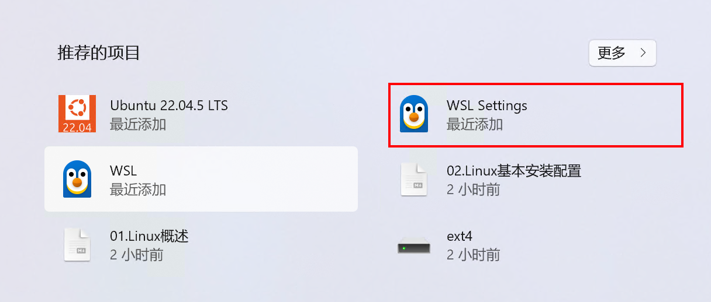
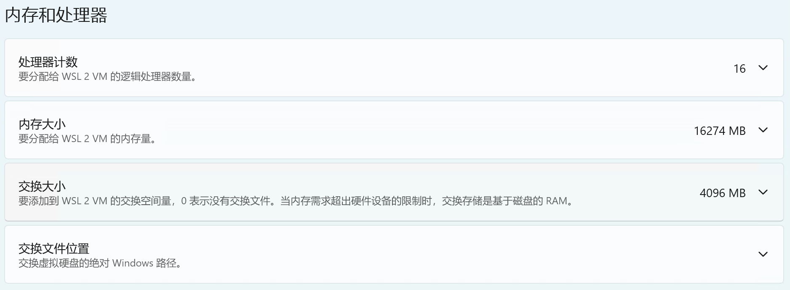
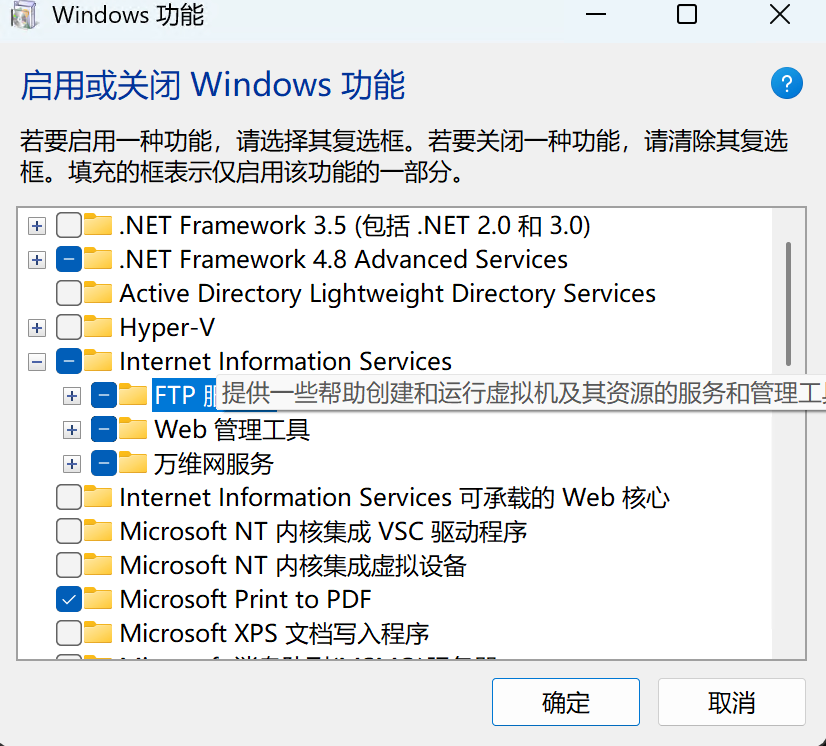

# 笔记本接台式主机实现远程开发

台式机在宿舍，本人需要去图书馆实现远程开发，或是即使在宿舍两台显示器换来换去也很不方便，因此考虑将台式机打造为一个无显示器的服务端，用笔记本连接外接屏或是远程访问台式机跑代码。

## 一、总体设计

目前总体思路规划为两个方面：

思路1：可以直接借助`windows`的远程桌面连接，实现`mac`对`windows`的远程访问，条件为`windows`内置了远程访问，且`mac`中存在软件`Microsoft Remote Desktop Beta for Mac`。

思路2：思路一适合进行一些复杂的桌面操作，借助`ssh`搭建便捷高效的远程开发环境，目前笔记本是`mac`系统，台式机是`windows`系统，`pycharm`的`ssh`连接目前仅支持`linux`，因此考虑先在台式机上借助`wsl`访问，后续考虑直接将台式机转变为`linux`。

## 二、基于windows远程连接服务

### 1.`win`开启远程桌面服务

首先`win`主机下进入`设置`>`系统`>`远程桌面`，开启远程桌面同时添加当前用户为远程桌面用户，如果添加的是`mi crosoft`邮箱账户的话，连接密码就是邮箱密码。

其次进入`设置`>`网络和Internet`>`高级网络设置`>`高级共享设置`，可以将网络连接方式设置为专有网络，或者设置为共有网络并开启“网络发现”和“文件和打印机共享”。

最后，打开终端，其中输入：`ipconfig`命令查看当前`ip`地址，不知道`IP`点情况下，在局域网内使用`PC-Name`也是可以的。

### 2.`mac`配置远程桌面连接

开启软件，选择添加主机，依次填写“`win`主机`IP`地址”>“账户和密码（凭证）”>“连接”即可实现远程访问，后续还将考虑如何实现基于互联网的远程连接。

## 三、基于`ssh`服务

### 1.安装`wsl`

`WSL`是一个可以运行在`Windows`环境下的`Linux`子系统，现在`PyCharm`的远程开发仅支持连接运行有`Linux`系统的主机，双系统比较麻烦，虚拟机则无法发货台式机全部性能，综合来看，在台式机上安装`wsl`是一个比较好的方案。

#### （1）启用`wsl`

```shell
# windows 终端输入-以管理员权限打开

# 用于 Linux 的 Windows 子系统
dism.exe /online /enable-feature /featurename:Microsoft-Windows-Subsystem-Linux /all /norestart

# 启用虚拟化
dism.exe /online /enable-feature /featurename:VirtualMachinePlatform /all /norestart

# 查询可供安装的 分发列表
wsl -l -o
# ...

# 安装自己需要的分发版本以 Ubuntu-22.04为例
wsl --install -d Ubuntu-22.04
```

安装结束后，会提示进入`wsl`设置自己的用户名和密码，并可以打卡应用配置自己的子系统，**配置完毕后建议重启计算机。**



可以看到自己直接设置了`16`个线程和`16G`内存和`1T`硬盘，相比于虚拟机优势很大，而且可以同时使用`windows`的操作系统，目前对`mac`还是不太熟，比如其中的`Office for mac`感觉用起来蛮别扭的。



> `WSL`分发导出：有人不太习惯将`wsl`安装在系统盘中，有些人无所谓，因此下列操作可选，记录一下。

```shell
# 查看安装的WSL分发名称
wsl -l -v
# NAME            STATE           VERSION
# * Ubuntu-22.04    Stopped         2

# 导出分发系统 wsl --export  <Distro> <FileName>
# 其中 <Distro> 为分发系统名称，<FileName> 为文件路径
wsl --export Ubuntu-22.04 D:\ubuntu_wsl.tar

# 注销 要迁出的WSL分发版本
wsl --unregister Ubuntu-22.04

# 将WSL分发重新导入到其他位置
# wsl --import <Distro> <InstallLocation> <FileName> 
# <InstallLocation> 为 希望将WSL存放的路径
wsl --import Ubuntu-22.04 D:\ubuntu\ubuntu22_wsl D:\ubuntu_wsl.tar --version 2

# 迁出默认用户
ubuntu2204 config --default-user username
```

### 2.台式机配置

台式机和笔记本之间基于`ssh`建立远程连接，因此需要在两台主机上安装`ssh`。笔记本想要借助`ssh`与台式机内部的`wsl`通信，则需要台式机对消息进行转发，因为`wsl`需要借助宿主机对网卡转发请求。因此对于台式机，则需要在本机和`wsl`内部都安装`ssh`。

#### （1）更新软件源

打开台式机终端输入`wsl`进入子系统，首先对子系统进行基本的配置，比如安装常用的包`vim`和配置更新软件源：

```shell
# 要备份最初源头，防止丢失
sudo cp /etc/apt/sources.list /etc/apt/sources.list.bak
# 其次需要下载vim编辑器，但是下载vim需要暂时更新源
sudo apt-get update
sudo apt update
# 编辑软件源
sudo apt-get install vim
```

进入`vim`后按`i`进入编辑模式，将光标移动至文件结尾，按`esc`进入代码模式，输入`d1G`回车执行，快速删除删除光标所在行到第一行的所有数据。继续按`i`进入编辑模式，在其中复制添加如下内容，切换命令模式输入`wq`保存退出。

```shell
# 清华源
deb https://mirrors.tuna.tsinghua.edu.cn/ubuntu/ focal main restricted universe multiverse
deb https://mirrors.tuna.tsinghua.edu.cn/ubuntu/ focal-updates main restricted universe multiverse
deb https://mirrors.tuna.tsinghua.edu.cn/ubuntu/ focal-backports main restricted universe multiverse
deb http://security.ubuntu.com/ubuntu/ focal-security main restricted universe multiverse
```

#### （2）更新下载依赖

```python
# 更新源，如出现依赖问题：sudo apt-get -f install
sudo apt-get update
# 更新本地数据库
sudo apt update
# 更新所有已安装的包
sudo apt upgrade

# 安装配置`ssh-server`
sudo apt-get remove openssh-server # 重要，要卸载后重装
sudo apt autoremove
# ps:为何先卸载旧版本?
# 保留旧版本的情况下会要求 ssh-server和ssh-client版本一致，因此想要安装ssh-server需要先卸载或者更新ssh-client到指定版本
sudo apt-get install openssh-server 
# 安装网络工具
sudo apt-get install net-tools
```

#### （3）配置`ssh-server`服务

注意修改的是`sshd_config`而不是`ssh_config`，`ssh_config`用于客户端的配置，配置`openssh-client`的，`sshd_config`则是配置`openssh-server`的。

```shell
# 查看运行状态
sudo service ssh status

# ● ssh.service - OpenBSD Secure Shell server
#     Loaded: loaded (/lib/systemd/system/ssh.service; enabled; ...
#     Active: active (running) since Wed 2024-11-20 10:12:04 CST; ...
# ...
# ...Server listening on 0.0.0.0 port 22.
# ...Server listening on :: port 22.

# 修改`openssh-server`的配置
# 备份配置文件
sudo cp /etc/ssh/sshd_config /etc/ssh/sshd_config.bak
sudo vim /etc/ssh/sshd_config

# 启动如下配置
# Port 2222
# ListenAddress 0.0.0.0
# HostKey /etc/ssh/ssh_host_rsa_key
# HostKey /etc/ssh/ssh_host_ecdsa_key
# HostKey /etc/ssh/ssh_host_ed25519_key
# PasswordAuthentication yes
# PermitRootLogin yes

# 重启 `ssh-server`
sudo service ssh restart
```

在`WSL`中不能使用默认的`22`端口，因为会与`Windows`冲突。

**测试结果**：重启`ssh`后切换到window终端中，执行命令：

```python
# 查询可用端口
netstat -aon|findstr "2222"
#  TCP    127.0.0.1:2222         0.0.0.0:0              LISTENING       6864
# 测试连接 ssh <username>@<wsl_ip> -p <port>
ssh shelhen@127.0.0.1 -p 2222
```

出现密码访问后说明启动成功。

#### （4）配置网络访问WSL

在`wsl`中执行：

```python
# 查看虚拟机IP
ifconfig
# ...  172.17.79.111 ...
```

使用管理员权限 在台式机终端中执行如下代码：

```python
# 把端口从WSL中隐射到主机上
# # netsh interface portproxy add v4tov4 listenport=<wport> listenaddress=0.0.0.0 connectport=<wsl_port> connectaddress=<wsl_ip>
netsh interface portproxy add v4tov4 listenport=2222 listenaddress=0.0.0.0 connectport=2222 connectaddress=172.17.79.111

# 查看端口转发列表，检查刚刚有无设置成功
netsh interface portproxy show all
# 0.0.0.0         2222        172.17.79.111   2222

# 弄错了可尝试 删除映射
# netsh interface portproxy delete v4tov4 listenport=2222 [listenaddress=0.0.0.0]
```

不执行如上代码会出现`connected refuse`，以后可在`windows`所在的局域网中使用如下命令，直接访问`wsl`。

```python
ssh <username>@<windows_pc_ip> -p 2222
```

#### （5）开启`Windows`网络服务

在控制面板，搜索`启用或关闭Windows功能`，然后在打开的界面中把`Internet Information Services`的三个全部勾选  上，启动后可以远程借助`ftp`进行文件管理。



#### （6）配置防火墙

以下选择其一执行即可

- 打开`windows Definder`的高级设置，依次执行`入站规则`>`新建规则`>`端口`>`TCP`>`特定本地端口`>`2222`（与之前配置端口映射时的本机端口一致）
- 执行如下命令

```python
# name可以自定义，localport必须是 win_port,
netsh advfirewall firewall add rule name="WSL2" dir=in action=allow protocol=TCP localport=2222
```

#### （7）其他设置

```python
win+r
shell:startup

CreateObject("Wscript.Shell").run "wsl -u shelhen -d Ubuntu-22.04",vbhide

文件名称：wsl-startup.vbs
```
