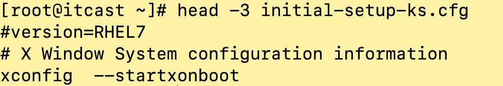
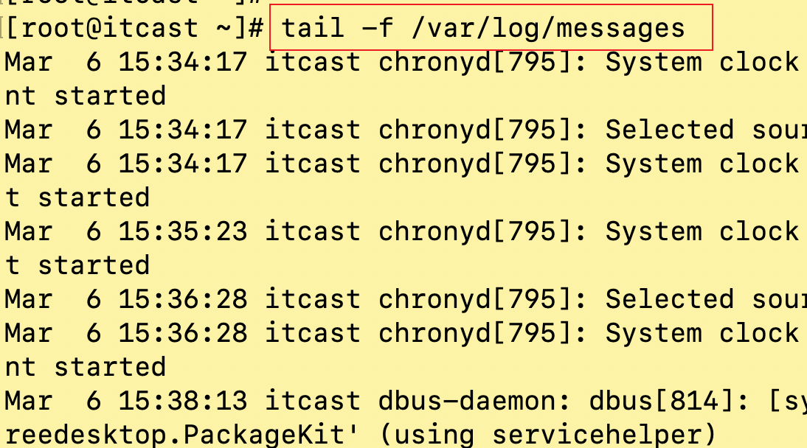
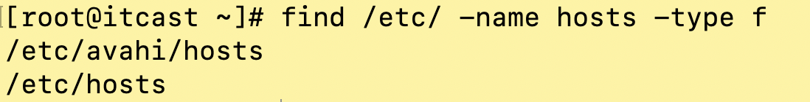
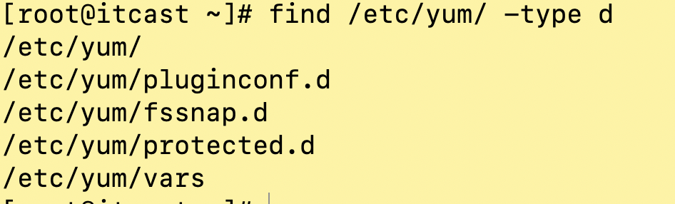

### 1、磁盘内存相关命令

#### df

作用：查看磁盘空间

语法：df [-h]

选项：

-h， 以可读性较高的形式展示大小


#### free

作用：查看内存使用情况

语法：free  [-选项]

选项：

-m， 表示以M为单位查看

-h， 以可读性较高的形式展示大小


### 2、文件内容相关命令

#### head

作用：查看一个文件的前n行，如果不指定n, 默认显示前10行

语法：head [-n] 文件路径 【n是一个正整数】

示例代码：显示initial-setup-ks.cfg的前3行



示例代码2：显示anaconda-ks.cfg的前10行，不指定-n


#### tail

作用：查看一个文件的末n行，如果不指定默认显示后10行

语法：tail [-n] 文件路径 【n表示正整数】

示例代码1： 显示anaconda-ks.cfg文件最后5行


示例代码2：显示anaconda-ks.cfg 文件最后10行


**tail命令扩展：**

作用：查看一个文件动态变化的内容（非用户手动增加，计算机写入）

语法：tail -f 文件路径

说明：tail -f 一般用于查看系统日志,退出tail -f卡屏状态，按下Ctrl + c键



#### less

作用：查看大文件，以较少的内容进行输出，按下辅助功能键查看更多,按q退出

功能键：空格向下翻页，"b"键向上翻页，上下键向上向下移动一行

语法：less 需要查看的文件路径


#### more

作用：查看文件，以较少的内容进行输出，按下辅助功能键查看更多文件内容。按q退出

功能键： Ctrl+f（或者空格）向下翻页，Ctrl+b向上翻页，回车向下一行查看

语法：more 需要查看的文件路径


#### wc

解释：wc （word count）

作用：统计文件内容信息（包含行数、单词数、字节数）

语法：wc - [lwc] 需要统计的文件路径，不写选项，行数、单词数、字节数都显示

选项：

-l ：表示lines， 行数（以回车/换行符为标准）

-w：表示words，单词数（以空格为标准）

-c: 表示bytes， 字节数

> 注意：wc命令选项可以混在一起搭配使用，但选项的顺序不影响结果
>
> 第一个是行数
>
> 第二个是单词数
>
> 第三个是字节数


#### du

作用：查看文件或目录（递归显示子目录）占用磁盘空间大小

语法：du [-sh] 文件或者目录

选项：

-s，summaries，显示汇总大小

-h，高可读性进行显示

示例代码1：


示例代码2：


#### find

作用：查找文档

语法：find  路径范围 选项1 选项1值 [选项2 选项2值]

选项：

-name， 按照文档名称进行搜索

-type，按照文档类型进行搜索

文档类型：`“-”`表示文件（在使用find的时候使用f来替换），`d`表示文件夹

示例代码1：



示例代码2：*表示通配符


示例代码3：表示查找/etc/yum/ 下的所有文件夹



### 3、日期时间命令

> 概念：
>
> 在linux系统里有系统时间和硬件时间，系统在启动的时候会去读取硬件时间作为系统时间

#### date

##### 获取时间

作用：表示获取系统时间

语法1： date 

输出形式：2019年 03月 06日 星期三 16:34:12 CST

语法2：date "+%F"  等价于 date “+%Y-%m-%d”

输出形式：2019-03-06

语法3：date "+%F %T" 等价于 date ”+%Y-%m-%d %H:%M:%S“

输出形式：2019-03-06 16:39:46

语法4:获取之前或者之后的某个时间(备份)

\# date -d "-1 day" "+%Y-%m-%d %H:%M:%S"

符号的可选值:+(之后) 或者 - (之前)
单位的可选值:day(天)、month(⽉份)、year(年)

| 符号 | 格式符 | 说明                            |
| ---- | ------ | ------------------------------- |
| 1    | %F     | 表示完整的年月日，形如2019-12-1 |
| 2    | %T     | 表示完整的时分秒，形如08:10:11  |
| 3    | %Y     | (year)表示四位年份              |
| 4    | %m     | (month)表示两位月份             |
| 5    | %d     | (day)表示日期                   |
| 6    | %H     | (hour)表示小时                  |
| 7    | %M     | (minute)表示分钟                |
| 8    | %S     | (second)表示秒数                |

##### 设置时间

作用：表示设置系统时间

选项：

-s,设置系统时间


#### hwclock（了解）

##### 获取时间

作用：管理计算机硬件RTC时间


##### 设置时间

选项：

-w， 将linux系统时间保存到硬件RTC中

-s， 将RTC中的时间保存到linux系统时间中


#### timedatectl

作用：同时设置系统时间和RTC硬件时间，还可以设置时区。

参数：

list-timezones	： 列出系统上所有支持的时区名称

set-timezone  	：设定时区位置

**set-time**		 ：设定时间（同时设置系统时间和RTC时间）

##### 获取时间：


##### 设置时间：


#### ntpdate

作用：手动网络校时

语法：ntpdate ntp服务器地址

```shell
ntp服务器地址:
1. 国家授时中心：ntp.ntsc.ac.cn
2. 阿里云：ntp.aliyun.com ntp1.aliyun.com
```


#### cal(了解)

作用：查看系统日历

语法一： `cal `等价于 `cal -1` 输出当前月份日历


语法二：`cal -3` 输出上个月 + 本月 + 下个月的日历


语法三：`cal -y 年份数字` 表示输出某一个年份的日历（1-9999）


### 4、管道命令

#### 管道符

管道符：`|`

作用：管道一般用于”过滤“

语法：命令A | 命令B，命令A的正确输出作为命令B的操作对象

说明：管道符不能单独使用，必须配合其他命令来一起使用。

举例：想知道/etc/底下有哪些文档，那么可以利用`ls /etc`来查阅，不过，因为/etc底下的文档太多，导致整个屏幕都塞满了，查看变得不方便，此时我们可以透过less指令协助查看.

```shell
[itcast@itcast ~]$ ls /etc | less
```

#### 过滤功能

grep： 取出含有搜寻字符串的内容行

```shell
[root@itcast itcast]# grep [-v] ‘搜寻字符串’ filename 
#选项：
-v：反向选择，亦即显示出没有'搜寻字符串'内容行

#示例一：将ls中，出现readme的内容行取出
[root@itcast ~]# ls | grep 'readme'

#示例二：与示例一相反，取出没有readme的内容行
[root@itcast ~]# ls | grep -v 'readme'
```

#### 练习

问题一：使用学过的命令，统计某个目录下文档的总个数？

```shell
#示例：统计/下文档个数
[root@itcast ~]# ls / | wc -l
```

问题二：统计系统中用户数量

```shell
#示例：linux系统中配置文件'/etc/passwd'，一个用户会占用一个行配置，使用管道统计用户个数
[root@itcast ~]# cat /etc/passwd | wc -l
```

### 5、其他命令

#### ps

作用：显示系统进程信息

```shell
[root@itcast ~]# ps aux 
USER        PID %CPU %MEM    VSZ   RSS TTY      STAT START   TIME COMMAND
root          1  0.0  0.5  53804  5428 ?        Ss   3月06   0:06 /usr/lib/syste
root          2  0.0  0.0      0     0 ?        S    3月06   0:00 [kthreadd]
--省略--
# 列的含义：
USER:该 process 属于哪个使用者账号
PID :该 process 的ID
%CPU:该 process 使⽤掉的 CPU 资源百分⽐
%MEM:该 process 所占⽤的物理理内存百分⽐
VSZ :该 process 使⽤掉的虚拟内存量 (Kbytes)
RSS :该 process 占⽤的固定的内存量 (Kbytes)
TTY :该 process 是在那个终端机上⾯运作，若与终端机无关，则显示 ?，另外， tty1-tty6 是本机上⾯的登入者程序，若为 pts/0 等等的，则表示为由⽹络连接进主机的程序。 STAT:该程序目前的状态，主要的状态有
R :该程序⽬前正在运作，或者是可被运作
S :该程序⽬前正在睡眠当中 (可说是 idle 状态)，但可被某些讯号 (signal) 唤醒。
T :该程序⽬前正在侦测或者是停止了了
Z :该程序应该已经终止，但是其父程序却无法正常的终⽌他，造成 zombie (疆⼫尸) 程序的状态 
START:该 process 被触发启动的时间
TIME :该 process 实际使用 CPU 运作的时间
COMMAND:该程序的实际指令

例子：
[root@localhost ~]# ps aux | grep firefox
```

#### kill

作用：杀死进程,指定pid（进程id）

```shell
[root@itcast ~]# kill [选项] 进程id

# 示例一 查看firefox进程，杀死该进程
[root@itcast ~]# ps aux | grep firefox
root      60746  3.3 10.6 776008 107236 ?       Sl   14:54   0:00 /usr/lib64/firefox/firefox
root      60801  0.0  0.0 112656   996 pts/1    R+   14:54   0:00 grep --color=auto firefox
[root@itcast ~]# kill 60746
[root@itcast ~]# ps aux | grep firefox
root      60846  0.0  0.0 112656   996 pts/1    R+   14:55   0:00 grep --color=auto firefox

# 示例二
[root@itcast ~]# kill -9 60746   #强制杀死进程
```

#### killall

作用：杀死进程，指出下达指令的名称

```shell
[root@itcast ~]# killall 指令名称

示例一：
[root@itcast ~]# killall firefox
```

#### ifconfig

作用：

```shell
[root@itcast ~]# ifconfig
eno16777736: flags=4163<UP,BROADCAST,RUNNING,MULTICAST>  mtu 1500
        inet 172.16.99.138  netmask 255.255.255.0  broadcast 172.16.99.255
        inet6 fe80::20c:29ff:fe17:6e52  prefixlen 64  scopeid 0x20<link>
        ether 00:0c:29:17:6e:52  txqueuelen 1000  (Ethernet)
        RX packets 850237  bytes 1207888409 (1.1 GiB)
        RX errors 0  dropped 0  overruns 0  frame 0
        TX packets 258583  bytes 17520886 (16.7 MiB)
        TX errors 0  dropped 0 overruns 0  carrier 0  collisions 0

lo: flags=73<UP,LOOPBACK,RUNNING>  mtu 65536
        inet 127.0.0.1  netmask 255.0.0.0
        inet6 ::1  prefixlen 128  scopeid 0x10<host>
        loop  txqueuelen 0  (Local Loopback)
        RX packets 304  bytes 27622 (26.9 KiB)
        RX errors 0  dropped 0  overruns 0  frame 0
        TX packets 304  bytes 27622 (26.9 KiB)
        TX errors 0  dropped 0 overruns 0  carrier 0  collisions 0
        
# 说明
eno16777736:网卡名
inet 172.16.99.138： IP地址
lo：回环网卡
```

## 六、远程连接工具

我们学习linux操作系统主要运行在服务器环境中，那么服务器一般都放在远程的机房中，这时候我们必须掌握远程连接linux服务器工具的使用

### MobaXterm

1. 下载MobaXterm工具

   [下载地址](https://mobaxterm.mobatek.net/download.html)

2. 解压压缩包

   解压后可以放到安装程序目录，不用安装直接使用

   

   

3. 进入解压目录，双击MobaXterm_Personal_11.1


4. 连接远程主机

   如何查看主机ip地址，在终端中输入以下命令

   ```shell
   [root@itcast ~]# ifconfig 
   ```

   

   输入对应的密码


​	最好看到连接后的终端


### 使用命令远程连接

```shell
>  ssh -p22 root@服务器ip地址
>  输入密码
```

