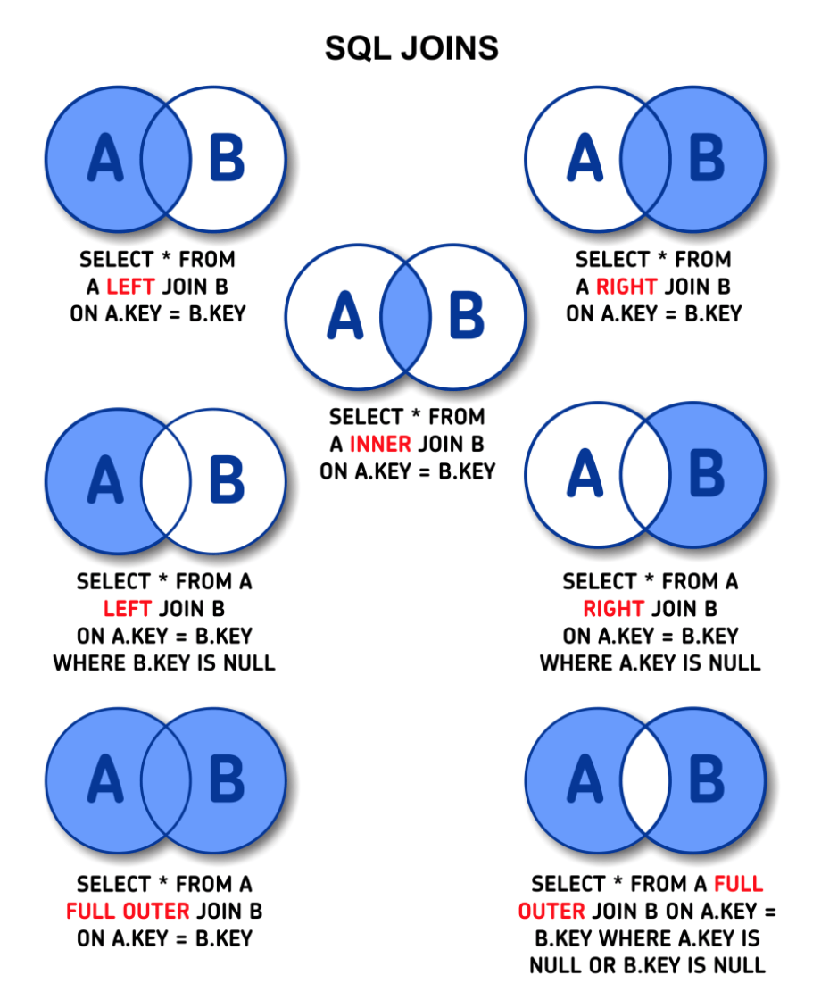
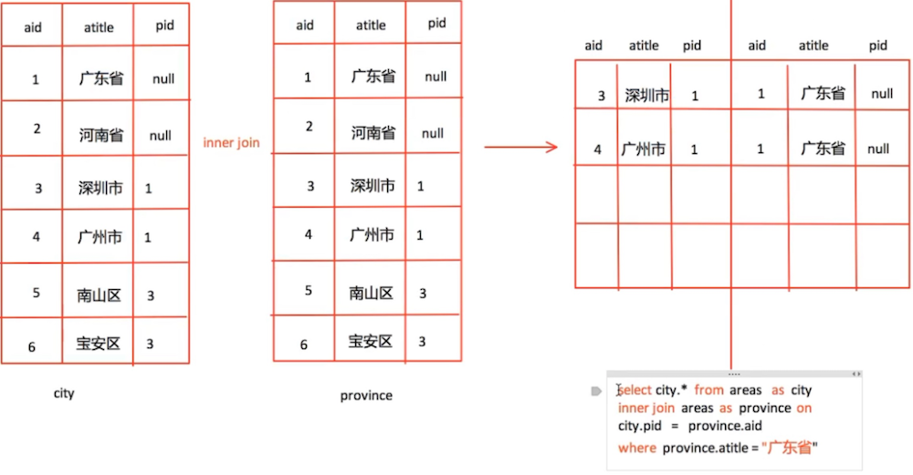

## 03.`MySQL`基础

### 一、SQL语言概述

SQL(Structured Query Language)是结构化查询语言，是一种用来操作RDBMS的数据库的语言。也就是说通过 SQL 可以操作 oracle,sql server,mysql,sqlite 等关系型的数据库。SQL的作用是实现数据库客户端和数据库服务端之间的通信，SQL就是通信的桥梁。

#### 1.`SQL`语言分类

| 名称  | 说明                                                         |
| ----- | ------------------------------------------------------------ |
| `DQL` | 数据查询语言，用于对数据进行查询，如`select`                 |
| `DML` | 数据操作语言，对数据进行增加、修改、删除，如`insert`、`update`、`delete` |
| `TPL` | 事务处理语言，对事务进行处理，包括`begin transaction`、`commit`、`rollback` |
| `DCL` | 数据控制语言，进行授权与权限回收，如`grant`、`revoke`        |
| `DDL` | 数据定义语言，进行数据库、表的管理等，如`create`、`drop`     |

> **SQL语言不区分大小写**，一般情况下，支持SQL语言的数据库我们成为关系型数据库(SQL)，否则称为非关系形数据库(noSQL)；
>
> 对于我们而言，重点是数据的增、删、改、查，必须熟练编写DQL、DML，能够编写DDL完成数据库、表的操作，其它操作如TPL、DCL了解即可。

#### 2.基本系统命令

##### （1）登录与登出

```sh
mysql -u root -p
# -u 后面是登录的用户名
# -p 后面是登录密码, 如果不填写, 回车之后会提示输入密码
# 登出(退出)数据库
quit 或 exit 或 ctrl + d
```

##### （2）查询命令

| 命令                  | 说明               |
| --------------------- | ------------------ |
| `show character set;` | 查看所有字符集     |
| `show collation;`     | 查看所有的排序规则 |
| `show engines;`       | 查看所有的引擎     |
| `show binary logs;`   | 查看所有日志文件   |
| `help`/`?`            | 获取帮助           |

```mysql
# 查看`show`命令的帮助
? show
# 查看有哪些帮助内容
? contents
# 获取函数的帮助
? functions
# 获取数据类型的帮助
? data types
```

##### （3）其他命令

| 命令符号          | 说明                                                         |
| ----------------- | ------------------------------------------------------------ |
| `connect`         | 新建服务器连接                                               |
| `resetconnection` | 重建服务器连接                                               |
| `\c`              | 清空当前输入，在输入错误时，可以及时使用`\c`清空当前输入并重新开始。 |
| `delimiter`       | 默认的终止符是`;`，可以使用该命令修改成其他的字符，例如修改为`$`符号，可以用`delimiter $`命令。 |
| `edit`            | 打开系统默认编辑器，编辑完成保存关闭之后，命令行会自动执行编辑的内容。 |
| `status`          | 查看服务器状态                                               |
| `prompt`          | 修改默认提示符                                               |
| `system`          | 可以将系统命令跟在`system`命令的后面执行，`system`命令也可以缩写为`\!`。 |
| `source`          | `source`命令后面跟 SQL 文件路径可以直接执行 SQL 文件。       |
| `tee` / `notee`   | 重定向输出，可以将命令的输出重定向到指定的文件中。           |
| `warnings`        | 显示警告信息                                                 |

### 二、`DDL`命令-建库建表

#### 1.数据库操作

```sql
# 查看所有数据库
show databases;
-- 如果存在名为school的数据库就删除它
drop database if exists "python";
# 创建数据库:create database 数据库名 charset=utf8mb4;
create database python charset=utf8mb4;

# 使用数据库:use 数据库名;
use python;
# 查看当前使用的数据库
select database();


# 查看创库SQL语句:show create database 数据库名;
show create database python;
# 删除数据库: drop database 数据库名;
drop database python;
```

> 创建和删除数据库时，关键字`database`也可以替换为`schema`，二者作用相同。
>
> 创建数据库时，通过`default character set utf8mb4`指定了数据库默认使用的字符集为`utf8mb4`（最大`4`字节的`utf-8`编码），推荐使用该字符集，它也是 MySQL 8.x 默认使用的字符集，因为它能够支持国际化编码，还可以存储 Emoji 字符。

#### 2.表结构操作

```sql
# 查看当前数据库中所有表
show tables;

# create table 表名(
# 字段名称 数据类型  可选的约束条件,
# column1 datatype contrai,
# ...
# );

-- 创建学院表
create table tb_college(
    col_id int unsigned primary key auto_increment not null comment '编号',
    col_name varchar(20) not null comment '名称',
    col_intro varchar(500) default '' comment '介绍'
) engine=innodb auto_increment=1 comment '学院表';

-- 创建学生表
create table tb_student(
stu_id int unsigned not null comment '学号',
stu_name varchar(20) not null comment '姓名',
stu_sex boolean default 1 not null comment '性别',
stu_birth date not null comment '出生日期',
stu_addr varchar(255) default '' comment '籍贯',
col_id int unsigned not null comment '所属学院',
primary key (stu_id),
constraint fk_student_col_id foreign key (col_id) references tb_college (col_id)
) engine=innodb comment '学生表';

-- 创建教师表
create table tb_teacher(
tea_id int unsigned not null comment '工号',
tea_name varchar(20) not null comment '姓名',
tea_title varchar(10) default '助教' comment '职称',
col_id int unsigned not null comment '所属学院',
primary key (tea_id),
constraint fk_teacher_col_id foreign key (col_id) references tb_college (col_id)
) engine=innodb comment '老师表';

-- 创建课程表
create table tb_course(
cou_id int unsigned not null comment '编号',
cou_name varchar(50) not null comment '名称',
cou_credit int not null comment '学分',
tea_id int unsigned not null comment '授课老师',
primary key (cou_id),
constraint fk_course_tea_id foreign key (tea_id) references tb_teacher (tea_id)
) engine=innodb comment '课程表';

-- 创建选课记录表
create table tb_record(
rec_id bigint unsigned auto_increment comment '选课记录号',
stu_id int unsigned not null comment '学号',
cou_id int unsigned not null comment '课程编号',
sel_date date not null comment '选课日期',
score decimal(4,1) comment '考试成绩',
primary key (rec_id),
constraint fk_record_stu_id foreign key (stu_id) references tb_student (stu_id),
constraint fk_record_cou_id foreign key (cou_id) references tb_course (cou_id),
constraint uk_record_stu_cou unique (stu_id, cou_id)
) engine=innodb comment '选课记录表';

show create table tb_student;
```

```sql
# 修改表-添加字段:alter table 表名 add 列名 类型 约束;
alter table tb_student add birthday datetime;
alter table tb_student add stu_birth datetime;

# 修改表-修改字段类型
alter table tb_student modify birthday date not null;

# 修改表-修改字段名和字段类型:alter table 表名 change 原名 新名 类型及约束;
alter table tb_student change birthday birth datetime not null;

# 修改表-删除字段:alter table 表名 drop 列名;
alter table tb_student drop birthday;

# 查看创表SQL语句:show create table 表名;
show create table tb_student;

# 删除表:drop table 表名;
drop table students;
```

> modify: 只能修改字段类型或者约束，不能修改字段名;
>
> change: 既能对字段重命名又能修改字段类型还能修改约束

扩展阅读，数据表的储存引擎。

### 三、`DML`命令-数据操作

DML 可以帮助将数据插入到二维表（`insert`操作）、从二维表删除数据（`delete`操作）以及更新二维表的数据（`update`操作）。

#### 1.插入数据

`insert`是用来插入行到二维表中的，插入的方式包括：插入完整的行、插入行的一部分、插入多行、插入查询的结果。

```sql
# 添加数据
-- 插入学院数据
# 全列插入：值的顺序与表结构字段的顺序完全一一对应:insert into 表名 values (...)
insert into tb_college values (1, '计算机学院', '计算机学院1958年设立计算机专业，1981年建立计算机科学系，1998年设立计算机学院，2005年5月，为了进一步整合教学和科研资源，学校决定，计算机学院和软件学院行政班子合并统一运作、实行教学和学生管理独立运行的模式。 学院下设三个系：计算机科学与技术系、物联网工程系、计算金融系；两个研究所：图象图形研究所、网络空间安全研究院（2015年成立）；三个教学实验中心：计算机基础教学实验中心、IBM技术中心和计算机专业实验中心。');
# 部分列多行插入:insert into 表名(列1,...) values(值1,...),(值1,...)...;
insert into tb_college (col_name, col_intro) values ('外国语学院', '外国语学院设有7个教学单位，6个文理兼收的本科专业；拥有1个一级学科博士授予点，3个二级学科博士授予点，5个一级学科硕士学位授权点，5个二级学科硕士学位授权点，5个硕士专业授权领域，同时还有2个硕士专业学位（MTI）专业；有教职员工210余人，其中教授、副教授80余人，教师中获得中国国内外名校博士学位和正在职攻读博士学位的教师比例占专任教师的60%以上。'),('经济管理学院', '经济学院前身是创办于1905年的经济科；已故经济学家彭迪先、张与九、蒋学模、胡寄窗、陶大镛、胡代光，以及当代学者刘诗白等曾先后在此任教或学习。');

-- 插入学生数据
# 部分列插入：值的顺序与给出的列顺序对应 : insert into 表名 (列1,...) values(值1,...)
insert into tb_student (stu_id, stu_name, stu_sex, stu_birth, col_id) values (2035, '东方不败', 1, '1988-6-30', 2);
# 全列多行插入:insert into 表名 values(...),(...)...;
insert into tb_student 
(stu_id, stu_name, stu_sex, stu_birth, stu_addr, col_id)
values 
    (1001, '杨过', 1, '1990-3-4', '湖南长沙', 1),
    (1002, '任我行', 1, '1992-2-2', '湖南长沙', 1),
    (1033, '王语嫣', 0, '1989-12-3', '四川成都', 1),
    (1572, '岳不群', 1, '1993-7-19', '陕西咸阳', 1),
    (1378, '纪嫣然', 0, '1995-8-12', '四川绵阳', 1),
    (1954, '林平之', 1, '1994-9-20', '福建莆田', 1),
    (3011, '林震南', 1, '1985-12-12', '福建莆田',3),
    (3755, '项少龙', 1, '1993-1-25', '四川成都', 3),
    (3923, '杨不悔', 0, '1985-4-17', '四川成都', 3);

-- 插入老师数据
insert into tb_teacher 
    (tea_id, tea_name, tea_title, col_id) 
values 
    (1122, '张三丰', '教授', 1),
    (1133, '宋远桥', '副教授', 1),
    (1144, '杨逍', '副教授', 1),
    (2255, '范遥', '副教授', 2),
    (3366, '韦一笑', default, 3);

-- 插入课程数据
insert into tb_course 
    (cou_id, cou_name, cou_credit, tea_id) 
values 
    (1111, 'Python程序设计', 3, 1122),
    (2222, 'Web前端开发', 2, 1122),
    (3333, '操作系统', 4, 1122),
    (4444, '计算机网络', 2, 1133),
    (5555, '编译原理', 4, 1144),
    (6666, '算法和数据结构', 3, 1144),
    (7777, '经贸法语', 3, 2255),
    (8888, '成本会计', 2, 3366),
    (9999, '审计学', 3, 3366);

# 推荐使用如下批处理的方式插入数据，这种做法插入数据的效率比较高。
-- 插入选课数据
insert into tb_record 
    (stu_id, cou_id, sel_date, score) 
values 
    (1001, 1111, '2017-09-01', 95),
    (1001, 2222, '2017-09-01', 87.5),
    (1001, 3333, '2017-09-01', 100),
    (1001, 4444, '2018-09-03', null),
    (1001, 6666, '2017-09-02', 100),
    (1002, 1111, '2017-09-03', 65),
    (1002, 5555, '2017-09-01', 42),
    (1033, 1111, '2017-09-03', 92.5),
    (1033, 4444, '2017-09-01', 78),
    (1033, 5555, '2017-09-01', 82.5),
    (1572, 1111, '2017-09-02', 78),
    (1378, 1111, '2017-09-05', 82),
    (1378, 7777, '2017-09-02', 65.5),
    (2035, 7777, '2018-09-03', 88),
    (2035, 9999, '2019-09-02', null),
    (3755, 1111, '2019-09-02', null),
    (3755, 8888, '2019-09-02', null),
    (3755, 9999, '2017-09-01', 92);
```

> 主键列是自动增长，但是在全列插入时需要占位，通常使用空值(0或者null或者default)；
>
> 在全列插入时，如果字段列有默认值可以使用 default 来占位，插入后的数据就是之前设置的默认值
>
> 在插入数据时，要注意主键是不能重复的，如果插入的数据与表中已有记录主键相同，那么`insert`操作将会产生 Duplicated Entry 的报错信息。再次提醒大家，如果`insert`操作省略了某些列，那么这些列要么有默认值，要么允许为`null`，否则也将产生错误。在业务系统中，为了让`insert`操作不影响其他操作（主要是后面要讲的`select`操作）的性能，可以在`insert`和`into`之间加一个`low_priority`来降低`insert`操作的优先级，这个做法也适用于下面要讲的`delete`和`update`操作。

#### 2.修改数据

如果要修改表中的数据，可以使用`update`操作，它可以用来删除指定的行或所有的行。

```sql
# 修改数据: update 表名 set 列1=值1,列2=值2... where 条件
update tb_record set score = 59 where stu_id=2035 and cou_id=9999;
# 同时修改课程的得分和日期
update tb_record set score = 89,sel_date='2024-01-23' where stu_id=3755 and cou_id=8888;
```

> 上面的`update`操作中的`where`子句是用来指定条件的，只有满足条件的行会被删除。where语句后续将进一步学习。这里要注意`where`语句的条件使用的时具有唯一值的`id`字段，限制条件，如果使用姓名字段，则可能会一次更新多条数据。
>
> 还有一个需要注意的地方是`update`操作中的`set`关键字，因为 SQL 中的`=`并不表示赋值，而是判断相等的运算符，只有出现在`set` 关键字后面的`=`，才具备赋值的能力。

#### 3.删除数据

如果需要从表中删除数据，可以使用`delete`操作，它可以帮助我们删除指定行或所有行。

```sql
# 删除数据:delete from 表名 where 条件
insert into tb_student 
(stu_id, stu_name, stu_sex, stu_birth, col_id) 
values 
(1003, '黄蓉', 0, '1955-12-30', 3),
(1004, '杨超越', 0, '1995-05-10', 1),
(1005, '杨超越', 0, '1997-11-11', 2),
(1006, '杨超越', 0, '1999-02-28', 3),
(1086, '杨飞', 1, '1988-07-11', 2);
delete from tb_student where stu_id=1003;
# 上面的操作称之为物理删除，一旦删除就不容易恢复，我们可以使用逻辑删除的方式来解决这个问题。

-- 添加删除表示字段，0表示未删除 1表示删除
alter table tb_student add isdelete bit default 0;
-- 逻辑删除数据
update tb_student set isdelete = 1 where stu_id=1086;
```

>  `delete`操作不会删除表本身，只会删除表内的数据，其中的自增AUTO_INCREMENT 字段的值并不会回到初始值，如果需要更新自增字段，可以用 `truncate table`截断表操作，`truncate`的本质是删除原来的表并重新创建一个表，它的速度其实更快，因为不需要逐行删除数据，但是用`truncate table`删除数据是非常危险的，因为它删除后无法恢复。
>
> 逻辑删除本质是修改操作

四、`DQL`命令-数据查询

#### 1.基本查询

```sql
# 查询数据
-- 1. 查询所有列:select * from 表名;
select * from tb_student;
-- 2. 查询指定列:select 列1,列2,... from 表名;
-- 查询学生的学号、姓名和籍贯(投影)
select stu_id, stu_name, stu_addr from tb_student;
-- 查询所有课程的名称及学分(投影和别名)
select cou_name as 课程名称, cou_credit as 学分 from tb_course;

# 多表查询时，可以通过 表名.字段名 的方式
select tb_student.stu_id,tb_student.stu_name,tb_student.stu_sex,tb_record.score from tb_student,tb_record;
-- 查询学生的姓名、生日和所在学院名称
select stu_name, stu_birth, col_name from tb_student, tb_college where tb_student.col_id=tb_college.col_id;
```

#### 2.常用关键字

##### （1）`as`关键字

在使用SQL语句显示结果的时候，往往在屏幕显示的字段名并不具备良好的可读性，此时可以使用 as 给字段/数据表起一个别名。

```sql
# 使用 as 给字段起别名
select id as 序号, name as 名字, gender as 性别 from students;
-- 可以通过 as 给表起别名
select s.stu_id,s.stu_name, s.stu_birth from tb_student as s;
```

> 给表起别名看起来并没有什么意义，在后期学习 自连接 的时候，必须要对表起别名。

##### （2）`distinct`关键字

`distinct`关键字可以去除重复数据行。

```sql
# select distinct 列1,... from 表名;
select distinct stu_name  from tb_student;
-- 查询学生选课的所有日期(去重)
select distinct sel_date from tb_record;
```

##### （3）`where`关键字

MySQL 中支持多种类型的运算符，包括：算术运算符（`+`、`-`、`*`、`/`、`%`）、比较运算符（`=`、`<>`、`<=>`、`<`、`<=`、`>`、`>=`、`BETWEEN...AND..`.、`IN`、`IS NULL`、`IS NOT NULL`、`LIKE`、`RLIKE`、`REGEXP`）、逻辑运算符（`NOT`、`AND`、`OR`、`XOR`）和位运算符（`&`、`|`、`^`、`~`、`>>`、`<<`），我们可以在 DML 中使用这些运算符处理数据。

使用where条件查询可以对表中的数据进行筛选，条件成立的记录会出现在结果集中。

```sql
# 语法：select * from 表名 where 条件;
select * from tb_student where stu_sex=0;
-- 查询籍贯为“四川成都”或者性别为“女生”的学生
select stu_name, stu_birth from tb_student where stu_sex=0 or stu_addr='四川成都';
```

| where语句支持的运算符 |                                                              |
| --------------------- | ------------------------------------------------------------ |
| 比较运算符            | 等于` =`/大于等于`>=`/小于`<`/小于等于`<=`/不等于`!=`或`<>`  |
| 逻辑运算符            | `and`/`or`/`not`                                             |
| 模糊查询              | 模糊查询关键字`like`/任意多个任意字符`%`/任意一个字符`_`     |
| 范围查询              | 表示在一个连续的范围内查询`between .. and ..`/在一个非连续的范围内查询`in` |
| 空判断                | 为空`is null`/非空`is not null`                              |

```sql
# 比较运算符查询
select * from tb_student where stu_id > 2000;  # 查询编号大于2000的学生
select * from tb_student where stu_id <= 1500;  # 查询编号不大于1500的学生
select * from tb_student where stu_name != '杨飞';  # 查询姓名不是“黄蓉”的学生
select * from tb_student where isdelete=0;  # 查询没被删除的学生

# 逻辑运算符查询
select * from tb_student where stu_id > 3000 and stu_sex=0;  # 查询编号大于3000的女同学
select * from tb_student where stu_id< 4000 or isdelete=0;  # 查询编号小于4000或没被删除的学生
select * from tb_student where not (stu_id< 3000 or isdelete=1);
-- 查询所有80后学生的姓名、性别和出生日期(筛选)
select stu_name, stu_sex, stu_birth from tb_student where stu_birth>='1980-1-1' and stu_birth<='1989-12-31';
-- 查询学分是奇数的课程的名称和学分(筛选)
select cou_name, cou_credit from tb_course where cou_credit%2<>0;
select cou_name, cou_credit from tb_course where cou_credit mod 2<>0;

-- 查询选择选了1111的课程考试成绩在90分以上的学生学号(筛选)
select stu_id from tb_record where cou_id=1111 and score>90;

-- 补充：将表示性别的 1 和 0 处理成 “男” 和 “女”
select 
    stu_name as 姓名, 
    if(stu_sex, '男', '女') as 性别, 
    stu_birth as 出生日期
from tb_student 
where stu_birth between '1980-1-1' and '1989-12-31';

select 
    stu_name as 姓名, 
    case stu_sex when 1 then '男' else '女' end as 性别, 
    stu_birth as 出生日期
from tb_student 
where stu_birth between '1980-1-1' and '1989-12-31';


# 模糊查询
select * from tb_student where stu_name like '杨%';  # 查询姓杨的学生
select * from tb_student where stu_name like '杨_';  # 查询姓杨并且“名”是一个字的学生
select * from tb_student where stu_name like '杨%' or stu_name like '%败';  # 查询姓杨或叫败的学生
-- 查询名字中有“不”字或“嫣”字的学生的姓名(模糊)
select stu_name from tb_student where stu_name like '%不%' or stu_name like '%嫣%';
-- 查询姓“杨”或姓“林”名字三个字的学生的姓名(正则表达式模糊查询)
select stu_name from tb_student where stu_name regexp '[杨林].{2}';
# 范围查询
select * from tb_student where stu_id between 1 and 2000;  # 查询编号为1至2000的学生
select * from tb_student where (not stu_id between 1 and 2000) and stu_sex=1;  # 查询编号不是1至2000的男生
select * from tb_student where  stu_addr in ('湖南长沙','福建莆田');

# 空判断查询
select * from tb_student where stu_addr is null;  # 查询没有填写身高的学生

```

> 不能使用 `where height = null `判断为空，也不能使用 `where height != null `判断非空。
>
> null 不等于 '' 空字符串

##### （4）`order`关键字

排序查询语法：先按照列1进行排序，如果列1的值相同时，则按照 列2 排序，以此类推，`asc`与`desc`任选一，分别代表从小到大排列(升序)与从大到小排序（降序），默认按照列值从小到大排列，即`asc`。

```sql
select * from 表名 order by 列1 asc|desc [,列2 asc|desc,...]
```

```sql
# 查询未删除男生信息，按学号降序
select * from tb_student where stu_sex=1 and isdelete=0 order by stu_id desc;
# 显示所有的学生信息，先按照班级从大-->小排序，当班级相同时 按照学号从高-->矮排序
select * from tb_student order by  col_id desc,stu_id desc;
-- 查询男学生的姓名和生日按年龄从大到小排列(排序)
select stu_id, stu_name, stu_birth from tb_student where stu_sex=1 order by stu_birth asc, stu_id desc;

-- 补充：将上面的生日换算成年龄(日期函数、数值函数)
select 
    stu_id as 学号,
    stu_name as 姓名, 
    floor(datediff(curdate(), stu_birth)/365) as 年龄
from tb_student 
where stu_sex=1 order by 年龄 desc, stu_id desc;
```

##### （5）`limit`关键字

数据查询时，有时候数据量太大，全部集中到一页不仅看起来不方便，而且给系统性能增加了压力，这时可以选择分页查询。

查询语法：`limit`是分页查询关键字，`start`表示开始行索引，默认是0，`count`表示查询条数。

```sql
select * from 表名 limit start,count
```

```sql
# 查询前3行男生信息
select * from tb_student where stu_sex=1 limit 0,3;
select * from tb_student where stu_sex=1 limit 3;

-- 查询学生姓名、课程名称以及成绩(连接查询/联结查询),结果取第11-15条数据(分页查询)
select stu_name, cou_name, score 
from tb_student, tb_course, tb_record 
where tb_student.stu_id=tb_record.stu_id 
and tb_course.cou_id=tb_record.cou_id 
and score is not null 
order by score desc 
limit 5 offset 10;

# 查询学生表，获取第n页数据
select * from tb_student limit (n-1)*m,m
```

#### 3.条件查询

##### （1）聚合函数

聚合函数又叫组函数，通常是对表中的数据进行统计和计算，一般结合分组(group by)来使用，用于统计和计算分组数据，常用的聚合函数如下表：

常用字符串函数。

| 函数                        | 功能                                                  |
| --------------------------- | ----------------------------------------------------- |
| `CONCAT`                    | 将多个字符串连接成一个字符串                          |
| `FORMAT`                    | 将数值格式化成字符串并指定保留几位小数                |
| `FROM_BASE64` / `TO_BASE64` | BASE64解码/编码                                       |
| `BIN` / `OCT` / `HEX`       | 将数值转换成二进制/八进制/十六进制字符串              |
| `LOCATE`                    | 在字符串中查找一个子串的位置                          |
| `LEFT` / `RIGHT`            | 返回一个字符串左边/右边指定长度的字符                 |
| `LENGTH` / `CHAR_LENGTH`    | 返回字符串的长度以字节/字符为单位                     |
| `LOWER` / `UPPER`           | 返回字符串的小写/大写形式                             |
| `LPAD` / `RPAD`             | 如果字符串的长度不足，在字符串左边/右边填充指定的字符 |
| `LTRIM` / `RTRIM`           | 去掉字符串前面/后面的空格                             |
| `ORD` / `CHAR`              | 返回字符对应的编码/返回编码对应的字符                 |
| `STRCMP`                    | 比较字符串，返回-1、0、1分别表示小于、等于、大于      |
| `SUBSTRING`                 | 返回字符串指定范围的子串                              |

常用数值函数。

| 函数                                                     | 功能                               |
| -------------------------------------------------------- | ---------------------------------- |
| `ABS`                                                    | 返回一个数的绝度值                 |
| `CEILING` / `FLOOR`                                      | 返回一个数上取整/下取整的结果      |
| `CONV`                                                   | 将一个数从一种进制转换成另一种进制 |
| `CRC32`                                                  | 计算循环冗余校验码                 |
| `EXP` / `LOG` / `LOG2` / `LOG10`                         | 计算指数/对数                      |
| `POW`                                                    | 求幂                               |
| `RAND`                                                   | 返回[0,1)范围的随机数              |
| `ROUND`                                                  | 返回一个数四舍五入后的结果         |
| `SQRT`                                                   | 返回一个数的平方根                 |
| `TRUNCATE`                                               | 截断一个数到指定的精度             |
| `SIN` / `COS` / `TAN` / `COT` / `ASIN` / `ACOS` / `ATAN` | 三角函数                           |

常用时间日期函数。

| 函数                          | 功能                                  |
| ----------------------------- | ------------------------------------- |
| `CURDATE` / `CURTIME` / `NOW` | 获取当前日期/时间/日期和时间          |
| `ADDDATE` / `SUBDATE`         | 将两个日期表达式相加/相减并返回结果   |
| `DATE` / `TIME`               | 从字符串中获取日期/时间               |
| `YEAR` / `MONTH` / `DAY`      | 从日期中获取年/月/日                  |
| `HOUR` / `MINUTE` / `SECOND`  | 从时间中获取时/分/秒                  |
| `DATEDIFF` / `TIMEDIFF`       | 返回两个时间日期表达式相差多少天/小时 |
| `MAKEDATE` / `MAKETIME`       | 制造一个日期/时间                     |

常用流程函数。

| 函数     | 功能                                             |
| -------- | ------------------------------------------------ |
| `IF`     | 根据条件是否成立返回不同的值                     |
| `IFNULL` | 如果为NULL则返回指定的值否则就返回本身           |
| `NULLIF` | 两个表达式相等就返回NULL否则返回第一个表达式的值 |

其他常用函数。

| 函数                       | 功能                          |
| -------------------------- | ----------------------------- |
| `MD5` / `SHA1` / `SHA2`    | 返回字符串对应的哈希摘要      |
| `CHARSET` / `COLLATION`    | 返回字符集/校对规则           |
| `USER` / `CURRENT_USER`    | 返回当前用户                  |
| `DATABASE`                 | 返回当前数据库名              |
| `VERSION`                  | 返回当前数据库版本            |
| `FOUND_ROWS` / `ROW_COUNT` | 返回查询到的行数/受影响的行数 |
| `LAST_INSERT_ID`           | 返回最后一个自增主键的值      |
| `UUID` / `UUID_SHORT`      | 返回全局唯一标识符            |

```sql
# 求总行数：count
select count(stu_name) from tb_student;  -- 返回非NULL数据的总行数.
select count(*) from tb_student;  -- 返回总行数，包含null值记录;


# 求最大值：max
select max(score) from tb_record where cou_id=1111;  -- 查询1111科目下的分数最大值
-- 查询编号为1111的课程考试成绩的最高分(聚合函数)
select max(score) from tb_record where cou_id=1111;
-- 查询年龄最大的学生的出生日期(聚合函数)
select min(stu_birth) from tb_student;

# 求和：sum
select sum(score) from tb_record where cou_id=2222;  -- 查询科目的2222的总分
select sum(score) / count(*) from tb_record where cou_id= 4444;  -- 平均分
# 求平均值：avg
select avg(score) from tb_record where cou_id= 4444;  -- 求科目4444的平均分, 聚合函数不统计null值，平均身高有误
select avg(ifnull(score,0)) from tb_record where cou_id= 4444;  -- 求科目4444的平均分, 包含身高是null的\

-- 查询学号为1001的学生考试成绩的标准差(聚合函数)
select std(score), variance(score) from tb_record where stu_id=1001;
```

> `ifnull`函数: 表示判断指定字段的值是否为`null`，如果为空使用自己提供的值。
>
> 聚合函数默认忽略字段为null的记录 要想列值为null的记录也参与计算，必须使用`ifnull`函数对`null`值做替换。

##### （2）分组查询

分组查询就是将查询结果按照指定字段进行分组，字段中数据相等的分为一组。

```sql
GROUP BY 列名 [HAVING 条件表达式] [WITH ROLLUP]
# 列名指是指按照指定字段的值进行分组
# HAVING 条件表达式: 用来过滤分组后的数据
# WITH ROLLUP：在所有记录的最后加上一条记录，显示select查询时聚合函数的统计和计算结果
```

- `group by`可用于单个字段分组，也可用于多个字段分组

```sql
-- 查询男女学生的人数(分组和聚合函数)
select 
    case stu_sex when 1 then '男' else '女' end as 性别,
    count(*) as 人数
from tb_student group by stu_sex;

-- 查询每个学院男女学生人数(分组和聚合函数)
select col_id as 学院, if(stu_sex, '男', '女') as 性别, count(*) as 人数 from tb_student group by col_id, stu_sex;

-- 查询每个学生的学号和平均成绩(分组和聚合函数)
select stu_id, round(avg(score), 1) as avg_score from tb_record group by stu_id;
```

- `group by` + `group_concat()`的使用

```sql
# group_concat(字段名): 统计每个分组指定字段的信息集合，每个信息之间使用逗号进行分割
-- 根据stu_addr字段进行分组， 查询stu_addr字段和分组的stu_name字段信息
select stu_addr,group_concat(stu_name) from tb_student group by stu_addr;
```

- group by + 聚合函数的使用

```sql
-- 统计不同科目的人的平均成绩
select cou_id,avg(score) from tb_record group by cou_id;
-- 统计不同性别的人的个数
select stu_sex,count(*) from tb_student group by stu_sex;
```

- group by + having的使用

```sql
# having作用和where类似都是过滤数据的，但having是过滤分组数据的，只能用于group by
-- 根据科目字段进行分组，统计分组条数大于1的
select cou_id,count(*) from tb_record group by cou_id having count(*)>1;

-- 查询平均成绩大于等于90分的学生的学号和平均成绩
-- 分组以前的筛选使用where子句，分组以后的筛选使用having子句
select  stu_id, round(avg(score), 1) as avg_score from tb_record group by stu_id having avg_score>=90;
-- 查询1111、2222、3333三门课程平均成绩大于等于90分的学生的学号和平均成绩
select 
    stu_id, 
    round(avg(score), 1) as avg_score
from tb_record where cou_id in (1111, 2222, 3333)
group by stu_id having avg_score>=90;
```

- group by + with rollup的使用

```sql
# with rollup的作用是：在最后记录后面新增一行，显示select查询时聚合函数的统计和计算结果
-- 根据stu_sex字段进行分组，汇总总人数
select stu_sex,count(*) from tb_student group by stu_sex with rollup;
-- 根据学号字段进行分组，汇总所有人的成绩
select stu_id,group_concat(score) from tb_record group by stu_id with rollup;

-- 查询每个学院学生人数(分组和聚合函数)
select col_id as 学院, count(*) as 人数 from tb_student group by col_id with rollup;
```

##### （3）连接查询

连接查询可以实现多个表的查询，当查询的字段数据来自不同的表就可以使用连接查询来完成，连接查询可以分为:内连接查询、左连接查询、右连接查询和自连接查询。



- 内连接查询

`inner join...on`查询两个表中符合条件的共有记录，其中`on`引出两个表的连接查询条件。


```sql
# select 字段 from 表1 inner join 表2 on 表1.字段1 = 表2.字段2
# 使用内连接查询课程表与得分表
select * from tb_course as c inner join tb_record as r on c.cou_id = r.cou_id;
select * from tb_course inner join tb_record  on tb_course.cou_id = tb_record.cou_id;

select stu_name, stu_birth, col_name from tb_student inner join tb_college 
on tb_student.col_id=tb_college.col_id;

select stu_name, stu_birth, col_name from tb_student natural join tb_college;

-- 查询学生姓名、课程名称以及成绩(连接查询/联结查询)
select stu_name, cou_name, score 
from tb_student, tb_course, tb_record 
where tb_student.stu_id=tb_record.stu_id 
and tb_course.cou_id=tb_record.cou_id 
and score is not null;

select stu_name, cou_name, score from tb_student 
inner join tb_record on tb_student.stu_id=tb_record.stu_id 
inner join tb_course on tb_course.cou_id=tb_record.cou_id 
where score is not null;

select stu_name, cou_name, score from tb_student 
natural join tb_record 
natural join tb_course
where score is not null;

-- 查询选课学生的姓名和平均成绩(子查询和连接查询)
select stu_name, avg_score 
from tb_student inner join (
    select stu_id as sid, round(avg(score), 1) as avg_score 
    from tb_record group by stu_id
) as t2 on stu_id=sid;

-- 查询学生的姓名和选课的数量
select stu_name, total from tb_student as t1
inner join (
    select stu_id, count(*) as total
    from tb_record group by stu_id
) as t2 on t1.stu_id=t2.stu_id;
```

- 左连接查询

`left join...on`以左表为主根据条件查询右表数据，如果根据条件查询右表数据不存在使用null值填充，其中`on`引出连接查询条件


```sql
# select 字段 from 表1 left join 表2 on 表1.字段1 = 表2.字段2
# 使用左连接查询课程表与得分表
select * from tb_course as c left join tb_record as r on c.cou_id = r.cou_id;

-- 查询每个学生的姓名和选课数量(左外连接和子查询)
-- 左外连接：左表（写在join左边的表）的每条记录都可以查出来，不满足连表条件的地方填充null。
select stu_name, coalesce(total, 0) as total
from tb_student as t1
left outer join (
    select stu_id, count(*) as total
    from tb_record group by stu_id
) as t2 on t1.stu_id=t2.stu_id;
```

- 右连接查询

`right join...on`以右表为主根据条件查询左表数据，如果根据条件查询左表数据不存在使用null值填充，其中`on`引出连接查询条件


```sql
# select 字段 from 表1 right join 表2 on 表1.字段1 = 表2.字段2
# 使用右连接查询课程表与得分表
select * from tb_course as c right join tb_record as r on c.cou_id = r.cou_id;

-- 修改选课记录表，去掉 stu_id 列的外键约束
alter table tb_record drop foreign key fk_record_stu_id;

-- 插入两条新纪录（注意：没有学号为 5566 的学生）
insert into tb_record 
values
    (default, 5566, 1111, '2019-09-02', 80),
    (default, 5566, 2222, '2019-09-02', 70);

-- 右外连接：右表（写在join右边的表）的每条记录都可以查出来，不满足连表条件的地方填充null。
select stu_name, total from tb_student as t1
right outer join (
    select stu_id, count(*) as total
    from tb_record group by stu_id
) as t2 on t1.stu_id=t2.stu_id;

-- 全外连接：左表和右表的每条记录都可以查出来，不满足连表条件的地方填充null。
-- 说明：MySQL不支持全外连接，所以用左外连接和右外连接的并集来表示。
select stu_name, total
from tb_student as t1
left outer join (
    select stu_id, count(*) as total
    from tb_record group by stu_id
) as t2 on t1.stu_id=t2.stu_id
union 
select stu_name, total from tb_student as t1
right outer join (
    select stu_id, count(*) as total
    from tb_record group by stu_id
) as t2 on t1.stu_id=t2.stu_id;
```

- 自连接查询

自连接查询就是把一张表模拟成左右两张表，然后进行根据连接查询条件连接查询两个表中的数据。



```sql

# 查询省的名称为“山西省”的所有城市
select c.id, c.title, c.pid, p.title from areas as c inner join areas as p on c.pid = p.id  where p.title = '山西省';
```

> 自连接查询必须对表起别名

##### （4）子查询

在一个 select 语句中,嵌入了另外一个 select 语句, 那么被嵌入的 select 语句称之为子查询语句，外部那个select语句则称为主查询。

主查询和子查询的关系:

- 子查询是嵌入到主查询中
- 子查询是辅助主查询的,要么充当条件,要么充当数据源
- 子查询是可以独立存在的语句,是一条完整的 select 语句

```sql
-- 查询年龄最大的学生的姓名(子查询/嵌套查询)
-- 嵌套查询：把一个select的结果作为另一个select的一部分来使用
select stu_name from tb_student where stu_birth=(
    select min(stu_birth) from tb_student
);

-- 查询选了两门以上的课程的学生姓名(子查询/分组条件/集合运算)
select stu_name from tb_student 
where stu_id in (
    select stu_id from tb_record group by stu_id having count(*)>2
);
```

##### （5）外键约束

外键约束:对外键字段的值进行更新和插入时会和引用表中字段的数据进行验证，数据如果不合法则更新和插入会失败，保证数据的有效性。

- 对于已经存在的字段添加外键约束

```sql
-- 为cls_id字段添加外键约束
alter table students add foreign key(cls_id) references classes(id);
```

- 在创建数据表时设置外键约束

```sql
-- 创建学校表
create table school(
    id int not null primary key auto_increment, 
    name varchar(10)
);

-- 创建老师表
create table teacher(
    id int not null primary key auto_increment, 
    name varchar(10), 
    s_id int not null, 
    foreign key(s_id) references school(id)
);
```

- 删除外键约束

```sql
-- 需要先获取外键约束名称,该名称系统会自动生成,可以通过查看表创建语句来获取名称
show create table teacher;

-- 获取名称之后就可以根据名称来删除外键约束
alter table teacher drop foreign key 外键名;
```

### 五、`DCL`命令-权限管理

数据库服务器通常包含了非常重要的数据，可以通过访问控制来确保这些数据的安全。DCL主要用于对用户权限的管理，可以通过 DCL 允许受信任的用户访问数据库，阻止不受信任的用户访问数据库，同时还可以通过 DCL 将每个访问者的的权限最小化（让访问者的权限刚刚够用）。

#### 1.创建用户

```sql
# 创建一个用户并为其指定访问口令。
create user 'wangdachui'@'%' identified by 'Wang.618';
```

用户`wangdachui`可以通过访问口令`Wang.618`从任意主机访问数据库服务器，因为`@ `后面使用了可以表示任意多个字符的通配符 `%`。

```sql
drop user if exists 'wangdachui'@'%';
# 限制 wangdachui 这个用户只能从 192.168.0.x 这个网段的主机访问数据库服务器
create user 'wangdachui'@'192.168.0.%' identified by 'Wang.618';
```

#### 2.授予权限

```sql
# 授予`wangdachui `查询 school 数据库下学院表（`tb_college`）的权限。
grant select on `school`.`tb_college` to 'wangdachui'@'192.168.0.%';
# 授予`wangdachui `查询 school 数据库下 所有表的权限
grant select on `school`.* to 'wangdachui'@'192.168.0.%';
# 授予`wangdachui ` 对school 数据库下所有表 具有select、 insert、delete 和 update 权限
grant insert, delete, update on `school`.* to 'wangdachui'@'192.168.0.%';
# 授予`wangdachui对school 数据库 下所有表具有DDL 的权限
grant create, drop, alter on `school`.* to 'wangdachui'@'192.168.0.%';
# 希望 wangdachui 账号对所有数据库的所有对象都具备所有的操作权限
grant all privileges on *.* to 'wangdachui'@'192.168.0.%';
```

#### 3.找回权限

```sql
# 召回 wangdachui 对 school 数据库的 insert、delete 和 update 权限
revoke insert, delete, update on `school`.* from 'wangdachui'@'192.168.0.%';
# 召回所有的权限
revoke all privileges on *.* from 'wangdachui'@'192.168.0.%';
# 授予或召回权限后需要执行下面的语句使新的权限即时生效。
flush privileges;
```

