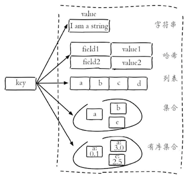
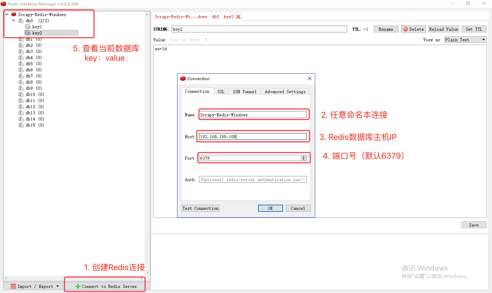
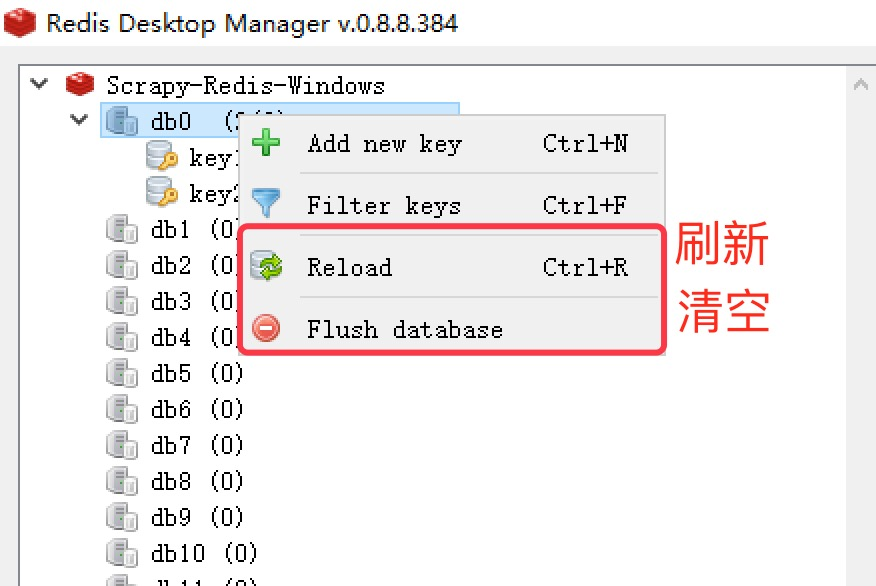

## 01.Redis概述

Redis是一种基于键值对的NoSQL数据库，Redis将数据放在内存中，因此读写性能是非常惊人的。与此同时，Redis也提供了持久化机制，能够将内存中的数据保存到硬盘上，在发生意外状况时数据也不会丢掉。此外，Redis还支持键过期、地理信息运算、发布订阅、事务、管道、Lua脚本扩展等功能，总而言之，Redis的功能和性能都非常强大，如果项目中要实现高速缓存和消息队列这样的服务，直接交给Redis就可以了。目前，国内外很多著名的企业和商业项目都使用了Redis，包括：Twitter、Github、StackOverflow、新浪微博、百度、优酷土豆、美团、小米、唯品会等。

### 一、Redis简介

Redis是REmote DIctionary Server的缩写，它是一个用ANSI C编写的高性能的key-value存储系统，它提供了对多种数据类型（字符串、哈希、列表、集合、有序集合、位图等）的支持，能够满足很多应用场景的需求。

#### 1.Redis的优点

- Redis的读写性能极高，并且有丰富的特性（发布/订阅、事务、通知等）。
- Redis支持数据的持久化（RDB和AOF两种方式），可以将内存中的数据保存在磁盘中，重启的时候可以再次加载进行使用。
- Redis支持多种数据类型，包括：string、hash、list、set，zset、bitmap、hyperloglog等。
- Redis支持主从复制（实现读写分析）以及哨兵模式（监控master是否宕机并自动调整配置）。
- Redis支持分布式集群，可以很容易的通过水平扩展来提升系统的整体性能。
- Redis基于TCP提供的可靠传输服务进行通信，很多编程语言都提供了Redis客户端支持。

#### 2.Redis的应用场景

- 高速缓存  - 将不常变化但又经常被访问的热点数据放到Redis数据库中，可以大大降低关系型数据库的压力，从而提升系统的响应性能。
- 排行榜 - 很多网站都有排行榜功能，利用Redis中的列表和有序集合可以非常方便的构造各种排行榜系统。
- 商品秒杀/投票点赞 - Redis提供了对计数操作的支持，网站上常见的秒杀、点赞等功能都可以利用Redis的计数器通过+1或-1的操作来实现，从而避免了使用关系型数据的`update`操作。
- 分布式锁 - 利用Redis可以跨多台服务器实现分布式锁（类似于线程锁，但是能够被多台机器上的多个线程或进程共享）的功能，用于实现一个阻塞式操作。
- 消息队列 - 消息队列和高速缓存一样，是一个大型网站不可缺少的基础服务，可以实现业务解耦和非实时业务削峰等特性，这些我们都会在后面的项目中为大家展示。

#### 3.Redis的数据类型

Redis有着非常丰富的数据类型，也有很多的命令来操作这些数据，具体的内容可以查看[Redis命令参考](http://redisdoc.com/)，在这个网站上，除了Redis的命令参考，还有Redis的详细文档，其中包括了通知、事务、主从复制、持久化、哨兵、集群等内容。



### 二、Redis的安装和配置

可以使用Linux系统的包管理工具（如yum）来安装Redis，也可以通过在Redis的[官方网站](https://redis.io/)下载Redis的源代码，解压缩解归档之后通过make工具对源代码进行构建并安装。

#### 1.Redis安装

#### （1）unix系统安装

make工具安装

```sh
# 下载
wget https://download.redis.io/releases/redis-5.0.10.tar.gz
# 解压缩和解归档
tar -zxf redis-5.0.10.tar.gz
# 移动到合适位置
sudo mv ./redis-6.0.9 /usr/local/redis
# 进入Redis源代码
cd /usr/local/redis
# 构建和安装
make && make install
```

对于Ubuntu而言，只需要在终端依次输入以下命令，如果过程中没有错误提示，则redis安装完成。

```sh
sudo apt install lsb-release curl gpg
curl -fsSL https://packages.redis.io/gpg | sudo gpg --dearmor -o /usr/share/keyrings/redis-archive-keyring.gpg
echo "deb [signed-by=/usr/share/keyrings/redis-archive-keyring.gpg] https://packages.redis.io/deb $(lsb_release -cs) main" | sudo tee /etc/apt/sources.list.d/redis.list
sudo apt-get update
sudo apt-get install redis
```

安装完毕后，在终端输入`redis-cli`，该工具默认连接本机的`6379`端口，如果需要指定Redis服务器和端口，可以使用`-h`和`-p`参数分别进行指定。如果会进入到redis的命令行模式，则说明安装成功。

```
redis-cli 
exit  # 输入exit退出
```

可以通过`ps`或者`netstat`来检查Redis服务器是否启动成功。

```
ps -ef | grep redis-server
netstat -nap | grep redis-server
```

#### （2）windows下安装

`windows`下不支持最新的`redis`，存在一个别人编译后的老版本`redis`，直接下一步安装即可。

`windows`下安装完毕后，`redis`并不能直接启动，需要在安装文件夹启动，默认安装在。进入该目录下执行命令：

```python
# 启动redis服务
redis-server.exe redis.windows.conf

# 将redis添加为系统服务
redis-server --service-install redis.windows-service.conf --loglevel verbose

# 启动服务/停止服务
redis-server --service-start
redis-server --service-stop

# 进入 redis 服务，
redis-cli.exe -p 6379
```

#### 2.修改配置文件

如果通过源码安装，则`unix`下配置文件在源代码目录下`redis.conf`，如果使用`apt`命令安装，则配置文件可能在`/etc/redis/redis.conf`也有可能在`/etc/redis/redis/redis.conf`。`windows`下存放在`C:\Program Files\Redis`目录下，配置名称为`redis.windows-service.conf`。

```
sudo vim redis.conf

# redis-server --service-stop
# redis-server.exe redis.windows-service.conf
# redis-server --service-start
```

```sh
# 绑定ip：如果需要远程访问，可将此⾏注释，或绑定⼀个真实ip
bind 127.0.0.1
# 端⼝，默认为6379
port 6379
# 如果以守护进程运⾏，则不会在命令⾏阻塞，类似于服务 如果以⾮守护进程运⾏，则当前终端被阻塞，设置为yes表示守护进程，设置为no表示⾮守护进程，推荐设置为yes
daemonize yes
# 配置底层有多少个数据库
databases 16
# 配置Redis的持久化机制 - RDB
dbfilename dump.rdb

# 配置Redis的持久化机制 - AOF
# Please check http://redis.io/topics/persistence for more information.
appendonly no
# The name of the append only file (default: "appendonly.aof")
appendfilename "appendonly.aof"
# Specify a percentage of zero in order to disable the automatic AOF
# rewrite feature.
auto-aof-rewrite-percentage 100
auto-aof-rewrite-min-size 64mb
aof-load-truncated yes
aof-use-rdb-preamble yes

# 配置访问Redis服务器的口令
################################## SECURITY ###################################
# Require clients to issue AUTH <PASSWORD> before processing any other
# commands.  This might be useful in environments in which you do not trust
# others with access to the host running redis-server.
#
# This should stay commented out for backward compatibility and because most
# people do not need auth (e.g. they run their own servers).
# Warning: since Redis is pretty fast an outside user can try up to
# 150k passwords per second against a good box. This means that you should
# use a very strong password otherwise it will be very easy to break.
# requirepass foobared

# 配置慢查询
################################# SLOW LOG ###################################
# The Redis Slow Log is a system to log queries that exceeded a specified
# execution time. The execution time does not include the I/O operations
# like talking with the client, sending the reply and so forth,
# but just the time needed to actually execute the command (this is the only
# stage of command execution where the thread is blocked and can not serve
# other requests in the meantime).
# You can configure the slow log with two parameters: one tells Redis
# what is the execution time, in microseconds, to exceed in order for the
# command to get logged, and the other parameter is the length of the
# slow log. When a new command is logged the oldest one is removed from the
# queue of logged commands.
# The following time is expressed in microseconds, so 1000000 is equivalent
# to one second. Note that a negative number disables the slow log, while

# 配置Redis的主从复制（通过主从复制可以实现读写分离）
################################ REPLICATION #################################
# Master-Replica replication. Use replicaof to make a Redis instance a copy of
# another Redis server. A few things to understand ASAP about Redis replication.
#   +------------------+      +---------------+
#   |      Master      | ---> |    Replica    |
#   | (receive writes) |      |  (exact copy) |
#   +------------------+      +---------------+
# 1) Redis replication is asynchronous, but you can configure a master to
#    stop accepting writes if it appears to be not connected with at least
#    a given number of replicas.
# 2) Redis replicas are able to perform a partial resynchronization with the
#    master if the replication link is lost for a relatively small amount of
# ...
```

参考书目：[《Redis开发与运维》](https://item.jd.com/12121730.html)/[《Redis实战》](https://item.jd.com/11791607.html)。

```sh
# 查看redis状态
service redis-server status
# 启动
# 方式一
/etc/init.d/redis-server start
# 方式二
systemctl start redis-server
# 方式三
service redis-server start
# 重启
service redis-server restart
# 关闭
service redis-server stop
```

如果需要修改配置文件，如修改密码，只需要直接在配置文件中修改，然后重启`redis`服务即可。

#### 3.`Redis`主从复合

（1）Master端redis.conf里注释`bind 127.0.0.1`，Slave端才能远程连接到Master端的Redis数据库。

```python
# bind 127.0.0.1
```

> 修改`daemonize`配置为`yes`，表示支持后台运行，不必重新启动新的终端窗口执行其他命令，看个人喜好和实际需要。

（2）测试Slave端远程连接Master端

假设测试中，Master端Windows 10 的IP地址为：`192.168.199.108`

- Master端按指定配置文件启动 `redis-server`

```python
# 非Windows系统
sudo redis-server /etc/redis/redis/conf
# Windows系统————(管理员)`模式下执行
redis-server C:\Intel\Redis\conf\redis.conf
```

- Master端启动本地`redis-cli`

```python
redis-cli
# 测试连接
ping  # ---pong
# 刷新数据库
flushdb  # ---ok
# 设置键
set key1 "hello"  # key1 ---ok
set key2 "world"  # key1 ---ok
```

- slave端启动`redis-cli -h 192.168.199.108`，-h 参数表示连接到指定主机的redis数据库

```python
redis-cli -h 192.168.199.108
# 获取所有keys
keys *
# ...
get key1  # "hello"
get key2  # "world"
```

> Slave端无需启动`redis-server`，Master端启动即可。只要 Slave 端读取到了 Master 端的 Redis 数据库，则表示能够连接成功，可以实施分布式。


### 三、redis命令

```bash
127.0.0.1:6379> set username admin
OK
127.0.0.1:6379> get username
"admin"
127.0.0.1:6379> set password "123456" ex 300
OK
127.0.0.1:6379> get password
"123456"
127.0.0.1:6379> ttl username
(integer) -1
127.0.0.1:6379> ttl password
(integer) 286
127.0.0.1:6379> hset stu1 name hao
(integer) 0
127.0.0.1:6379> hset stu1 age 38
(integer) 1
127.0.0.1:6379> hset stu1 gender male
(integer) 1
127.0.0.1:6379> hgetall stu1
1) "name"
2) "hao"
3) "age"
4) "38"
5) "gender"
6) "male"
127.0.0.1:6379> hvals stu1
1) "hao"
2) "38"
3) "male"
127.0.0.1:6379> hmset stu2 name wang age 18 gender female tel 13566778899
OK
127.0.0.1:6379> hgetall stu2
1) "name"
2) "wang"
3) "age"
4) "18"
5) "gender"
6) "female"
7) "tel"
8) "13566778899"
127.0.0.1:6379> lpush nums 1 2 3 4 5
(integer) 5
127.0.0.1:6379> lrange nums 0 -1
1) "5"
2) "4"
3) "3"
4) "2"
5) "1"
127.0.0.1:6379> lpop nums
"5"
127.0.0.1:6379> lpop nums
"4"
127.0.0.1:6379> rpop nums
"1"
127.0.0.1:6379> rpop nums
"2"
127.0.0.1:6379> sadd fruits apple banana orange apple grape grape
(integer) 4
127.0.0.1:6379> scard fruits
(integer) 4
127.0.0.1:6379> smembers fruits
1) "grape"
2) "orange"
3) "banana"
4) "apple"
127.0.0.1:6379> sismember fruits apple
(integer) 1
127.0.0.1:6379> sismember fruits durian
(integer) 0
127.0.0.1:6379> sadd nums1 1 2 3 4 5
(integer) 5
127.0.0.1:6379> sadd nums2 2 4 6 8
(integer) 4
127.0.0.1:6379> sinter nums1 nums2
1) "2"
2) "4"
127.0.0.1:6379> sunion nums1 nums2
1) "1"
2) "2"
3) "3"
4) "4"
5) "5"
6) "6"
7) "8"
127.0.0.1:6379> sdiff nums1 nums2
1) "1"
2) "3"
3) "5"
127.0.0.1:6379> zadd topsinger 5234 zhangxy 1978 chenyx 2235 zhoujl 3520 xuezq
(integer) 4
127.0.0.1:6379> zrange topsinger 0 -1 withscores
1) "chenyx"
2) "1978"
3) "zhoujl"
4) "2235"
5) "xuezq"
6) "3520"
7) "zhangxy"
8) "5234"
127.0.0.1:6379> zrevrange topsinger 0 -1
1) "zhangxy"
2) "xuezq"
3) "zhoujl"
4) "chenyx"
127.0.0.1:6379> zrevrank topsinger zhoujl
(integer) 2
127.0.0.1:6379> geoadd pois 116.39738549206541 39.90862689286386 tiananmen
(integer) 1
127.0.0.1:6379> geoadd pois 116.27172936413572 39.99135172904494 yiheyuan
(integer) 1
127.0.0.1:6379> geoadd pois 117.27766503308104 40.65332064313784 gubeishuizhen
(integer) 1
127.0.0.1:6379> geodist pois tiananmen gubeishuizhen km
"111.5333"
127.0.0.1:6379> geodist pois tiananmen yiheyuan km
"14.1230"
127.0.0.1:6379> georadius pois 116.86499108288572 40.40149669363615 50 km withdist
1) 1) "gubeishuizhen"
   2) "44.7408"
```

### 四、在Python程序中使用Redis

需要安装`redis`的三方库`redis`，该库的核心是一个名为`Redis`的类，该三方`Redis`对象代表一个Redis客户端，通过该客户端可以向Redis服务器发送命令并获取执行的结果。

```
pip3 install redis
```

进入Python交互式环境，使用`redis`三方库来操作Redis。

```python
import redis

client = redis.Redis(host='127.0.0.1', port=6379, password='yourpass')
client.set('username', 'admin')
client.hset('student', 'name', 'luohao')
client.hset('student', 'age', 40)
client.keys('*')
client.get('username')
client.hgetall('student')
,,,
```

### 五、Redis数据库桌面管理工具

这里推荐 Redis Desktop Manager，支持 Windows、Mac OS X、Linux 等平台：

> 下载地址：https://redisdesktop.com/download






