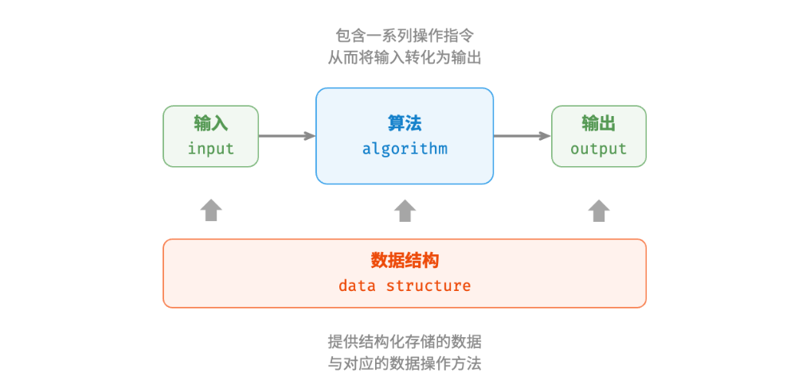

# 01.算法入门


## 一、算法

### 1.初识算法
算法并不涉及复杂数学，，而是更多地依赖基本逻辑，而这些逻辑在日常生活中随处可见。

#### （1）查字典

在字典里，每个汉字都对应一个拼音，而字典是按照拼音字母顺序排列的。假设需要查找一个拼音首字母为$r$的字，通常我们会按照如下步骤展开：

- 随机翻开字典任意页数，查看该页的首字母，假设首字母为 $𝑚 $​。
- 由于$m$在字母表中位于$r$之后，这时排除字典前半部分，查找范围缩小到后半部分。
- 不断重复上述步骤，直至找到拼音首字母为的页码为止。

从算法的角度来看上述查字典的步骤，实际上就是著名的“二分查找”算法。

#### （2）整理扑克

在打牌时，每局都需要重新整理手中的扑克牌，使其从小到大排列，以便于出牌，通常我们按照如下流程：

- 将扑克牌划分为“有序”和“无序”两部分，并假设初始状态下最左 1 张扑克牌已经有序。
- 从无序部分随机抽出一张扑克牌，与第一张扑克牌比较后插入至有序部分的正确位置，完成后最左2张扑克已经有序。
- 不断重复步骤2，每一轮将一张扑克牌从无序部分插入至有序部分，直至所有扑克牌都有序。

上述整理扑克牌的方法在算法上可称为“插入排序”算法，它在处理小型数据集时非常高效。

#### （3）货币找零

假设在超市购买了 69 元的商品，给了收银员 100 元，则收银员需要找零 31 元，这时收银员可考虑完后下述思考：

- 可供找零的选项是比 31 元面值更小的货币： 1 元、5 元、10 元、20 元。
- 从可选项中拿出最大的 20 元，剩余 31−20=11 元。
- 从剩余可选项中拿出最大的 10 元，剩余 11−10=1 元。
- 从剩余可选项中拿出最大的 1 元，剩余 1−1=0 元。
- 完成找零，方案为 20+10+1=31 元。

在以上步骤中，每一步都采取当前看来最好的选择（尽可能用大面额的货币），最终得到了可行的找零方案。从数据结构与算法的角度看，这种方法是“贪心”算法。

### 2.数据结构与算法

#### （1）算法（algorithm）是在有限时间内解决特定问题的一组指令或操作步骤，它具有以下特性。

- 问题是明确的，包含清晰的输入和输出定义。
- 具有可行性，能够在有限步骤、时间和内存空间下完成。
- 各步骤都有确定的含义，在相同的输入和运行条件下，输出始终相同。

#### （2）数据结构（data structure）是组织和存储数据的方式，涵盖数据内容、数据之间关系和数据操作方法，它具有以下设计目标。

- 空间占用尽量少，以节省计算机内存。
- 数据操作尽可能快速，涵盖数据访问、添加、删除、更新等。
- 提供简洁的数据表示和逻辑信息，以便算法高效运行。

> 数据结构设计通常是一个充满权衡的过程，如果想在某方面取得提升，往往需要在另一方面作出妥协。

#### （3）数据结构与算法的关系

数据结构与算法高度相关、紧密结合。数据结构是算法的基石。数据结构为算法提供了结构化存储的数据，以及操作数据的方法。算法是数据结构发挥作用的舞台。数据结构本身仅存储数据信息，结合算法才能解决特定问题。算法通常可以基于不同的数据结构实现，但执行效率可能相差很大，选择合适的数据结构是关键。



> 数据结构与算法是独立于编程语言的，通常会将“数据结构与算法”简称为“算法”。

### 3.为何要学习数据结构与算法

计算机科学主要研究的是问题、问题解决过程，以及问题的解决方案，其中不仅包括对计算机的研究，还包括对算法的研究，对计算复杂性的研究等。

#### （1）抽象与实现

电动车与汽油车底层动力、能源都不同，但开车的操作接口（方向盘、油门、刹车、档位）基本都是相同的，司机无需重新考驾照，而车厂可以持续改进实现技术升级，但不会影响司机驾驶车辆。在这里对于司机而言，只需要学会如何使用汽车的**接口**，了解汽车是用于驾驶的工具即可，而无需去关心汽车的具体**实现**。其实对于汽车维修工而言，“汽车”本身并不存在，他只是一个抽象的概念，是诸多零件的组合体。

在计算机科学中，一般用户使用计算机进行编辑文档、收发邮件、上网聊天、处理照片等功能接口，也是一种抽象，其使用的仅仅是计算机的逻辑层。对于计算机科学家、程序员、技术支持、系统管理员来说，同样是使用计算机，却必须要从了解硬件结构、操作系统原理到网络协议等各方面的低层次细节的内部实现，了解计算机的“物理”层次。

但抽象与实现有时又是相对的，一个程序员使用编程语言进行编程实际上也是一种“抽象”过程，编程是通过一种程序设计语言，将**抽象的算法**具体**实现**为计算机可以执行的代码的过程。程序设计语言需要为算法的实现提供实现“过程”和“数据”的机制，具体表现为“控制结构”和“数据类型”。对于计算机而言，为了控制问题和问题解决过程的复杂度，利用抽象来保持问题的“整体感”，从而使使用者不会陷入到过多的细节中去。

“过程抽象”：让底层开发程序员专注于实现和优化数据处理，又不改变数据的使用接口，让用户专注于用数据接口来进行问题的解决，而无需考虑如何具体实现这些接口，通过层层抽象，降低问题解决过程的复杂度。比如抽象数据类型（ADT:AbstractDataType）就是对数据的一种“数据抽象”，抽象数据类型ADT建立了一种对数据的“封装Encapsulation”，封装技术将可能的处理实现细节隐蔽起来，对数据实现“逻辑”层次和“物理”层次的分离，可以定义复杂的数据模型来解决问题，而不需要立即考虑此模型如何实现，有效控制算法的复杂度。

#### （2）为何要学习数据结构与算法

首先，现实到抽象的接口实现总是不唯一的，可以有多种实现方案，学习各种不同问题的解决方案，有助于我们在面对未知问题的时候，能够根据类似问题的解决方案来更好解决。

各种算法通常有较大差异的，可以通过算法分析技术来评判算法本身特性，而不仅仅根据实现算法的程序在特定机器和特定数据上运行的表现来评判它，甚至某些问题解决需要一些折衷的处理方式，需要学会在不同算法之间进行选择，以适合当前条件的要求。

> 即使同一个程序，在不同的运行环境和输入数据的情况下，其表现的差异可能也会很大。

## 二、算法复杂度分析

算法是对问题解决的分步描述，对于同一个问题，会有不同的解决方案（多种算法），限于资源（时间/空间）的有限性，其难易程度和解决效率也是千差万别的。如排序问题，以$n$张扑克牌作为排序对象，一种解决方法是“冒泡”排序，即每次从牌堆里选出一张最小的牌，这样全部排完大概会需要$n^2$量级的比较次数，另一种方法是“Bogo”排序方法，假设每次洗牌结果是不重复的，可以洗一次牌，看是否排好序，没有的话，接着洗牌，直到排序成功！这样全部排完，平均需要$n^n$​​​​量级的比较次数。

### 1.算法效率评估

#### （1）计算资源指标

限于以上原因，我们需要一种指标来评价一个算法的优劣，计算资源指标是用于衡量算法优劣很好的评价指标。计算资源主要包括两个维度：空间资源和时间资源。因此关于算法的效率评估，则主要从算法的时间效率和空间效率两个方面来衡量，效率评估方法主要分为两种：实际测试、理论估算。

#### （2）实际测试

假设现有算法 `A` 和算法 `B` ，它们都能解决同一问题，现在需要对比这两个算法的效率。最直接的方法是找一台计算机，运行这两个算法，并监控记录它们的运行时间和内存占用情况。这种评估方式能够反映真实情况，但也存在较大的局限性。

一方面，**难以排除测试环境的干扰因素**。硬件配置会影响算法的性能表现。比如一个算法的并行度较高，那么它就更适合在多核 CPU 上运行，一个算法的内存操作密集，那么它在高性能内存上的表现就会更好。也就是说，算法在不同的机器上的测试结果可能是不一致的。这意味着我们需要在各种机器上进行测试，统计平均效率，而这是不现实的。

另一方面，**展开完整测试非常耗费资源**。随着输入数据量的变化，算法会表现出不同的效率。例如，在输入数据量较小时，算法 `A` 的运行时间比算法 `B` 短；而在输入数据量较大时，测试结果可能恰恰相反。因此，为了得到有说服力的结论，我们需要测试各种规模的输入数据，而这需要耗费大量的计算资源。

#### （3）理论估算

由于实际测试具有较大的局限性，因此可以考虑仅通过一些计算来评估算法的效率。这种估算方法被称为**渐近复杂度分析**（asymptotic complexity analysis），简称复杂度分析。复杂度分析能够体现算法运行所需的时间和空间资源与输入数据大小之间的关系。**它描述了随着输入数据大小的增加，算法执行所需时间和空间的增长趋势**。

- “时间和空间资源”分别对应时间复杂度（time complexity）和空间复杂度（space complexity）。
- “随着输入数据大小的增加”意味着复杂度反映了算法运行效率与输入数据体量之间的关系。
- “时间和空间的增长趋势”表示复杂度分析关注的不是运行时间或占用空间的具体值，而是时间或空间增长的“快慢”。

**复杂度分析克服了实际测试方法的弊端**，体现在以下几个方面。

- 它无需实际运行代码，更加绿色节能。
- 它独立于测试环境，分析结果适用于所有运行平台。
- 它可以体现不同数据量下的算法效率，尤其是在大数据量下的算法性能。

> 复杂度分析提供了一把评估算法效率的“标尺”，使我们可以衡量执行某个算法所需的时间和空间资源，对比不同算法之间的效率。

### 2.时间复杂度分析

运行时间可以直观且准确地反映算法的效率，时间复杂度分析不是单纯的统计算法运行时间，**而是算法运行时间随着问题规模变大时的增长趋势**。为了在独立于具体程序/机器下统计一个算法所实施的运行时间，需要找到通用的基本操作来作为运行时间的计量单位，赋值语句是一个合适的选择，一条赋值语句同时包含了（表达式）计算和（变量）存储两个基本资源。

```python
# 累积求和的时间复杂度分析
def algorithm_A(n: int):
    s = 0
    for i in range(1, n+1):
        s += n
    return s

def algorithm_B(n: int):
    return n(n+1)/2
```

算法A中对于问题规模$n$，赋值语句执行$T(n)=1+n$次，可以说其时间复杂度为$n$，算法B中，赋值语句仅执行$1$次

```

```


```
我们先后追求以下两个层面的目标。

找到问题解法：算法需要在规定的输入范围内可靠地求得问题的正确解。
寻求最优解法：同一个问题可能存在多种解法，我们希望找到尽可能高效的算法。
也就是说，


简而言之，我们的目标是设计“既快又省”的数据结构与算法。而有效地评估算法效率至关重要，因为只有这样，我们才能将各种算法进行对比，进而指导算法设计与优化过程。


```


### 1.算法效率评估


```
2.1   
2.2   迭代与递归
2.3   时间复杂度
2.4   空间复杂度
2.5   小结
```


