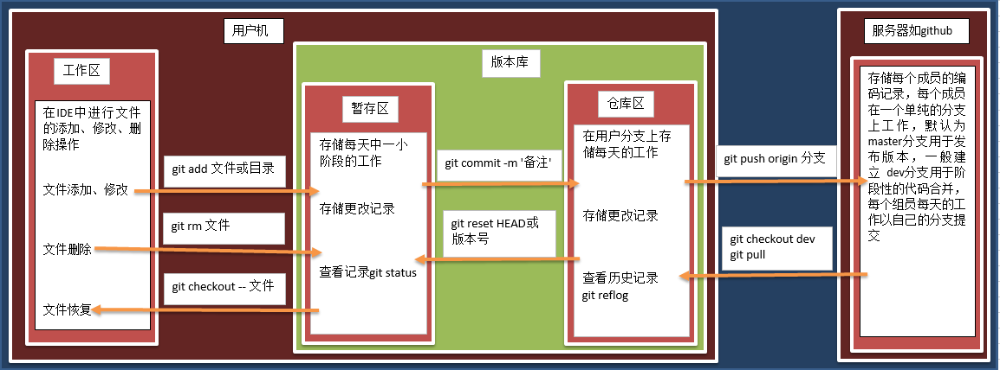

# Git与Github的使用

## 一、版本控制系统

版本控制是一种记录一个或若干文件内容变化，以便将来查阅特定版本修订情况的系统。 在程序开发过程中，可能会需要集中开发或者保存一个程序所有修订版本，这是使用**版本控制系统（CVS**）是个明智的选择，有了它就可以实现多人协同开发和版本控制，甚至可以比较文件的变化细节，查出最后是谁修改了哪个地方，从而找出导致怪异问题出现的原因，又是谁在何时报告了某个功能缺陷等等。版本控制系统可以分为集中式和分布式，也可以分为本地和网络，私有和公开等等。

### 1.集中式版本控制系统

集中化的版本控制系统，使用单一的集中管理的服务器保存所有文件的修订版本，协同工作者通过客户端连到服务器，取出最新的文件或者提交更新，如 SVN，CVS，Subversion 等。一旦中央服务器出现单点故障，如发生宕机，那么在服务器宕机期间，协同工作者无法提交更新，无法协同工作。如发生磁盘故障，碰巧没做备份或备份不够及时，就面临丢失数据的风险。

优点在于简单易于使用，缺点在于，功能单一，分支操作实际上是对目录的拷贝，分支成本高（计算量大，内存高，速度慢），工作时必须联网。

> 在版本管理里，分支是很常使用的功能。在发布版本前，需要发布分支，进行大需求开发，需要 feature 分支，大团队还会有开发分支，稳定分支等。在大团队开发过程中，常常存在创建分支，切换分支的需求。

### 2.分布式版本控制系统

分布式版本控制系统的客户端并不只提取最新版本的文件快照，而是把代码仓库完整地镜像下来。这么一来，任何一处协同工作用的服务器发生故障，事后都可以用任何一个镜像出来的本地仓库恢复。因为每一次的提取操作，实际上都是一次对代码仓库的完整备份。


分布式版本控制工具支持离线工作，分支时指针指向某次提交，分支成本低，工作环境安全，但是Git概念有点复杂，命令比较多。

> git是目前世界上最优秀的分布式版本控制工具，Github 就是一个中心服务器，其他的还有gitlab，gitee等等。

## 二、Git的安装配置

### 1.Git安装

Git 官方下载地址：https://git-scm.com/download

Git文档：https://git-scm.com/docs

**Linux环境安装**

如果你使用的系统是 ， 安装命令为：

```sh
#  Debian/Ubuntu 环境
apt-get install libcurl4-gnutls-dev libexpat1-dev gettext libz-dev libssl-dev
apt-get install git-core
git --version
# Centos/RedHat 环境
yum install curl-devel expat-devel gettext-devel openssl-devel zlib-devel
yum -y install git-core
git --version
```

**Windows 环境安装**

在 Git 官方下载地址下载 exe 安装包。按照安装向导安装即可。

**Mac 环境安装**

在 Git 官方下载地址下载 mac 安装包。按照安装向导安装即可。

**查看安装结果**

```bash
git
```

### 2.Git的基本配置

#### （1）配置文件

Git 自带一个 `git config` 的工具来帮助设置控制 Git 外观和行为的配置变量。这些变量存储在三个不同的位置：

|                                                |                                                              |
| ---------------------------------------------- | ------------------------------------------------------------ |
| `/etc/gitconfig` 文件                          | 包含系统上每一个用户及他们仓库的通用配置。如果使用带有 `--system` 选项的 `git config` 时，它会从此文件读写配置变量。 |
| `\~/.gitconfig`或 `\~/.config/git/config` 文件 | 只针对当前用户。可以传递 `--global` 选项让 Git 读写此文件。  |
| `.git/config`文件                              | 针对当前使用仓库的 Git 目录中的 `config` 文件                |

每一个级别覆盖上一级别的配置，所以 `.git/config` 的配置变量会覆盖 `/etc/gitconfig` 中的配置变量。

在 Windows 系统中，Git 会查找 `$HOME` 目录下（一般情况下是 `C:\Users\$USER`）的 `.gitconfig` 文件。Git 同样也会寻找 `/etc/gitconfig` 文件，但只限于 MSys 的根目录下，即安装 Git 时所选的目标位置。

**检查配置信息**
如果想要检查你的配置，可以使用 **git config --list** 命令来列出所有 Git 当时能找到的配置。

```bash
git config -l
```

**获取帮助**
若你使用 Git 时需要获取帮助，有三种等价的方法可以找到 Git 命令的综合手册（manpage）：

```bash
git help <verb>
git <verb> --help
# man git-<verb>
# git help config
```

#### （2）.gitignore

`.gitignore` 文件里配置的文件或目录，会自动被 git 所忽略，不纳入版本控制。

在日常开发中，需要用到一些临时文件，如编译 Java 产生的 `*.class` 文件，又或是 IDE 自动生成的隐藏目录（Intellij 的 `.idea` 目录、Eclipse 的 `.settings` 目录等）等等。这些文件或目录实在没必要纳入版本管理。在这种场景下，你就需要用到 `.gitignore` 配置来过滤这些文件或目录。

- 操作系统自动生成的文件，比如缩略图；
- 编译生成的中间文件，比如 Java 编译产生的 .class 文件；
- 自己的敏感信息，比如存放口令的配置文件。

Github 的开源项目：https://github.com/github/gitignore ，里有很多常用的模板，如：Java、Nodejs、C++ 的 `.gitignore` 模板等等。

### 三、Git的基本原理

### 1.版本库

当你一个项目到本地或创建一个 `git` 项目，项目目录下会有一个隐藏的 `.git` 子目录。这个目录是 `git `用来跟踪管理版本库的，一般不要手动修改。

### 2.哈希值

Git 中所有数据在存储前都计算校验和，然后以校验和来引用。这意味着不可能在` Git `不知情时更改任何文件内容或目录内容。这个功能建构在 `Git `底层，是构成 `Git `哲学不可或缺的部分。若你在传送过程中丢失信息或损坏文件，`Git` 就能发现。

`Git `用以计算校验和的机制叫做 `SHA-1 `散列（`hash`，哈希）。这是一个由 40 个十六进制字符（0-9 和 a-f）组成字符串，基于 `Git `中文件的内容或目录结构计算出来，`SHA-1 `哈希看起来是这样：

```
24b9da6552252987aa493b52f8696cd6d3b00373
```

`Git` 中使用这种哈希值的情况很多，你将经常看到这种哈希值。实际上，`Git` 数据库中保存的信息都是以文件内容的哈希值来索引，而不是文件名。

### 3.文件状态

在 `Git `中，你的文件可能会处于三种状态之一：

- **已修改（modified）** - 已修改表示修改了文件，但还没保存到数据库中。
- **已暂存（staged）** - 已暂存表示对一个已修改文件的当前版本做了标记，使之包含在下次提交的快照中。
- **已提交（committed）** - 已提交表示数据已经安全的保存在本地数据库中。

### 4.工作区域

与文件状态对应的，不同状态的文件在 `Git `中处于不同的工作区域。

- **工作区（working）** - 当你 `git clone` 一个项目到本地，相当于在本地克隆了项目的一个副本。工作区是对项目的某个版本独立提取出来的内容。这些从` Git` 仓库的压缩数据库中提取出来的文件，放在磁盘上供你使用或修改。
- **暂存区（staging）** - 暂存区是一个文件，保存了下次将提交的文件列表信息，一般在 `Git` 仓库目录中。有时候也被称作 `‘索引’'，不过一般说法还是叫暂存区。
- **本地仓库（local）** - 提交更新，找到暂存区域的文件，将快照永久性存储到 `Git `本地仓库。
- **远程仓库（remote）** - 以上几个工作区都是在本地。为了让别人可以看到你的修改，你需要将你的更新推送到远程仓库。同理，如果你想同步别人的修改，你需要从远程仓库拉取更新。


### 5.使用流程

```
Git服务器 --> 本地仓库 --> 客户端 --> 本地仓库 --> Git服务器
```



## 四、单人本地仓库操作

### 1.配置本地仓库

#### （1）**创建本地项目**

```bash
mkdir test
```

#### （2）**初始化本地项目**——创建本地仓库`.git`

```
cd test
git init
```

#### （3）**配置用户信息**

安装完 `Git `应该做的第一件事配置用户信息和邮箱地址，因为每一个 Git 的提交都会使用这些信息，并且它会写入到你的每一次提交中，不可更改。通常基于如下代码：

```
git config --global user.name "shelhen"
git config --global user.email shelhen@163.com
```

> 如果使用了 `--global` 选项，那么该命令只需要运行一次，因为之后无论你在该系统上做任何事情， Git 都会使用那些信息。当你想针对特定项目使用不同的用户名称与邮件地址时，可以在那个项目目录下运行没有 `--global` 选项的命令来配置。

很多 GUI 工具都会在第一次运行时帮助配置这些信息。

#### （4）**查看当前文件夹类目**

```bash
ls
Mode                 LastWriteTime         Length Name
----                 -------------         ------ ----
-a----         2024/5/12     10:00              0 caigui.py
-a----         2024/5/12      9:55              0 test.py
```

#### （5）**查看文件状态**

```bash
git status
```

- 红色表示新建文件或者新修改的文件，都在工作区。
- 绿色表示文件在暂存区
- 新建的`caigui.py`文件在工作区，需要添加到暂存区并提交到仓库区

#### （6）**将工作区文件添加到暂存区**

```bash
# 添加项目中所有文件
# git add .
# 添加指定文件
git add caigui.py
```


#### （7）**将暂存区文件提交到仓库区**

- `commit`会生成一条版本记录

- `-m`后面是版本描述信息（备注）

  ```bash
  git commit -m '备注'
  
  # 1 file changed, 0 insertions(+), 0 deletions(-)
  # create mode 100644 caigui.py
  ```

`100644`为版本号。

用`git commit`提交更改，实际上就是把暂存区的所有内容提交到当前分支。

> 因为创建Git版本库时，Git自动为我们创建了唯一一个master分支，所以git commit就是往master分支上提交更改。

如果用 `git commit -a` 提交了一次变化 (changes)，而又不确定到底这次提交了哪些内容。可以用下面的命令显示当前`HEAD`上的最近一次的提交 (commit):

```bash
git show
```

#### （8）**更改文件内容**


#### （9）**进一步可以重新进行**`add`和`commit`操作

```bash
 git status
 git add caigui.py
 git commit -m '测试'
```

> 提交两次代码，会有两个版本记录

#### （10）**查看历史版本**

```bash
git log
Author: shelhen <shelhen@163.com>
Date:   Sun May 12 10:31:07 2024 +0800
    测试
commit 06842669755fa4b65e6893a05d2632b6b1058036
Author: shelhen <shelhen@163.com>
Date:   Sun May 12 10:29:20 2024 +0800
    测试
commit 7a19ce3fc5e816faed4f5ffbfe821866136997b6
Author: shelhen <shelhen@163.com>
Date:   Sun May 12 10:16:30 2024 +0800
    测试
git reflog
4590bb9 (HEAD -> master) HEAD@{0}: commit: 测试
0684266 HEAD@{1}: commit: 测试
7a19ce3 HEAD@{2}: commit (initial): 测试
```

> git reflog 可以查看所有分支的所有操作记录（包括commit和reset的操作），包括已经被删除的commit记录，git log 则不能察看已经删除了的commit记录。

#### （11）**回退版本**

| 命令               | 说明                                                 |
| ------------------ | ---------------------------------------------------- |
| `HEAD`             | 表示当前最新版本                                     |
| `HEAD^`/`HEAD^^`   | 表示当前最新版本的前两（`^`）个版本，**以此类推...** |
| `HEAD~1`/`HEAD~10` | 表示当前最新版本的前n个版本，**以此类推...**         |
| `版本号`           | 通过每个版本的版本号回退到指定版本                   |

```bash
git reset --hard HEAD^
git reset --hard HEAD~1
git reset --hard 版本号
```

#### （12）**撤销修改**

- 撤销工作区代码

新加代码`num3 = 30`，不`add`到暂存区，保留在工作区，可以使用如下代码撤销。

```bash
# git checkout 文件名
git checkout caigui.py
```

- 撤销暂存区代码

新加代码`num3 = 30`，并`add`到暂存区，需要分如下两步走：

```bash
# 第一步：将暂存区代码撤销到工作区（版本回退）
git reset HEAD  文件名
# 第二步：撤销工作区代码
git checkout 文件名
```

> 只能撤销工作区、暂存区的代码,不能撤销仓库区的代码，实际上撤销仓库区的代码就相当于回退版本操作。

### 五、Git远程仓库管理

#### 1.前期准备

```
准备Git源代码仓库：https://github.com/shelhen/spiders
准备本地文件仓库：Desktop/myspiders/
```


#### 2.配置SSH

为了避免每次远程提交的时候，都要登录账号和密码，可以通过SSH公钥免密的方法避免麻烦。

`git ssh` 方式免密提交方式需要将` ssh-keygen` 生成的公钥放到服务器上：

- 配置全局用户名密码

```bash
git config --global user.name "shelhen"
git config --global user.email "shelhen@163.com"
```

- 生成SSH公钥

```bash
ssh-keygen -t rsa -C "shelhen@163.com"
# -t 指定密钥类型，默认是 rsa ，可以省略。
# -C 设置注释文字，比如邮箱。
# windows 默认路径，可以自行设置，以/分割。
#  /c/Users/shelhen/.ssh/id_rsa.pub
```

```
# 私钥：id_rsa
# 公钥：id_rsa.pub
```

> 如果电脑里已存在公钥文件，可尝试删除后重新生成或者直接使用已有的公钥。

linux配置：

```shell
ssh-keygen -t rsa -C "shelhen@163.com"

# 默认路径 /home/用户名/.ssh/id_rsa.pub
cat ~/.ssh/id_rsa.pub # 查看公钥内容
```

- Github-ssh配置入口

复制公钥信息，进入`github>Settings>SSH and GPG keys`，把公钥粘贴到公钥文本框中，标题自己定义，然后点击确定按键即可。

- 克隆项目

通常有两种获取 Git 项目仓库的方式：

1. 将尚未进行版本控制的本地目录转换为 Git 仓库，创建全新的仓库，需要用git管理的项目的根目录执行：git init。
2. 从其它服务器 **克隆** 一个已存在的 Git 仓库，另一种方法就是克隆远程目录，由于是将远程服务器上的仓库完全镜像一份至本地：git clone [url]

```shell
git clone https://github.com/shelhen/myspiders.git
```

两种方式都会在你的本地机器上得到一个工作就绪的 Git 仓库。

报错信息：`fatal: unable to access 'https://github.com/shelhen/myspiders.git/': OpenSSL SSL_read: SSL_ERROR_SYSCALL, errno 0`

解决方案：

```
git config --global --unset http.proxy
git config --global --unset https.proxy

# git config --global http.sslVerify "false"
```

注意链接github可能需要翻墙。

- 再次配置个人信息

```
cd myspiders
git config user.name 'shelhen'
git config user.email 'shelhen@163.com'
```

#### （3）提交远程仓库

- 新建项目和代码

```bash
ls
# LICENSE  requestments.txt  xwclawer.py
```

- 推送项目到远程仓库

```bash
# 工作区添加到暂存区
git add .
# 暂存区提交到仓库区
git commit -m '立项'
# 推送到远程仓库
git push
```

在 push 的时候需要设置账号与密码，该密码则是 github 的账号与密码

- 如果在每次 push 都需要设置账号与密码，那么可以设置记住密码

  ```
  设置记住密码（默认15分钟）：
  git config --global credential.helper cache
  如果想自己设置时间，可以这样做(1小时后失效)：
  git config credential.helper 'cache --timeout=3600'
  长期存储密码：
  git config --global credential.helper store
  ```

  > 在以后的项目开发过程中，Pycharm 可以自动记住密码。

#### （4）分支管理

分支管理可以用于区分生产环境代码以及开发环境代码，研究新的功能或者攻关难题和解决线上bug，项目开发中使用的公用分支包括master、dev，分支master是默认分支，用于发布，当需要发布时将dev分支合并到master分支，分支dev是用于开发的分支，开发完阶段性的代码后，需要合并到master分支。

- **`master` 分支** - 经常使用的主线分支，这个分支是最近发布到生产环境的代码，这个分支只能从其他分支合并，不能在这个分支直接修改。
- **`develop` 分支** - 这个分支是主开发分支，包含所有要发布到下一个 release 的代码，这个分支主要是从其他分支合并代码过来，比如 feature 分支。
- **`feature` 分支** - 这个分支主要是用来开发一个新的功能，一旦开发完成，将其合并回 develop 分支进入下一个 release。
- **`release` 分支** - 当需要一个发布一个新 release 的时候，可基于 Develop 分支创建一个 release 分支，完成 release 后，将其合并到 master 和 develop 分支。
- **`hotfix` 分支** - 当在 master 发现新的 Bug 时候，需要创建一个 hotfix, 完成 hotfix 后，我们合并回 master 和 develop 分支，所以 hotfix 的改动会进入下一个 release。

使用指针将每个提交连接成一条时间线，HEAD 指针指向当前分支指针。

<div align="center">  </div><br>

新建分支是新建一个指针指向时间线的最后一个节点，并让 HEAD 指针指向新分支，表示新分支成为当前分支。

<div align="center">  </div><br>

每次提交只会让当前分支指针向前移动，而其它分支指针不会移动。

<div align="center">  </div><br>

合并分支也只需要改变指针即可。

<div align="center">  </div><br>

"快进式合并"（fast-farward merge），会直接将 master 分支指向合并的分支，这种模式下进行分支合并会丢失分支信息，也就不能在分支历史上看出分支信息。

可以在合并时加上 --no-ff 参数来禁用 Fast forward 模式，并且加上 -m 参数让合并时产生一个新的 commit。

```
git merge --no-ff -m "merge with no-ff" dev
```

**常用的操作命令：**

```bash
# 查看当前分支
git branch
  main
* master
# 创建并切换到dev分支
git checkout -b dev
# 切换到指定分支
git checkout dev
# 删除本地分支
git branch -d dev
git branch -D dev  # 强制删除
# 删除远程分支
# git push <remote> :<branch>
# git push <remote> --delete <branch>
git push origin -d dev

# 本地分支跟踪远程指定分支（将分支推送到远程）
git push -u origin dev
# 预览差异
git diff <source_branch> <target_branch>

# dev分支合并到master分支
git merge dev
```

合并分支默认在本地完成，合并后直接推送`git push`即可网络仓库的合并已经实现，本地重新同步代码后，合并本地分支。

实际开发过程中，领导一般会设置足够一定的权限，有合并权限的人才能合并分支。

#### （5）代码冲突

多人协同开发时，分别开发的两个或以上人对同一个文件进行了修改，在分支合并时就会引发代码冲突，代码冲突会会影响正常的开发进度，一旦出现代码冲突，必须先解决再做后续开发。

Git 会使用 \<\<\<\<\<\<\< ，======= ，\>\>\>\>\>\>\> 标记出不同分支的内容，只需要把不同分支中冲突部分修改成一样就能解决冲突。

- 原则：谁冲突谁解决，并且一定要协商解决
- 方案：保留所有代码 或者 保留某一人代码
- 只需要把不同分支中冲突部分修改成一样就能解决冲突，解决完冲突代码后，依然需要`add`、`commit`、`push`

**容易冲突的操作方式**

- 多个人同时操作了同一个文件
- 一个人一直写不提交
- 修改之前不更新最新代码
- 提交之前不更新最新代码
- 擅自修改同事代码

**减少冲突的操作方式**

- 养成良好的操作习惯,先`pull`在修改,修改完立即`commit`和`push`
- 一定要确保自己正在修改的文件是最新版本的
- 各自开发各自的模块
- 如果要修改公共文件,一定要先确认有没有人正在修改
- 下班前一定要提交代码,上班第一件事拉取最新代码
- 一定不要擅自修改同事的代码

#### （6）标签

当某一个大版本完成之后,需要打一个标签，主要作用是记录大版本和代码备份。

```bash
git tag -a 标签名 -m '标签描述'
# git tag -a v1.0 -m 'version 1.0'

# 推送标签到远程仓库
git push origin 标签名
# 删除本地标签
git tag -d 标签名
# 删除远程仓库标签
git push origin --delete tag 标签名
```

#### （7）储藏

在一个分支上操作之后，如果还没有将修改提交到分支上，此时进行切换分支，那么另一个分支上也能看到新的修改。这是因为所有分支都共用一个工作区的缘故。

可以使用 git stash 将当前分支的修改储藏起来，此时当前工作区的所有修改都会被存到栈中，也就是说当前工作区是干净的，没有任何未提交的修改。此时就可以安全的切换到其它分支上了。

```bash
git stash
# Saved working directory and index state \ "WIP on master: 049d078 added the index file"
HEAD is now at 049d078 added the index file (To restore them type "git stash apply")
```

该功能可以用于 bug 分支的实现。如果当前正在 dev 分支上进行开发，但是此时 master 上有个 bug 需要修复，但是 dev 分支上的开发还未完成，不想立即提交。在新建 bug 分支并切换到 bug 分支之前就需要使用 git stash 将 dev 分支的未提交修改储藏起来。

### 参考资料

关于git命令梳理比较详细的地址：http://www.cheat-sheets.org/saved-copy/git-cheat-sheet.pdf

资料整理参考链接：[微信公众号文章](https://mp.weixin.qq.com/s?__biz=MzI0MDQ4MTM5NQ==&mid=2247494947&idx=4&sn=8f07adcb499a053462d636af15138133&chksm=e918883fde6f01294ddfbcfdbac6fcc5dc2e9b191c78c1446709885a83d8eb1b992584fb7ea0&token=1267489950&lang=zh_CN#rd)/[知乎文章](https://zhuanlan.zhihu.com/p/652125463)/[Git - 简明指南](http://rogerdudler.github.io/git-guide/index.zh.html)

其他参考资料：[廖雪峰 : Git 教程](https://www.liaoxuefeng.com/wiki/0013739516305929606dd18361248578c67b8067c8c017b000)/[图解 Git](http://marklodato.github.io/visual-git-guide/index-zh-cn.html)/[Learn Git Branching](https://learngitbranching.js.org/)

