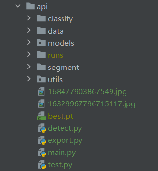

# 知识点：改写框架，api调用

框架目录结构

main.py api启动文件

    from flask import Flask, request, jsonify
    from detect import YOLOv5
    from utils.general import cv2
    import numpy as np
    import base64
    
    app = Flask(__name__)
    yolov_5 = YOLOv5()
    
    
    @app.route("/", methods=["POST"])
    def index():
        images = request.values.get("images")
        input_image = base64.b64decode(images)
        imBytes = np.frombuffer(input_image, np.uint8)
        iImage = cv2.imdecode(imBytes, cv2.IMREAD_COLOR)
        result = yolov_5.infer(iImage)
        result = result[0].view(-1).int()
        res_dict = {'coordinate': result.tolist()}
        print(res_dict)
        return jsonify(res_dict)
    
    
    if __name__ == '__main__':
        app.run(
            host='127.0.0.1',
            port=8888,
            debug=True
        )

test.py 测试文件

    import base64
    import requests
    
    with open('16329967796715117.jpg', 'rb') as f:
        image = base64.b64encode(f.read())
    
    data = {
        'images': image
    }
    
    response = requests.post('http://127.0.0.1:8888/', data=data)
    print(response.json())
