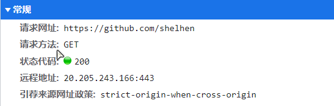
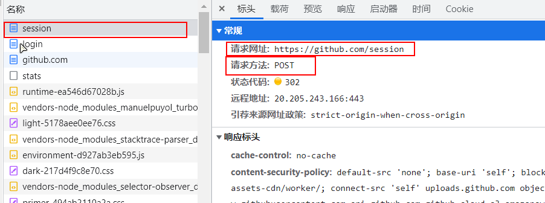
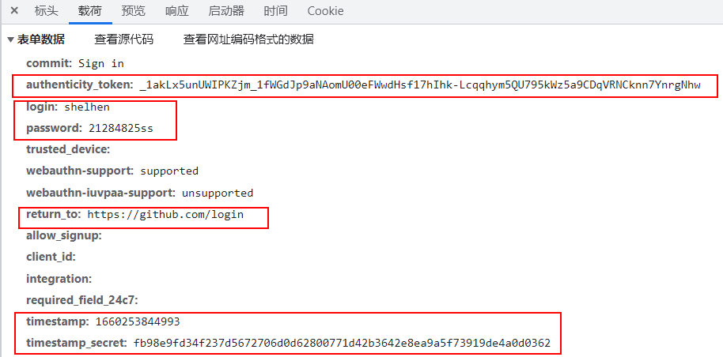
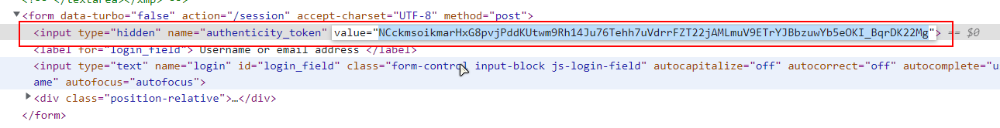
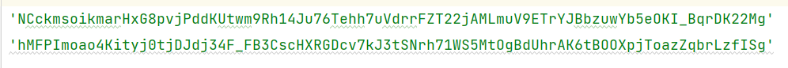
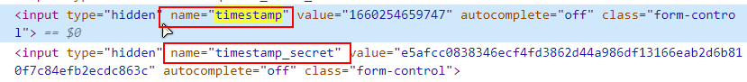

## 02.模拟登录爬虫

### 一、Github的模拟登录

#### 1.获取个人中心首页信息

首先抓包分析，进入个人中心页面实际是向该网址发送了一个get请求，其中携带了cookie信息和UA信息，尝试模拟以上信息进入个人中心主页：



```python
import requests


url = 'https://github.com/shelhen'

headers = {
    'user-agent': 'Mozilla/5.0 (Windows NT 10.0; Win64; x64) AppleWebKit/537.36 (KHTML, like Gecko) Chrome/103.0.0.0 Safari/537.36',
    'cookie': '_octo=GH1.1.1437385724.1660108695; tz=Asia%2FShanghai; _device_id=5b9b2838ddf91a41dbec81fc72873e6b; preferred_color_mode=light; has_recent_activity=1; user_session=mR8cwgCEYi2-Le6-9PRRFM5LMPZBLgnwbN6oSFb3QDzkZO_-; __Host-user_session_same_site=mR8cwgCEYi2-Le6-9PRRFM5LMPZBLgnwbN6oSFb3QDzkZO_-; tz=Asia%2FShanghai; color_mode=%7B%22color_mode%22%3A%22auto%22%2C%22light_theme%22%3A%7B%22name%22%3A%22light%22%2C%22color_mode%22%3A%22light%22%7D%2C%22dark_theme%22%3A%7B%22name%22%3A%22dark%22%2C%22color_mode%22%3A%22dark%22%7D%7D; logged_in=yes; dotcom_user=shelhen; _gh_sess=9O0uEPbhtC%2B5Sx1V%2B%2FpqXOTS1EB15Z0tLJYkS%2Bip1%2FEU9UkapaAQgD%2FZyUkxxl2oimfl6TUfVGVRYFnax9e51nFIXR%2BA5GRkuPzMM3%2B56Mttjrz%2BMD2mwmLQ%2BvbSXGSKyKQxQ%2FR1iNKskrIrOZr42TdOKcvUaQp10srkqhsM6qNfBt1Cr5mgJFxxrZVYrhdWPloP05qAABnc8OjvDKnT3edfmiSkbJwWWBW%2FHPZay6PgDCvzg65FaCru8iZgVhKOlvWmCeoZHQ9Aw%2FbK1lvyXMAQPT9OTiMrJq389jGMYrmkJS1%2FB%2Bo8oMwQ%2BdfQTBn5o3lXNKLWnTgcKPTN4bkO51BMRqmhYq%2BZVhMR6rCCCoA4IrYyKrAQ4Rq8O077aW0DOTtWSfPwHfSeTOwG5YUT8E26DLDFKoHyLWBrKsldx2JwsbZFPPMBoiGWD%2FomXxcRV05RXNKOiOaK2vZFDy68vpBZzaumvM1Yt%2BENei4ZVb0Gt%2FmH41R2x4HqecUHkOiEqhi372e%2FheIKNw3NTwY8hCE1oHO6dqde48JRYMPowpW354fNFAA9UscHJtO4J1%2FsBy7%2B2ixIvr67buBgj260Onq6O94aZvdN%2FK4IphAUTjMxrfO4sTZSy0hItyMDipyk4F%2BBydzYNEYPmGW4XuUxOhuO%2BgICWO%2B4QrUmPRwwoEcn9%2FZRcLmrA37mu8GU6nMphKA3T7ramTmduGw3qu3zN23OIAdct0t6abuOxCk89vnXaVKjTySxYNpgXuWBCVVv--bklXFM%2BGJxdz%2FELY--nkrPlAo7Ek9Ki5mc17t0dg%3D%3D'
}
res = requests.get(url, headers=headers, timeout=20)
print(res.content.decode())
```

成功获得响应数据。

#### 2.直接使用爬虫来模拟登录

在实现 `GitHub` 网页的模拟登录时，首先需要查看提交登录请求时都要哪些请求参数，然后获取登录请求的所有参数，再发送登录请求。如果登录成功的情况下获取页面中的注册号码信息即可。

进入Github登录界面，抓包分析

这里浏览器携带了cookie信息和refer信息向`http://github.com/session`发送了一个POST请求，其中携带以下参数：



看到参数有点头疼，首先要找这个`authenticity_token`、又要找`timestamp`及`timestamp_serect`参数。

##### (1)寻找`authenticity_token`

首先尝试去HTML代码中去寻找参数，很幸运，在HTML中搜索到了该参数，尝试刷新页面，试试该参数是否发生改变。





遗憾的发现每次刷新该值都会发生变化，变化的话就需要爬虫动态的获取了。

##### (2)寻找`timestamp`

同样，首先尝试在HTML中搜索，都在HTML中对吧，



往下翻甚至找到了所有参数，那就简单了，省的模拟js了。

##### (3)代码实现

现在的思路是，首先向登录页发送get请求，提取相应数据后获取上述参数，然后再发送POST请求模拟登录即可。

```python
import requests
from lxml import etree # 导入数据解析模块 都是第三方模块需要安装

url = 'https://github.com/'
s = requests.Session() # 创建Session会话对象
headers = {
    'user-agent': 'Mozilla/5.0 (Windows NT 10.0; Win64; x64) AppleWebKit/537.36 (KHTML, like Gecko) Chrome/104.0.0.0 Safari/537.36',
    'referer': url,
}


def get_data(username, password):
    # 发送登录页面的网络请求
    res = s.get(url+'login', headers=headers, timeout=20)
    if res.status_code == 200:  # 判断请求是否成功
        html = etree.HTML(res.text)  # 解析html
        # 提取authenticity_token信息
        token = html.xpath('//*[@id="login"]/div[4]/form/input[1]/@value')[0]
        return_to = html.xpath('//*[@id="login"]/div[4]/form/div/input[5]/@value')[0]
        ts = html.xpath('//*[@id="login"]/div[4]/form/div/input[10]/@value')[0]
        ts_sercet = html.xpath('//*[@id="login"]/div[4]/form/div/input[11]/@value')[0]
    data = {
        'commit': 'Sign in',
        'authenticity_token': token,
        'login': username,
        'password': password,
        'trusted_device': '',
        'webauthn-support': 'supported',
        'webauthn-iuvpaa-support': 'unsupported',
        'return_to': return_to,
        'allow_signup': '',
        'client_id': '',
        'integration': '',
        'required_field_3e6e': '',
        'timestamp': ts,
        'timestamp_secret': ts_sercet,
    }
    return data  # 返回信息


def login(username, password):
    data = get_data(username, password)
    res = s.post(url+'session', headers=headers, data=data, timeout=20)
    # with open('github.html', 'wb') as f:
        # f.write(res.content)
    if res.status_code == 200:  # 判断请求是否成功
        html = etree.HTML(res.text)  # 解析html
        # 获取注册账户名
        register_name = html.xpath('/html/head/meta[18]/@content')[0]
        print(f"注册号码为: {register_name}")
    else:
        print("登录失败")

# username = 'shelhen'
# password = '21284825ss'
username = str(input('请输入您的用户名：'))
password = str(input('请输入您的密码：'))
login(username, password)
```

