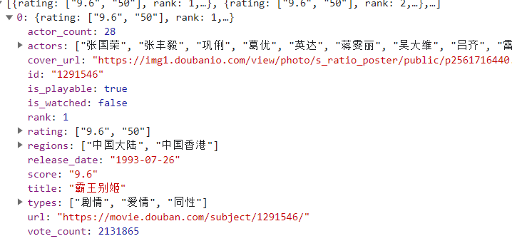

## 04.爬取豆瓣电影数据

> 爬取电影的详情数据，练习xpath、css选择器的使用。

### 一、需求分析

#### 1.功能目的

目的网址：豆瓣电影https://movie.douban.com/typerank?type_name=%E7%88%B1%E6%83%85&type=13&interval_id=100:90&action=

单纯的爬取页面上的全部电影数据，包含封面、名称、上映时间、导演、评分、简介、类型。


关键步骤即从列表页跳转到详情页，获取详情页响应数据并进行解析，解析为列表字典后储存为json文档。

#### 2.抓包分析

访问首页获取到了服务器的响应cookie：`bid:x1bi3WpS6IA`，所有列表数据都在一个接口里，

接口地址:https://movie.douban.com/j/chart/top_list

主要参数分析，`type`代表我们需要爬取的电影类型，即爱情片，`start`和`limit`用于控制每次接口数据内容，`interval_id`暂时不知怎么用的，是不是关键参数。

响应结果：



响应结果里没有我们想要的电影简介，因此需要前往详情页面。

有前往详情页面的url地址，可以见地址形式为`https://movie.douban.com/subject/id/`，我们只需要获取id就好了，打开新的无痕浏览器，直接访问详情页面，成功获取到具体内容，但是响应结果是xml形式。

由于从xml中采集数据比较麻烦，可以考虑从列表中采集所有数据，转到详情页面仅仅获取电影简介。

这时，我想试试能不能获取全部电影种类，分别爬取各类型电影名单并且保存。

在页面顶部发现了一个类型分类的xml文件，可以通过解析获取所有type内容。

### 二、爬虫设计

#### 1.总体设计

1）访问任意一个列表页，获取解析类型转换id。

2）根据具体类型，分别访问列表页，拿去典型大部分信息（缺少电影简介）——电影id

3）根据电影id访问电影详情页面，获取简介等信息。

#### 2.解析类型转换

```
https://movie.douban.com/subject/id/
```

##### 1）接口分析

url：https://movie.douban.com/typerank?type_name=%E7%88%B1%E6%83%85&type=13&interval_id=100:90&action=

请求方式：get

参数：

```
type=13
interval_id=100%3A90
action=
start=0
limit=1
https://movie.douban.com/typerank?type_name=%E5%89%A7%E6%83%85&type=11&interval_id=100:90&action=
```

功能：访问页面，获取cookie信息，获取电影分类数据。

##### 2）代码实现

```python
def get_movie_type(self):
        api = 'typerank'
        params={'type_name':'爱情', "type":13, "interval_id":"100:90", "action":''}
        type_response = self.get_pages(api,params)
        sel = Selector(type_response.text)
        aNodes = sel.xpath('//div[@class="types"]/span/a')
        for node in aNodes:
            typeid_match = re.search('type=(\d+)', node.attrib['href'])
            try:
                typeid =typeid_match.group(1)
                self.type[typeid] = node.xpath('./text()').getall()[0]
            except Exception as e:
                print(node.xpath('./text()').getall()[0])
                print('获取类型失败')
                print(e)
```

#### 2.获取类型列表并解析部分数据

接口api：https://movie.douban.com/j/chart/top_list

方法：get

参数：

```
type: 13
interval_id: 100:90
action: 
start: 0
limit: 20
```

响应：json数据

功能：访问列表json信息，存储部分数据并从中获取id，根据id拼接详情页url，从中获取导演信息和电影简介。

```python
 def get_movie_list(self, type, start,limit):
        api = 'j/chart/top_list'
        params={
            "type": type,
            "interval_id": "100:90",
            "action": '',
            'start': start,
            'limit': limit
        }
        response = self.get_pages(api, params).json()
        movies =[]
        for movie in response:
            id = movie['id']
            # detail_url = movie['url']
            attr, desc = self.get_dec(id)
            movies.append({
                'rank': movie['rank'],
                'cover': movie['cover_url'],
                'title': movie['title'],
                'id': id,
                'attr':attr,
                'types': '/'.join(movie['types']),
                'score': movie['score'],
                'vote_count': movie['vote_count'],
                'release_date': movie['release_date'],
                'desc':desc

            })
        return movies
   
	def get_dec(self, id):
        api = f"subject/{id}/"
        response = self.get_pages(api)
        sel = Selector(response.text)
        attr = sel.xpath('(//span[@class="attrs"])[1]//text()').get()
        # 优先获取hide/没有话再取得【1】
        descNodes = sel.xpath('//div[@id="link-report-intra"]/span')
        desc = descNodes.css('span::text, span[class*=all]::text').getall()
        desc = self.desc_parse(desc)
        return attr, desc
```

#### 3.爬取停止条件

对于某一列表不可能一直爬取，需要知道总页数并计算究竟应该爬取多少页码。

```python
def get_total_nums(self, type):
        api = 'j/chart/top_list_count'
        params = { "type": type, "interval_id": "100:90"}
        pages = self.get_pages(api, params).json()
        total = int(pages['total'])
        return total
```

#### 4.总体流程与保存

```python
 def main(self):
        result = {}
        self.get_movie_type()
        for id, name in self.type.items():
            result[name] = []
            total = self.get_total_nums(id)
            for i in range(total//20+1):
                limit = 20 if (total - i*20)>20 else total-i*20
                type_movies = self.get_movie_list(id, i*20, limit)
                for data in type_movies:
                    print(f"{data['title']}存储完毕")
                result[name].extend(type_movies)
        self.save_to_json('./datas/movies.json', result)
  def save_to_json(self, path, datas):
        json.dump(datas, open(path, 'w', encoding='utf-8'), indent=2, ensure_ascii=False)
```

### 二、程序设计

#### 1.完整代码

```python
import requests
from parsel import Selector
import json
import re


class DoubanSpider(object):
    def __init__(self):
        self.headers ={
            "User-Agent":"Mozilla/5.0 (Windows NT 10.0; Win64; x64) AppleWebKit/537.36 (KHTML, like Gecko) Chrome/114.0.0.0 Safari/537.36",
            "Host": "movie.douban.com"
        }
        self.session = requests.Session()
        self.type = {}
        self.base_url = "https://movie.douban.com/"

    def get_pages(self, api, params=None):
        response = self.session.get(self.base_url + api, headers=self.headers, params=params, timeout=10)
        return response

    def get_movie_type(self):
        api = 'typerank'
        params={'type_name':'爱情', "type":13, "interval_id":"100:90", "action":''}
        type_response = self.get_pages(api,params)
        sel = Selector(type_response.text)
        aNodes = sel.xpath('//div[@class="types"]/span/a')
        for node in aNodes:
            typeid_match = re.search('type=(\d+)', node.attrib['href'])
            try:
                typeid =typeid_match.group(1)
                self.type[typeid] = node.xpath('./text()').getall()[0]
            except Exception as e:
                print(node.xpath('./text()').getall()[0])
                print('获取类型失败')
                print(e)

    def get_movie_list(self, type, start,limit):
        api = 'j/chart/top_list'
        params={
            "type": type,
            "interval_id": "100:90",
            "action": '',
            'start': start,
            'limit': limit
        }
        response = self.get_pages(api, params).json()
        movies =[]
        for movie in response:
            id = movie['id']
            # detail_url = movie['url']
            attr, desc = self.get_dec(id)
            movies.append({
                'rank': movie['rank'],
                'cover': movie['cover_url'],
                'title': movie['title'],
                'id': id,
                'attr':attr,
                'types': '/'.join(movie['types']),
                'score': movie['score'],
                'vote_count': movie['vote_count'],
                'release_date': movie['release_date'],
                'desc':desc

            })
        return movies

    def get_dec(self, id):
        api = f"subject/{id}/"
        response = self.get_pages(api)
        sel = Selector(response.text)
        attr = sel.xpath('(//span[@class="attrs"])[1]//text()').get()
        # 优先获取hide/没有话再取得【1】
        descNodes = sel.xpath('//div[@id="link-report-intra"]/span')
        desc = descNodes.css('span::text, span[class*=all]::text').getall()
        desc = self.desc_parse(desc)
        return attr, desc

    def desc_parse(self, desc):
        desc_ = ''
        if type(desc) == list:
            for des in desc:
                des = des.replace('\n', '').replace(' ', '')
                desc_ += '  ' + des + '\n'
        else:
            desc_ = desc
        return desc_

    def get_total_nums(self, type):
        api = 'j/chart/top_list_count'
        params = { "type": type, "interval_id": "100:90"}
        pages = self.get_pages(api, params).json()
        total = int(pages['total'])
        return total

    def save_to_json(self, path, datas):
        json.dump(datas, open(path, 'w', encoding='utf-8'), indent=2, ensure_ascii=False)

    def main(self):
        result = {}
        self.get_movie_type()
        for id, name in self.type.items():
            result[name] = []
            total = self.get_total_nums(id)
            for i in range(total//20+1):
                limit = 20 if (total - i*20)>20 else total-i*20
                type_movies = self.get_movie_list(id, i*20, limit)
                for data in type_movies:
                    print(f"{data['title']}存储完毕")
                result[name].extend(type_movies)
        self.save_to_json('./datas/movies.json', result)


if __name__ == '__main__':
    ds = DoubanSpider()
    # ds.test()
    ds.main()
```

#### 2.心得总结