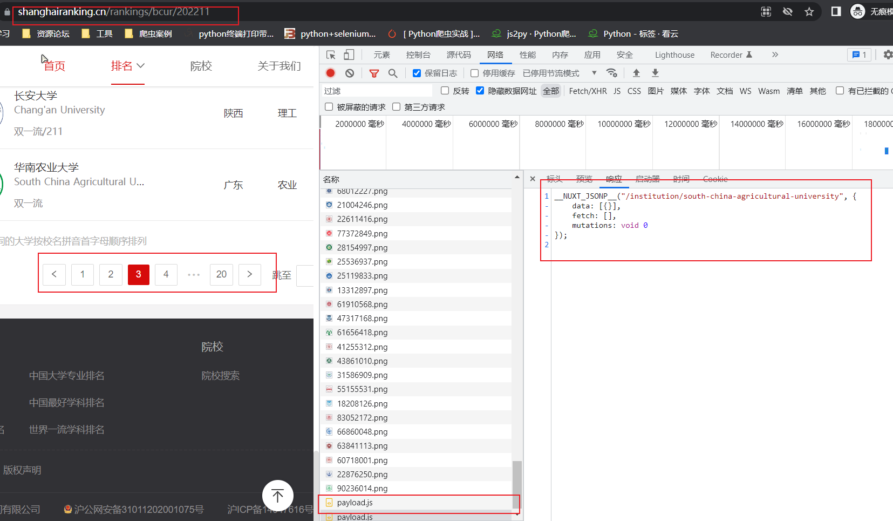

## 06.中国大学排名定向爬虫

### 一、功能描述

输入：大学排名URL链接

输出：大学排名信息的屏幕输出（排名，大学名称，总分）


计划使用技术：requests-xpath-lxml

定向爬虫：仅对输入URL进行爬取，不扩展爬取

### 二、程序结构设计

```python
import requests

def get_html_text(url):
    # 步骤1：从网络上获取大学排名网页内容 ——数据抓取
	pass

def univlistparse(js_text):
    # 步骤2：提取网页内容中信息到合适的数据结构 ——数据解析
	pass

def get_content(univer_list):
    # 步骤3：利用数据结构展示并输出结果 ——输出结果
	pass

def main():
	pass

main()
```

### 三、思路分析和代码实现

#### 1.思路分析

首先对该网站进行抓包分析，网址https://www.shanghairanking.cn/rankings/bcur/202211，打开无痕模式，直接在地址栏访问该地址获得抓包信息如下图：


请求头中没看到除UA信息外的其他反爬字段，直观印象可以通过request获得请求，再利用lxml解析，然后xpath提取数据，然后组织数据并输出数据。

接下来寻找翻页条件及翻页后的URL，对翻页标签进行数据解析发现，多次翻页地址未改变，抓包得知，每次翻页服务器会转发来当该的ID信息，并没有真实数据，所以真实数据在哪里？



返回去查看已经抓取的信息，发现除了几个js文件外，没有找到想要的json包，尝试在所有文件中检索“清华大学”信息，结果在一个叫做index.js的文件中找到了所有数据信息，因为曾经使用过Vue框架，发现这里使用了类似vue模板语法的数据绑定，将数据直接储存在js代码中，每次翻页由js动态提供，后端服务器仅在第一次发送请求时就将所有数据发送过来。


到这里，已经不想在用原本的方法不断地翻页爬取数据了，可以直接利用js2py执行该js文件，提取想要的数据，将该js文档整理后保存在项目文件夹下，尝试提取其中的数据。

```python
import js2py


with open("test.js", 'r', encoding='utf8') as f:
    result = f.read()
    js_text = 'function func'+ result[49:-7431]+',};}'
context = js2py.EvalJs(enable_require=True)
context.execute(js_text)
info_list = context.func().to_dict()['data'][0]['univData']
for item in info_list:
    print(f"{item['univNameCn']} : {item['score']}")
```

```python
# 输出结果
清华大学 : 999.4
北京大学 : 912.5
浙江大学 : 825.3
上海交通大学 : 783.3
复旦大学 : 697.8
....
```

本来想干票大的，没想到这么容易就实现了需求。

#### 2.代码实现

```python
import requests
import js2py

def get_html_text(url):
    # 步骤1：从网络上获取大学排名网页内容 ——数据抓取
    headers = {
        'user-agent': 'Mozilla/5.0 (Windows NT 10.0; Win64; x64) AppleWebKit/537.36 (KHTML, like Gecko) Chrome/104.0.0.0 Safari/537.36',
        'referer': 'https://www.shanghairanking.cn/rankings/bcur/202211'
    }
    try:
        r = requests.get(url, headers=headers, timeout=10)
        r.raise_for_status()
        js_text = 'function func' + r.content.decode()[49:-7431] + ',};}'
        return js_text
    except:
        print("请求失败；")
        return ""

def univlistparse(js_text):
    # 步骤2：提取网页内容中信息到合适的数据结构 ——数据解析
    context = js2py.EvalJs(enable_require=True)
    context.execute(js_text)
    info_list = context.func().to_dict()['data'][0]['univData']
    univer_list = [(i + 1, info_list[i]['univNameCn'], info_list[i]['score']) for i in range(len(info_list))]
    # print(univer_list)
    return univer_list

def get_content(univer_list):
    # 步骤3：利用数据结构展示并输出结果 ——输出结果
    print(f"{'排名':^6}\t{'学校名称':{chr(12288)}^20}\t{'总分':^12}")
    for i in univer_list:
        if i[2] != None:
            print(f"{i[0]:^6}\t{i[1]:{chr(12288)}^20}\t{i[2]:^12}")
        else:
            print(f"{i[0]:^6}\t{i[1]:{chr(12288)}^20}\t{'无':^12}")

def main():
    url = 'https://www.shanghairanking.cn/_nuxt/static/1660398675/rankings/bcur/202211/payload.js'
    js_list = get_html_text(url)
    univer_list = univlistparse(js_list)
    get_content(univer_list)

main()
```

```python
# 输出结果
排名  	　　　学校名称　　　	  总分  
  1   	　　　清华大学　　　	999.4 
  2   	　　　北京大学　　　	912.5 
  3   	　　　浙江大学　　　	825.3 
  4   	　　上海交通大学　　	783.3 
  5   	　　　复旦大学　　　	697.8 
  6   	　　　南京大学　　　	683.4 
  7   	　中国科学技术大学　	609.9 
  8   	　　华中科技大学　　	609.3 
  9   	　　　武汉大学　　　	607.1 
  10  	　　西安交通大学　　	570.2 
  11  	　　　四川大学　　　	561.7 
  12  	　　　中山大学　　　	559.4 
  13  	　哈尔滨工业大学　　	549.8 
....
 578  	　　温州理工学院　　	 76.7 
 579  	内蒙古科技大学包头师范学院	  无   
 580  	　　山西科技学院　　	  无   
 581  	　　　昭通学院　　　	 75.7 
 582  	　甘肃民族师范学院　	 74.6 
 583  	　　　昌吉学院　　　	 74.3 
 584  	　　　河套学院　　　	 73.3 
 585  	　滇西科技师范学院　	  73  
 586  	　　新疆理工学院　　	 71.7 
 587  	广西农业职业技术大学	 70.6 
 588  	　　　太原学院　　　	 66.3 
 589  	山西工程科技职业大学	 65.7 
 590  	　　新疆政法学院　　	 63.3 

进程已结束,退出代码0

```

> 在输出最终结果时`print(f"{i[0]:^6}\t{i[1]:{chr(12288)}^20}\t{'无':^12}")`，因为有些学校的结果总分是None，python无法对`None`格式化输出，所以最后加了个判断。
>
> 另外`{i[1]:{chr(12288)}^20}`这里需要说明，因为不同的大学名字不等长，因此很难用空格填充控制对齐效果，这里的大学名字，当中文字符宽度不够时，j将采用西文字符（空格`{chr(12288)}`）填充；中西文字符占用宽度不同，西文空格相对较短，对最终输出结果进行了美化。