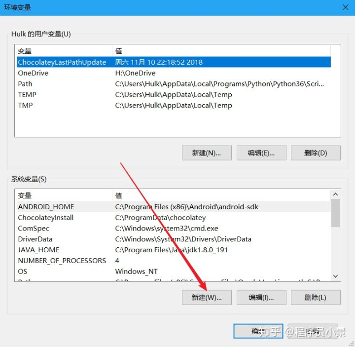
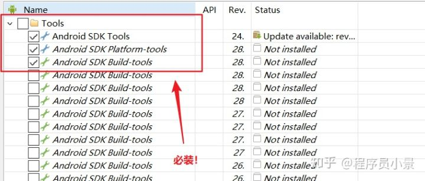
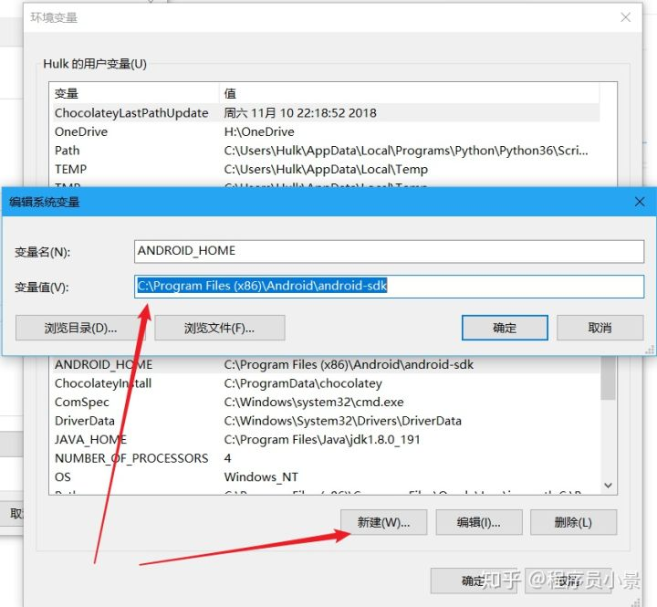
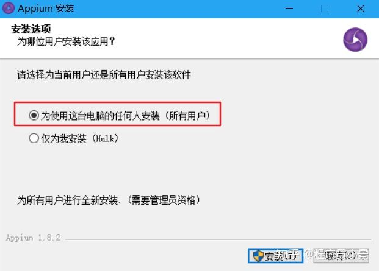
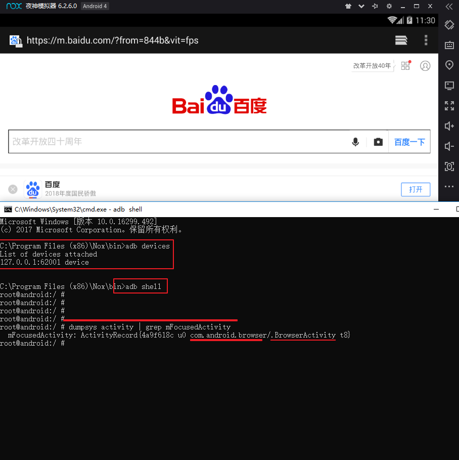
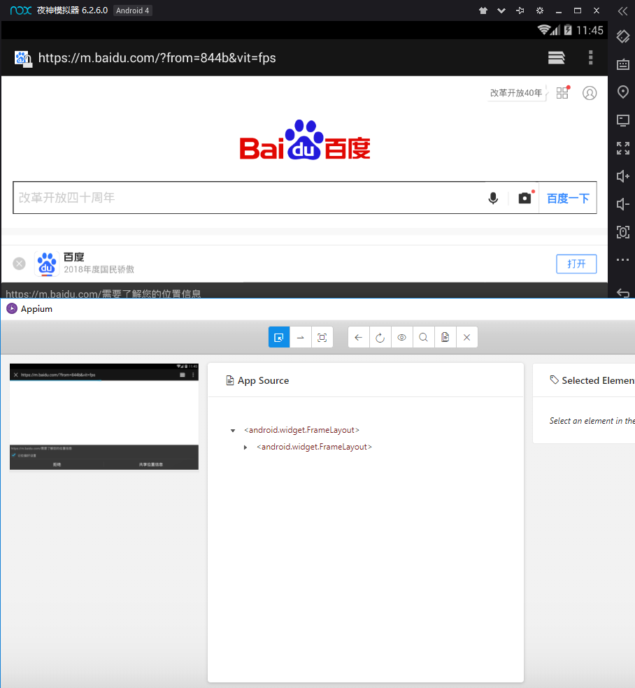
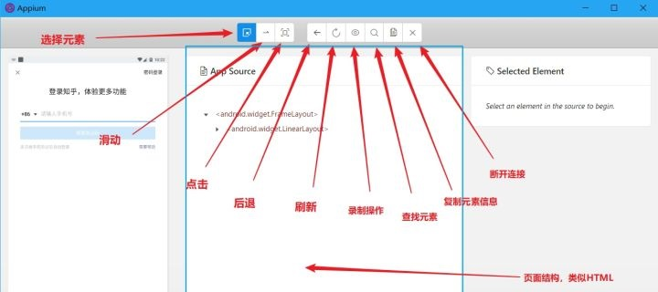
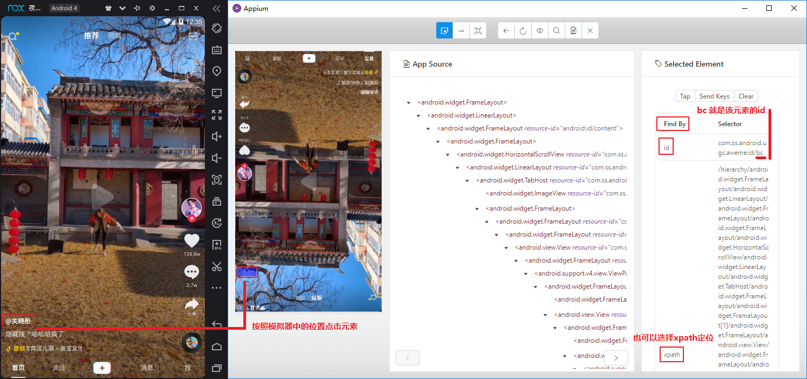

## 09.appium与移动自动化

### 一、环境搭建

以win10为例

#### 1.安装node.js

点击进入 https://nodejs.org/zh-cn/下载安装包，下载完毕后双击安装包，然后一路狂点下一步，安装完成后在cmd终端中输入 `node -v`，显示版本号则表示安装成功。


#### 2.安装java JDK

点击进入官网下载页面 https://www.oracle.com/technetwork/java/javase/downloads/jdk8-downloads-2133151.html，注意下载位置，点击同意协议并下载相应的版本。


双击安装包，然后同样**一路狂点下一步**，


然后分别添加环境变量




```shell
C:\Program Files\Java\jdk1.8.0_191
CLASSPATH
# 注意最开始有个点
.;%JAVA_HOME%\lib\dt.jar;%JAVA_HOME%\lib\tools.jar;

JAVA_HOME
C:\Program Files\Java\jdk1.8.0_191

Path
%JAVA_HOME%\bin
%JAVA_HOME%\jre\bin
```

> 在cmd终端中输入java和javac不报异常，说明安装成功

#### 3.安装android SDK

进入网站 https://www.androiddevtools.cn/，依次点击AndroidSDK工具>>SDK Tools>>会跳转到以下界面，Windows建议选择.exe后缀。


下载后安装


> 如果不小心关闭了，或者没有自动打开上边的界面，点击安装目录下的SDK Mansger.exe文件，同样可以打开，已经自动打开的忽略此步。





下载完成后，你的sdk文件夹下，应该是这样的


接下来配置环境变量

```sh
ANDROID_HOME
C:\...\Android\android-sdk

Path
%ANDROID_HOME%\tools
%ANDROID_HOME%\platform-tools
```




#### 4.安装Appium

进入该网站  http://appium.io/ (需要科学上网)  ，点击下载并安装。




#### 5.安装夜神模拟器

进入该网站 https://www.yeshen.com/下载夜神模拟器，下载完成后不要忙着打开夜神模拟器，**先确保你的电脑Hyper-V是关闭的，否则启动模拟器时部分电脑会蓝屏重启。**


**把安卓sdk中的adb.exe复制两份，其中一个改名为nox_adb.exe后，放到夜神模拟器安装目录的bin目录下覆盖原文件**


#### 6.联调测试环境

##### (1)开启并设置夜神安卓模拟器


##### (2)adb命令建立连接

在夜神模拟器安装路径下的bin目录下执行cmd进入终端，输入 `adb devices`后，出现提示

```shell
List of devices attached
* daemon not running; starting now at tcp:5037
* daemon started successfully
```

再输入 `nox_adb.exe connect 127.0.0.1:62001`后，出现提示

```
connected to 127.0.0.1:62001
```

最后再次输入`adb devices`后，出现提示

```
List of devices attached
127.0.0.1:62001 device
```


##### (3)开启Appium并配置运行

- 首先获取app包名和进程名

打开夜神模拟器中的浏览器，在adb连接正确的情况下，在夜神模拟器安装目录的bin目录下的cmd中输入`adb shell`，进入adb shell后输入 `dumpsys activity | grep mFocusedActivity`得到的`com.android.browser`就是app包名`.BrowserActivity`就是进程名。



- 启动Appium，点击start server


- 点击放大镜进入并输入测试配置


- 配置参数的来源

```
platformName 系统名 Android
platformVersion 系统版本 4.4.2
deviceName 手机型号 SM-G955F
appPackage app的包名 com.android.browser
appActivity app的进程名 .BrowserActivity
```


- 关闭夜神模拟器中的浏览器，点击右下角的start session查看运行结果



### 二、利用appium自动控制移动设备并提取数据

> 以控制抖音app滑动并获取抖音短视频发布者昵称和点赞数等信息为例

#### 1.安装appium-python-client模块

```
pip install appium-python-client
```

#### 2.启动夜神模拟器，进入夜神模拟器所在的安装路径的bin目录下，进入cmd终端，使用adb命令建立adb server和模拟器的连接

```
C:\Program Files (x86)\Nox\bin>adb devices
List of devices attached
* daemon not running; starting now at tcp:5037
* daemon started successfully

C:\Program Files (x86)\Nox\bin>nox_adb.exe connect 127.0.0.1:62001
already connected to 127.0.0.1:62001

C:\Program Files (x86)\Nox\bin>adb devices
List of devices attached
127.0.0.1:62001 device
```

#### 3.启动appium-desktop，点击start server启动appium服务

```sh
[Appium] Welcome to Appium v1.10.0
[Appium] Appium REST http interface listener started on 0.0.0.0:4723
```

#### 4.获取Desired Capabilities参数

首先打开设置>关于平板电脑>查看型号=>获取模拟设备的型号，然后获取app包名称 以及 app进程名

- 打开模拟器中的抖音短视频app

- 在adb连接正确的情况下，在夜神模拟器安装目录的bin目录下的cmd中输入`adb shell`

- 进入adb shell后输入 `dumpsys activity | grep mFocusedActivity`

- `com.ss.android.ugc.aweme`就是app包名

- `.main.MainActivity`就是进程名 注意前边有个点.

#### 5.初始化以及获取移动设备分辨率

```python
from appium import webdriver

# 初始化配置，设置Desired Capabilities参数
desired_caps = {
    'platformName': 'Android',
    'deviceName': 'SM-G955F',
    'appPackage': 'com.ss.android.ugc.aweme',
    'appActivity': '.main.MainActivity'
}
# 指定Appium Server
server = 'http://localhost:4723/wd/hub'
# 新建一个driver
driver = webdriver.Remote(server, desired_caps)
# 获取模拟器/手机的分辨率(px)
width = driver.get_window_size()['width']
height = driver.get_window_size()['height']
print(width, height)
```

#### 6.定位元素以及提取文本的方法

点击appium desktop右上角的放大镜图标，如图填写配置，并点击start session


定位界面的使用方法如下图所示



点击短视频的作者名字，查看并获取该元素的id



在python使用代码通过元素id获取该元素的文本内容

```python
# 获取视频的各种信息：使用appium desktop定位元素
print(driver.find_element_by_id('bc').text)  # 发布者名字
print(driver.find_element_by_id('al9').text)  # 点赞数
print(driver.find_element_by_id('al_').text)  # 留言数
print(driver.find_element_by_id('a23').text)  # 视频名字，可能不存在，报错
```

#### 7.控制抖音app滑动

```python
start_x = width // 2  # 滑动的起始点的x坐标，屏幕宽度中心点
start_y = height // 3 * 2  # 滑动的起始点的y坐标，屏幕高度从上开始到下三分之二处
distance = height // 2  # y轴滑动距离：屏幕高度一半的距离
end_x = start_x # 滑动的终点的x坐标
end_y = start_y-distance # 滑动的终点的y坐标
# 滑动
driver.swipe(start_x, start_y, end_x, end_y)
```

> 整理并完成自动滑动的代码

```python
import time
from appium import webdriver


class DouyinAction():
    """自动滑动，并获取抖音短视频发布者的id"""
    def __init__(self, nums:int=None):
        # 初始化配置，设置Desired Capabilities参数
        self.desired_caps = {
            'platformName': 'Android',
            'deviceName': 'SM-G955F',
            'appPackage': 'com.ss.android.ugc.aweme',
            'appActivity': '.main.MainActivity'
        }
        # 指定Appium Server
        self.server = 'http://localhost:4723/wd/hub'
        # 新建一个driver
        self.driver = webdriver.Remote(self.server, self.desired_caps)
        # 获取模拟器/手机的分辨率(px)
        width = self.driver.get_window_size()['width']
        height = self.driver.get_window_size()['height']
        print(width, height)
        # 设置滑动初始坐标和滑动距离
        self.start_x = width//2 # 屏幕宽度中心点
        self.start_y = height//3*2 # 屏幕高度从上开始到下三分之二处
        self.distance = height//2 # 滑动距离：屏幕高度一半的距离
        # 设置滑动次数
        self.nums = nums

    def comments(self):
        # app开启之后点击一次屏幕，确保页面的展示
        time.sleep(2)
        self.driver.tap([(500, 1200)], 500)

    def scroll(self):
        # 无限滑动
        i = 0
        while True:
            # 模拟滑动
            print('滑动ing...')
            self.driver.swipe(self.start_x, self.start_y,
                              self.start_x, self.start_y-self.distance)
            time.sleep(1)
            self.get_infos() # 获取视频发布者的名字
            # 设置延时等待
            time.sleep(4)
            # 判断是否退出
            if self.nums is not None and self.nums == i:
                break
            i += 1

    def get_infos(self):
        # 获取视频的各种信息：使用appium desktop定位元素
        print(self.driver.find_element_by_id('bc').text) # 发布者名字
        print(self.driver.find_element_by_id('al9').text) # 点赞数
        print(self.driver.find_element_by_id('al_').text) # 留言数
        print(self.driver.find_element_by_id('a23').text) # 视频名字，可能不存在，报错

        # # 点击【分享】坐标位置 671,1058
        # self.driver.tap([(671, 1058)])
        # time.sleep(2)
        # # 向左滑动露出 【复制链接】 580，1100 --> 200, 1100
        # self.driver.swipe(580,1100, 20, 200, 1100)
        # # self.driver.get_screenshot_as_file('./a.png') # 截图
        # # 点击【复制链接】 距离右边60 距离底边170 720-60，1280-170
        # self.driver.tap([(660, 1110)])
        # # self.driver.get_screenshot_as_file('./b.png')  # 截图

    def main(self):
        self.comments() # 点击一次屏幕，确保页面的展示
        time.sleep(2)
        self.scroll() # 滑动


if __name__ == '__main__':

    action = DouyinAction(nums=5)
    action.main()
```

> 可以使用fiddler等抓包工具利用appium+mitmproxy+wget等python模块自动获取抖音视频文件。