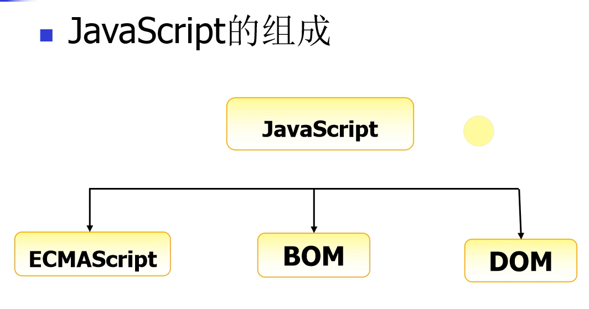
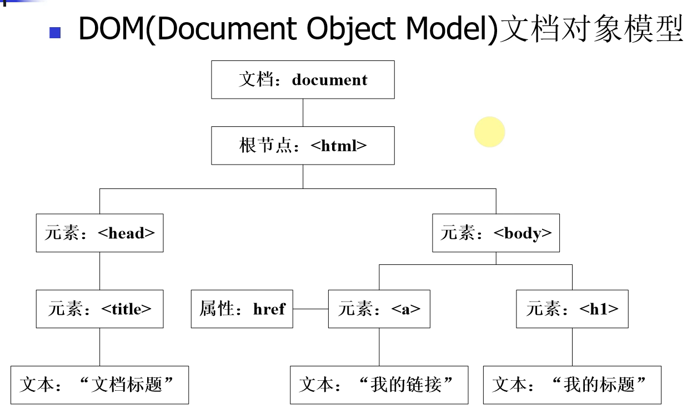
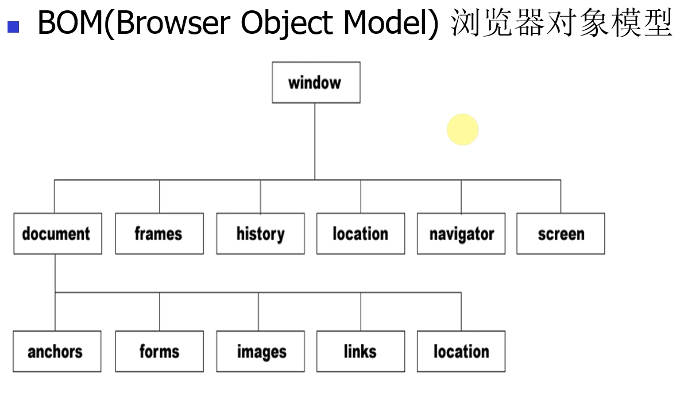

## js基础

### 变量和数据类型

#### 1. 定义变量

- `javaScript `是一种弱类型语言，也就是说不需要指定变量的类型，JavaScript的变量类型由它的值来决定， 定义变量需要用关键字 'var', 一条JavaScript语句应该以“;”结尾

**定义变量的语法格式:**

- var 变量名 = 值;

```JavaScript
 var iNum = 123;
 var sTr = 'asd';

 //同时定义多个变量可以用","隔开，公用一个‘var’关键字

 var iNum = 45,sTr='qwe',sCount='68';
```

#### 2. JavaScript注释

- JavaScript的注释分为单行注释(//注释内容)和多行注释(/*多行注释*/)

```JavaScript
// 单行注释
var iNum = 123;
/*  
    多行注释
    1、...
    2、...
*/
var sTr = 'abc123';

```

#### 3. 数据类型

js中有六种数据类型，包括五种基本数据类型和一种复杂数据类型(object)。

5种基本数据类型：

1. number 数字类型
2. string 字符串类型
3. boolean 布尔类型 true 或 false
4. undefined undefined类型，变量声明未初始化，它的值就是undefined
5. null null类型，表示空对象，如果定义的变量将来准备保存对象，可以将变量初始化为null,在页面上获取不到对象，返回的值就是null

1种复合类型：

1. object 后面学习的**数组、函数和JavaScript对象**都属于复合类型

```JavaScript
//1.1 数字 number
var iOne = 10.1;

//1.2 字符串 string
var sStr = '1234';

//1.3 布尔 boolean; 
var bIsTrue = false;

//1.4 未定义 undefined
var unData;

//1.5 null 表示空对象
var nullData = null;
//因为在 JS 的最初版本中，使用的是 32 位系统，为了性能考虑使用低位存储了变量的类型信息，000 开头代表是对象，然而 null 表示为全零，所以将它错误的判断为 object 。虽然现在的内部类型判断代码已经改变了，但是对于这个 Bug 却是一直流传下来。

//1.6 object 表示对象类型
var oObj = {
   name:"隔壁老王",
   age:88
}
// 获取变量的类型
var type = typeof(oObj);
alert(type);
// 获取对象的name属性
alert(oObj.name);
```

#### 4. 变量命名规范

1. 区分大小写
2. 第一个字符必须是字母、下划线（_）或者美元符号（$）
3. 其他字符可以是字母、下划线、美元符或数字


### 四.函数定义和调用

#### 1. 函数定义

- 函数就是可以**重复使用的代码块**, 使用关键字 **function** 定义函数。

```JavaScript

    // 函数定义
    function fnAlert(){
        alert('hello!');
    }

```

#### 2. 函数调用

- 函数调用就是**函数名加小括号**，比如:函数名(参数[参数可选])

```JavaScript
    // 函数定义
    function fnAlert(){
        alert('hello!');
    }
    // 函数调用
    fnAlert();
```

#### 3. 定义有参数有返回值的函数

- 定义函数时，函数如果有参数，**参数放到小括号里面**，函数如果有返回值，返回值通过 **return** 关键字来返回
- `arguments`关键字可以直接用来接受参数

```JavaScript

function fnAdd(iNum01,iNum02){
    var iRs = iNum01 + iNum02;
    return iRs;
    alert('here!');
}

var iCount = fnAdd(3,4);
alert(iCount);  //弹出7

```

#### 4 内部函数外部调用

```javascript
var _xl;
!(function () {
    function xl(){
        console.log('hello')
    }
    _xl = xl;
})();
_xl()
```


**函数中'return'关键字的作用:**

1. 返回函数中的值
2. 执行完return函数执行结束

### 五.变量作用域

#### 1. 变量作用域的介绍

变量作用域就是变量的使用范围，变量分为:

- 局部变量
  - 局部变量就是在函数内使用的变量，只能在函数内部使用。

```javascript
    function myalert()
    {
        // 定义局部变量
        var b = 23;
        alert(b);
    }
    myalert(); // 弹出23
    alert(b);  // 函数外使用出错
```

- 全局变量
  - 全局变量就是在函数外定义的变量，可以在不同函数内使用。

```JavaScript
    // 定义全局变量
    var a = 12;
    function myalert()
    {
        // 修改全局变量
        a++;
    }
    myalert();
    alert(a);  // 弹出13  
```

#### 2. JavaScript 变量生命周期

+ JavaScript 变量生命周期在它声明时初始化。
+ 局部变量在函数执行完毕后销毁。
+ 全局变量在页面关闭后销毁。


### 六.条件语句

#### 1. 条件语句的介绍

- 条件语句就是通过条件来控制程序的走向

#### 2. 条件语句语法

1. if 语句 - 只有当指定条件为 true 时，使用该语句来执行代码
2. if...else 语句 - 当条件为 true 时执行代码，当条件为 false 时执行其他代码
3. if...else if....else 语句 - 使用该语句来判断多条件，执行条件成立的语句

#### 3. 比较运算符

假如 x = 5, 查看比较后的结果:

| 比较运算符 | 描述           | 例子                                |
| ---------- | -------------- | ----------------------------------- |
| ==         | 等于           | x == 8 为 false                     |
| ===        | 全等(值和类型) | x === 5 为 true; x === "5" 为 false |
| !=         | 不等于         | x != 8 为 true                      |
| >          | 大于           | x > 8 为 false                      |
| <          | 小于           | x < 8 为 true                       |
| >=         | 大于或等于     | x >= 8 为 false                     |
| <=         | 小于或等于     | x <= 8 为 true                      |

**比较运算符示例代码:**

```javascript
var iNum01 = 12;
var sNum01 = '12';

if(iNum01==12){
    alert('相等！');
}
else{
    alert('不相等！')
}

// "==" 符号默认会将符号两边的变量转换成数字再进行对比，这个叫做隐式转换
if(sNum01==12){
    alert('相等！');
}
else{
    alert('不相等！')
}

// "===" 符号不会转换符号两边的数据类型
if(sNum01===12){
    alert('相等！');
}
else{
    alert('不相等！')
}

// 多条件判断
var sFruit = "苹果";
if (sFruit == "苹果") {
    alert("您选择的水果是苹果");
} else if (sFruit == "鸭梨") {
    alert("您选择的水果是鸭梨");
} else {
    alert("对不起，您选择的水果不存在!")
}
```

#### 4. 三目运算

```javascript
// 不带返回值
5>3?alert('5大'):alert('3大');// 即    if(5>3){alert('5大')}else{alert('3大')};
// 带返回值
var a = 1;
var b = 2;
var max = a>b?a:b;
// 多条三目运行
a = 2
b = 3

console.log(a > b ? 1 : a==0 ? 1 : 2);
```

 **注意：三目运算和if(){}else{}的区别是三目运算有返回值**


#### 5. 逻辑运算符

假如 x=6, y=3, 查看比较后的结果:

| 比较运算符 | 描述 | 例子                      |
| ---------- | ---- | ------------------------- |
| &&         | and  | (x < 10 && y > 1) 为 true |
| \|\|       | or   | (x==5 \|\| y==5) 为 false |
| !          | not  | !(x==y) 为 true           |

**逻辑运算符示例代码:**

```
var x = 6;
var y = 3;

if(x < 10 && y > 1){
    alert('都大于');
}
else{
    alert('至少有一个不大于');
}

if(x > 5 || y > 7 ){
    alert('至少有一个大于');
}
else{
    alert('都不大于');
}

if(!(x == y)){
    alert('等于')
}
else{
    alert('不等于')
}
```


### 七.数组及操作方法

#### 1. 数组的介绍

数组就是一组数据的集合，`javascript` 中，数组里面的数据可以是不同类型的数据，好比 python 里面的列表。

#### 2. 数组的定义

```
// 实例化对象方式创建
var aList = new Array(1,2,3);

// 字面量方式创建，推荐使用
var aList2 = [1,2,3,'asd'];
```

#### 3. 多维数组

多维数组指的是数组的成员也是数组，把这样的数组叫做多维数组。

```
var aList = [[1,2,3],['a','b','c']];

```

#### 4. 数组的操作

1、 获取数组的长度

```
var aList = [1,2,3,4];
alert(aList.length); // 弹出4

```

2、 根据下标取值

```
var aList = [1,2,3,4];
alert(aList[0]); // 弹出1

```

3、 从数组最后添加和删除数据

```
var aList = [1,2,3,4];
aList.push(5);
alert(aList); //弹出1,2,3,4,5
aList.pop();
alert(aList); // 弹出1,2,3,4

```

4、根据下标添加和删除元素

`arr.splice(start,num,element1,.....,elementN)`

参数解析：

1. start：必需，开始删除的索引。
2. `num`：可选，删除数组元素的个数。
3. `elementN`：可选，在start索引位置要插入的新元素。

此方法会删除从start索引开始的`num`个元素，并将`elementN`参数插入到start索引位置。

```
var colors = ["red", "green", "blue"];
colors.splice(0,1);  //删除第一项
alert(colors);  //green,blue

colors.splice(1, 0, "yellow", "orange");  //从第一个索引位置插入两项数据
alert(colors);  //green,yellow,organge,blue

colors.splice(1, 1, "red", "purple");  //删除一项，插入两项数据
alert(colors);  //green,red,purple,orange,blue

```


### 八.对象

#### 1.什么是对象

现实生活中:万物皆对象，对象是一个具体的事物，看得见摸得着的实物。例如，一本书、一辆汽车、一个人可以是“对象”，一个数据库、一张网页、一个与远程服务器的连按也可以是“对象”。

在JavaScript 中，对象是一组无序的相关属性和方法的集合，所有的事物都是对象，例如字符串、数值、数组.函数等。

对象是由属性和方法组成的。

- 属性:事物的特征，在对象中用属性来表示(常用名词)
- 方法:事物的行为，在对象中用方法来表示(常用动词)

#### 2.创建对象的三种方式

- 利用字面量创建对象
- 利用new object创建对象
- 利用构造函数创建对象

##### 1.利用字面量创建对象

对象字面量:就是花括号里面包含了表达这个具体事物(对象)的属性和方法

```
<script>
// 利用对象字面量创建对象 {}
// var obj = ; 
// 创建了一个空的对象
var obj = {
	uname:张三疯'
	age: 18
	sex:男'， I
	sayHi: function(){
      console.log('hello world')
	}
	// (1) 里面的属性或者方法我们采取键值对的形式 键 属性名 : 值 属性值
	// (2) 多个属性或者方法中间用逗号隔开的
	// (3) 方法冒号后面跟的是一个匿名函数
	// 2.使用对象
	// (1).调用对象的属性 我们采取 对象名.属性名 
	// (2). 调用属性还有一种方法 对象名["属性名"]
	// (3).调用对象的方法   对象名.方法名()
</script>
```

##### 2.利用new object创建对象

```
<script>
// 利用 new object 创建对象
var obj = new object(); 
// 创建了一个空的对象
obj.uname =张三疯';
obj.age = 18;
obj.sex ='男';
obj.sayHi = function(){
	console.log("hi~');
	}
	//(1) 我们是利用 等号 = 赋值的方法 添加对象的属性和方法
	// (2) 每个属性和方法之间用 分号结束
</script>
```

##### 3.利用构造函数创建对象

- 为什么要通过构造函数创建对象？
  - 因为我们前面两种创建对象的方式一次只能创建一个对象，里面很多的属性和方法是大量相同的 我们只能复制
  - 因此我们可以利用函数的方法 重复这些相同的代码 我们就把这个函数成为**构造函数**

**构造函数**:是一种特殊的函数，主要用来初始化对象，即为对象成员变量赋初始值，它总与new 运算符一起使用。我们可以把对象中一些公共的属性和方法抽取出来，然后封装到这个函数里面。

​	

```
<script>
//利用构造函数创建对象
//我们需要创建四大天王的对象相同的属性: 名字 年龄 性别 相同的方法:唱歌
//构造函数的语法格式
// function 构造函数名(){
//	this.属性 = 值;
//	this.方法 = function()}
//	}

// new 构造函数名();

function Star(uname, age, sex){ 
	this.name = uname;
	this.age = age;
	this.sex = sex;
	this.sing = function (sang) {
        console.log(sang)
    }
	}
var ldh = new Star("刘德华",18, "男");
console.log(typeof ldh);
console.log(ldh.age);
console.log(ldh['name']);
ldh.sing('冰雨');


</script>
```


### 九.定时器

#### 1. 定时器的介绍

定时器就是在一段特定的时间后执行某段程序代码。

#### 2. 定时器的使用：

`js `定时器有两种创建方式：

1. `setTimeout(func[, delay, param1, param2, ...])` ：以指定的时间间隔（以毫秒计）调用一次函数的定时器
2. `setInterval(func[, delay, param1, param2, ...]) `：以指定的时间间隔（以毫秒计）重复调用一个函数的定时器

**`setTimeout`函数的参数说明:**

- 第一个参数 `func` , 表示定时器要执行的函数名
- 第二个参数 delay, 表示时间间隔，默认是0，单位是毫秒
- 第三个参数 `param1`, 表示定时器执行函数的第一个参数，一次类推传入多个执行函数对应的参数。

```
<script> 
    function hello(){ 
        alert('hello'); 
    } 

    // 执行一次函数的定时器
    setTimeout(hello, 500);
</script>
```

**`setInterval`函数的参数说明:**

- 第一个参数 `func` , 表示定时器要执行的函数名
- 第二个参数 delay, 表示时间间隔，默认是0，单位是毫秒
- 第三个参数 `param1`, 表示定时器执行函数的第一个参数，一次类推传入多个执行函数对应的参数。

```
<script> 
    function hello(){ 
        alert('hello'); 
    } 
    // 重复执行函数的定时器
    setInterval(hello, 1000);
</script>

```

#### 3. 清除定时器

`js `清除定时器分别是:

- `clearTimeout(timeoutID)` 清除只执行一次的定时器(`setTimeout`函数)
- `clearInterval(timeoutID)` 清除反复执行的定时器(`setInterval`函数)

**`clearTimeout`函数的参数说明:**

- `timeoutID` 为调用 `setTimeout` 函数时所获得的返回值，使用该返回标识符作为参数，可以取消该 `setTimeout` 所设定的定时执行操作。

```
<script>
    function hello(){
        alert('hello');
        
    }
    // 执行一次函数的定时器
    t1 = setTimeout(hello, 500);
    // 清除只执行一次的定时器
        clearTimeout(t1)
</script>
```

**`clearInterval`函数的参数说明:**

- `timeoutID` 为调用 `setInterval` 函数时所获得的返回值，使用该返回标识符作为参数，可以取消该 `setInterval` 所设定的定时执行操作。

```
<script> 
    function hello(){ 
        alert('hello'); 
    } 
    // 重复执行函数的定时器
    var t1 = setInterval(hello, 1000);

    function stop(){
        // 清除反复执行的定时器
        clearInterval(t1); 
    }  

</script> 

<input type="button" value="停止" onclick="stop();">
```


### 十. `json`

#### 1.  `json`的介绍

- `json`是 JavaScript Object Notation 的首字母缩写，翻译过来就是`javascript`对象表示法，这里说的`json`就是**类似于`javascript`对象的字符串**，它同时是一种**数据格式**，目前这种数据格式比较流行，逐渐替换掉了传统的`xml`数据格式。

#### 2. `json`的格式

`json`有两种格式：

1. 对象格式
2. 数组格式

**对象格式:**

对象格式的`json`数据，使用一对大括号({})，大括号里面放入`key:value`形式的键值对，多个键值对使用逗号分隔。

**对象格式的`json`数据:**

```
{
    "name":"tom",
    "age":18
}
```

**格式说明:**

`json`中的(key)属性名称和字符串值需要用**双引号**引起来，用单引号或者不用引号会导致读取数据错误。

**数组格式:**

数组格式的`json`数据，使用一对中括号([])，中括号里面的数据使用逗号分隔。

**数组格式的`json`数据:**

```
["tom",18,"programmer"]
```

**实际开发的`json`格式比较复杂,例如:**

```
{
    "name":"jack",
    "age":29,
    "hobby":["reading","travel","photography"]
    "school":{
        "name":"Merrimack College",
        "location":"North Andover, MA"
    }
}
```

#### 3. `json`数据转换成JavaScript对象

**`json`本质上是字符串**，如果在`js`中操作`json`数据，可以将`json`字符串转化为JavaScript对象。

**示例代码:**

```
var sJson = '{"name":"tom","age":18}';
var oPerson = JSON.parse(sJson);

// 操作属性
alert(oPerson.name);
alert(oPerson.age);
```


### 十一. `ajax`

#### 1. `ajax`的介绍

`ajax` 是 Asynchronous JavaScript and XML的简写，`ajax`一个前后台配合的技术，它可以**让 `javascript` 发送异步的 `http` 请求，与后台通信进行数据的获取**，`ajax` 最大的优点是**实现局部刷新**，`ajax`可以发送`http`请求，当获取到后台数据的时候更新页面显示数据实现局部刷新，在这里大家只需要记住，**当前端页面想和后台服务器进行数据交互就可以使用`ajax`了。**

这里提示一下大家, **在`html`页面使用`ajax`需要在web服务器环境下运行, 一般向自己的web服务器发送`ajax`请求。**

#### 2. `ajax`的使用

`jquery`将它封装成了一个方法`$.ajax()`，我们可以直接用这个方法来执行`ajax`请求。

**示例代码:**

```
<script>
    $.ajax({
    // 1.url 请求地址
    url:'https://image.baidu.com/search/acjson?tn=resultjson_com&logid=9427531757301067696&ipn=rj&ct=201326592&is=&fp=result&fr=ala&word=%E5%9B%BE%E7%89%87&queryWord=%E5%9B%BE%E7%89%87&cl=2&lm=-1&ie=utf-8&oe=utf-8&adpicid=&st=&z=&ic=&hd=&latest=&copyright=&s=&se=&tab=&width=&height=&face=&istype=&qc=&nc=&expermode=&nojc=&isAsync=&pn=120&rn=30&gsm=78&1685437399327=',
    // 2.type 请求方式，默认是'GET'，常用的还有'POST'
    type:'GET',
    // 3.dataType 设置返回的数据格式，常用的是'json'格式
    dataType:'JSON',
    // 4.data 设置发送给服务器的数据, 没有参数不需要设置

    // 5.success 设置请求成功后的回调函数
    success:function (response) {
        console.log(response);    
    },
    // 6.error 设置请求失败后的回调函数
    error:function () {
        alert("请求失败,请稍后再试!");
    },
    // 7.async 设置是否异步，默认值是'true'，表示异步，一般不用写
    async:true
});
</script>
```

**注意：** 由于版本的不同回调方法有一定的差异，请求成功也有可能是done/then，请求失败是faile

**`ajax`方法的参数说明:**

1. `url`请求地址
2. type 请求方式，默认是'GET'，常用的还有'POST'
3. `dataType` 设置返回的数据格式，常用的是`json`格式
4. data 设置发送给服务器的数据，没有参数不需要设置
5. success 设置请求成功后的回调函数
6. error 设置请求失败后的回调函数
7. `async `设置是否异步，默认值是'true'，表示异步，一般不用写
8. 同步和异步说明
   - 同步是一个`ajax`请求完成另外一个才可以请求，需要等待上一个`ajax`请求完成，好比线程同步。
   - 异步是多个`ajax`同时请求，不需要等待其它`ajax`请求完成， 好比线程异步。


### 十二. 浏览器window对象属性


####  1. JavaScript的组成




JavaScript可以分为三个部分：[ECMAScript](https://so.csdn.net/so/search?q=ECMAScript&spm=1001.2101.3001.7020)标准、DOM、`BOM`。

- `ECMAScript`标准

  ​	即`JS`的基本语法，JavaScript的核心，描述了语言的基本语法和数据类型，`ECMAScript`是一套标准，定义了一种语言的标准与具体实现无关。

  

- DOM

  即文档对象模型，Document Object Model，用于操作页面元素，DOM可以把HTML看做是文档树，通过DOM提供的`API`可以对树上的节点进行操作。

  

- `BOM`
  即浏览器对象模型，Browser Object Model，用于操作浏览器，比如：弹出框、控制浏览器跳转、获取分辨率等。



#### 2. docment常见属性对象

​	document对象其实是window对象下的一个子对象，它操作的是HTML文档里所有的内容。事实上，浏览器每次打开一个窗口，就会为这个窗口生成一个window对象，并且会为这个窗口内部的页面（即HTML文档）自动生成一个document对象，然后我们就可以通过document对象来操作页面中所有的元素。

| 属性                                | 说明                                   |
| :---------------------------------- | -------------------------------------- |
| `document.title`                    | 获取文档的title                        |
| `document.forms`                    | 获取所有form元素                       |
| `document.images`                   | 获取所有`img`元素                      |
| `document.links`                    | 获取所有a元素                          |
| `document.cookie`                   | 文档的cookie                           |
| `document.URL`                      | 当前文档的URL                          |
| `document.referrer`                 | 返回使浏览者到达当前文档的URL          |
| `document.write`                    | 页面载入过程中，用脚本加入新的页面内容 |
| `document.getElementById()`         | 通过id获取元素                         |
| `document.getElementsByTagName()`   | 通过标签名获取元素                     |
| `document.getElementsByClassName()` | 通过class获取元素                      |
| `document.getElementsByName()`      | 通过name获取元素                       |
| `document.querySelector()`          | 通过选择器获取元素，只获取第1个        |
| `document.querySelectorAll()`       | 通过选择器获取元素，获取所有           |
| `document.createElement()`          | 创建元素节点                           |
| `document.createTextNode()`         | 创建文本节点                           |
| `document.write()`                  | 输出内容                               |
| `document.writeln()`                | 输出内容并换行                         |
|                                     |                                        |

​	

**代码演示**

```
<Script>
  console.log(document.forms);
  console.log(document.body);
  console.log(document.links);
  console.log(document.images);
  document.write('你的网址是' + document.URL);
  document.write('12342345345')
</Script>


<form action="">
    <lable>你好</lable>
    <input type="text">

</form>
123123423
<div>21334</div>
<a href="">数据</a>
<a href="">新浪</a>
<a href="">百度</a>


```


**注意**：由于window对象是包括document对象的，所以我们可以“简单”地把`BOM`和DOM的关系理解成：`BOM`包含DOM。只不过对于文档操作来说，我们一般不把它看成是`BOM`的一部分，而是看成独立的，也就是DOM。


#### 3. window对象的navigator属性

​	`window.navigator`返回一个navigator对象的引用,可以用它来查询一些关于运行当前脚本的应用程序的相关信息.

| 方法                      | 说明         |
| ------------------------- | ------------ |
| `navigator.appCodeName`   | 浏览器代号   |
| `navigator.appName`       | 浏览器名称   |
| `navigator.appVersion`    | 浏览器版本   |
| `navigator.cookieEnabled` | 启用Cookies  |
| `navigator.platform`      | 硬件平台     |
| `navigator.userAgent`     | 用户代理     |
| `navigator.language`      | 用户代理语言 |

**代码示例**

```
        <Script>

    txt = "<p>浏览器代号: " + navigator.appCodeName + "</p>";
    txt+= "<p>浏览器名称: " + navigator.appName + "</p>";
    txt+= "<p>浏览器版本: " + navigator.appVersion + "</p>";
    txt+= "<p>启用Cookies: " + navigator.cookieEnabled + "</p>";
    txt+= "<p>硬件平台: " + navigator.platform + "</p>";
    txt+= "<p>用户代理: " + navigator.userAgent + "</p>";
    txt+= "<p>用户代理语言: " + navigator.language + "</p>";
    document.write(txt);

        </Script>
```


#### 4. Window对象的Location属性

`window.location` 对象用于获得当前页面的地址 (URL)，并把浏览器重定向到新的页面。

**`window.location`** 对象在编写时可不使用 window 这个前缀


- `location.hostname` 返回 web 主机的域名
- `location.pathname` 返回当前页面的路径和文件名
- `location.port` 返回 web 主机的端口 （80 或 443）
- `location.protocol `返回所使用的 web 协议（`http`: 或 `https:`）
- `window.location.hre`f='http://www.baidu.com'  重定向到百度

#### 5. Window frames 属性

frames 属性返回窗口中所有命名的框架。


#### 6. window history属性

`BOM`中的window对象通过`window.history`方法提供了对浏览器历史记录的读取，让你可以在用户的访问记录中前进和后退。

使用back(),forward(),和go()方法可以在用户的历史记录中前进和后退


#### 7. Window Screen属性

`window.screen` 对象包含有关用户屏幕的信息。

**`window.screen`**对象在编写时可以不使用 window 这个前缀。

一些属性：

- `screen.availWidth` - 可用的屏幕宽度
- `screen.availHeight` - 可用的屏幕高度

