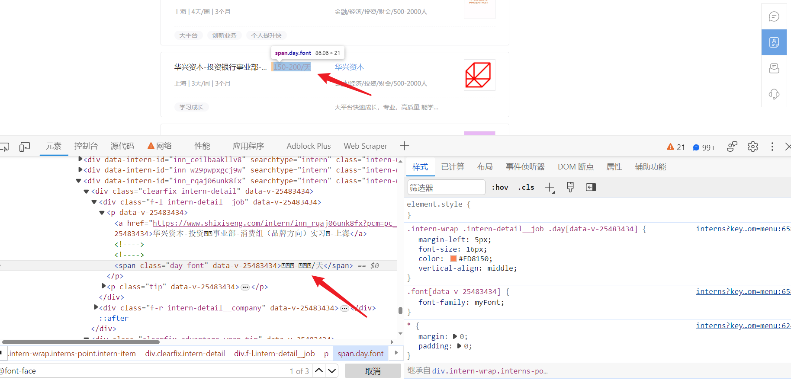
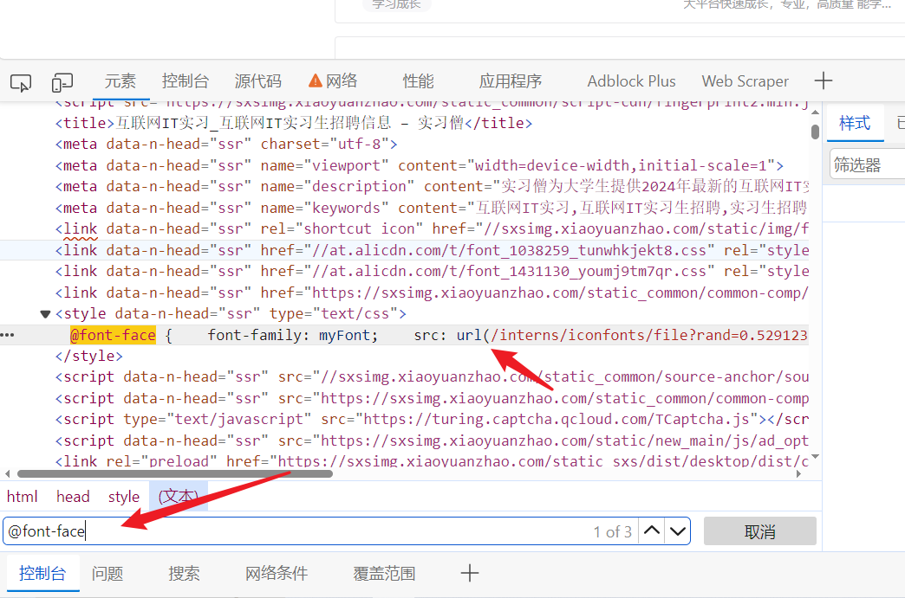
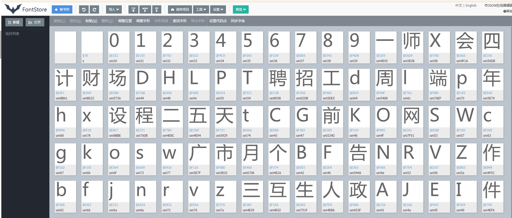
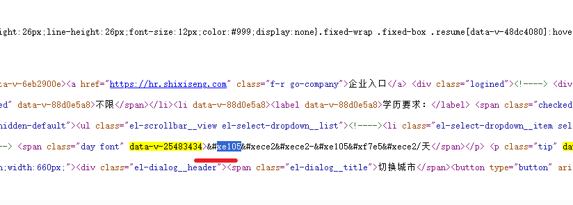
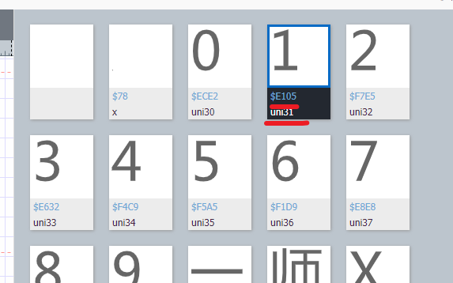

## 字体反爬

**学习目标:**

1. 了解 字体反爬原理
2. 熟悉 字体解析过程


### 一. 字体加密原理

- 简单而言就是利用前端技术干扰，页面可以正常展示，而使用爬虫下载后无法提取正常的数据。
- 在 `CSS3 `之前，`Web` 开发者必须使用用户计算机上已有的字体。目前的技术开发者可以使用`@font-face`为网页指定字体，开发者可将心仪的字体文件放在 Web 服务器上，并在` CSS` 样式中使用它。用户使用浏览器访问 `Web应用`时，对应的字体会被浏览器下载到用户的计算机上。

**注：**使用自动化`selenium`也无法获取正常的数据


### 二.字体文件处理方式

#### 1. 字体加密特点

- 实例:https://www.shixiseng.com/interns?keyword=互联网IT&city=全国&type=intern&from=menu 
- 字体加密的特点
  - 在网页上显示正常,在源码里面看到的是乱码或者是问号



#### 2. 定位字体位置 

- 字体加密会有个映射的字体文件
- 可以在元素面板搜索`@font-face`会通过这个标签指定字体文件,可以直接在页面上搜索,找到他字体的网址



- 可以直接把字体文件下载下来, 文件可以一般需要自己修改后缀(网页的字体后缀一般选用woff)

  1. `TTF`：这是Windows操作系统使用的唯一字体标准，`macintosh`计算机也用`truetype`字体作为系统字体。

  2. `OTF`：这是一种开放的字体格式，支持Unicode字符集，可以在多种操作系统和设备上使用。

  3. `FON`：这是Windows 95及之前版本使用的字体格式。

  4. `TTC`：这是一种字体集合格式，包含多个字体文件，可以一次性安装多个字体。
  5. `SHX`：这是CAD系统自带的一种字体文件，符合了CAD的文字标准，但不支持中文等亚洲语言文字。
  6. `EOT`：这是早期网页浏览器使用的字体格式，但现在已经很少使用。
  7. `WOFF`：这是一种网页字体格式，可以在网页中使用，也可以转换为`.TTF`格式用于桌面应用。

- 查看字体文件
  - 在线字体解析网站:https://font.qqe2.com/
  - 可以直接把文件拖动到在线网址



#### 3. 找文件与网页对应关系





- 都会有对应的映射关系


### 三. python处理字体

#### 1. 工具库

```
pip install fontTools  # 使用这个包处理字体文件
```

#### 2. 字体读取

```python
from fontTools.ttLib import TTFont
# 加载字体文件：
font = TTFont('file.woff')
# 转为xml文件：可以用来查看字体的字形轮廓、字符映射、元数据等字体相关的信息
font.saveXML('file.xml')
```

#### 3. 字体读取

```python
from fontTools.ttLib import TTFont
# 加载字体文件：
font = TTFont('file.woff')
kv = font.keys()
print(kv)
```


字体文件不仅包含字形数据和点信息，还包括字符到字形映射、字体标题、命名和水平指标等，这些信息存在对应的表中：

| 表   | 作用           |
| ---- | -------------- |
| cmap | 字符到字形映射 |
| glyf | 字形数据       |
| head | 字体标题       |
| hhea | 水平标题       |
| hmtx | 水平指标       |
| loca | 索引到位置     |
| maxp | 最大限度的     |
| name | 命名           |
| post | 后记           |

#### 4. 获取请求到的字体code和name的对应关系

```
code_name_map = font_aa.getBestCmap()
```

#### 5. 获取字体坐标信息

```python
font_aa = TTFont('file.woff')
# 获取请求到的字体形状
glyf = font_aa['glyf']
#font['glyf'][字体编码].coordinates
font_aa['glyf']['uni4E94'].coordinates
```


### 四.项目实战

#### 1. 采集目标

- 目标网址:https://www.shixiseng.com/interns?keyword=%E4%BA%92%E8%81%94%E7%BD%91IT&city=%E5%85%A8%E5%9B%BD&type=intern&from=menu

#### 2. 逆向结果

```python
import requests
from lxml import etree
import re
from fontTools.ttLib import TTFont


class SXS():
    def __init__(self):
        self.url = 'https://www.shixiseng.com/interns?keyword=%E4%BA%92%E8%81%94%E7%BD%91IT&city=%E5%85%A8%E5%9B%BD&type=intern&from=menu'
        self.headers = {
            "authority": "www.shixiseng.com",
            "accept": "text/html,application/xhtml+xml,application/xml;q=0.9,image/avif,image/webp,image/apng,*/*;q=0.8,application/signed-exchange;v=b3;q=0.7",
            "accept-language": "zh-CN,zh;q=0.9",
            "cache-control": "no-cache",
            "pragma": "no-cache",
            "sec-ch-ua": "^\\^Not",
            "sec-ch-ua-mobile": "?0",
            "sec-ch-ua-platform": "^\\^Windows^^",
            "sec-fetch-dest": "document",
            "sec-fetch-mode": "navigate",
            "sec-fetch-site": "none",
            "sec-fetch-user": "?1",
            "upgrade-insecure-requests": "1",
            "user-agent": "Mozilla/5.0 (Windows NT 10.0; Win64; x64) AppleWebKit/537.36 (KHTML, like Gecko) Chrome/121.0.0.0 Safari/537.36"
        }

    def get_data(self):
        res = requests.get(self.url, headers=self.headers)
        ttf = 'https://www.shixiseng.com' + \
              re.findall('">@font-face {    font-family: myFont;    src: url\((.*?)\);}', res.text)[0]
        font = requests.get(ttf)
        with open('file.woff', 'wb')as f:
            f.write(font.content)
        with open('index.html', 'w', encoding='utf-8')as f:
            f.write(res.text)

    def get_font_data(self):
        font_dict = {}
        font = TTFont('file.woff')
        # print(font.getBestCmap())
        for k, v in font.getBestCmap().items():
            if v[3:]:
                content = "\\u00" + v[3:] if len(v[3:]) == 2 else "\\u" + v[3:]
                real_content = content.encode('utf-8').decode('unicode_escape')
                k_hex = hex(k)
                # 网页返回的字体是以&#x开头  ，换成以这个开头，下面代码就是直接替换
                real_k = k_hex.replace("0x", "&#x")
                font_dict[real_k] = real_content
        # print(font_dict)
        return font_dict

    def parse_data(self, font_dict):

        with open('index.html', encoding='utf-8')as f:
            data = f.read()

            for k, v in font_dict.items():
                # print(k, v)
                data = data.replace(k, v)
            html_Data = etree.HTML(data)
            div_list = html_Data.xpath('//div[@class="clearfix intern-detail"]')
            for i in div_list:
                comp = i.xpath('./div/p/a[@class="title ellipsis"]/text()')[0]
                price = i.xpath('.//span[@class="day font"]/text()')[0]
                title = i.xpath('.//div[@class="f-l intern-detail__job"]/p/a[1]/text()')[0]
                print(comp, price, title)

    def main(self):
        data = self.get_data()
        # print(data)
        font_dict = self.get_font_data()
        self.parse_data(font_dict)


if __name__ == '__main__':
    sxs = SXS()
    sxs.main()

```


