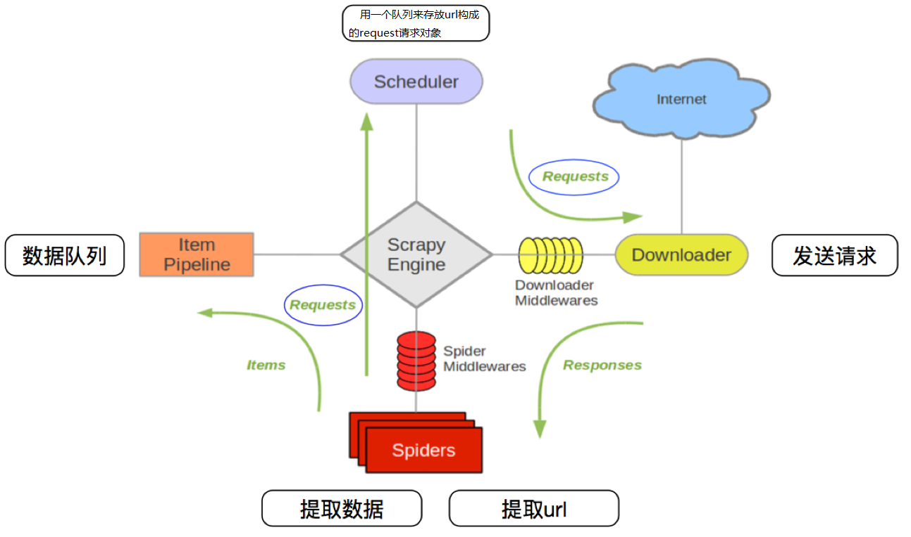

# 01.体系结构概述

## 一、Scrapy概述

> Scrapy文档地址：[Scrapy0.25中文文档](http://scrapy-chs.readthedocs.io/zh_CN/latest/index.html)/[Scrapy最新英文文档](https://doc.scrapy.org/en/latest/)。

### 1.为何要学习scrapy?

过去的文档中学习了并写出了很多爬虫，通过将不同的功能进行解耦合，甚至抽象出了许多模块，比如任务调度、消息队列、请求对象、哈希过滤等等，如果将各个组件独立出来，把它们定义成不同的模块，其实也就慢慢形成了一个框架。在不使用框架的前提下，每次开发爬虫都要实现爬虫相关的所有操作，例如爬取逻辑、异常处理、数据解析、数据存储等，但其实这些步骤很多都是通用或者重复的，而且处理html的乱七八糟的各种组件也非常难以管理。在有框架的前提下，就不必关心爬虫的流程了，只需要关心爬虫的核心逻辑即可，这样可以极大的提高开发效率。`Scrapy `是一个基于 Python 封装的网络爬虫框架，几乎实现了日常爬虫需求的所有需要的工具，其内置了`Twisted['twɪstɪd]`异步网络框架，极其易于管理和部署，可以说它是当前 Python 爬虫生态中最流行的爬虫框架，该框架提供了非常多爬虫相关的基础组件，架构清晰，可扩展性极强。


在学习`scrapy`之前，首先反思过去自行设计的爬虫流程：首先我们需要有一个`url`队列，随后我们取出`url`，通过`requests`等模块发送`http`请求并获取响应，其次我们通过`lxml`等模块从响应中提取数据，最后通过`pymysql`等模块进行存储数据。可以从很多视角对这一直线流程进行优化，比如我们可以向右图一样将整个流程平坦化，或者基于多线程实现协程，创建一定的机制来管理任务调度，或者在存储数据时选择进行一定的筛选和存储等等，`Scrapy`实际就是在实现上述任务的同时，进一步将整个流程平坦化的结果。

### 2.scrapy基本组成

`Scrapy`是用纯Python实现一个为了爬取网站数据、提取结构性数据而编写的应用框架，用途非常广泛。Scrapy 使用了 `Twisted`['twɪstɪd](其主要对手是Tornado)异步网络框架来处理网络通讯，可以加快我们的下载速度，不用自己去实现异步框架，并且包含了各种中间件接口，可以灵活的完成各种需求。下图展示了 Scrapy 的基本架构，其中包含了主要组件和系统的数据处理流程，所有的模块之前相互独立，只和引擎进行交互，图中绿色线条的表示数据的传递流程。



 Scrapy 中的主要组件：

| 组件名称                    | 功能                                                         |
| --------------------------- | ------------------------------------------------------------ |
| `Scrapy Engine`（引擎）     | 控制整个系统的数据和信号的处理流程，内部是进程和线程，总指挥。 |
| `Scheduler`（调度器）       | 一个任务队列，所有的任务生成后都将被引擎放置于此等待被执行。 |
| `Downloader`（下载器）      | 发送请求并获取响应，请求来自与引擎调度，响应也将返还给引擎。 |
| `Spiders`（蜘蛛程序）       | 接受来自于引擎的响应，通过自定义规则，提取数据和新的请求返还给引擎。 |
| `Item Pipeline`（数据管道） | 从引擎处接受蜘蛛从网页中抽取的数据条目，进一步清理、验证和存储。 |
| 中间件（`Middlewares`）     | 介于引擎和其他组件（爬虫程序与下载器）之间的一个钩子框架，主要是为了提供自定义的代码来拓展功能，如设置代理、定制化请求，筛选响应等，包括**下载器中间件和蜘蛛中间件**。 |

> 爬虫中间件（`Spider Middlewares`）和下载中间件（`Downloader Middlewares`）只是运行逻辑的位置不同，作用是重复的，爬虫中间件更多的用于自定义请求和过滤响应，下载中间件则更多用于设置代理，设置延迟等。

### 3.Scrapy工作流程

Scrapy 的整个数据处理流程由引擎进行控制，通常的运转流程包括以下的步骤：

- 引擎询问蜘蛛需要处理哪个网站，并让蜘蛛将第一个需要处理的 URL 交给它。
- 引擎让调度器将需要处理的 URL 放在队列中。
- 引擎从调度那获取接下来进行爬取的页面。
- 调度将下一个爬取的 URL 返回给引擎，引擎将它通过下载中间件发送到下载器。
- 当网页被下载器下载完成以后，响应内容通过下载中间件被发送到引擎，如果下载失败了，引擎会通知调度器记录这个 URL，待会再重新下载。
- 引擎收到下载器的响应并将它通过蜘蛛中间件发送到蜘蛛进行处理。
- 蜘蛛处理响应并返回爬取到的数据条目，此外还要将需要跟进的新的 URL 发送给引擎。
- 引擎将抓取到的数据条目送入数据管道，把新的 URL 发送给调度器放入队列中。

> 上述操作中的第2步到第8步会一直重复直到调度器中没有需要请求的 URL，爬虫就停止工作。

## 二、项目概览

### 1.下载安装

[各平台安装指南](http://doc.scrapy.org/en/latest/intro/install.html#intro-install-platform-notes)。

```shell
# 使用 Python 的包管理工具`pip`来安装 Scrapy
pip install scrapy
# 低版本ubuntu可能需要安装非Python的依赖
sudo apt-get install python-dev python-pip libxml2-dev libxslt1-dev zlib1g-dev libffi-dev libssl-dev
```

### 2.创建项目

在命令行中使用`scrapy`命令创建名为`demo`的项目。

```shell
# scrapy startproject <项目名字>
scrapy startproject myspider
```

项目的目录结构如下图所示：

```
myspider
|____ myspider
|     |________ __init__.py
|     |________ __pycache__
|     |________ items.py                   # 计划爬取内容
|     |________ middlewares.py             # 自定义中间件
|     |________ pipelines.py               # 管道，保存，检查，处理数据。
|     |________ settings.py                # 设置文件
|     |________ spiders                    # 自定义的spider的文件夹
|              | ____ __init__.py
|              | ____ __pycache__
|____ scrapy.cfg                           # 项目的配置文件
```

### 3.生成与启动爬虫

通过命令创建出爬虫文件，爬虫文件为主要的代码作业文件，通常一个网站的爬取动作都会在爬虫文件中进行编写。

```shell
# scrapy genspider <爬虫名字> <允许爬取的域名>
scrapy genspider testspider jd.com

# 爬虫名字：作为爬虫运行时的参数
# 允许爬取的域名：为对于爬虫设置的爬取范围，设置之后用于过滤要爬取的url，如果爬取的url与允许的域不通则被过滤掉。
```

创建爬虫后将在`spiders`文件夹下生成相应的爬虫文件，对该爬虫文件进行注册。

```python
import scrapy


class TestspiderSpider(scrapy.Spider):  # 继承scrapy.spider
    name = "testspider"  # 爬虫名字 
    allowed_domains = ["jd.com"]  # 允许爬取的范围
    start_urls = ["https://jd.com"]  # 开始爬取的url地址

    def parse(self, response):
        # 数据提取的方法，接受下载中间件传过来的response
        # scrapy的response对象可以直接进行xpath和css选择器操作
        # -有关更好的处理可以进一步了解阅读parsel文档。
        names = response.xpath('//...')
        title = response.css("title")
```

启动爬虫项目可以在在项目的顶级目录中运行如下代码：

```
scrapy crawl testspider  # 这里的 testspider 应当是 TestspiderSpider 的 name 属性。
```

还可以使用`cmdline.execute()`方法来执行启动命令，启动命令有以下两种：

```python
from scrapy import cmdline  # 导入运行指令的工具


# 默认启动方式，打印日志信息 
cmdline.execute('scrapy crawl qingting'.split())

# 忽略日志信息
cmdline.execute('scrapy crawl qingting --nolog'.split())
```

## 三、基本使用

### 1.item的基本使用

`item.py`中预先定义需要爬取的数据字段，这些字段用来保存数据，方便后续的操作。

```python
import scrapy

class TestItem(scrapy.Item):
    title = scrapy.Field()
    score = scrapy.Field()
    motto = scrapy.Field()
```

### 2.spider的基本使用

修改`spiders`文件夹中名为`testspider.py` 的文件，它是`scrapy`程序的核心，可以通过对`Response`对象的解析，获取需要信息并构建新的请求。

```python
import scrapy
from myspider.items import MyspiderItem
from scrapy import Request

class TestspiderSpider(scrapy.Spider):
    name = "testspider"
    allowed_domains = ["jd.com"]  # 允许发送请求的域名
    start_urls = ["https://jd.com"]  # 最开始启动爬虫的url列表

    def parse(self, response):
        item = MyspiderItem()
        item['name'] = response.xpath('//...')
        item['score'] = response.css("score")
        item['title'] = response.css("title")
        href = response.css('a::attr(href)')
        yield item
        
        # 不想定义items,也可以直接返回字典。
        yield {
            "name": response.xpath('//...'),
            "score": response.css("score"),
            "title": response.css("title")
        }
        # 可以选择返回请求对象
        hrefs = response.urljoin(href.extract())
        for href in hrefs:
            full_url = response.urljoin(href)
            yield Request(full_url, callback=self.call_back_parse)

    def call_back_parse(self, response):
        pass
```

放眼望去，整个`spider`大致由数据解析，`parse`函数和`yield`新请求构成，这也是`spider`的基本使命。

> 注意：第一次的请求由默认方法`start_requests()`启动，即对`start_urls`列表中的所有`url`依次发送一个`get`请求，这些请求的默认回调函数都是`parse`，如果需要自定义请求，则需要重写该方法。
>
> `parse`函数是一种特殊的函数(回调函数)，他只能返回`None`、`Request`、`Item`、类`dict`的一种，具体后续再深入学习。
>
> 解析函数中提取的`url`地址如需构造请求，则必须属于`allowed_domains`范围内，但`start_urls`中的`url`地址不受这个限制。

**为什么使用`yield`返回数据？**

一方面`yield`不会导致回调函数的终止，另一方面，`python`生成器会自动进化为协程（异步），提升程序运行效率。

### 3.Pipeline的使用

`Pipeline`主要用于处理、验证、筛选和持久化存储`spider`返还给引擎的数据，例如，可以通过`openpyxl`操作 Excel 文件，将数据写入 Excel 文件中，代码如下所示。

```python
from itemadapter import ItemAdapter
import openpyxl
from myspider.items import MyspiderItem


class MyspiderPipeline:
    def __init__(self):
        # 爬虫文件中提取数据的方法每yield一次item，就会运行一次
        self.wb = openpyxl.Workbook()
        self.sheet = self.wb.active
        self.sheet.title = 'Top250'
        self.sheet.append(('名称', '评分', '名言'))

    def process_item(self, item, spider):
        # spider程序产生的结果将会被引擎直接交给数据管道，数据管道对象MyspiderPipeline自动生成并在每次结果返回后自动调用`process_item`方法。
        self.sheet.append((item['title'], item['score'], item['motto']))
        return item

    def close_spider(self, spider):
        # close_spider 是在爬虫结束运行前会自动执行的方法。
        self.wb.save('豆瓣电影数据.xlsx')
```

`Pipeline`类必须定义`process_item`和`close_spider`作为接口，其中`process_item`方法处理完`item`之后必须返回给引擎，`close_spider`是在爬虫关闭时自动调用的方法。

启动管道需要在`setting`文件中配置：

```python
ITEM_PIPELINES = {
    'myspider.pipelines.MyspiderPipeline': 400
}
```

配置项中键为使用的管道类，管道类使用.进行分割，第一个为项目目录，第二个为文件，第三个为定义的管道类。`400`表示管道的使用顺序，设置的数值约小越优先执行，该值一般设置为1000以内。

### 4.settings的使用

```python
# 用户浏览器
USER_AGENT = 'Mozilla/5.0 (Macintosh; Intel Mac OS X 10_14_6) AppleWebKit/537.36 (KHTML, like Gecko) Chrome/92.0.4515.159 Safari/537.36'

# 并发请求数量 
CONCURRENT_REQUESTS = 4

# 下载延迟
DOWNLOAD_DELAY = 3

# 随机化下载延迟
RANDOMIZE_DOWNLOAD_DELAY = True

# 是否遵守爬虫协议
ROBOTSTXT_OBEY = True

# 配置数据管道
ITEM_PIPELINES = {
   'demo.pipelines.MovieItemPipeline': 300,
}

# 设置scrapy日志信息级别为warning, 忽略info信息
LOG_LEVEL = 'WARNING'
```

上面配置文件中的`ITEM_PIPELINES`选项是一个字典，可以配置多个处理数据的管道，后面的数字代表了执行的优先级，数字小的先执行。

