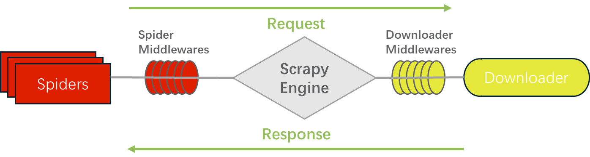

# 06.中间件

中间件（`Middlewares`）是介于引擎和其他组件（爬虫程序与下载器）之间的一个钩子框架，主要是为了提供自定义的代码来拓展功能，如设置代理、定制化请求，筛选响应等，包括**下载器中间件和蜘蛛中间件**。其中爬虫中间件（`Spider Middlewares`）和下载中间件（`Downloader Middlewares`）只是运行逻辑的位置不同，作用是重复的，爬虫中间件更多的用于自定义请求和过滤响应，下载中间件则更多用于设置代理，设置延迟等。



> 爬虫中间件使用方法和下载中间件相同，且功能重复，通常使用下载中间件。

## 一、下载器中间件

### 1.启用下载器中间件

需要启用下载器中间件，只需要在设置中增加`DOWNLOADER_MIDDLEWARES`字段，其键是中间件类路径，值是中间件顺序，值越小代表着越靠近引擎对象`Engine`，其越优先执行。

```python
DOWNLOADER_MIDDLEWARES = {
    'myproject.middlewares.CustomDownloaderMiddleware': 543,
    'scrapy.downloadermiddlewares.useragent.UserAgentMiddleware': None,
}
```

正常运行的下载器中间件是自定义中间件`DOWNLOADER_MIDDLEWARES`和`scrapy` 内置中间件`DOWNLOADER_MIDDLEWARES_BASE`的合并，因此当我们对中间件进行重写时，并不代表着原中间件被替代，而是两个中间件同时起作用。如果需要禁用内置中间件，则需要手动在`DOWNLOADR_MIDDLEWERES`中将其值设置为`None`。

```python
DOWNLOADER_MIDDLEWARES_BASE = {
    # Engine side
    "scrapy.downloadermiddlewares.robotstxt.RobotsTxtMiddleware": 100,
    "scrapy.downloadermiddlewares.httpauth.HttpAuthMiddleware": 300,
    "scrapy.downloadermiddlewares.downloadtimeout.DownloadTimeoutMiddleware": 350,
    "scrapy.downloadermiddlewares.defaultheaders.DefaultHeadersMiddleware": 400,
    "scrapy.downloadermiddlewares.useragent.UserAgentMiddleware": 500,
    "scrapy.downloadermiddlewares.retry.RetryMiddleware": 550,
    "scrapy.downloadermiddlewares.ajaxcrawl.AjaxCrawlMiddleware": 560,
    "scrapy.downloadermiddlewares.redirect.MetaRefreshMiddleware": 580,
    "scrapy.downloadermiddlewares.httpcompression.HttpCompressionMiddleware": 590,
    "scrapy.downloadermiddlewares.redirect.RedirectMiddleware": 600,
    "scrapy.downloadermiddlewares.cookies.CookiesMiddleware": 700,
    "scrapy.downloadermiddlewares.httpproxy.HttpProxyMiddleware": 750,
    "scrapy.downloadermiddlewares.stats.DownloaderStats": 850,
    "scrapy.downloadermiddlewares.httpcache.HttpCacheMiddleware": 900,
    # Downloader side
}
```

### 2.自定义中间件

中间件的自定义可以继承自内置中间件也可以自定义一个`process_request`方法、`process_response`方法或`process_exception`方法的类，这些方法不是必须的，但是`scrapy`框架会默认调用这些方法。

#### （1）`process_request`方法

```python
def process_request(self, request, spider):
    """该方法处理通过下载器中间件的每个请求，该方法必须返回如下一种[None,Response,Request,IgnoreRequest]"""
        return None
```

如果返回`None`，`Scrapy`将会继续处理此请求，按照优先级执行下一个中间件，直至发送请求并下载其响应。

如果返回`Response`，相当于该个请求获取了相应的响应，更低优先级中间件的`process request` 和`process exception`方法不会被继续调用，而是反向按照优先级调用每个下载器中间件的`process response`方法，最后将`Response`对象返回给爬虫。

如果返回`Request`，更低优先级的`process request`方法不会再被执行，`scrapy`将会将该请求返回给引擎，引擎经过调度后会重新发送该请求，并以此经过中间件类。

如果抛出`IgnoreRequest`异常，则将依次调用所有中间件类的`process_exception`方法，如果该异常没有被中间件处理，最后将调用请求的`errback`方法，如果没有异常处理方法，将会忽略异常。

#### （2）`process_response`方法

```python
def process_response(self, request, response, spider):
        """该方法处理通过下载器中间件的每个响应，该方法必须返回如下一种[Response,Request,IgnoreRequest]""""
        return response
```

如果返回`Resposne`，更低优先级的`process response`会继续被调用，该响应将在后续的中间件中被处理。

如果返回`Request`，更低优先级的`process_response` 方法不会继续调用，该Request对象会重新放到调度队列里等待被调度，相当于一个全新的`Request`，随后该`Request`会反向被 `process request`方法顺次处理，该`Request`将会被返回给引擎，引擎经过调度后会重新发送该请求，并以此经过中间件类。

如果抛出`IgnoreRequest`异常，直接调用`Request`的`errback`方法，如果没有异常处理方法，将会忽略异常。

#### （3）`process_exception`方法

```python
def process_exception(self, request, exception, spider):
        """当process_request方法抛出IgnoreRequest异常时调用，该方法返回如下枚举值:[None、Response、request]"""
        pass
```

如果返回`None`，该异常将在后续的中间件中的`process_exception`方法中被处理，直到没有剩余的中间件，默认异常处理开始。

如果返回`Response`，相当于原请求获取了响应，则依次反向启动已激活中间件中的`process_Response`方法。

如果返回一个`Request`，`scrapy`将会将该请求返回给引擎，引擎经过调度后会重新发送该请求。

### 3.内置下载器中间件类

这些内置下载器中间件类均在`scrapy.downloadermiddlewares`下，可以手动继承扩展。

```python
from scrapy.downloadermiddlewares import retry, httpproxy, useragent
```

#### （1）CookiesMiddleware

```python
class scrapy.downloadermiddlewares.cookies.CookiesMiddleware
```

用于协助`spiders`管理`cookie`信息，所有经过`CookiesMiddleware`的请求都会被进行如下处理：

- 清除`headers`中的`cookie`；
- 读取`meta`参数中的`cookiejar`字段，如果包含，则将对应的`cookie`信息置入请求头中，如果不包含，则不置入。
- 读取`cookies`参数，并将`cookies`

> 一旦请求经过`CookiesMiddleware`，通过`headers`传`cookie`的方式会彻底失效，一旦请求不经过`CookiesMiddleware`，通过`cookies`或者`meta`参数传参的方式也会彻底失效。

如果需要启用，或许需要在设置中增加如下设置：

```python
COOKIES_ENABLED=True  # 默认为True，当设置为False时关闭CookiesMiddleware
COOKIES_DEBUG=True  # 默认为False，当设置为`True`时，会在每次更改请求cookie时，在日种种输出。
```

`CookiesMiddleware`对`cookies`的管理可分为单请求`cookie`管理和多请求`cookie`管理：

单请求`cookie`管理仅需要使用`cookies`参数，由于未在请求中传入`meta.cookiejar`，新请求无法找到同系列请求保存的来自于`response`的``cookie`信息，此时所有来自于`response`中的`cookie`都需要手动捕获添加，不传入`cookies`参数的请求其`cookie`为空。

多请求`cookie`管理主要使用`meta.cookiejar`，`CookiesMiddleware`将自动捕获来自`cookies`参数和`response.set-cookie`中的`cookie`信息，以`cookiejar`为键储存在框架内部，后传入的`cookie`同`name`且同`path`的`cookie`信息会被后者覆盖，每个请求都需要添加`request.meta.cookiejar`，且同系请求的`cookiejar`应相同。

> 请求级别可以通过`meta`参数`dont_merge_cookies`设置该请求不经过`CookiesMiddleware`，带有该参数的请求`cookie`只能通过`headers`设置。

#### （2）DefaultHeadersMiddleware

```python
class scrapy.downloadermiddlewares.defaultheaders.DefaultHeadersMiddleware
```

此中间件将设置中`DEFAULT_REQUEST_HEADERS`的添加为默认标头。

```python
DEFAULT_REQUEST_HEADERS = {
    "User-Agent": "Mozilla/5.0 (Windows NT 10.0; Win64; x64) AppleWebKit/537.36 (KHTML, like Gecko) Chrome/126.0.0.0 Safari/537.36 Edg/126.0.0.0"
}
```

#### （3）DownloadTimeoutMiddleware

```python
class scrapy.downloadermiddlewares.downloadtimeout.DownloadTimeoutMiddleware
```

此中间件控制来自设置中的`DOWNLOAD_TIMEOUT`或是来自请求中的`download_timeout`参数值，定义爬虫的等待超时时间。

```python
DOWNLOAD_TIMEOUT = 10
```

#### （4）HttpAuthMiddleware

```python
class scrapy.downloadermiddlewares.httpauth.HttpAuthMiddleware
```

此中间件使用基本访问身份验证（又名HTTP身份验证）对某些蜘蛛生成的所有请求进行身份验证，在请求头中添加` Authorization`参数，使用该中间件需要在`spider`中增加类属性`http_user`、`http_pass`、`http_auth_domain`。

```python
from w3lib.http import basic_auth_header

def basic_auth_header(username: AnyStr, password: AnyStr, encoding: str = "ISO-8859-1") -> bytes:
    """
    'Basic c29tZXVzZXI6c29tZXBhc3M='
    """
    auth = f"{to_unicode(username)}:{to_unicode(password)}"
    # XXX: RFC 2617 doesn't define encoding, but ISO-8859-1
    return b"Basic " + b64encode(to_bytes(auth, encoding=encoding))
```

#### （5）HttpCacheMiddleware

```python
class scrapy.downloadermiddlewares.httpcache.HttpCacheMiddleware
```

该中间件为所有HTTP请求和响应提供低级缓存。它必须与缓存存储后端以及缓存策略相结合。

##### 1）缓存策略

`Scrapy`附带了两个HTTP缓存策略：

- [RFC2616 policy](https://doc.scrapy.org/en/1.0/topics/downloader-middleware.html#httpcache-policy-rfc2616)

此策略提供了一个符合RFC2616的HTTP缓存，即具有HTTP缓存控制意识，旨在用于生产，并在连续运行中使用，以避免下载未修改的数据（以节省带宽并加快爬行速度），了解更多[RFC2616 policy](https://doc.scrapy.org/en/1.0/topics/downloader-middleware.html#rfc2616-policy)，`HTTPCACHE_POLICY="scrapy.extensions.httpcache.RFC2616Policy"`。

- [Dummy policy](https://doc.scrapy.org/en/1.0/topics/downloader-middleware.html#httpcache-policy-dummy)（默认）

虚拟策略不知道任何`HTTP Cache-Control`指令，默认缓存所有的请求和响应，当遇到重复请求时间，会返回缓存过的响应，而不会再经过互联网传输，`HTTPCACHE_POLICY = "scrapy.extensions.httpcache.DummyPolicy"`。

可以在设置中使用`HTTPCACHE_POLICY`选择缓存策略，也可以定义自己的策略。

> 可以在请求级，使用`meta`参数`dont_cache=True`避免缓存响应。

##### 2）缓存后端

`Scrapy`附带了两个`HTTP`缓存存储后端：

- [Filesystem storage backend ](https://doc.scrapy.org/en/1.0/topics/downloader-middleware.html#httpcache-storage-fs)(默认)

文件系统存储后端将每个请求/响应对都存储在包含以下文件的不同文件中：

```python
request_body：请求正文
request_headers：请求头
response_body：响应正文
response_headers：响应头
meta：meta参数的repr格式
pickled_meta：meta中的元数据的pickled存储。
```

目录名为请求指纹（请参阅`scrapy.utils.request.fincident`），建议在使用时并用一级子目录来避免在同一目录中创建太多文件。

- [DBM storage backend](https://doc.scrapy.org/en/1.0/topics/downloader-middleware.html#httpcache-storage-dbm)

`DBM`存储后端也可用于HTTP缓存中间件，默认情况下，它使用`anydbm`模块，可以使用`HTTPCACHE_DBM_DULE`设置对其进行更改。

- [LevelDB storage backend](https://doc.scrapy.org/en/1.0/topics/downloader-middleware.html#leveldb-storage-backend)

`LevelDB`存储后端也可用于`HTTP`缓存中间件，不建议使用此后端，因为`LevelDB`数据库是单进程的，

可以在设置中通过参数` HTTPCACHE_STORAGE`变更缓存后端，或者自定义自己的缓存后端。

```python
HTTPCACHE_STORAGE="scrapy.extensions.httpcache.FilesystemCacheStorage"
HTTPCACHE_STORAGE="scrapy.extensions.httpcache.DbmCacheStorage"
HTTPCACHE_STORAGE="scrapy.extensions.httpcache.LeveldbCacheStorage"  # pip install leveldb
```

##### 3）配置项

`HttpCacheMiddleware`可以通过以下设置进行配置：

| 配置项名称                                                   | 说明                                                         | 默认值                                                 |
| ------------------------------------------------------------ | ------------------------------------------------------------ | ------------------------------------------------------ |
| [HTTPCACHE_ENABLED](https://doc.scrapy.org/en/1.0/topics/downloader-middleware.html#httpcache-enabled) | 是否启用HTTP缓存，默认为`False`。                            | `False`                                                |
| [HTTPCACHE_EXPIRATION_SECS](https://doc.scrapy.org/en/1.0/topics/downloader-middleware.html#httpcache-expiration-secs) | 过期时间，超过此时间（秒）的缓存请求将被重新下载。如果为零，则缓存的请求将永远不会过期。 | `0`                                                    |
| [HTTPCACHE_DIR](https://doc.scrapy.org/en/1.0/topics/downloader-middleware.html#httpcache-dir) | 用于存储（低级）HTTP缓存的目录。如果为空，则HTTP缓存将被禁用。如果给定了相对路径，则相对于项目数据目录。 | `httpcache`                                            |
| [HTTPCACHE_IGNORE_HTTP_CODES](https://doc.scrapy.org/en/1.0/topics/downloader-middleware.html#httpcache-ignore-http-codes) | 不要缓存包含这些HTTP代码的响应。                             | `[]`                                                   |
| [HTTPCACHE_IGNORE_MISSING](https://doc.scrapy.org/en/1.0/topics/downloader-middleware.html#httpcache-ignore-missing) | 如果启用，缓存中找不到的请求将被忽略，而不是下载。           | `False`                                                |
| [HTTPCACHE_IGNORE_SCHEMES]()                                 | 不要缓存具有这些URI方案的响应。                              | `['file']`                                             |
| [HTTPCACHE_STORAGE](https://doc.scrapy.org/en/1.0/topics/downloader-middleware.html#httpcache-storage) | 实现缓存存储后端的类。                                       | `'scrapy.extensions.httpcache.FilesystemCacheStorage'` |
| [HTTPCACHE_DBM_MODULE](https://doc.scrapy.org/en/1.0/topics/downloader-middleware.html#httpcache-dbm-module) | 在DBM存储后端中使用的数据库模块，此设置特定于DBM后端。       | `'anydbm'`                                             |
| [HTTPCACHE_POLICY](https://doc.scrapy.org/en/1.0/topics/downloader-middleware.html#httpcache-policy) | 实现缓存策略的类。                                           | `'scrapy.extensions.httpcache.DummyPolicy'`            |
| [HTTPCACHE_GZIP](https://doc.scrapy.org/en/1.0/topics/downloader-middleware.html#httpcache-gzip) | 是否使用gzip压缩所有缓存数据，此设置特定于`Filesystem backend`。 | `False`                                                |

#### （6）HttpCompressionMiddleware

```python
class scrapy.downloadermiddlewares.httpcompression.HttpCompressionMiddleware
```

此中间件允许从网站发送/接收压缩（gzip、deflate）流量。

携带配置项：

| 配置项名称                                                   | 说明                 | 默认值 |
| ------------------------------------------------------------ | -------------------- | ------ |
| [COMPRESSION_ENABLED](https://doc.scrapy.org/en/1.0/topics/downloader-middleware.html#compression-enabled) | 是否启用压缩中间件。 | `True` |

#### （7）ChunkedTransferMiddleware

```python
class scrapy.downloadermiddlewares.chunked.ChunkedTransferMiddleware
```

此中间件添加了对分块传输编码的支持。

#### （8）HttpProxyMiddleware

```python
class scrapy.downloadermiddlewares.httpproxy.HttpProxyMiddleware
```

此中间件通过设置Request对象的代理元值来设置用于请求的`HTTP`代理，启用需要在`meta`中添加参数`http_proxy`、`https_proxy`和`no_proxy`，或直接使用`proxy`，其值应该是`http://some_proxy_server:port`。

#### （9）RedirectMiddleware

```python
class scrapy.downloadermiddlewares.redirect.RedirectMiddleware
```

此中间件根据响应状态处理请求的重定向，可以在`request.meta.redirect_urls`查询请求（在重定向时）经过的url。

携带配置项：

| 配置项名称                                                   | 说明                   | 默认值 |
| ------------------------------------------------------------ | ---------------------- | ------ |
| [REDIRECT_ENABLED](https://doc.scrapy.org/en/1.0/topics/downloader-middleware.html#std:setting-REDIRECT_ENABLED) | 是否启用重定向中间件。 | `True` |
| [REDIRECT_MAX_TIMES](https://doc.scrapy.org/en/1.0/topics/settings.html#std:setting-REDIRECT_MAX_TIMES) | 最大重定向次数。       | `20`   |

> 可以在`Request.meta`中增加`dont_redirect=True`，在请求级别设置是否忽略此中间件。

#### （10）MetaRefreshMiddleware

```python
class scrapy.downloadermiddlewares.redirect.MetaRefreshMiddleware
```

此中间件处理基于元刷新`html`标签的请求重定向。

携带配置项：

| 配置项名称                                                   | 说明                             | 默认值 |
| ------------------------------------------------------------ | -------------------------------- | ------ |
| [METAREFRESH_ENABLED](https://doc.scrapy.org/en/1.0/topics/downloader-middleware.html#metarefresh-enabled) | 是否启用元刷新中间件。           | `True` |
| [REDIRECT_MAX_METAREFRESH_DELAY](https://doc.scrapy.org/en/1.0/topics/downloader-middleware.html#redirect-max-metarefresh-delay) | 重定向后的最大元刷新延迟（秒）。 | `100`  |

#### （11）RetryMiddleware

```python
class scrapy.downloadermiddlewares.retry.RetryMiddleware
```

用于重试可能由连接超时或`HTTP 500`错误等临时问题引起的失败请求，一旦完成抓取所有常规（非失败）页面，此中间件还会发出一个`retry_complete`信号。

| 配置项名称                                                   | 说明                                                         | 默认值                           |
| ------------------------------------------------------------ | ------------------------------------------------------------ | -------------------------------- |
| [RETRY_ENABLED](https://doc.scrapy.org/en/1.0/topics/downloader-middleware.html#std:setting-RETRY_ENABLED) | 是否启用重试中间件。                                         | `True`                           |
| [RETRY_TIMES](https://doc.scrapy.org/en/1.0/topics/downloader-middleware.html#std:setting-RETRY_TIMES) | 最大重试次数。                                               | `2`                              |
| [RETRY_HTTP_CODES](https://doc.scrapy.org/en/1.0/topics/downloader-middleware.html#std:setting-RETRY_HTTP_CODES) | 要重试的HTTP响应代码，内部错误如`DNS`错误，连接丢失等总会重试。 | `[500, 502, 503, 504, 400, 408]` |

#### （12）RobotsTxtMiddleware

```python
class scrapy.downloadermiddlewares.robotstxt.RobotsTxtMiddleware
```

此中间件过滤掉`robots.txt`排除标准禁止的请求，为确保`Scrapy`遵守`robots.txt`，请确保启用了中间件并启用了`ROBOTSTXT_OBEY=True`设置。

可以在请求级`meta.dont_obey_robotstxt=True`来设置是否排除标准禁止的请求。

> 当使用并发请求进行数据爬取的时候，如果在下载`robots.txt`之前请求了一些被禁止的页面，这些页面仍然可以被下载，这是`robots.txt`中间件的一个已知限制，将来会得到修复。

#### （13）DownloaderStats

```python
 class scrapy.downloadermiddlewares.stats.DownloaderStats
```

存储通过它的所有请求、响应和异常的统计数据，设置`DOWNLOADER_STATS=True`启用此中间件。

#### （14）UserAgentMiddleware

```python
class scrapy.downloadermiddlewares.useragent.UserAgentMiddleware
```

允许爬虫覆盖默认用户代理的中间件，如果想要使用此中间件，必须设置`USER_AGENT`字段。

#### （13）AjaxCrawlMiddleware

```python
class scrapy.downloadermiddlewares.ajaxcrawl.AjaxCrawlMiddleware
```

基于元片段html标签找到“AJAX可爬”页面变体的中间件，请阅读[ajax-crawling](https://developers.google.com/webmasters/ajax-crawling/docs/getting-started )了解更多内容，如果需要启用，请设置`AJAXCRAWL_ENABLED`为`True`。

### 4.自定义下载器中间件案例

#### （1）随机UA生成

```python
import re
import random

class RandomUserAgentMiddleware(useragent.UserAgentMiddleware):
    def process_request(self, request, spider):
        url_type = re.search(r'm\.\w+\.(com|cn)', request.url)
        platforms = ["mobile", "tablet"] if url_type else ["pc", ]
        os = ["android", "ios"] if url_type else ["windows", "macos", "linux"]
        try:
            from fake_useragent import UserAgent
        except:
            raise ImportError("The fake-useragent library is needed, Please install it by command: pip install fake-useragent")
        user_agent = UserAgent(platforms=platforms, min_version=120.0, os=os)
        request.headers.setdefault('User-Agent', user_agent.random.strip())
```

#### （2）配置随机代理

如果需要从数据库中提取代理信息，建议写在该类的外部，防止每次启用中间件都进行数据库的链接。

```python
class RandomProxyMiddleware(httpproxy.HttpProxyMiddleware):

    def __init__(self, *args, **kwargs):
        super().__init__(*args, **kwargs)

    def _basic_auth_header(self, username, password):
        user_pass = '%s:%s' % (username, password)
        return base64.urlsafe_b64encode(user_pass.encode(self.auth_encoding)).decode('ascii')

    def process_request(self, request, spider):
        # proxy = random.choice(proxies)
        proxy = {
            'ProxyHost': "u3991.10.tn.16yun.cn",
            'ProxyPort': "6442",
            'ProxyUser': "16KPIRES",
            'ProxyPass': "552380",
            'Website': '亿牛云'
        }
        proxy_host = proxy.get('ProxyHost')
        proxy_port = proxy.get('ProxyPort')
        # 代理隧道验证信息
        proxy_user = proxy.get('ProxyUser')
        proxy_pass = proxy.get('ProxyPass')
        request.meta['proxy'] = "http://{0}:{1}".format(proxy_host, proxy_port)
        request.headers["Proxy-Authorization"] = "Basic " + self._basic_auth_header(proxy_user, proxy_pass)
        # 设置IP切换头(根据需求)
        # tunnel = request.meta.get("proxy_tunnel", random.randint(1, 450000))
        # request.headers['Proxy-Tunnel'] = str(tunnel)
        # request.headers['Connection'] = 'close'

    def process_response(self, request, response, spider):
        """当对应的请求获取到的代理ip不可用时调用"""
        if response.status != '200':
            # 如果不是因为代理原因导致的呢？-此处的响应码应根据具体网站 代理失效的状态码设置。
            request.dont_filter = True  # 重新发送的请求对象能够再次进入队列
            return request
```

## 二、爬虫中间件

爬虫中间件是`Scrapy`中`spider`与`engine`之间的处理机制的钩子框架，下载器生成的`Response`会返回给`spider`处理，最终生成新的`Request`和`Item`，可以说下载器中间件更多的处理请求与响应，而爬虫中间件更多的处理`Item`和`Request`，事实上，返回的响应也会经过爬虫中间件，一般情况下，请求和响应都会在下载器中间件中自定义，因此爬虫中间件使用较少。

### 1.启用爬虫中间件

需要启用爬虫中间件，和下载器中间件一样，在设置中增加`SPIDER_MIDDLEWARES`字段，其键是中间件类路径，值是中间件顺序，值越小代表着越靠近引擎对象`Engine`，其越优先执行。

```python
SPIDER_MIDDLEWARES = {
    'myproject.middlewares.CustomSpiderMiddleware': 543,
    'scrapy.spidermiddlewares.offsite.OffsiteMiddleware': None,
}
```

正常运行的爬虫中间件也是自定义中间件与内置中间件`SPIDER_MIDDLEWARES_BASE`的合并，和下载器一样需要禁用爬虫中间件，需要在`SPIDER_MIDDLEWARES`中将其值设置为`None`。

```python
SPIDER_MIDDLEWARES_BASE = {
    # Engine side
    "scrapy.spidermiddlewares.httperror.HttpErrorMiddleware": 50,
    "scrapy.spidermiddlewares.offsite.OffsiteMiddleware": 500,
    "scrapy.spidermiddlewares.referer.RefererMiddleware": 700,
    "scrapy.spidermiddlewares.urllength.UrlLengthMiddleware": 800,
    "scrapy.spidermiddlewares.depth.DepthMiddleware": 900,
    # Spider side
}
```

### 2.自定义中间件

爬虫中间件的自定义可以继承自内置中间件也可以自定义部分方法，主要包括`process_spider_input`、`process_spider_output`、`process_spider_exception`和`process_start_requests`。

#### （1）process_spider_input

当`response`从引擎传递给爬虫时，每个响应都会依次经过爬虫中间件的`process_spider_input`方法。

```python
def process_spider_input(self, response, spider):
    """该方法会处理每个通过爬虫中间件进入爬虫的每个响应，该方法必须返回None或抛出异常。"""
    return None
```

如果返回`None`，此响应将会依次通过后续的爬虫中间件，直到被爬虫程序处理。如果引发异常，则将依次调用所有中间件类的`process_exception`方法，如果该异常没有被中间件处理，最后将调用该响应对应请求的`errorback`方法，如果没有异常处理方法，将会忽略异常。

#### （2）process_spider_output

在Spider处理完响应后，将使用Spider返回的结果调用此方法，此方法会获取`parse`函数返回的结果。

```python
def process_spider_output(self, response, result, spider):
    """该方法像`parse方法一样必须返回 可迭代的[Requet,dict ,item]"""
    # Must return an iterable of Request, or item objects.
    for i in result:
        yield i
```

#### （3）process_spider_exception

当process_spider_input 抛出异常时调用，如果它返回 `None`，那么Scrapy将继续处理该异常，依次调用其经过爬虫中间件的`process_spider_exception`方法，直到经过所有爬虫中间件。

如果像`process_spider_output`一样返回可迭代对象，则等价于爬虫解析响应后获取的可迭代对象，有引擎决定该对象是放入调度器的请求还是返回给管道的`Item`。

如果返回`Response`，则等价于引擎再次发送了一个新的`response`对象，依次经过后续的`process_spider_input`方法继续由`spider`处理。

```python
def process_spider_exception(self, response, exception, spider):
    """
    该方法应当返回None、可迭代的[Response、dict或items]
    """
    pass
```

#### （4）process_start_requests

```python
def process_start_requests(self, start_requests, spider):
    """与爬虫的start请求关联，工作原理与process_spider_output类似，但是其没有关联的响应，并且只能返回reuqest"""
    for r in start_requests:
        yield r
```

### 3.内置爬虫中间件

#### （1）DepthMiddleware

```python
class scrapy.spidermiddlewares.depth.DepthMiddleware
```

`DepthMiddleware`是一个抓取中间件，用于跟踪被抓取站点内每个请求的深度，用于通过如下参数限制请求深度。

| 配置项名称                                                   | 说明                                                       | 默认值 |
| ------------------------------------------------------------ | ---------------------------------------------------------- | ------ |
| [DEPTH_LIMIT](https://doc.scrapy.org/en/1.0/topics/settings.html#std:setting-DEPTH_LIMIT) | 任何站点允许爬行的最大深度。如果为零，则不会施加任何限制。 | `0`    |
| [DEPTH_STATS](https://doc.scrapy.org/en/1.0/topics/settings.html#std:setting-DEPTH_STATS) | 是否收集深度统计数据。                                     | `True` |
| [DEPTH_PRIORITY](https://doc.scrapy.org/en/1.0/topics/settings.html#std:setting-DEPTH_PRIORITY) | 是否根据请求的深度对其进行优先级排序。                     | `True` |

#### （2）HttpErrorMiddleware

```python
class scrapy.spidermiddlewares.httperror.HttpErrorMiddleware
```

过滤掉不成功（错误）的HTTP响应，即仅仅会把状态代码在200-300范围内的响应返回给爬虫，如果想处理该范围之外的响应代码，可以使用 爬虫类属性`handle_httpstatus_list`或设置中的`HTTPERROR_ALLOWED_CODES`添加：

```python
HTTPERROR_ALLOWED_CODES = [404,]
class MySpider(CrawlSpider):
    handle_httpstatus_list = [404,]
```

> 可以在设置中添加`HTTPERROR_ALLOW_ALL=True`关闭此中间件，或者设置`meta`参数`handle_httpstatus_all=True`使请求忽略掉此中间件。

#### （3）OffsiteMiddleware

```python
class scrapy.spidermiddlewares.offsite.OffsiteMiddleware
```

过滤掉对蜘蛛覆盖的域之外的URL的请求，此中间件依赖于爬虫类属性`allowed_domains`，如果该类属性为空，则不会过滤任何请求。当识别出异域请求时，中间件会在日志中输出，但是为了防止产生太多日志信息，对于重复请求只会记录一次日志。

> 当请求中传递了`dont_filter`字段，即使请求时异域的，也会被发从出。

#### （4）RefererMiddleware

```python
class scrapy.spidermiddlewares.referer.RefererMiddleware
```

根据生成它的响应的`URL`填充`Request Referer`标头，通过`REFERER_ENABLED=True`设置开启或关闭。

#### （5）UrlLengthMiddleware

```python
class scrapy.spidermiddlewares.urllength.UrlLengthMiddleware
```

过滤掉`URL`长度超过设置`URLLENGH_LIMIT`的请求，阅读`settings`了解更多。


