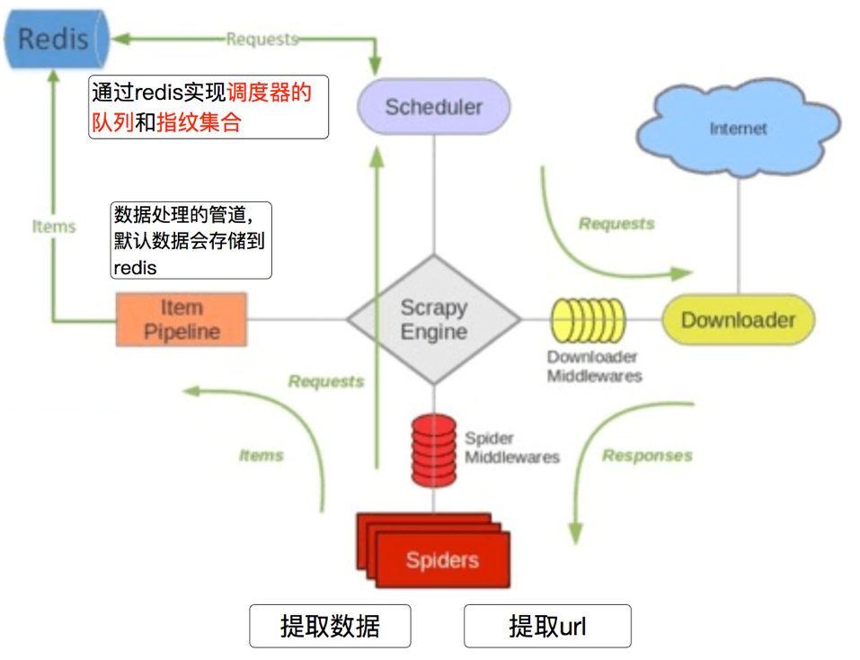

# 10.scrapy-redis

`scrapy`是一个通用的爬虫框架，能够耗费很少的时间就能够写出爬虫代码，且其执行方式是异步加多线程的，但是只能在一台主机上运行，所以爬取效率还是有限的。分布式爬虫则是将多台主机组合起来，共同完成一个爬取任务，这将大大提高爬取效率，因此有人调整了`scrapy`的队列调度，将起始的网址从`start_urls`里分离出来，改为从`redis`读取，多个客户端可以同时读取同一个`redis`，从而实现了分布式的爬虫。

## 一、 scarpy_redis概览

`Scrapy `是一个通用的爬虫框架，但是不支持分布式，`scrapy_redis`就是为了更方便地实现`Scrapy`分布式爬取，在`scrapy`框架的基础上，封装了一些基于`redis`的分布式组件，从而实现了更强大的功能，具体体现在通过持久化请求队列和请求的指纹集合来实现：

- 断点续爬
- 分布式快速抓取

```python
pip install scrapy-redis  # 此模块依赖于 redis
```

### 1.分布式爬虫架构

`Scrapy`单机爬虫使用的是本地爬取队列`Queue`，该队列基于`deque` 模块实现，新的 `Request `生成就会被放到队列里，随后被调度器`Scheduler`调度，交给`Downloader`执行爬取。如果同时启用两个` Scheduler` 同时从队列里面取 `Request`，每个` Scheduler `都有其对应的 `Downloader`，那么在带宽足正常爬取且不考虑队列存取压力的情况下，理论爬取效率应该会翻倍，这就是所谓的共享爬取队列。

扩展`scrapy`实际需要做的就是在多台主机上同时运行爬虫任务协同爬取，而协同爬取的前提就是共享爬取队列。这样各台主机就不需要各自维护爬取队列，从共享爬取队列存取`Request `就行了。

> 简单的说 分布式就是不同的节点（服务器，ip不同）共同完成一个任务

#### （1）`scrapy-redis`架构

`scrapy-redis`在`scrapy`的架构上增加了`redis`，基于`redis`的特性拓展其功能。当实例化一个`Spider`继承`RedisSpider`时，将调用`setup_redis`函数，该函数会去连接`redis`数据库，然后会设置`signals`(信号)：

- 当`spider`空闲时发送信号`spider_idle`，该信号触发`handle`函数`schedule_next_request`，该函数将抛出`DontCloseSpider`异常以保证`spider`是未关闭状态。
- 当抓取到`item`时将触发`item_scraped`信号，`handle`函数`schedule_next_request`接收信号并自动执行以获取下一个`request`。



#### （2）scrapy-Redis分布式策略

假设有四台电脑：Windows 10、Mac OS X、Ubuntu 16.04、CentOS 7.2，任意一台电脑都可以作为 Master端 或 Slaver端，比如：

- `Master端`(核心服务器) ：使用 Windows 10，搭建一个Redis数据库，不负责爬取，只负责url指纹判重、Request的分配，以及数据的存储
- `Slaver端`(爬虫程序执行端) ：使用 Mac OS X 、Ubuntu 16.04、CentOS 7.2，负责执行爬虫程序，运行过程中提交新的Request给Master


首先Slaver端从Master端拿任务（Request、url）进行数据抓取，Slaver抓取数据的同时，产生新任务的Request便提交给 Master 处理，Master端只有一个Redis数据库，负责将未处理的Request去重和任务分配，将处理后的Request加入待爬队列，并且存储爬取的数据。

> Scrapy-Redis默认使用的就是这种策略，我们实现起来很简单，因为任务调度等工作Scrapy-Redis都已经帮我们做好了，我们只需要继承RedisSpider、指定redis_key就行了。缺点是，Scrapy-Redis调度的任务是Request对象，里面信息量比较大（不仅包含url，还有callback函数、headers等信息），可能导致的结果就是会降低爬虫速度、而且会占用Redis大量的存储空间，所以如果要保证效率，那么就需要一定硬件水平。

### 2.scrapy-redis流程

`scrapy-redis`和`scrapy`爬取数据总体流程是一致的，原本只有1个`scrapy`时，它所有的请求对象`request`都直接存放到了内存中，此时可以完成本台电脑上`scrapy`的功能，但是其他电脑上的`scrapy`是不能够获取另外一台电脑内存中的数据的，所以借助了`Redis`数据库。将原本直接存储到内存中的数据（像请求对象等）放到了`Redis`数据库中（因为`Redis`效率非常高，所以用它而不用`MySQL`、`MongoDB`），又因为`Redis`是支持网络访问的，所以在本电脑上的`Redis`中存储的数据，就可以让其他电脑上的`scrapy`去共用，此时哪个请求对象已经处理过，哪个没有并处理过，一目了然。

`scrapy-redis`在`scrapy`的基础上扩展了如下组件（`components`）：

- `Scheduler`

原调度器`Scheduler`，`scrapy`中框架改变了`python`内置的双向队列(`collection.deque`)，但是该队列并不支持多个spider之间共享待爬取队列——不支持分布式爬虫，`scrapy-redis `重写了该组件，将`Scrapy queue`换成了`redis`队列，将`request`存储在`redis`中，从而实现了请求队列的磁盘缓存，基于磁盘的缓存缺点在于运行速度慢，但是支持分布式存储和有利于持久化保存。

- `Duplication Filter`

`Scrapy`中基于内置的`RequestFingerprinter`实现内存级请求过滤，而`scrapy-redis`基于组件`Duplication Filter`实现缓存级请求过滤，它基于`redis`中`set`类型不重复的特性，实现了缓存去重，`scrapy-redis`调度器从引擎接受`request`，将`request`的指纹存⼊`redis`的`set`检查是否重复，并将不重复的`request push`写⼊`redis`的 `request queue`。

- `Item Pipeline`

`scrapy`中一般需要自定义`pipline`来决定爬取数据的存储位置和形式，`scrapy-redis `提供了一个接口将爬取到的` Item` 直接存⼊`redis`的`Item Pipeline`，可以很方便的根据 `key` 从` items queue `提取`item`，从⽽实现 `items processes`集群。

- `Base Spider`

`scrapy-redis`不在使用`scrapy`原有的`Spider`类，重写的`RedisSpider`继承了`Spider`和`RedisMixin`这两个类，`RedisMixin`是用来从`redis`读取`url`的类。

## 二、Scrapy-redis源码分析

`scrapy-redis`仅仅是结合`scrapy`和`redis`的进一步封装，其整个工程实现的内容很少，因此其[官方文档](https://github.com/rolando/scrapy-redis)写的比较简洁，没有提及其运行原理，因此想全面的理解分布式爬虫的运行原理，最好还是看`scrapy-redis`的源代码才行，可以通过学习`scrapy-redis`进一步学习如果扩展使用`scrapy`组件。

### 1.connection.py

该模块负责根据`setting`中配置实现连接`redis`数据库的功能，这些接口在其他组件（`dupefilter`和`scheduler`）中被用到。

```python
from scrapy.utils.misc import load_object

from . import defaults
# 从 defaults 大致读取了如下内容
"""
REDIS_CLS = redis.StrictRedis
REDIS_ENCODING = "utf-8"
# Sane connection defaults.
REDIS_PARAMS = {
    "socket_timeout": 30,
    "socket_connect_timeout": 30,
    "retry_on_timeout": True,
    "encoding": REDIS_ENCODING,
}
"""
# 要想连接到redis数据库，和其他数据库差不多，需要一个ip地址、端口号、用户名密码（可选）和一个整形的数据库编号
# 还可以在其中增加其他参数如 套接字的超时时间、等待时间等 -通过 REDIS_PARAMS
# Shortcut maps 'setting name' -> 'parmater name'.
SETTINGS_PARAMS_MAP = {
    "REDIS_URL": "url",
    "REDIS_HOST": "host",
    "REDIS_PORT": "port",
    "REDIS_DB": "db",
    "REDIS_ENCODING": "encoding",
}

SETTINGS_PARAMS_MAP["REDIS_DECODE_RESPONSES"] = "decode_responses"


def get_redis_from_settings(settings):
    """Returns a redis client instance from given Scrapy settings object.

    This function uses ``get_client`` to instantiate the client and uses
    ``defaults.REDIS_PARAMS`` global as defaults values for the parameters. You
    can override them using the ``REDIS_PARAMS`` setting.

    Parameters
    ----------
    settings : Settings
        A scrapy settings object. See the supported settings below.

    Returns
    -------
    server
        Redis client instance.

    Other Parameters
    ----------------
    REDIS_URL : str, optional
        Server connection URL.
    REDIS_HOST : str, optional
        Server host.
    REDIS_PORT : str, optional
        Server port.
    REDIS_DB : int, optional
        Server database
    REDIS_ENCODING : str, optional
        Data encoding.
    REDIS_PARAMS : dict, optional
        Additional client parameters.

    Python 3 Only
    ----------------
    REDIS_DECODE_RESPONSES : bool, optional
        Sets the `decode_responses` kwarg in Redis cls ctor

    """
    params = defaults.REDIS_PARAMS.copy()
    params.update(settings.getdict("REDIS_PARAMS"))
    # XXX: Deprecate REDIS_* settings.
    for source, dest in SETTINGS_PARAMS_MAP.items():
        val = settings.get(source)
        if val:
            params[dest] = val

    # Allow ``redis_cls`` to be a path to a class.
    if isinstance(params.get("redis_cls"), str):
        params["redis_cls"] = load_object(params["redis_cls"])
	# 返回的是redis库的Redis对象，可以直接用来进行数据操作的对象
    return get_redis(**params)


# Backwards compatible alias.
from_settings = get_redis_from_settings


def get_redis(**kwargs):
    """Returns a redis client instance.

    Parameters
    ----------
    redis_cls : class, optional
        Defaults to ``redis.StrictRedis``.
    url : str, optional
        If given, ``redis_cls.from_url`` is used to instantiate the class.
    **kwargs
        Extra parameters to be passed to the ``redis_cls`` class.

    Returns
    -------
    server
        Redis client instance.

    """
    redis_cls = kwargs.pop("redis_cls", defaults.REDIS_CLS)
    url = kwargs.pop("url", None)
    if url:
        return redis_cls.from_url(url, **kwargs)
    else:
        return redis_cls(**kwargs)

```

> 了解更多关于`redis`链接操作，可进一步学习`redis.StrictRedis`类。

### 2.picklecompat

该模块实现了`loads`和`dumps`两个函数，由于redis数据库不能存储复杂对象（key部分只能是字符串，value部分只能是字符串，字符串列表，字符串集合和`hash`），所以无论存储什么都应该先串行化成文本才行，这里基于`python-pickle`模块（兼容py2和py3）实现了一个序列化器，该接口主要用于 `scheduler`存储`reuqest`对象。

```python
"""A pickle wrapper module with protocol=-1 by default."""

try:
    import cPickle as pickle  # PY2
except ImportError:
    import pickle  # PY3


def loads(s):
    return pickle.loads(s)


def dumps(obj):
    return pickle.dumps(obj, protocol=-1)
```

### 3.queue

该模块中实现了几个容器类，包括一个基类、一个爬虫队列，一个爬虫栈和一个爬虫优先级队列， 这些容器类用于和`redis`交互。这些容器类都会作为`scheduler`调度`request`的容器，`scheduler`在每个主机上都会实例化一个，并且和`spider`一一对应，所以分布式运行时会有一个`spider`的多个实例和一个`scheduler`的多个实例存在于不同的主机上，但是，因为`scheduler`都是用相同的容器，而这些容器都连接同一个`redis`服务器，又都使用`spider`名加`queue`来作为`key`读写数据，所以不同主机上的不同爬虫实例公用一个`request`调度池，实现了分布式爬虫之间的统一调度。

#### （1）队列基类

该类负责链接数据库，并导入了序列化器，实现了一些子类都需要实现的基本方法如`_encoderequest`方法和 `_decode_request`方法，这两个方法用于将`Request`对象序列化为字符串以便于存入数据库中。

```python
try:
    from scrapy.utils.request import request_from_dict
except ImportError:
    from scrapy.utils.reqser import request_to_dict, request_from_dict

from . import picklecompat


class Base:
    """Per-spider base queue class"""

    def __init__(self, server, spider, key, serializer=None):
        """Initialize per-spider redis queue.

        Parameters
        ----------
        server : StrictRedis
            Redis client instance.
        spider : Spider
            Scrapy spider instance.
        key: str
            Redis key where to put and get messages.
        serializer : object
            Serializer object with ``loads`` and ``dumps`` methods.

        """
        if serializer is None:
            # Backward compatibility.
            # TODO: deprecate pickle.
            serializer = picklecompat
        if not hasattr(serializer, "loads"):
            raise TypeError(
                f"serializer does not implement 'loads' function: {serializer}"
            )
        if not hasattr(serializer, "dumps"):
            raise TypeError(
                f"serializer does not implement 'dumps' function: {serializer}"
            )

        self.server = server
        self.spider = spider
        self.key = key % {"spider": spider.name}
        self.serializer = serializer

    def _encode_request(self, request):
        """Encode a request object"""
        try:
            obj = request.to_dict(spider=self.spider)
        except AttributeError:
            obj = request_to_dict(request, self.spider)
        return self.serializer.dumps(obj)

    def _decode_request(self, encoded_request):
        """Decode an request previously encoded"""
        obj = self.serializer.loads(encoded_request)
        return request_from_dict(obj, spider=self.spider)

    def __len__(self):
        """Return the length of the queue"""
        raise NotImplementedError

    def push(self, request):
        """Push a request"""
        raise NotImplementedError

    def pop(self, timeout=0):
        """Pop a request"""
        raise NotImplementedError

    def clear(self):
        """Clear queue/stack"""
        self.server.delete(self.key)
```

在基类中`__len__`、`push`和`pop`方法都是定义未实现的，直接调用会抛出`NotImplementedError`，必须实现一个子类来重写这3个方法，而不同的子类就会有不同的实现，也就有着不同的功能。

#### （2）SpiderQueue

爬虫队列，其调度方式为先进先出（`first input first output-FIFO`），传入的请求先被`scrapy`接口`request_to_dict`转化为`dict`，随后又被`pickle.compat`进行序列化为字符串，最后调用`redis`的`lpush`方法插入数据库，这代表了从列表左侧存人数据，`pop`方法调用了`redis`的`rpop`，即从列表右侧取出数据。

```python
class FifoQueue(Base):
    """Per-spider FIFO queue"""

    def __len__(self):
        """Return the length of the queue"""
        return self.server.llen(self.key)

    def push(self, request):
        """Push a request"""
        self.server.lpush(self.key, self._encode_request(request))

    def pop(self, timeout=0):
        """Pop a request"""
        if timeout > 0:
            data = self.server.brpop(self.key, timeout)
            if isinstance(data, tuple):
                data = data[1]
        else:
            data = self.server.rpop(self.key)
        if data:
            return self._decode_request(data)


# TODO: Deprecate the use of these names.
SpiderQueue = FifoQueue
```

#### （3）LifoQueue

与`FifoQueue` 不同的是，它的`pop`方法使用的是`lpop`操作，也就是从左侧出，而`push`方法依然是使用的`lpush`操作，是从左侧入，因此实现了先进后出、后进先出(`lastin firsout-LIFO`)，也可以成为`StackOueue`。

```python
class LifoQueue(Base):
    """Per-spider LIFO queue."""

    def __len__(self):
        """Return the length of the stack"""
        return self.server.llen(self.key)

    def push(self, request):
        """Push a request"""
        self.server.lpush(self.key, self._encode_request(request))

    def pop(self, timeout=0):
        """Pop a request"""
        if timeout > 0:
            data = self.server.blpop(self.key, timeout)
            if isinstance(data, tuple):
                data = data[1]
        else:
            data = self.server.lpop(self.key)

        if data:
            return self._decode_request(data)

SpiderStack = LifoQueue
```

#### （4）SpiderPriorityQueue 

可以看到` __len__`、`push`、`pop`方法中使用了`server`对象的`zcard`、`zadd`、`zrange` 操作，即这里将请求存储在了有序集合，在这个集合中，每个元素都可以设置一个分数，这个分数就代表优先级。

`__len__ `方法调用了`zcard`操作，直接返回有序集合的大小，也就是爬取队列的长度。`push`方法中调用了 `zadd`操作向集合中添加元素，这里的分数指定成`Request`优先级的相反数，因为分数低的会排在集合的前面，所以这里高优先级的`Request`就会存在集合的最前面。`pop`方法首先调用了` zrange`操作取出了集合的第一个元素，因为最高优先级的`Request`会存在集合最前面，所以第一个元素就是最高优先级的 `Request`，然后再调用`zremrangebyrank`操作将这个元素删除，这样就完成了取出并删除的操作。

> 此队列是默认使用的队列，也就是爬取队列默认使用有序集合来存储。

```python
class PriorityQueue(Base):
    """Per-spider priority queue abstraction using redis' sorted set"""

    def __len__(self):
        """Return the length of the queue"""
        return self.server.zcard(self.key)

    def push(self, request):
        """Push a request"""
        data = self._encode_request(request)
        score = -request.priority
        # We don't use zadd method as the order of arguments change depending on
        # whether the class is Redis or StrictRedis, and the option of using
        # kwargs only accepts strings, not bytes.
        self.server.execute_command("ZADD", self.key, score, data)

    def pop(self, timeout=0):
        """
        Pop a request
        timeout not support in this queue class
        """
        # use atomic range/remove using multi/exec
        pipe = self.server.pipeline()
        pipe.multi()
        pipe.zrange(self.key, 0, 0).zremrangebyrank(self.key, 0, 0)
        results, count = pipe.execute()
        if results:
            return self._decode_request(results[0])
        
SpiderPriorityQueue = PriorityQueue
```

### 4.dupefilter

`scrapy`的原过滤器默认基于内存过滤，也可以设置持久化存储，但其格式是基于`json`文件而不是数据库，`scrapy-redis`有持久化存储的需求，并且想要实现分布式跑的话，需要各个主机的`scheduler`通过性能更好的`redis`而不是`json`文件，因此必须重写该组件。

`scrapy-redis`重写了原过滤器组件，该组件负责执行`requst`的去重，实现的很有技巧性，借助了`redis`的`set`数据结构。如下`RFPDupeFilter`继承自`BaseDupeFilter`并重写了它部分方法，实现了基于redis的判重。

通过源码可见，该类使用的请求`hash`函数仍然使用内置的`request_fingerprint`，并且通过使用一个`key`来向`redis`的一个`set`中插入 请求指纹 ，如果`key`存在于`set`中，数据库将返回`0`，否则返回插入数据库的数据数目。默认情况下`key`基于时间戳生成`dupefilter:<timestamp>`。`scrapy_redis.scheduler.Scheduler`类并不适用此`key`其自行实现了基于`spider.name`（`"%(spider)s:dupefilter"`）的`key`，这种`name+DupeFilter`的`key`是为了方便不同主机上的不同爬虫实例，只要`name`相同，其实用相同的请求`set`池。

```python
import hashlib
import json
import logging
import time

from scrapy.dupefilters import BaseDupeFilter
from scrapy.utils.python import to_unicode
from w3lib.url import canonicalize_url

from . import defaults
from .connection import get_redis_from_settings

logger = logging.getLogger(__name__)


# TODO: Rename class to RedisDupeFilter.
class RFPDupeFilter(BaseDupeFilter):
    """
    基于Redis的请求重复过滤器，此类也可以与默认的Scrapy调度程序一起使用。
    """

    logger = logger

    def __init__(self, server, key, debug=False):
        """Initialize the duplicates filter.

        Parameters
        ----------
        server : redis.StrictRedis
            The redis server instance.
        key : str
            Redis key Where to store fingerprints.
        debug : bool, optional
            Whether to log filtered requests.

        """
        self.server = server
        self.key = key
        self.debug = debug
        self.logdupes = True

    @classmethod
    def from_settings(cls, settings):
        """Returns an instance from given settings.

        This uses by default the key ``dupefilter:<timestamp>``. When using the
        ``scrapy_redis.scheduler.Scheduler`` class, this method is not used as
        it needs to pass the spider name in the key.

        Parameters
        ----------
        settings : scrapy.settings.Settings

        Returns
        -------
        RFPDupeFilter
            A RFPDupeFilter instance.


        """
        server = get_redis_from_settings(settings)
        # XXX: This creates one-time key. needed to support to use this
        # class as standalone dupefilter with scrapy's default scheduler
        # if scrapy passes spider on open() method this wouldn't be needed
        # TODO: Use SCRAPY_JOB env as default and fallback to timestamp.
        key = defaults.DUPEFILTER_KEY % {"timestamp": int(time.time())}
        debug = settings.getbool("DUPEFILTER_DEBUG")
        return cls(server, key=key, debug=debug)

    @classmethod
    def from_crawler(cls, crawler):
        """Returns instance from crawler.

        Parameters
        ----------
        crawler : scrapy.crawler.Crawler

        Returns
        -------
        RFPDupeFilter
            Instance of RFPDupeFilter.

        """
        return cls.from_settings(crawler.settings)

    def request_seen(self, request):
        """Returns True if request was already seen.

        Parameters
        ----------
        request : scrapy.http.Request

        Returns
        -------
        bool

        """
        fp = self.request_fingerprint(request)
        # This returns the number of values added, zero if already exists.
        added = self.server.sadd(self.key, fp)
        return added == 0

    def request_fingerprint(self, request):
        """Returns a fingerprint for a given request.

        Parameters
        ----------
        request : scrapy.http.Request

        Returns
        -------
        str

        """
        fingerprint_data = {
            "method": to_unicode(request.method),
            "url": canonicalize_url(request.url),
            "body": (request.body or b"").hex(),
        }
        fingerprint_json = json.dumps(fingerprint_data, sort_keys=True)
        return hashlib.sha1(fingerprint_json.encode()).hexdigest()

    @classmethod
    def from_spider(cls, spider):
        settings = spider.settings
        server = get_redis_from_settings(settings)
        dupefilter_key = settings.get(
            "SCHEDULER_DUPEFILTER_KEY", defaults.SCHEDULER_DUPEFILTER_KEY
        )
        key = dupefilter_key % {"spider": spider.name}
        debug = settings.getbool("DUPEFILTER_DEBUG")
        return cls(server, key=key, debug=debug)

    def close(self, reason=""):
        """Delete data on close. Called by Scrapy's scheduler.

        Parameters
        ----------
        reason : str, optional

        """
        self.clear()

    def clear(self):
        """Clears fingerprints data."""
        self.server.delete(self.key)

    def log(self, request, spider):
        """Logs given request.

        Parameters
        ----------
        request : scrapy.http.Request
        spider : scrapy.spiders.Spider

        """
        if self.debug:
            msg = "Filtered duplicate request: %(request)s"
            self.logger.debug(msg, {"request": request}, extra={"spider": spider})
        elif self.logdupes:
            msg = (
                "Filtered duplicate request %(request)s"
                " - no more duplicates will be shown"
                " (see DUPEFILTER_DEBUG to show all duplicates)"
            )
            self.logger.debug(msg, {"request": request}, extra={"spider": spider})
            self.logdupes = False

```

> 注意`dupefilter`不是用于管理队列的，它只是用来请求去重，`scheduler`借助`queue`来管理队列。

### 5.scheduler

`scheduler`组件重写了`scrapy`中自带的`scrapy.core.scheduler`（在`settings`的`SCHEDULER`变量中指出），从源码中可以看出，新调度器并没有改变原调度器的处理逻辑，只是增加了来自于`queue`中实现的数据结构，并将`redis`作为数据存储的媒介，以实现`crawler`的分布式调度。`scrapy-redis`所实现了两种分布式：爬虫(请求)分布式以及`item`处理分布式是由模块`scheduler`和模块`pipelines`分别实现。上述其它模块都是二者辅助的功能模块。

`scheduler`负责调度各个`spider`的`request`请求，`scheduler`初始化时，通过`settings`文件读取`queue`和`dupefilters`的类型（一般就用上边默认的），配置`queue`和`dupefilters`使用的`key`（一般就是`spider name`加上`queue`或者`dupefilters`）。每当一个`request`要被调度时，`enqueue_request`被调用，`scheduler`使用`dupefilters`来判断这个`url`是否重复，如果不重复，就添加到`queue`的容器中（先进先出，先进后出和优先级都可以，可以在`settings`中配置）。当调度完成时，`next_request`被调用，`scheduler`就通过`queue`容器的接口，取出一个`request`，把他发送给相应的`spider`，让`spider`进行爬取工作。

```python
import importlib

from scrapy.utils.misc import load_object

from . import connection, defaults


# TODO: add SCRAPY_JOB support.
class Scheduler:
    """Redis-based scheduler

    Settings
    --------
    SCHEDULER_PERSIST : bool (default: False)
        Whether to persist or clear redis queue.
    SCHEDULER_FLUSH_ON_START : bool (default: False)
        Whether to flush redis queue on start.
    SCHEDULER_IDLE_BEFORE_CLOSE : int (default: 0)
        How many seconds to wait before closing if no message is received.
    SCHEDULER_QUEUE_KEY : str
        Scheduler redis key.
    SCHEDULER_QUEUE_CLASS : str
        Scheduler queue class.
    SCHEDULER_DUPEFILTER_KEY : str
        Scheduler dupefilter redis key.
    SCHEDULER_DUPEFILTER_CLASS : str
        Scheduler dupefilter class.
    SCHEDULER_SERIALIZER : str
        Scheduler serializer.

    """

    def __init__(
        self,
        server,
        persist=False,
        flush_on_start=False,
        queue_key=defaults.SCHEDULER_QUEUE_KEY,
        queue_cls=defaults.SCHEDULER_QUEUE_CLASS,
        dupefilter=None,
        dupefilter_key=defaults.SCHEDULER_DUPEFILTER_KEY,
        dupefilter_cls=defaults.SCHEDULER_DUPEFILTER_CLASS,
        idle_before_close=0,
        serializer=None,
    ):
        """Initialize scheduler.

        Parameters
        ----------
        server : Redis
            The redis server instance.
        persist : bool
            Whether to flush requests when closing. Default is False.
        flush_on_start : bool
            Whether to flush requests on start. Default is False.
        queue_key : str
            Requests queue key.
        queue_cls : str
            Importable path to the queue class.
        dupefilter: Dupefilter
            Custom dupefilter instance.
        dupefilter_key : str
            Duplicates filter key.
        dupefilter_cls : str
            Importable path to the dupefilter class.
        idle_before_close : int
            Timeout before giving up.

        """
        if idle_before_close < 0:
            raise TypeError("idle_before_close cannot be negative")

        self.server = server
        self.persist = persist
        self.flush_on_start = flush_on_start
        self.queue_key = queue_key
        self.queue_cls = queue_cls
        self.df = dupefilter
        self.dupefilter_cls = dupefilter_cls
        self.dupefilter_key = dupefilter_key
        self.idle_before_close = idle_before_close
        self.serializer = serializer
        self.stats = None

    def __len__(self):
        return len(self.queue)

    @classmethod
    def from_settings(cls, settings):
        kwargs = {
            "persist": settings.getbool("SCHEDULER_PERSIST"),
            "flush_on_start": settings.getbool("SCHEDULER_FLUSH_ON_START"),
            "idle_before_close": settings.getint("SCHEDULER_IDLE_BEFORE_CLOSE"),
        }

        # If these values are missing, it means we want to use the defaults.
        optional = {
            # TODO: Use custom prefixes for this settings to note that are
            # specific to scrapy-redis.
            "queue_key": "SCHEDULER_QUEUE_KEY",
            "queue_cls": "SCHEDULER_QUEUE_CLASS",
            "dupefilter_key": "SCHEDULER_DUPEFILTER_KEY",
            # We use the default setting name to keep compatibility.
            "dupefilter_cls": "DUPEFILTER_CLASS",
            "serializer": "SCHEDULER_SERIALIZER",
        }
        for name, setting_name in optional.items():
            val = settings.get(setting_name)
            if val:
                kwargs[name] = val

        dupefilter_cls = load_object(kwargs["dupefilter_cls"])
        if not hasattr(dupefilter_cls, "from_spider"):
            kwargs["dupefilter"] = dupefilter_cls.from_settings(settings)

        # Support serializer as a path to a module.
        if isinstance(kwargs.get("serializer"), str):
            kwargs["serializer"] = importlib.import_module(kwargs["serializer"])

        server = connection.from_settings(settings)
        # Ensure the connection is working.
        server.ping()

        return cls(server=server, **kwargs)

    @classmethod
    def from_crawler(cls, crawler):
        instance = cls.from_settings(crawler.settings)
        # FIXME: for now, stats are only supported from this constructor
        instance.stats = crawler.stats
        return instance

    def open(self, spider):
        self.spider = spider

        try:
            self.queue = load_object(self.queue_cls)(
                server=self.server,
                spider=spider,
                key=self.queue_key % {"spider": spider.name},
                serializer=self.serializer,
            )
        except TypeError as e:
            raise ValueError(
                f"Failed to instantiate queue class '{self.queue_cls}': {e}"
            )

        if not self.df:
            self.df = load_object(self.dupefilter_cls).from_spider(spider)

        if self.flush_on_start:
            self.flush()
        # notice if there are requests already in the queue to resume the crawl
        if len(self.queue):
            spider.log(f"Resuming crawl ({len(self.queue)} requests scheduled)")

    def close(self, reason):
        if not self.persist:
            self.flush()

    def flush(self):
        self.df.clear()
        self.queue.clear()

    def enqueue_request(self, request):
        if not request.dont_filter and self.df.request_seen(request):
            self.df.log(request, self.spider)
            return False
        if self.stats:
            self.stats.inc_value("scheduler/enqueued/redis", spider=self.spider)
        self.queue.push(request)
        return True

    def next_request(self):
        block_pop_timeout = self.idle_before_close
        request = self.queue.pop(block_pop_timeout)
        if request and self.stats:
            self.stats.inc_value("scheduler/dequeued/redis", spider=self.spider)
        return request

    def has_pending_requests(self):
        return len(self) > 0

```

### 6.pipelines

`piplines`用于实现`item`分布式存储的处理逻辑，由于在这里需要读取配置，所以就用到了`from_crawler()`函数。`item pipieline`和`scrapy`的`item pipeline`是同一个对象，通过从`settings`中拿到我们配置的`REDIS_ITEMS_KEY`作为`key`，把`item`串行化之后存入`redis`数据库对应的`value`中（这个`value`可以看出出是个`list`，每个`item`是这个`list`中的一个结点），这个`pipeline`把提取出的`item`存起来，主要是为了方便延后处理数据。

```python
from scrapy.utils.misc import load_object
from scrapy.utils.serialize import ScrapyJSONEncoder
from twisted.internet.threads import deferToThread

from . import connection, defaults

default_serialize = ScrapyJSONEncoder().encode


class RedisPipeline:
    """Pushes serialized item into a redis list/queue

    Settings
    --------
    REDIS_ITEMS_KEY : str
        Redis key where to store items.
    REDIS_ITEMS_SERIALIZER : str
        Object path to serializer function.

    """

    def __init__(
        self, server, key=defaults.PIPELINE_KEY, serialize_func=default_serialize
    ):
        """Initialize pipeline.

        Parameters
        ----------
        server : StrictRedis
            Redis client instance.
        key : str
            Redis key where to store items.
        serialize_func : callable
            Items serializer function.

        """
        self.server = server
        self.key = key
        self.serialize = serialize_func

    @classmethod
    def from_settings(cls, settings):
        params = {
            "server": connection.from_settings(settings),
        }
        if settings.get("REDIS_ITEMS_KEY"):
            params["key"] = settings["REDIS_ITEMS_KEY"]
        if settings.get("REDIS_ITEMS_SERIALIZER"):
            params["serialize_func"] = load_object(settings["REDIS_ITEMS_SERIALIZER"])

        return cls(**params)

    @classmethod
    def from_crawler(cls, crawler):
        return cls.from_settings(crawler.settings)

    def process_item(self, item, spider):
        return deferToThread(self._process_item, item, spider)

    def _process_item(self, item, spider):
        key = self.item_key(item, spider)
        data = self.serialize(item)
        self.server.rpush(key, data)
        return item

    def item_key(self, item, spider):
        """Returns redis key based on given spider.

        Override this function to use a different key depending on the item
        and/or spider.

        """
        return self.key % {"spider": spider.name}

```

### 7.spider

重构的`spider`支持直接从`redis`中读取要爬的`url`，然后执行爬取，若爬取过程中返回更多的`url`，那么继续进行直至所有的`request`完成。之后继续从`redis`中读取`url`，循环这个过程。

`spider`的改动主要是通过`connect`接口，给`spider`绑定了`spider_idle`信号，`spider`初始化时，通过`setup_redis`函数初始化好和`redis`的连接，之后通过`next_requests`函数从`redis`中取出`strat url`，使用的`key`是`settings`中`REDIS_START_URLS_AS_SET`定义的（注意这里的初始化`url`池不同于`queue`请求池，他们都存在`redis`中，但是使用不同的`key`来区分）。`spider`使用少量的`start url`，可以发展出很多新的`url`，这些`url`会进入`scheduler`进行判重和调度。直到`spider`跑到调度池内没有`url`的时候，会触发`spider_idle`信号，从而触发`spider`的`next_requests`函数，再次从`redis`的`start url`池中读取一些`url`。

```python
import json
import time
from collections.abc import Iterable

from scrapy import FormRequest, signals
from scrapy import version_info as scrapy_version
from scrapy.exceptions import DontCloseSpider
from scrapy.spiders import CrawlSpider, Spider

from scrapy_redis.utils import TextColor

from . import connection, defaults
from .utils import bytes_to_str, is_dict


class RedisMixin:
    """Mixin class to implement reading urls from a redis queue."""

    redis_key = None
    redis_batch_size = None
    redis_encoding = None

    # Redis client placeholder.
    server = None

    # Idle start time
    spider_idle_start_time = int(time.time())
    max_idle_time = None

    def start_requests(self):
        """Returns a batch of start requests from redis."""
        return self.next_requests()

    def setup_redis(self, crawler=None):
        """Setup redis connection and idle signal.

        This should be called after the spider has set its crawler object.
        """
        if self.server is not None:
            return

        if crawler is None:
            # We allow optional crawler argument to keep backwards
            # compatibility.
            # XXX: Raise a deprecation warning.
            crawler = getattr(self, "crawler", None)

        if crawler is None:
            raise ValueError("crawler is required")

        settings = crawler.settings

        if self.redis_key is None:
            self.redis_key = settings.get(
                "REDIS_START_URLS_KEY",
                defaults.START_URLS_KEY,
            )

        self.redis_key = self.redis_key % {"name": self.name}

        if not self.redis_key.strip():
            raise ValueError("redis_key must not be empty")

        if self.redis_batch_size is None:
            self.redis_batch_size = settings.getint(
                "CONCURRENT_REQUESTS", defaults.REDIS_CONCURRENT_REQUESTS
            )

        try:
            self.redis_batch_size = int(self.redis_batch_size)
        except (TypeError, ValueError):
            raise ValueError("redis_batch_size must be an integer")

        if self.redis_encoding is None:
            self.redis_encoding = settings.get(
                "REDIS_ENCODING", defaults.REDIS_ENCODING
            )

        self.logger.info(
            "Reading start URLs from redis key '%(redis_key)s' "
            "(batch size: %(redis_batch_size)s, encoding: %(redis_encoding)s)",
            self.__dict__,
        )

        self.server = connection.from_settings(crawler.settings)

        if settings.getbool("REDIS_START_URLS_AS_SET", defaults.START_URLS_AS_SET):
            self.fetch_data = self.server.spop
            self.count_size = self.server.scard
        elif settings.getbool("REDIS_START_URLS_AS_ZSET", defaults.START_URLS_AS_ZSET):
            self.fetch_data = self.pop_priority_queue
            self.count_size = self.server.zcard
        else:
            self.fetch_data = self.pop_list_queue
            self.count_size = self.server.llen

        if self.max_idle_time is None:
            self.max_idle_time = settings.get(
                "MAX_IDLE_TIME_BEFORE_CLOSE", defaults.MAX_IDLE_TIME
            )

        try:
            self.max_idle_time = int(self.max_idle_time)
        except (TypeError, ValueError):
            raise ValueError("max_idle_time must be an integer")

        # The idle signal is called when the spider has no requests left,
        # that's when we will schedule new requests from redis queue
        crawler.signals.connect(self.spider_idle, signal=signals.spider_idle)

    def pop_list_queue(self, redis_key, batch_size):
        with self.server.pipeline() as pipe:
            pipe.lrange(redis_key, 0, batch_size - 1)
            pipe.ltrim(redis_key, batch_size, -1)
            datas, _ = pipe.execute()
        return datas

    def pop_priority_queue(self, redis_key, batch_size):
        with self.server.pipeline() as pipe:
            pipe.zrevrange(redis_key, 0, batch_size - 1)
            pipe.zremrangebyrank(redis_key, -batch_size, -1)
            datas, _ = pipe.execute()
        return datas

    def next_requests(self):
        """Returns a request to be scheduled or none."""
        # XXX: Do we need to use a timeout here?
        found = 0
        datas = self.fetch_data(self.redis_key, self.redis_batch_size)
        for data in datas:
            reqs = self.make_request_from_data(data)
            if isinstance(reqs, Iterable):
                for req in reqs:
                    yield req
                    # XXX: should be here?
                    found += 1
                    self.logger.info(f"start req url:{req.url}")
            elif reqs:
                yield reqs
                found += 1
            else:
                self.logger.debug(f"Request not made from data: {data}")

        if found:
            self.logger.debug(f"Read {found} requests from '{self.redis_key}'")

    def make_request_from_data(self, data):
        """Returns a `Request` instance for data coming from Redis.

        Overriding this function to support the `json` requested `data` that contains
        `url` ,`meta` and other optional parameters. `meta` is a nested json which contains sub-data.

        Along with:
        After accessing the data, sending the FormRequest with `url`, `meta` and addition `formdata`, `method`

        For example:

        .. code:: json

            {
                "url": "https://example.com",
                "meta": {
                    "job-id":"123xsd",
                    "start-date":"dd/mm/yy",
                },
                "url_cookie_key":"fertxsas",
                "method":"POST",
            }

        If `url` is empty, return `[]`. So you should verify the `url` in the data.
        If `method` is empty, the request object will set method to 'GET', optional.
        If `meta` is empty, the request object will set `meta` to an empty dictionary, optional.

        This json supported data can be accessed from 'scrapy.spider' through response.
        'request.url', 'request.meta', 'request.cookies', 'request.method'

        Parameters
        ----------
        data : bytes
            Message from redis.

        """
        formatted_data = bytes_to_str(data, self.redis_encoding)

        if is_dict(formatted_data):
            parameter = json.loads(formatted_data)
        else:
            self.logger.warning(
                f"{TextColor.WARNING}WARNING: String request is deprecated, please use JSON data format. "
                f"Detail information, please check https://github.com/rmax/scrapy-redis#features{TextColor.ENDC}"
            )
            return FormRequest(formatted_data, dont_filter=True)

        if parameter.get("url", None) is None:
            self.logger.warning(
                f"{TextColor.WARNING}The data from Redis has no url key in push data{TextColor.ENDC}"
            )
            return []

        url = parameter.pop("url")
        method = parameter.pop("method").upper() if "method" in parameter else "GET"
        metadata = parameter.pop("meta") if "meta" in parameter else {}

        return FormRequest(
            url, dont_filter=True, method=method, formdata=parameter, meta=metadata
        )

    def schedule_next_requests(self):
        """Schedules a request if available"""
        # TODO: While there is capacity, schedule a batch of redis requests.
        for req in self.next_requests():
            # see https://github.com/scrapy/scrapy/issues/5994
            if scrapy_version >= (2, 6):
                self.crawler.engine.crawl(req)
            else:
                self.crawler.engine.crawl(req, spider=self)

    def spider_idle(self):
        """
        Schedules a request if available, otherwise waits.
        or close spider when waiting seconds > MAX_IDLE_TIME_BEFORE_CLOSE.
        MAX_IDLE_TIME_BEFORE_CLOSE will not affect SCHEDULER_IDLE_BEFORE_CLOSE.
        """
        if self.server is not None and self.count_size(self.redis_key) > 0:
            self.spider_idle_start_time = int(time.time())

        self.schedule_next_requests()

        idle_time = int(time.time()) - self.spider_idle_start_time
        if self.max_idle_time != 0 and idle_time >= self.max_idle_time:
            return
        raise DontCloseSpider


class RedisSpider(RedisMixin, Spider):
    """Spider that reads urls from redis queue when idle.

    Attributes
    ----------
    redis_key : str (default: REDIS_START_URLS_KEY)
        Redis key where to fetch start URLs from..
    redis_batch_size : int (default: CONCURRENT_REQUESTS)
        Number of messages to fetch from redis on each attempt.
    redis_encoding : str (default: REDIS_ENCODING)
        Encoding to use when decoding messages from redis queue.

    Settings
    --------
    REDIS_START_URLS_KEY : str (default: "<spider.name>:start_urls")
        Default Redis key where to fetch start URLs from..
    REDIS_START_URLS_BATCH_SIZE : int (deprecated by CONCURRENT_REQUESTS)
        Default number of messages to fetch from redis on each attempt.
    REDIS_START_URLS_AS_SET : bool (default: False)
        Use SET operations to retrieve messages from the redis queue. If False,
        the messages are retrieve using the LPOP command.
    REDIS_ENCODING : str (default: "utf-8")
        Default encoding to use when decoding messages from redis queue.

    """

    @classmethod
    def from_crawler(cls, crawler, *args, **kwargs):
        obj = super().from_crawler(crawler, *args, **kwargs)
        obj.setup_redis(crawler)
        return obj


class RedisCrawlSpider(RedisMixin, CrawlSpider):
    """Spider that reads urls from redis queue when idle.

    Attributes
    ----------
    redis_key : str (default: REDIS_START_URLS_KEY)
        Redis key where to fetch start URLs from..
    redis_batch_size : int (default: CONCURRENT_REQUESTS)
        Number of messages to fetch from redis on each attempt.
    redis_encoding : str (default: REDIS_ENCODING)
        Encoding to use when decoding messages from redis queue.

    Settings
    --------
    REDIS_START_URLS_KEY : str (default: "<spider.name>:start_urls")
        Default Redis key where to fetch start URLs from..
    REDIS_START_URLS_BATCH_SIZE : int (deprecated by CONCURRENT_REQUESTS)
        Default number of messages to fetch from redis on each attempt.
    REDIS_START_URLS_AS_SET : bool (default: True)
        Use SET operations to retrieve messages from the redis queue.
    REDIS_ENCODING : str (default: "utf-8")
        Default encoding to use when decoding messages from redis queue.

    """

    @classmethod
    def from_crawler(cls, crawler, *args, **kwargs):
        obj = super().from_crawler(crawler, *args, **kwargs)
        obj.setup_redis(crawler)
        return obj

```

> 在`spider`中通过`connect signals.spider_idle`信号实现对`crawler`状态的监视。当`idle`时，返回新的`make_requests_from_url(url)`给引擎，进而交给调度器调度。

## 三、源码自带案例

```python
# 先从github上拿到scrapy-redis的示例
# clone github scrapy-redis源码文件
git clone https://github.com/rolando/scrapy-redis.git

# 直接拿官方的项目范例，改名为自己的项目用（针对懒癌患者)
mv scrapy-redis/example-project ~/scrapyredis-project
```

scrapy-redis 源码中有自带一个example-project项目，这个项目包含3个spider，分别是dmoz, myspider_redis，mycrawler_redis。

> 如果只是用到Redis的去重和保存功能，就选第一种，如果要写分布式，则根据情况，选择第二种、第三种，通常情况下，会选择用第三种方式编写深度聚焦爬虫。

### 1.dmoz

该爬虫继承继承自`CrawlSpider`，它用来说明Redis的断电续爬，当第一次运行dmoz爬虫，然后Ctrl + C停掉之后，再运行dmoz爬虫，之前的爬取记录是保留在Redis里的。

> 其实这就是一个 scrapy-redis 版 `CrawlSpider` 类，需要设置Rule规则，以及callback不能写parse()方法。

```python
from scrapy.linkextractors import LinkExtractor
from scrapy.spiders import CrawlSpider, Rule


class DmozSpider(CrawlSpider):
    """Follow categories and extract links."""
    name = 'dmoz'
    allowed_domains = ['dmoztools.net/']
    start_urls = ['http://dmoztools.net/']

    rules = [
        Rule(LinkExtractor(
            restrict_css=('.top-cat', '.sub-cat', '.cat-item')
        ), callback='parse_directory', follow=True),
    ]

    def parse_directory(self, response):
        for div in response.css('.title-and-desc'):
            yield {
                'name': div.css('.site-title::text').extract_first(),
                'description': div.css('.site-descr::text').extract_first().strip(),
                'link': div.css('a::attr(href)').extract_first(),
            }
```

### 2.myspider_redis

该爬虫继承自`RedisSpider`， 它能够支持分布式的抓取，采用的是basic spider，需要写parse函数，不再需要start_urls了，取而代之的是redis_key，scrapy-redis将key从Redis里pop出来，成为请求的url地址。

```python
from scrapy_redis.spiders import RedisSpider


class MySpider(RedisSpider):
    """Spider that reads urls from redis queue (myspider:start_urls)."""
    name = 'myspider_redis'

    # 注意redis-key的格式：
    redis_key = 'myspider:start_urls'

    # 可选：等效于allowd_domains()，__init__方法按规定格式写，使用时只需要修改super()里的类名参数即可
    def __init__(self, *args, **kwargs):
        # Dynamically define the allowed domains list.
        domain = kwargs.pop('domain', '')
        self.allowed_domains = filter(None, domain.split(','))

        # 修改这里的类名为当前类名
        super(MySpider, self).__init__(*args, **kwargs)

    def parse(self, response):
        return {
            'name': response.css('title::text').extract_first(),
            'url': response.url,
        }
```

> `RedisSpider`类不需要写`allowd_domains`和`start_urls`，`scrapy-redis`将从构造方法`__init__`动态定义爬虫爬取域范围；必须指定`redis_key`，即启动爬虫的命令，参考格式：`redis_key = 'myspider:start_urls'`，

### 3.mycrawler_redis

该爬虫继承自RedisCrawlSpider，能够支持分布式的抓取。因为采用的是`crawlSpider`，所以需要遵守`Rule`规则，以及callback不能写`parse()`方法。同样也不再有`start_urls`了，取而代之的是`redis_key`，`scrapy-redis`将`key`从`Redis`里`pop`出来，成为请求的`url`地址。

```python
from scrapy.spiders import Rule
from scrapy.linkextractors import LinkExtractor

from scrapy_redis.spiders import RedisCrawlSpider


class MyCrawler(RedisCrawlSpider):
    """Spider that reads urls from redis queue (myspider:start_urls)."""
    name = 'mycrawler_redis'
    redis_key = 'mycrawler:start_urls'

    rules = (
        # follow all links
        Rule(LinkExtractor(), callback='parse_page', follow=True),
    )

    # __init__方法必须按规定写，使用时只需要修改super()里的类名参数即可
    def __init__(self, *args, **kwargs):
        # Dynamically define the allowed domains list.
        domain = kwargs.pop('domain', '')
        self.allowed_domains = filter(None, domain.split(','))

        # 修改这里的类名为当前类名
        super(MyCrawler, self).__init__(*args, **kwargs)

    def parse_page(self, response):
        return {
            'name': response.css('title::text').extract_first(),
            'url': response.url,
        }
```

> scrapy-redis将从在构造方法`__init__()`里动态定义爬虫爬取域范围，RedisCrawlSpider类不需要写`allowd_domains`和`start_urls`，必须指定redis_key，即启动爬虫的命令，参考格式：`redis_key = 'myspider:start_urls'`，根据指定的格式，`start_urls`将在 Master端的 redis-cli 里 lpush 到 Redis数据库里，RedisSpider 将在数据库里获取start_urls。

### 4.实战案例

#### （1）修改settings.py

下面列举了修改后的配置文件中与scrapy-redis有关的部分，middleware、proxy等内容在此就省略了。

```python
# -*- coding: utf-8 -*-

# 指定使用scrapy-redis的调度器
DUPEFILTER_CLASS = "scrapy_redis.dupefilter.RFPDupeFilter" 
# 默认情况下,RFPDupeFilter只记录第一个重复请求。将DUPEFILTER_DEBUG设置为True会记录所有重复的请求。
DUPEFILTER_DEBUG =True
# 指定使用scrapy-redis的调度器
SCHEDULER = "scrapy_redis.scheduler.Scheduler" 


# 是否持久化存储，默认是False。Scrapy-Redis默认会在爬取全部完成后清空爬取队列和去重指纹集合，这里选择True，即在redis中保持scrapy-redis用到的各个队列，从而允许暂停和暂停后恢复。
SCHEDULER_PERSIST = True
# 无论该参数取值如何，如果强制中断爬虫的运行，爬取队列和去重指纹集合是都不会自动清空的。
# 强制中断时是否配置持久化，将该值设置为True时，爬虫每次启动时，爬取队列和指纹集合都会清空。如果开启分布式爬虫，则会导致每台机器上的爬虫启动时都会清空一次，因此默认为False。
SCHEDULER_FLUSH_ON_START = True


# 指定排序爬取地址时使用的队列，
# 默认的 按优先级排序(Scrapy默认)，由sorted set实现的一种非FIFO、LIFO方式。
SCHEDULER_QUEUE_CLASS = 'scrapy_redis.queue.SpiderPriorityQueue'
# 可选的 按先进先出排序（FIFO）
# SCHEDULER_QUEUE_CLASS = 'scrapy_redis.queue.SpiderQueue'
# 可选的 按后进先出排序（LIFO）
# SCHEDULER_QUEUE_CLASS = 'scrapy_redis.queue.SpiderStack'
# 只在使用SpiderQueue或者SpiderStack是有效的参数，指定爬虫关闭的最大间隔时间
# SCHEDULER_IDLE_BEFORE_CLOSE = 10


# 通过配置RedisPipeline将item写入key为 spider.name : items 的redis的list中，供后面的分布式处理item
# 这个已经由 scrapy-redis 实现，不需要我们写代码
ITEM_PIPELINES = {
    'example.pipelines.ExamplePipeline': 300,
    'scrapy_redis.pipelines.RedisPipeline': 400
}
# 指定redis数据库的连接参数
REDIS_URL = "redis://host:port" # redis的url
# REDIS_PASS是我自己加上的redis连接密码（默认不做）
REDIS_HOST = '127.0.0.1'
REDIS_PORT = 6379
#REDIS_PASS = 'redisP@ssw0rd'
```

#### （2）查看piplines

```python
# -*- coding: utf-8 -*-

from datetime import datetime

class ExamplePipeline(object):
    def process_item(self, item, spider):
        #utcnow() 是获取UTC时间
        item["crawled"] = datetime.utcnow()
        # 爬虫名
        item["spider"] = spider.name
        return item
```

#### （3）修改items.py

增加我们最后要保存的youyuanItem项，这里只写出来一个非常简单的版本

```python
# -*- coding: utf-8 -*-

from scrapy.item import Item, Field

class youyuanItem(Item):
    # 个人头像链接
    header_url = Field()
    # 用户名
    username = Field()
    # 内心独白
    monologue = Field()
    # 相册图片链接
    pic_urls = Field()
    # 年龄
    age = Field()

    # 网站来源 youyuan
    source = Field()
    # 个人主页源url
    source_url = Field()

    # 获取UTC时间
    crawled = Field()
    # 爬虫名
    spider = Field()
```

#### （4）编写 spiders

在spiders目录下增加youyuan.py文件编写我们的爬虫，之后就可以运行爬虫了。 这里的提供一个简单的版本：

```python
# -*- coding:utf-8 -*-

from scrapy.linkextractors import LinkExtractor
#from scrapy.spiders import CrawlSpider, Rule

# 1. 导入RedisCrawlSpider类，不使用CrawlSpider
from scrapy_redis.spiders import RedisCrawlSpider
from scrapy.spiders import Rule


from scrapy.dupefilters import RFPDupeFilter
from example.items import youyuanItem
import re

# 2. 修改父类 RedisCrawlSpider
# class YouyuanSpider(CrawlSpider):
class YouyuanSpider(RedisCrawlSpider):
    name = 'youyuan'

# 3. 取消 allowed_domains() 和 start_urls
##### allowed_domains = ['youyuan.com']
##### start_urls = ['http://www.youyuan.com/find/beijing/mm18-25/advance-0-0-0-0-0-0-0/p1/']

# 4. 增加redis-key
    redis_key = 'youyuan:start_urls'

    list_page_lx = LinkExtractor(allow=(r'http://www.youyuan.com/find/.+'))
    page_lx = LinkExtractor(allow =(r'http://www.youyuan.com/find/beijing/mm18-25/advance-0-0-0-0-0-0-0/p\d+/'))
    profile_page_lx = LinkExtractor(allow=(r'http://www.youyuan.com/\d+-profile/'))

    rules = (
        Rule(list_page_lx, follow=True),
        Rule(page_lx, follow=True),
        Rule(profile_page_lx, callback='parse_profile_page', follow=False),
    )

# 5. 增加__init__()方法，动态获取allowed_domains()
    def __init__(self, *args, **kwargs):
        domain = kwargs.pop('domain', '')
        self.allowed_domains = filter(None, domain.split(','))
        super(youyuanSpider, self).__init__(*args, **kwargs)

    # 处理个人主页信息，得到我们要的数据
    def parse_profile_page(self, response):
        item = youyuanItem()
        item['header_url'] = self.get_header_url(response)
        item['username'] = self.get_username(response)
        item['monologue'] = self.get_monologue(response)
        item['pic_urls'] = self.get_pic_urls(response)
        item['age'] = self.get_age(response)
        item['source'] = 'youyuan'
        item['source_url'] = response.url

        yield item

    # 提取头像地址
    def get_header_url(self, response):
        header = response.xpath('//dl[@class=\'personal_cen\']/dt/img/@src').extract()
        if len(header) > 0:
            header_url = header[0]
        else:
            header_url = ""
        return header_url.strip()

    # 提取用户名
    def get_username(self, response):
        usernames = response.xpath("//dl[@class=\'personal_cen\']/dd/div/strong/text()").extract()
        if len(usernames) > 0:
            username = usernames[0]
        else:
            username = "NULL"
        return username.strip()

    # 提取内心独白
    def get_monologue(self, response):
        monologues = response.xpath("//ul[@class=\'requre\']/li/p/text()").extract()
        if len(monologues) > 0:
            monologue = monologues[0]
        else:
            monologue = "NULL"
        return monologue.strip()

    # 提取相册图片地址
    def get_pic_urls(self, response):
        pic_urls = []
        data_url_full = response.xpath('//li[@class=\'smallPhoto\']/@data_url_full').extract()
        if len(data_url_full) <= 1:
            pic_urls.append("");
        else:
            for pic_url in data_url_full:
                pic_urls.append(pic_url)
        if len(pic_urls) <= 1:
            return "NULL"
        return '|'.join(pic_urls)

    # 提取年龄
    def get_age(self, response):
        age_urls = response.xpath("//dl[@class=\'personal_cen\']/dd/p[@class=\'local\']/text()").extract()
        if len(age_urls) > 0:
            age = age_urls[0]
        else:
            age = "0"
        age_words = re.split(' ', age)
        if len(age_words) <= 2:
            return "0"
        age = age_words[2][:-1]
        if re.compile(r'[0-9]').match(age):
            return age
        return "0"
```

运行程序：打开 Redis： `redis-server`；运行爬虫：`scrapy crawl youyuan`

> 项目修改成 RedisCrawlSpider 类的分布式爬虫，并尝试在多个Slave端运行。

#### （5）处理Redis数据

有缘网的数据爬回来了，但是放在Redis里没有处理。之前我们配置文件里面没有定制自己的ITEM_PIPELINES，而是使用了RedisPipeline，所以现在这些数据都被保存在redis的youyuan:items键中，所以我们需要另外做处理。

在scrapy-youyuan目录下可以看到一个`process_items.py`文件，这个文件就是scrapy-redis的example提供的从redis读取item进行处理的模版。

假设我们要把youyuan:items中保存的数据读出来写进MongoDB或者MySQL，那么我们可以自己写一个`process_youyuan_profile.py`文件，然后保持后台运行就可以不停地将爬回来的数据入库了。

- 存入MongoDB

启动MongoDB数据库`sudo mongod`后，执行下列程序即可。

```python
# process_youyuan_mongodb.py

# -*- coding: utf-8 -*-

import json
import redis
import pymongo

def main():

    # 指定Redis数据库信息
    rediscli = redis.StrictRedis(host='192.168.199.108', port=6379, db=0)
    # 指定MongoDB数据库信息
    mongocli = pymongo.MongoClient(host='localhost', port=27017)

    # 创建数据库名
    db = mongocli['youyuan']
    # 创建表名
    sheet = db['beijing_18_25']

    while True:
        # FIFO模式为 blpop，LIFO模式为 brpop，获取键值
        source, data = rediscli.blpop(["youyuan:items"])

        item = json.loads(data)
        sheet.insert(item)

        try:
            print u"Processing: %(name)s <%(link)s>" % item
        except KeyError:
            print u"Error procesing: %r" % item

if __name__ == '__main__':
    main()
```

- 存入 MySQL

```python
启动mysql：mysql.server start（更平台不一样）
登录到root用户：mysql -uroot -p
创建数据库youyuan:create database youyuan;
切换到指定数据库：use youyuan
创建表beijing_18_25以及所有字段的列名和数据类型。
执行下面程序：py2 process_youyuan_mysql.py
```

```python
#process_youyuan_mysql.py

# -*- coding: utf-8 -*-

import json
import redis
import MySQLdb

def main():
    # 指定redis数据库信息
    rediscli = redis.StrictRedis(host='192.168.199.108', port = 6379, db = 0)
    # 指定mysql数据库
    mysqlcli = MySQLdb.connect(host='127.0.0.1', user='power', passwd='xxxxxxx', db = 'youyuan', port=3306, use_unicode=True)

    while True:
        # FIFO模式为 blpop，LIFO模式为 brpop，获取键值
        source, data = rediscli.blpop(["youyuan:items"])
        item = json.loads(data)

        try:
            # 使用cursor()方法获取操作游标
            cur = mysqlcli.cursor()
            # 使用execute方法执行SQL INSERT语句
            cur.execute("INSERT INTO beijing_18_25 (username, crawled, age, spider, header_url, source, pic_urls, monologue, source_url) VALUES (%s, %s, %s, %s, %s, %s, %s, %s, %s )", [item['username'], item['crawled'], item['age'], item['spider'], item['header_url'], item['source'], item['pic_urls'], item['monologue'], item['source_url']])
            # 提交sql事务
            mysqlcli.commit()
            #关闭本次操作
            cur.close()
            print "inserted %s" % item['source_url']
        except MySQLdb.Error,e:
            print "Mysql Error %d: %s" % (e.args[0], e.args[1])

if __name__ == '__main__':
    main()
```

## 四、相关拓展

### 1.布隆过滤器

`scrapy-redis`将请求指纹存储到了`Redis`集合中，每个指纹都是长度为40的字符串。这种存储方式占用的存储空间非常大，`1`个指纹约占用空间`40B`，当生成指纹数为一亿时，就要占据4GB的空间，由于`redis`本身的特性，其数据都存储在内存中的，再考虑到爬取队列的存储，内存将占用非常恐怖。

布隆过滤器（`Bloom Filter`）是1970年由 Bloom提出的，`Bloom Filter`是一种概率数据结构，用于检查集合中是否存在元素，其空间利用率很高，可以大大节省存储空间。

#### （1）布隆过滤算法

`Bloom Fiter` 使用位数组表示一个待检测集合，并可以快速通过概率算法判断一个元素是否在这个集合中，可以利用该算法实现快速实现去重效果。

假设存在一个待检测集合$S=\{x_1,x_2,...,x_n\}$，期望检测任一变量$x$是否存在于集合$S$中。

首先定义一个长度为$m$的零数组（$m>k\times{n}$），其次用$k$个相互独立的、随机的散列函数将集合$S$中的每个元素$x_i$映射到长度为$m$的数组上，散列函数得到的结果作为位置索引，最后将位数组所有存在位置索引的位置设置为1得到一个位数组，若存在新元素$x_j$，其在$m$个散列函数的作用下得到的结果投影到位数组上，若新元素所有存在位置索引的位置均为1，则认为$x_j\in{S}$，否则则不属于。

假如定义$k=3$（存在3个散列函数）和包含两个元素的集合$S=\{x_1,x_2\}$，且$x_1$经过3个散列函数映射结果分别为$1、4、6$，$x_2$经过三个散列函数映射结果为$4、8、10$，则将位数组索引为$1、4、6、8、10$的位置均标记为$1$。若新元素$x_3$经过三个散列函数映射映射的结果为$4、6、8$对应位置均为1，则认为$x_3\in S$，若映射结果为$4、6、7$，则认为$x_3$不属于此集合。

可见，该判定方法非常高效，但并不完全可信，他可能将不属于某个集合的元素误认为属于某个集合。其误判概率符合以下规律：当$\frac{m}{n}$的值确定时，当$k$约等于$m$与$n$的比值的$0.7$倍时，可使误判概率最小，当$k$值确定时，随着$\frac{m}{n}$​的增大，误判概率逐渐减小。容忍此误判概率所带来的存储空间减小和运算效率提升更高。

#### （2）对接`scrapy-redis`

`Bloom Filter`实际上是一种去重类，想要在`scrapy`中使用，替换其定义的去重类即可。

首先定义一个基本的散列算法，可以将一个值经过散列运算后映射到一个`m`位数组的某一位上。

```python
class HashMap(object):
    """"""
    def __init__(self, m, seed):
        """位数组位数m 和 种子值 seed ，不同的散列函数需要有不同的`seed` 以保证 保证不同散列函数的结果不会碰撞。"""
        self.m = m
        self.seed = seed
    
    def hash(self, value):
        """
        遍历`value`的每一位，并利用`ord`取其`ASCI` 码，混淆`seed` 进行迭代求和运算。
        得到一个 由 `value `和 `seed` 唯一确定的值，将该值与`m`进行按位与运算，获取`m`位 位数组的映射结果。
        """
        ret = 0
        for i in range(len(self.m)):
            ret += self.seed*ret + ord(value[i])
        return (self.m - 1) & ret
```

其次实现`Bloom Filter`，`Bloom Filter`里需要用到`k`个散列函数，对这些散列函数指定相同的`m`值和不同的`seed `值。假设需要`10e8`（`n=10e8`）级别数据的去重，此时散列函数的个数大约应取`10e9`级（`k=10e9`），而（`n>km`），故`m>10e9`，这里取`bit=30`并作移位操作`1<<30`，相当于$2^{30}$，两集在$10$亿左右。构建不同的散列函数映射。

```python
BLOOMFILTER_HASH_NUMBER = 6
BLOOMFILTER_BIT = 30


class BloomFilter(object):
    """布隆过滤器"""
    def __init__(self, server, key, bit=BLOOMFILTER_BIT, hash_number=BLOOMFILTER_HASH_NUMBER):
        self.m = 1<< bit
        # 根据散列函数的个数生成不同的seeds,构建不同的散列函数映射.
        self.seeds = range(hash_number)
        self.maps = [HashMap(self.m, seed) for seed in self.seeds]
        self.server = server
        # `key`是`m`位位数组的名称
        self.key = key
```

最后实现`BloomFilter`的关键方法，其中`insert(value)`方法对放入集合中的元素每个`value `依次逐个调用散列函数，得到其在`m`位数组中的映射位置，并将映射 `offset` 设置为 `1`，`exists(value)`方法判定元素是否重复，检查各个散列对应的元素值是否都为`1`，如果都是`1`则返回`1`，否则返回`0`。

```python
def exists(self, value):
     """求各个散列映射的hash值，查询是否处于数据库中，并依次与1 进行按位与运算。"""
    if not value:
        return False
    exist = 1
    for f in self.maps:
        offset = f.hash(value)
        exist = exist & self.server.getbit(self.key, offset)
    return exist

def insert(self, value):
    """遍历初始化散列函数，逐次调用，用 redis 的 setbit 方法将映射位置 设置为1."""
    for f in self.maps:
        offset = f.hash(value)
        self.server.setbit(self.key, offset, 1)
```

测试

```python
conn = StrictRedis(host='localhost',port=6379, password='foobared')
bf= BloomFilter(conn,'testbf', 5, 6)
bf.insert('Hello')
bf.insert('world')
result =bf.exists('Hello')
print(bool(result))
result = bf.exists('Python')
print(bool(result))
```

对接`redis`还需重写`RFPDupeFilter`类的`request_seen()`方法，为了兼容` scrapy-redis`的引擎对象，这里 接口形式 写的尽量与 `RFPDupeFilter`一致，比如` scrapy-redis`实例化`Filter`时 没有传入任何参数，因此我们需要的参数尽量从`setting`中获取构造。

```python
import time
import logging
from scrapy_redis.connection import get_redis_from_settings
from scrapy_redis.defaults import SCHEDULER_DUPEFILTER_KEY
from scrapy.spiders import Spider
from scrapy.http.request import Request
from scrapy.settings import BaseSettings
from scrapy.dupefilters import BaseDupeFilter
from scrapy.utils.request import (
    RequestFingerprinter,
    referer_str,
)

from typing import TYPE_CHECKING
if TYPE_CHECKING:
    # typing.Self requires Python 3.11
    from typing_extensions import Self

BLOOMFILTER_HASH_NUMBER = 6
BLOOMFILTER_BIT = 30


class BFPDupeFilter(BaseDupeFilter):
    """
    Request Fingerprint duplicates filter
    """
    def __init__(self, server, key, debug, bit, hash_number):
        # 以上参数来自于 from_settings 方法
        self.m = 1 << bit
        self.debug = debug
        self.server = server
        self.key = key
        self.seeds = range(hash_number)
        # 创建 hash_number 个 散列函数
        self.maps = [self.hash_map(seed) for seed in self.seeds]
        self.logdupes = True
        self.logger = logging.getLogger(__name__)
        self.fingerprinter = RequestFingerprinter()

    @classmethod
    def from_settings(cls, settings: BaseSettings) -> Self:
        """获取设置中的参数，用于实例化过滤器"""
        debug = settings.getbool("DUPEFILTER_DEBUG")
        server = get_redis_from_settings(settings)
        key = SCHEDULER_DUPEFILTER_KEY % {'timestamp': int(time.time())}
        bit = settings.getint("BLOOMFILTER_BIT", BLOOMFILTER_BIT)
        hash_number = settings.getint("BLOOMFILTER_HASH_NUMBER", BLOOMFILTER_HASH_NUMBER)
        return cls(server, key=key,debug=debug, bit=bit, hash_number=hash_number)

    def hash_map(self, seed):
        """
        不同的散列函数需要有不同的`seed` 以保证 保证不同散列函数的结果不会碰撞。
        遍历`value`的每一位，并利用`ord`取其`ASCI` 码，混淆`seed` 进行迭代求和运算。
        得到一个 由 `value `和 `seed` 唯一确定的值，将该值与`m`进行按位与运算，获取`m`位 位数组的映射结果。
        """
        # 返回一个根据seed独立的散列函数对象
        def hash_function(value):
            ret = 0
            for i in range(len(self.m)):
                ret += seed * ret + ord(value[i])
            return (self.m - 1) & ret
        return hash_function

    def exists(self, value):
        """求各个散列映射的hash值，查询是否处于数据库中，并依次与1 进行按位与运算。"""
        if not value:
            return False
        exist = 1
        for f in self.maps:
            offset = f.hash(value)
            exist = exist & self.server.getbit(self.key, offset)
        return exist

    def insert(self, value):
        """遍历初始化散列函数，逐次调用，用 redis 的 setbit 方法将映射位置 设置为1."""
        for f in self.maps:
            offset = f.hash(value)
            self.server.setbit(self.key, offset, 1)

    def request_seen(self, request: Request) -> bool:
        """scrapy-redis 引擎调度的接口"""
        fp = self.request_fingerprint(request)
        if self.exists(fp):
            return True
        self.insert(fp)
        return False

    def request_fingerprint(self, request: Request) -> str:
        return self.fingerprinter.fingerprint(request).hex()

    def log(self, request: Request, spider: Spider) -> None:
        pass

    def clear(self):
        """Clears fingerprints data."""
        self.server.delete(self.key)
```

以上代码基本可以直接与`scrapy-redis`直接一起使用了，如果还报错，可参考[scrapy-redis-布隆过滤器](https://pypi.org/project/Scrapy-Redis-BloomFilter/)，使用和安装见如下：

```python
pip3 install scrapy-redis-bloomfilter
# 在设置中添加
# 去重类，要使用Bloomfilter请替换
DUPEFILTERCLASSDUPEFILTER_CLASS ="scrapy_redis.bloomfilter.dupefilter.RFPDupefilter
# 散列函数的个数，默认为 6，可以自行修改
BLOOMFILTER_HASHNUMBER=6
# BloomFilter 的 bit 参数，默认 30，占用 128 MB 空间，去重数量级 1 亿
BLOOMFILTER_BIT = 30
```

### 2.RabbitMQ

对于`scrapy-redis`而言，由于其爬取队列是基于`Reids`实现的，因此当爬取数量达到亿万级时，`Redis`会占用过高的内存，尽管可以使用` BloomFilter`优化这一问题，但实际上，爬取队列仍是基于`redis`的，当然，一般情况下，基于`Redis`进行分布式爬取队列是完全够用，这里给出基于`RabbitMQ`对消息队列进行扩展的案例。

> 使用之前，确保已经安装了`RabbitMQ`和`pika`模块。

本质上需要修改`schedule`和`queue`，在`scrapy-reids`中，优先级队列是使用有序集合实现的，各个元素都有一个分数值，`Reids`根据该分数值来进行排序，分数越小的数据排名越靠前，下次就会被优先获取。`RabbitMQ`也提供了对优先级队列的支持，只需要在声明队列时设置`x-max-priority`参数来设定最大的优先级数量，同时在发布消息时添加优先级参数即可。

首先仿照`scrapy-redis`解决于`rabbitmq`的连接问题。

```python
import pika

CONNECTION_PARAMETERS = {}


def get_rabbitmq_from_settings(settings):
    """
    从 Scrapy settings object 中获取 创建 rabbitmq 连接对象所需的参数，并实例化一个连接对象。
    :param settings: Scrapy settings object
    :return:rabbitmq连接对象
    """
    connection_parameters = settings.get('CONNECTION_PARAMETERS', CONNECTION_PARAMETERS)
    connection = pika.BlockingConnection(pika.ConnectionParameters(**connection_parameters))
    return connection.channel()
```

下面实现了一个与`RabbitMQ`交互的优先级队列案例。

```python
from pika import BasicProperties
from scrapy_redis.queue import Base
from pika.exceptions import ChannelClosedByBroker
import logging


class PriorityQueue(Base):
    """Per-spider priority queue abstraction using redis' sorted set"""

    def __init__(
            self,
            server,
            spider,
            key,
            max_priority=None,
            durable=None,
            force_flush=None,  # force_flush=SCHEDULER_QUEUE_FORCE_FLUSH
            priority_offset=None,
            *args,
            **kwargs
    ):
        self.inited = False
        # 是否持久化,默认读取配置 SCHEDULER_QUEUE_DURABLE
        self.durable = durable
        super().__init__(server, spider, key)
        try:
            # 最关键的是声明一个消息队列，指定参数 x-max-priority
            self.queue_operator = self.server.queue_declare(
                queue=self.key,
                # max_priority读取配置 SCHEDULER_QUEUE_MAX_PRIORITY
                arguments={"x-max-priority": max_priority},
                durable=durable
            )
            logging.debug("Queue operator %s",self.queue_operator)
            self.inited = True
        except ChannelClosedByBroker as e:
            logging.error("You have changed queue configuration, you "
                          "must delete queue manually or set `SCHEDULER_QUEUE_FORCE_FLUSH` to True, error detail %s" %str(e.args), exc_info=True)
            self.inited = False
        # 读取配置项 SCHEDULER_QUEUE_PRIORITY_OFFSET
        self.priority_offset = priority_offset

    def __len__(self):
        """Return the length of the queue"""
        if not hasattr(self, 'queue_operator'):
            return 0
        return self.queue_operator.method.message_count

    def push(self, request):
        """Push a request"""
        priority = request.priority + self.priority_offset
        priority = 0 if priority < 0 else priority
        delivery_mode = 2 if self.durable else None
        # 调用basic_publish，传入properties并指定priority
        self.server.basic_publish(
            exchange='',
            properties=BasicProperties(
                priority=priority,
                delivery_mode=delivery_mode
            ),
            routing_key=self.key,
            body=self._encode_request(request)
        )

    def pop(self, timeout=0):
        """
        Pop a request
        timeout not support in this queue class
        """
        # 使用 basic_get 设置 auto_ack 为True，用于从队列中取出一个优先级最高的消息并返回。
        method_frame, header, body = self.server.basic_get(
            queue=self.key, 
            auto_ack=True
        )
        if body:
            return self._decode_request(body)
```

[GerapyRabbitMQ-参考](https://github.com/Gerapy/GerapyRabbitMQ)

```python
# 参考和使用
# pip3 install gerapy-rabbitmg

SCHEDULER ="gerapy_rabbitmg.scheduler.Scheduler"
SCHEDULER_QUEUE_KEY="%(spider)s_requests"
RABBITMQ_CONNECTION_PARAMETERS ={'host':'192.168.2.3'}
```

如果出现连接失败的问题，是因为默认情况下 `RabbitMQ` 只允许` Guest `用户使用 `localhost `访问，解决该问题可参考[rabbitmg 官方文档](https://rabbitmq.docs.pivotal.io/37/rabbit-web-docs/access-control.html)中的解决方案。


