# 11.爬虫项目部署

## 一、scrapyd部署

`scrapyd`是一个用于部署和运行`scrapy`爬虫的程序，它允许你通过`JSON API`来**部署爬虫项目和控制爬虫运行**，`scrapyd`是一个守护进程，监听爬虫的运行和请求，然后启动进程来执行它们。

> 如果仅仅是开发调试一个或几个爬虫在本地跑是很容易的，如果需要定时的启动和管理大量的爬虫项目，并且时间不固定，这时候部署起来更好一些。

### 1.scrapyd的安装与配置

#### （1）安装

```python
# scrapyd服务端
pip install scrapyd
# scrapyd客户端
pip install scrapyd-client
```

#### （2）配置文件

配置文件地址，优先级从低到高，具体设置内容可参考[scrapyd-配置](https://scrapyd.readthedocs.io/en/latest/config.html)。

```shell
c:\scrapyd\scrapyd.conf
/etc/scrapyd/scrapyd.conf
/etc/scrapyd/conf.d/* in alphabetical order
scrapyd.conf in the current directory
~/.scrapyd.conf in the home directory of the user that invoked the scrapyd command
the closest scrapy.cfg file, starting in the current directory and traversing upward
```

示例：

```python
[scrapyd]
# 监听的IP地址，默认为127.0.0.1（只有改成0.0.0.0才能在别的电脑上能够访问scrapyd运行之后的服务器）
bind_address = 0.0.0.0
# 监听的端口，默认为6800
http_port   = 6800
# 是否打开debug模式，默认为off
debug = off
```

#### （3）启动scrapyd服务

在新建`scrpayd.conf`文件所在路径下通过终端运行`scrapyd`，启动之后就可以打开本地运行的scrapyd，浏览器中访问`127.0.0.1:6800`可以查看scrapyd的监控界面。

```shell
sudo scrapyd  # scrapyd
```

### 2.部署

#### （1）配置需要部署的项目

编辑需要部署的项目的scrapy.cfg文件(需要将哪一个爬虫部署到scrapyd中，就配置该项目的该文件)

```python
[deploy:部署名]  # deploy之后为 : 部署名(部署名可以自行定义)
url = http://localhost:6800/  # 填入scrapyd运行服务的ip地址
project = 项目名(创建爬虫项目时使用的名称)
```

#### （2）部署项目到scrapyd

同样在scrapy项目路径下执行：

```python
# scrapyd-deploy <target> -p <project> --version <version>
# scrapyd-deploy 部署名(配置文件中设置的名称) -p 项目名称
scrapyd-deploy sun -p Sun
```

> 爬虫目录下不要放无关的`py`文件，放无关的`py`文件会导致发布失败，但是当爬虫发布成功后，会在当前目录生成一个`setup.py`文件，可以删除掉。

部署成功之后就可以在运行服务的ip地址下看到部署的项目，

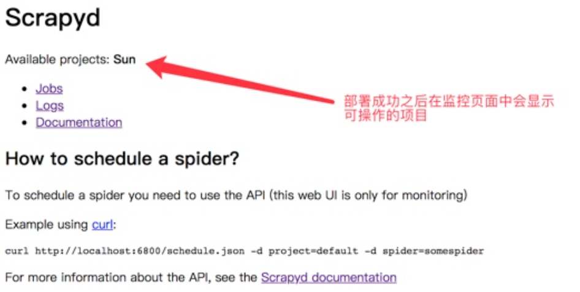

#### （3）通过`scrapy-client`部署

为了方便 `Scrapy`项目的部署，`Scrapyd-Client `提供两个功能：

- 将项目打包成 `egg` 文件。
- 将打包生成的 `egg` 文件通过 `addversion.json` 接口部署到 `Scrapyd` 上。

```python
pip3 install scrapyd-client
```

第一步，配置`scrapy.cfg`文件。

```python
[deploy] 
url = http://localhost:6800/  # 填入scrapyd运行服务的ip地址
project = 项目名(创建爬虫项目时使用的名称)
```

第二部，在该文件所处路径下执行

```python
scrapyd -deploy [--version 201707131455]  # 中括号内可选
```

还可以通过`Nginx`实现登陆验证，如需实现，只需要在`scrapy.cfg`文件下添加`username`和`password`参数即可。

### 4.管理scrapy项目

#### （1）通过请求+参数的方式管理项目。

```python
# 启动项目
curl http://localhost:6800/schedule.json -d project=project_name -d spider=spider_name
# 关闭爬虫
curl http://localhost:6800/cancel.json -d project=project_name -d job=jobid
```

#### （2）使用requests模块控制scrapy项目

```python
import requests

# 启动爬虫
url = 'http://localhost:6800/schedule.json'
data = {
	'project': 项目名,
	'spider': 爬虫名,
}
resp = requests.post(url, data=data)

# 停止爬虫
url = 'http://localhost:6800/cancel.json'
data = {
	'project': 项目名,
	'job': 启动爬虫时返回的jobid,
}
resp = requests.post(url, data=data)
```

#### （3）其他`api`

`Scrapyd`提供了一系列HTTP接口来实现各种操作。

- `daemonstatus.json`

```shell
curl http://192.168.2.3:6800/daemonstatus.json
# ["status":"ok","finished":90,"running":9,"node_name":"vm1","pending": 0}
```

其中，返回结果中`status`是当前运行状态，`finished` 代表当前已经完成的` Scrapy` 任务，`running`代表正在运行的`Scrapy`任务，`pending`代表等待被调度的 `Scrapyd`任务，`node_name` 是主机的名称。

- ` addversion.json`

部署Scrapy项目的接口，在部署时，首先需要将项目打包成`egg`文件，然后传入项目名称和部署版本。

```shell
curl http://192.168.2.3:6800/addversion.json -F project=<project_name> -F version=v1 -F egg=<project_name>.egg
# {"status":"ok","spiders”:3}
```

`-F`代表添加一个参数，还需要将项目打包成`egg` 文件放到本地。最后将`<project name>`替换成真实的项目名称。上述结果代表部署成功，并且其中包含的 `Spider` 的数量为3。

- `schedule.json`

部署完成之后，项目其实就存在于 `Scrapyd`之上了，借助`schedule.json`接口来调度已部署的项目。

```shell
curl http://192.168.2.3:6800/schedule.json -d project=<project_name> -d spider=<spider_name>
# {"status":"ok","jobid":"6487ec79947edab326d6db28a2d86511e8247444"}
```

这里传入了两个参数:`project`即`Scrapy`项目名称，`spider`即`Spidcr` 名称。返回结果显示项目正常启动，爬取任务代号为`jobid`。

- `cancel.json`

取消某个爬取任务的接口，如果某个任务处于`pending` 状态，它将会被移除；如果任务是`running`状态，那么它将会被终止。

```shell
curl http://192.168.2.3:6800/cancel.json -d project=<project_name> -d job=6487ec79947edab326d6db28a2d86511e8247444
# {"status":"ok","prevstate": "running"}
```

这里的参数`project`也是项目名称，`jobid`也是任务代号。

- `listprojects.json`

列出部署到 `Scrapyd` 服务上的所有项目的描述信息的接口。

```shell
curl http://192.168.2.3:6800/listprojects.json
# {"status":"ok","projects":["project1","project2"]}
```

其中`status` 代表请求执行情况，`projects`是项目名称列表。

- `listversions.json`

用于获取某个项目的所有版本号。版本号是按顺序排列的，其最后一个条目是最新的版本号。

```shell
curl http://192.168.2.3:6800/listversions.json?project=<project_name>
# {"status":"ok","versions":["v1","v2"]}
```

参数 `project`是项目的名称，返回结果中`status` 代表请求执行情况，`versions` 是版本号列表。

- `listspiders.json`

用来获取某个项目最新的一个版本的所有` Spider` 名称的接口，

```shell
curl http://192.168.2.3:6800/listspiders.ison?project=<project name>
# {"status": "ok","spiders":["spider1"]}
```

`project`是项目名称，返回结果中`status` 代表请求执行情况，`spiders`是`Spider` 名称列表。

- `listjobs.json`

获取某个项目当前运行的所有任务详情。

```python
curl http://192.168.2.3:6800/listjobs.json?project=project

{
    "status":"ok", 
    "pending":[{"id":"78391ccofcaf11e1b0090800272a6d06""spider":"spider1"}],
    "running":[{"id":"422e608f9f28cef127b3d5ef93fe9399","spider": "spider1","start time": "2020-07-12 10:14:03.594664"}],
    "finished":[{"id":"2f16646cfcaf11e1b0090800272a6d06""spider":"spider1","start time":"2020-07-1210:14:03.594664"，"end time":"2020-07-12 10:24:03.594664"}]
}
```

其中 `status` 代表请求执行情况，`pending` 代表当前正在等待的任务，`running` 代表当前正在运行的任务，`finished` 代表已经完成的任务。

- `delversion.json`

删除项目的某个版本。

```python
curl http://192.168.2.3:6800/delversion.json -d project=<project_name> -d version=<version_name>
# {"status":"ok"}
```

参数`project`是项目名称，参数 `version`是项目的版本。响应结果 `status` 代表请求执行情况。

- `delproject.json`

用来删除某个项目。

```python
curl http://192.168.2.3:6800/delproject.json -d project=<project_name>
# {"status": "ok"}
```

参数` project`是项目名称，`status` 代表请求执行情况。

## 二、scrapydweb

是一个基于`scrapyd`的可视化组件，集成并且提供更多可视化功能和更优美的界面。`scrapydweb`后端是采用`flask`框架编写的，所以对于会`flask`的同学是可以适当定制的。

项目地址：https://github.com/my8100/scrapydweb?tab=readme-ov-file

### 1.安装配置

#### （1）安装

```shell
pip install scrapydweb
```

#### （2）运行指令

在运行`scrapydweb`之前一定要确保`scrapyd`正在运行，可以在`scrapyd`服务启动之后重新创建一个新终端窗口来启动`scrapydweb`。

```python
scrapyd
scrapydweb
```

> `scrapydweb`第一次启动可能会报错，报错之后重新启动即可，重新启动后会在启动路径的位置生成脚本文件。如果重新启动失败并抛出版本依赖问题请查看项目地址中的`requirements.txt`文件并安装最新依赖。

当成功启动后可使用物理机浏览器访问地址：http://192.168.70.82:5000/

### 2.基本使用

（1）发布`scrapy`项目

在计算机中搜索需要部署的项目，项目可以打包成压缩包，在打包压缩包之前需要确认项目中只有`scrapy`框架代码。

项目上传成功后点击运行即可。

## 三、Gerapy爬虫管理

`Gerapy` 是一款**分布式爬虫管理框架**，支持 Python 3，基于 Scrapy、Scrapyd、Scrapyd-Client、Scrapy-Redis、Scrapyd-API、Scrapy-Splash、Jinjia2、Django、Vue.js 开发。

> `gerapy`和`scrapyd`的关系就是：我们可以通过`gerapy`中配置`scrapyd`后，不使用命令，直接通过图形化界面开启爬虫。

### 1.Gerapy的安装

```shell
pip3 install gerapy
```

在终端中执行 gerapy 会出现如下信息则说明安装成功。

```shell
Usage:
​			gerapy init [--folder=<folder>]
​			gerapy migrate
​			gerapy createsuperuser
​			gerapy runserver [<host:port>]	
```

### 2.Gerapy配置启动

#### （1）新建项目

```shell
gerapy init
```

执行完该命令之后会在当前目录下生成一个gerapy文件夹，进入该文件夹，会找到一个名为projects的文件夹。

#### （2）初始化数据库

```shell
# 在gerapy目录中操作
gerapy migrate
```

对数据库初始化之后会生成一个SQLite数据库，数据库保存主机配置信息和部署版本等。

#### （3）设置管理账号

```python
gerapy initadmin
# 如果不想使用默认的 admin 账号，也可以创建单独的账号
gerapy createsuperuser
```

输入用户名和密码之后，就可以创建一个管理员账号了。

#### （4）启动 gerapy服务

```shell
gerapy runserver
```

此时在启动gerapy服务的的8000端口上开启了Gerapy服务，在浏览器中输入http://localhost:8000就能进入Gerapy管理界面，在管理界面就可以进行主机管理和界面管理。

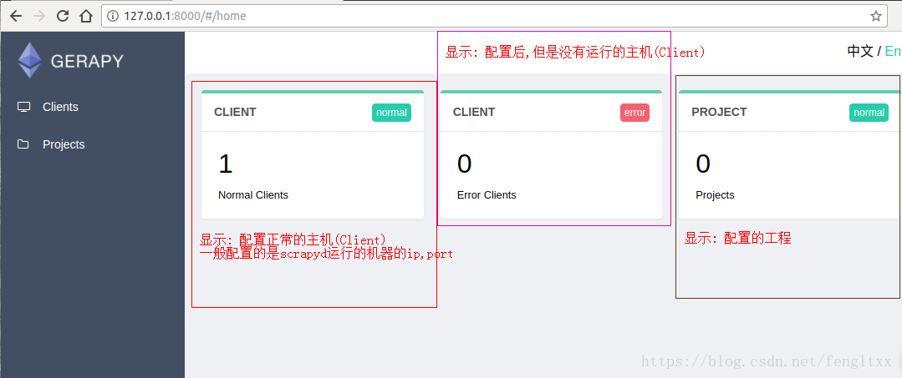

### 3.通过Gerapy配置管理scrapy项目

#### （1）配置主机

- 添加scrapyd主机

需要添加 IP、端口，以及名称，点击创建即可完成添加，点击返回即可看到当前添加的 Scrapyd 服务列表，创建成功后，可以在列表中查看已经添加的服务。

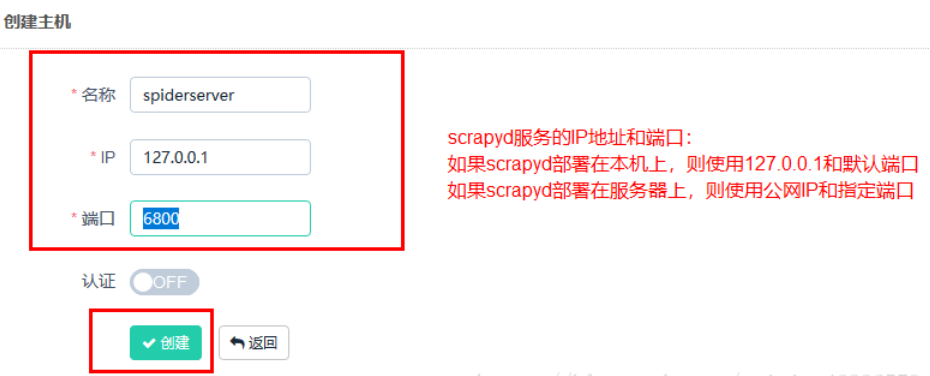

- 执行爬虫，就点击调度，然后运行

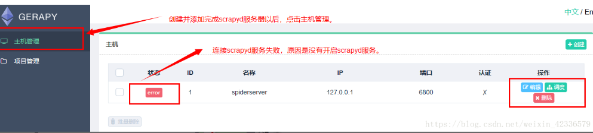

前提是配置的scrapyd中，已经发布了爬虫

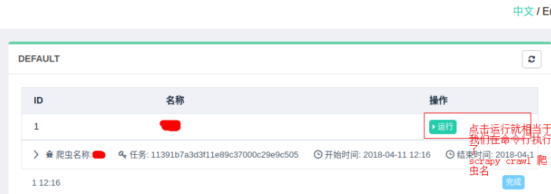

#### （2）配置`projects`

在`gerapy`目录下有一个空的`projects`文件夹，这就是存放`Scrapy`目录的文件夹。如果想要部署某个 `Scrapy`项目，只需要将该项目文件放到 `projects `文件夹下即可。

- 将scarpy项目直接放到 /gerapy/projects下即可。

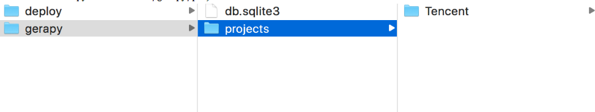

- 在gerapy后台看到有个项目

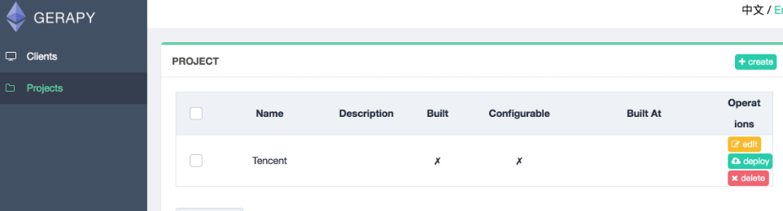

- 点击部署点击部署按钮进行打包和部署，在右下角我们可以输入打包时的描述信息，类似于 Git 的 commit 信息，然后点击打包按钮，即可发现 Gerapy 会提示打包成功，同时在左侧显示打包的结果和打包名称。

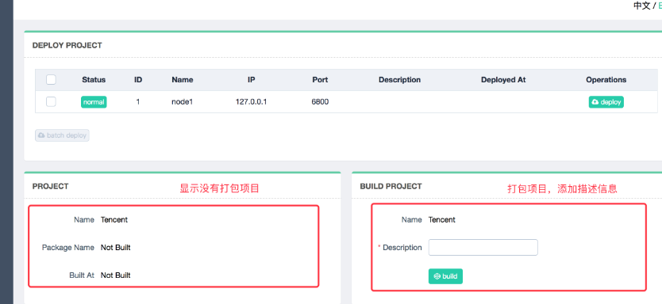

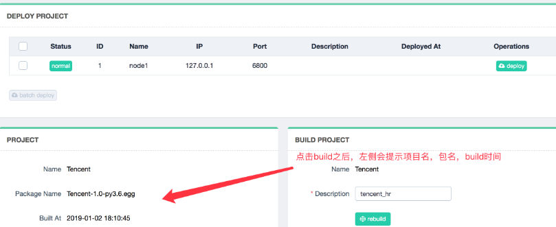

- 选择一个站点，点击右侧部署，将该项目部署到该站点上

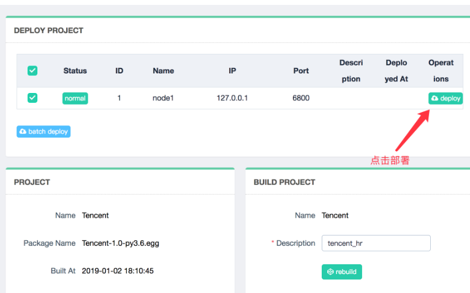

成功部署之后会显示描述和部署时间

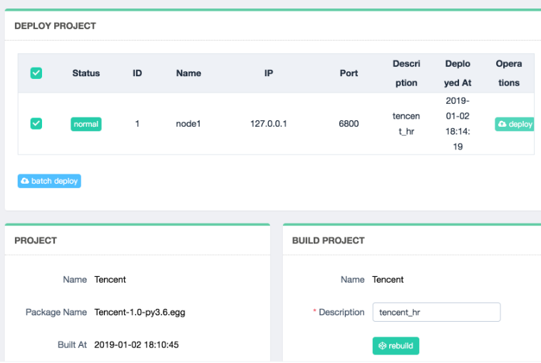

来到clients界面，找到部署该项目的节点，点击调度

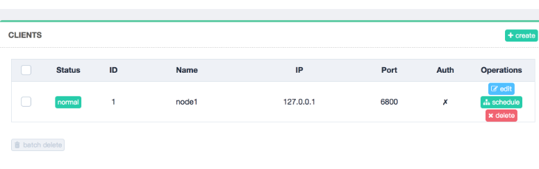

在该节点中的项目列表中找到项目，点击右侧run运行项目

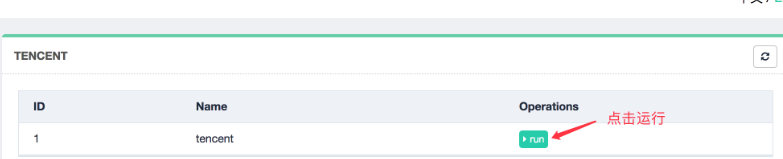

> `scrapyd`需要需要使用命令行调用`scrapy`进行爬虫，而`Greapy`则可以通过图形化界面直接调用爬虫。 

## 四、 `Scrapy` 对接` Docker` 

随着容器化技术的发展，`Docker+Kubemnetes` 的解决方案变得越来越流行，`Kubernetes `毫无疑问已经成了最主流的容器化编排工具，而且使用也越来越广泛。可以将`Scrapy`项目打包成 `Docker` 容器，并迁移到` Kubernetes` 进行管理和维护。

### 1.制作`scrapy-dcoker`镜像

Docker 可以提供操作系统级别的虚拟环境，一个 Docker 镜像一般都包含一个完整的操作系统，而这些系统内也有已经配置好的开发环境，如 Python 3.6 环境等，可以利用这一点，将 `Scrapy` 项目制作成一个新的 `Docker` 镜像，镜像里只包含适用于本项目的 `Python `环境。如果要部署到其他平台，只需要下载该镜像并运行就好了，因为 `Docker` 运行时采用虚拟环境，和宿主机是完全隔离的，所以也无需担心环境冲突问题。

#### （1）创建 `Dockerfile`

在项目的根目录下新建一个 `requirements.txt` 文件，将整个项目依赖的` Python `环境包都列出来：

```python
scrapy>=1.4.0
pymongo>=3.4.0
```

同时在项目根目录下新建一个 `Dockerfile` 文件，文件不加任何后缀名，修改内容如下所示：

```dockerfile
FROM python:3.10
ENV PATH /usr/local/bin:$PATH
ADD . /code
WORKDIR /code
RUN pip3 install -r requirements.txt
CMD scrapy crawl quotes
```

第一行的 `FROM `代表使用的 `Docker` 基础镜像，这里使用`python:3.10`的镜像。

第二行 `ENV `是环境变量设置，将` /usr/local/bin:$PATH` 赋值给 `PATH`，即增加` /usr/local/bin` 这个环境变量路径。

第三行 `ADD` 是将本地的代码放置到虚拟容器中。它有两个参数：第一个参数是`.`，代表本地当前路径；第二个参数是` /code`，代表虚拟容器中的路径，也就是将本地项目所有内容放置到虚拟容器的` /code` 目录下，以便于在虚拟容器中运行代码。

第四行 `WORKDIR` 是指定工作目录，这里将刚才添加的代码路径设成工作路径。这个路径下的目录结构和当前本地目录结构是相同的，所以可以直接执行库安装命令、爬虫运行命令等。

第五行 `RUN` 是执行某些命令来做一些环境准备工作。由于 `Docker` 虚拟容器内只有` Python 3` 环境，而没有所需要的 `Python` 库，所以我们运行此命令来在虚拟容器中安装相应的 `Python` 库如 `Scrapy`，这样就可以在虚拟容器中执行 `Scrapy` 命令了。

第六行 `CMD` 是容器启动命令。在容器运行时，此命令会被执行。在这里我们直接用 `scrapy crawl scrapycompositedemo `来启动爬虫。

#### （2）修改代码

由于项目将被打包成`Docker`镜像，因此需要修改代码，首先，曾经使用的代理池、账号池的`API`地址等公用配置信息，曾经是写死在`setting`中的，打包成镜像最好修改为镜像的环境变量的形式，以便于后期统一管理。其次，用到的`Mysql`、`Redis`或是`MongoDB` 的连接信息，如果用到的时本机链接，那么链接地址也需要修改，因为项目镜像将用于被其他远程主机运行，容器内部并没有安装这些服务，因此，如果在本机测试，需要将地址修改为宿主机的 IP，也就是容器外部的本机 IP，一般是一个局域网 IP，使用 ifconfig 命令即可查看。如果要部署到远程主机运行，则需要写入可公网访问的地址。

可以在`setting`文件中增加类似于如下代码，将原本写死的代码修改为从环境变量中获取，要记住自己设置的变量名。

```python
# settings.py
import os

accountpool_url = os.getenv('ACCOUNTPOOL_URL')
proxypool_url = os.geteny('PROXYPOOL_URL')
REDIS_URL = oS.getenV('REDIS_URL')
```

#### （3）构建镜像

命令最后有一个`.`点号，代表着当前运行目录。

```shell
docker build -t scrapycompositedemo:latest .

...
Removing intermediate container c092b5557ab8
Successfully built c8101aca6e2a
# 得到如上输出说明构建成功。
```

（4）运行镜像

运行前需要先指定环境变量。可以新建一个`.env `文件，其内容如下:

```python
ACCOUNTPO0L_URL=http://host.docker.internal:6777/antispider7/random
PROXYP00L_URL=http://host.docker.internal:5555/random
REDIS_URL=redis://host.docker.internal:6379
```

这里定义了三个环境变量，分别是账号池、代理池、Redis数据库的连接地址，其中每个变量的` host`地址都是 `host.docker.internal`，代表 `Docker `所在宿主机的IP地址，通过 `host.docker.internal`在 `Docker `内部访问宿主机的相关资源，当然要确保端口号正确。

```python
# 查看镜像
docker images
# scrapycompositedemo  latest  41c8499ce210    2 minutes ago   769 MB
# 运行镜像
docker run --env-file .env scrapycompositedemo
```

#### （4）推送至 Docker Hub

构建完成后，可以将镜像 `Push` 到 `Docker `镜像托管平台，如` Docker Hub `或者私有的` Docker Registry `等，这样如果想在其他的主机上运行这个镜像，主机上装好` Docker` 后，直接下拉镜像并运行就好了。

如果项目中包含了一些私有的连接信息（如数据库），最好将 `Repository` 设为私有或者直接放到私有的 `Docker Registry`，这里以`Docker Hub`为例：

首先在 https://hub.docker.com 注册一个账号，新建一个 `Repository`，名为` quotes`。比如，加入用户名为`shelhen`，`Repository`名为`quotes`，那么`Repository` 可用`shelhen/quotes`表示。

其次登录`Docker Hub`，输入 `Docker Hub`的用户名和密码之后就可以登陆了。

```python
docker login
```

接下来，为新建的镜像打一个标签

```python
docker tag scrapycompositedemo:latest shelhen/scrapycompositedemo:latest
```

执行如下命令推送自己构建的 `Docker `镜像：

```python
docker push shelhen/scrapycompositedemo
```

如果想在其他的主机上运行这个镜像，主机上装好` Docker` 后，创建`.env`文件，然后直接执行命令：

```
docker run --env-file .env shelhen/scrapycompositedemo
```

这样就会自动下载镜像，然后启动容器运行，不需要配置 `Python `环境，不需要关心版本冲突问题。

### 2.使用`Docker Compose`

`Docker Compose`是用于定义和运行多容器 `Docker `应用程序的工具。可以通过它使用` YAMIL`格式的文件来配置程序需要的所有服务，比如定义好需要构建的目标镜像名称、容器启动的端口、环境变量设置等，把这些固定的内容配置到` YAML `文件之后，只需要使用简单的`docker-compose` 命令就可以实现镜像的构建和容器的启动了。

> 基于`Docker Compose`构建的一大优点是只需要配置好构建模板就好，无需记忆大量`docker`命令，另外，`Docker Compose`还支持同时启动多个 Docker 容器协同运行。

#### （1）安装`Docker Compose`

最新的 `Docker `已经把 `Compose` 作为 `Docker `的命令一部分了，如果需要单独安装，参阅[菜鸟教程](https://www.runoob.com/docker/docker-compose.html)。

（2）创建`YAML`文件，在项目根目录创建`docker-compose.yaml`文件，

```yaml
version: "3"
services:
	redis:
		image:redis:alpine
		container_name:redis
		port:
		  - "6379"
	scrapycompositedemo:
		build: "."
		image:"shelhen/scrapycompositedemo"
		environment:
			ACCOUNTPO0L_URL=http://host.docker.internal:6777/antispider7/random
			PROXYP00L_URL=http://host.docker.internal:5555/random
			REDIS_URL=redis://host.docker.internal:6379
		depends_on:
		  - redis
```

首先指定`version`为3，代表着`compose`的版本信息，其次，配置了两个服务，一个是`redis`，一个是`scrapycompositedemo`。

`redis`直接使用了已有镜像构建，即只制定了`image`字段，内容为公开镜像名称`redis:alpine`，直接下载并运行即可启动一个 Redis 服务，镜像名称为`redis`，端口为`6379`。

`Scrapy`爬虫项目通过本地代码构建，其`build`位置为当前目录`.`，目标镜像名称`"shelhen/scrapycompositedemo"`，这里直接指定为了`Docker Hub`配置地址，接下来，利用`environment`来指定环境变量，`depends_on`配置为`redis`，即该容器的启动需要依赖于刚才声明的 `redis` 服务，只有等`redis`对应的容器正常启动之后，该容器才会启动。

#### （3）构建运行镜像

利用` docker-compose`命令来构建`Docker `镜像，在 `docker-compose.yaml `目录下运行命令：

```python
docker-compose build
```

运行镜像无须再指定环境变量、容器名称、容器运行端口等内容，只需要一条命令即可：

```python
docker-compose up
```

也是十分简单的，我们也一条命令就可以一下子启动`redis` 和`scrapycompositedemo `这两个服务:

#### （4）推送镜像

镜像在本地测试没有任何问题了，就可以把镜像推送到` Docker Hub` 或其他的`Docker Registry `服务上，

```python
docker-compose push
```

### 3.使用`Kubernetes`

`Kubernetes`，又被简称作 `K8s`（K 和 s 中间含有 8 个字母），它是用于编排容器化应用程序的云原生系统。`Kubernetes `诞生自 `Google`，现在已经由 `CNCF `（云原生计算基金会）维护更新。`Kubernetes` 是目前最受欢迎的集群管理方案之一，可以非常容易地实现容器的管理编排。

` Docker`等容器技术提供了相比传统虚拟化技术更轻量级的机制来创建隔离的应用程序的运行环境，因此运行`docker`程序时，无需担心其与宿主机之间产生资源冲突，不必担心多个容器之间产生资源冲突。同时，借助于容器技术，还能更好地保证开发环境和生产环境的运行一致性。另外由于每个容器都是独立的，因此可以将多个容器运行在同一台宿主机上，以提高宿主机资源利用率，降低了成本。

但是，容器


刚刚我们提到，Kubernetes 是一个容器编排系统，对于 “编排” 二字，可能不太容易理解其中的含义。


为了对它有更好的理解，我们先回过头来看看容器的定位是什么以及容器解决了什么问题，不能解决什么问题，然后我们再来了解下 Kubernetes 能够弥补容器哪些缺失的内容。


不过单单依靠容器技术并不能解决所有的问题，也可以说容器技术也引入了新的问题，比如说：

- 如果容器突然运行异常了怎么办？
- 如果容器所在的宿主机突然运行异常了怎么办？
- 如果有多个容器，他们之间怎么有效地传输数据？
- 如果单个容器达到了瓶颈，如何平稳且有效地进行扩容？
- 如果生产环境是由多台主机组成的，我们怎样更好地决定使用哪台主机来运行哪个容器？

以上列举了一些单纯依靠容器技术或者单纯依靠 Docker 不能解决的问题，而 Kubernetes 作为容器编排平台，提供了一个可弹性运行的分布式系统框架，各个容器可以运行在 Kubernetes 平台上，容器的管理、调度、部署、扩容等各个操作都可以经由 Kubernetes 来有效实现。比如说，Kubernetes 可以管理单个容器的声明周期，并且可以根据需要来扩展和释放资源，如果某个容器意外关闭，Kubernetes 可以根据对应的策略选择重启该容器，以保证服务的正常运行。再比如说，Kubernetes 是一个分布式的平台，当容器所在的主机突然发生异常，Kubernetes 可以将异常主机上运行的容器转移到其他正常的主机上运行，另外 Kubernetes 还可以根据容器运行所需要占用的资源自动选择合适的主机来运行。总之，Kubernetes 对容器的调度和管理提供了非常强大的支持，可以帮我们解决上述的诸多问题。

https://cuiqingcai.com/31100.html

