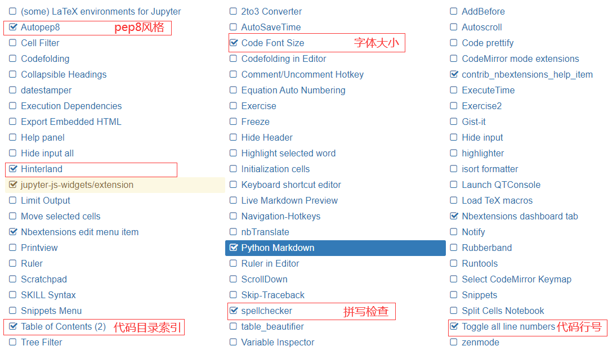
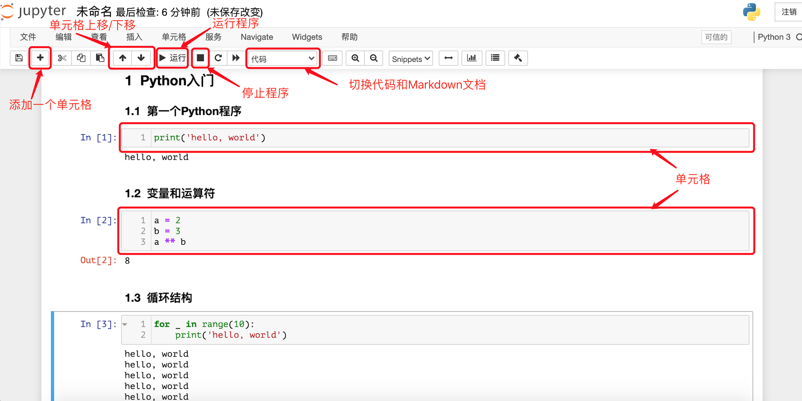

## 01.Jupyter的配置与使用

需要补充一些知识，除了基本使用外，还需要补充一些进阶知识，如切换R内核等等？

### 一、Jupyter的安装与配置

#### 1.Windows下配置与安装

```shell
# 进入虚拟环境目录，创建数据分析虚拟环境
python -m venv dataenv
dataenv\Scripts\deactivate.bat  # 激活虚拟目录
# 更新pip
python -m pip install --upgrade pip
# 安装jupyter
pip install jupyter
# 安装三大数据分析依赖库
pip install numpy pandas matplotlib
# 安装插件扩展
python -m pip install jupyter_contrib_nbextensions

# 配置完毕后执行
jupyter contrib nbextension install --user --skip-running-check

# 输入jupyter notebook 进入jupyter进行如下配置
```



```sh
# 进入jupyter文档库，按住shift+鼠标右键  进入cmd,输入jupyter notebook运行 Notebook
```

Notebook 是基于网页的用于交互计算的应用程序，可以用于代码开发、文档撰写、代码运行和结果展示。



### 二、Jupyter的使用

[《最详尽使用指南：超快上手Jupyter Notebook》](https://zhuanlan.zhihu.com/p/32320214)

#### 1.jupyter 编辑模式

| 编辑模式                                                     | 命令模式                                                   |
| ------------------------------------------------------------ | ---------------------------------------------------------- |
| 命令模式下， Enter 或 鼠标双击Cell 可进入编辑模式<br>编辑模式下可以 **操作cell内的文本** | 按 Esc 进入命令模式<br>命令模式下可以直接 **操作Cell本身** |

#### 2.自动补全、获得帮助和搜索命名

##### (1)自动补全

在使用 Notebook 编写代码时，按`Tab`键会获得代码提示。

##### (2)获得帮助

在使用 Notebook 时，如果希望了解一个对象（如变量、类、函数等）的相关信息或使用方式，可以在对象后面使用`?`并运行代码， 窗口下方会显示出对应的信息，帮助了解该对象。

##### (3)搜索命名

如果只记得一个类或一个函数名字的一部分，可以使用通配符`*`并配合`?`进行搜索。

#### 3.快捷键

| 通用快捷键                      | 功能说明                             |
| ------------------------------- | ------------------------------------ |
| Alt + Enter（Option + Enter）   | 运行当前单元格并在下面插入新的单元格 |
| Shift + Enter                   | 运行当前单元格并选中下方的单元格     |
| Ctrl + Enter（Command + Enter） | 运行当前单元格                       |

##### (1)命令模式下的快捷键

| 快捷键               | 功能说明                                       |
| -------------------- | ---------------------------------------------- |
| **Esc+Y**            | 进入 Code 模式,可以添加可执行的代码            |
| **Esc+M**            | 进入 MarkDown 模式                             |
| **Esc+A**/**Esc+B ** | 在当前Cell上方添加Cell；在当前Cell下方添加Cell |
| **Esc+双击D**        | 删除当前Cell                                   |
| **Esc+Z**            | 撤销                                           |
| **Esc+L**            | 为当前Cell添加行号                             |
| **Ctrl+Shift+P**     | 进入帮助                                       |

##### (2)编辑模式下的快捷键

| 快捷键            | 功能说明     |
| ----------------- | ------------ |
| **Tab**           | 自动补全     |
| **Ctrl+/**        | 注释         |
| **Ctrl+Z**        | 撤回         |
| **Ctrl+Y**        | 撤销         |
| **Ctrl+鼠标点击** | 多选         |
| **ctrl+S**        | 保存并检查   |
| **数字+**         | 代码转为标题 |

> 如果记不住这些快捷键也没有关系，在命令模式下按`h`键可以打开 Notebook 的帮助系统，可以根据实际的需要重新编辑快捷键。

#### 4.魔法命令

##### (1)可以在 Notebook 中使用`!`后面跟系统命令的方式来执行系统命令。

##### (2)Notebook 中有很多非常有趣且有用的魔法指令

| 魔法指令                                    | 功能说明                                   |
| ------------------------------------------- | ------------------------------------------ |
| `%pwd`                                      | 查看当前工作目录                           |
| `%ls`                                       | 列出当前或指定文件夹下的内容               |
| `%cat`                                      | 查看指定文件的内容                         |
| `%hist`                                     | 查看输入历史                               |
| `%matplotlib inline`                        | 设置在页面中嵌入matplotlib输出的统计图表   |
| `%config Inlinebackend.figure_format='svg'` | 设置统计图表使用SVG格式（矢量图）          |
| `%run`                                      | 运行指定的程序                             |
| `%load`                                     | 加载指定的文件到单元格中                   |
| `%quickref`                                 | 显示IPython的快速参考                      |
| `%timeit`                                   | 多次运行代码并统计代码执行时间             |
| `%prun`                                     | 用`cProfile.run`运行代码并显示分析器的输出 |
| `%who` / `%whos`                            | 显示命名空间中的变量                       |
| `%xdel`                                     | 删除一个对象并清理所有对它的引用           |

```
cd D:
.\Environments\Analysis_env\Scripts\activate
cd .\Projects\Analysis\05.Regression\
jupyter-notebook
```

