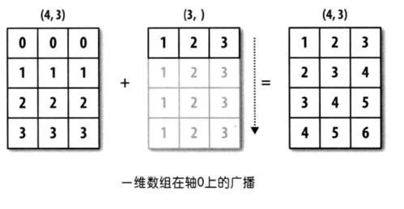
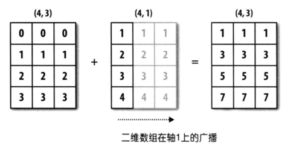
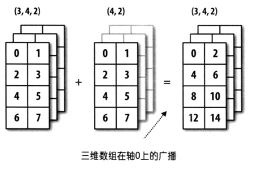

## 02.Numpy的使用

NumPy是使用Python进行科学计算的基础包，它提供了一个可以用作通用数据的高效多维容器，并支持自定义数据类型，可以实现高纬度数组的常用计算和操作，其底层代码使用 C / C ++ 语言编写，解决了 GIL 的限制，计算效率性能远远优于原生 Python对象。

官方文档：https://numpy.org/devdocs/；中文文档：https://www.numpy.org.cn/

### 一、基础知识

#### 1.`ndarray`数组

NumPy的主要对象是同构多维`ndarray`数组，又称`array`，区别于标准Python库类`array.array`，它全称为`numpy.array`，该对象相当于是一个快速而灵活的大数据容器，在处理数值计算方面，ndarray支持并行化运算（向量化运算），因此该结构在性能上远远优于原生Python，而且数据量越大，优势就越明显，并且`ndarray`提供了更多的方法来处理数据，尤其是和统计相关的方法。

#### 2.`ndarray`数组的常用属性

|      属性名字      |                           属性解释                           |
| :----------------: | :----------------------------------------------------------: |
|  `ndarray.shape`   | 数组的形状，返回数组维度的元组，每维度下包含元素的个数组成的元组。 |
|   `ndarray.ndim`   |             数组维数，等于`len(ndarray.shape)`。             |
|   `ndarray.size`   |        数组中的元素总数，等于 `shape` 的元素的乘积。         |
| `ndarray.itemsize` |               数组单个元素占用内存空间的字节数               |
|  `ndarray.nbytes`  |               数组所有元素占用内存空间的字节数               |
|  `ndarray.dtype`   | 数组元素的类型，<br>可以使用标准的Python类型创建或指定dtype，NumPy也提供它自己的类型<br>如numpy.int32、numpy.int16和numpy.float64。 |
|   `ndarray.flat`   |                数组（一维化之后）元素的迭代器                |
|   `ndarray.data`   |           缓冲区包含数组的实际元素，通常不会使用。           |

```python
import numpy as np

a = np.array([[1,2,3],[4,5,6]])  # (2, 3)  # 二维数组2*3的数组
c = np.array([[[1,2,3],[4,5,6]],[[1,2,3],[4,5,6]]])  # (2, 2, 3) # 三维数组
```

一维数组对应excel中一行或一列，二维对应一个表单，三维则对应多个表单。(2，2，3)中，第一个2表示第一维中包含几个表单，第二个2表示某表单中有2行数据，第三个3表示有三列。

#### 3.`ndarray`的类型

```python
type(a.dtype)
# numpy.dtypes.Int32DType
```

dtype是numpy.dtype类型，ndarray对象还可以为以下类型：

|      名称       |                       描述                        | 简写  |
| :-------------: | :-----------------------------------------------: | :---: |
|    `np.bool`    |      用一个字节存储的布尔类型（True或False）      |  'b'  |
|    `np.int8`    |             一个字节大小，-128 至 127             |  'i'  |
|   `np.int16`    |               整数，-32768 至 32767               | 'i2'  |
|   `np.int32`    |              整数，-2^31 至 2^32 -1               | 'i4'  |
|   `np.int64`    |              整数，-2^63 至 2^63 - 1              | 'i8'  |
|   `np.uint8`    |               无符号整数，0 至 255                |  'u'  |
|   `np.uint16`   |              无符号整数，0 至 65535               | 'u2'  |
|   `np.uint32`   |             无符号整数，0 至 2^32 - 1             | 'u4'  |
|   `np.uint64`   |             无符号整数，0 至 2^64 - 1             | 'u8'  |
|  `np.float16`   | 半精度浮点数：16位，正负号1位，指数5位，精度10位  | 'f2'  |
|  `np.float32`   | 单精度浮点数：32位，正负号1位，指数8位，精度23位  | 'f4'  |
|  `np.float64`   | 双精度浮点数：64位，正负号1位，指数11位，精度52位 | 'f8'  |
| `np.complex64`  |     复数，分别用两个32位浮点数表示实部和虚部      | 'c8'  |
| `np.complex128` |     复数，分别用两个64位浮点数表示实部和虚部      | 'c16' |
|  `np.object_`   |                    python对象                     |  'O'  |
|  `np.string_`   |                      字符串                       |  'S'  |
|  `np.unicode_`  |                    unicode类型                    |  'U'  |

数组的类型可以在创建数组时指定：

```python
a = np.array([[1, 2, 3],[4, 5, 6]], dtype=np.float32)
print(a.dtype)
arr = np.array(['python', 'tensorflow', 'scikit-learn', 'numpy'], dtype = np.string_)
print(arr)

# dtype('float32')
# array([b'python', b'tensorflow', b'scikit-learn', b'numpy'], dtype='|S12')
```

也可以在创建数组后修改：

```python
a.astype(np.int32)

ndarray.tostring([order])  # 直接将数字转化为字符串
ndarray.tobytes([order])  # 直接将数字转化为bytes
```

#### 4.`ndarray`对象通用函数

| 方法                | 说明                                                         |
| ------------------- | ------------------------------------------------------------ |
| `astype()`          | 拷贝数组，并将数组中的元素转换为指定的类型返回。             |
| `append` / `insert` | 向数组末尾追加元素 / 在数组指定位置插入元素                  |
| `nonzero()`         | 返回非0元素的索引。                                          |
| `round()`           | 对数组中的元素做四舍五入操作。                               |
| `sort()`            | 对数组元素进行排序, 默认为从小到大，用axis控制是否全排序还是按行列排 |
| `argsort()`         | 对数组元素进行排序, 默认为从大到小。                         |
| `swapaxes()`        | 交换数组指定的轴。                                           |
| `transpose()`       | 反转或置换数组的轴； 返回修改后的数组。对于二维数组 a，transpose(a) 是矩阵转置。 |
| `concatenate()`     | 沿着已经存在的轴合并多个矩阵，轴线由axis指定。               |
| `take()`            | 沿轴从数组中获取元素，轴线由axis指定，类似于切片。           |
| `tolist()`          | 将数组转成Python中的`list`。                                 |
| `place` / `put`     | 将数组中满足条件的元素/指定的元素替换为指定的值。            |

```python
print(np.all(stock_change)) # 判断数组是否所有元素都是`True`
print(np.any(stock_change)) # 判断数组是否有为`True`的元素。

print(stock_change.astype(int)) # 拷贝数组，并将数组中的元素转换为指定的类型返回。
new_stock1 = np.array([-0.03862668, -1.8701446, 0.79050681, 1.56360431, 0.4765644, 0.97014013,  0.29886514, 0.29886514,  0.06570421, -0.86801677]).reshape(1,10)
stock_change2 = np.append(stock_change,new_stock1)  # 如未给定axis，那么astock_change2将首先被展平为一维数组。
# 注意.shape()返回的结果是(行,列)
# axis=0时：数组是加在下面（要求列数要相同）
# 这意味着对第一维度执行操作。可以简单理解为加到线上。因此行数增加，列数保持不变。
stock_change3 = np.append(stock_change,new_stock1,axis=0)
new_stock2 = np.array([-0.03862668, -1.8701446, 0.79050681, 1.56360431, 0.4765644, 0.97014013,  0.29886514, 0.29886514]).reshape(8,1)
# axis=1时：数组是加在右面（要求行数要相同）
stock_change4 = np.append(stock_change,new_stock2,axis=1)
stock_change4

# insert用法类似，可以在指定位置插入
# np.insert(arr,obj,values,axis=None):这里的obj用来指定插入位置。

# flatten()：将数组扁平化为一维数组
stock_change.flatten()

# stock_change.nonzero() # 返回非0行的索引
# round(arr,decimal,out=None)
stock_change.round(4) # 保留n位小数
# sort(arr, axis=-1, kind=None, order=None): # 对数组元素进行全排序, 默认为从小到大
np.sort(stock_change, kind='quicksort')
# kind(排序算法) : {'quicksort', 'mergesort', 'heapsort', 'stable'} =>
# order参数可以传入高阶函数
# np.argsort(stock_change,kind='quicksort') # 对数组元素进行全排序, 默认为从大到小

# 也可以分别按照行列排序
np.sort(stock_change,axis=0)  # 按行排序
np.sort(stock_change,axis=1)  # 按列排序

# transpose() ：转置数组
stock_change.transpose()

# numpy.concatenate()函数适合大规模数据拼接，能够一次完成多个数组的拼接，在合并数组上会比append()更方便，且更有效率。
# numpy.concatenate((a1, a2, ...), axis=0, out=None)
# axis 指定拼接的方向，默认axis = 0(逐行拼接)(纵向的拼接沿着axis= 1方向)。

a = np.arange(3*3).reshape((3,3))
b = np.arange(3*4).reshape((3,4))

np.concatenate([a,b],axis=1)

print(stock_change.take(indices=1,axis=0))  # axis=0 按行；  axis=1 按列  (二维数组，so,只能取0或1)
print(stock_change.take(1,0))  # 可以忽略参数，等价于按列，取第1列

# numpy.place(arr，mask，vals)
# arr传入需要更改的元组，mask中传入需要更改数据的条件，vals中传入一维数组，以此对满足mask条件的数据进行修改，当满足条件数据量更大时，将重复vals中的值，它与numpy.extract()相反。————结果将直接在原数组中修改。
np.place(stock_change, stock_change < -1, [15, 25, 35])
stock_change
```

### 二、数组的创建

numpy中用于创建数组的函数很多，常用的有如下几个：

| 创建函数                                                  | 解释说明                                                     |
| :-------------------------------------------------------- | ------------------------------------------------------------ |
| `array(object[, dtype, copy, order, subok, ndmin])`       | 将列表、元组、数组等序列直接转化为ndarray对象，如果obj本身就是ndarray，则返回一个深拷贝。 |
| `asarray(obj[, dtype, order])`                            | 同上，这时obj如果本身是ndarray，则返回一个浅拷贝。           |
| `arange(start,stop, step, dtype)`                         | 类似arange，但该方法返回ndarray序列而不是可迭代对象。        |
| `linspace (start, stop, num, endpoint)`                   | 通过指定初始值、终止值和元素个数创建等差数列一维数组，可以通过endpoint参数指定是否包含终止值，默认值为True |
| `logspace(start,stop, num)`                               | 与linspace类似，不过它所创建的数组是等比数列。基数可以通过base参数指定，默认值为10。 |
| `ones(shape[, dtype, order]) `                            |                                                              |
| `ones_like(a[, dtype, order, subok])`                     |                                                              |
| `zeros()`                                                 |                                                              |
| `zeros_like()`                                            |                                                              |
| `empty()`                                                 | https://numpy.org/devdocs/reference/generated/numpy.empty.html#numpy.empty |
| `empty_like()`                                            | https://numpy.org/devdocs/reference/generated/numpy.empty_like.html#numpy.empty_like |
| `np.random.rand()`                                        | 返回一组满足0-1分布的均匀分布的数或N维数组。                 |
| `np.random.uniform(low=0.0,high=1.0,size=None,dtype='l')` | 从一个均匀分布[low,high)中随机采样，注意定义域是左闭右开，即包含low，不包含high，其中low为float类型，默认值为0；high为float类型，默认值为1； |
| `np.random.randint(low,high=None, size=None,dtype='l')`   | 从一个均匀分布中随机采样，生成一个整数或N维整数数组，取数范围：若high不为None时，取[low,high)之间随机整数，否则取值[0,low)之间随机整数。 |
| `np.random.randn()`                                       | 从标准正态分布中返回一个或多个样本值。                       |
| `np.random.standard_normal()`                             | 返回指定形状的标准正态分布的数组。                           |
| `np.random.normal(loc=0.0, scale=1.0, size=Non)`          | 创建一个正态分布，其均值为loc（对应着整个分布的中心centre），标准差为scale（对应于分布的宽度，scale越大越矮胖，scale越小，越瘦高）。 |
| `eye()`                                                   | 创建一个单位阵。                                             |
| `identity()`                                              |                                                              |
| `fromfunction()`                                          | https://numpy.org/devdocs/reference/generated/numpy.fromfunction.html#numpy.fromfunction |
| `fromfile()`                                              | https://numpy.org/devdocs/reference/generated/numpy.fromfile.html#numpy.fromfile |

更多创建数组的函数可参见：https://numpy.org/devdocs/reference/routines.array-creation.html

#### 1.从现有数组中创建新数组

```python
import numpy as np

# 创建多维ndarray
score = np.array([[80, 89, 86, 67, 79],
[78, 97, 89, 67, 81],
[90, 94, 78, 67, 74],
[91, 91, 90, 67, 69],
[76, 87, 75, 67, 86],
[70, 79, 84, 67, 84],
[94, 92, 93, 67, 64],
[86, 85, 83, 67, 80]])

# np.array(object[, dtype, copy, order, subok, ndmin])
# np.asarray(a[, dtype, order])

a = np.array([[1,2,3],[4,5,6]])  # 通过列表生成array
a1 = np.array(a)  # 也可以从现有的数组当中创建
a2 = np.asarray(a)  # 相当于索引的形式，并没有真正的创建一个新的
# 若令a[0,0]=1000,则a1不变，a2变化，说明array是深拷贝，asarray浅拷贝。
```

> 深拷贝复制新文件，浅拷贝创建快捷方式，array是深拷贝，asarray浅拷贝，新数组的类型由python元素类型推导而来。

#### 2.生成固定范围的数组

```python
np.linspace (start, stop, num, endpoint)  # 生成等间隔的序列
# start 序列的起始值
# stop 序列的终止值，
# num 要生成的等间隔   样例数量  ，默认为50
# endpoint 序列中是否包含stop值，默认为ture
np.linspace(0, 100, 11)  
# array([  0.,  10.,  20.,  30.,  40.,  50.,  60.,  70.,  80.,  90., 100.])

# 其他还有
numpy.arange(start,stop, step, dtype)  # 这里的step表示步长
np.arange(10, 50, 2)  
# array([10, 12, 14, 16, 18, 20, 22, 24, 26, 28, 30, 32, 34, 36, 38, 40, 42, 44, 46, 48])
numpy.logspace(start,stop, num)  # 生成10^x
np.logspace(0, 2, 3)  # array([  1.,  10., 100.])
```

#### 3.生成仅包含0或1的数组

```python
# 创建一个只包含1的数组，参数传入shape_(shape规定了数组的行数，列数)
np.ones(shape[, dtype, order]) 
# 创建一个只包含1的数组，其形状和参数矩阵a一样
np.ones_like(a[, dtype, order, subok])

np.zeros(shape[, dtype, order])
np.zeros_like(a[, dtype, order, subok])

np.ones(8)
np.ones_like(score)
np.zeros(9)
np.zeros_like(9)
```

> ones与ones_like的区别在于 前者传入一个形状来创建数组，后者传入数组对象，根据其结构来创建新数组。

#### 4.生均匀分布或正态分布

```python
np.random.rand(d0, d1, ..., dn)
# 返回[0.0，1.0)内的一组均匀分布的数。

np.random.uniform(low=0.0, high=1.0, size=None)
# 从一个均匀分布[low,high)中随机采样，注意定义域是左闭右开，即包含low，不包含high
# low: 采样下界，float类型，默认值为0；
# high: 采样上界，float类型，默认值为1；
# size: 输出样本数目，为int或元组(tuple)类型，例如，size=(m,n,k), 则输出mnk个样本，缺省时输出1个值。
# ndarray类型，其形状和参数size中描述一致。

np.random.randint(low, high=None, size=None, dtype='l')
# 从一个均匀分布中随机采样，生成一个整数或N维整数数组，取数范围：若high不为None时，取[low,high)之间随机整数，否则取值[0,low)之间随机整数。
```

```python
np.random.randn(d0, d1, …, dn)
# 从标准正态分布中返回一个或多个样本值

np.random.normal(loc=0.0, scale=1.0, size=None)
# loc：float 此概率分布的均值μ（对应着整个分布的中心centre）
# scale：float 此概率分布的标准差σ（对应于分布的宽度，scale越大越矮胖，scale越小，越瘦高）
# size：int or tuple of ints  输出的shape，默认为None，只输出一个值

np.random.standard_normal(size=None)
# 返回指定形状的标准正态分布的数组。
```

#### 5.数组的拷贝

```python
import numpy as np 

a = np.arange(12)
b = a                # no new object is created
print(b is a)        # True
# 赋值符号创建原数组的浅拷贝对象，二者共享同一个内存地址。
c = a.view()
print(c is a)        # False
# 不同的数组对象可以共享相同的数据，view()函数构造一个新的视图对象，它是原数组视图对象的深拷贝。
d = a.copy()
print(d is a)        # False
# copy()方法创建原数组对象的深拷贝，创建后，对a或d的修改或删除不会影响彼此。
```

### 三、数组的形状与索引

#### 1.数组的形状

|                          方法/属性                           | 说明                                                         |
| :----------------------------------------------------------: | ------------------------------------------------------------ |
|                       `ndarray.shape`                        | 返回数组维度的元组，每维度下包含元素的个数组成的元组。       |
|              `ndarray.reshape(shape[, order])`               | 不进行列互换，不改变原数组，生成并返回新数组。               |
|           `ndarray.resize(new_shape[, refcheck])`            | resize将改变原数组。                                         |
|                         `ndarray.T`                          | 将数组的行、列进行互换。                                     |
|               `ndarray.ravel(array,order='C')`               | 返回原数组扁平化后新数组的视图对象`view`的新数组，新数组是原数组的view对新数组修改会改变原数组。 |
|                 `ndarray.flatten(order='C')`                 | 返回深拷贝的新数组。                                         |
|                                                              |                                                              |
|                    `ndarray.vstack(a,b)`                     | 沿着y轴合并，纵向合并。                                      |
|                    `ndarray.hstack(a,b)`                     | 沿着x轴合并，横向合并。                                      |
| `ndarray.concatenate((a1,a2,...),axis=0out=None,dtype=None,casting="same_kind")` | 根据可选参数合并两个数组。                                   |
|                       `numpy.vsplit()`                       | 沿着y轴切割，横向分割。                                      |
|                       `numpy.hsplit()`                       | 沿着x轴切割，纵向分割。                                      |
|               `numpy.array_split(ary,axis=0,)`               | 根据可选参数分割一个数组。                                   |

##### 1）数组变形

```python
# 数组形状的改变
ndarray.reshape(shape[, order])  # 不进行列互换，产生新变量。
# 将所有数据提取至一行，然后按规则生成新数组。在转换形状的时候，一定要注意数组的元素匹配。
sndarray.reshape([10, 8])  # 将原本8行10列的数据转化为10行8列。
ndarray.reshape([-1, 8])  # 仅仅直到需要每行8个数据，无需提供几行，形状不匹配将会引发异常

# 处理结果与reshape相同，但是resize将改变原数组，reshape生成并返回新数组。
ndarray.resize(new_shape[, refcheck]) 
stock_change.resize([10, 8])
```

`ravel()`与`flatten()`及`flat`区别与联系

```python
import numpy as np

# flat是一个属性，flatten()是一个方法，前者返回原数组扁平化后的迭代器，后者返回原数组扁平化后的新数组，二者返回的新数组都是深拷贝，而ravel()返回原数组浅拷贝下扁平化后的新数组。

a = np.array([[[1, 2, 1, 2], [3, 4, 4, 4], [1, 2, 2, 2], [3, 4, 4, 5]],
              [[1, 2, 1, 2], [30, 40, 40, 42], [12, 23, 22, 21], [33, 34, 54, 64]]])

print(c.ravel())
print(c.flatten(order='F'))
for item in c.flat:
    print(item)
```

参数`order`控制数组数据的读取顺序，取值为“C”表示按行优先展开；“F”表示按列优先展开；“A”表示当输入数组在内存中是连续的，则以列优先的方式展开，否则以行优先的方式展开；“K”表示按数组元素在内存中出现的顺序展开。

##### 2）数组合并

多个数组可以沿不同的轴直接堆叠。

```python
b = np.floor(10*np.random.random((2,2)))
c = np.floor(10*np.random.random((2,2)))
np.vstack((b,c))  # 纵向合并
np.hstack((b,c))  # 横向合并
```

也可以进行更复杂的操作，如`column_stack`可以将1D数组作为列堆叠到2D数组中，`r_`和`c_`可以根据一个轴堆叠数字来创建数组。

```python
d = np.array((1,2,3))
e = np.array((2,3,4))
print(np.column_stack((d,e)))

print(np.r_[1:4,0,4]) # [1 2 3 0 4]
print(np.c_[np.array([[1,2,3]]), 0, 0, np.array([[4,5,6]])]) # [[1 2 3 0 0 4 5 6]]
```

##### 3）数组拆分

```python
f = np.arange(16.0).reshape(4, 4)

print(f)
print(np.hsplit(f, 2)) # 按列拆分为2个
print(np.hsplit(f,(3, 4))) # 指的是拆分坐标(3, 4)之后的列（均匀拆分），即第4列

print(np.vsplit(f, 2))  # 按行拆分为2个
print(np.hsplit(f, (3, 4)))
```

#### 2.数组去重

```python
import numpy as np

temp = np.array([[[1, 2, 1, 2], [3, 4, 4, 4], [1, 2, 2, 2], [3, 4, 4, 5]], [[1, 2, 1, 2], [30, 40, 40, 42], [12, 23, 22, 21], [33, 34, 54, 64]]])
print(np.unique(temp))  # array([1, 2, 3, 4, 5, 6])
```

`unique（）`函数会对原数组进行去重，注意它也会将结果扁平化为序列。

#### 3.数组的切片索引

##### 1）一般索引

一维数组和列表对象一样，可以进行切片索引和迭代工作。

```python
import numpy as np

a = np.arange(10) # [0 1 2 3 4 5 6 7 8 9]

print(a)
print(a[2]) # 2
print(a[2:5])  # [2 3 4]
print(a[:6:2]) # [0 2 4]
```

多维的数组每个轴可以有一个索引，这些索引以逗号分隔的元组给出。

```python
b= np.array([[ 0,  1,  2,  3],
          [10, 11, 12, 13],
          [20, 21, 22, 23],
          [30, 31, 32, 33],
          [40, 41, 42, 43]])

print(b)
print(b[2,3])  # 23
print(b[0:5, 1]) # [ 1 11 21 31 41]
print(b[ : ,1] ) # [ 1 11 21 31 41]
print(b[1:3, : ]) # [[10 11 12 13],[20 21 22 23]]

# 当提供的索引少于轴的数量时，缺失的索引被认为是完整的切片。
print(b[-1])  # b[-1,:]) ->[40 41 42 43]

# 对多维数组进行迭代，迭代的对象是轴，如果需要对每个元素进行迭代，则需要flat或者先扁平化为一维数组。
for row in b:
    print(row)
# 对于三维数组取出数据，a1[0, 0, 1]   # 输出:第一张表单中第一行，第二列的数据，可以在第三个值处写成0:3.
```

`numpy`还提供了运算符`...`表示产生完整索引元组所需的冒号，例如`x[1,2,...]` 相当于 `x[1,2,:,:,:]`，`x[...,3]` 等效于 `x[:,:,:,:,3]`，`x[4,...,5,:]` 等效于 `x[4,:,:,5,:]`。

##### 2）花式索引

- 索引数组

NumPy数组可以使用其他数组（或序列对象如列表）来进行索引，注意索引数组的结果是返回原始数据的副本，而不是切片获取的视图。简单的情况：

```python
x = np.arange(10,1,-1) # [10,  9,  8,  7,  6,  5,  4,  3,  2]
print(x[np.array([3, 3, 1, 8])])  # [7, 7, 9, 2]
# 一般情况下，使用索引数组将返回和索引数组具有相同形状的数组，因此还可以使用多维数组控制新数组的形状。
print(x[np.array([[1,1],[2,3]])]) # [[9, 9], [8, 7]]
```

一维时，每个索引由索引数组在被索引的数组中具有的值替换，允许使用负值，但超出索引范围将会引发异常。

复杂的情况：

```python
f = np.arange(16.0).reshape(4, 4)

print(f[np.array([0,2,3]), np.array([0,1,2])])  # [ 0.  9. 14.]
# 如上，其分别获取了(0,0),(2,1),(3,2)位置的数，并按照形状组成了新的数组。
# 当仅传入维度少于原数组的索引数组时，会默认获取未传入数组的全部值，如下：
print(f[np.array([0,2,3])])
# 这里将会获取第1行、第3行、第4行的全部数值：[[ 0.  1.  2.  3.],[ 8.  9. 10. 11.], [12. 13. 14. 15.]]
```

这意味着，对于多维数组，传入的多个维度的索引值必须具有相同的形状，如果形状不同，首先numpy会尝试将它们广播为相同的形状。如果它们无法广播到相同的形状，则会引发异常。

- 布尔索引

布尔数组的处理方式与索引数组完全不同，首先，布尔数组必须与要索引的数组具有相同的形状，得到的结果会是一个一维数组，其中包含索引数组中与布尔数组中所有真实元素对应的所有元素。与索引数组一样，返回的是数据的副本，而不是切片所获得的视图。并且，当布尔数组中元素的个数少于要索引的数组中元素个数时，

```python
f = np.arange(16.0).reshape(4, 4)

print(f[f>5])  # [ 6.  7.  8.  9. 10. 11. 12. 13. 14. 15.]
# 如果f的维数多于b，则结果将是多维的,因为多维数组中布尔运算对应轴元素。
print(f[[False, False, True,  True]])
# [[ 8.  9. 10. 11.], [12. 13. 14. 15.]]
```

- 复合索引

```python
f = np.arange(16.0).reshape(4, 4)
# 索引数组可以与切片数组结合
f[np.array([0,2,3]),1:3]  # [[ 1.  2.], [ 9. 10.], [13. 14.]]
# 首先索引数组获取其第1、3、4行，其次截取第2-4列（不包含第四列）
# 布尔数组也可以与切片数组结合
print(f[[False, False, True,  True], 1:3]) # [[ 9. 10.], [13. 14.]]
```

- 结构索引工具

为了便于数组形状与表达式和赋值的轻松匹配，可以在数组索引中使用`np.newaxis`对象来添加大小为1的新维度。

```python
f = np.arange(16.0).reshape(4, 4)
print(f[:,np.newaxis,:].shape)  # (4, 1, 4)
```

数组中没有新增加元素，只是增加了维度。这可以方便地以一种方式组合两个数组，否则将需要显式重新整形操作。

#### 4.数组修改

可以直接通过赋值符号修改数组中的值，对通过索引获取的许多元素执行修改操作时，需要确定分配给索引数组的值必须是形状一致的（与索引生成的形状相同的形状或可广播）。

```python
g = np.arange(0, 50, 10)

g[2:4] = 20
print(g)
g[1] = 1.2 # <type 'exceptions.TypeError'>: can't convert complex to long; use

g[np.array([1, 1, 3, 1])] += 1
print(g) # [ 0 11 20 21 40]
```

注意两点，第一，如果将较高类型分配给较低**类型**（如浮点数到整数或将复数分配给浮点数/整数），其赋值结果可能会引发异常；第二，非引用类型在进行赋值操作时，将总是对数组中的原始数据进行赋值，因此如上第二个例子，三次获取`g[1]+=1`，不等价于`g[1]=g[1]+1+1+1`，因为数组的值被赋予`g [1]`三次，而不是递增3次。

### 四、数组的简单计算

#### 1.广播机制

执行 broadcast 的前提在于，两个 ndarray 执行的是 element-wise的运算，Broadcast机制的功能是为了方便不同形状的ndarray（numpy库的核心数据结构）进行数学运算。当操作两个数组时，numpy会逐个比较它们的shape（构成的元组tuple），只有在下述情况下，两个数组才能够进行数组与数组的运算。

- 维度相等
- shape（其中相对应的一个地方为1）

广播允许通用功能以有意义的方式处理不具有完全相同形状的输入。







#### 2.`matrix`对象与矩阵运算

在python3.5以前，存在一种对象叫做`matrix`，但目前已经逐渐弃用，但还是需要了解部分操作，因为有的书中仍在使用。`matrix`特指矩阵对象，其必须是2维的，目前推荐使用`array`数组，二者具有细微差别：

> 无论是向量还是什么，`矩阵`对象**总是有两个维度**，`数组`对象**的维数可以 > 2**。

- 运算符`*`和`@`函数`dot()`，以及`multiply()`

对于数组而言，`*`表示逐元素乘法，而 `@` 表示矩阵乘法，它们具有相关的函数 `multiply()` 和 `dot()` 。（在python 3.5之前，`@` 不存在，必须使用`dot()` 进行矩阵乘法）。

对于`矩阵`，`*` 表示矩阵乘法，对于逐元素乘法，必须使用 `multiply()` 函数。

- 矢量处理（一维数组）

对于`数组`，向量形状1xN，Nx1和N都是不同的东西。 像 `A[:, 1]` 这样的操作返回形状N的一维数组，而不是形状Nx1的二维数组。 在一维数组上转置什么都不做。

对于`矩阵`，一维数组总是被上变频为1xN或Nx1矩阵（行或列向量）。`A[:, 1]` 返回形状为Nx1的二维矩阵。

- `matrix`有一些矩阵的便利属性，如.H，.I和.A属性**，分别返回共轭转置，反转和`asarray()`矩阵；`array` **之有一个.T属性

- 构造函数不同

`array`构造**采用（嵌套）的Python序列初始化**。如：`array([[1,2,3],[4,5,6]])`。

`matrix`构造还**需要一个方便的字符串初始化**。如：`matrix("[1 2 3; 4 5 6]")`。

#### 3.ndarray运算

##### 1）逻辑运算

结合一些逻辑运算可以更好的对元素进行索引：

| 函数                       | 说明                           |
| -------------------------- | ------------------------------ |
| `all()`                    | 判断数组是否所有元素都是`True` |
| `any()`                    | 判断数组是否有为`True`的元素。 |
| `where(condition, [x, y])` | 根据条件返回从x或y中选择元素。 |

```python
# where(condition, [x, y])
temp = np.arange(16.0).reshape(4, 4)

np.where(temp > 0, 1, 0)  # 执行运算，前四个股票前四天的涨跌幅 大于0的置为1，否则为0。
# 结合np.logical_and和np.logical_or实现  复合逻辑  
# 判断前四个股票前四天的涨跌幅 大于0.5并且小于1的，换为1，否则为0
np.where(np.logical_and(temp > 0.5, temp < 1), 1, 0)
# 判断前四个股票前四天的涨跌幅 大于0.5或者小于-0.5的，换为1，否则为0
np.where(np.logical_or(temp > 0.5, temp < -0.5), 1, 0)
```

#### 2）通用计算函数

- 数组通用一元函数

| 函数                             | 说明                                          |
| -------------------------------- | --------------------------------------------- |
| `abs` / `fabs`                   | 求绝对值的函数                                |
| `sqrt`                           | 求平方根的函数，相当于`array ** 0.5 `         |
| `square`                         | 求平方的函数，相当于`array ** 2`              |
| `exp`                            | 计算$e^x$的函数                               |
| `log` / `log10` / `log2`         | 对数函数（`e`为底 / `10`为底 / `2`为底）      |
| `sign`                           | 符号函数（`1` - 正数；`0` - 零；`-1` - 负数） |
| `ceil` / `floor`                 | 上取整 /  下取整                              |
| `isnan`                          | 返回布尔数组，NaN对应`True`，非NaN对应`False` |
| `isfinite` / `isinf`             | 判断数值是否为无穷大的函数                    |
| `cos` / `cosh` / `sin`           | 三角函数                                      |
| `sinh` / `tan` / `tanh`          | 三角函数                                      |
| `arccos` / `arccosh` / `arcsin`  | 反三角函数                                    |
| `arcsinh` / `arctan` / `arctanh` | 反三角函数                                    |
| `rint` / `round`                 | 四舍五入函数                                  |

- 数组通用二元函数

| 函数                               | 说明                                                    |
| ---------------------------------- | ------------------------------------------------------- |
| `add(x, y)` / `substract(x, y)`    | 加法函数 / 减法函数                                     |
| `multiply(x, y)` / `divide(x, y)`  | 乘法函数 / 除法函数                                     |
| `floor_divide(x, y)` / `mod(x, y)` | 整除函数 / 求模函数                                     |
| `allclose(x, y)`                   | 检查数组`x`和`y`元素是否几乎相等                        |
| `power(x, y)`                      | 数组$x$的元素$x_i$和数组$y$的元素$y_i$，计算$x_i^{y_i}$ |
| `maximum(x, y)` / `fmax(x, y)`     | 两两比较元素获取最大值 / 获取最大值（忽略NaN）          |
| `minimum(x, y)` / `fmin(x, y)`     | 两两比较元素获取最小值 / 获取最小值（忽略NaN）          |
| `inner(x, y)`                      | 内积运算                                                |
| `cross(x, y) `/ `outer(x, y)`      | 叉积运算 / 外积运算                                     |
| `intersect1d(x, y)`                | 计算`x`和`y`的交集，返回这些元素构成的有序数组          |
| `union1d(x, y)`                    | 计算`x`和`y`的并集，返回这些元素构成的有序数组          |
| `in1d(x, y)`                       | 返回由判断`x` 的元素是否在`y`中得到的布尔值构成的数组   |
| `setdiff1d(x, y)`                  | 计算`x`和`y`的差集，返回这些元素构成的数组              |
| `setxor1d(x, y)`                   | 计算`x`和`y`的对称差，返回这些元素构成的数组            |

##### 2）基本统计函数

| 函数                                                   | 说明                                     |
| :----------------------------------------------------- | ---------------------------------------- |
| `np.sum(a[, axis, out, keepdims])`                     | 返回和                                   |
| `np.min(a[, axis, out, keepdims])`                     | 返回最小元素                             |
| `np.max(a[, axis, out, keepdims])`                     | 返回最大元素                             |
| `np.median(a[, axis, out, overwrite_input, keepdims])` | 返回中位数                               |
| `np.mean(a[, axis, dtype, out, keepdims])`             | 返回平均值                               |
| `np.std(a[, axis, dtype, out, ddof, keepdims])`        | 返回标准差                               |
| `np.var(a[, axis, dtype, out, ddof, keepdims])`        | 返回方差                                 |
| `np.cumsum(a[, axis, dtype, out, ddof, keepdims])`     | 求累积和                                 |
| `np.argmax(temp, axis=)`                               | 返回最大元素对应的下标                   |
| `np.argmin(temp, axis=)`                               | 返回最大元素对应的下标                   |
| `np.ptp(temp, axis=)`                                  | 沿指定的轴计算极差（最大值与最小值的差） |

> `axis `轴的取值并不一定，Numpy中不同的API轴的值都不一样，在这里，axis 0代表列， axis 1代表行。

##### 3）线性代数常用计算

| 函数                                                         | 说明                                                         |
| ------------------------------------------------------------ | ------------------------------------------------------------ |
| ndim(a) / a.ndim                                             | 获取数组的维数                                               |
| size(a) / a.size                                             | 获取数组的元素数                                             |
| shape(a) / a.shape                                           | 得到矩阵的“大小”                                             |
| a.shape[n-1]                                                 | 获取数组第n维元素的数量a。                                   |
| a[ ::2,:]                                                    | 返回a的奇数行                                                |
| a[ ::-1,:]                                                   | 以相反的顺序排列的a的行                                      |
| a[ix_([1,3,4],[0,2])]                                        | 第2,4,5行与第1,3列交叉的元素。这允许修改矩阵，并且不需要常规切片。 |
| a[r_[:len(a),0]]                                             | a 的第一行添加到a的末尾行的副本                              |
| a.transpose() 要么 a.T                                       | 转置 a                                                       |
| a.conj().transpose() 要么 a.conj().T                         | 共轭转置 a                                                   |
| a @ b                                                        | 矩阵乘法                                                     |
| a * b                                                        | 元素乘法                                                     |
| a/b                                                          | 元素除法                                                     |
| a**3                                                         | 元素取幂                                                     |
| a * (a>0.5)                                                  | 返回一个数组，若a中对应位置元素大于0.5，取该元素的值；若a中对应元素<=0.5，取值0 |
| nonzero(a>0.5)                                               | 找到a中所有大于0.5的元素的线性位置                           |
| a[:,nonzero(v>0.5)[0]]                                       | 提取a中向量v> 0.5的对应的列                                  |
| a[:,v.T>0.5]                                                 | 提取a中向量v> 0.5的对应的列                                  |
| linalg.inv(a)                                                | 方阵的逆 a                                                   |
| linalg.pinv(a)                                               | 矩阵的伪逆 a                                                 |
| linalg.matrix_rank(a)                                        | 二维数组/矩阵的矩阵秩 a                                      |
| sqrt(v @ v) 要么 np.linalg.norm(v)                           | L2矢量的规范 v                                               |
| diag(a)                                                      | 返回a的对角元素                                              |
| diag(a,0)                                                    | 方形对角矩阵，其非零值是元素 a                               |
| linalg.solve(a,b)如果a是正方形; linalg.lstsq(a,b) 除此以外   | ax = b的解为x                                                |
| 解决aT xT = bT                                               | xa = b的解为x                                                |
| U, S, Vh = linalg.svd(a), V = Vh.T                           | 奇异值分解 a                                                 |
| linalg.cholesky(a).T                                         | 矩阵的cholesky分解（chol(a)在matlab中返回一个上三角矩阵，但linalg.cholesky(a)返回一个下三角矩阵） |
| D,V = linalg.eig(a)                                          | 特征值和特征向量 a                                           |
| D,V = scipy.linalg.eig(a,b)                                  | 特征值和特征向量a，b                                         |
| Q,R = scipy.linalg.qr(a)                                     | QR分解                                                       |
| L,U = scipy.linalg.lu(a) 要么 LU,P=scipy.linalg.lu_factor(a) | LU分解（注：P（Matlab）==转置（P（numpy）））                |
| scipy.sparse.linalg.cg                                       | 共轭渐变求解器                                               |
| fft(a)                                                       | 傅立叶变换 a                                                 |
| ifft(a)                                                      | 逆傅立叶变换 a                                               |
| sort(a) 要么 a.sort()                                        | 对矩阵进行排序                                               |
| I = argsort(a[:,i]), b=a[I,:]                                | 对矩阵的行进行排序                                           |
| linalg.lstsq(X,y)                                            | 多线性回归                                                   |
| scipy.signal.resample(x, len(x)/q)                           | 采用低通滤波的下采样                                         |
| a & b                                                        | 按位AND运算符（Python native和NumPy ufunc）``                |

NumPy 的`linalg`模块中有一组标准的矩阵分解运算以及诸如求逆和行列式之类的函数，它们跟 MATLAB 和 R 等语言所使用的是相同的行业标准线性代数库，下面的表格列出了`numpy`以及`linalg`模块中常用的跟线性代数相关的函数。

| 函数          | 说明                                                         |
| ------------- | ------------------------------------------------------------ |
| `diag`        | 以一维数组的形式返回方阵的对角线元素或将一维数组转换为方阵（非对角元素元素为0） |
| `vdot`        | 向量的点积                                                   |
| `dot`         | 数组的点积                                                   |
| `inner`       | 数组的内积                                                   |
| `outer`       | 数组的叉积                                                   |
| `trace`       | 计算对角线元素的和                                           |
| `norm`        | 求模（范数）运算                                             |
| `det`         | 计算行列式的值（在方阵上计算会得到一个标量）                 |
| `matrix_rank` | 计算矩阵的秩                                                 |
| `eig`         | 计算矩阵的特征值（eigenvalue）和特征向量（eigenvector）      |
| `inv`         | 计算非奇异矩阵（$n$阶方阵）的逆矩阵                          |
| `pinv`        | 计算矩阵的摩尔-彭若斯（Moore-Penrose）广义逆                 |
| `qr`          | QR分解（把矩阵分解成一个正交矩阵与一个上三角矩阵的积）       |
| `svd`         | 计算奇异值分解（singular value decomposition）               |
| `solve`       | 解线性方程组$\boldsymbol{A}\boldsymbol{x}=\boldsymbol{b}$，其中$\boldsymbol{A}$是一个方阵 |
| `lstsq`       | 计算$\boldsymbol{A}\boldsymbol{x}=\boldsymbol{b}$的最小二乘解 |

### 五、函数方法的查询

https://www.numpy.org.cn/reference/


