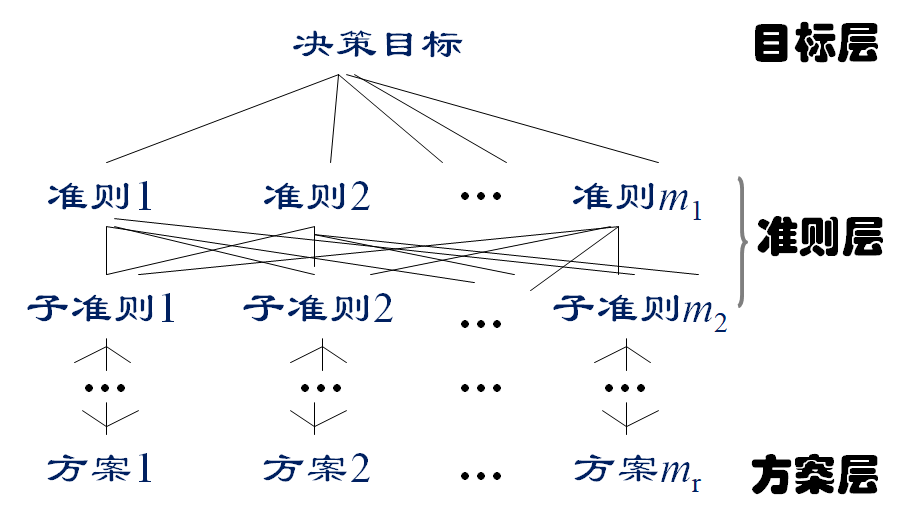
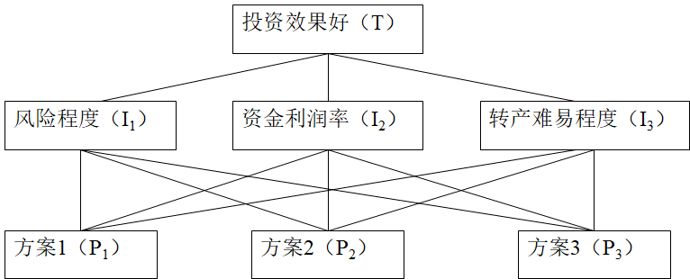

# 10.层次分析法（AHP）

关联矩阵的评价指标处在一个层面上，在管理中常常需要对更复杂的情况作出评价：如大学的评价包括教学、科研、知名度等，而每个指标下面还有多种指标，形成层级的指标体系。

美国运筹学家，**T.L.Saaty**等人在七十年代提出了一种能有效处理这类问题的实用方法，称之为层次分析法（AHP法），这种方法的特征是定性与定量相结合，把思维过程层次化，数量化。

## 1.概念及思想

其基本思路是是**把复杂问题分解为若干层次，在最低层次通过两两对比得出各因素的权重，通过由低到高的层层分析计算，最后计算出各方案对总目标的权数，权数最大的方案即为最优方案。**

对于多级递阶的情况，计算的顺序是从下层向上层计算，最后得到合成权重。

|      案例      | 指标体系                                                     |
| :------------: | :----------------------------------------------------------- |
|      购物      | 买钢笔，一般要依据质量、颜色、实用性、价格、外形等方面的因素选择某一支钢笔。买饭，则要依据色、香、味、价格等方面的因素选择某种饭菜。 |
|      旅游      | 假期旅游，是去风光秀丽的苏州，还是去迷人的北戴河，或者是去山水甲天下的桂林，一般会依据景色、费用、食宿条件、旅途等因素选择去哪个地方。 |
|      择业      | 面临毕业，可能有高校、科研单位、企业等单位可以去选择，一般依据工作环境、工资待遇、发展前途、住房条件等因素择业。 |
| 科研课题的选择 | 由于经费等因素，有时不能同时开展几个课题，一般依据课题的可行性、应用价值、理论价值、被培养人才等因素进行选题。 |

## 2.建立层次分析的结构模型

用AHP分析问题，首先要把问题条理化、层次化，构造层次分析的结构模型。

| 层次类别 |                                                              |
| :------: | ------------------------------------------------------------ |
|  最高层  | 在该层次只有一个元素，一般是分析问题的预定目标，因此又称目标层； |
|  中间层  | 该层次包括了为实现目标所涉及的中间环节，它可由若干个层次组成，包括所需要考虑的准则，子准则，又称为准则层； |
|  最底层  | 包括为实现目标可供选择的各种措施、决策、方案等，又称为措施层或方案层。 |

层次分析结构中各项称为模型中的元素，思路：目的—>分目标(准则)—>指标(子准则)—>...—>方案。

层次之间的支配关系不一定是完全的，即可以有元素（非底层元素）并不支配下一层次的所有元素而只支配其中部分元素。 递阶层次结构中的层次数与问题的复杂程度及分析的详尽程度有关，一般可不受限制。 为了避免由于支配的元素过多而给两两比较判断带来困难，每层次中各元素所支配的元素一般地不要超过$9$个，若多于$9$个时，可将该层次再划分为若干子层。

示例：

## 3.构造判断矩阵

首先应确定判断矩阵中的各元素，确定规则为

|    $a_{ij}$    |        两目标比较        |
| :------------: | :----------------------: |
|       1        |         同样重要         |
|       3        |         稍微重要         |
|       5        |         明显重要         |
|       7        |         重要的多         |
|       9        |         极端重要         |
|   2，4，6，8   | 介于以上相邻两种情况之间 |
| 以上各数的倒数 |     两目标反过来比较     |

随后计算要素相对权重或重要度向量$W_i$，一般有以下几种计算方法。

**求和法（算术平均法）**

首先将矩阵各列元素归一化$\bar{a_{ik}}=\frac{a_{ik}}{\sum_{i=1}^n a_{ik}}$，其次计算各$W_i=\frac{\bar{W_i}}{\sum_{i=1}^n \bar{W_i}}$，其中$\bar{W_i}=\sum_{j=1}^na_{kj}$，即为各行元素之和，而$\sum_{i=1}^n \bar{W_i}$实际上为归一化后矩阵各元素之和$\sum_{i=1}^n\sum_{j=1}^na_{ij}$，故列归一化后有几列$\sum_{i=1}^n \bar{W_i}$就为几。

求得 $W_i$ 后，需要进一步归一化求$W_i^0=\frac{W_i}{\sum_{i=1} W_i}$，最后求$\lambda_{\max}=\frac{1}{n} \sum\frac{(AW)_i}{W_i}$，$C.I.=\frac{\lambda_{max}-n}{n-1}$。

**方根法**（几何平均法）

首先求得$W_i=(\prod_{j=1}^n a_{ij})^{\frac{1}{n}}$，然后求归一化求$W_i^0=\frac{W_i}{\sum_{i=1} W_i}$，最后求$\lambda_{\max}=\frac{1}{n} \sum\frac{(AW)_i}{W_i}$，$C.I.=\frac{\lambda_{max}-n}{n-1}$。

**最小二乘法**

用拟合的方法确定权重向量$W=(W_1,W_2,...,W_n)^T$，为使残差平方和最小，这实际是一类非线性规划优化问题，可用普通最小二乘法：$\min \sum_{1\leq i<j\leq n}(a_{ij}-\frac{W_i}{W_j})^2$或$\min \sum_{1\leq i<j \leq n}[\lg{a_{ij}}-\lg{(\frac{W_i}{W_j})}]^2$

**特征根法**

由于$AW=\lambda_{max}W$，可以通过求解矩阵A的特征值的方式精确求得$W$和$\lambda_{max}$的解，其中$W$各分量应为正数，求解后如上述步骤一样归一化求$W_i^0$。

**判断矩阵及其分析处理举例** $W_i$的求取采用求根法（几何平均值法） 

|  $T$  | $I_1$ | $I_2$ | $I_3$ |  $W_i$  | $W_i^0$ |
| :---: | :---: | :---: | :---: | :-----: | :-----: |
| $I_1$ |  $1$  | $1/3$ |  $2$  | $0.874$ | $0.230$ |
| $I_2$ |  $3$  |  $1$  |  $5$  | $2.466$ | $0.648$ |
| $I_3$ | $1/2$ | $1/5$ |  $1$  | $0.464$ | $0.122$ |

依次类推，分别求的各分支下根，

|  $T$  | $I_1$ | $I_2$ | $I_3$ |  $W_i$  | $W_i^0$ |
| :---: | :---: | :---: | :---: | :-----: | :-----: |
| $I_1$ |  $1$  | $1/3$ | $1/5$ | $0.406$ | $0.105$ |
| $I_2$ |  $3$  |  $1$  | $1/3$ | $1.000$ | $0.258$ |
| $I_3$ |  $5$  |  $3$  |  $$   | $2.466$ | $0.637$ |

**...**

## 4.层次单排序及其一致性检验

求根后，还需进行一致性检验，当$C.R.=\frac{C.I.}{R.I.}<0.1$时，说明估计值的一致性符合要求，否则，需要重新调整判断矩阵。

| $n$    | 1    | 2    | 3    | 4    | 5    | 6    | 7    | 8    | 9    | 10   | 11   | 12   | 13   | 14   |
| ------ | ---- | ---- | ---- | ---- | ---- | ---- | ---- | ---- | ---- | ---- | ---- | ---- | ---- | ---- |
| $R.I.$ | 0    | 0    | 0.52 | 0.89 | 1.12 | 1.26 | 1.36 | 1.41 | 1.46 | 1.49 | 1.52 | 1.54 | 1.56 | 1.58 |

$n$表示判别矩阵的阶数，建议阶数不要超过$9$阶。

##### (4)层次总排序及层次总排序的一致性检验

|       | $I_1$ | $I_2$ | $I_3$ | $P_i=\sum_{j=1}^3{t_iP_{ij}}$ |
| :---: | :---: | :---: | :---: | ----------------------------- |
| $t_i$ | 0.230 | 0.648 | 0.122 |                               |
| $P_1$ | 0.105 | 0.592 | 0.149 | 0.426                         |
| $P_2$ | 0.258 | 0.333 | 0.066 | 0.283                         |
| $P_3$ | 0.637 | 0.075 | 0.785 | 0.291                         |

计算方法和关联矩阵一样。

| 优点                                                         | 局限性                                                       |
| ------------------------------------------------------------ | ------------------------------------------------------------ |
| 层次分析法把研究对象作为一个系统，按照分解、比较判断、综合的思维方式决策。 层次分析法把定性和定量方法结合起来，能处理许多用传统最优化技术无法着手的实际问题，应用范围很广，具有实用性和有效性 简单基本的原理和基本步骤，计算也非常简便，并且所得结果简单明确，容易被决策者了解和掌握。 | 只能从原有的方案中优选一个出来，没有办法得出更好的新方案。 该法中的比较、判断以及结果的计算过程都是粗糙的，不适用于精度较高的问题。 从建立层次结构模型到给出成对比较矩阵，人主观因素对整个过程的影响很大，这就使得结果难以让所有的决策者接受。 |

> 采取专家群体判断的办法是一种克服 层次分析法缺点的途径。

