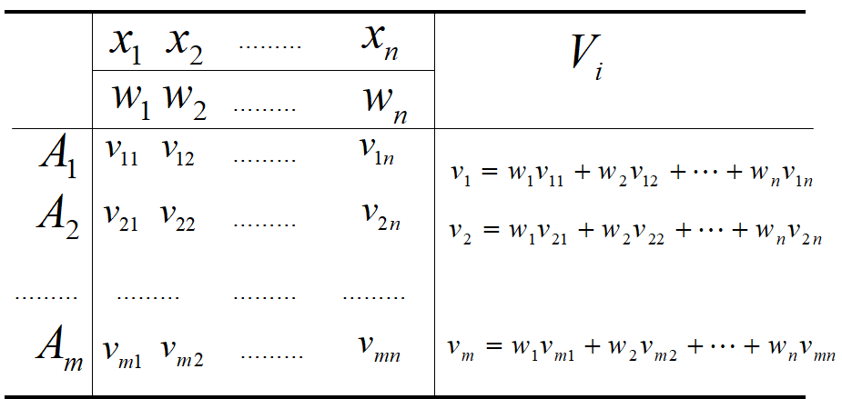
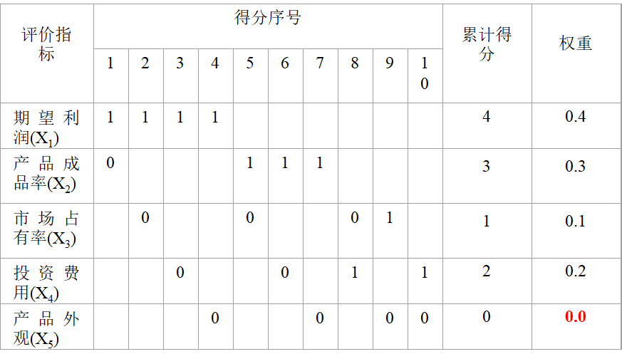
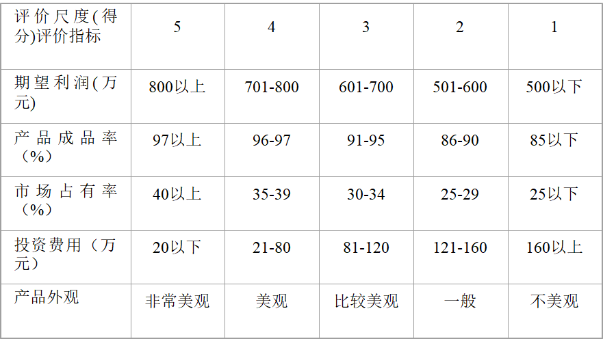
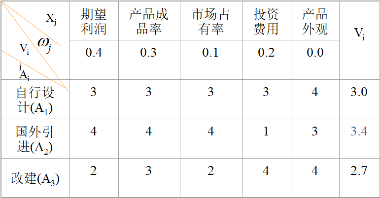
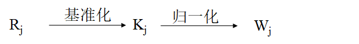
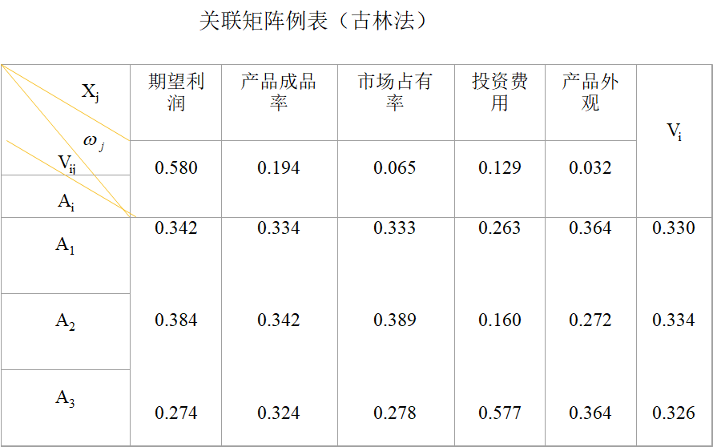

# 13.关联矩阵法

关联矩阵法是**用矩阵形式**==来表示==**每个替代方案有关评价指标及其重要度**与**方案关于具体指标的价值评定量**之间的关系。



$A_i(i=1,2,...,m)$ 表示某评价对象的$m$种方案；<br>$X_j(j=1,2,...n)$表示评价方案中的$n$个评价指标或评价项目；<br>$W_j(j=1,2,...,n)$表示$n$个评价指标的权重；<br>$V_{ij}(i=1,2,...,m,j=1,2,...n)$表示第$i$个替代方案$A_i$的关于$X_j$指标的价值评定量，一般该量由专家定性分析给出。

> 应用关联矩阵法的关键，在于确定各评价指标的相对重要度（即权重$W_j$）以及根据评价主体给定的评价指标的评价尺度，确定方案关于评价指标的价值评定量$V_{ij}$。
>

## 1.逐对比较法

逐对比较法是确定评价指标的简便之一，其基本做法是对各替代方案的评价指标进行逐对比较，对相对重要的指标给与较高的分，据此可得到各评价项目的权重$W_j$，再根据评价主体给定的评价尺度，对各替代方案在不同评价指标下一一进行评价，得到相应的评价值，进而求加权和得到综合评价值。

```python
例：某企业为生成某紧俏产品，制定了三个生产方案，它们是：
A1：自行设计一条新的生产线；
A2：从国外引进一条自动化程度较高的生产线；
A3：在原有设备的基础上改装一条生产线。
通过权威部门及专业人士讨论决定评价指标为五项，分别是：1）期望利润；2）产品成品率；3）市场占有率；4）投资费用；5）产品外观。
根据专业人士的预测和估计，实施这三种方案后关于五个评价项目的结果如表：
```

| 方案/指标 | 期望利润/万元 | 产品成品率/% | 市场占有率/% | 投资费用/万元 | 产品外观 |
| :-------: | :-----------: | :----------: | :----------: | :-----------: | :------: |
| 自行设计  |      650      |      95      |      30      |      110      |   美观   |
| 国外引进  |      730      |      97      |      35      |      180      | 比较美观 |
|   改建    |      520      |      92      |      25      |      50       |   美观   |

用逐对比较法求各评价指标权重如下，前者重要得1分，后者重要得0分：



随后由评价主体确定评价尺度，以使得方案在不同指标下的实施结果能够统一度量，便于求加权和：



最后将估计结果填入关联矩阵，并计算最终综合评价值$V_i=V_{ij}W_j^T$：



由结果知：$V_2>V_1>V_3$，故$A_2>A_1>A_3$，选择国外引进比较合适。

> 优点：计算过程简便，容易实现；<br>缺点：存在指标权重为0，有的指标占比过大，有的指标占比较小，扩大了误差。

## 2.古林法（Klee）

古林法可以用来定量估计和评价项目之间的重要性，古林法比逐对比较法前进了一大步，它是确定指标权重和方案评价量的基本方法。其基本做法是首先将指标以任意顺序排列起来，从下至上对相邻的指标进行评价，以下面的指标为基准，在数量上进行重要度的判定$r(x)$，评定重要度$R_j$，然后把列中最下面一个值设为1，进行基准化求得$K_j$，最后归一化，即得到权重$W_j$。

|  评价项目  | $R_j$ | $K_j$ | $W_j$ |
| :--------: | :---: | :---: | :---: |
|  期望利润  |   3   |  18   | 0.580 |
| 产品成品率 |   3   |   6   | 0.194 |
| 市场占有率 |  0.5  |   2   | 0.065 |
|  投资费用  |   4   |   4   | 0.129 |
|  产品外观  |   —   |   1   | 0.032 |
|  **合计**  |       |  31   | 1.000 |



上表中$R_j$估计而来，估计期望利润重要度是产品成功率重要度的三倍，故$R_{1}=3$，以此类推计算。然后由下而上设$K_5=1$，而投资费用的重要性是产品外观的四倍，故$K_4=4$，最后归一化处理，分别求得$W_{ij}$。

算出各评价指标的权重后，用同样的方法对各替代方案逐项进行评价，因$A_1自行设计$的期望利润为650万元，$A_2国外引进$的期望利润为730万元，故$R_1=650/730=0.890$，同理，$A_3改建$的期望利润为520万元，因此$R_2=730/520=1.404$，依次计算各$R_i$，然后以$K_3=1$为基准计算期望利润中各$K_i$，最后归一化计算各$V_{ij}$。

|  评价指标  |     方案     | $R_i$ | $K_i$ | $V_{ij}$ |
| :--------: | :----------: | :---: | :---: | :------: |
|  期望利润  |   自行设计   | 0.890 | 1.250 |  0.342   |
|            |   国外引进   | 1.404 | 1.404 |  0.384   |
|            |     改建     |   —   |   1   |  0.274   |
|            |   **合计**   |       | 3.654 |    1     |
| 产品成品率 | 设防事故栅栏 | 0.979 | 1.032 |  0.334   |
|            |   设人行道   | 1.054 | 1.054 |  0.342   |
|            |  设交通信号  |   —   |   1   |  0.324   |
|            |   **合计**   |       | 3.086 |    1     |
| 市场占有率 | 设防事故栅栏 | 0.854 | 1.200 |  0.333   |
|            |   设人行道   | 1.400 | 1.400 |  0.389   |
|            |  设交通信号  |   —   |   1   |  0.278   |
|            |   **合计**   |       | 3.600 |    1     |
|  投资费用  | 设防事故栅栏 | 1.636 | 0.455 |  0.263   |
|            |   设人行道   | 0.278 | 0.278 |  0.160   |
|            |  设交通信号  |   —   |   1   |  0.577   |
|            |   **合计**   |       |       |    1     |
|  产品外观  | 设防事故栅栏 | 1.333 | 1.000 |  0.364   |
|            |   设人行道   | 0.750 | 0.750 |  0.272   |
|            |  设交通信号  |   —   |   1   |  0.364   |
|            |   **合计**   |       |       |    1     |

> 注意：在计算投资费用时，由于希望投资越小越好，因此其比例取了倒数：$R_{14}=\frac{180万元}{110万元}=1.636$ 而在计算产品外观时，去掉单位按照打分来计算，$R_{15}=\frac{4分}{3分}=1.333$；$R_{25}=\frac{3分}{4分}=0.750$

综合以上两个表的结果，即可计算三个替代方案的综合评定结果，可知$V_2>V_1>V_3$，故$A_2>A_1>A_3$，结论仍是选择国外引进比较合适。



> 优点：避免不重要的指标权重为零；<br>缺点：会扩大误差且难以检验。
