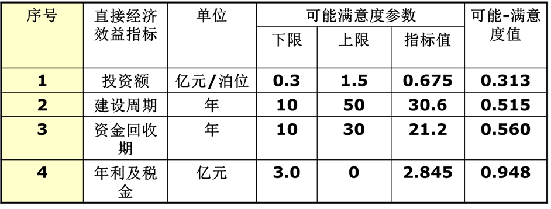

# 14.可能——满意度法

在评价指标体系中，指标用可能性或满意程度（或两者兼用），从替代方案的可能性及满意程度角度进行评价，其基本步骤是先定出指标可能或满意的范围，即可能度满意度的最高与最低点；然后评价出具体方案在这些指标上能达到的可能度或满意度。

单从指标可能性来说，如果一个指标肯定能够达到，也就是说它实现的可能度最大，给以定量记述：P=1。如果一项指标肯定达不到，即没有可能度，可以记为P=0。一般情况下，p在0-1之间。

同样，单从指标满意度来说，如果一个指标肯定能够达到，也就是说它实现的可能度最大，给以定量记述：P=1。如果一项指标肯定达不到，即没有可能度，可以记为P=0。一般情况下，p在0-1之间。

如果评价指标同时具有两种属性，这时采用综合表达法，即可能-满意度法。当百分百的既可能又满意时，W=1，当既不可能又不满意，W=0，当然该方法中间状态复杂，将形成一个面。

 对港口而言，气候条件主要影响装卸作业，如港址终年风大、浪高，则全年可以装卸作业的天数极少，为此气候条件可以用可装卸作业的天数来衡量，衡量的依据是：港口全年可作业天数为300-330天。金山石化总厂供油的陈山码头，处于风浪较大的杭州湾，实际全年可作业天数为330天。

|                          满意度上限                          |                          满意度下限                          |
| :----------------------------------------------------------: | :----------------------------------------------------------: |
| 港口全年装卸作业最高天数为340天，这是可能度上限，达到这天数就是完全满意，也是满意度上限，Q=1，P=1。 | 如以每周工作3天计算，扣除法定假日7天，全年工作日为149天，为方便按150天计算，这是可能度和满意度的下限，Q=0，P=0。 |

| 评价指标名称         | 指标 | 上下限 | 各方 | 案     | $r$  值 |
| -------------------- | ---- | ------ | ---- | ------ | ------- |
|                      | 上限 | 下限   | 金山 | 外高桥 | 七个口  |
| 气候条件（作业天数） | 340  | 150    | 300  | 331    | 331     |
| 可能满意度           | 1    | 0      | 0.79 | 0.95   | 0.95    |

计算方法：$0.79=\frac{实际工作时间-满意度下限}{满意度上限-满意度下限}=\frac{300-150}{340-150}；$

计算例1-2可知

> 可能—满意度方法适合尺度不一，单位不定，数量不宜确定的指标，

#### 