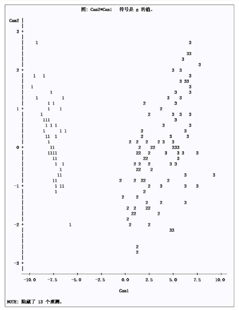

## 04.判别分析

> 在自然科学与社会科学的研究中，研究对象已经用某种方法已划分为若干类型，当得到一个新的样本数据时，通常使用判别分析来确定该样品属于已知类型中的哪一类，这类问题属于判别分析。
>
> 要判定一个样品的归属，理想的情况是能够获得完备的用于分类的信息，以作出准确的判断，但现实情况中往往是依据不完备信息来进行判别分类的。
>
> 在预测和解释可度量变量上，回归模型具有很大的优势，但一般的多元回归模型并不适合用于处理**非度量变量**，判别分析适用于被解释变量为 **非度量变量**。聚类分析中一般没有明确的分类结果，而在判别分析中，至少有一个已经明确知道类别的“训练样本”，判别分析能够直接根据事物的某些便于观测的特征将事物分类。

### 一、判别分析的基本要求及分类

#### 1.主要目的

##### (1)预测样本所属类型

在已知研究对象用某种方法已经分成若干类的情况下，确定新的样本属于哪一类；

##### (2)分离样品

用图形（通常二维，一般通过降维实现）或代数方法描述各样品之间的差异性，最大限度的分离各组。

#### 1.基本要求

分组类型应在两组以上；<br>每组中至少应包含一组案例;<br>解释变量必须是可度量变量(能计算均值与方差)。

#### 2.基本假设

> 对新样品**x**进行的判别归类将在很大程度上依赖于各组的总体分布或其分布特征。**除聚类分析外，其他分析都需要考虑总体的分布！**

##### (1)各判别变量之间必须是线性无关的

每个判别变量不能是其他判别变量的线性组合，甚至不能与其他判别变量的线性组合高度相关。否则将导致参数估计的标准误差增大，参数估计统计上不显著，产生多重共线性问题。

##### (2)各组变量的协方差矩阵相等。

当协方差矩阵不等时，无法构造线性判别函数(判别变量的简单线性组合)，而是构造二次判别函数。在各组变量的协方差矩阵相等时，可以构造线性判别函数，使用很简单的公式来计算判别函数并进行显著性检验。

##### (3)各判别变量遵循多元正态分布

每个变量对于其他所有变量的固定值都遵循正态分布，在该条件下可以精确计算显著性检验值和分组归属的概率，否则计算的概率将非常不准确。

> 原则上当使用判别分析时，以上假设都应验证。      

### 二、判别分析方法

|      方法      | 说明                                                         |
| :------------: | ------------------------------------------------------------ |
|  **距离判别**  | 首先根据已知分类的数据分别计算各类的中心，即各类的均值，若任一新样本的观测值都与第 i 类的中心距离最近，就认为它属于第 i 类。 |
| **Bayes判别**  | 假定对研究对象已有一定认识，可以用先验概率来表示这种认识，随后用取得的样本来修正已有的认识(先验概率分布)，得到后验概率分布，各种统计推断都用后验概率分布来进行。 |
| **Fisher判别** | 应用一元方差分析的思想，根据 类内距离尽量小、类间方差尽量大 的原则来判别。 |
|  **逐步判别**  | 基本思想及基本步骤类似于回归分析中的逐步回归法，通过自动搜索变量子集的方法来判别，其结果未必最优，但往往却是最有效的。 |

> 距离判别和贝叶斯（Bayes）判别只能用于分类；费希尔（Fisher）判别即可用于分类，也可用于分离，且更多地用于后者。且他们都是基于判别变量为定量变量的。

#### 1.距离判别分析

距离判别的基本思想是按就近原则进行归类。首先根据已知分类的数据分别计算各类的中心，即各类的均值，若任一新样本的观测值都与第 i 类的中心距离最近，就认为它属于第 i 类。

##### (1)两总体情形

> 当G~1~ 何G~2~ 均为正态总体且协方差阵相等时一般选用马氏距离，总体不是正态总体时，也可以选用马氏距离。

设存在两个总体 G~1~ 和 G~2~ ，$x$  是一个 p 维样品，若样品  $x$  到G~1~和G~2~的距离分别为d~1~($x$,G~1~)和d~2~($x$,G~2~),当$d_1(x,G_1) < d_2(x,G_2)$时，则判别  $x$  属于G~1~，反之属于G~2~，若二者距离相同，则待判。

用马氏距离来描述 $x$ 到总体G~i~ 的距离为：

$d_1^2(x,G_1)=(x-\mu_1)^T S_1^{-1}(x-\mu_1)$

$d_2^2(x,G_2)=(x-\mu_2)^T S_2^{-1}(x-\mu_2)$

令 $W(x) =d_1^2(x,G_1)- d_2^2(x,G_2) = (x-\mu_1)^T S_1^{-1}(x-\mu_1)- (x-\mu_2)^T S_2^{-1}(x-\mu_2)$

称$W(x)$为判别函数，当各总体$G_i$的协方差阵不等时，$W(x)$是$x$的二次函数，当各总体$G_i$的协方差阵相等时，即$S_1 = S_2 = S$ 时，  $W(x) = 2(x-\frac{\mu_1+\mu_2}{2})^TS^{-1}(\mu_1-\mu_2)$

令$\alpha = S^{-1}(\mu_1-\mu_2)$；$\overline{\mu} = \frac{\mu_1+\mu_2}{2}$（两个总体均值的平均）；

则 有 $W(x) = 2(x-\overline\mu)\alpha$  ，  此时$W(x)$是$x$的一次线性函数，$\alpha$为判别系数（类似于回归系数）。

当$W(x)>0$时说明$x$距离G~1~更近，$x\in G_1$；当$W(x)<0$时说明$x$距离G~2~更近，$x\in G_2$；否则待判。

当总体特征$\mu_1,\mu_2,S$未知时，可通过样本估计总体，设$X^{(1)}_1,X^{(1)}_2,...,X^{(1)}_{n_1},$是来自$G_1$的$n_1$个样本，$X^{(2)}_1,X^{(2)}_2,...,X^{(2)}_{n_2},$是来自$G_2$的$n_2$个样本，则可以得到以下估计：

$\hat{\mu_1} = \frac{1}{n_1}\sum_{i=1}^{n_1}x_i^{(1)} = \bar{x}^{(1)}$

$\hat{\mu_2} = \frac{1}{n_2}\sum_{i=1}^{n_2} x_i^{(2)} = \bar{x}^{(2)}$

$\hat{S}=\frac{1}{n_1+n_2-2}(A_1+A_2)$   其中$A_a = \sum_{j=1}^{n_a}(x^{(a)}_j-\bar{x}^{(a)})(x^{(a)}_j-\bar{x}^{(a)})^T$ 

> 线性判别函数在使用中最方便，应用也最广泛。

##### (2)多总体情形

已知总体$G_1，G_2，…，G_k$，先从每个总体中分别抽取$n_1，n_2，…，n_k$个样本，每个样本皆测量$p$个指标，对新样本$x=（x_1，x_2，…，x_p）$计算 $x$ 到$G_1，G_2，…，G_k$的距离，记为$d（x，G_1），d(x，G_2),…,d(x，G_n)$，类$G_1，G_2，…，G_k$ 的总体均值分别是  $\mu_1,\mu_2,…,\mu_k$，协方差阵分别为$S_1, S_2,...,S_n$，    类似于两总体，判别函数：$W_{ij}(x) = (x-\mu_i)^TS_i^{-1}(x-\mu_i)-(x-\mu_j)^TS_j^{-1}(x-\mu_j)$，$i,j = 1,2,3,...,k$

判别规则为:
$$
\begin{cases}
 x \in G_i,\,\,W_{ij}(x)<0,\forall j\neq i ,\\
 待判,\,\,某个W_{ij}=0\\
 \end{cases}
$$
同上$W(x)$依然是 $x$ 的二次函数，多总体情形下二次判别函数非常复杂，使用也相对较少，当各个总体的协方差阵相同 $S_1 = S_2 =S_3=...S$ 时， 

 $W(ij) = (x-\frac{\mu_i +\mu_j}{2})^TS^{-1}(\mu_i - \mu_j)$，$i,j = 1,2,...,k$

当总体特征$\mu_1,\mu_2,...,\mu_k,S$未知时，设从$G_a$中抽取的样本为$X^{(a)}_1,X^{(a)}_2,...,X^{(a)}_{n_a}$$,$(a=1,2,...k)，

可通过样本估计总体，设是来自$G_1$的$n_1$个样本，$X^{(2)}_1,X^{(2)}_2,...,X^{(2)}_{n_2},$是来自$G_2$的$n_2$个样本，则可以得到以下估计：

$\hat{\mu_a} = \overline x^{(a)}=\frac{1}{n_a}\sum^{n_a}_{j=1}x_j^{(a)}$

$\hat{S} =\frac{1}{n-k}\sum^k_{a=1}A_a$，	$n=n_1+n_2+...+n_k$  ， $A_a = \sum_{j=1}^{n_a}(x_j^{(a)}-\bar x^{(a)})(x_j^{(a)}-\bar x^{(a)})^T$ 。

##### (3)误判概率

可以使用误判概率来验证判别效果的好坏，设有*k*个组$G_1, G_2,⋯, G_k$且各组 $G_i$ 的概率密度为$f_i(x)$，用$p(~j~|~i~)=\int_{D_j}f_i(x)dx$来表示误判概率。

两总体下误判概率：$P(2|1)=P(W(x)<0|x\in G_1)$；$P(1|2)=P(W(x)\ge0|x\in G_2)$

正态总体下且等方差条件下，设*G*~1~ \~ N~p~(μ~1~, S), G~2~~ N~p~(μ~2~, **S**)，则$P(2|1)=P(1|2)=\Phi(-\frac{\Delta}{2})$，其中$\Delta=\sqrt{(\mu_1-\mu_2)^TS^{-1}(\mu_1-\mu_2)}$是两组之间的马氏距离。

可见，两个正态组越是分开（即*Δ*越大），两个误判概率就越小，此时的判别效果也就越佳。当两个正态组很接近时，两个误判概率都将很大，这时作判别分析就没有什么实际意义了。


当假设协方差矩阵相等的情形下，判别准确率不为100%，说明该假设值得商榷！这时可以继续使用二次判别函数再次进行判别，此时距离判别为非线性形式，在异方差下进行判别称为二次判别，判别完成后，可以根据各样本间 某两个特征数据 分布情况，绘制二维散点图示，观察结果。

> 可对假设$H_0:\mu_1=\mu_2,H_1:\mu_1 ≠\mu_2$进行检验，若检验接受原假设$H_0$，则说明两组均值之间无显著差异，此时作判别分析一般会是徒劳的。若检验拒绝$H_0$，则两组均值之间虽然存在显著差异，但这种差异对进行有效的判别分析未必足够大，此时还应看误判概率是否超过了一个合理的水平。

在实际应用中，一般使用如下两种方法判别 某判别分析的效果，并且以下三种非参数估计方法同样适用于其它的判别方法或判别情形，并且可类似地推广到多组的情形。

- **回代法**

计算误判率或准确率，令$n(2|1)$为样本中来自$G_1$而误判为$G_2$的个数，$n(1|2)$为样本中来自$G_2$而误判为$G_1$的个数，则$\hat P(2|1)=\frac{n(2|1)}{n_1}$，$\hat P(1|2)=\frac{n(1|2)}{n_2}$

该方法简单、直观，且易于计算。但遗憾的是，其结果是有偏的，它给出的估计值通常偏低，除非$n_1$和$n_2$都非常大。

- **划分样本**

将整个样本一分为二，一部分作为 **训练样本**，用于构造判别函数，另一部分用作 **测试样本**，用于对该判别函数进行评估。误判概率用验证样本的被误判比例来估计，其估计是无偏的。

> **该方法一般也有两个主要缺陷：**
>
> (i)需要用大样本；<br>(ii)该方法构造的判别函数只用了部分样本数据，与使用全部样本数据构造的判别函数相比，损失了过多有价值的信息，其效用自然不如后者，表现为前者的误判概率通常将高于后者的，而后者的误判概率才是我们真正感兴趣的。该缺陷随样本容量的增大而逐渐减弱，甚至可基本忽略。

- **交叉验证**

从组$G_1$中取出$x_{1j}$，用该组的其余$n_1-1$个观测值和组$G_2$的$n_2$个观测值构造判别函数，然后对$x_{1j}$进行判别（其中$j=1,2,...,n_1$）；同样，从组$G_2$中取出$x_{2j}$，用该组的其余$n_2-1$个观测值和组$G_1$的$n_1$个观测值构造判别函数，然后对$x_{2j}$进行判别（其中$j=1,2,...,n_1$），令

$n^*(2|1)$表示样本中来自$G_1$而误判为$G_2$的个数；$n^*(1|2)$表示样本中来自$G_2$而误判为$G_1$的个数；则两个误判概率$p(2|1)$和$p(1|2)$的估计量为：

$\hat P(2|1)=\frac{n^*(2|1)}{n_1}$；$\hat P(1|2)=\frac{n^*(1|2)}{n_2}$，它们都是接近无偏的估计量。

##### (4)选择线性判别or二次判别

一般而言，如果各组的样本容量普遍较小，则选择线性判别函数应是一个较好的策略。相反地，如果各组的样本容量都非常大，则更倾向于采用二次判别函数。

有时可凭直觉判断 计算出的$S_1,S_2,...,S_k$是否比较接近，以决定是否应假定各组的协方差矩阵相等。

即使检验所需的正态性假定能够满足，检验的结果也只能作为重要的参考依据，而不宜作为决定性的依据，最终还是应视具体的情况而定。

如果对使用线性还是二次判别函数拿不准，则可以同时采用这两种方法分别进行判别，然后用交叉验证法来比较其误判概率的大小，以判断到底采用哪种方法更为合适。但小样本情形下得到的误判概率估计不够可靠。

##### (5)Python实现

##### (4)Python实现

 scikit-learn`库中的`KNeighborsClassifier`类可以实现距离判别， 

```python
class KNeighborsClassifier(
    n_neighbors=5, # 接受int,表示指定K值。默认为5
    weights='uniform', # 接受特定str,表示指定计算的算法。
    # 取值为ball_tree时，表示使用BallTree算法；
    # 取值为kd_tree时，表示使用KDTree算法；
    # 取值为brute时，表示使用暴力搜索法；
    # 取值为auto时，表示自动决定最适合的算法。
    # 默认为minkowski algorithm='auto', 
    leaf_size=30, # 接受int,表示指定BallTree或者KDTree叶节点规值。默认为30 
    metric='minkowski', # 接受特定str,表示指定距离度量默认为minkowski。
    p=2, # 接受int,表示指定在minkowski度量上的指数。如果p=1，则对应曼哈顿距离；如果p=2,则对应欧式距离。默认为2 
    metric_params=None, n_jors=1,**kwarge ): 
    pass

def train_test_split(
    x,  # 数据集的特征值
    y,  # 数据集的标签值
    test_size,  # 测试集的占比大小，一般为float
    random_state,  # 随机数种子,不同的种子会造成不同的随机采样结果。相同的种子采样结果相同，默认为none，每次生成不同的随机种子
    arrays,
    *options
)
# return 测试集特征训练集特征值值，训练标签，测试标签(默认随机取)
```

案例：使用scikit-learn库自带的`iris（鸢尾花）`数据集，根据距离判别准则，对该数据集进行分类。

```python
import numpy as np
from sklearn import datasets

# 导入数据集
iris = datasets.load_iris()  # 导入鸢尾花的数据集
print("鸢尾花数据集的返回值：\n", iris)  # 返回值是一个继承自字典的Bench
print("鸢尾花的特征值:\n", iris["data"])  # 或用 iris.data
print("鸢尾花的目标值：\n", iris.target)
print("鸢尾花特征的名字：\n", iris.feature_names)
print("鸢尾花目标值的名字：\n", iris.target_names)
print("鸢尾花的描述：\n", iris.DESCR)

iris_x = iris.data  # 导入150个样本数据，每个样本4个属性分别为花瓣和花萼的长、宽
iris_y = iris.target  # 导入150个样本数据的标签(类别)
```

```python
from sklearn.model_selection import train_test_split

# 拆分数据集，方案1
iris_x_train, iris_x_test, iris_y_train, iris_y_test = train_test_split(iris_x, iris_y, test_size=0.08) 

# 拆分数据集，方案2
# # 产生一个随机打乱的0-149的一维数组，用于训练
# indices1 = np.random.permutation(len(iris_x))
# # 随机选取140个样本作为训练数据集
# iris_x_train = iris_x[indices1[:-10]]
# # 选取这140个样本的标签作为训练数据集的标签
# iris_y_train = iris_y[indices1[:-10]]
#
# # 剩下的10个样本作为测试数据集
# iris_x_test = iris_x[indices1[-10:]]
# # 把剩下10个样本对应标签作为测试数据集的标签
# iris_y_test = iris_y[indices1[-10:]]
```

```python
%matplotlib inline
import seaborn as sns
import matplotlib.pyplot as plt
import pandas as pd
from matplotlib.font_manager import FontProperties  # 导入FontProperties

# 绘制图像观察数据分布情况
my_font = FontProperties(fname="C:\Windows\Fonts\simkai.ttf", size=14)  # 设置中文字体
iris_d = pd.DataFrame(iris_x_train, columns = ['Sepal_Length', 'Sepal_Width', 'Petal_Length', 'Petal_Width'])  # 把数据转换成dataframe的格式
iris_d['Species'] = iris_y_train

def plot_iris(iris, col1, col2):
    # 绘图主函数; seaborn.lmplot() 是一个非常有用的方法，它会在绘制二维散点图时，自动完成回归拟合
    # x, y 分别代表横纵坐标的列名,data= 是关联到数据集,hue=*代表按照 species即花的类别分类显示,fit_reg=是否进行线性拟合。
    sns.lmplot(x = col1, y = col2, data = iris, hue = "Species", fit_reg = False)
    plt.xlabel(col1)  # 设置label
    plt.ylabel(col2)
    plt.title('鸢尾花种类分布图', fontproperties=my_font)
    plt.show()

plot_iris(iris_d, 'Petal_Width', 'Sepal_Length')
```

```python
from sklearn.preprocessing import StandardScaler

# 标准化
transfer = StandardScaler()
iris_x_train1 = transfer.fit_transform(iris_x_train)
iris_x_test1= transfer.transform(iris_x_test)
```

```python
from sklearn.neighbors import KNeighborsClassifier

# 欧氏距离
timator = KNeighborsClassifier(n_neighbors=4)
# 马氏距离
# v=np.cov(iris_x_train.T)
# estimator=KNeighborsClassifier(9, metric='mahalanobis',metric_params={'V':v})
# 调用该对象的训练方法，主要接收两个参数：训练数据集及其样本标签
estimator.fit(iris_x_train1, iris_y_train1)
# 调用该对象的测试方法，主要接收一个参数：测试数据集
iris_y_predict = estimator.predict(iris_x_test1)
# 方法1：比对真实值和预测值
print(f"预测结果距离矩阵为:{iris_y_predict}")
print(f"比对真实值和预测值：{iris_y_predict == iris_y_test1}")
# # 调用该对象的打分方法，计算出准确率，在两总体下，所谓的误判率即为（1- 准确率）。
score = estimator.score(iris_x_test1, iris_y_test1, sample_weight=None)
print(f'欧氏距离误判率为：{(1-score)*100:.2f}%')
```

#### 2.贝叶斯(Bayes)判别

> 距离判别准则虽然简单，便于使用，但是也有它明显的不足之处：**一是距离判别准则与各总体出现的机会大小（先验概率）完全无关；二是距离判别准则没有考虑错判造成的损失，这是不合理的。**贝叶斯判别准则正是为了解决这两方面的问题而提出的。

贝叶斯判别的基本思想是：**假定对研究对象已有一定认识，可以用先验概率来表示这种认识，随后用取得的样本来修正已有的认识(先验概率分布)，得到后验概率分布，各种统计推断都用后验概率分布来进行。**

##### (1)最大后验概率法

> 实际应用中，如果先验概率难以给出，则它们通常被取成相等。

**多总体一般情形：**设有*k*个组$G_1, G_2,⋯, G_k$，且组 $G_i$ 的概率密度为$f_i(x)$，样品 $x$ 来自组$ G_i$的先验概率为$p_i$ ,$i=1,2,⋯,k$，满足$p_1+p_2 +⋯+p_k =1$。则 $x$ 属于 $G_i$ 的后验概率为：

$P(G_i|x)=\frac{p_if_i(x)}{\sum^k_{j=1}p_jf_j(x)},i = 1,2,...,k$

判别规则：若有 $P(G_l |x) = \max P(G_i |x)$ ，则$x \in G_l$

**均服从正态组情形：**设$G_i \sim N_p(μ_i,S_i)，S_i>0, i=1,2,⋯,k$。这时，组$G_i$的概率密度函数为

$f_i(x)=(2\pi)^{-p/2}|S_i^{-1/2}|exp\{-\frac{1}{2}d^2(x,G_i)\},~~~  ~~~其中d^2(x,G_i)=(x-\mu_i)^TS_i^{-1}(x-\mu_i)$

此时，$p(G_i|x)=\frac{exp[-\frac{1}{2}D^2(x,G_i)]}{\sum^k_{j=1}[-\frac{1}{2}D^2(x,G_j)]},~~i=1,2,...,k$  	其中  $D^2(x,G_i) = d^2(x,G_i) +g_i +h_i$

$g_i=\begin{cases}\ln|S_i|,\,\,S_i不全相等。\\0,\,\,S_1=S_2=...=S_k=S。\\\end{cases}$

$h_i=\begin{cases}\ -2ln|p_i|,\,\,p_i不全相等。\\0,\,\,p_1=p_2=...=p_k=\frac{1}{k}。\\\end{cases}$

**特别的当各组先验概率相同，方差相等时：**$p_1=p_2=...=p_k=\frac{1}{k}且S_1=S_2=...=S_k=S$时，有

$p(G_i|x)=\frac{exp[-\frac{1}{2}d^2(x,G_i)]}{\sum^k_{j=1}[-\frac{1}{2}d^2(x,G_j)]}=\frac{exp(I_ix+c_i)}{\sum_{j=1}^kexp(I_jx+c_j)}$，其中$I_i = S^{-1}\mu_i$，$c_i=-\frac{1}{2}\mu_i^TS^{-1}\mu_i$ 

此时上述后验概率公式可简化为：  若$I_lx+c_l=\max(I_ix+c_i)$，则	$x \in G_l$

实际应用中，以上各式中的$μ_i$和 $S_i$  (*i*=1,2,⋯,*k*)一般都是未知的，需用相应的样本估计值代替。

##### (2)最小平均损失法

> 在实践中，若误判代价比无法确定，则通常取二者相等或比值为1。

**多总体一般情形：**用$c(~j~|~i~)$表示样品来自组$G_i$而误判给$G_j$（且$i \neq j$）的误判损失，$p(~j~|~i~)=\int_{D_j}f_i(x)dx$表示误判概率，于是误判所带来的平均损失ECM（`expected cost of misclassification`）为：

$ECM(G_1,G_2,...,D_k)=\sum^k_{i=1}p_i\sum^k_{j=1}c(~j~|~i~)p(~j~|~i~)$

这里定义$c(i|i)=0$，我们总希望所得到的$ECM$最小，

于是判别规则为： 若$ECM(G_l) = \min ECM(G_i),i=1,2,...,k$，则$x \in G_l$

$p_l\sum^k_{j=1}c(~j~|~l~)p(~j~|~l~) = \min_{1 \leq i \leq k}[\sum^k_{i=1}p_i\sum^k_{j=1}c(~j~|~i~)p(~j~|~i~)]$ ，则$x \in G_l$

当所有误判概率相同时，可令$c(i|j)=1$：

此时：$ECM(G_1,G_2,...,G_k)= \sum^k_{i=1}p_i\sum^k_{j=1}p(i|j)=1-\sum^k_{i=1}p_ip(i|i)=1-\sum^k_{i=1}p_if_i(x)$，

原式可转换为求  $\max\sum^k_{i=1}p_if_i(x)$

此时的最小总误判概率法等同于最大后验概率法，或者说，最大后验概率法可看成是所有误判代价均相同时的最小期望误判代价法。

当先验概率$p_1=p_2=...=p_k=p$时，原式又等于：$\max\sum^k_{i=1}f_i(x)$，这说明该判别实际是求后验概率的最大似然估计。

**两总体下情形：**

$ECM(G_1)=p_1p(2|1)c(2|1)=p_1c(2|1) \int_{G_2} f_1(x)$ ；$ECM(G_2)=p_2p(1|2)c(1|2)=p_2c(1|2) \int_{G_1} f_2(x)$

$不妨令~~W(x)= ECM(G_1)-ECM(G_2)=f_1(x)c(2|1)p_1 - f_2(x)c(1|2)p_2$

显然当$W(x) \le 0时~x \in G_1；当W(x)<0时，x \in G_2$。

**两总体均服从方差相等的正态分布时**：

假定两总体$G_1$和$G_2$都服从正态分布，设$G_i \sim N_p(μ_i,S_i), i=1,2,S_i>0$。

$W(x)=-\frac{1}{2}x^T(S_1^{-1}-S_2^{-1})x+(\mu_1^TS_1^{-1}-\mu_2^TS_2^{-1})x-K$

其中$K=\ln[\ln\frac{c(1|2)p_2}{c(2|1)p_1}]+\frac{1}{2}\ln\frac{|S_1|}{|S_2|}+\frac{1}{2}(\mu_1^TS_1^{-1}\mu_1-\mu_2^TS_2^{-1}\mu_2)$

$W(x)$是$x$的二次函数，若$\mu_i和S_i$未知，仍然可用估计值代替，该情形下，其判别效果更依赖于多元正态性的假定，因此为了达到较理想的判别效果，需要时可以考虑先将各组的非正态性数据变换成接近正态性的数据，然后再作判别分析。

特别的，当$S_1=S_2=S$时，将协方差矩阵相等的两个多元正态密度函数带入上式，包含$S_i^{1/2}(i=1,2)$的因子可以消去，此时

$W(x)=(\mu_1^TS^{-1}-\mu_2^TS^{-1})x-\beta=[x-\frac{1}{2}(\mu_1+\mu_2)]^TS^{-1}(\mu_1-\mu_2)-\beta=(x-\bar{\mu})^T\alpha$

其中$\bar \mu = \frac{\mu_1+\mu_2}{2}$，$\alpha=S^{-1}(\mu_1-\mu_2)$，$\beta=\ln\frac{c(1|2)p_2}{c(2|1)p_1}$

==在两组皆为正态组且协差阵相等的情形下，不考虑先验概率和误判代价$(p_1=p_2且c(1|2)=c(2|1))$时的贝叶斯判别等价于距离判别。==实践中，因未知参数需用样本值替代，故实际判别规则是渐近最优的。

##### (3)Python实现

使用scikit-learn库中的MultinomialNB类可以实现贝叶斯判别，其语法格式如下。

```python
class sklearn.naive_bayes.MultinomiaINB(
    alpha=1.0,  # alpha:接受float,表示指定o值。默认为1
    fit_prior=True, 
	class_prior=None  # class_prior:接受array,表示指定每个分类的先验概率。如果指定该参数，则每个分类的先验概率不再从数据集中学得。
)
```

案例：使用scikit-learn库自带的`iris（鸢尾花）`数据集，根据贝叶斯判别准则，进行判别分类。

```python
from sklearn.naive_bayes import MultinomialNB

iris_x_train2, iris_x_test2, iris_y_train2, iris_y_test2 = train_test_split(iris_x, iris_y, test_size=0.08)  #
bayes = MultinomialNB()  # 定义一个贝叶斯判别分类器对象
# # 调用该对象的训练方法，主要接收两个参数：训练数据集及其样本标签
bayes.fit(iris_x_train2, iris_y_train2)
# 调用该对象的测试方法，主要接收一个参数：测试数据集
iris_y_predict = bayes.predict(iris_x_test2)
# 调用该对象的打分方法，计算出准确率
print(f"预测结果距离矩阵为:{iris_y_predict}")
print(f"比对真实值和预测值：{iris_y_predict == iris_y_test2}")
score2 = bayes.score(iris_x_test2,iris_y_test2,sample_weight=None)
print(f"准确率为：{score2}")  # 输出准确率计算结果
```

#### 2.费希尔(Fisher)判别

> Fisher判别也称为LDA判别准则，其基本思想是应用一元方差分析的思想尽量使 **类内距离尽量小、类间方差尽量大** 来求判别函数。

##### (1)判别函数

假设组$G_i$的类方差均为$S$，将来自组$G_i$的p维观测值为$x_{ij}$（$i=1,2,...,k,j=1,2,...,k$）共同投影在某一p维常数向量a上，得到的投影点可分别对应线性组合$y_{ij}=a^Tx_{ij}$，$i=1,2,...,k,j=1,2,...,k$

则有：第$i$组的均值向量:$\bar y_i = \frac{1}{n_i}\sum^{n_i}_{j=1}=a^T\bar x_i$，$\bar y_j = \frac{1}{n_j}\sum^{n_j}_{i=1}=a^T\bar x_j$

总均值向量：$\bar y=\frac{1}{n}\sum^k_{i=1}\sum^{n_i}_{j=1}y_{ij}=\frac{1}{n}\sum_{i=1}^kn_i\bar y_i=a^T\bar x$，其中 	$n=\sum^k_{i=1}n_i~,\bar x_i = \frac{1}{n_i}\sum_{j=1}^{n_i}x_{ij}~,\bar x=\frac{1}{n}\sum^k_{i=1}n_i\bar x_i$

故$y_{ij}$的**组间平方和SSG**和**组内平方和SSE**分别为：

$SSG = \sum^k_{i=1}n_i(\bar y_i -\bar y)^2=\sum^k_{i=1}n_i(a^T\bar x_i -a^T\bar x)^2 = a^THa$，其中$H=\sum_{i=1}^k n_i(\bar x_i-\bar x)(\bar x_i - \bar x)^T$

$SSE=\sum^k_{i=1}\sum^{n_i}_{j=1}(y_{ij}-\bar y_i)^2 = \sum^k_{i=1}\sum^{n_i}_{j=1}(a^Tx_{ij}-a^T\bar x_i)^2=a^TEa$

其中$E = \sum_{i=1}^k(n_i-1)S_i=\sum^k_{i=1}\sum^{n_i}_{j=1}(x_{ij}-\bar x_i)(x_{ij}-\bar x_i)^T$

若k组均值有显著性差异，则该式$$\frac{SSG/(k-1)}{SSE/(n-k)}$$应充分大，即$\Delta(a)=\frac{a^THa}{a^TEa}$应该尽可能大。

原问题转化为在$a^TR_pa=1$的约束条件下寻找a，使得$\Delta(a)$达到最大，其中$S_p=\frac{E}{n-k}$是方差S的联合无偏估计。

> rank($E^{-1}H$)表示$E^{-1}H$的秩的大小。

由矩阵知识可知，**$\frac{a^THa}{a^TEa}$的极大值$\lambda_1$是$|H-\lambda E|$的最大特征根**，不妨设$E^{-1}H$的全部特征值依次为$\lambda_1 \le \lambda_2 \le ... \le \lambda_s$，$s=rank(E^{-1}H),且 s \le \min(k-1,p)$，相对应的特征向量依次为$t_1,t_2,...,t_s$，标准化为$t_i^TR_pt_i,i=1,2,...,s$。

于是当$a_1=t_1$时，$\Delta(a)$取最大值$\lambda_1$，选择投影在$t_1$上能够使得各组投影点最大限度的分离(组内距\\组间距的值最大)，称$y_1=t_1^Tx$为费希尔第一线性判别函数，$y_i=t_i^Tx$为费希尔第i线性判别函数，简称为第$i$判别函数，称$\Delta(a)$为判别效率。

在许多情况下（如k或p非常大时），仅用第一判别函数也许不能很好的区分各个总体，可以考虑建立第二判别函数$y_2=t_2^Tx$，且满足	$Cov(y_1,y_2)=Cov(t_1^Tx,a_2^Tx)=t_1^TSa_2=0$，在约束$t^TEa_2=0$的约束下寻找$a_2$，使得$\Delta(a_2)$最大，当$a_2=t_2$时$\Delta(a_2)$达到最大值$\lambda_2$，一般的，要求第$i$个线性组合$y_i=a_i^Tx$不重复前$i-1$个判别函数中的信息，即	$Cov(y_j,y_i)=Cov(t_j^Tx,a_i^Tx)=t_j^TSa_i=0$。

$\Delta(a)=\lambda_i$还表明了第$i$判别函数$y_i$对分离各组的贡献大小，$y_i$在所有*s*个判别函数中的贡献率为$\frac{\lambda_i}{\sum^s_{j=1}\lambda_j}$,而前$r(r \leq s)$个判别函数$y_1,y_2,...y_r$的累计贡献率为$\frac{\sum^r_{i=1}\lambda_i}{\sum^s_{i=1}\lambda_i}$，它表明了$y_1,y_2,...y_r$的判别能力，在实际使用中，如果前*r*个判别函数的累计贡献率已达到了一个较高的比例（如75%~95%），则可以采用这*r*个判别函数进行判别。

**判别规则：**

由于各判别函数都具有单位方差且彼此不相关，故此时的马氏距离等同于欧氏距离。

因此可以采用距离判别法，依据   $y_1,y_2,...,y_r$  的值，判别新品归属离它最近的那一组。

若 $\sum^r_{j=1}(y_j-\bar{y_{lj}})^2=\min_{1 \leq i \leq k} \sum_{j=1}^r(y_j-\bar{y_{ij}})^2$ ，则判定 $x\in G_l$  ，其中  $\bar y_{ij}=t^T_j \frac{1}{n_i}\sum^{n_i}_{j=1}x_{ij}$

如果只使用一个判别函数进行判别（即*r*=1），以上判别规则可简化为：

若$|y-\bar y_l|=\min_{1 \le i \le k}|y-\bar y_i|$，则$x \in G_l$，上式中的$y和\bar y_i(i=1,2,...,k)$分别是前面判别规则中的$y_1$和$\bar y_{i1}(i=1,2,...,k)$。

**两组的费希尔判别等价于协方差矩阵相等的距离判别，对于两个正态组，也等价于协方差矩阵相等且先验概率和误判代价也均相同的贝叶斯判别。**

> 各判别函数都具有单位（联合样本）方差；<br>各判别函数彼此之间不相关（确切地说，是彼此之间的联合样本协方差为零）；<br>判别函数方向$t_1,t_2,...,t_s$并不正交，但作图时仍将它们画成直角坐标系，变形但并不严重。<br>判别函数不受变量度量单位的影响。<br>费希尔判别虽是一种很好的降维投影方法，但该方法也有其不适用的场合，费希尔判别极不适合用于划分无法用直线分隔的类，如环形类。

##### (2)判别函数得分图

**能够利用降维后生成的图形进行直观判别是费希尔判别的最重要应用**，图中常常能清晰地展示出丰富的信息，如发现构成各组的结构、离群样品点或数据中的其他异常情况等。

作图时，一般取维度为2或3，当取2时，可将各样品的两个判别函数得分画成平面直角坐标系上的散点图，用目测法对新样品的归属进行辨别或对来自各组样品的分离情况及结构进行观测评估。当取3时，可作（三维）旋转图从多角度来辨别新样品的归属或观测评估各组之间的分离效果，但其目测效果一般明显不如取2时清楚。



##### (3)Python实现

使用scikit-learn库中的LinearDiscriminantAnalysis类可以实现费希尔判别，其语法格式如下

```python
class sklearn.discriminant_analysis.LinearDiscriminantAnalysis(
    solve='svd', # solve:接受特定的str,指定求解的算法,默认为svd。
    # 取值为svd时，表示奇异值分解；
    # 取值为lsqr时，表示最小平方差算法；
    # 取值为eigen时，表示特征值分解算法。
 	shrinkage=None, # 接受auto或者float,该参数通常在训练样本数量小于特征数量的场合下使用，且只有在solve=lsqr或eigen时才有意义
    # 接收auto时，表示自动决定该参数大小；
    # 接收float时，表示指定该参数大小；
    # 接收None时，表示不使用该参数；默认为None
    priors=None,  # priors:接受array,表示数组中的元素依次指定了每个类别的先验概率，如果为None，则默认为每个类的先验概率相等。默认为None
    n_components=None,  # n_components:接受int,指定数据降维后的维度。默认为None
	store_covariance=False,  # store_covariance:接受boor，表示是否计算每个类别的协方差矩阵。默认为False
    tol=0.0001
)
```

案例：根据费希尔判别准则对scikit-learn库自带的iris数据集进行分类

```python
from sklearn.discriminant_analysis import LinearDiscriminantAnalysis

iris_x_train2, iris_x_test2, iris_y_train2, iris_y_test2 = train_test_split(iris_x, iris_y, test_size=0.08)  #
fisher = LinearDiscriminantAnalysis()  # 定义一个费希尔判别分类器对象
# 调用该对象的训练方法，主要接收两个参数：训练数据集及其样本标签
fisher.fit(iris_x_train2, iris_y_train2)
# 调用该对象的测试方法，主要接收一个参数：测试数据集
iris_y_predict3 = fisher.predict(iris_x_test2)
score3 = fisher.score(iris_x_test2,iris_y_test2,sample_weight=None)
print(f"预测结果距离矩阵为:{iris_y_predict3}")
print(f"比对真实值和预测值：{iris_y_predict3 == iris_y_test2}")
print(f'准确率为：{score3}')  # 输出准确率计算结果
```

#### 4.逐步判别

> 逐步判别法是判别分析中一种自动搜索变量子集的方法，它未必最优，但往往有效的，是一种应用最广泛的判别变量选择方法。逐步判别法的基本思想及基本步骤类似于回归分析中的逐步回归法。

##### (1)附加信息检验

设$x=(x_1^T,x_2^T)$，其中$x_1=(x_1,x_2,...,x_r)^T$是原先用作判别的变量，而$x_2=(x_{r+1},x_{r+2},...,x_p)^T$是新引入的变量（特征）。

在已有$x_1$用作判别的条件下，超越$x_1$所含信息的$x_2$所提供的附加信息能否使区分各组的能力有显著的提高，如果没有显著提高，则就认为$x_2$的引入是不值得的。

设有$k$个组$G_1,G_2,...,G_k$，其中变量$x$皆服从$p$元正态分布，且其协方差矩阵相等，从这$k$个组中各自独立地抽取一个样本，$n$为$k$个组的总样本容量，.....

##### (2)变量选择的方法

判别分析中变量选择方法主要包括：前进法、后退法、逐步判别法。

前进法指在开始时没有用作判别的变量，每次选入一个对判别能力的提高有最显著作用的变量，过程只进不出，当不再有未被选入的变量达到临界值时，前进选入的过程停止。

后退法与前进法相反，开始时引入所有变量，每次剔除一个对判别能力的提高最不显著的变量，过程只出不进，当余下的变量都达到用作判别的标准时，后退剔除的过程停止。

逐步判别法是前进法和后退法的结合，在变量的选择过程中**有进有出**。实践中，逐步判别法通常最受欢迎。

**逐步判别法的基本步骤**

（i）对于每个$x_i$，计算其一元方差分析中的$F$统计量$F(x_i)$，设$F(x_1)=\max_iF(x_i)$（$x_1$有最大的判别能力），

若$F(x_1)<F_\alpha(k-1,n-k)$，表明没有一个变量可以选入；

若$F(x_1)\geq F_\alpha(k-1,n-k)$，表明$x_1$可以选入，并进行下一步。

（ii）对（i）中每一个未选入的变量，分别计算其偏$F$统计量$F(x_i|x_1)$，不妨设$F(x_2|x_1)=\max_{2\le i\le p}F(x_i|x_1)$，表明$x_2$对判别能力提升有最大的贡献。

若$F(x_2|x_1)<F_\alpha(k-1,n-k-1)$，表明没有一个变量可以选入，选变量过程结束；

若$F(x_2|x_1)\geq F_\alpha(k-1,n-k-1)$，表明$x_2$可以选入，并进行下一步。

....以此类推。

（iii）若已经选入的$r$个变量，设选入变量为$x_1,x_2,...,x_r$，并设$F(x_{r+1}|x_1,x_2,...,x_r)=\max_{r+1 \le i \le p}F(x_i|x_1,x_2,...,x_r)$

若$F(x_{r+1}|x_1,x_2,...,x_r)<F_\alpha(k-1,n-k-r)$，表明选变量过程结束；

若$F(x_{r+1}|x_1,x_2,...,x_r)\geq F_\alpha(k-1,n-k-r)$，表明$x_{r+1}$选入，并进行下一步。

（iv）在第$r+1$个变量选入后，应重新核实前面选入的$r$个变量，应将对判别效果不再显著的变量剔除出去。

设$F(x_l|x_1,x_2,...,x_{l-1},x_{l+1},...,x_{r+1})=\min_{1 \le i\le r}F(x_i|x_1,x_2,...,x_{i-1},x_{i+1},...,x_{r+1})$，

若$F(x_{l}|x_1,x_2,...,x_{l-1},x_{l+1},...,x_{r+1})\geq F_\alpha(k-1,n-k-r)$则无变量需剔除，回到步骤（iii）,

若$F(x_{l}|x_1,x_2,...,x_{l-1},x_{l+1},...,x_{r+1})< F_\alpha(k-1,n-k-r)$，则剔除变量$x_l$，在对剩余的$r-1$个变量继续核实，直至无变量可剔除为止。

**经过上述（iii）和（iv）不断选入和剔除变量的过程，最后将形成既不能选入变量也不能选出变量的结果，变量选择的过程结束。**

如果选入变量的临界值$F_{进}$和剔除变量的临界值$F_出$相同，则有**很小的可能性**会使得变量的选入和剔除过程**无休止、连续不断地循环进行**下去。但只要在确定临界值时让$F_出$比$F_进$略微小一点，这种可能性就可以被排除。

进行逐步判别实际上是在做逐步多元方差分析，在变量的筛选过程中没有任何判别函数被计算。在变量筛选完成后，方可以对选择的变量计算判别函数和建立判别规则。