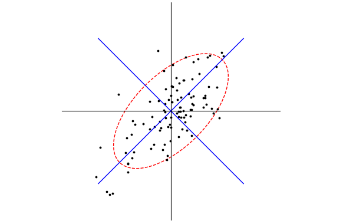
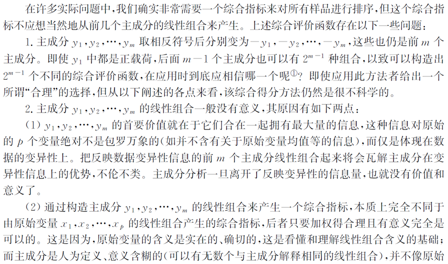
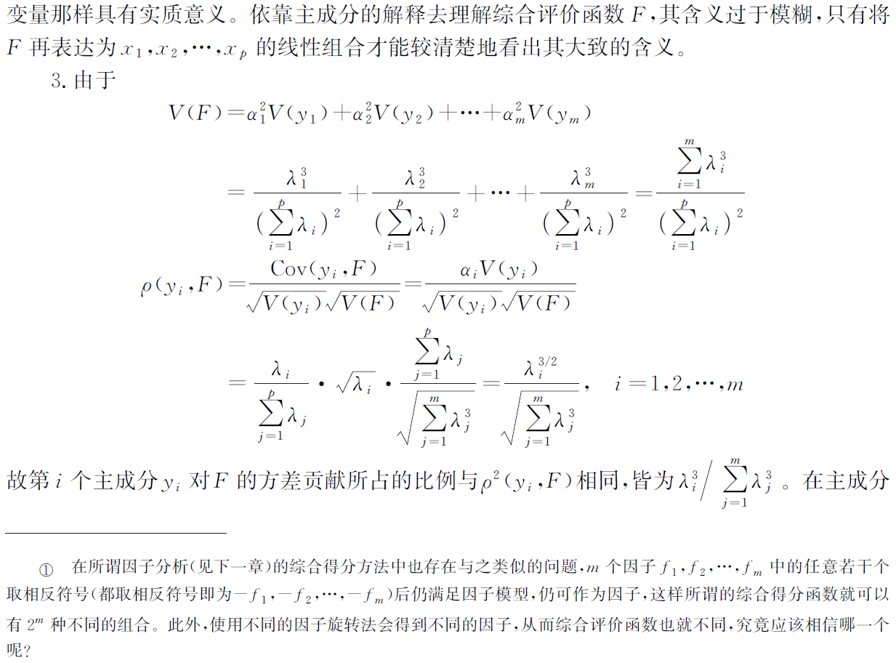
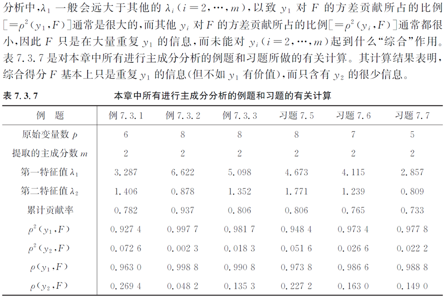
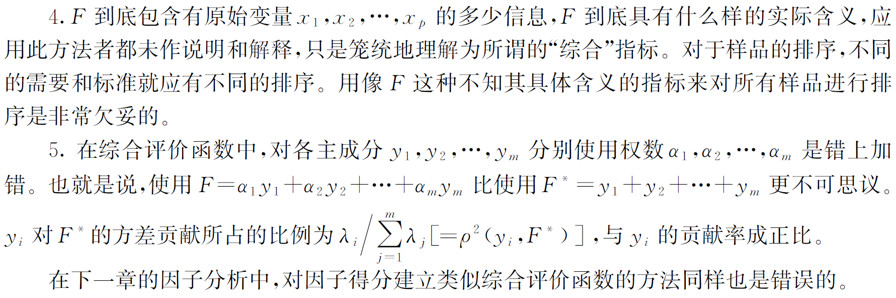
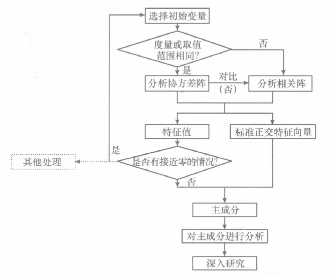
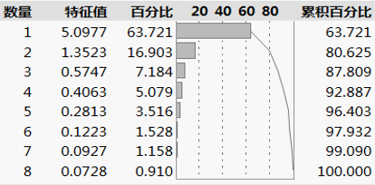

# 主成分分析

主成分分析`(principal components analysis)`也称主分量分析，是由霍特林于1933年首先提出的。**主成分分析是利用降维的思想，在损失很少信息的前提下，把多个指标转化为几个综合指标（主成分）的多元统计方法。这些主成分能够反映原始变量的绝大部分信息，通常表示为原始变量的某种线性组合，且彼此不相关。**这样在研究复杂问题时就可以只考虑少数几个主成分而不至于损失太多信息，从而更容易抓住主要矛盾，揭示事物内部变量之间的规律性，同时使问题得到简化，提高分析效率。

## 一、主成分分析的基本原理

在对某一事物进行实证研究时，为了更全面、准确地反映事物的特征及其发展规律，往往要考虑与其有关系的多个指标，这些指标在多元统计中也称为变量。这样就产生了如下问题：一方面为了避免遗漏重要的信息需要考虑尽可能多的指标，另一方面又要考虑指标的增多增加了问题的复杂性，同时由于各指标均是对同一事物的反映，不可避免地造成信息的大量重叠，这种信息的重叠有时甚至会掩盖事物的真正特征与内在规律。**如何才能在定量研究中使用较少的变量而表达较多的信息量？**主成分分析正是用来解决这一问题的，其可以通过少数几个新变量的线性组合来解释原来变量绝大多数信息。

### 1.基本思想

如果某一问题涉及的众多变量之间有一定的相关性，就必然存在着起支配作用的共同因素。根据这一点，通过对原始变量相关矩阵或协方差矩阵内部结构关系的研究，利用原始变量的线性组合形成几个综合指标(主成分)，可以在保留原始变量主要信息的前提下起到降维与简化问题的作用，使得在研究复杂问题时更容易抓住主要矛盾。

一般来说，利用主成分分析得到的主成分与原始变量之间有如下基本关系:

- 每一个主成分都是各原始变量的线性组合
- 主成分的数目大大少于原始变量的数目
- 主成分保留了原始变量的绝大多数信息
- 各主成分之间互不相关。

通过主成分分析，可以从事物之间错综复杂的关系中找出一些主要成分，从而有效利用大量统计数据进行定量分析，揭示变量之间的内在关系，得到对事物特征及其发展规律的一些深层次的启发，把研究工作引向深人。

### 2.基本原理

设对某一事物的研究涉及$p$个指标，分别用$X_1$，$X_2$，...，$X_p$，这$p$个指标构成的$p$维随机向量为$\mathbf{X}=(X_1,X_2,...,X_p)$，设随机向量$\mathbf{X}$的均值为$\mu$，协方差矩阵为$\Sigma$。可以任意地对$\mathbf{X}$进行线性变化，形成新的综合变量，不妨用$\mathbf{Y}$表示，则$\mathbf{X}$与$\mathbf{Y}$之间存在如下关系：

$$
\begin{cases}
Y_1=u_{11}X_1+u_{12}X_2+...+u_{p1}X_p \\[2ex]
Y_2=u_{12}X_1+u_{22}X_2+...+u_{p2}X_p \\[2ex]
 \hspace{2em}\vdots\\[2ex]
Y_p=u_{1p}X_1+u_{2p}X_2+...+u_{pp}X_p \\[2ex]
\end{cases}
$$
其矩阵形式为：$\mathbf{Y}=U\mathbf{X}$。

为了使$Y_i$的数量尽可能地少，可以让$Y_i=u_i^T\mathbf{X}$的方差尽可能大，且各个$Y_i$之间相互独立，由于：
$$
var(Y_i)=var(u_i^T\mathbf{X})=u^T_i\Sigma u_i
$$
所以，对于任意常数$c$，有：
$$
var(cu_i^T\mathbf{X})=c^2u^T_i\Sigma u_i
$$
因此对$u_i$不加限制时，可使$var(Y_i)$任意增大，问题将变得没有意义。不妨添加约束：

（1）$u^T_iu_i=1，(i=1,2,...,p)$。

（2）$Y_i$与$Y_j$相互无关，（$i\neq{j}$；$i,j=1,2,...,p$）。

（3）对于$\mathbf{X}=(X_1,X_2,...,X_p)$组成的一切满足（1）的线性组合，有$var(Y_1)\geq Y_2 \geq,...\geq Y_p$。

基于以上三条原则确定的综合变量$Y_1,Y_2,...,Y_p$分别称为原始变量的第一、第二...第$p$个主成分。其中，各综合变量在总方差中所占的比重依次递减。在实际研究工作中，通常只挑选前几个方差最大的主成分，从而达到简化系统结构、抓住问题实质的目的。

### 3.几何意义——以二维空间为例

> 以在二维空间中主成分的几何意义为例，所得结论可以扩展到多维的情况。

在处理涉及多个指标的问题时，为了提高分析的效率可以不直接对$p$个指标构成的$p$维随机向量$\mathbf{X}=(X_1,X_2,...,X_p)$进行分析，而是先对向量$\mathbf{X}$进行线性变换，形成少数几个新的综合变量$Y_1$，$Y_2$，...，$Y_m$（$m<p$），使得各综合变量之间相互独立且能解释原始变量尽可能多的信息，这样，在以损失很少部分信息为代价的前提下，达到简化数据结构、提高分析效率的目的。

设有$N$个样品，每个样品有两个观测变量$X_1$，$X_2$。在$X_1$与$X_2$之间存在较强相关性的前提下，在由变量$X_1$，$X_2$组成的坐标空间中，$N$个样品散布的情况应如带状。



由图可以看出，这$N$个样品无论沿$X_1$轴方向还是沿$X_2$轴方向，均有较大的离散性，其离散程度可以分别用观测变量$X_1$的方差和$X_2$的方差定量地表示。若只考虑$X_1$和$X_2$中的任何一个，原始数据中的信息均会有较大的损失。可以考虑$X_1$和$X_2$的线性组合，使原始样品数据可以由新的变量$Y_1$，$Y_2$来刻画。

在几何上表示就是将坐标轴按逆时针方向旋转$\theta$角度，得到新坐标轴$Y_1$和$Y_2$，坐标旋转公式如下：
$$
\begin{cases}
Y_1=X_1\cos{\theta}+X_2\sin{\theta} \\[2ex]
Y_2=X_1\sin{\theta}+X_2\cos{\theta} \\[2ex]
\end{cases}
$$
矩阵形式：
$$
\left[\begin{matrix}Y_1\\ Y_2\\\end{matrix}\right]=\left[\begin{matrix}\cos{\theta}&\sin{\theta}\\ -\sin{\theta}&\cos{\theta}\\\end{matrix}\right]\left[\begin{matrix}X_1\\ X_2\\\end{matrix}\right]=\mathbf{U}\mathbf{X}
$$
$\mathbf{U}$为旋转变换矩阵，且是正交阵，即满足：
$$
\mathbf{U}^T=\mathbf{U}^{-1},\mathbf{U}^T\mathbf{U}=\mathbf{I}
$$
经过这样的旋转之后，$N$个样品点在$Y_1$轴上的离散程度最大，变量$Y_1$代表了原始数据的绝大部分信息，在一些极端情形下，不考虑$Y_2$也无损大局。经过上述旋转变换可以把原始数据的信息集中到$Y_1$轴上，对数据中包含的信息起到了浓缩的作用。**主成分分析的目的就是找出变换矩阵U。**

下面为使主成分分析的几何意义更为明显，用服从正态分布的变量进一步进行分析，以二元正态分布为例，类似结论可以推广到多元正态总体的情况。设$X_1$，$X_2$服从二元正态分布，其密度函数为：
$$
f(X_1,X_2)=\frac{1}{2\pi\sigma_1\sigma_2\sqrt{1-\rho^2}}exp\{-\frac{1}{2\sigma^2_1\sigma_2^2(1-\rho^2)} [(X_1-\mu_1)^2\sigma_2^2  \\[2ex]
-2\sigma_1\sigma_2\rho(X_1-\mu_1)(X_2-\mu_2)+(X_2-\mu_2)^2\sigma_1^2]\}
$$
不妨令$\Sigma$为变量$X_1$，$X_2$的协方差矩阵，其形式为：
$$
\Sigma=\left[\begin{matrix}\sigma_1^2&\rho\sigma_1\sigma_2\\ \rho\sigma_1\sigma_2&\sigma_2^2\\\end{matrix}\right],\mathbf{X}=\left[\begin{matrix}X_1\\ X_2\\\end{matrix}\right],\mu=\left[\begin{matrix}\mu_1\\ \mu_2\\\end{matrix}\right]
$$
则上述二元正态分布的密度函数矩阵形式为：
$$
f(X_1,X_2)=\frac{1}{2\pi|\mathbf{\Sigma}|^{1/2}}exp\{ -\frac{1}{2}(\mathbf{X}-\mathbf{\mu})^T\mathbf{\Sigma}^{-1}(\mathbf{X}-\mathbf{\mu}) \}
$$
考虑$(\mathbf{X}-\mathbf{\mu})^T\mathbf{\Sigma}^{-1}(\mathbf{X}-\mathbf{\mu})=d^2$（$d$为常数），为方便设$\mu=0$，将上式展开为：
$$
\frac{1}{1-\rho^2}\left[ (\frac{X_1}{\sigma_1})^2-2\rho(\frac{X_1}{\sigma_1})(\frac{X_2}{\sigma_2})+(\frac{X_2}{\sigma_2})^2 \right]=d^2
$$
令$Z_1=\frac{X_1}{\sigma_1}$，$Z_2=\frac{X_2}{\sigma_2}$，则上面方程可以继续简化：
$$
Z_1^2-2\rho Z_1Z_2 +Z_2^2 = d^2(1-\rho^2)
$$

这是一个椭圆方程，长短轴分别为$2d\sqrt{1\pm\rho}$。

令$\lambda_1\geq\lambda_2>0$为$\mathbf{\Sigma}$的特征根，$\gamma_1$，$\gamma_2$为相应的标准正交特征向量，$\mathbf{P}=(\gamma_1,\gamma_2)$，（$\mathbf{P}$为正交阵）$\Lambda=\left[ \begin{matrix}\lambda_1&0\\ 0&\lambda_2\\\end{matrix}\right]$
$$
\mathbf{\Sigma}=\mathbf{P}\mathbf{\Lambda}\mathbf{P}^T,\mathbf{\Sigma}^{-1}=\mathbf{P}\mathbf{\Lambda}^{-1}\mathbf{P}^T
$$
因此有
$$
\begin{aligned}
d^2&=(\mathbf{X}-\mathbf{\mu})^T\mathbf{\Sigma}^{-1}(\mathbf{X}-\mathbf{\mu})=\mathbf{X}^T\mathbf{\Sigma}^{-1}\mathbf{X} \hspace{2em}(\mathbf{\mu=0})\\[2ex]
&=\mathbf{X}^T(\mathbf{P}\mathbf{\Lambda}^{-1}\mathbf{P}^T)\mathbf{X}=\mathbf{X}^T(\frac{1}{\lambda_1}\gamma_1\gamma_1^T+\frac{1}{\lambda_2}\gamma_2\gamma_2^T)\mathbf{X}\\[2ex]
&=\frac{1}{\lambda_1}(\gamma_1^T\mathbf{X})^2+\frac{1}{\lambda_2}(\gamma_2^T\mathbf{X})^2\\[2ex]
&=\frac{Y_1^2}{\lambda_1}+\frac{Y_2^2}{\lambda_2}
\end{aligned}
$$
与上面一样，这也是一个椭圆方程，且在$Y_1$，$Y_2$构成的坐标系中，其主轴的方向恰恰是$Y_1$，$Y_2$坐标轴的方向。因为$Y_1=\gamma_1^T\mathbf{X}$，$Y_2=\gamma_2^T\mathbf{X}$，所以$Y_1$，$Y_2$就是原始变量$X_1$，$X_2$的两个主成分，它们的方差分别为$\lambda_1$，$\lambda_2$，且经常有$\lambda_1$远大于$\lambda_2$，因此，在$Y_1$方向上集中的$X_1$，$X_2$的变差远大于在$Y_2$方向上集中的变差。这样，我们就可以只研究原始数据在Y方向上的变化而不至于损失过多信息。$\gamma_1$，$\gamma_2$就是椭圆在原始坐标系中的主轴方向，也是坐标轴转换的系数向量。对于多维的情况，上面的结论依然成立。

> 主成分分析的过程无非就是坐标系旋转的过程，各主成分表达式就是新坐标系与原坐标系的转换关系，在新坐标系中，各坐标轴的方向就是原始数据变差最大的方向。

## 二、求解主成分

主成分分析的基本思想就是在保留原始变量尽可能多的信息的前提下达到降维的目的，从而简化问题的复杂性并抓住问题的主要矛盾。对于随机变量$X_1$，$X_2$，...，$X_p$而言，其协方差矩阵或相关矩阵恰是对各变量**离散程度**与变量之间的**相关程度**的信息的反映，相关矩阵其实是将原始变量标准化后的协方差矩阵。**所谓的保留原始变量尽可能多的信息，也就是指生成的较少的综合变量(主成分)的方差和尽可能接近原始变量方差的总和。因此在实际求解主成分的时候，总是从原始变量的协方差矩阵或相关矩阵的结构分析入手。**

### 1.基于协方差求解

> 主成分的系数可以相差一个负号，因为特征向量乘以-1后仍然为特征向量。用主成分分析做评价模型时，如果主成分的系数变成了相反数，这时需根据实际情况对模型进行解释。
>
> 这句话来源于司守奎的《数学建模算法与应用（第2版）》，实际应该是错误的，因为在主成分分析中需要$\lambda>0$，不存在特征向量正负不确定的情形，因此也不会导致主成分的系数正负随机变化。

设随机向量$\mathbf{X}=(X_1,X_2,...,X_p)^T$的协方差矩阵为$\mathbf{\Sigma}$，其中$\lambda_1$，$\lambda_2$，...，$\lambda_p$（$\lambda_1 \geq \lambda_2 \geq ... \lambda_n>0$）为$\mathbf{\Sigma}$的特征根，$\gamma_1$，$\gamma_2$，...，$\gamma_p$为矩阵$\mathbf{\Sigma}$各特征根对应的标准正交特征向量，定义$\mathbf{P}=(\gamma_1,\gamma_2,...,\gamma_p)$，$\mathbf{\Lambda}=diag(\lambda_1,\lambda_2,...,\lambda_p)$，则存在如下变化：
$$
\begin{cases}
Y_1=\gamma_{11}X_1+\gamma_{12}X_2+...+\gamma_{p1}X_p \\[2ex]
Y_2=\gamma_{12}X_1+\gamma_{22}X_2+...+\gamma_{p2}X_p \\[2ex]
 \hspace{2em}\vdots\\[2ex]
Y_p=\gamma_{1p}X_1+\gamma_{2p}X_2+...+\gamma_{pp}X_p \\[2ex]
\end{cases}
$$
$\lambda_1,\lambda_1,...,\lambda_n\geq{0}$，

上式的矩阵形式：$\mathbf{Y}=\mathbf{P}^T\mathbf{X}$

第$i$个主成分可以表示为：
$$
Y_i=\gamma_{1i}X_1+\gamma_{2i}X_2+...+\gamma_{pi}X_p，i=1,2,...,p
$$
矩阵形式：$Y_i=\gamma_i^T\mathbf{X}$

其中：
$$
var(Y_i)=\gamma^T_i\Sigma\gamma_i=\frac{\gamma^T_i\Sigma\gamma_i}{\gamma^T_i\gamma_i}=\lambda_i
$$

$$
cov(Y_i,Y_j)=\gamma^T_i\Sigma\gamma_j=0，i\neq{0}
$$

**需要满足的条件：**

- $\mathbf{Y}=\mathbf{P}^T\mathbf{X}$，$\mathbf{P}$应该为$p$阶正交阵。
- $\mathbf{Y}$之间各分量互不相关，即$D(Y)=\mathbf{\Lambda}=diag(\lambda_1,\lambda_2,...,\lambda_p)$。

- $\mathbf{Y}$的$p$个分量能够按方差由大到小排列，即$\lambda_1 \geq \lambda_2 \geq ... \lambda_n>0$。

> 无论$\mathbf{\Sigma}$的各特征根是否存在相等的情况，对应的标准化特征向量总是存在的，总可以找到对应各特征根的彼此正交的特征向量。

**方差解释率**

称$e_k=\frac{\lambda_k}{\sum_{i=1}^p{\lambda_i}}(k=1,2,...,p)$为第$k$个主成分$Y_k$的方差贡献率，这个值越大，表明$Y_k$综合$\mathbf{X}$的信息能力越强，即$Y_k$的差异解释$\mathbf{X}$​差异的能力越强。

$ce_k=\frac{\sum_{i=1}^k{\lambda_i}}{\sum_{i=1}^p{\lambda_i}}$为前$k$个主成分的累计贡献率，一般为了减少向量的个数，不会选取$p$个主成分，而是选取$m$个主成分，这样既能使信息损失不太多，又能达到减少变量、简化问题的目的。

**因子负荷量**

第$k$个主成分$Y_k$与原始变量$X_i$的相关系数$\rho(Y_j,X_i)$称为因子负荷量。因子负荷量反映了$X_i$对$Y_k$​的重要程度，是主成分解释中非常重要的解释依据，因子负荷量的绝对值大小刻画了原始变量对某主成分的主要意义及其成因。

对于任意$X_i$，$X_i$与前$k$个主成分$Y_1$，$Y_2$，...，$Y_k$的全相关系数的平方和称为$Y_1$，$Y_2$，...，$Y_k$对原始变量$X_i$的方差贡献率$v_i=\frac{\sum_{k=1}^m{\lambda_k}\gamma_{ik}^2}{\sigma_{ii}},i=1,2,...,p$。该贡献率用于说明主成分从某一原始变量$X_i$中萃取了$v_i$的信息，用以判断判断主成分对某一原始变量的代表能力。

### 2.主成分的性质

**性质1：**$Y$的协方差阵为对角阵$\Lambda=diag(\lambda_1,\lambda_2,...,\lambda_p)$。

**性质2：**记$\mathbf{\Sigma}=(\sigma_{ij})_{p\times{p}}$，则有$\sum_{i=1}^p{\lambda_i}$=$\sum_{i=1}^p{\sigma_{ii}}$。
$$
\Sigma=P\Lambda P^T
$$

$$
\sum_{i=1}^p{\sigma_{ii}}=tr(\Sigma)=tr(P\Lambda P^T)=tr(\Lambda)=\sum_{i=1}^p{\lambda_i}
$$

**性质3：**$\rho(Y_k,X_i)=\frac{\gamma_{ik}\sqrt{\lambda_k}}{\sqrt{\sigma_{ii}}}$，$k,i=1,2,...,p$
$$
\sqrt{var{Y_k}}=\sqrt{\lambda_k}，\sqrt{var{X_i}}=\sqrt{\sigma_{ii}}，
$$
令$e_i=(0,...,0,1,0,...,0)^T$为单位向量，则$X_i=e_i^T\mathbf{X}$，又$Y_k=\gamma_k^T\mathbf{X}$，故：
$$
cov(Y_k,X_i)=cov(\gamma_k^T\mathbf{X},e_i^T\mathbf{X})=e_i^TD(X)\gamma_k=e_i^T\mathbf{\Sigma}\gamma_k=\lambda_ke_i^T\gamma_k=\lambda_k\gamma_{ik}
$$

$$
\rho(Y_k,X_i)=\frac{cov(Y_k,X_i)}{\sqrt{var{Y_k}}\sqrt{var{X_i}}}=\frac{\lambda_k\gamma_{ik}}{\sqrt{\lambda_k\sigma_{ii}}}=\frac{\gamma_{ik}\sqrt{\lambda_k}}{\sqrt{\sigma_{ii}}}
$$

**性质4：**$\sum_{i=1}^p{\rho^2}(Y_k,X_i)\sigma_{ii}=\lambda_k$
$$
\sum_{i=1}^p{\rho^2}(Y_k,X_i)\sigma_{ii}=\sum_{i=1}^p{\lambda_k\gamma^2_{ik}}=\lambda_{k}\sum_{i=1}^p{\gamma^2_{ik}}=\lambda_{k}
$$
**性质5：**$\sum_{i=1}^p{\rho^2(Y_k,X_i)}=\frac{\sum_{k=1}^p{\lambda_k}\gamma^2_{ik}}{\sigma_{ii}}=1$

因为$\mathbf{Y}$是$\mathbf{X}$的线性组合，所以反过来$\mathbf{X}$也是$\mathbf{Y}$的线性组合，任一$X_i$也可以被$\mathbf{Y}$线性表示。因为$Y_j$之间互不相关，$X_i$与各个$Y_j$之间的所有相关系数的平方和为1，即$\sum_{i=1}^p{\rho^2(Y_k,X_i)}=1$​。

### 3.基于相关矩阵求解

求解主成分的过程实际就是对矩阵结构进行分析的过程，也就是求解特征根的过程。**但是对于度量单位不同的指标或取值范围彼此差异非常大的指标，不能直接由其协方差矩阵出发进行主成分分析而应该考虑将数据标准化。**比如，在对上市公司的财务状况进行分析时，常常会涉及利润总额、市盈率、每股净利率等指标，其中利润总额取值常常从几十万元到上百万元，市盈率取值一般在五到六七十之间，每股净利率在1以下，不同指标取值范围相差很大，这时若是直接从协方差矩阵人手进行主成分分析，利润总额（**部分差异太大的指标）将明显起到重要支配作用，其他两个指标的作用很难在主成分中体现出来，应该考虑将数据进行标准化处理。**

**原始变量$\mathbf{X}$的相关矩阵实际上就是对原始变量标准化后的协方差矩阵**。因此，由相关矩阵求主成分的过程与主成分个数的确定准则实际上是与由协方差矩阵出发求主成分的过程与主成分个数的确定准则相一致的。在实际分析过程中，既可以从原始数据的协方差矩阵出发，也可以从原始数据的相关矩阵出发。但是，**对原始数据进行标准化处理后倾向于各个指标的作用在主成分的构成中相等。对于取值范围相差不大或度量相同的指标进行标准化处理后，其主成分分析的结果仍与由协方差阵出发求得的结果有较大区别。**

这是由于对数据进行标准化的过程实际上也就是抹杀原始变量离散程度差异的过程，标准化后的各变量方差相等，均为1。实际上方差也是对数据信息的重要概括，也就是说，对原始数据进行标准化后抹杀了一部分重要信息，因此才使得标准化后各变量在对主成分构成中的作用趋于相等。由此看来，**对同度量或取值范围在同量级的数据，还是直接从协方差矩阵求解主成分为宜。**

假设原矩阵$\mathbf{X}=(X_1,X_2,...,X_p)$，对于任意$X_i$都有期望$E(X_i)=\mu_i$，方差$cov(X)=\sigma_{ii}$，令$\mathbf{\Sigma}^{1/2}=diag(\sqrt{\sigma_{11}},\sqrt{\sigma_{22}},...,\sqrt{\sigma_{pp}})$，$\mathbf{\mu}=(\mu_1,\mu_2,...,\mu_p)^T$。

考虑对每个向量$X_i$做如下数学变换：
$$
Z_i=\frac{X_i-\mu_i}{\sqrt{\sigma_{ii}}},  i=1,2,...,p
$$
变化后存在 ：$E(Z_i)=0$，$var(Z_i)=1$。

上式的矩阵形式：$\mathbf{Z}=(\mathbf{\Sigma}^{1/2})^{-1}(\mathbf{X}-\mathbf{\mu})$，矩阵期望$E(\mathbf{Z})=0$，矩阵方差：
$$
cov{(\mathbf{Z})}=(\mathbf{\Sigma}^{1/2})^{-1}\mathbf{\Sigma}(\mathbf{\Sigma}^{1/2})^{-1}=\begin{bmatrix}
 1&\rho_{12}&\cdots&\rho_{1p}\\[1ex]
 \rho_{12}&1&\cdots&\rho_{2p}\\[1ex]
 \vdots & \vdots & \ddots & \vdots\\[1ex]
 \rho_{1p}&\rho_{2p}&\cdots&1\\[1ex]
 \end{bmatrix}=\mathbf{R}
$$
相关矩阵$\mathbf{R}$相当于$\mathbf{X}$标准化后的矩阵$\mathbf{Z}$的协方差矩阵。仍用$\lambda_i$，$\gamma_i$表示相关矩阵$\mathbf{R}$的特征值与其对应的标准正交特征向量，此时求得的主成分与原始变量的关系式为：
$$
Y_i=\gamma_i^T\mathbf{Z}=\gamma_i^T(\mathbf{\Sigma}^{1/2})^{-1}(\mathbf{X}-\mathbf{\mu}),i=1,2,...,p
$$
由于相关矩阵是标准化后矩阵的协方差矩阵，其对应的性质在形式上也更为简单。

- $\mathbf{Y}$的协方差矩阵为对角阵$\Lambda$；
- $\sum_{i=1}^p{var{(Y_i)}}=tr(\Lambda)=tr(R)=p=\sum_{i=1}^p{var(Z_i)}$；
- 第$k$个主成分的方差占总方差的比例，即第$k$个主成分的方差贡献率为$a_k=\lambda_k/p$，前$m$个主成分的累计方差贡献率$\sum_{i=1}^m{\lambda_i}/p$；
- $\rho(Y_k,Z_i)=\gamma_{ik}\sqrt{\lambda_k}$

> 判断主成分对某一原始变量$Z_i$的重要性的因子负荷量仅依赖于$\gamma_{ik}$，$\sqrt{\lambda_k}$是固定的。

### 4.样本与总体主成分

在实际研究中，总体协方差阵$\mathbf{\Sigma}$与相关阵$\mathbf{R}$通常是未知的，因此需要通过样本数据来估计。设有$n$个样品，每个样品有$p$个指标，这样共得到$n*p$个数据，原始资料矩阵如下:
$$
\mathbf{X}=\left[
\begin{matrix}
x_{11}&x_{12}&\cdots&x_{1p}\\[1ex]
x_{21}&x_{22}&\cdots&x_{2p}\\[1ex]
\vdots & \vdots & \ddots & \vdots\\
x_{n1}&x_{n2}&\cdots&x_{np}
\end{matrix}
\right]
$$
记
$$
\mathbf{S}=\frac{1}{n-1}\sum_{k=1}^n{(\mathbf{X}_k-\bar{\mathbf{X}})(\mathbf{X}_k-\bar{\mathbf{X}})^T}\\[2ex]
\mathbf{X}_k=(x_{k1},x_{k2},...,x_{kp})^T,k=1,2,...,n\\[2ex]
\bar{\mathbf{X}}=\frac{1}{n}\sum_{k=1}^n{\mathbf{X}_k}=(\bar{x_1},\bar{x_2},...,\bar{x_p})^T
$$
其中$\mathbf{S}$为样本协方差矩阵，作为总体协方差阵的无偏估计；$\mathbf{R}$为样本相关矩阵，为总体相关矩阵的估计。若$\mathbf{X}$是经过标准化处理的，则由矩阵$\mathbf{X}$求得的协方差阵就是相关矩阵，即$\mathbf{S}=\mathbf{R}$。

设主成分协方差矩阵$cov(\mathbf{Y})=\Lambda=diag(\lambda_1,\lambda_2,...,\lambda_p)$，假定$\mathbf{X}$是经过标准化处理的，则可由相关矩阵代替协方差矩阵，于是有：
$$
\Lambda=P^TRP
$$
可求得新的综合变量（主成分）的方差$\lambda_i$（$i=1,2,...,p$）是$\begin{vmatrix} R-\lambda I \end{vmatrix}=0$的$p$个根，$\lambda$为相关矩阵的特征根，相应的各个$\gamma_{ij}$是其对应的特征向量的分量。

由于$R$是正定矩阵，所以其特征根都是非负实数，将其按由大到小排列为$\lambda_1 \geq \lambda_2 \geq ...\geq \lambda_p >0$，其相应的特征向量分别记为$\gamma_1,\gamma_2,...,\gamma_p$，则$Y_i$的方差为$var(Y_i)=var(\gamma_i^T\mathbf{X})=\lambda_i$，并且其协方差为：
$$
\begin{aligned}
cov(Y_i,Y_j)&=cov(\gamma_i^T\mathbf{X},\gamma_j^T\mathbf{X})=\gamma_i^T\mathbf{R}\gamma_j^T\\[1ex]
&=\gamma_i^T(\sum_{a=1}^p{\lambda_a\gamma_a\gamma^T_a})\gamma_j^T\\[1ex]
&=\sum_{a=1}^p{\lambda_a(\gamma_i^T\gamma_a)(\gamma_a^T\gamma_j)}=0，i\neq{j}
\end{aligned}
$$
由此可有新的综合变量(主成分)$Y_1,Y_2,...,Y_m$，且其彼此互不相关。$Y_i$的方差为$\lambda_i$，$Y_i=\gamma^T_i\mathbf{X}$为$\mathbf{X}$的第$i$个主成分。主成分在几何图形中的方向实际上就是$\mathbf{R}$的特征向量的方向，主成分的方差贡献就等于$\mathbf{R}$​的相应特征根。这样，我们利用样本数据求解主成分的过程实际上就转化为求相关阵或协方差阵的特征根和特征向量的过程。

> 样本主成分是使**样本方差**而非总体方差达到最大，是使样本协方差而非总体协方差为零。

## 三、相关问题

### 1.主成分数选取准则

#### （1）经验准则

在主成分分析中，首先应保证所提取的前几个主成分的累计贡献率达到一个较高的水平（达到$85\%$​以上为宜）。

> 主成分分析的困难之处主要在于给出被提取的主成分符合实际背景和意义的解释，所提取的主成分中如有一个主成分解释不了，本身作为目的的整个主成分分析也就失败了。

- 保留的前几个主成分能使其累计贡献率达到一个较高的比例（如80%）。--比较推荐的做法。
- 保留特征值大于其平均值$\frac{\sum_{i=1}^p{\lambda_i}}{p}$​（或1）的主成分。--只宜作为初步参考。
- 采用对主成分所相应的特征值进行显著性检验的方法
- 根据特征根的变化来确定，当特征值的变化趋于平稳时，继续增加主成分的个数引起问题复杂度增大的程度将大于获取信息完整性收益带来的收益，这时应放弃通过增加主成分的个数来提高信息收益，采用这种办法选择主成分应考虑信息萃取比率达到一定程度。

> 如果不需要对主成分作出解释，则主成分个数的选择一般更倾向于保持一个足够高的累计贡献率。

#### （2）需求准则

- 当取三个和四个主成分都可行时，选取三个有一大好处，就是可以利用三维旋转图对所有样品的三个主成分得分进行直观的比较分析。
- 当取两个和三个主成分都可行时，选取两个的主要好处是，平面散点图可以比三维旋转图观测得更为清楚和方便，且可打印输出。
- 当取一个和两个主成分都可行时，取一个的优点是可以对各样品进行排序（如果这种排序是有实际意义的） ，取两个的优点是可以画散点图及保留更多的信息。如果我们对样品的排序不感兴趣，则一般应考虑取两个主成分，哪怕第二主成分的贡献率明显偏低些，因为取一个主成分不利于作图。
- 此外，通过对前两个或三个主成分的作图，还有助于从直觉上发现异常值、评估正态性以及进行其他的探索性分析等。

### 2.样本容量大小

在主成分的计算过程中不涉及$S$（$\hat{R}$）的逆矩阵，因此允许样本量个数$n$小于指标个数$p$。

一般在主成分本身作为目标的分析中较理想的是能满足$n\geq50$或至少是$p$的五倍以上，这可以使$S$（$\hat{R}$）的值比较稳定，分析结果一般也就不会随样本的变化而发生较大的改变，从而结论更加可信。

### 3.异常值的影响

少数几个异常值就可对$S$（$\hat{R}$）的值产生较大、甚至是非常大的影响。建议删除异常值或者采用一定的方法填充异常值。

### 4.主成分分析不要求数据来自正态总体

无论是从原始变量协方差矩阵出发求解主成分，还是从相关矩阵出发求解主成分，均不涉及总体分布的问题。与很多多元统计方法不同，主成分分析不要求数据来自正态总体。主成分分析的这一特性大大扩展了其应用范围，对多维数据，只要是涉及降维的处理，我们都可以尝试用主成分分析而不用花太多精力考虑其分布情况。

主成分分析仅仅是对矩阵结构的分析，其中用到的主要是矩阵运算的技术及矩阵对角化和矩阵的谱分解技术，几何上讲，**主成分就是按数据离散程度最大的方向进行坐标轴旋转**。**对多元随机变量而言，其协方差矩阵或相关矩阵均是非负定的，这样，就可以按照求解主成分的步骤求出其特征根、标准正交特征向量，进而求出主成分，达到缩减数据维数的目的。**

#### 5.主成分分析与信息重叠

主成分分析方法适用于变量之间存在较强相关性的数据，如果原始数据相关性较弱，运用主成分分析不能起到很好的降维作用，即所得的各个主成分浓缩原始变量信息的能力差别不大。一般当原始数据大部分变量的相关系数都小于0.3时，运用主成分分析不会取得很好的效果。

很多学者希望运用主成分分析来消除原始变量重叠信息，以此考虑足够多的信息且减小问题的复杂度。**但是在对待重叠信息方面，生成的新的综合变量(主成分)究竟是有效剔除了原始变量中的重叠信息？还是仅按原来的模式将原始信息中的绝大部分用几个不相关的新变量表示出来？**

假设一个存在$p$维指标的矩阵$\mathbf{X}$，其标准化后的协方差矩阵为$\mathbf{\Sigma}$。

假设在进行主成分分析时，存在两个变量完全相关，不妨将变量$X_1$的信息复制一份，其协方差矩阵发生如下变化：
$$
\mathbf{\Sigma}=\left[
\begin{matrix}
\sigma_{11}&\sigma_{12}&\cdots&\sigma_{1p}\\
\sigma_{21}&\sigma_{22}&\cdots&\sigma_{2p}\\
\vdots & \vdots & \ddots & \vdots\\
\sigma_{p1}&\sigma_{p2}&\cdots&\sigma_{pp}\\
\end{matrix}
\right] \Longrightarrow
\mathbf{\Sigma}_1=\left[
\begin{matrix}
\sigma_{11}&\sigma_{11}&\sigma_{12}&\cdots&\sigma_{1p}\\
\sigma_{11}&\sigma_{11}&\sigma_{12}&\cdots&\sigma_{1p}\\
\sigma_{21}&\sigma_{21}&\sigma_{22}&\cdots&\sigma_{2p}\\
\vdots &\vdots & \vdots & \ddots & \vdots\\
\sigma_{p1}&\sigma_{p1}&\sigma_{p2}&\cdots&\sigma_{pp}\\
\end{matrix}
\right]
$$
此时主成分分析实际上是在$(p+1)\times(p+1)$维矩阵$\mathbf{\Sigma}_1$上进行的，$\mathbf{\Sigma}_1$的行列式虽然为0但满足非负定，只不过其最小特征根为零。

进一步发现，其方差总和并不是$\sum_{i=1}^p{\sigma_{ii}}$，而是$\sum_{i=1}^p{\sigma_{ii}}+\sigma_1$​，**第一个指标在分析过程中起到了加倍的作用，其重叠信息完全像其他指标提供的信息一样在起作用。**这样求得的主成分已经与没有第一个指标重叠信息时不一样了，因为主成分方差的总和已变化。同时，**每个主成分解释方差的比例也相应发生变化，整个分析过程没有对重叠信息做任何特殊处理。**

**重复信息在主成分构成中起到了加倍的作用，主成分分析并无法删除重叠信息，同时由于主成分的选择还删除了一部分信息（比较稀有的特征）。**

这里的多重共线性可以理解为非线性重合信息。

在实际工作中，在选取指标时应该小心，对于存在多重共线性的原始变量，主成分分析倾向于提取共性信息而导致某部分被过分“重视”。应该考虑所选取的初始变量是否合适，是否真实地反映了事物的本来面目，如果是出于避免遗漏某些信息的原因而特意选取了过多的存在重叠信息的变量，就要特别**注意应用主成分分析所得到的结果**。

如果所得到的样本协方差矩阵(或相关阵)最小的特征根接近零，那么就有
$$
\hat{\mathbf{\Sigma}\mathbf{\gamma}}_p=\frac{1}{n-1}(\mathbf{X}-\mathbf{1}\bar{\mathbf{X}}^T)^T(\mathbf{X}-\mathbf{1}\bar{\mathbf{X}}^T)\mathbf{\gamma}_p=\lambda_p\gamma_p\approx{0}
$$
其中$\mathbf{1}=(1,1,...,1)^T$（$n$维），可以对上式同时左乘$\gamma_p^T$：
$$
\frac{1}{n-1}\gamma_p^T(\mathbf{X}-\mathbf{1}\bar{\mathbf{X}}^T)^T(\mathbf{X}-\mathbf{1}\bar{\mathbf{X}}^T)\mathbf{\gamma}_p=\gamma_p^T\lambda_p\gamma_p\approx{0}
$$
进而：
$$
(\mathbf{X}-\mathbf{1}\bar{\mathbf{X}}^T)\gamma_p\approx{0}
$$
这意味着中心化以后的原始变量之间存在着多重共线性，即原始变量存在着不可忽视的重叠信息。**在进行主成分分析得出协方差矩阵或相关矩阵，发现最小特征根接近零时，应该注意对主成分的解释，或者考虑对最初纳人分析的指标进行筛选。**由此可以看出，虽然主成分分析不能有效地剔除重叠信息，但它至少可以发现原始变量是否存在重叠信息，这对减少分析中的失误是有帮助的。

**方差大的主成分与方差大的原始变量有较密切的联系，而方差小的主成分与方差小的原始变量有较强的联系。通常取前几个主成分，因此所取主成分会过于照顾方差大的原始变量，而对方差小的原始变量却照顾得不够。**

> 如果后几个主成分的贡献率都非常小，则可能表示变量之间有几个彼此独立的多重共线性关系，当发现多重共线性信息时，应考虑应从这些原始变量中删除“多余”的变量（一般来说，有几个主成分方差为零，就有几个“多余”的变量），然后再重新进行主成分分析。

### 6.核主成分分析（KPCA）

主成分分析法(PCA)经常被用在企业绩效评价中，因为在在企业绩效综合评价体系中，一般会选择较多的指标且指标之间存在一定的相关性，因此所得到的统计数据在一定的信息重叠，增大了评价的复杂性。

中反映出的信息存在一定程度


```python
在高校科技创新能力评价中，经常使用的一种方法是。这是因为在高校科技创新能力评价中，一般选择的评价指标较多且指标间有一定的相关性，因此所得到的统计数据反映的信息有一定的重叠，增加了评价的复杂性。而PCA可利用几个不相关的主成分作为原来众多变量的线性组合，在保留了原始变量大部分信息的基础上减少了计算量，综合评价时更简洁，因此在评价中得到了广泛应用。但是，PCA只能去除评价指标之间的线性相关信息，忽略了多个评价指标间的非线性相关问题。核主成分分析(KPCA)方法不仅特别适合于处理非线性相关问题，且能提供更多的特征信息。KPCA通过某种事先选择的非线性映射φ将输入向量x映射到一个高维特征空间F.从而使输入向量具有更好的可分性，然后对高维空间中的映射数据做PCA，从而得到数据的非线性主成分。
```


### 7.主成分综合得分

经常看到有学者利用如下公式计算每个样品综合得分，然后依这个得分的大小对所有样品进行综合排名。
$$
F = \sum_{i=1}^m{a_iY_i}
$$
所谓综合得分方法目前存在很大的质疑（国内很多文献都在用，甚至很多书籍都在介绍），但是没有一本专业的国外多元统计书籍介绍或提到所谓的主成分或因子的综合得分方法(不排除非多元统计专业书籍有此内容的可能性)，从非技术角度试想，如果这种综合得分方法是正确的或合理的。那国外大多数多元统计书籍都应该介绍此方法，因为实际问题中我们有时很需要综合排名。——何晓群

该方法粗看起来似乎有一定道理且很有吸引力(似乎可以综合排名了)，但仔细推敲之后就会发现这一方法是对主成分思想、方法的误解和错用，是不科学的、没有任何理论和应用上的价值。在许多实际问题中，确实非常需要一个综合指标来对所有样品进行排序，但这个综合指标不应**想当然**地从前几个主成分的线性组合来产生。上述综合评价函数存在以下一些问题：









### 四、主成分分析步骤与案例

#### 1.主成分分析步骤

由前面的讨论大体上可以明了主成分分析的步骤，对此归纳如下：

（1）根据研究问题选取初始分析变量；

（2）根据初始变量特性判断由协方差阵求主成分还是由相关阵求主成分；

（3）求协方差阵或相关阵的特征根与相应标准特征向量；

（4）判断是否存在明显的多重共线性，若存在，则回到第(1)步；

（5）得到主成分的表达式并确定主成分个数，选取主成分；

（6）结合主成分对研究问题进行分析并深入研究。



#### 2.案例

> 为掌握我国各地区主要行业的城镇私营企业就业人员的平均工资水平，选取2016年我国30个省、直辖市、自治区(西藏地区数据缺失)9个行业就业人员的平均工资数据(数据来源于2017年《中国统计年鉴》)，用主成分分析方法处理该数据，以期用较少的变量描述这些行业各地区就业人员的工资水平。


这样显示贡献度也挺有意思：


