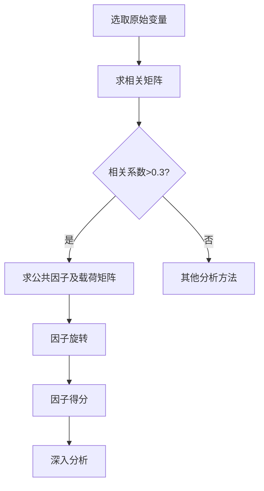
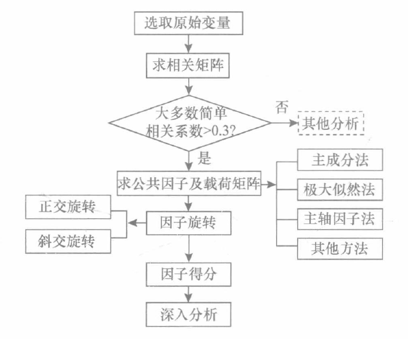

# 因子分析

> 主成分分析很难给出给出符合实际背景和意义的解释 。

因子分析(factor analysis)模型是主成分分析的推广。它也是利用降维的思想，从研究原始变量相关矩阵内部的依赖关系出发，把一些具有错综复杂关系的变量归结为少数几个综合因子的一种多变量统计分析方法。相比主成分分析，因子分析更倾向于描述原始变量之间的相关关系，因此，因子分析的出发点是原始变量的相关矩阵。

在经济统计中，描述一种经济现象的指标可以有很多，比如要反映物价的变动情况，对各种商品的价格做全面调查固然可以达到目的，但这样做显然耗时耗力，为实际工作者所不取。实际上，某一类商品中很多商品的价格之间存在明显的相关性或相互依赖性，只要选择几种主要商品的价格，进而对这几种主要商品的价格进行综合，得到某一种假想的“综合商品”的价格，就足以反映某一类物价的变动情况，这里，“综合商品”的价格就是提取出来的因子。这样，对各类商品物价或仅对主要类别商品的物价进行类似分析然后加以综合，就可以反映出物价的整体变动情况。这一过程也就是从一些有错综复杂关系的经济现象中找出少数几个主要因子，每一个主要因子代表经济变量间相互依赖的一种经济作用。抓住这些主要因子就可以帮助我们对复杂的经济问题进行分析和解释。

因子分析的思想始于1904年查尔斯·斯皮尔曼(`CharlesSpearman`)对学生考试成绩的研究。近年来，随着电子计算机的高速发展，人们将因子分析成功地应用于心理学、医学、气象、地质、经济学等各个领域，也使得因子分析的理论和方法更加丰富。

因子分析不仅可以用来研究变量之间的相关关系，还可以用来研究样品之间的相关关系，通常将前者称为R型因子分析，后者称为Q型因子分析。下面着重介绍R型因子分析。因子分析还可用于对变量或样品的分类处理，我们在得出因子的表达式之后，可以把原始变量的数据代人表达式得出因子得分，根据因子得分在因子所构成的空间中把变量或样品点画出来，形象直观地达到分类的目的。

## 一、因子模型

因子分析的基本思想是根据相关性大小把原始变量分组，使得同组内的变量之间相关性较高，而不同组的变量间的相关性则较低。每组变量代表一个基本结构，并用一个不可观测的综合变量表示，这个基本结构就称为公共因子。对于所研究的某一具体问题，原始变量可以分解成两部分之和的形式，一部分是少数几个不可测的所谓公共因子的线性函数，另一部分是与公共因子无关的特殊因子。

### 1.因子模型

设有`n`个样品，每个样品观测`p`个指标，这`p`个指标之间有较强的相关性(要求`p`个指标相关性较强的理由是很明确的，只有相关性较强，才能从原始变量中提取出“公共”因子)。为了便于研究，并消除观测量纲的差异及数量级不同所造成的影响，对样本观测数据进行标准化处理，使标准化后的变量均值为0，方差为1。为方便起见，把原始变量及标准化后的变量向量均用表示，用$F_1$，$F_2$，...，$F_m$，（$m<p$）表示标准化后的公共因子。假设：

（1）$\mathbf{X}=(X_1,X_2,...,X_p)^T$是可观测的随机向量，且均值向量$E(\mathbf{X})=0$，协方差矩阵$cov(\mathbf{X})=\mathbf{\Sigma}$，且协方差矩阵$\mathbf{\Sigma}$与相关阵$\mathbf{R}$相等；

（2）$\mathbf{F}=(F_1,F_2,...,F_m)^T$（$m<p$）是不可观测变量，且其均值向量$E(\mathbf{F})=0$，协方差矩阵$cov({\textbf{F}})=\textbf{I}$，即向量$\mathbf{F}$个分向量之间相互独立。

（3）$\mathbf{\varepsilon}=(\varepsilon_1,\varepsilon_2,...,\varepsilon_p)^T$与$\mathbf{F}$相互独立，且$E(\mathbf{\varepsilon})=0$，$\mathbf{\varepsilon}$的协方差矩阵$\Sigma_{\varepsilon}$是对角方阵，即$\varepsilon$各分量之间也是相互独立的。
$$
cov(\varepsilon)=\Sigma_{\varepsilon}=\left[
\begin{matrix}
\sigma^2_{11} & 0 & \cdots & 0\\
0 & \sigma^2_{22} & \cdots & 0\\
\vdots & \vdots & \ddots & \vdots\\
0 & 0 & \cdots & \sigma^2_{pp}
\end{matrix}
\right]
$$
则模型如下模型被称为因子模型：
$$
\begin{cases}
X_1=a_{11}F_1+a_{12}F_2+...+a_{1m}F_m+\varepsilon_1\\[2ex]
X_2=a_{21}F_1+a_{22}F_2+...+a_{2m}F_m+\varepsilon_2\\[2ex]
\vdots\\[2ex]
X_p=a_{p1}F_1+a_{p2}F_2+...+a_{pm}F_m+\varepsilon_p
\end{cases}
$$
矩阵形式：
$$
\mathbf{X}=\mathbf{A}\cdot{\mathbf{F}}+\mathbf{\varepsilon}
$$
上式中$\textbf{A}$为因子载荷矩阵。
$$
\mathbf{A}=\left[
\begin{matrix}
a_{11} & a_{12} & \cdots & a_{1m}\\
a_{21} & a_{22} & \cdots & a_{2m}\\
\vdots & \vdots &        & \vdots\\
a_{p1} & a_{p2} & \cdots & a_{pm}
\end{matrix}
\right]
$$

### 2.相关假设讨论

公共因子$F_1$，$F_2$，...，$F_m$，相互独立且不可测，是在原始变量的表达式中都出现的因子。公共因子的含义必须结合实际问题的具体意义确定。

特殊因子$\varepsilon_1$，$\varepsilon_2$，...，$\varepsilon_n$，是向量$\mathbf{X}$的分量$X_i$$(i=1，2，…，p)$所特有的因子。各特殊因子之间以及特殊因子与所有公共因子之间也都是相互独立的。

矩阵$A$中的元素$a_{ij}$又称因子载荷，$a_{ij}$（$|a_{ij}|\leq1$）的绝对值越大，表明$X_i$与$F_j$的相依程度越大，或称公共因子$F_j$对于$X_i$​的载荷量越大，进行因子分析的目的之一就是要求出各个因子载荷的值。因子载荷的概念与主成分分析中的因子负荷量相对等。

### 3.因子载荷的统计意义

在因子模型中，若将$\varepsilon_i$看作$a_{i,m+1}F_{m+1}+a_{i,m+2}F_{m+2}+...+a_{i,p}F_{p}$​的综合作用，则除了此处的因子为不可测变量这一区别外，因子载荷的概念与主成分分析中的因子负荷量是一致的。

进一步思考，假设$X_i$为标准化后的第$i$个指标下的数据，其均值为0，方差为1，$\mathbf{F}=(F_1,F_2,...,F_m)$是彼此独立的公共因子，都满足均值为0，方差为1，$\varepsilon_i$为特殊因子，与每个公共因子均不相关，且均值为0，$\mathbf{a_i}=(a_{i1},a_{i2},...,a_{im})$为$i$指标下对应的因子载荷。事实上每一个变量（指标）都可以被提取出来的公共因子线性表示与自身误差项（特殊因子）的和，某一指标可以被表示为：
$$
X_i=a_{i1}F_1 +a_{i2}F_2+...+a_{im}F_m+\varepsilon_i
$$
**其方差$var(X_i)$可以表示为：**
$$
\begin{aligned}
var(X_i)&=var(a_{i1}F_1 +a_{i2}F_2+...+a_{im}F_m+\varepsilon_i)\\[2ex]
&=var(a_{i1}F_1 +a_{i2}F_2+...+a_{im}F_m) + var(\varepsilon_i)\\[2ex]
&=a_{i1}^2var(F_1)+a_{i2}^2var(F_2)+...+a_{im}^2var(F_m)+var(\varepsilon_i)\\[2ex]
&=\sum_{j=1}^m{a_{ij}^2} + var(\varepsilon_i)\\[2ex]&=1
\end{aligned}
$$
其中$var(F_j)=var(X_i)=1$，于是$1=\sum_{j=1}^m{a_{ij}^2} + var(\varepsilon_i)$。式中$\sum_{j=1}^{m}{a_{ij}^2}$代表着公共因子$\mathbf{F}$解释$X_i$的方差比例，称为$X_i$的共同度，显然$a_{i}^2\leq1$，因此$-1\leq a_{ij}\leq1$。相对的$var(\varepsilon_i)$则代表着$X_i$中与公共因子无关的部分，被称为$X_i$​​​的特殊度或剩余方差。$\sum_{j=1}^m{a_{ij}^2}$与$var(\varepsilon_i)$是一种互补关系，前者越大，说明$X_i$对公因子的依赖程度越大，公共因子能解释$X_i$​方差的比例越大，因子分析效果越好。

`共同度`考虑的是所有公共因子$F_1$，$F_n$，...，$F_m$，对原始变量$X_i$的贡献程度，同理，还可以考虑某一个公共因子$F_j$与所有原始变量$X_1$，$X_2$，...，$X_p$的关系，$\sum_{i=1}^p{a_{ij}^2}$表示了公共因子$F_j$对与$\mathbf{X}$的每个分量$X_i$（$i=1,2,...,p$）所提供的方差综合，称为公共因子$F_j$对原始向量$\mathbf{X}$的方差贡献，或者称为对$\mathbf{X}$的影响和作用效果。如果将因子载荷矩阵$\mathbf{A}$的所以$\sum_{j=1}^p{a_{ij}^2}$都计算出来，并按照其大小排序，则可以提炼出最有影响力的公共因子。

**更一般的情况下：**
$$
\begin{aligned}
cov(X_i,F_j)&=cov(\sum_{j=1}^m{a_{ij}F_j+\varepsilon_i,F_j})\\[2ex]
&=cov(\sum_{j=1}^m{a_{ij}F_j},F_j)+cov(\varepsilon_i,F_j)\\[2ex]
&=a_{ij}
\end{aligned}
$$
可以看出$a_{ij}$是$X_i$与$F_j$的协方差，又因为$X_i$与$F_j$（$i=1,2,...,p;j=1,2,...,m$）都是均值为$0$，方差为$1$的变量，因此，$a_{ij}$也是$X_i$与$F_j$的相关系数。

**两个指标$X_i$与$X_j$之间的相关系数为：**
$$
\begin{aligned}
cov(X_i,X_j)&=E\left[(a_{i1}F_1 +...+a_{im}F_m+\varepsilon_i)(a_{j1}F_1 +...+a_{jm}F_m+\varepsilon_j)\right]\\[2ex]
&=a_{i1}a_{j1}var(F_1) + a_{i2}a_{j2}var(F_2)+...a_{im}a_{jm}var(F_m)\\[2ex]
&=a_{i1}a_{j1}+ a_{i2}a_{j2}+...a_{im}a_{jm}\\[2ex]
&=r_{ij}
\end{aligned}
$$
可以看出，当$X_i$与$X_j$在某一公共因子上载荷均较大时，说明$X_i$与$X_j$的相关性比较强。

### 4.因子分析与主成分分析的区别

- 因子分析把诸多变量看成是由对每一个变量都有作用的一些公共因子和一些仅对某一个变量有作用的特殊因子线性组合而成的。其目的在于从数据中探查能对变量起解释作用的公共因子和特殊因子，以及公共因子和特殊因子的组合系数。主成分分析则简单一些，它只是从空间生成的角度寻找能解释诸多变量绝大部分变异的几组彼此不相关的新变量(主成分)。
- 因子分析中，把变量表示成各因子的线性组合，而主成分分析中，把主成分表示成各变量的线性组合。
- 主成分分析中不需要有一些专门假设，因子分析则需要一些假设。因子分析的假设包括:各个公共因子之间不相关，特殊因子之间不相关，公共因子和特殊因子之间不相关。
- 提取主因子的方法不仅有主成分法，还有极大似然法等，基于这些不同算法得到的结果一般也不同。而主成分只能用主成分法提取。
- 主成分分析中，当给定的协方差矩阵或者相关矩阵的特征根唯一时，主成分一般是固定的;而因子分析中，因子不是固定的，可以旋转得到不同的因子。
- 在因子分析中，因子个数需要分析者指定(SPSS根据一定的条件自动设定，只要是特征根大于1的因子都进入分析)，随指定的因子数量不同而结果不同。在主成分分析中，主成分的数量是一定的，一般有几个变量就有几个主成分。
- 和主成分分析相比，由于因子分析可以使用旋转技术帮助解释因子，因此在解释方面更加有优势。而如果想把现有的变量变成少数几个新的变量(新的变量几乎带有原来所有变量的信息)来进行后续的分析，则可以使用主成分分析。当然，这种情况也可以通过计算因子得分处理。所以，这种区分不是绝对的。

## 二、因子分析的求解

因子分析可以分为确定因子载荷、因子旋转及计算因子得分三个步骤。首要的步骤即为确定因子载荷或者根据样本数据确定因子载荷矩阵A。有很多方法可以完成这项工作，如**主成分法、主轴因子法、最小二乘法、极大似然法、$\alpha$因子提取法**等。这些方法求解因子载荷的出发点不同，所得的结果也不完全相同。下面着重介绍比较常用的主成分法、主轴因子法与极大似然法。

### 1.主成分法

**对数据进行主成分分析，把前几个主成分作为未旋转的公共因子。**相对于其他确定因子载荷的方法而言，主成分法比较简单。注意主成分法所得的特殊因子$\varepsilon_1$，$\varepsilon_2$，...，$\varepsilon_p$​之间并不相互独立，因此主成分法确定的因子载荷不完全符合因子模型假设的前提，即所计算的因子载荷并不完全正确。当共同度较大时，特殊因子所起的作用比较小，特殊因子之间的相关性所带来的影响几乎可以忽略不计。

主成分法是比较常用的方法，有经验的分析人员在进行因子分析时，总是先用主成分法进行分析，然后再尝试其他方法。

**首先根据相关矩阵确定主成分。**设有$p$个变量，则可以找出$p$个主成分，将所得到的主成分按照从大到小排列，记为$Y_1$，$Y_2$，...，$Y_p$，则主成分与原始变量之间存在如下关系：
$$
\begin{cases}
Y_1=\gamma_{11}X_1+\gamma_{12}X_2+...+\gamma_{1p}X_p\\[2ex]
Y_2=\gamma_{21}X_1+\gamma_{22}X_2+...+\gamma_{2p}X_p\\[2ex]
\hspace{2em}\vdots\\[2ex]
Y_p=\gamma_{p1}X_1+\gamma_{p2}X_2+...+\gamma_{pp}X_p\\[2ex]
\end{cases}
$$
**其中$\gamma_{ij}$为随机向量$\mathbf{X}$的相关矩阵的特征根所对应的特征向量的分量，**由于特征向量之间彼此正交，从$\mathbf{X}$到$\mathbf{Y}$之间的转换关系是可逆的，得到由$\mathbf{Y}$到$\mathbf{X}$的转化：
$$
\begin{cases}
X_1=\gamma_{11}Y_1+\gamma_{21}Y_2+...+\gamma_{p1}Y_p\\[2ex]
X_2=\gamma_{12}Y_1+\gamma_{22}Y_2+...+\gamma_{p2}Y_p\\[2ex]
\hspace{2em}\vdots\\[2ex]
X_p=\gamma_{1p}Y_1+\gamma_{2p}Y_2+...+\gamma_{pp}Y_p\\[2ex]
\end{cases}
$$
对如上等式，仅保留前$m$个主成分，并把后面的部分用$\varepsilon_i$代替：
$$
\begin{cases}
X_1=\gamma_{11}Y_1+\gamma_{21}Y_2+...+\gamma_{m1}Y_m+\varepsilon_1\\[2ex]
X_2=\gamma_{12}Y_1+\gamma_{22}Y_2+...+\gamma_{m2}Y_m+\varepsilon_2\\[2ex]
\hspace{2em}\vdots\\[2ex]
X_p=\gamma_{1p}Y_1+\gamma_{2p}Y_2+...+\gamma_{mp}Y_m+\varepsilon_p\\[2ex]
\end{cases}
$$
此时形式上与因子模型一致，且$Y_i（i=1,2,,...,m）$之间相互独立，$Y_i$与$\varepsilon_i$之间相互独立。转化为公共因子$F_i$还需满足条件方差为1，通过将$Y_i$除以其标准差（特征根的平方根$\sqrt{\lambda_i}$）可以实现，令$F_i=Y_i/\sqrt{\lambda_i}$，且$a_{ij}=\sqrt{\lambda_j}\gamma_{ji}$：
$$
\begin{cases}
X_1=a_{11}F_1+a_{12}F_2+...+a_{1m}F_m+\varepsilon_1\\[2ex]
X_2=a_{21}F_1+a_{22}F_2+...+a_{2m}F_m+\varepsilon_2\\[2ex]
\hspace{2em}\vdots\\[2ex]
X_p=a_{p1}F_1+a_{p2}F_2+...+a_{pm}F_m+\varepsilon_p\\[2ex]
\end{cases}
$$
由此得到载荷矩阵$A$和一组初始公共因子（未旋转）。

设$\lambda_1,\lambda_2,...,\lambda_p(\lambda_1\geq \lambda_2 \geq ... \geq \lambda_p)$为样本相关阵$\mathbf{R}$的特征根，$\gamma_1,\gamma_2,...,\gamma_p$为对应的标准正交化特征向量，设$m<p$，则因子载荷矩阵$\mathbf{A}$的一个解为：
$$
\hat{A}=(\sqrt{\lambda_1}\gamma_1,\sqrt{\lambda_2}\gamma_2,...,\sqrt{\lambda_m}\gamma_m)
$$
共同度的估计为：
$$
\hat{h}^2_i=\sum_{j=1}^m{\hat{a}_{ij}^2}
$$
公共因子的数目$m$可以借鉴确定主成分个数的准则，如所选取的公共因子的信息量的和达到总体信息量的一个合适比例（80%或85%），SPSS中默认选择特征值大于1的主因子个数，也有教材提出大于平均特征值的作为主因子，或是碎石图是否“陡峭”。但对这些准则不应生搬硬套，应具体问题具体分析，要尽量使所选取的公共因子能够合理地描述原始变量相关阵的结构，同时要有利于因子模型的解释。

### 2.主轴因子法

主轴因子法也比较简单，而且在实际应用中比较普遍。

主轴因子法求解因子载荷矩阵的方法，其思路与主成分法十分相似，两者均是从分析矩阵的结构入手。不同的地方在于，主成分法是在所有的$p$个主成分都能解释标准化原始变量所有方差的基础之上进行分析的，而主轴因子法假定m个公共因子只能解释原始变量的部分方差，利用公共因子方差(或共同度)来代替相关矩阵主对角线上的元素1，并以这个新得到的矩阵(称为调整相关矩阵)为出发点，对其分别求解特征根与特征向量，从而得到因子解。根据因子模型可知：
$$
\mathbf{R}=\mathbf{A}\mathbf{A}^T + \mathbf{\Sigma_{\varepsilon}}
$$
其中，$\mathbf{A}$为因子载荷矩阵，$\mathbf{\Sigma_{\varepsilon}}$​为对角阵，其对角元素为相应特殊因子的方差。
$$
\mathbf{R}^*=\mathbf{R}-\mathbf{\Sigma_{\varepsilon}}=\mathbf{A}\mathbf{A}^T
$$
称$\mathbf{R}^*$为调整相关阵，此时$\mathbf{R}^*$对角线上的元素不再是1，而是共同度$h^2_i=\sum_{j=1}^m{a_{ij}^2}$。求解$\mathbf{R}^*$的特征值与标准正交化特征向量，进而可以求出因子载荷矩阵$\mathbf{A}$，此时，$\mathbf{R}^*$有$m$个正的持征根。

设$\lambda_1^*,\lambda_2^*,...,\lambda_m^*(\lambda_1^*\geq \lambda_2^* \geq ... \geq \lambda_m^*)$为$\mathbf{R}^*$的特征根，$\gamma_1^*,\gamma_2^*,...,\gamma_m^*$为对应的标准正交化特征向量，设$m<p$，则因子载荷矩阵$\mathbf{A}$的一个主轴因子解为：
$$
\hat{A}=(\sqrt{\lambda_1^*}\gamma_1^*,\sqrt{\lambda_2^*}\gamma_2^*,...,\sqrt{\lambda_m^*}\gamma_m^*)
$$
上面的分析以得到较为准确的$\mathbf{R}^*=\mathbf{R}-\mathbf{\Sigma_{\varepsilon}}$为基础的，事实上我们并不知道对角阵$\mathbf{\Sigma_{\varepsilon}}$，$\mathbf{R}^*$与$\mathbf{R}$的主要区别就是$\mathbf{R}^*$的对角线上是共同度$h^2_i$而不是1，因此需要首先估计$\mathbf{\Sigma_{\varepsilon}}$，或者共同度$h^2_i$。

先估计$h^2_i$​，按照如上方式计算，反复迭代计算，直至解稳定为止。

其他初始值估计法：

- 可以先通过主成分法估计。

- 取$\hat{\sigma}^2=1/r^{ii}$，其中$r^{ii}$为$\hat{\mathbf{R}}^{-1}$的第$i$个对角线元素，此时$\hat{h^2_i}=1-\hat{\sigma^2_i}$，该方法比较常用，但一般要求$\hat{\mathbf{R}}$满秩。
- 取$\hat{h^2_i}=\max_{j\neq i}{|r_{ij}|}$，此时$\hat{\sigma^2_i}=1-\hat{h^2_i}$。
- 取$\hat{h^2_i}=1$，此时$\hat{\sigma^2_i}=0$，得到的$\hat{A}$是一个主成分解。

### 3.极大似然法

假定公共因子$\mathbf{F}$和特殊因子$\mathbf{\varepsilon}$服从正态分布，则能够得到因子载荷和特殊因子方差的极大似然估计。设$X_1,X_2,...,X_p$为来自正态总体$N(\mu,\sigma^2)$的随机样本，其中$\sigma^2=AA^T+\Sigma_{\varepsilon}$，根据极大似然理论：
$$
L(\mu,\sigma^2)=\frac{1}{(2\pi)^{np/2}\sqrt{\sigma^2}^n}e^{-1/2tr\{\sigma^{-2}\left[\sum_{j=1}^n(X_j-\bar{X})(X_j-\bar{X})^T+n(\bar{X}-\mu)(\bar{X}-\mu)^T\right]\}}
$$
用该方法可以得到极大似然估计值$\hat{\sigma}^2$，进而通过估计值计算$\hat{A}$和$\hat{\Sigma_{\varepsilon}}$，但上式无法唯一的确定$A$，添加如下条件：
$$
A^T\Sigma_{\varepsilon}^{-1}A=\Delta
$$
这里$\Delta$是一个对角阵，极大似然估计值$\hat{A}$，$\hat{\Sigma_{\varepsilon}}$和$\hat{\mu}=\bar{X}$将使得$\hat{A}^T\hat{\Sigma_{\varepsilon}}^{-1}\hat{A}$​为对角阵。

> 对极大似然解，各因子所解释的总方差的比例未必像主成分解及主因子解那样依次递减。还有，当因子数增加时，原来因子的估计载荷及对**x**的贡献将发生变化，这也与主成分解及主因子解不同。

### 4.因子旋转

不管用何种方法确定初始因子载荷矩阵A，它们都不是唯一的。设$F_1,F_2,...,F_m$是初始公共因子，则可以建立它们的如下线性组合得到新的一组公共因子$F_1^{\prime},F_2^{\prime},...,F_m^{\prime}$，使得$F_1^{\prime},F_2^{\prime},...,F_m^{\prime}$相互独立。
$$
F_1^{\prime}=d_{11}F_1 + d_{12}F_2+...+d_{1m}F_m\\[2ex]
F_2^{\prime}=d_{21}F_1 + d_{22}F_2+...+d_{2m}F_m\\[2ex]
\hspace{2em}\vdots\\[2ex]
F_m^{\prime}=d_{m1}F_1 + d_{m2}F_2+...+d_{mm}F_m\\[2ex]
$$
这样的线性组合可以找到无数组。

建立因子分析模型的目的不仅仅在于找到公共因子，更重要的是知道每一个公共因子的意义，以便对实际问题进行分析。然而，我们得到的初始因子解各主因子的典型代表变量不是很突出，容易使因子的意义含糊不清，不便于对实际问题进行分析。出于这种考虑，可以对初始公共因子进行线性组合，即进行因子旋转，以期**找到意义更为明确、实际意义**更明显的公共因子。

经过旋转后，公共因子对$X_i$的贡献$h_i^2$不会改变，但由于载荷矩阵发生变化，公共因子本身就可能发生很大的变化，每一个公共因子对原始变量的贡献$g^2_i$不在于原本相同，经过适当的旋转，就可以得到比较令人满意的公共因子。

因子旋转分为正交旋转与斜交旋转。正交旋转由初始载荷矩阵A右乘一正交阵得到，经过正交旋转得到的新的公共因子仍然保持彼此独立的性质。斜交旋转则放弃了因子之间彼此独立这个限制，因而可能达到更为简洁的形式，其实际意义也更容易解释。

无论是正交旋转还是斜交旋转，都应当使新的因子载荷系数要么尽可能地接近于零，要么尽可能地远离零。因为一个接近于零的载荷$a_{ij}$表明$X_i$与$F_j$的相关性很弱，而一个绝对值比较大的载荷$a_{ij}$则表明公共因子$F_j$在很大程度上解释了$X_i$的变化。这样，如果任一原始变量都与某些公共因子存在较强的相关关系，而与另外的公共因子几乎不相关的话，公共因子的实际意义就会比较容易确定。

对于一个具体问题做因子旋转，有时需要进行多次才能得到令人满意的效果。每一次旋转后，矩阵各列平方的相对方差之和总会比上一次有所增加。如此继续下去，当总方差的改变不大时，就可以停止旋转，这样就得到了一组新的公共因子及相应的因子载荷矩阵，使得其各列元素平方的相对方差之和最大。

### 5.因子得分

因子模型建立之后，往往需要反过来考察每一个样品的性质及样品之间的相互关系。比如关于企业经济效益的因子模型建立之后，我们希望知道每一个企业经济效益的优劣，或者把诸企业划分归类，如哪些企业经济效益较好，哪些企业经济效益一般，哪些企业经济效益较差等。

可以通过计算因子得分来实现，因子得分就是每一个样品点在各个公共因子$F_1,F_2,...,F_m$上的得分。在主成分分析中，主成分是原始变量的线性组合，当取$n$个主成分时，主成分与原始变量之间的变换关系是可逆的，只要知道了原始变量用主成分线性表示的表达式，就可以方便地得到用原始变量表示主成分的表达式。但是在因子分析中，由于存在$\varepsilon_i$，公共因子并不容易用原始变量线性表示，公共因子的个数少于原始变量的个数，且公共因子是不可观测的隐变量，载荷矩阵A不可逆，因而不能直接求得公共因子用原始变量表示的精确线性组合。

解决该问题的一种方法是用回归的思想求出线性组合系数的估计值，即建立如下以公共因子为因变量、原始变量为自变量的回归方程:
$$
F_j = \beta_{j1}X_1 + \beta_{j2}X_2 +... +\beta_{jp}X_p,\hspace{1em}j=1,2,...,m
$$
因为原始变量与公共因子变量均为标准化变量，所以回归模型中不存在常数项。据此可以根据最小二乘得到$\mathbf{F}$的估计值：
$$
\hat{\mathbf{F}}=\mathbf{A}^T\mathbf{R}^{-1}\mathbf{X}
$$
其中，$\mathbf{A}$为因子载荷矩阵，$\mathbf{R}$为原始变量的相关阵，$\mathbf{X}$为原始变量向量。

在得到一组样本值后，可以代人上面的关系式求出公共因子的估计得分，从而用少数公共因子去描述原始变量的数据结构，用公共因子得分去描述原始变量的取值。在估计出公共因子得分后，可以利用因子得分进一步分析，如样本点之间的比较分析、对样本点的聚类分析等。当因子数m较少时，还可以方便地把各样本点在图上标示出来，直观地描述样本的分布情况，从而便于把研究工作引向深人。

## 三、因子分析的步骤

进行因子分析应包括如下几步：

- 根据研究问题选取原始变量。
- 对原始变量进行标准化并求其相关阵，分析变量之间的相关性。
- 求解初始公共因子及因子载荷矩阵因子旋转。
- 计算因子得分。
- 根据因子得分做进一步分析。

