# 01.计量经济学与统计学基础

## 一、什么是计量经济学

计量经济学(`Econometrics`)一词据说是由挪威经济学家` R.Frisch(1895-1973)`创造出来的。`Frisch` 在 `Econometrca `第一卷的卷首语中写道：

```python
经济理论与统计学和数学之间联系的进展;
经济问题的理论定量研究和经验定量研究;
计量经济学与经济统计学、数学在经济学中的应用不是一回事;
经验显示统计学、经济理论和数学都很重要，只有它们相互结合才能对现实世界的经济关系有更好的理解;
```

这三者的结合构成了计量经济学。Frisch 的这些定义在今天仍然适用，只是在某些用法方面可能发生了一些变化。

计量经济学就是综合利用经济模型、数理统计和经济数据来分析经济问题。`Stockand Watson(2015Introduce to Econometrics Updated 3rd)`说：“计量经济学是利用经济理论和数理统计技术来分析经济数据。”它可以分为两类：

- 计量经济理论，或者理论计量经济学包括工具和方法的发展，以及对方法性质的研究;
- 应用计量经济学描述了定量经济学的发展，以及利用经济数据来应用这些模型。

### 1.计量经济学方法

现代计量经济学的统一方法是由挪威经济学家`T. Haavelmo(1911-1999)`开创的。1944 年他在`Econometrica `上发表“`The probability approach in econometrics`”。他认为定量经济模型就是一个概率模型，因此，要在经济模型中加入随机性。那么，对经济模型的量化、估计和推断的恰当方法必须要以数理统计学为基础。这就是计量经济学的概率方法。

`Haavelmo` 的概率方法很快就被经济学专业接受，发展，并广为传播。因此，当今的经济学定量研究离不开概率方法。但是，`Haavelmo` 原始想法的并不是概率方法，而是结构方法。通常，计量经济模型和定量分析都是在模型正确设定的假设下进行的。结构方法则引出了似然分析，例如极大似然估计`（MLE）`和贝叶斯估计`（BE）`。但是结构方法最大的缺点是认为经济模型设定正确。

但是，应该把模型当做现实世界的一种抽象和近似。因此，推断的准结构方法就把模型当做一种近似，而非真实的。这种理论引出了“伪真实值”`（pseudo-true value）`。拟似然函数、拟`MLE `和拟似然推断。与此紧密联系的是半参数方法。概率经济模型是一种局部设定模型，有一些经济特征并没有被设定。这种方法发展了最小二乘`（LS）`、广义矩方法`（GMM）`。这是目前应用广泛的方法。

定量结构模型的另一个分支就是校准方法。与准结构方法相似，校准方法把模型理解为一种近似。它们之间的区别在于，校准方法拒绝统计推断，而是用模型与数据矩匹配的方法来选择参数。这是宏观计量中的主要方法。

### 2.计量经济学中常见的概念

最常用的计量经济学概念就是数据、数据集和样本。

经济学家总是面对着有关变量的一系列重复测量值。对于变量的不同重复测量称为观测值。经济学家通常用x，y 或z 来表示观测值。计量经济学中，通常用y 来表示被解释变量/因变量，而x 和z 表示解释变量/自变量。实数用小写字母表示，例如y；向量用粗体小写字母表示，例如x。

加粗大写字母$X$ 表示矩阵。

带下标i（有时候也用j 或其它字母表示）的变量表示观测值，例如$y_𝑖$，$x_𝑖$和$z_𝑖$。此外，带时间下标$t$的变量表示时间序列观测值。面板数据观测值带有$it$​下标。

小写希腊字母$𝛽$，$𝜃$ 等表示计量模型的未知参数。加粗希腊字母$𝛽$，$𝜃$ 表示系数向量。

回归模型——微观计量中最主要的模型，量化一个变量发生变化导致另一个变量的变化程度（因果效应）。

### 3.数据、数据结构与数据来源

#### （1）观测数据

计量经济学通常就是量化一个变量对另一个变量的影响。从自然科学的角度来看，最理想的情形就是利用实验数据来回答这些问题。但是，在经济学或者社会科学中做实验。

要么成本很大，不能让一个企业缴纳30% 税率，另一个企业只缴纳10% 税率；要么，不道德，教育的影响，让一部分孩子不上学，这太不道德了。

因此，大多数的经济数据是可**观测数据**。（注意：目前的实验经济学是可以得到某些实验数据的。）例如，我们通常能收集到教育与工资的记录数据，据此，我们可以测算两个变量的联合分布。但我们并不能从观测数据中推断它们之间的因果关系。因为我们不能操纵个人教育层次和年限，来观测他的不同工资结果。

#### （2）数据结构

五种主要的数据结构：

- 截面数据
- 时间序列数据
- 面板数据
- 聚类数据：与面板数据相关。在聚类抽样中，观测值被归类——类别间相互独立，类
  别中相关。与面板数据的主要差别在于，聚类抽样并不显性建模误差结构。
- 空间数据：根据空间指标而具有相互依赖性。

#### （3）数据来源

目前，有许多公开的数据来源：

- 国家统计局
- 各种类型的统计年鉴
- CGSS
- 其它微观调研数据

## 二、概率与统计基础

### 1.描述性统计

#### （1）离散分布：频率与列联表

假设我们有一个随机变量`x`和`y`的样本，分别存储在`numpy`或`pandas`数据类型`X`和`Y`中。对于离散变量，最基本的统计是结果的频率。`numpy`命令`unique(z,returm counts=True)`或`pandas`命令`x.value.count()`返回这样一个计数表。如果我们对列联表感兴趣，即变量x和y的每个结果组合的计数，我们将其提供给`pandas`中的`crosstab`函数。

为了获得样本份额而不是计数，我们可以将函数参数归一化:

```python
总体样本份额:交叉表(x,y,normalize='all')
x值内的份额(行百分比):交叉表(x,y,normalize='index')
y值中的份额(列百分比):交叉表(x,y,normalize='columns')
```

作为一个例子，我们来看一下`Script 1.22 (Descr-Tables.py)`中的数据集事务。我们用两个变量演示`numpy`和`pandas`命令的工作原理：

```python
如果应答者至少有一个孩子，则kids=1
ratemar = 对自己婚姻的评价(1=非常不幸福，…，5-非常幸福)
```

案例：

```python
import wooldridge as woo
import numpy as np
import pandas as pd

affairs = woo.dataWoo("affairs")
# adjust codings to [0-4] (Categoricals require a start from 0): 
affairs["ratemarr"] = affairs["ratemarr"] - 1
# use a pandas.Categorical object to attach labels for "haskids": 
affairs["haskids"] = pd.Categorical.from_codes(affairs["kids"], categories=["no", "yes"])
# ... and "marriage" (for example: 0 = "very unhappy", 1 = "unhappy",...): 
mlab = ["very unhappy", "unhappy", "average", "happy", "very happy"]
affairs["marriage"] = pd.Categorical.from_codes(affairs["ratemarr"], categories=mlab)
# frequency table in numpy (alphabetical order of elements): 
ft_np = np.unique(affairs["marriage"], return_counts=True)
unique_elem_np = ft_np[0]
counts_np = ft_np[1]
print(f"unique_elem_np: {unique_elem_np}")
print(f"counts_np: {counts_np}")
# frequency table in pandas: 
ft_pd = affairs["marriage"].value_counts()
print(f"ft_pd: {ft_pd}")

# frequency table with groupby: 
ft_pd2 = affairs["marriage"].groupby(affairs["haskids"]).value_counts()
print(f"ft_pd2: {ft_pd2}")
# contingency table in pandas: 
ct_all_abs = pd.crosstab(affairs["marriage"], affairs["haskids"], margins=3)
print(f"ct_all_abs: {ct_all_abs}")
ct_all_rel = pd.crosstab(affairs["marriage"], affairs["haskids"],normalize="all")
print(f"ct_all_rel: {ct_all_rel}")
# share within "marriage" (i.e. within a row): 
ct_row = pd.crosstab(affairs["marriage"], affairs["haskids"], normalize="index")
print(f"ct_row: {ct_row}")
# share within "haskids" (i.e. within a column): 
ct_col = pd.crosstab(affairs["marriage"], affairs["haskids"],normalize="columns")
print(f"ct_col: {ct_col}")
```

在`Python`脚本中，我们首先从数据集`affairs`提供的编码值中生成感兴趣的两个变量的分类版本。通过这种方式，我们可以为结果生成带有有意义标签而不是数字的表，参见`1.2.4`节。然后生成不同的表。在`601`名受访者中，有`430`人(`71.5%`)有孩子。总体而言，`16`名受访者表示对自己的婚姻非常不满意，`232`名受访者表示非常幸福。例如，在有计数的列联表中，我们看到`136`名受访者非常幸福，并有了孩子。

报告行内份额的表格(`ct row`)告诉我们，例如，`81.25%`的非常不快乐的人有孩子，只有`58.6%`的非常快乐的受访者有孩子。最后一个表格分别报告了有孩子和没有孩子的人的婚姻评级分布:`56.1%`的没有孩子的受访者非常幸福，而只有`31.6%`的有孩子的人报告说他们的婚姻很幸福。在为你自己的计划生育得出任何结论之前，请至少继续研究计量经济学，直到你充分认识到相关性和因果关系的区别！

有几种方法可以图形化地描绘出这些表格中的信息。脚本`1.23(Descr-Figures.py)`演示了分别使用命令`pie`和`bar`创建基本饼图和柱状图。这些图形当然可以通过多种方式进行调整，参见`1.4`节中的帮助页面和图形的一般讨论。探索这些选项的最佳方式是对规范进行修补，并观察结果。

```python
import wooldridge as woo
import numpy as np
import pandas as pd
import matplotlib.pyplot as plt


affairs = woo.dataWoo("affairs")
# attach labels (see previous script): 
affairs["ratemarr"] = affairs["ratemarr"] - 1
affairs["haskids"] = pd.Categorical.from_codes(affairs["kids"], categories=["no", "yes"])
mlab = ["very unhappy", "unhappy", "average", "happy", "very happy"]
affairs["marriage"] = pd.Categorical.from_codes(affairs["ratemarr"], categories=mlab)
# counts for all graphs: 
counts = affairs["marriage"].value_counts()
counts_bykids = affairs["marriage"].groupby(affairs["haskids"]).value_counts()
counts_yes = counts_bykids["yes"]
counts_no = counts_bykids["no"]
# pie chart (a): 
grey_colors = ["0.3", "0.4", "0.5", "0.6", "0.7"]
plt.pie(counts, labels=mlab, colors=grey_colors)
# plt.savefig("PyGraphs/Descr-Pie.pdf")
plt.close()
# horizontal bar chart (b): 
y_pos = [0, 1, 2, 3, 4]
# the y locations for the bars
plt.barh(y_pos, counts, color="0.6")
plt.yticks(y_pos, mlab, rotation=60)
# add and adjust labeling
# plt.savefig("PyGraphs/Descr-Bar1.pdf")
plt.close()
# stacked bar plot (c):
x_pos = [0, 1, 2, 3, 4]
# the x locations for the bars 
plt.bar(x_pos, counts_yes, width=0.4, color="0.6", label="Yes")
# with "bottom=counts_yes" bars are added on top of previous ones:
plt.bar(x_pos, counts_no, width=0.4, bottom=counts_yes, color="0.3", label="No") 
plt.ylabel("Counts")
plt.xticks(x_pos, mlab)
# add labels on x axis 
plt.legend()
# plt.savefig("PyGraphs/Descr-Bar2.pdf")
plt.close()
# grouped bar plot (d) 
# add left bars first and move bars to the left: 
x_pos_leftbar = [-0.2, 0.8, 1.8, 2.8, 3.8]
plt.bar(x_pos_leftbar, counts_yes, width=0.4, color="0.6", label="Yes")
# add right bars first and move bars to the right: 
x_pos_rightbar = [0.2, 1.2, 2.2, 3.2, 4.2]
plt.bar(x_pos_rightbar, counts_no, width=0.4, color="0.3", label="No")
plt.ylabel("Counts")
plt.xticks(x_pos, mlab)
plt.legend()
# plt.savefig("PyGraphs/Descr-Bar3.pdf")
plt.show()
```

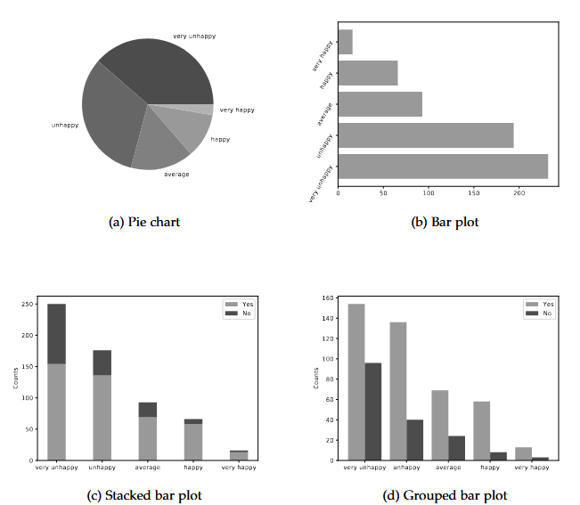

#### （2）连续分布:直方图和密度

对于连续变量，每个观测值都有不同的值。在实践中，具有许多(但不是无限多)不同值的变量可以用同样的方法处理。由于每个值在数据中只出现一次(或非常少的一次)，频率表或柱状图是没有用的。相反，这些值可以按区间分组。然后，这些间隔内值的频率可以被制成表格或在直方图中描述。
在`Python`模块`matplotib`中，函数`hist(x,options)`将观测值分配给可以手动设置或自动选择的区间，并创建一个直方图，将x的值与相应bin中的计数或密度绘制在一起。最相关的选项是

```python
垃圾箱=…:设置间隔边界:
-no bins指定:让Python选择number和position。
-bins =n用于标量n:选择bins的数量，但让Python选择位置。
-bins =v用于列表v:显式设置边界。
密度-True:不要使用计数，而是使用纵轴上的密度。
```

让我们看看在`Wooldridge(2019，例2.3)`中描述和使用的数据集`CEOSAL1`。它包含了`ceo`的工资信息和其他信息。我们将尝试描述股本回报率(ROE)的分布，以百分比衡量。

脚本`1.24(Histogram.py)`生成了图1.11的图形。在子图(b)中，断点是手动选择的，间隔不是相等的。设置密度=True给出了纵轴上的密度:因此，一个容器内的观测样本份额是由各自矩形的面积反映的，而不是高度。

```python
import wooldridge as woo
import matplotlib.pyplot as plt


ceosal1 = woo.dataWoo("ceosal1")
# extract roe:
roe = ceosal1["roe"]
# subfigure a (histogram with counts):
plt.hist(roe, color="grey")
plt.ylabel("Counts")
plt.xlabel("roe")
# plt.savefig("PyGraphs/Histogram1.pdf")
plt.close()
# subfigure b (histogram with density and explicit breaks): 
breaks = [0, 5, 10, 20, 30, 60]
plt.hist(roe, color="grey", bins=breaks, density=True)
plt.ylabel("density")
plt.xlabel("roe")
# plt.savefig("PyGraphs/Histogram2.pdf")
plt.show()
```

核密度图可以被认为是一种更复杂的直方图。我们不能在这里详细说明，但一个直观的(而且过于简化的)思考方式是这样的：我们可以创建一个一定宽度的直方图库，以x的任意点为中心。我们将对许多点这样做，并将这些x值与结果密度绘制在一起。在这里，我们不会使用这个绘图作为总体分布的估计，而是作为样本分布的描述性描述的直方图的一个很好的替代品。详情请参见例如Silverman(1986)。

通过模块`statsmomodels`生成一个核密度图很简单:`nonparameter .kdeunivariate(x).fit()`会自动在`Pvthon`选择合适的参数。

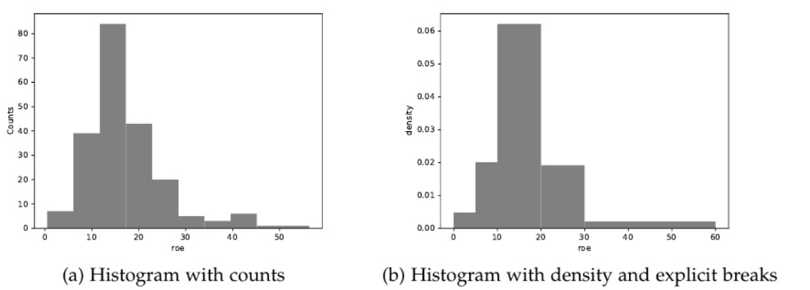

在给定数据的情况下，通常会产生有用的结果当然，这些参数(比如内核和带宽，对于那些知道那是什么的人来说可以手动设置。

脚本`1.25 (KDensity.py)`演示了如何用`matplotlib`绘制密度估计的结果,，并生成图1.12的图形。在子图(b)中，直方图与核密度图重叠。

```python
import wooldridge as woo
import statsmodels.api as sm
import matplotlib.pyplot as plt

ceosal1 = woo.dataWoo("ceosal1")
# extract roe:
roe = ceosal1["roe"]
# estimate kernel density:
kde = sm.nonparametric.KDEUnivariate(roe)
kde.fit()
# subfigure a (kernel density):
plt.plot(kde.support, kde.density, color="black", linewidth=2)
plt.ylabel("density")
plt.xlabel("roe")
# plt.savefig("PyGraphs/Density1.pdf")
plt.close()
# subfigure b (kernel density with overlayed histogram): 
plt.hist(roe, color="grey", density=True)
plt.plot(kde.support, kde.density, color="black", linewidth=2)
plt.ylabel("density")
plt.xlabel("roe")
# plt.savefig("PyGraphs/Density2.pdf")
```

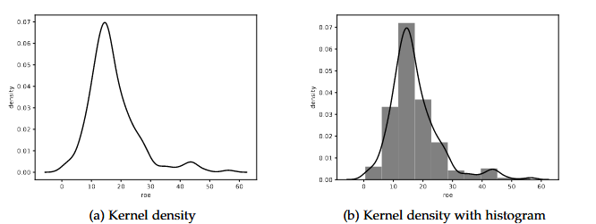

```python
[14] The module statsmodels will be introduced in Chapter 2.
```

#### （3）经验累积分布函数(ECDE)

`ECDF`是一个变量的所有值x与值小于或等于`x`的观测值的比例的图表。绘制`ROE`变量的`ECDF`的直接方法见脚本`1.26 (desr -ECDF.py)`和图1.13。更自动化的方法是使用`statmodels`函数`distribution.empirical distribution.ecdf(x)`，它会给出相同的结果。例如，对于点`roe=15.5`，`ECDF`的值为`0.5`。半数样本的`ROE`小于或等于`15.5%`。换句话说`ROE`中位数为`15.5%`。

```python
import wooldridge as woo
import numpy as np
import matplotlib.pyplot as plt
ceosal1 = woo.dataWoo("ceosal1")
# extract roe: 
roe = ceosal1["roe"]
# calculate ECDF: 
x = np.sort(roe)
n = x.size
y = np.arange(1, n + 1) / n
# generates cumulative shares of observations
# plot a step function: 
plt.step(x, y, linestyle="-", color="black")
plt.xlabel("roe")
# plt.savefig("PyGraphs/ecdf.pdf")
```

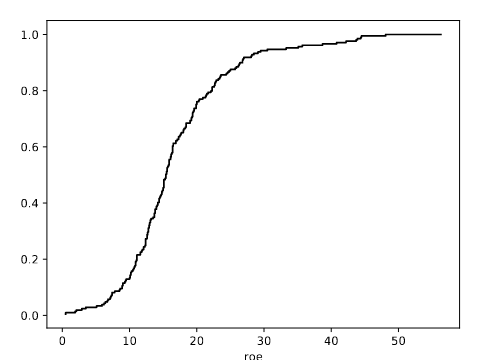

#### （4）基本统计信息

用`numpy`计算最重要的描述性统计的函数列在表`1.5`中。脚本`1.27 (Descr-Stats.py)`使用我们在第`1.5.2`节中已经介绍过的`CEOSAL1`数据集演示了这一点。

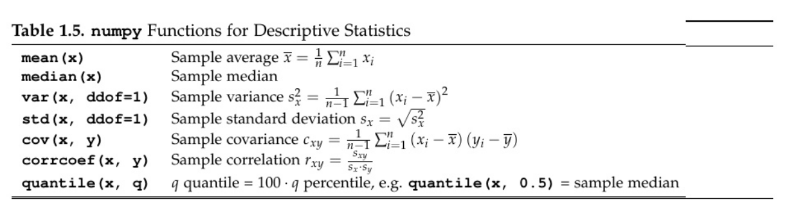

```python
import wooldridge as woo
import numpy as np

ceosal1 = woo.dataWoo("ceosal1")
# extract roe and salary: 
roe = ceosal1["roe"]
salary = ceosal1["salary"]
# sample average: 
roe_mean = np.mean(salary)
print(f"roe_mean: {roe_mean}")
# sample median: 
roe_med = np.median(salary)
print(f"roe_med: {roe_med}")
# standard deviation:
roe_s = np.std(salary, ddof=1)
print(f"roe_s: {roe_s}")
# correlation with ROE: 
roe_corr = np.corrcoef(roe, salary)
print(f"roe_corr: {roe_corr}")
```

盒子图以图形的方式显示了中位数(中间的线)、上下四分位数(方框)和极值点。图1.14展示了两个例子。50%的观测值在方框覆盖的区间内，`25%`在上方，`25%`在下方。极值点被“胡须”标记，异常值被打印为单独的点。在`matplotlib`中，使用`boxplot`命令生成箱线图。我们必须提供一个或多个数据数组，并可以像脚本1.28 (`Descr-Boxplot.py`)中演示的那样，通过大量选项灵活地改变设计。

```python
import wooldridge as woo
import matplotlib.pyplot as plt

ceosal1 = woo.dataWoo("ceosal1")
# extract roe and salary: 
roe = ceosal1["roe"]
consprod = ceosal1["consprod"]
# plotting descriptive statistics:
plt.boxplot(roe, vert=False)
plt.ylabel("roe")
# plt.savefig("PyGraphs/Boxplot1.pdf")
plt.close()
# plotting descriptive statistics: 
roe_cp0 = roe[consprod == 0]
roe_cp1 = roe[consprod == 1]
plt.boxplot([roe_cp0, roe_cp1])
plt.ylabel("roe")
# plt.savefig("PyGraphs/Boxplot2.pdf")
plt.show()
```

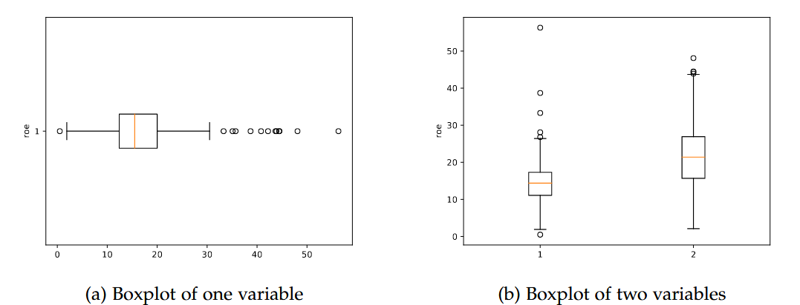

图1.14(a)展示了如何得到一个水平对齐的图形，图`1.14(6)`展示了如何为两个子组生成多个箱形图。来自数据集`ceosall`的变量`conprod`在企业处于消费品业务时等于1，否则等于0.显然，这个行业的ROE要高得多。

### 2.概率分布

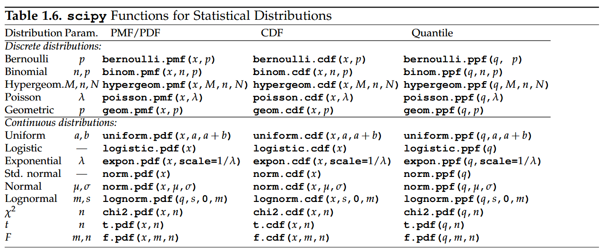

`Wooldridge(2019)`附录B介绍了随机变量及其概率分布的概念。`15scipy`模块有许多功能，方便地处理大量的统计分布。16对于连续分布，评估概率密度分布函数`(PDF)`；对于离散分布，评估概率群分布函数`(PMF)`：对于最相关的分布，评估累积分布函数`(CDF)`以及分位数函数(逆`CDF`)的命令如表1.6所示。这些函数在执行后可用

```python
import scipy.stats as stats
```

模块文档定义了发行版的参数集与 `scipy `中的函数参数之间的关系。现在，我们将简要讨论每种函数类型。

#### （1）离散分布

离散随机变量只能取有限(或“可数无限”)的值集合。`PMF f (x) = P(X = x)`给出了具有此分布的随机变量x取给定值x的概率。对于这些最重要的分布`(Bernoulli, Binomial, Hypergeometric17, Poisson, and Geometric18)`，表1.6列出了在给定各自分布参数的情况下返回任意值`x`的`PMF`的`scipy`函数。如果你对`pmt`的形式化定义感兴趣，请参阅模块文档。

对于一个具体的例子，让X表示我们从一个包含20%白球的瓮中绘制10个球时得到的白球数量。是二项分布

```python
[15] The stripped-down textbook for Europe and Africa Wooldridge (2014) does not include this appendix. But the material is pretty standard. 
[16] scipy is part of the Anaconda distribution and more information about the module is given in Virtanen, Gommers, Oliphant, Haberland, Reddy, Cournapeau, Burovski, Peterson, Weckesser, Bright, van der Walt, Brett, Wilson, Jarrod Millman, Mayorov, Nelson, Jones, Kern, Larson, Carey, Polat, Feng, Moore, Vand erPlas, Laxalde, Perktold, Cimrman, Henriksen, Quintero, Harris, Archibald, Ribeiro, Pedregosa, van Mulbregt, and Contributors (2020).
[17] The parameters of the distribution are defined as follows: M is the total number of balls in an urn, n is the total number of marked balls in this urn, k is the number of drawn balls and x is number of drawn marked balls. 
[18] x is the total number of trials, i.e. the number of failures in a sequence of Bernoulli trials before a success occurs plus the success trial.
```

参数 `n = 10, p = 20% = 0.2`. 我们知道精确得到` x ∈ {0, 1, . . . , 10} `这个分布的白球为19
$$
f (x) = P(X = x) = \left(\begin{matrix}n \\x \\\end{matrix}\right) · p^x · (1 − p)^{n−x} = \left(\begin{matrix}10 \\x \\\end{matrix}\right) · 0.2^x · 0.8^{10−x}
$$

例如，精确得到x=2个白球的概率为`0.302`。当然，我们可以让Python用我们在1.1节中知道的基本Pyhon命令来做这些计算。更方便的是，我们还可以使用binom函数。二项分布的pmf：

```python
import scipy.stats as stats
import math

# pedestrian approach:
c = math.factorial(10) / (math.factorial(2) * math.factorial(10 - 2))
p1 = c * (0.2 ** 2) * (0.8 ** 8)
print(f"p1: {p1}")

# scipy function: 
p2 = stats.binom.pmf(2, 10, 0.2)
print(f"p2: {p2}")
```

我们也可以将数组作为一个或多个参数提供给`stats.binom.pmf(x,n,p)`，并以数组的形式接收结果。脚本`1.30 (PMF-example.py)`在`x(0~10)`的所有可能值上计算我们示例的`PMF`。它显示了一个概率表，并创建了这些概率的条形图，如图`1.15(a)`所示。一如既往:鼓励你去尝试!

```python
import scipy.stats as stats
import numpy as np
import pandas as pd
import matplotlib.pyplot as plt

# values for x (all between 0 and 10):
x = np.linspace(0, 10, num=11)
# PMF for all these values: 
fx = stats.binom.pmf(x, 10, 0.2)
# collect values in DataFrame:
result = pd.DataFrame({"x": x, "fx": fx})
print(f"result: {result}")
# plot: 
plt.bar(x, fx, color="0.6")
plt.ylabel("x")
plt.ylabel("fx")
# plt.savefig("PyGraphs/PMF-example.pdf")
```

```python
[19] see Wooldridge (2019, Equation (B.14))
```

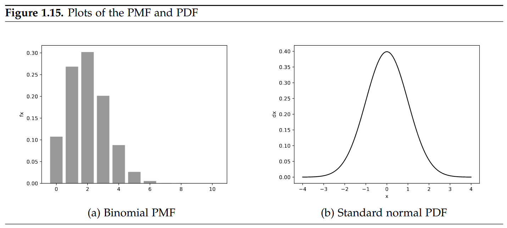

#### （2）连续分布

对于连续分布，如均匀，`logistic`，指数，正态，`1`，`x2`，或F分布，概率密度函数`F(x)`也可以在`scipy`中直接使用。例如，这些可以使用`plot`命令来绘制密度函数(见第1.4节)。图`1.15(6)`显示了著名的标准常态分配的钟形`PDF`，它是出`Script 1.31 (PDF-example.py)`创建的。

```python
import scipy.stats as stats
import numpy as np
import matplotlib.pyplot as plt

# support of normal density: 
x_range = np.linspace(-4, 4, num=100)
# PDF for all these values:
pdf = stats.norm.pdf(x_range)
plt.plot(x_range, pdf, linestyle="-", color="black")
plt.xlabel("x")
plt.ylabel("dx")
plt.show()
```

#### （3）累积分布函数(CDE)

对于所有分布，`CDF F(x) = P(X ≤ x)`表示随机变量x取值不超过x的概率。x介于两个值a和b之间的概率为`P(a < X ≤ b) = F(b) − F(a)`。我们可以直接使用表1.6第二列中的`scipy`函数来执行脚本`1.32(CDF-example.py)`中演示的这些计算。在上面的例子中，我们得到3个或更少的白球的概率是`F(3)`，使用适当的二项分布的`CDF`。合计为`87.9%`。标准正态随机变量取值在`-1.96~1.96`之间的概率为`25%`。

```python
import scipy.stats as stats
# binomial CDF: 
p1 = stats.binom.cdf(3, 10, 0.2)
print(f’p1: {p1}\n’) 
# normal CDF:
p2 = stats.norm.cdf(1.96) - stats.norm.cdf(-1.96) 
print(f’p2: {p2}\n’)
# p1: 0.8791261184000001 
# p2: 0.950004209703559
```

##### 例1：正态随机变量的概率

假设$X\sim N(4,9)$，第一个例子计算$P(2<X\leq 6)$，思路一是重写这个问题，使其按照Wooldridge(2019)所示的标准常态分配来表述：$P(2<X<6)=Ф(\frac{2}{3})-Ф(-\frac{2}{3})$，思路二可以省去变换直接处理非标准正态分布。要注意的是，关于正态分布的scipy命令中的第三个参数不是方差$\sigma^2=9$，而是标准差$\sigma=3$。

第二个例子计算$P(|X| > 2) = \underbrace{1 − P(X ≤ 2)}_{P(X>2)} + P(X < −2)$，注意我们没有进行四舍五入，因此得到了一个比《Wooldridge》(2019)更精确的结果。

```python
import scipy.stats as stats
# first example using the transformation: 
p1_1 = stats.norm.cdf(2 / 3) - stats.norm.cdf(-2 / 3) 
print(f’p1_1: {p1_1}\n’)

# first example working directly with the distribution of X: 
p1_2 = stats.norm.cdf(6, 4, 3) - stats.norm.cdf(2, 4, 3) 
print(f’p1_2: {p1_2}\n’)
# second example: 
p2 = 1 - stats.norm.cdf(2, 4, 3) + stats.norm.cdf(-2, 4, 3) 
print(f’p2: {p2}\n’)
```

`CDF`图是离散分布的阶跃函数。以urn为例，CDF如图1.16(a)所示。连续分布的CDF用正态分布的s形CDF表示，如图1.16(b)所示。

```python
import scipy.stats as stats 
import numpy as np 
import matplotlib.pyplot as plt 

# binomial: 
# support of binomial PMF:
x_binom = np.linspace(-1, 10, num=1000)
# PMF for all these values: 
cdf_binom = stats.binom.cdf(x_binom, 10, 0.2) 
# plot: 
plt.step(x_binom, cdf_binom, linestyle=’-’, color=’black’) 
plt.xlabel(’x’) 
plt.ylabel(’Fx’) 
plt.savefig(’PyGraphs/CDF-figure-discrete.pdf’) 
plt.close() 
# normal: 
# support of normal density:
x_norm = np.linspace(-4, 4, num=1000) 
# PDF for all these values:
cdf_norm = stats.norm.cdf(x_norm) 
# plot: 
plt.plot(x_norm, cdf_norm, linestyle=’-’, color=’black’)
plt.xlabel(’x’) 
plt.ylabel(’Fx’)
plt.savefig(’PyGraphs/CDF-figure-cont.pdf’)
```

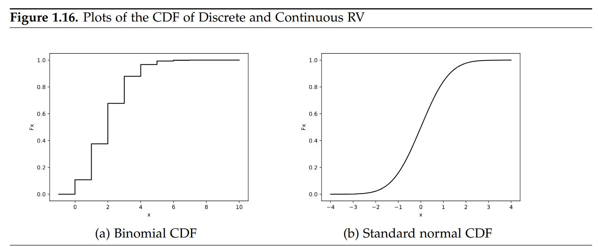

#### （4）分位数函数

一个随机变量的`q`-分位数`x[q]`是抽样一个值$x\leq x[q]$的概率，只是q的值。这些值是重要的，例如，用于计算测`test`统计的临界值。举个简单的例子：假设X是标准正态，那么`0.975-分位数`就是`X[0.9751]≈1.96`。因此采样值小于或等于`1.96`的概率为`97.5%`：

```python
import scipy.stats as stats 
q_975 = stats.norm.ppf(0.975) 
print(f’q_975: {q_975}\n’)
```

#### （5）从概率分布中生成随机数

从具有给定分布的随机变量中取一个样本来模拟随机结果是很容易的。严格地说，像计算机这样的确定性机器永远不能产生任何真正随机的结果，我们应该将生成的数字称为伪随机数。但就我们的目的而言，只要生成的样本看起来、感觉上和行为上都像真正的随机数就足够了，因此我们在这里的术语上有点草率。关于抽样和相关概念的回顾，请参见Wooldridge(2019，附录C.1)。

在我们在1.9节大量使用生成随机样本之前，我们在这里介绍一下机制。scipy中生成(伪)随机样本的命令是通过结合各自分布的命令(见表1.6)和函数名rvs来构造的。例如，我们可以模拟抛10次均匀硬币的结果。我们从参数$p = \frac{1}{2}$的伯努利分布中提取了一个大小为$n=10$的样本。生成的10个数字中的每一个都将取概率为$p = \frac{1}{2}$的值1和概率为$$p = 1-\frac{1}{2}$$的值0。结果的表现方式就像我们实际上抛了一枚硬币，并将正面转换为1，反面转换为0(或反之亦然)。下面是由它生成的代码和示例：

```python
import scipy.stats as stats 
sample = stats.bernoulli.rvs(0.5, size=10) 
print(f’sample: {sample}\n’)
```

翻译成硬币，我们的样本是正面-反面-反面-正面-反面-正面-正面-正面-反面-反面-正面。用Pyhon而不是用真正的硬币来做这件事的一个明显优势是，我们可以无痛地将样本量增加到1000或1000万。从标准常态分配中提取结果同样简单。

```python
import scipy.stats as stats
sample = stats.norm.rvs(size=10)
print(f’sample: {sample}\n’)
```

使用计算机生成的随机样本会给结果的可重复性带来问题。因为在每次运行上面的代码时都会得到不同的样本。可以通过使用随机数的实际生成方式来解决这个问题，正如前面提到的，这并不涉及真正的随机性。实际上，如果我们将随机数生成器重置为某些特定的状态(“seed”)，我们将总是得到相同的数字序列。在pyhon中，这可以通过numpy的函数random.seed(number)来实现，其中number是某个任意的整数，它定义了状态，但没有其他含义。如果我们将seed设置为某个任意整数，取一个样本，将种子重置为相同的状态并取另一个样本，两个样本将是相同的。同样的，如果我用那个种子画一个样本它将等于你画的样本如果我们都从同一个种子开始。

脚本1.38 (Random-Numbers.py)演示了random.seed的工作原理。

```python
import numpy as np
import scipy.stats as stats 

# sample from a standard normal RV with sample size n=5: 

sample1 = stats.norm.rvs(size=5)
print(f’sample1: {sample1}\n’) 

# a different sample from the same distribution: 
sample2 = stats.norm.rvs(size=5)
print(f’sample2: {sample2}\n’) 

# set the seed of the random number generator and take two samples: 
np.random.seed(6254137) 
sample3 = stats.norm.rvs(size=5) 
print(f’sample3: {sample3}\n’)
sample4 = stats.norm.rvs(size=5) 
print(f’sample4: {sample4}\n’) 

# reset the seed to the same value to get the same samples again: 
np.random.seed(6254137)
sample5 = stats.norm.rvs(size=5) 
print(f’sample5: {sample5}\n’) 
sample6 = stats.norm.rvs(size=5) 
print(f’sample6: {sample6}\n’)
```

### 3.置信区间与统计推断

Wooldridge(2019)对基本抽样、估计和测试进行了简要概述。我们将在下文触及其中一些问题。20

#### （1）置信区间

Wooldridge(2019，附录C.5)引入了置信区间(CI)。它们的构造是为了以给定的高概率覆盖感兴趣的真实总体参数，例如95%。更明确地说：对于所有样本的95%，隐含的CI包括总体参数。CI很容易计算。对于均值和方差σ2未知的正态总体，u的100(1-a)%置信区间由Wooldridge(2019，方程C.24和C.25)给出：
$$
\begin{bmatrix}\bar{y}-c_{\frac{\alpha}{2}}\cdot se(\bar{y}),\bar{y}+c_{\frac{\alpha}{2}}\cdot se(\bar{y})\end{bmatrix}
$$
其中，$\bar{y}$是样本均值，$se(\bar{y})=\frac{s}{\sqrt{n}}$是$\bar{y}$的标准误差（其中s是y的样本“标准差”），n是样本量，$c_{\frac{\alpha}{2}}$服从是$t_{n-1}$分布的$(1-\frac{\alpha}{2})$分位数，为了计算出$95\% CI(\alpha=5\%)$，我们需计算出0.975的分位数$c_{0.025}$，我们已经知道如何计算所有这些成分。计算CI的方法在例子c的解决方案中使用。在第1.9.3节中，我们将在一个模拟实验中计算置信区间，以帮助我们理解置信区间的含义。

```python
[20] The stripped-down textbook for Europe and Africa Wooldridge (2014) does not include the discussion of this material.
```

##### 例1：职业培训补助对工人生产率的影响

我们正在分析1988年获得职业培训补助的公司的废品率。1987年和1988年的报废率以Wooldridge格式打印(2019年，表C.3)，并在脚本1.39(Example-C-2.py)的开头手动输入。我们感兴趣的是年份之间的变化。其平均值和置信区间的计算是精确地执行如上所示。所得到的CI与Wooldridge(2019)中提出的CI相同，除了我们通过使用确切的数字来避免舍入误差。

```python
import numpy as np 
import scipy.stats as stats 

# manually enter raw data from Wooldridge, Table C.3: 
SR87 = np.array([10, 1, 6, .45, 1.25, 1.3, 1.06, 3, 8.18, 1.67, .98, 1, .45, 5.03, 8, 9, 18, .28, 7, 3.97]) 
SR88 = np.array([3, 1, 5, .5, 1.54, 1.5, .8, 2, .67, 1.17, .51, .5, .61, 6.7, 4, 7, 19, .2, 5, 3.83]) 

# calculate change: 
Change = SR88 - SR87 

# ingredients to CI formula: 
avgCh = np.mean(Change) 
print(f’avgCh: {avgCh}\n’) 
n = len(Change) 
sdCh = np.std(Change, ddof=1) 
se = sdCh / np.sqrt(n)
print(f’se: {se}\n’) 
c = stats.t.ppf(0.975, n - 1) 
print(f’c: {c}\n’) 

# confidence interval: 
lowerCI = avgCh - c * se 
print(f’lowerCI: {lowerCI}\n’) 
upperCI = avgCh + c * se 
print(f’upperCI: {upperCI}\n’)
```

##### 例2：招聘中的种族歧视

我们正在使用数据集审计来调査种族歧视问题。变量$y$代表了简历相同的黒人和白人中请人在招聘率上的差异。在计算了平均值、样本量、标准和样本平均值的标准误差之后，script1.40 (Example-c-3.py)将因子c的值计算为标准常态分配的97.5百分位数，即(非常接近)1.96。最后，报告了95%和99%的CI

```python
import wooldridge as woo
import numpy as np 
import scipy.stats as stats

audit = woo.dataWoo(’audit’)
y = audit[’y’] 
# ingredients to CI formula:
avgy = np.mean(y) 
n = len(y)
sdy = np.std(y, ddof=1)
se = sdy / np.sqrt(n)
c95 = stats.norm.ppf(0.975)
c99 = stats.norm.ppf(0.995) 

# 95% confidence interval: 
lowerCI95 = avgy - c95 * se 
print(f’lowerCI95: {lowerCI95}\n’)
upperCI95 = avgy + c95 * se 

print(f’upperCI95: {upperCI95}\n’) 

# 99% confidence interval:
lowerCI99 = avgy - c99 * se 
print(f’lowerCI99: {lowerCI99}\n’) 
upperCI99 = avgy + c99 * se 
print(f’upperCI99: {upperCI99}\n’)
```

```python
[21] Note that Wooldridge (2019) has a typo in the discussion of this example, therefore the numbers don’t quite match for the 95% CI.
```

#### （2）t测试

Wooldridge(2019年，附录C.6)中涵盖了假设检验。关于正态分布随机变量$\Upsilon$的均值$\mu$的假设检验的$t$统计量如式C.35所示。给定零假设$H_0:\mu=\mu_0$，
$$
t=\frac{\bar{y}-\mu_0}{se(\bar{y})}
$$
我们已经知道了如何计算第1.7.1节中的成分，并展示了如何在脚本1.42(Example-C-5.py)中使用它们来执行$t$​检验。我们还将该结果与scipy函数`ttest_1samp`的输出进行了比较，该函数执行了一个自动化的$t-test$​。

这个测试统计量的临界值取决于测试是单边的还是双边的。双面测试所需的值$c_{\frac{\alpha}{2}}$已经为$CI$计算过了，其他的值可以是相应的生成。不同自由度$n-1$和显著性水平a的值列于Wooldridge(2019,Table G2)。脚本1.41(critical-values -t.py)演示了我们如何为19自由度的例子计算我们自己的临界值表。

```python
mport numpy as np 
import pandas as pd 
import scipy.stats as stats

# degrees of freedom = n-1:
df = 19 
# significance levels: 
alpha_one_tailed = np.array([0.1, 0.05, 0.025, 0.01, 0.005, .001]) 
alpha_two_tailed = alpha_one_tailed * 2
# critical values & table:
CV = stats.t.ppf(1 - alpha_one_tailed, df) 
table = pd.DataFrame({’alpha_one_tailed’: alpha_one_tailed, ’alpha_two_tailed’: alpha_two_tailed, ’CV’: CV})
print(f’table: \n{table}\n’)
```

##### 例1：招聘中的种族歧视

我们继续脚本1.42中的示例C.3(Example-C-5.py)，并对相同样本的零假设$H_0:\mu=0$对$H_1:\mu<0$执行单侧$t$检验。如输出所示，$t$检验统计量等于-4.27。这比任何合理显著性水平的临界值的负值都要小得多。因此，对于这个单侧检验我们拒绝$H_0:\mu=0$，见Wooldridge(2019，方程C.38)。

```python
import wooldridge as woo
import numpy as np
import pandas as pd 
import scipy.stats as stats

audit = woo.dataWoo(’audit’) 
y = audit[’y’] 
# automated calculation of t statistic for H0 (mu=0):
test_auto = stats.ttest_1samp(y, popmean=0)
t_auto = test_auto.statistic  # access test statistic 
p_auto = test_auto.pvalue   # access two-sided p value
print(f’t_auto: {t_auto}\n’) 
print(f’p_auto/2: {p_auto / 2}\n’) 
# manual calculation of t statistic for H0 (mu=0): 
avgy = np.mean(y)
n = len(y) 
sdy = np.std(y, ddof=1) 
se = sdy / np.sqrt(n) 
t_manual = avgy / se 
print(f’t_manual: {t_manual}\n’) 

# critical values for t distribution with n-1=240 d.f.: 
alpha_one_tailed = np.array([0.1, 0.05, 0.025, 0.01, 0.005, .001])
CV = stats.t.ppf(1 - alpha_one_tailed, 240)
table = pd.DataFrame({’alpha_one_tailed’: alpha_one_tailed, ’CV’: CV}) 
print(f’table: \n{table}\n’)
```

#### （3）p值

测试的p值是(在导出测试统计量分布所需的假设下)一个不同的随机样本产生相同或更极端的测试统计量的概率22，使用p值进行统计检验的优点是使用方便。我们不必将检验统计量与显著性水平a所暗示的临界值进行比较，而是直接将p值与a值进行比较。对于双侧t检验，p值的公式由Wooldridge (2019,Equation C.42)给出：
$$
p=2\cdot P(T_{n-1}>|t|)=2\cdot (1-F_{t_{n-1}}(|t|))
$$
其中$F_{t_{n-1}}(\cdot)$为$t_{n-1}$分布的CDF，我们知道如何从表1.6中计算。

类似地，只有在估价值相对于零假设“过高”或“过低”的情况下，单方面检验才会拒绝零假设。这几类检验的p值为
$$
p=\begin{cases} 
P(T_{n-1}<t)=F_{t_{n-1}}(t),H_1:\mu<\mu_0\\ 
P(T_{n-1}>t)=1-F_{t_{n-1}}(t), H_1:\mu>\mu_0 
\end{cases} 
$$
由于我们正在处理一个知道分布的CDF的计算机程序，因此计算p值很简单，如脚本1.43(Example-C-6.py)所示。也许您注意到Script 1.42(Example-C-5.py)中的scipy函数`ttest_1samp`也可以计算p值，但请注意，该函数始终基于双侧$t$检验。

```python
[22] The p value is often misinterpreted. It is for example not the probability that the null hypothesis is true. For a discussion, see for example https://www.nature.com/news/scientific-method-statistical-errors-1.14700.
```

##### 例1：职业培训补助金对工人生产率的影响

我们继续从脚本1.43 (Example-c-6py)中的示例c.2开始。我们对$H_1:\mu<0$进行$H_0:\mu=0$的检验。$t$统计量为$-2.15$，该单侧检验的p值公式见Toaldidee (2019,Eguaion c.41)。从scnipt 1.43 Example-c-6,py)的输出中可以看到，它的值(使用t的糟确值)大约是0.022。如果你想使用scipy函数`ttest_1samp`，你必须将p值除以2，因为我们处理的是一个单边测试。

```python
import numpy as np
import scipy.stats as stats 

# manually enter raw data from Wooldridge, Table C.3: 
SR87 = np.array([10, 1, 6, .45, 1.25, 1.3, 1.06, 3, 8.18, 1.67, .98, 1, .45, 5.03, 8, 9, 18, .28, 7, 3.97])
SR88 = np.array([3, 1, 5, .5, 1.54, 1.5, .8, 2, .67, 1.17, .51, .5, .61, 6.7, 4, 7, 19, .2, 5, 3.83])
Change = SR88 - SR87 

# automated calculation of t statistic for H0 (mu=0):
test_auto = stats.ttest_1samp(Change, popmean=0) 
t_auto = test_auto.statistic
p_auto = test_auto.pvalue 
print(f’t_auto: {t_auto}\n’) 
print(f’p_auto/2: {p_auto / 2}\n’)

# manual calculation of t statistic for H0 (mu=0):
avgCh = np.mean(Change) 
n = len(Change) 
sdCh = np.std(Change, ddof=1)
se = sdCh / np.sqrt(n) 
t_manual = avgCh / se 
print(f’t_manual: {t_manual}\n’) 

# manual calculation of p value for H0 (mu=0):
p_manual = stats.t.cdf(t_manual, n - 1)
print(f’p_manual: {p_manual}\n’)
```

##### 例2：招聘中的种族歧视

在示例C.5中，我们发现$H_0:\mu=0$对$H_1:\mu<0$的统计量为$t=-4.276816$。对应的$p$值在脚本1.44(Example-C-7.py)中计算得到。数字$1.369271e-05$是$1.369271·10^{-5}$=$.00001369271$的科学表示法。因此$p$值在$0.0014%$左右，比任何合理的显著性水平都要小得多，通过构造，我们得出了与示例C.5中统计量与临界值比较时相同的结论。我们拒绝零假设，即不存在差别。

```python
import wooldridge as woo
import numpy as np
import pandas as pd
import scipy.stats as stats

audit = woo.dataWoo(’audit’)
y = audit[’y’] 

# automated calculation of t statistic for H0 (mu=0):
test_auto = stats.ttest_1samp(y, popmean=0)
t_auto = test_auto.statistic 
p_auto = test_auto.pvalue
print(f’t_auto: {t_auto}\n’)
print(f’p_auto/2: {p_auto/2}\n’)

# manual calculation of t statistic for H0 (mu=0):
avgy = np.mean(y) 
n = len(y) 
sdy = np.std(y, ddof=1)
se = sdy / np.sqrt(n) 
t_manual = avgy / se
print(f’t_manual: {t_manual}\n’) 

# manual calculation of p value for H0 (mu=0): 
p_manual = stats.t.cdf(t_manual, n - 1) 
print(f’p_manual: {p_manual}\n’)
```

### 4.蒙特卡罗模拟(Monte Carlo Simulation)

Wooldridge(2019)的附录C.2包含了对估计器及其性质的简要介绍。23在现实世界的应用中，我们通常有一个数据集，对应于一个定义良好的总体中的一个随机样本。我们不知道总体参数，并使用样本来估计它们。
当我们像在第1.6.4节中介绍的那样，使用计算机程序生成样本时，我们知道总体参数，因为我们在进行随机抽取时必须选择它们。我们可以对这个人工样本应用相同的估计量来估计总体参数。

任务将是:

- 选择一个总体分布及其参数。
- 从这个分布中生成一个样本。
- 利用样本来估计总体参数。

如果你觉得这听起来有点疯狂：别担心，这将是一个健康的第一反应。我们得到的是我们精确知道的东西的嘈杂估计。但这种分析实际上是有意义的。因为我们估计的是我们实际知道的东西，所以我们能够很好地研究我们的估计器的行为。在这本书中，我们主要出于说明性和说教性的原因使用这种方法。在最先进的研究中，它被广泛使用，因为它通常提供了了解估计器和统计测试的重要特征的唯一方法。这类分析通常被称为蒙特卡罗模拟，指的是生成随机样本的“赌博”。

#### （1）估计量的有限样本性质

让我们看一个简单的例子，模拟一个我们想要估计正态分布随机变量的均值$\mu$的情况
$$
\gamma \sim Normal(\mu,\sigma^2)
$$
使用给定大小的样本。总体均值的明显估计量是样本平均值,但是这个估计量有什么特性呢?知情的读者立即知道的抽样分布是
$$
\bar{\gamma} \sim Normal(\mu,\frac{\sigma^2}{2})
$$

```python
[23] The stripped-down textbook for Europe and Africa Wooldridge (2014) does not include this either.
```

脚本1.51(simulation-estimate .py)展示了一个实际的模拟实验:我们设置种子以确保再现性，并从种群分布中提取一个大小为n=100的样本(种群参数$\mu=10$和$\sigma=2$)。24 然后，我们计算样本平均值作为u的估计值。我们看到了三个不同样本的结果。

```python
import numpy as np import scipy.stats as stats # set the random seed: np.random.seed(123456) # set sample size: n = 100 # draw a sample given the population parameters: sample1 = stats.norm.rvs(10, 2, size=n) # estimate the population mean with the sample average: estimate1 = np.mean(sample1) print(f’estimate1: {estimate1}\n’) # draw a different sample and estimate again: sample2 = stats.norm.rvs(10, 2, size=n) estimate2 = np.mean(sample2) print(f’estimate2: {estimate2}\n’) # draw a third sample and estimate again: sample3 = stats.norm.rvs(10, 2, size=n) estimate3 = np.mean(sample3) print(f’estimate3: {estimate3}\n’)
```

所有样本均值$\bar{\gamma}$都在真实均值$\mu=10$附近，这与我们在式1.7中制定的假设一致。我们无法得到准确的总体参数也就不足为奇了--这就是采样噪声的性质。根据公式1.7，结果的方差预计为$\frac{\sigma^2}{2}=0.04$，这类三个样本不足以对式1.7的效度得出强有力的结论。好的蒙特卡罗模拟研究应该使用尽可能多的样本。

在1.8.2节中，我们介绍了`for`循环。虽然它们不是Pvhon中实现蒙特卡罗研究的最强大的技术，但我们将坚持使用它们，因为它们非常透明和直接。脚本1.52(simulation-repeat.py)中显示的代码使用for循环绘制大小为$n=10000$的样本，并计算所有样本的平均值。设置完随机种子后，使用`np.empty`初始化大小为`10000`的空数组$ybar$，我们将在循环中用估计值一个接一个地替换这些空数组值。在每一个这样的复制中j= 0,1,2,...,9999，抽取一个样本，计算其平均值并存储在ybar的i号位置。这样，我们最终得到了一个来自不同样本的10000个估计值的列表。脚本simulation-repeat .py不生成任何输出。

```python
import numpy as np
import scipy.stats as stats

# set the random seed: 
np.random.seed(123456) 
# set sample size:
n = 100 
# initialize ybar to an array of length r=10000 to later store results:
r = 10000
ybar = np.empty(r) 

# repeat r times: 
for j in range(r): 
    # draw a sample and store the sample mean in pos. j=0,1,... of ybar: 
    sample = stats.norm.rvs(10, 2, size=n) 
    ybar[j] = np.mean(sample)
```

脚本1.53 (simulation-repeat -results .py)分析了这10000个估计。在这里，我们只讨论输出，但你可以在附录中找到完整的代码。ybar的平均值非常接近方程1.7中的推定$\mu=10$。模拟的抽样方差也与理论结果$\frac{\sigma^2}{n}=0.04$非常接近。

注意，在np.var()中用dof=1对自由度进行了调整，以计算方差的无偏估计。最后将估计的密度(使用来自模块statmodels的核密度估计)与理论正态分布进行比较。结果如图1.17所示。除了模态附近的区域(已知核密度估计器存在问题的区域)，这两条线几乎无法区分。

综上所述，模拟结果证实了式1.7中的理论结果。均值、方差和密度非常接近，似乎剩下的微小差异很可能是由于我们“只”使用了10000个样本。
记住：对于大多数高级估计器来说，这样的模拟是研究它们的一些特征的唯一方法，因为不可能推导出感兴趣的理论结果。对我们来说，这个简单的例子希望能够阐明蒙特卡罗模拟的方法和抽样分布的含义，并为我们进行其他有趣的模拟练习做好准备。

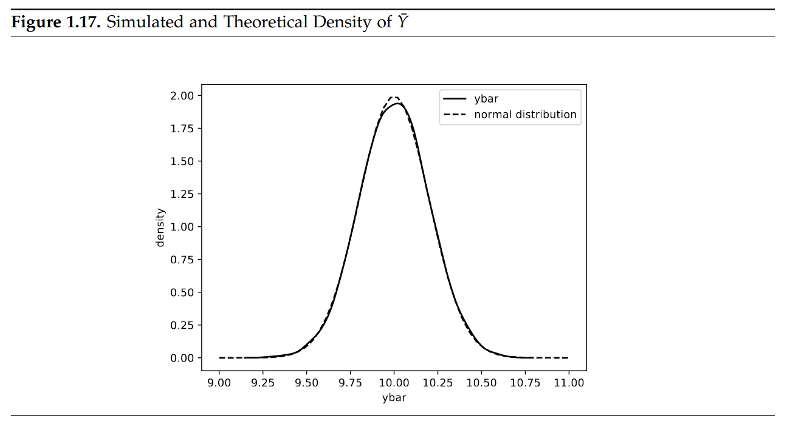

```python
[24] See Section 1.6.4 for the basics of random number generation.
```

#### （2）估计量的渐近性质

渐近分析与大样本有关，并与估计量和其他统计量的行为有关，因为样本大小n无限制地增加。关于这些主题的讨论，参见Wooldridge(2019，附录C.3)。根据大数定律，上述例子中的样本平均$\bar{\gamma}$随着 $(n\rightarrow∞)$以概率收敛于总体平均$\mu$。在(无限)大样本中，这意味着$E(\bar{\gamma} \rightarrow \mu),Var(\bar{\gamma})\rightarrow0$

有了蒙特卡罗模拟，我们就有了一个工具，可以在我们的示例中看到这是如何实现的。我们只需要将脚本1.52(simulation-repeat.py)中的代码行n=100中的样本大小更改为不同的数字并重新运行模拟代码。图1.18中显示了n=10、50、100和1000的结果。显然，$\bar{\gamma}$的方差实际上确实在减小。n=1000的密度图已经非常狭窄和高，表明方差很小。当然，我们实际上不可能在不使计算机崩溃的情况下将n增加到无穷，但似乎有可能的是，当n→∞时，密度最终会坍塌为一条垂直的线，对应$Var(\bar{\gamma})\rightarrow0$​。

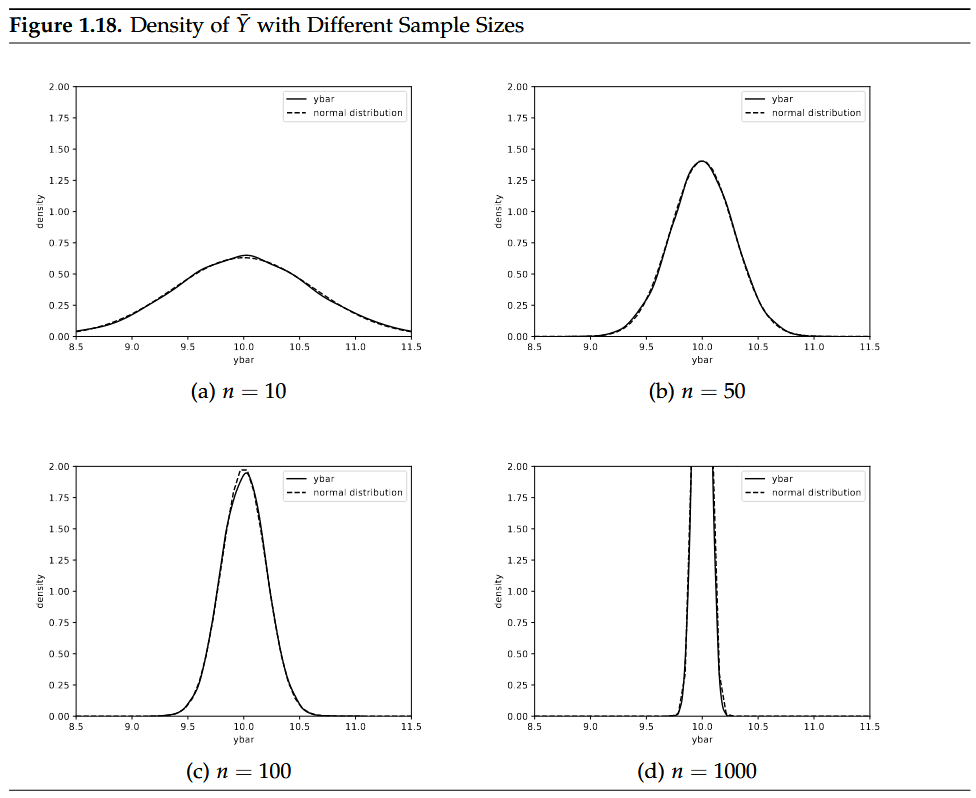

在我们的模拟例子中，随机变量$\bar{\gamma}$是正态分布的，因此无论样本大小如何，样本平均$\bar{\gamma}$也是正态的。这一点也可以在图1.18中得到证实，图中各自的正态密度以虚线的形式添加到图中。中心极限定理(central limit theorem,CLT)认为，当$n\rightarrow ∞$时，随机样本的样本均值$\bar{\gamma}$最终总是正态分布，无论$\bar{\gamma}$的分布是什么(除非它非常奇怪，方差无穷大)，这就是所谓的分布收敛。

```python
[25] A motivated reader will already have figured out that this graph was generated by chi2.pdf(x, df) from the scipy module.
```

让我们用一个非常非正态的分布，即一个自由度的$\chi^2$​分布来检验这一点。它的密度如图1.19.25所示，它看起来与我们熟悉的钟形正态密度非常不同。我们必须在Script 1.52(simulation-repeat .py)中的模拟代码中将语句`sample=stats.norm.rvs(10,2,size=n)`更改为`sample =stats.chi2.rvs(1,size=n)`根据表1.6。

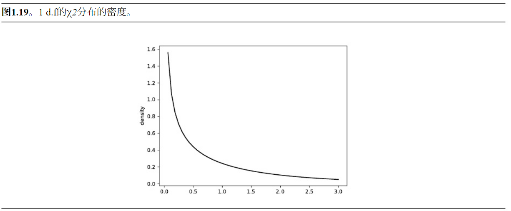

图1.20给出了不同样本量下的模拟密度，并与具有相同均值$\mu=1$、标准差$\frac{s}{\sqrt{n}}=\sqrt{\frac{2}{n}}$的正态分布进行了比较。注意，为了更好地呈现密度的形状，子图之间的轴的只度现在有所不同。方差递减的影响在这里的工作方式与正常总体的工作方式完全相同。毫不奇怪，在n=2这样的小样本中，Y的分布与正态分布有很大的不同。随着样本量的增加，CLI发挥了它的魔力，分布越来越接近正常的钟形。对于n=10000、密度几乎没有任何差异，所以很容易想象它们最终将与$n\rightarrow ∞$相同。

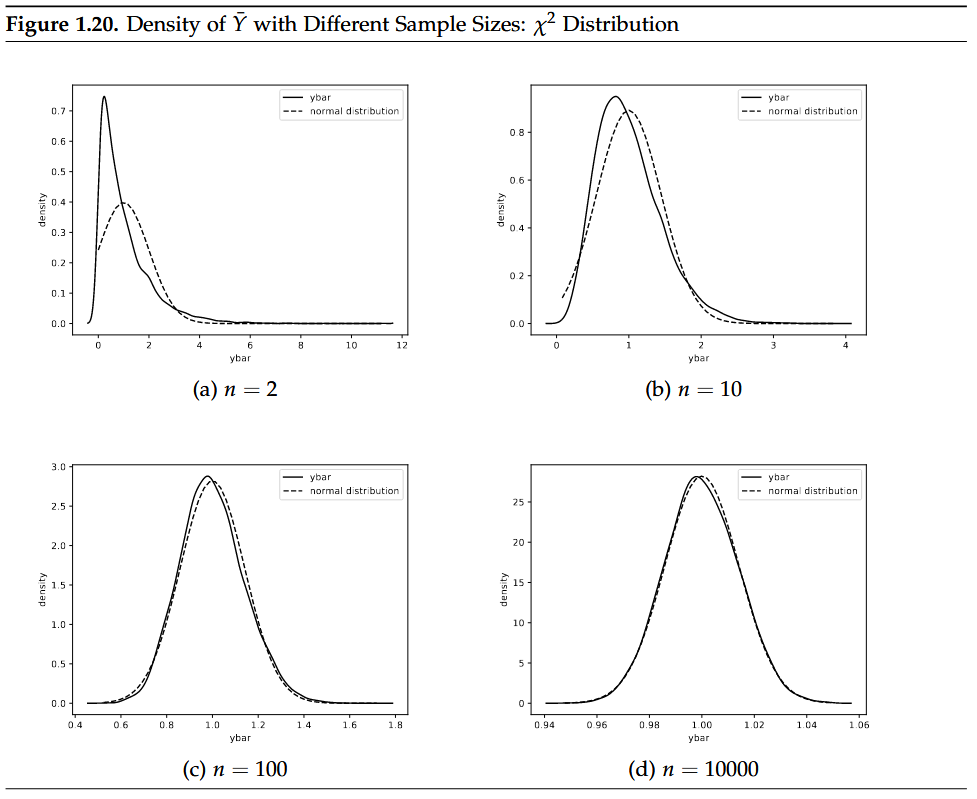

#### （3）置信区间和t检验的模拟

除了反复估计总体参数外，我们还可以计算置信区间，并对模拟样本进行检验。在这里，我们提出了一个有点高级的模拟路径。

阅读这些材料的回报是，它可能会大大提高我们对统计推断工作的理解。我们从第1.9.1节中相同的例子开始：在总体$Y\sim Normal(10,4)$中，我们从这个总体中抽取了$10000$个大小为n=100的样本。对于每一个样本我们计算如下内容：

- 95% 置信区间并存储`CIlower`和`CIupper`的`limit`
- 正确的零假设$H_0:\mu=10$的双侧检验$p$值——数组`pvalue1`
- 错误的零假设$H_0:\mu=9.5$的双侧检验p值——数组`pvalue2`

最后，我们用逻辑项计算数组`reject1`和`reject2`，如果我们在$\alpha=5\%$时拒绝各自的零假设，即如果`pvalue1`或`pvalue2`分别小于`0.05`。脚本`1.55 (Simulation-Inference.py)`显示了这些模拟的Python代码和结果`reject1`和`reject2`的频率表。

如果理论和Pyhon中的实现是准确的，拒绝一个正确的零假设(即犯第I类错误)的概率应该等于所选择的显著性水平$\alpha$。在我们的模拟中，我们在10 000个样本中的504个中拒绝了正确的假设，这相当于`5.04%`。

拒绝错误假设的概率被称为检验的威力。它取决于很多东西，比如样本量和$H_0$的误差“有多严重”，即$\mu_0$与真实$\mu$的距离有多远。理论只是告诉我们，威力比$\alpha$大。在我们的模拟中，错误的零假设$H_0:\mu=9.5$在$69.9%$的样本中被拒绝。强烈建议读者修改仿真代码，以验证当$\mu_0$远离$10$和样本大小$n$增加时，这种功率就会增加的理论结果。

图1.21以图形的方式展示了前100个模拟样本的$95\%CI$，每条水平线代表一个$CI$。在这前100个样本中，正确的零假设在4个案例中被拒绝[26]。这一事实意味着，对于这4个样本，$CI$没有覆盖$\mu_0=10$，参见Wooldridge(2019，附录C6)关于$CI$与测试之间的关系。这四种情况在图的左边用黑色标出，而其他的则是灰色。$t$检验在前100个样本中有72个拒绝了错误的零假设，$H_0:\mu=9.5$，在图1.21的右侧以黑色绘制。

```python
import numpy as np
import scipy.stats as stats

# set the random seed: 
np.random.seed(123456) 
# set sample size and MC simulations:
r = 10000 
n = 100 

# initialize arrays to later store results: 
CIlower = np.empty(r) 
CIupper = np.empty(r) 
pvalue1 = np.empty(r)
pvalue2 = np.empty(r) 

# repeat r times: 
for j in range(r): 
    # draw a sample: 
    sample = stats.norm.rvs(10, 2, size=n)
    sample_mean = np.mean(sample) 
    sample_sd = np.std(sample, ddof=1) 
    # test the (correct) null hypothesis mu=10: 
    testres1 = stats.ttest_1samp(sample, popmean=10)
    pvalue1[j] = testres1.pvalue
    cv = stats.t.ppf(0.975, df=n - 1)
    CIlower[j] = sample_mean - cv * sample_sd / np.sqrt(n)
    CIupper[j] = sample_mean + cv * sample_sd / np.sqrt(n) 
    
    # test the (incorrect) null hypothesis mu=9.5 & store the p value: 
    testres2 = stats.ttest_1samp(sample, popmean=9.5) 
    pvalue2[j] = testres2.pvalue 
    
# test results as logical value:
reject1 = pvalue1 <= 0.05 
count1_true = np.count_nonzero(reject1)  # counts true 
count1_false = r - count1_true 
print(f’count1_true: {count1_true}\n’) 
print(f’count1_false: {count1_false}\n’) 

reject2 = pvalue2 <= 0.05 
count2_true = np.count_nonzero(reject2)
count2_false = r - count2_true 
print(f’count2_true: {count2_true}\n’) 
print(f’count2_false: {count2_false}\n’)
```

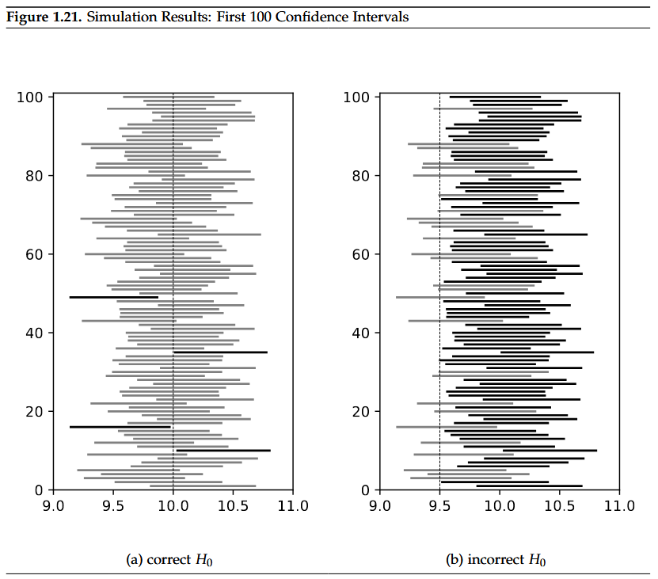

```python
[26] For the sake of completeness, the code for generating these graphs is shown in Appendix IV, Script 1.54 (Simulation-Inference-Figure.py), but most readers will probably not find it important to look at it at this point.
```

## 三、本项目参考资料：

[1] Using Python for Introductory Econometrics© Florian Heiss, Daniel Brunner 2020. All rights reserved

书籍地址：http://www.upfie.net/downloads/PDF/UPfIE_web.pdf

代码数据下载：http://www.upfie.net/code.html

[2] 应用计量经济学讲稿效傲江湖:效应评估的独孤九剑.许文立，2022

[3] 高级计量经济学及Stata应用/陈强编著.北京：高等教育出版社，2014.4

[4] Python数据分析基础（第2版）/阮敬编著.北京：中国统计出版社，2018.9
