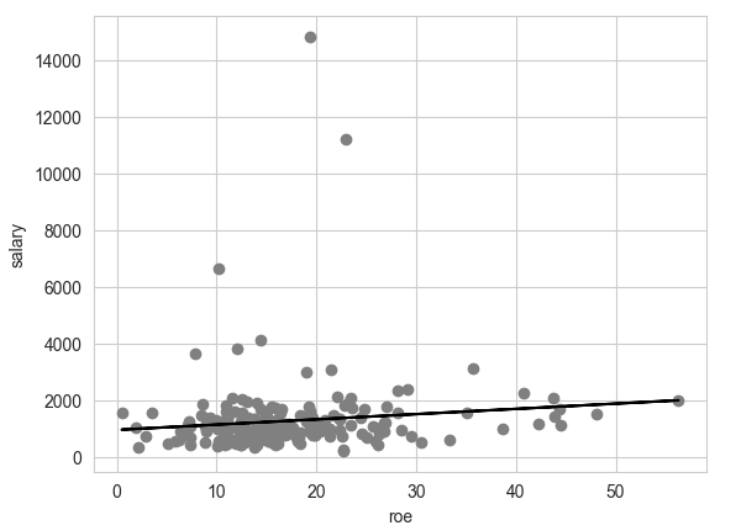
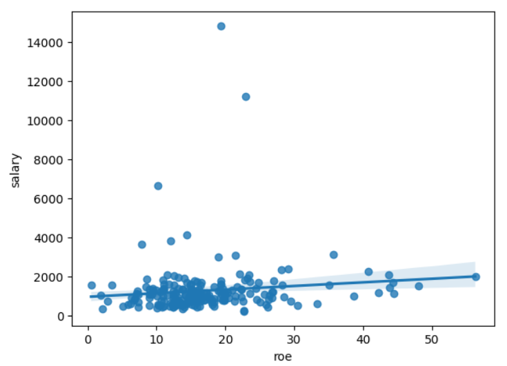
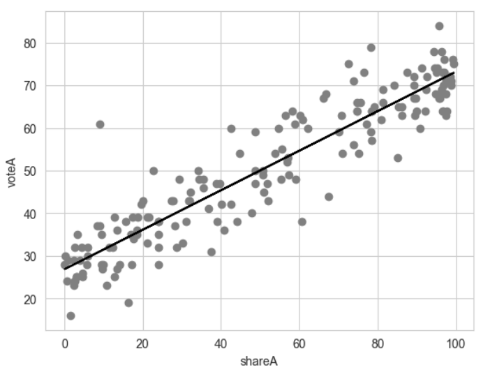
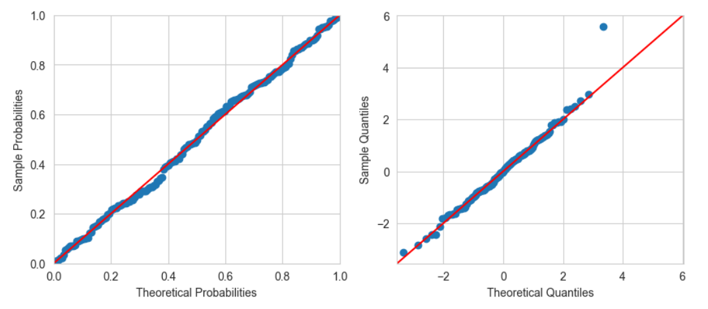
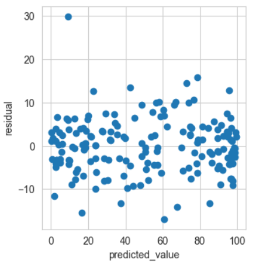
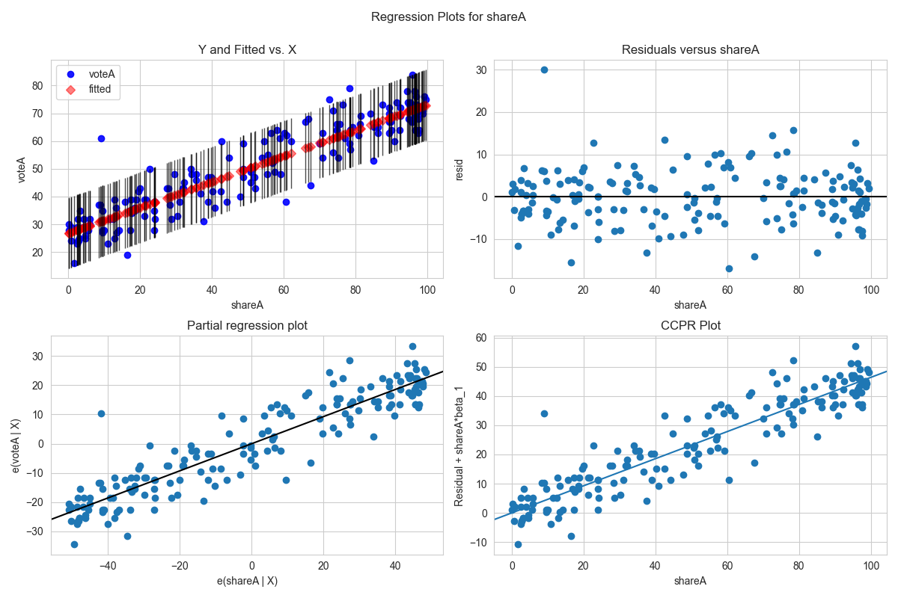
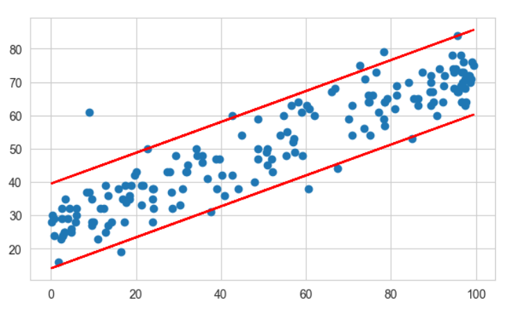
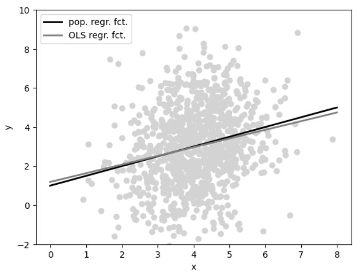
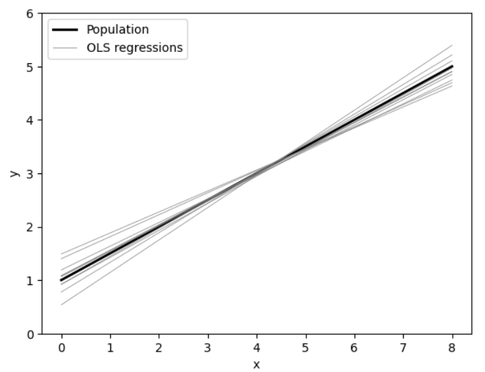

# 02.一元线性回归

## 一、最小二乘法原理

### 1.问题描述

假设样本是随机样本，即总体中的每个样本有相同的概率被抽中，且被抽中的概率相互独立（独立同分布）。若从总体中随机抽取出$n$个体，则一元回归模型可写为：
$$
y_i=\alpha+\beta x_i +\epsilon_i(i=1,...,n)
$$
其中$y_i$为被解释变量，$x_i$为解释变量，$\alpha$为截距项，$\beta$为斜率，$\alpha$与$\beta$统称为回归系数（参数），$\epsilon_i$为扰动项（误差项），其中包括遗漏的其他因素、变量测度的误差，回归函数设定误差（如非线性项、人类行为内在随机性），$n$为样本容量。

$\alpha+\beta x$又称为回归方程或总体回归线，模型$y_i=\alpha+\beta x_i +\epsilon_i$可被称为数据生成过程，其假设总体回归函数为线性。随机变量$x_i$与$\epsilon_i$首先从相应的概率分布中抽出观测值，再根据模型生成$y_i$，计量经济学的主要内容就是通过数据$\{x_i,y_i\}^n_{i=1}$来推测总体参数$(\alpha,\beta)$的信息。

### 2.最小二乘法

希望找到一条直线，使得该直线距离所有点$(x_i,y_i)$最近，可以计算每个点到此直线$y_i=\widehat{\alpha}+\widehat{\beta}x_i$的距离$\epsilon_i\equiv{y_i-\widehat{\alpha}-\widehat{\beta}x_i}$（一般将其称为残差），希望该距离最小，但是如果单纯求$\sum^n_{i=1}{\epsilon_i}$会导致正负项相互抵消且取绝对值又无法进行微积分，因此考虑求其平方$\sum^n_{i=1}{\epsilon_i^2}=\sum^n_{i=1}{(y_i-\widehat{\alpha}-\widehat{\beta}x_i)^2}$，成为残差平方和RSS（SSR）。

所谓最小二乘指的就是平方最小，即选择最优的估计值$\widehat{\alpha}$，$\widehat{\beta}$​使得残差平方和取最小值，该问题属于无约束的最优化问题，一般可以通过求其极值解决。

对于最小化问题：
$$
\min_{\widehat{\alpha},\widehat{\beta}}{\sum_{i=1}^n{\epsilon_i^2}}=\sum^n_{i=1}{(y_i-\widehat{\alpha}-\widehat{\beta}x_i)^2} \tag{公式1}
$$


分别对$\widehat{\alpha}$，$\widehat{\beta}$求一阶偏导数可知：

$$
\begin{cases} \frac{\partial}{\partial{\widehat{\alpha}}}{\sum_{i=1}^n{\epsilon_i^2}}=-2\sum_{i=1}^n{(y_i-\widehat{\alpha}-\widehat{\beta}x_i)}=0 \\ \frac{\partial}{\partial{\widehat{\beta}}}{\sum_{i=1}^n{\epsilon_i^2}}=-2\sum_{i=1}^n{(y_i-\widehat{\alpha}-\widehat{\beta}x_i)x_i}=0 \end{cases} \tag{公式2}
$$


消去方程两边的$-2$得：

$$
\begin{cases} \sum_{i=1}^n{(y_i-\widehat{\alpha}-\widehat{\beta}x_i)}=0 \\ \sum_{i=1}^n{(y_i-\widehat{\alpha}-\widehat{\beta}x_i)x_i}=0 \end{cases}\tag{公式3} 
$$


化简消元得到一个关于$\widehat{\alpha}$，$\widehat{\beta}$的二元一次线性方程组，将$\sum_{i=1}^n{x_i}=n\overline{x}$，$\overline{x}=\frac{1}{n}\sum_{i=1}^n{x_i}$，$\overline{y}=\frac{1}{n}\sum_{i=1}^n{y_i}$带入：

$$
\begin{cases} \widehat{\alpha}+\widehat{\beta}\frac{1}{n}\sum^n_{i=1}x_i= \frac{1}{n}\sum^n_{i=1}y_i=\widehat{\alpha}+\widehat{\beta}\overline{x}= \overline{y}\\ \widehat{\alpha}\sum^n_{i=1}x_i+\widehat{\beta} \sum^n_{i=1}x_i^2= n\widehat{\alpha}\overline{x}+\widehat{\beta} \sum^n_{i=1}x_i^2 =\sum^n_{i=1}x_iy_i\end{cases}\tag{公式4}
$$
上式又称为正规方程组，将$\widehat{\alpha}$消去得：

$$
n(\overline{y}-\widehat{\beta}\overline{x})\overline{x}+\widehat{\beta}\sum^n_{i=1}{x_i^2}=\widehat{\beta}(\sum^n_{i=1}x_i^2-n\overline{x}^2)+n\overline{x}\overline{y}=\sum^n_{i=1}x_iy_i \tag{公式5}
$$
解得：
$$
\widehat{\beta}=\frac{\sum^n_{i=1}{x_iy_i}-n\overline{x}\overline{y}}{\sum^n_{i=1}x_i^2-n\overline{x}^2}=\frac{\sum_{i=1}^n(x_i-\overline{x})(y_i-\overline{y})}{\sum_{i=1}^n{(x_i-\overline{x})^2}}=\frac{COV(x,y)}{Var(x)}\\
\widehat{\alpha} = \overline{y}-\widehat{\beta}\cdot \overline{x}
$$
其中方差$\sum_{i=1}^n{(x_i-\overline{x})^2}\neq 0$（方差本来就大于等于零）意味着解释变量$x_i$应有所变动，根据后式子我们知道，只需要计算$\overline{x}$、$\overline{y}$、$COV(x,y)$和$Var(x)$即可计算出$\widehat{\alpha}$和$\widehat{\beta}$，从而得到样本回归函数$\widehat{y}=\widehat{\alpha}+\widehat{\beta}x_i$。

由公式3知$\widehat{\alpha}+\widehat{\beta}\overline{x}= \overline{y}$恒成立，因此样本回归函数经过定点$(\overline{x},\overline{y})$​​。 
### 3.假设与性质

#### （1）基本假设

根据问题描述，为了确保一元线性回归对参数的估计的有效性、无偏性等，理想属的`OLS `参数估计应满足如下五个假设：

- SLR1：总体函数呈线性：$y=\alpha +\beta x+\mu$（模型相对于参数是线性的）
- SLR2：$x$与$y$是从总体中随机抽取的（回归分析使用的样本数据应该是总体数据的随机样本）
- SLR3：样本方差不为0，由于方差本身大于0，$\sum_{i=1}^n{(x_i-\overline{x})^2}> 0$，（$x$必须是变化的，不应是常量。）
- SLR4：零条件均值：$E(\mu|x)=0$（在给定解释变量$x$值的条件下，$E(\mu)=0$，没有遗漏的与因变量和自变量都相关的变量，这可能会导致估计偏差）
- SLR5：同方差：$Var(\mu|x)=\sigma^2$（在不同的解释变量$x$下误差项方差$\sigma^2$应相等，异方差可能会导致估计效率不高和无效的推断）

若前四个假设成立，`OLS`参数估计将是无偏的，若五个假设都成立，`OLS` 参数估计器具有特定的采样方差。

由于抽样方差的公式涉及误差项的方差，我们还必须使用无偏估计来估计误差项$\epsilon_i$的方差$\hat{\sigma}$：
$$
\hat{\sigma}^2=\frac{\sum^n_{i=1}{\hat{\epsilon_i}^2}}{n-2}=\frac{n-1}{n-2}\cdot{Var(\hat{\epsilon_i})}
$$
通常情况下，样本方差的估计值应该是$Var(\hat{\epsilon_i})=\frac{1}{n-1}\cdot{\sum_{i=1}^n{\hat{\epsilon_i}^2}}$，但是由于我们估计了两个参数$\hat{\alpha}$和$\hat{\beta}$，因此我们应该使用调整的自由度来解释残差，其平方根$\hat{\sigma}=\sqrt{\hat{\sigma}^2}$被称为回归标准误差（`SER`）。

估计量的标准误差为：
$$
se(\hat{\alpha})=\sqrt{\frac{\hat{\sigma}^2\bar{x^2}}{\sum_{i=1}^n{(x-\bar{x})^2}}}=\frac{1}{\sqrt{n-1}}\cdot{\frac{\sigma}{sd(x)}\cdot{\sqrt{\bar{x^2}}}}\\
se(\hat{\beta})=\sqrt{\frac{\hat{\sigma}^2}{\sum_{i=1}^n{(x-\bar{x})^2}}}=\frac{1}{\sqrt{n-1}}\cdot{\frac{\sigma}{sd(x)}}\tag{公式6}
$$
 $sd(x)$代表样本标准差，$sd(x) = \sqrt{\frac{1}{n-1}\cdot{\sum_{i=1}^n(x_i-\bar{x})^2}}$。

#### （2）性质

> 回归线通过样本均值
>
> 平均残差为零；
>
> 残差向量$\epsilon$与解释变量$x$及拟合值$y$均正交（不相关）；
>
> 实际观察值均值恰好等于拟合值的均值。

定义被解释变量$y_i$的“拟合值”或称“预测值”（fitted value）为$\widehat{y_i}=\widehat{\alpha}+\widehat{\beta}x_i$

则残差$\epsilon_i=y-(\widehat{\alpha}+\widehat{\beta}x_i)=y-\widehat{y_i}$

由公式2知：

$$
\begin{cases}\sum^n_{i=1}{\epsilon_i}=\bar{\epsilon_i}=0 \\
\sum^n_{i=1}{x_i\epsilon_i}=Cov(x_i,\epsilon_i)=0 \end{cases}\tag{公式7}
$$
定义列向量，常数向量：$\vec{I}=(1,...,1)_{n \times 1 }$；残差向量：$\vec{e}=(\epsilon_1,...,\epsilon_n)$；

解释向量$\vec{x}=({x_1},...,{x_n})$；拟合值向量：$\vec{y}=(\widehat{y_1},...,\widehat{y_n})$

则将上式写成向量内积为：$$\vec{I}^T\vec{e}=0,\space \vec{x}^T\vec{e}=0$$

即残差向量$\vec{e}$与常数向量$\vec{I}$正交，也与解释向量$\vec{x}$正交，广义下，任一常向量可表示为$\alpha\vec{I}$，因此，残差向量也与所有的解释变量（包括常向量与解释向量）正交，且容易证明，残差向量$\vec{e}$与被拟合向量$\vec{y}$亦正交。

$$
\vec{\widehat{y}}^T\vec{e}=\sum_{i=1}^n{\widehat{y_i}\epsilon_i}=\sum_{i=1}^n{(\widehat{\alpha}+\widehat{\beta}x_i)\epsilon_i}=\widehat{\alpha}\sum_{i=1}^n{\epsilon_i}+\widehat{\beta}\sum_{i=1}^n{x_i\epsilon_i}=0
$$
**故`OLS`中残差向量与解释变量及拟合值均正交。**

对于方程$\epsilon_i=y_i-\widehat{y_i}$两边同时对$i$加总并处以$n$：

$$\frac{1}{n}\sum_{i=1}^n{\epsilon_i}=\frac{1}{n}\sum_{i=1}^n{y_i}-\frac{1}{n}\sum_{i=1}^n{\widehat{y_i}}=\overline{y}-\overline{\widehat{y}}=0\tag{公式5}$$

即$\overline{y}=\overline{\widehat{y}}$，**被解释变量的均值恰好等于拟合值的均值。**

### 4.平方和分解公式与拟合优度

#### （1）平方和分解公式

对于方程$\epsilon_i=y_i-\widehat{y_i} \rightarrow y_i=\widehat{y_i}+\epsilon_i$​，如果回归方程包含常数项（通常都有常数项），则被解释变量的离差平方和：
$$
SST = \sum_{i=1}^n{(y_i-\overline{y})^2}=(n-1)\cdot Var(y) \tag{公式8}\\
SSE = \sum_{i=1}^n{(\widehat{y_i}-\overline{y})^2}=\sum_{i=1}^n{(\widehat{y_i}-\overline{\widehat{y_i}})^2}=(n-1)\cdot Var(\hat{y})\\
SSR = \sum_{i=1}^n{(\epsilon_i-0)^2}=(n-1)\cdot Var(\epsilon)\\
SST = SSE + SSE
$$
其中$\overline{y}\equiv\frac{1}{n}\sum_{i=1}^n{y_i}$为$y_i$的样本均值，$Var(x)=\frac{1}{n-1}\sum^n_{i=1}{(x_i-\bar{x})^2}$，平方和分解公式将离差平方和分解为两部分，第一部分为模型可解释的部分$ESS$，第二部分为模型无法解释的部分$RSS$​。

**但是，如果方程中不包含常数项，则无法保证$\sum_{i=1}^n{\epsilon_i}=0$，因此平方和分解公式在没有常数项的情况下不成立。**

> 其中使用了公式5证明的$\overline{y}=\overline{\widehat{y}}$。

#### （2）拟合优度

理论上，`OLS`的样本回归线为距离所有样本点最近的直线，常使用拟合优度值来度量该样本回归线对数据拟合的优良程度。
$$
R^2=\frac{\sum_{i=1}^n{(\widehat{y_i}-\overline{y_i})^2}}{\sum_{i=1}^n{(y_i-\overline{y_i})^2}}=1-\frac{\sum^n_{i=1}{\epsilon^2_i}}{\sum_{i=1}^n{(y_i-\overline{y_i})^2}}\\
R^2=\frac{Var(\hat{y})}{Var(y)}=1-\frac{Var(\hat{y})}{Var(y)}
\tag{公式9}
$$
拟合优度$R^2$也称可决系数，在有常数项的情况下，拟合优度等于被解释变量$y_i$与拟合值$\widehat{y_i}$之间相关系数的平方，$R^2=[\space Corr(y_i,\widehat{y_i})\space ]^2$，显然${0}\leq {R^2} \leq {1}$，$R^2$越大，说明模型拟合程度越好。

如果$R^2=1$则说明模型完全解释$y$的变动，此时残差平方和$\sum_{i=1}^n{\epsilon_i}=0$，所有的样本都在样本回归线上。

如果$R^2=0$则说明解释变量$x$对于解释$y$没有任何帮助，此时由（公式7）可知，对于任何个体$i$均有$\widehat{y_i}\equiv{\overline{y}}$，这意味着$\widehat{\beta}=0$，样本回归线与$x$轴平行，无论$x$如何变动，对$y$都没有影响。

如果${0}< {R^2} < {1}$，则说明解释变量$x$能够解释部分$y$，但无法解释其余部分。

**$R^2$只能反映拟合程度的好坏，无法评估回归方程是否显著。**（评估回归方程的显著性，应该使用F检验。）

#### （3）特殊情况：无常数项的回归

由于一些经济理论的要求，可能在做模型变换时消去了常数项，此时需要进行无常数项的回归，无常数项的回归必定经过原点。

此时，回归模型为：$y_i=\beta x_i+\epsilon_i\space (i=1,2,...,n)$

同理求最小残差平方和：$\min_{\widehat{\beta}}{\sum_{i=1}^n{\epsilon_i^2}=\sum_{i=1}^n{(y_i-\widehat{\beta}x_i)^2}}$

这是无约束一元函数的极值问题，其一阶导为零：

$$\frac{\partial}{\partial{\widehat{\beta}}}{\sum_{i=1}^n{\epsilon_i^2}}=-2\sum_{i=1}^n{(y_i-\widehat{\beta}x_i)x_i}=0 \rightarrow \sum_{i=1}^n{(y_i-\widehat{\beta}x_i)x_i}=0$$

$$\widehat{\beta}=\frac{\sum_{i=1}^n{x_iy_i}}{\sum_{i=1}^n{x_i^2}}$$

**注意如果回归方程中不含常数项，则平方和分解公式不成立且不宜使用$R^2$来度量拟合优度。**

但是即使没有常数项，`OLS`仍满足正交性，记$\epsilon_i\equiv y_i-\widehat{\beta}x_i$其正规方程(组)：$$\sum_{i=1}^n{x_i\epsilon_i}=0$$

记拟合值$\widehat{y_i}=\widehat{\beta_i}x_i$，则有$\sum_{i=1}^n{y_i\epsilon_i}=\sum_{i=1}^n{\widehat{\beta_i}x_i\epsilon_i}=\widehat{\beta_i}\sum_{i=1}^n{x_i\epsilon_i}=\widehat{\beta_i}·0=0$

此时仍可以利用`OLS`正交性将$\sum_{i=1}^n{y_i^2}$分解

$$\sum_{i=1}^n{y_i^2}=\sum_{i=1}^n{(\widehat{y_i}+\epsilon_i)^2}=\sum_{i=1}^n{\widehat{y_i}^2}+\underbrace{2\sum_{i=1}^n{\widehat{y_i}\epsilon_i}}_{0}+\sum_{i=1}^n{\epsilon_i^2}=\sum_{i=1}^n{\widehat{y_i}^2}+\sum_{i=1}^n{\epsilon_i^2}$$

其中$\sum_{i=1}^n{\widehat{y_i}^2}$为模型可解释部分，$\sum_{i=1}^n{\epsilon_i^2}$为模型不可解释部分，利用上式子，可以定义非中心$R^2_{uc}$。

$$R^2_{uc}\equiv{\frac{\sum_{i=1}^n{\widehat{y_i}^2}}{\sum_{i=1}^n{{y_i}^2}}}$$

## 二、Python实现

### 1.自行编辑代码实现

只需要计算$\overline{x}$、$\overline{y}$、$COV(x,y)$和$Var(x)$即可计算出$\widehat{\alpha}$和$\widehat{\beta}$，从而得到样本回归函数$\widehat{y}=\widehat{\alpha}+\widehat{\beta}x_i$。

```python
import wooldridge as woo
import numpy as np

# CEO薪酬和股本回报率数据
ceosal1 = woo.dataWoo("ceosal1")
x = ceosal1["roe"]
y = ceosal1["salary"]
# ingredients to the OLS formulas: 
cov_xy = np.cov(x, y)[1, 0]
# access 2. row and 1. column of covariance matrix
var_x = np.var(x, ddof=1)
x_bar = np.mean(x)
y_bar = np.mean(y)
# manual calculation of OLS coefficients:
b1 = cov_xy / var_x
b0 = y_bar - b1 * x_bar
print(f'样本回归函数：y = {b0} + {b1}x')
```

### 2.可视化分析

#### （1）自行实现

```python
import wooldridge as woo
import matplotlib.pyplot as plt

ceosal1 = woo.dataWoo("ceosal1")
b1 = 18.501186345214922
b0 = 963.1913364725579
plt.plot("roe", "salary", data=ceosal1, color="grey", marker="o", linestyle="")
plt.plot(ceosal1["roe"], b0 + b1*x, color="black", linestyle="-")
plt.ylabel("salary") 
plt.xlabel("roe")
plt.show()
```



#### （2）基于`seaborn`实现

```python
import matplotlib.pyplot as plt
import seaborn as sns

sns.regplot(x="roe",y="salary",data=ceosal1)
plt.show()
```



> 可视化结果可以看出二者之间在一定程度上呈线性关系。

### 3.其他回归分析的包

虽然人工的方式计算回归系数并不难，但有一种更方便的方法可以做到这一点。鉴于`OLS` 回归的重要性，许多软件都会提供该方法的命令，`python`中进行回归分析的包很多，如`scipy`中的`stats.linregress`，`statsmodels.api`，`statsmodels`中的`ols.sklearn.linear model`中的类`LinearRegression`等。其中`stats.linregress`回归模块比较基础，适合初学统计学的人群，而`ols.sklearn.linear`的回归模块则更偏重回归模型在机器模型中的运用，很少给出完全的分析结果，这里`statsmodels.api`为主:。

#### （1）基于`stats`进行回归分析

```python
from scipy import stats
import wooldridge as woo

# 要注意该函数参数的顺序是自变量在前面，因变量在后面
modle = stats.linregress(ceosal1["roe"], ceosal1["salary"])
# 该函数的结果不会返回：用于回归方程总体显著性检验的F统计量及其显著性水平。
print(f"自变量illiteracy对应的回归系数估计值slope:{modle[0]}")
print(f"截距项的参数估计值intercept:{modle[1]}")  # (通常不对截距项进行显著性检验)
print(f"拟合优度的判定系数r-square:{modle[2]*modle[2]}")  # 原值为开方后的值
print(f"其对应显著性检验的P值:{modle[3]}")  # 原值为开方后的值，p<<0.0001时在给定的显著性水平条件下非常显著。
print(f"其他:{modle}")
print(f"回归方程：foodexp={modle[1]}+{modle[0]}*illiteracy")
# r-square=0.0132，拟合程度很低，说明回归的效果很差。
```

```python
自变量illiteracy对应的回归系数估计值slope:18.501186345214915
截距项的参数估计值intercept:963.1913364725581
拟合优度的判定系数r-square:0.013188624081034096
其对应显著性检验的P值:0.09776774891928612
其他:LinregressResult(slope=18.501186345214915, intercept=963.1913364725581, rvalue=0.11484173492695979, pvalue=0.09776774891928612, stderr=11.123250903287635, intercept_stderr=213.24025690501884)
回归方程：foodexp=963.1913364725581+18.501186345214915*illiteracy
```

`stats`明显比自己实现更方便。

#### （2）基于`statsmodels`进行回归分析

```python
import statsmodels.api as sm  # 面向对象
import statsmodels.formula.api as smf  # 面向方法

# 采用面向方法的思路
# model = smf.ols('salary~ 1 + roe', data=ceosal1).fit()
# print(model.summary())

# 采用面向对象的思路
# 如果没有x=sm.add constant(x)这一行,表明构建的模型中没有截距项
x = sm.add_constant(ceosal1.roe)
model2=sm.OLS(ceosal1.salary, x).fit()
print(model2.summary2())
```

相比`scipy `的分析结果，`statsmodels`提供了更为详细的结果，这非常符合统计分析的逻辑过程和要求。
在该结果中，除了上述已经分析过的结果之外，还提供了调整的$R^2$​、用于回归方程总体显著性检验的F统计量及其对应的P值、用于检验是否存在序列相关的`DW`统计量等诸多信息。

- 单独调用属性

这些结果除了可以使用`summary`等方法统一查看之外，还可以通过调用模型对象的方法来单独查看其他计算出来的统计量和估计参数。这些方法可以在` python`中使用`dir`函数来查看。

```python
b = model2.params  # 获取回归系数
# 进一步可以通过对应的键，或者索引来获取具体参数
print(f'截距：{b[0]},{b["const"]}')
print(f'斜率：{b[1]},{b["roe"]}')
# 计算 预测值及残差
y_hat = b[0] + b[1] * ceosal1['roe']
u_hat = ceosal1['salary'] - y_hat
# 获取 预测值及残差
y_hat = model2.fittedvalues
u_hat = model2.resid
```

- 只关心`R2`和系数及显著性

```python
table = pd.DataFrame({
    "b": round(results.params, 4),
    "se": round(results.bse, 4),
    "t": round(results.tvalues, 4),
    "pval": round(results.pvalues, 4)
})
print(table)

                b      se        t  pval
Intercept  26.8122  0.8872  30.2207   0.0
shareA      0.4638  0.0145  31.9008   0.0
```

- 估计量的标准误差

```python
# 观测变量个数
n = model2.nobs
u_hat_var = np.var(model2.resid, ddof=1)
SER = np.sqrt(u_hat_var) * np.sqrt((n - 1) / (n - 2))
print(f"SER: {n};{SER}")
# SE of b0 & b1, respectively:
roe_sq_mean = np.mean(ceosal1["roe"] ** 2)
roe_var = np.var(ceosal1["roe"], ddof=1)
b1_se = SER / (np.sqrt(roe_var) * np.sqrt(n - 1)) * np.sqrt(roe_sq_mean)
b0_se = SER / (np.sqrt(roe_var) * np.sqrt(n - 1))
print(f"b1_se: {b1_se}")
print(f"b0_se: {b0_se}")
```

- 验证公式6中的性质：平均残差为零；回归变量和残差正交，即二者协方差为零；被解释变量的均值恰好等于拟合值的均值

```python
import numpy as np

# confirm property (1): 平均残差为零；
u_hat_mean = np.mean(u_hat)
print(f"u_hat_mean: {u_hat_mean}")
# confirm property (2):回归变量和残差正交，即二者协方差为零；
roe_u_cov = np.cov(ceosal1.roe, u_hat)[1, 0]
print(f"roe_u_cov: {roe_u_cov}")
# confirm property (3):被解释变量的均值恰好等于拟合值的均值
roe_mean = np.mean(ceosal1.roe)
salary_pred = b[0] + b[1] * roe_mean
print(f"salary_pred: {salary_pred}")
salary_mean = np.mean(ceosal1.roe)
print(f"salary_mean: {salary_mean}")
```

> `Python` 以“双精度”执行所有计算，这意味着它对至少 15 位有效数字是准确的。检查第一个属性的输出显示，平均残差为`-3.046154503545693e-13`约等于零，第二个属性也是如此。
>
> 如果将回归变量的平均值代入回归线公式中，得到因变量的平均值。

```python
OLS Regression Results                            
==============================================================================
Dep. Variable:                 salary   R-squared:                       0.013
Model:                            OLS   Adj. R-squared:                  0.008
Method:                 Least Squares   F-statistic:                     2.767
Date:                Fri, 05 Apr 2024   Prob (F-statistic):             0.0978
Time:                        01:27:12   Log-Likelihood:                -1804.5
No. Observations:                 209   AIC:                             3613.
Df Residuals:                     207   BIC:                             3620.
Df Model:                           1                                         
Covariance Type:            nonrobust                                         
==============================================================================
                 coef    std err          t      P>|t|      [0.025      0.975]
------------------------------------------------------------------------------
Intercept    963.1913    213.240      4.517      0.000     542.790    1383.592
roe           18.5012     11.123      1.663      0.098      -3.428      40.431
==============================================================================
Omnibus:                      311.096   Durbin-Watson:                   2.105
Prob(Omnibus):                  0.000   Jarque-Bera (JB):            31120.902
Skew:                           6.915   Prob(JB):                         0.00
Kurtosis:                      61.158   Cond. No.                         43.3
==============================================================================

Notes:
[1] Standard Errors assume that the covariance matrix of the errors is correctly specified.
```

这里结果太差劲，这里就不进行分析了。`summary2()`与`summary()`输出结果相同，只是呈现的数据报告格式改变了。

### 4.案例：投票结果和竞选支出

#### （1）回归分析及分析

`shareA`（竞选支出份额 %）；`voteA`（投票份额 %）

```python
import wooldridge as woo
import statsmodels.formula.api as smf
import matplotlib.pyplot as plt

vote1 = woo.dataWoo("vote1")
# OLS regression: 
reg = smf.ols(formula="voteA ~ shareA", data=vote1)
results = reg.fit()
print(f"b: {results.params}")
# scatter plot and fitted values:
plt.plot("shareA", "voteA", data=vote1, color="grey", marker="o", linestyle="")
plt.plot(vote1["shareA"], results.fittedvalues, color="black", linestyle="-")
plt.ylabel("voteA")
plt.xlabel("shareA")
plt.show()
```



```python
print(results.summary)
                            OLS Regression Results                            
==============================================================================
Dep. Variable:                  voteA   R-squared:                       0.856
Model:                            OLS   Adj. R-squared:                  0.855
Method:                 Least Squares   F-statistic:                     1018.
Date:                Fri, 05 Apr 2024   Prob (F-statistic):           6.63e-74
Time:                        01:49:07   Log-Likelihood:                -565.20
No. Observations:                 173   AIC:                             1134.
Df Residuals:                     171   BIC:                             1141.
Df Model:                           1                                         
Covariance Type:            nonrobust                                         
==============================================================================
                 coef    std err          t      P>|t|      [0.025      0.975]
------------------------------------------------------------------------------
Intercept     26.8122      0.887     30.221      0.000      25.061      28.564
shareA         0.4638      0.015     31.901      0.000       0.435       0.493
==============================================================================
Omnibus:                       20.747   Durbin-Watson:                   1.826
Prob(Omnibus):                  0.000   Jarque-Bera (JB):               44.613
Skew:                           0.525   Prob(JB):                     2.05e-10
Kurtosis:                       5.255   Cond. No.                         112.
==============================================================================

Notes:
[1] Standard Errors assume that the covariance matrix of the errors is correctly specified.
```

上述案例中，拟合优度`0.856`，说明回归拟合效果较好，`F`统计量的值`(F-statistics)`为`1018.`，其对应的值即`Prob (F-statistics)`为`6.63e-74`，远远小于`0.05`，说明结果非常显著，因此回归方程总体上是显著的。

从回归系数上来看，竞选支出份额每增加/降低1个单位时，投票份额会平均增加/降低0.4638个单位。

#### （2）了解检验

得到参数估计以后，可以说一个计量经济学模型便已建立。但模型是否符合实际，能否解释实际经济过程，还需要进行检验。检验分四方面内容：经济意义检验、统计学检验、计量经济学检验和预测检验。

- 经济意义检验

主要检验各个参数是否与经济理论和实际经验相符，这是一项最基本且必须通过的检验。
具体做法：根据在第一步模型的设计中拟定的参数符号、大小、关系来判断。

- 统计检验

主要利用统计理论知识，检验由样本得到的模型是否能准确反映总体的真实情况。

包含拟合优度检验，变量和方程的显著性检验，如系数检验与F检验等。

- 计量经济学检验

主要利用计量经济学理论知识，检验模型的假设条件是否得到满足，包含序列相关、异方差、解释变量的多重共线性检验等。由于目前我们仅仅涉及一元模型，因此只需要检验部分假设即可。

- 模型预测检验

预测检验主要检验模型参数估计量的稳定性以及样本容量变化时的灵敏度，确定所建立的模型是否可以用于样本观测值以外的范围。

#### （3）一元模型中的统计检验

对简单线性回归，判断解释变量X是否是被解释变量Y一个显著的影响因素。在一元线性模型中，就是要判断X是否对Y具有显著的线性性影响。这就需要进行变量的显著性检验。

变量的显著性检验的方法是**假设检验。**检验采用的逻辑推理方法是反证法。先假定原假设正确，然后根据样本信息，观察由此假设而导致的结果是否合理，从而判断是否接受原假设。判断结果合理与否，是基于“小概率事件不易发生”的原理。

**计量经济学中，主要是针对变量的参数真值是否为零来进行显著性检验的。**

一般情况下，总体方差$\sigma^2$未知，只能用$\hat{\sigma}^2$去代替，可利用$t$分布作$t$​检验：
$$
t^*=\frac{\hat{\beta_j}}{\hat{SE(\hat{\beta_j})}}\sim{t(n-2)}
$$
给定显著水平$\alpha$查$t$分布表，得临界值$t_{\alpha/2}(n-2)$，若$|t|\leq t_{\alpha/2}(n-2)$，接受$H_0$（大概率发生事件），如果$|t|>t_{\alpha/2}(n-2)$则拒绝$H_0$，接受$H_1$（小概率发生事件）。

用P值判断参数的显著性

P值是根据既定的样本数据所计算的统计值，拒绝原假设的最小显著性水平

统计分析软件中通常都给出了检验的p值将给定的显著性水平$\alpha$与p值比较：

若$\alpha> p$值，则在显著性水平$\alpha$下拒绝原假设，即认为X对Y有显著影响
若$\alpha< p$值，则在显著性水平$\alpha$下接受原假设，即认为X对Y没有显著影响
规则：当 p<$\alpha$时，P值越小，越能拒绝原假设

#### （4）一元模型中的计量经济学检验

- 检验回归方程是否是线性的

关于回归方程总体显著性检验，在`statsmodels`中还提供了`Rainbow`检验方法(该检验的原假设是：回归建模被正确的进行线性建模)。

```python
import statsmodels.api as sm
sm.stats.diagnostic.linear_rainbow(results)
# (0.8588867497292716, 0.7587757734917999)
# 上述结果分别是该检验的F统计量及其对应显著性水平即P值，由此可以看出,并不能拒绝原假设，可以认为该规模性进行线性建模是正确的。
```

- 回归分析要求残差项服从正态分布，且残差与变量不相关，满足假定时，`OLS`方法估计出来的回归方程才有解释能力。可用**残差图来判定残差是否与变量相关**，**用P-P 图或Q-Q图来判定残差项是否符合正态分布**。`statsmodels`提供了`graphics`模块来进行各种诊断图形的绘制，也可用使用诊断函数进行诊断。

```python
# 绘制残差Q-Q图:
import matplotlib.pyplot as plt
from scipy import stats
# 创建一个包含两个子图的画布
fig, (ax1, ax2) = plt.subplots(nrows=1, ncols=2, figsize=(10, 4))
# sm.qqplot(mur_model.resid,fit=True, line='45')
sm.ProbPlot(results.resid, stats.t, fit=True).ppplot(line='45',ax=ax1)
sm.ProbPlot(results.resid, stats.t, fit=True).qqplot(line='45',ax=ax2)
plt.show()
```



Q-Q和P-P图形在残差符合正态假定条件下，散点图看起来应该像是一条截距为0、斜率为1的直线。本例数据分析结果通过P-P和 Q-Q图来看，大部分的散点均落在45度线上，可以表明残差基本符合正态分布。

- 在经典假定下，自变量及因变量预测值跟残差性还应当没有相关关系，即残差图形散点的分布应是无规则的，当残差图的散点分布呈现规律性或趋势时，可对模型假设提出怀疑。

```python
fig = plt.gcf()
fig.set_size_inches(8,4)
plt.subplot(121)
plt.plot(vote1.shareA,results.resid,'o')
plt.xlabel('predicted_value')
plt.ylabel('residual')
plt.show()
```



从上图可以看出，自变量与残差之间的关系不明显，基本上无关，符合对于所有`x`而言具有同方差性的假定；而残差大体均匀的分布在`[-6，6]`之间，其均值与`0`非常接近，故符合零均值的假定。因此，因变量的预测值与残差项没有什么关系，对本例数据采用线性回归进行建模没有问题。

- 一些用于回归诊断的图形还可以由 `statsmodels.graphics.regressionplots`提供的函数绘制出来。

```python
fig = plt.figure(figsize=(12, 8))
# 因为图形重叠会导致部分文字叠加，故事先定义好图像大小
from statsmodels.graphics.regressionplots import plot_regress_exog
plot_regress_exog(results, 1, fig=fig)
# 第2个参数是指模型中的第几个自变量，第3个参数fig(可以省略）表示在指定的对象上绘图。
plt.show()
```



- `statsmodels`中回归模型预测模块`sandbox.regression.predstd`提供了`wls_prediction_std`函数用于计算模型预测值的标准差和置信区间。因此，可以将拟合曲线和因变量预测置信区间的图形绘制出来。

```python
from statsmodels.sandbox.regression.predstd import wls_prediction_std

prstd,interval_l,interval_u=wls_prediction_std(results,alpha=0.05)
fig=plt.subplots(figsize=(7,4))
plt.plot(vote1.shareA,vote1.voteA,'o',label='data')
# plt.plot(murder_dataset.illiteracy,murder_modle.fittedvalues,'r--',label="OLS")
plt.plot(vote1.shareA,interval_u,'r--')
plt.plot(vote1.shareA,interval_l,'r--')
plt.show()
```



### 5.几个特殊模型

```python
# 方程中包含对数可以直接写在方程中
smf.ols(formula='np.log(y) ~ 1 + np.log(x)', data=sample).fit()
# 无截距的模型
smf.ols('y ~ 0 + x', data=sample)
# 无斜率的模型
smf.ols('y ~ 1', data=sample)
# 自变量为虚拟变量
smf.ols(formula='y ~ 1 + x', data=sample).fit()
```

虚拟变量回归过程与之前的回归没什么不同，但是对于回归系数的理解不同，二值自变量回归实际上是执行了一个均值差分，假设总体回归方程$y_i=\alpha + \beta D_i+\epsilon_i$，其中$D_i 取0,1$。由于当$D_i$固定时，$E(\epsilon_i)=0$。

这时估计系数$\hat{\beta}$不可再理解为斜率，当$D_i=0$时，有$y_i=\alpha$代表$D_i=0$时的均值，当$D_i=1$时，$y_i=\alpha+\beta$代表$D_i=1$时的均值，所以此时$\beta$代表的是$D_i$不同取值下的均值差异。

## 三、蒙特卡洛模拟

### 1.符合假设的抽样

尝试借助`Monte Carlo`模拟实验深入理解估计量、估计、无偏性、估计量的抽样方差及违反假设的后果等概念。

为保证结果可被复现，设置固定的随机种子，然后选择生成`1000`个样本，分如下三步抽取`x`与`y`的随机样本：

- 从任意分布中抽取变量`x`的样本，根据假设`SLR3`，必须保证样本方差$\sum_{i=1}^n{(x_i-\overline{x})^2}$大于零，因此我们选择$x\sim{N(4,1^2)}$。
- 根据`SLR4`和`SLR5`，误差项$\epsilon$，其均值为零且其均值方差均与`x`无关，不妨设置$\epsilon\sim{N(0,2^2)}$。
- 最后根据`SLR1`指定总体回归函数$y=\beta_1+\beta_2x+\epsilon$，指定$\beta_1=1$，$\beta_2=0.5$，据此生成因变量$y$。

```python
import numpy as np
import pandas as pd
import statsmodels.formula.api as smf
import scipy.stats as stats

# set the random seed:
np.random.seed(1234567)
# set sample size: 
n = 1000
# 设置参数
beta0 = 1
beta1 = 0.5
su = 2
# 生成模拟数据: 
x = stats.norm.rvs(4, 1, size=n)
u = stats.norm.rvs(0, su, size=n)
y = beta0 + beta1 * x + u
df = pd.DataFrame({"y": y, "x": x})
# 使用 OLS 估计参数
reg = smf.ols(formula="y ~ 1 + x", data=df)
results = reg.fit()
print(results.params)
```

```python
Intercept    1.190238
x            0.444255
dtype: float64
```

对于特定样本，`OLS`的参数估计值$\beta_1=1.190238$，$\beta_2=0.444255$，对结果进行可视化可以看出各个点的分布及样本曲线与总体曲线的关系。

```python
import matplotlib.pyplot as plt

x_range = np.linspace(0, 8, num=100)
plt.ylim([-2, 10])
plt.plot(x, y, color="lightgrey", marker="o", linestyle="")
plt.plot(x_range, beta0 + beta1 * x_range, color="black", linestyle="-", linewidth=2, label="pop. regr. fct.")
plt.plot(x_range, b[0] + b[1] * x_range, color="grey", linestyle="-", linewidth=2, label="OLS regr. fct.")
plt.ylabel("y")
plt.xlabel("x")
plt.legend()
plt.show()
```



由于我们严格按照假设来设置参数，因此如上模型的估计结果实际上是无偏的，我们可以从样本中得到的估计相对比较接近总体值，当然，我们永远无法准确估计得到总体参数，我们可以改变不同的数字以得到不同的样本和估计结果。

```python
# 方差公式的样本特征:
x_sq_mean = np.mean(x ** 2)
print(f"x_sq_mean: {x_sq_mean}")
x_var = np.sum((x - np.mean(x)) ** 2)
print(f"x_var: {x_var}")
# x_sq_mean: 17.27675304867723
# x_var: 953.7353266586754
```

进一步我们计算回归方差，根据公式6，回归方差取决于$x_i$，它涉及到$x^2$和$\sum_{i=1}^n(x-\bar{x})^2$及$\sigma^2=4$：
$$
Var(\hat{\beta_0})=se(\hat{\beta_0})^2=\frac{\hat{\sigma}^2\bar{x^2}}{\sum_{i=1}^n{(x-\bar{x})^2}}=\frac{4\cdot{17.277}}{953.735}=0.0725\\
Var(\hat{\beta_1})=se(\hat{\beta_1})^2=\frac{\hat{\sigma}^2}{\sum_{i=1}^n{(x-\bar{x})^2}}=\frac{4}{953.735}=0.0042
$$
$\hat{\beta_1}$的标准误差为$\sqrt{0.0042}=0.0648$，在$\beta_1=0.5$的情况下，得到样本估计值$\hat{\beta_1}=0.444$的估计值似乎不合理。出现上述不合理结果的原因在于**估计值的期望值和方差是在来自于同一总体的独立随机样本上定义的**，`OLS`的参数估计在所有样本中的分布才对应估计量的抽样分布，尝试对上述实验重复`10000`次，分别记录下每次的估计参数。

```python
import numpy as np
import pandas as pd
import statsmodels.formula.api as smf
import scipy.stats as stats


# set the random seed: 
np.random.seed(1234567)
# set sample size and number of simulations:
n = 1000
r = 10000
# set true parameters (betas and sd of u): 
beta0,beta1 = 1 ,0.5
su = 2

# initialize b0 and b1 to store results later: 
b0 = np.empty(r)
b1 = np.empty(r)
# draw a sample of x, fixed over replications: 
x = stats.norm.rvs(4, 1, size=n)
# repeat r times: 
for i in range(r):
    # draw a sample of y:
    u = stats.norm.rvs(0, su, size=n)
    y = beta0 + beta1 * x + u
    df = pd.DataFrame({"y": y, "x": x})
    # estimate and store parameters by OLS: 
    reg = smf.ols(formula="y ~ x", data=df) 
    results = reg.fit()
    b0[i] = results.params["Intercept"] 
    b1[i] = results.params["x"] 


# MC estimate of the expected values: 
b0_mean = np.mean(b0)
b1_mean = np.mean(b1)
print(f"b0_mean: {b0_mean}")
print(f"b1_mean: {b1_mean}")
# MC estimate of the variances:
b0_var = np.var(b0, ddof=1)
b1_var = np.var(b1, ddof=1)
print(f"b0_var: {b0_var}")
print(f"b1_var: {b1_var}")

# b0_mean: 1.003294603192409
# b1_mean: 0.4993695877596601
# b0_var: 0.07158103946245631
# b1_var: 0.004157652196227236
```

`Wooldridge (2019, Theorem 2.1)`声称`OLS`估计量是无偏的，估计参数应该与各自总体参数非常接近，这一点在这里得到了明确的证实。$\hat{\beta_0}$的平均值接近$1$，$\hat{\beta_1}$的平均值接近$0.5$，模拟抽样方差分别为$Var(\hat{\beta_0})=0.0716$和$Var(\hat{\beta_0})=0.0042$，这些值与我们理论期望值非常接近。

> 注意，我们在所有样本中使用相同的$x$值，这样做是为了模拟`Wooldridge (2019, Theorem 2.1)`的准确设置，它报告了x条件下的抽样方差。也可以将$x$和$y$的抽样都放在`for`循环内部，这和理论有所差异，但影响不大，尤其是在大样本中几乎没有差异。

进一步绘制前10个模拟样本的`OLS`回归线和总体回归函数曲线。

```python
import matplotlib.pyplot as plt

# graph: 
x_range = np.linspace(0, 8, num=100) 
plt.ylim([0, 6]) 
# add population regression line: 
plt.plot(x_range, beta0 + beta1 * x_range, color="black", linestyle="-", linewidth=2, label="Population") 
# add first OLS regression line (to attach a label): 
plt.plot(x_range, b0[0] + b1[0] * x_range, color="grey", linestyle="-", linewidth=0.5, label="OLS regressions") 
# add OLS regression lines no. 2 to 10:
for i in range(1, 10): 
    plt.plot(x_range, b0[i] + b1[i] * x_range, color="grey", linestyle="-", linewidth=0.5)
plt.ylabel("y")
plt.xlabel("x") 
plt.legend() 
plt.show()
```



### 2.尝试违反假设

#### （1）违背`SLR4`零条件均值

假如想要违反`SLR4`，即考虑总体$\epsilon$不独立于$x$的情况，只需要**在上述重复实验代码中将$\epsilon$抽样**改变即可，我们假设$\epsilon$的均值与$x$的均值之间存在如下关系：
$$
E(\epsilon|x)=\frac{x-4}{5}
$$

```python
u_mean = np.array((x - 4) / 5)
u = stats.norm.rvs(u_mean, su, size=n)
```

更改后结果输出如下，可以看出现在的`OLS`系数是有偏的，其结果与$\beta_0=1$和$\beta_1=0.5$相差甚远，证实了$SLR4$的无偏性要求。

```python
b0_mean: 0.2032946031924086
b1_mean: 0.6993695877596602
b0_var: 0.07158103946245631
b1_var: 0.004157652196227235
```

#### （2）违背`SLR5`同方差

就像前面说的，(无偏性)仅仅需要`SLR1-4`，但`异方差`将导致估计效率不高和无效的推断。想要违反`SLR5`，即考虑对于不同的$x$误差项的方差不同，假设随着$x$的变化误差项方差存在如下变动：
$$
Var(\epsilon|x)=\frac{4}{e^{4.5}}\cdot{e^x}
$$


此时，显然违背了异方差，因为此时$\epsilon$依赖于$x$，且假设$x$像上方代码$x\sim{N(4,1)}$，则$e^x$服从对数正态分布，其均值为$e^{4.5}$，同样在上述重复抽样处修改$\epsilon$的抽样，如下。

```python
u_var = np.array(4 / np.exp(4.5) * np.exp(x))
u = stats.norm.rvs(0, np.sqrt(u_var), size=n)
```

更改后结果输出如下，在异方差条件下，无偏性不受影响，因此估计值没有发生变化，但抽样方差变大了。

```python
b0_mean: 1.001414297039417
b1_mean: 0.49975941152534986
b0_var: 0.13175544492656735
b1_var: 0.010016166348092537
```

