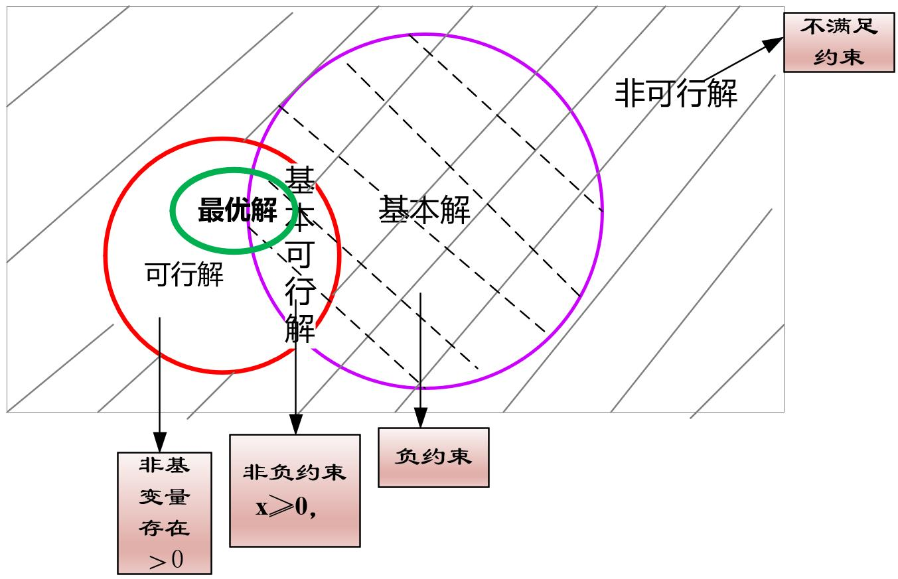

## 一、线性规划的基本问题

#### 1.线性规划的基本定理

- 线性规划问题若存在可行解，则可行域一定是凸集（或无界域）。
- 线性规划的基本可行解**对应**可行域D的顶点（一个顶点有可能对应多个基可行解，因此二者并不是一一对应）。
- 线性规划问题若存在最优解，至少在一个基可行解中取得，且必再某个顶点处取得。
- 可行域有界，线性规划的目标函数一定可以在其可行域顶点上达到最优。（同时在两个定点上达到最优时，则具有无穷多解。）
- 线性规划的可行解是基可行解的充要条件是X的正分量所对应的系数的列向量是线性独立\无关的。

> 理解：
>
> 线性规划：有效的划分可行域的函数及目标函数都是一次的。 一般现实情况下，满足非负条件的可行解就是基本可行解。
>
> 凸集：任意两点间的连线上的所有点都在点集合内部。 凸组合：实质含义是个点，有界凸集顶点表示其内部的点的一种表达方式。
>
> 由于凸组合是由顶点表达的，因此线性规划的任一可行解都可由全部基本可行解线性表示。

#### 2.图解法与解的性质

##### (1)图解法

步骤：绘制可行域——>作目标函数等值线——>平移目标函数至最优点。

##### (2)解的结构与性质

- 线性规划解的概念

  可行解：满足约束的解，其中能使目标函数达到最优的为最优解。

  基：约束方程组系数矩阵的最大无关向量组即是该问题的基，存在于基中的向量称之为基向量，对应的变量称为基变量、否则为非基向量/变量。

  > 对于线性规划问题：其系数矩阵的秩m一定不大于变量的个数n，但当m=n时该问题具有唯一解，当m<n时该问题具有无穷多解。一般讨论的都是m<n的情况。

  基本解（基解）：当m<n时，方程组具有无穷多解，该方程组的任一解称之为基本解，基本解的零分量的数目一定不大于方程系数矩阵的秩m，且m一定小于方程的个数。

  基本可行解：满足非负条件的基本解，就成为基本可行解，基本可行解时基本解与可行解的交集。

  > 可行解指的是满足所有约束的解； 基本解指的是除却变量负约束后对应的非齐次线性方程组的解，代表着X的基础解系； 基本可行解指的是既满足约束又是基本解的解，对应可行域的顶点； 最优解可能是基可行解或可行解，唯一最优解一定是基本可行解，但无穷多最优解时，顶点处的最优解是基本可行解，内部的最优解是可行解。（最优解都一定是基本可行解—错） 基本可行解的数目一定是有限的，凸集的顶点个数一定是有限的，因此在存在最优解的前提下，经过有限次迭代一定可以求得最优解。
  >
  > $基可行解的个数 \leq 基的个数 \leq C_n^m$

  

- 线性规划解的类型

  多重最优解、无界解、无可行解、唯一最优解

| 可行域类型 | 解的类型                     |
| ---------- | ---------------------------- |
| 可行域有界 | 唯一最优解/多重最优解        |
| 可行域无界 | 唯一最优解/多重最优解/无界解 |
| 无可行域   | 无解                         |

## 二、单纯型法及原理

##### 1.标准型的定义及转化

##### 2.单纯形法的标准计算步骤

##### 3.单纯形法迭代原理的矩阵表示

##### 4.单纯型法扩展—人工变量法（大M法与两阶段法）

