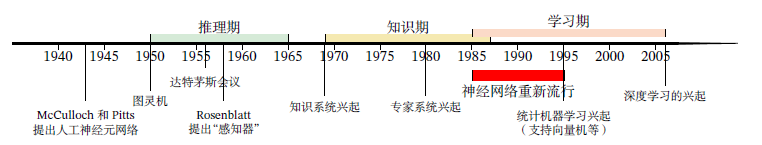
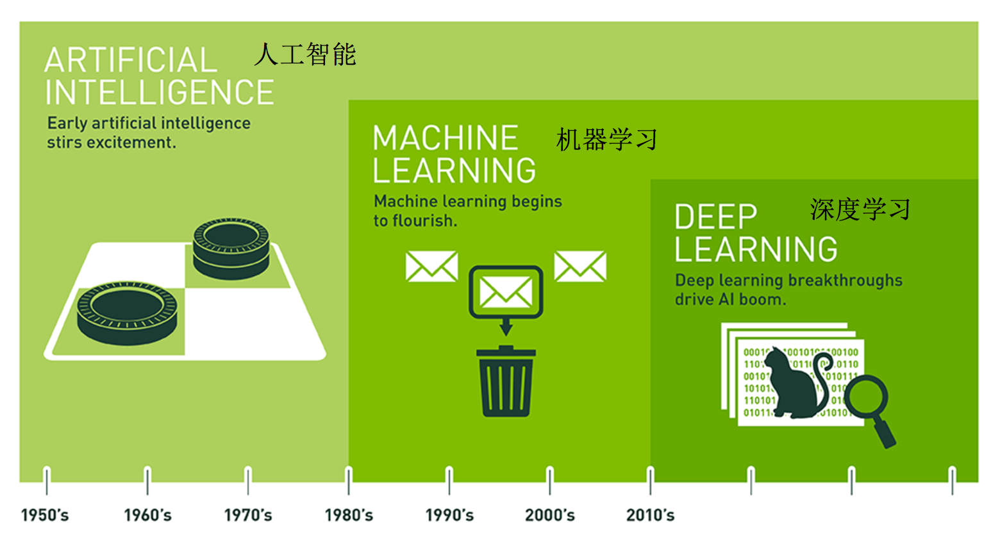

# 01.人工智能概述

近年来，以机器学习、知识图谱为代表的人工智能技术逐渐变得普及。从**车牌识别、人脸识别、语音识别、智能助手、推荐系统到自动驾驶**，人们在日常生活中都可能有意无意地用到了人工智能技术。尤其是近这几年，得益于数据的增多、计算能力的增强、学习算法的成熟以及应用场景的丰富，越来越多的人开始关注这个“崭新”的研究领域：机器学习与深度学习。

## 一、人工智能定义

简单地讲，人工智能（Artificial Intelligence，AI）就是让机器具有人类的智能，但是关于什么是“智能”并没有明确的定义，一般认为“智能”是指**由计算机控制并具有某种智能的行为**。实现机器的智能化是人类长期追求的目标，但至今无法实现，因为人类对大脑的运行机理仍知之甚少，1950年，阿兰·图灵(Alan Turing)发表论文《Computing Machinery and Intelligence》,其中讨论了创造一种“智能机器”的的可能性，由于难以准确定义“智能”一词，他提出了著名的图灵测试：**一个人在不接触对方的情况下，通过一种特殊的方式，和对方进行一系列的问答，如果在相当长时间内，他无法根据这些问题判断对方是人还是计算机，那么就可以认为这个计算机是智能的。**

1956年的达特茅斯（Dartmouth）会议上提出，人工智能 是计算机科学的一个分支，**主要研究、开发用于模拟、延伸和扩展人类智能的理论、方法、技术及应用系统**等，John Mc Carthy 给出了人工智能的定义为，人工智能就是要让机器的行为看起来就像是人所表现出的智能行为一样。

注意，目前存在的各种人工智能技术和人类智能还不能相提并论，深度学习需要大量的标注数据，和人类的学习方式差异性很大，虽然深度学习取得了很大的成功，但是深度学习还不是一种可以解决一系列复杂问题的通用智能技术，而仅仅解决在某一方面问题时发挥了不错的效果。

## 二、人工智能的主要分支

图灵测试是促使人工智能从哲学探讨到科学研究的一个重要因素，引导了人工智能的很多研究方向。
因为要使计算机能通过图灵测试，计算机就必须具备**理解语言**、**学习**、**记忆**、**推理**、**决策**等能力。这样，人工智能就延伸出了很多不同的子学科，比如**机器感知(计算机视觉、语音信息处理)**、**学习(模式识别、机器学习、强化学习)**、**语言(自然语言处理)**、**记忆(知识表示)**、**决策(规划、数据挖掘)**、**行动(机器人)**等，所有这些研究领域都可以看成是人工智能的研究范畴。

据此，在计算机科学领域的人工智能研究领域大致可分为如下三类：

### 1.感知

模拟人的感知能力，对外部刺激信息（视觉和语音等）进行感知和加工。主要研究领域包括语音信息处理和计算机视觉等。如在计算机视觉方面，较为经典的任务有图像形成、图像处理、图像提取和图像的三维推理，其中物体检测和人脸识别是其比较成功的研究领域。

### 2.学习

模拟人的学习能力，主要研究如何从样例或从与环境的交互中进行学习，主要研究领域包括监督学习、无监督学习和强化学习等。如经常听说的各种机器学习算法，神经网络、随机森林、支持向量机深度学习等。

### 3.认知

模拟人的认知能力，主要研究领域包括知识表示、自然语言理解、推理、规划、决策等。如在自然语言处理处理方面，语音识别、文本挖掘、机器翻译等。

## 三、人工智能的发展

人工智能从诞生至今，经历了一次又一次的繁荣与低谷，其发展历程大体上可以分为推理期知识期和学习期[周志华，2016]。

### 1.推理期

1956年8月，在美国汉诺斯小镇宁静的达特茅斯学院中，几位科学家聚在一起，讨论如何**用机器来模仿人类学习以及其他方面的智能。**会议足足开了两个月的时间，虽然大家没有达成普遍的共识，但是却为会议讨论的内容起了一个名字：**人工智能**，1956年也就成为了人工智能元年。

达特茅斯会议之后，研究者对人工智能的热情高涨，之后的十几年是人工智能的黄金时期。大部分早期研究者都**通过人类的经验，基于逻辑或者事实归纳出来一些规则，然后通过编写程序来让计算机完成一个任务。**这个时期中，研究者开发了一系列的智能系统，比如几何定理证明器、语言翻译器等，误差反向传播（BP）算法（1986）诞生于这个时期。然而，随着研究的深入，研究者意识到这些推理规则过于简单，对项目难度评估不足，人工智能的研究开始陷入低谷，很多人工智能项目的研究经费也被消减。

### 2.知识期

到了20世纪70年代，研究者意识到知识对于人工智能系统的重要性。特别是对于一些复杂的任务，可以通过专家来构建知识库。这一时期出现了各种各样的专家系统（Expert System），并在特定的专业领域取得了很多成果。专家系统是一类具有专门知识和经验的计算机智能程序系统。

### 3.学习期

由于缺乏对于人类的很多智能行为（比如语言理解、图像理解等）运作机理的认知，也无法描述这些智能行为背后的知识。因此很难通过知识和推理的方式来实现这些行为的智能系统。为了解决这类问题，研究者开始将研究重点转向让计算机从数据中自己学习。**事实上，学习本身也是一种智能行为。**

机器学习的主要目的是设计和分析一些学习算法，让计算机可以从数据（经验）中自动分析并获得规律，之后利用学习到的规律对未知数据进行预测，从而帮助人们完成一些特定任务，提高开发效率。机器学习的研究内容也十分广泛，涉及线性代数、统计学、数学优化、计算复杂性等多门学科。

## 四、人工智能的流派

由于”人类智能“仍处于黑箱状态，因此不同的研究者对于构建人工智能系统有着不同的理解，在人工智能的研究过程中产生了很多不同的流派。比如一些研究者认为人工智能应该通过研究人类智能的机理来构建一个仿生的模拟系统，而另外一些研究者则认为可以使用其他方法来实现人类的某种智能行为。一个著名的例子是让机器具有飞行能力不需要模拟鸟的飞行方式，而是应该研究空气动力学。尽管人工智能的流派非常多，但主流的方法大体上可以归结为以下两种：

### 1.符号主义

符号主义（Symbolism）又称逻辑主义、心理学派或计算机学派，是指通过分析人类智能的功能，然后用计算机来实现这些功能的一类方法。人类的认知过程可以看作符号操作过程。在人工智能的推理期和知识期，符号主义的方法比较盛行，并取得了大量的成果。符号主义有两个基本假设：**a)信息可以用符号来表示；b)符号可以通过显式的规则(比如逻辑运算)来操作。**

### 2.连接主义

连接主义（Connectionism）又称仿生学派或生理学派，是认知科学领域中的一类信息处理的方法和理论。连接主义认为**人类的认知过程是由大量简单神经元构成的神经网络中的信息处理过程，而不是符号运算。**因此，连接主义模型的主要结构是由大量简单的信息处理单元组成的互联网络，具有非线性、分布式、并行化、局部性计算以及自适应性等特性。——基于算法基于数据学习。

符号主义方法的一个优点是可解释性，而这也正是连接主义方法的弊端。连接主义有时候能在黑箱状态下实现对结果的预测，并且在精度和效率方面进展迅速。随着深度学习的发展，越来越多的研究者开始关注如何融合符号主义和连接主义，建立一种高效并且具有可解释性的模型。

## 五、机器学习与深度学习

### 1.机器学习

通俗地讲，**机器学习就是让计算机从数据中进行自动学习，得到某种知识（或规律），并利用这些规律对未知数据进行预测的方法**。早期的机器学习也经常称为模式识别（Pattern Recognition，PR）或统计学习（statistical learning，SL），其特点是基于数据设计算法让计算机自己学习构建概率统计模型，并运用模型实现对数据的识别、预测与分析等任务。机器学习通常指一类问题以及解决这类问题的方法，即如何从观测数据（样本）中寻找规律，并利用学习到的规律（模型）对未知或无法观测的数据进行预测。

### 2.深度学习

深度学习是通过学习算法让模型自动学习出好的特征表示（从底层特征，到中层特征，再到高层特征），从而最终提升预测模型的准确率的一种方法，所谓的深度是指原始数据进行非线性特征转换的次数。深度学习神经网络为主要模型，一开始以用来解决机器学习中的表示学习问题。但是由于其强大的能力，深度学习越来越多地用来解决一些通用人工智能问题，比如推理、决策等，目前，深度学习技术在学术界和工业界取得了广泛的成功，受到高度重视，并掀起新一轮的人工智能热潮。

深度学习是将原始的数据特征通过多步的特征转换得到一种特征表示，并进一步输入到预测函数得到最终结果。和“浅层学习”不同，深度学习需要解决的关键问题是贡献度分配问题（Credit Assignment Problem，CAP），即一个系统中不同的组件（component）或其参数对最终系统输出结果的贡献或影响。从某种意义上讲，深度学习可以看作一种强化学习（Reinforcement Learning，RL），每个内部组件并不能直接得到监督信息，需要通过整个模型的最终监督信息（奖励）得到，并且有一定的延时性。

目前，深度学习采用的模型主要是神经网络模型，其主要原因是神经网络模型可以使用误差反向传播算法，从而可以比较好地解决贡献度分配问题。只要是超过一层的神经网络都会存在贡献度分配问题，因此可以将超过一层的神经网络都看作深度学习模型。随着深度学习的快速发展，模型深度也从早期的5∼10层增加到目前的数百层。随着模型深度的不断增加，其特征表示的能力也越来越强，从而使后续的预测更加容易。

### 3.三者关系

从概念上说，机器学习是人工智能的一个重要分支，并逐渐成为推动人工智能发展的关键因素。深度学习是机器学习的一个子问题，其主要目的是从数据中自动学习到有效的特征表示。

