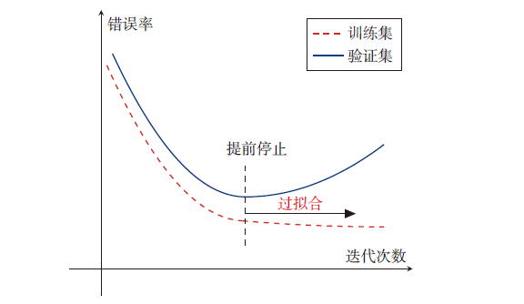

# 02.机器学习的基本概念

## 一、基本概念

可以将一个标记好特征以及标签的数据集（Data Set）看作一个样本（Sample），在数据集中，一般将一行数据成为一个样本，将一列数据称为一个特征。下表中，光滑、褶皱等即为样本的特征值，最终的目标值（标签）即为目标值。


在机器学习训练过程中，为了考察训练的情况，一般将数据集分为两部分：训练集和测试集。训练集（Training Set）中的样本是用来训练模型的，也叫训练样本（Training Sample），而测试集（Test Set）中的样本是用来检验模型好坏的，也叫测试样本（Test Sample）。

通常用一个𝐷维向量$𝒙 = [𝑥_1, 𝑥_2, ⋯ , 𝑥_𝐷]^T$ 表示一个数据集的所有特征构成的向量，称为特征向量（Feature Vector），其中每一维表示一个特征，并不是所有的样本特征都是数值型，有的需要通过转换表示为特征向量，数据的标签通常用标量$𝑦$来表示。

假设训练集$𝒟$由$𝑁$个样本组成，其中每个样本都是独立同分布的（Identically and Independently Distributed，IID），即独立地从相同的数据分布中抽取的，记为：
$$
𝒟 = \{(𝒙^{(1)}, 𝑦^{(1)}), (𝒙^{(2)}, 𝑦^{(2)}), ⋯ , (𝒙^{(N)}, 𝑦^{(N)})\}.
$$
给定训练集$𝒟$，希望让计算机从一个函数集合$ℱ = \{𝑓_1(𝒙), 𝑓_2(𝒙), ⋯\}$ 中自动寻找一个“最优”的函数$𝑓^∗(𝒙) $来近似每个样本的特征向量$𝒙$ 和标签$𝑦$ 之间的真实映射关系，这样就可以通过函数$𝑓^∗(𝒙) $预测任意一个样本$𝒙$的标签值。
$$
\hat{y}=f^*(x) \hspace{2ex}或\hspace{2ex} \hat{p}(y|x) = f^*_y(x)
$$
机器学习通过一定的学习算法（Learning Algorithm）$𝒜$来寻找这个“最优”函数$f^*(x)$，寻找过程被称为学习（Learning）或训练（Training）过程。

这样，如果能够继续获得测试样本，可以根据相关特征，使用学习到的函数$f^*(x)$来预测测试样本的标签值$\hat{y}$。为了评价的公正性，还是独立同分布地抽取一组芒果作为测试集$𝒟′$，并在测试集中所有芒果上进行测试，计算预测结果的准确率：
$$
Acc(f^*(x))=\frac{1}{N^{\prime}}\sum_{(x,y)\in{D^{\prime}}}{I(f^*(x)==y)}
$$
其中$I(·)$为指示函数，$N^{\prime}$为测试集合$D^{\prime}$的大小。

## 二、机器学习的流程与研究对象

### 1.对象与目的

机器学习的主要目的是对数据的预测与分析，特别是对未知新数据的预测与分析。机器学习的研究对象是数据，机器学习从数据出发，提取数据的特征，抽象出数据的模型，发现数据中的知识，又回到对数据的分析与预测中去。**机器学习关于数据的基本假设是同类数据具有一定的统计规律性。**

### 2.工作流程

传统的机器学习主要关注如何学习一个预测模型，首先将数据表示为一组特征（Feature），特征的表示形式可以是连续的数值、离散的符号或其他形式。注意，当用机器学习来解决实际任务时，会面对多种多样的数据形式，有些数据很容易表示和转化，有些数据则很难转化，这里会涉及到机器学习的第一步，**数据预处理与特征提取**。

其次选择一个合适的机器学习方法，机器学习方法可以概括为，假设数据是独立同分布产生的且要学习的模型属于某个函数的集合（假设空间），从给定的、有限的、用于学习的训练数据(training data)集合出发，应用某个评价准则(evaluation criterion)，从假设空间中选取一个最优模型，使它对已知的训练数据及未知的测试数据(test data)在给定的评价准则下有最优的预测。机器学习方法包括模型的假设空间、模型选择的准则以及模型学习的算法，一般将**模型(model)、策略(strategy)和算法(algorithm)**称为机器学习方法的三要素。

最后是根据预测结果对模型进行评价。

因此，在实际任务中使用机器学习模型一般会包含以下几个步骤：


#### （1）数据获取

可以使用很多方法收集样本护具，如：制作网络爬虫从网站上抽取数据、从RSS反馈或者API中得到信息、设备发送过来的实测数据。

#### （2）数据预处理

对数据的原始形式进行初步的数据清理（比如去掉一些有缺失特征的样本，或去掉一些冗余的数据特征等）和加工（对数值特征进行缩放和归一化、中心化、离散化、因子化、缺失值处理、去除共线性等），并构建成可用于训练机器学习模型的数据集。

#### （3）特征提取

从数据的原始特征中提取一些对特定机器学习任务有用的高质量特征，摒弃非显著特。比如在图像分类中提取边缘、尺度不变特征变换（Scale Invariant Feature Transform，SIFT）特征，在文本分类中去除停用词等。一些常用的方法包括如相关系数、卡方检验、平均互信息、条件熵、后验概率、逻辑回归权重等方法。

#### （4）特征转换

对特征进行进一步的加工，比如降维和升维。降维包括特征抽取（Feature Extraction）和特征选择（Feature Selection）两种途径。常用的特征转换方法有主成分分析（Principal Components Analysis，PCA）、线性判别分析（Linear Discriminant Analysis，LDA）等。

#### （5）模型选择

根据需要选择合适的模型，比如是监督性学习还是无监督性学习？是线性模型还是非线性模型？

#### （6）模型训练

现在很多算法都能够封装成黑盒供人使用。但是真正考验水平的是调整这些算法的（超）参数，使得结果变得更加优良。这需要对算法的原理有深入的理解。理解越深入，就越能提出良好的调优方案。

#### （7）模型预测与评估

机器学习的核心部分，学习一个函数并进行预测，不涉及特征学习的机器学习又称浅层学习（Shallow Learning），其特征主要靠人工经验或特征转换方法来抽取。

上述流程中，每步特征处理以及预测一般都是分开进行的。大部分新手使用机器学习主要关注模型选择和训练。但实际上，不同预测模型的性能相差不多，**数据和特征决定了机器学习的上限，而模型和算法只能逼近上限。**特征处理一般都需要人工干预完成，利用人类的经验来选取好的特征，并最终提高机器学习系统的性能。因此，很多的机器学习问题变成了特征工程（Feature Engineering）问题。

## 三、机器学习的三个基本要素

机器学习方法都是由模型、策略和算法构成的，可以简单地表示为：
$$
机器学习方法=模型+策略+算法
$$

### 1.模型

机器学习首要考虑的问题是学习什么样的模型。在监督学习过程中，模型就是所要学习的条件概率分布或决策函数。输入空间$𝒳$和输出空间$𝒴$构成了一个样本空间，对于样本空间中的样本$(𝒙，𝑦)∈𝒳×𝒴$，假定𝒙和𝑦之间的关系可以通过一个未知的真实映射函数$𝑔(𝒙)$或真实条件概率分布$𝑝𝑟(𝑦|𝒙)$来描述。机器学习的目标是找到一个模型来近映映射函数$𝑔(𝒙)$或真实条件概率分布$𝑝𝑟(𝑦|𝒙)$。

由于不知道真实的映射函数$𝑔(𝒙)$或条件概率分布$𝑝𝑟(𝑦|𝒙)$的具体形式，因而只能根据经验来假设一个函数集合$ℱ$，称为假设空间（Hypothesis Space），然后通过观测其在训练集$𝒟$上的特性，从中选择一个理想的假设$𝑓∗∈ℱ$。
假设空间ℱ通常为一个参数化的函数族：

模型的假设空间通常是一个包含所有可能的条件概率分布或决策函数的函数簇（集合）：
$$
ℱ = {𝑓(𝒙; 𝜃)|𝜃 ∈ ℝ^𝐷}
$$
其中$𝑓(𝒙; 𝜃) $是参数为$𝜃$的函数，也称为模型（Model），$𝐷$ 为参数的数量．常见的假设空间可以分为线性和非线性两种，对应的模型$𝑓$也分别称为线性模型和非线性模型。

#### （1）线性模型

线性模型的假设空间为一个参数化的线性函数族，其中参数$𝜃$包含了权重向量$𝒘$和偏置$𝑏$。
$$
𝑓(𝒙; 𝜃) = 𝒘^T𝒙 + 𝑏,
$$

#### （2）非线性模型

广义的非线性模型可以写为多个非线性基函数$𝜙(𝒙)$的线性组合。
$$
𝑓(𝒙; 𝜃) = 𝒘^T𝜙(𝒙) + 𝑏
$$

其中$𝜙(𝒙) = [𝜙_1(𝒙), 𝜙_2(𝒙), ⋯ , 𝜙_𝐾 (x)]^T$ 为$𝐾$个非线性基函数组成的向量，参数$𝜃$包含了权重向量$𝒘$ 和偏置$𝑏$。

若$𝜙(𝒙)$本身为可学习的基函数，比如：
$$
𝜙_𝑘(𝒙)= ℎ(𝒘^T_𝑘𝜙^{\prime}(𝒙) + 𝑏_𝑘),∀1 ≤ 𝑘 ≤ 𝐾
$$
其中$ℎ(⋅)$为非线性函数，$𝜙^{\prime}(𝒙)$ 为另一组基函数，$𝒘_𝑘$ 和$𝑏_𝑘$为可学习的参数，则$𝑓(𝒙; 𝜃)$就等价于神经网络模型。

### 2.策略

有了模型的假设空间，机器学习接着需要考虑的是按照什么样的准则学习或选择最优的模型。统计学习的目标在于从假设空间中选取最优模型。这里引入损失函数与风险函数的概念。**损失函数度量模型一次预测的好坏，风险函数度量平均意义下模型预测的好坏。**

设训练集$𝒟=\{(𝒙^{(n)}，𝑦^{(n)})\}^𝑁_{n=1}$是由𝑁个独立同分布的（Independent and Identically Distributed，IID）样本组成，每个样本$(x,y)∈𝒳×𝒴$是从$𝒳$和$𝒴$的联合空间中按照某个未知分布$𝑝𝑟(x,y)$独立地随机产生的。这里假设样本分布$𝑝𝑟(x,y)$是固定的（虽然可以是未知的），不会随时间而变化。如果$𝑝𝑟(x,y)$本身可变的话，就无法通过这些数据进行学习。

一个好的模型$𝑓(𝒙,𝜃^∗)$应该在所有$(𝒙, 𝑦)$的可能取值上都与真实映射函数$𝑦=𝑔(𝒙)$一致，即：
$$
ℒ(y,f(x;\theta)) = |f(x,𝜃^∗)-y| < \epsilon,∀(x, y)\in{𝒳×𝒴}
$$
或与真实条件概率分布$𝑝𝑟(y|x)$一致，即：
$$
ℒ(y,f(x;\theta)) = |f_y(x,𝜃^∗)-𝑝𝑟(y|x)| < \epsilon,∀(x, y)\in{𝒳×𝒴}
$$
其中$𝜖$是一个很小的正数，$f_y(x,𝜃^∗)$为模型预测的条件概率分布中$𝑦$对应的概率，$ℒ(y,f(x;\theta))$被称为损失函数。

由于模型的输入$x$、输出$(x,y)$都是随机变量，遵循联合分布$𝑝𝑟(x,y)$，因此损失函数$ℒ(y,f(x;\theta))$的期望可以表示为：
$$
ℛ_{exp}(𝜃) =E[ ℒ(y,f(x;\theta)) ]= \int_{𝒳×𝒴}{ ℒ(y,f(x;\theta))𝑝𝑟(x,y) dxdy}
$$
这是理论模型$f(x;\theta)$关于联合分布$𝑝𝑟(x,y)$​的平均意义下的损失，一般被称为风险函数（Risk Function）或期望损失（Expect Loss）。

#### （1）损失函数

监督学习问题是在假设空间$ℱ$中选取模型$f$作为决策函数，对于给定的输入$x$，由$f(x;\theta)$给出相应的输出Y，输出值$f(x;\theta)$与真实值$y$可能一致也可能不一致，用一个损失函数（Loss Function）或代价函数（Cost Function）来度量预测错误的程度。损失函数是$f(x;\theta)$和$y$的非负实值函数，记作$ℒ(y,f(x;\theta))$。损失函数越小，模型拟合的结果越好。

- 0-1 损失函数（0-1 loss function）

最直观的损失函数是模型在训练集上的错误率，
$$
ℒ(y,f(x;\theta)) = \begin{cases} 
0,\quad y=f(x;\theta)\\ 
1, \quad y\neq{f(x;\theta)}
\end{cases}=I(y\neq{f(x;\theta)})
$$


虽然0-1损失函数能够客观地评价模型的好坏，但其缺点是数学性质不是很好：不连续且导数为0，难以优化。因此经常用连续可微的损失函数替代。

- 平方损失函数（quadratic loss function）

经常用在预测标签$𝑦$为实数值的任务中，定义为：
$$
ℒ(𝑦, 𝑓(𝒙; 𝜃)) =\frac{1}{2}(𝑦 − 𝑓(𝒙; 𝜃))^2
$$
平方损失函数一般不适用于分类问题。

- 绝对损失函数（absolute loss function）

$$
ℒ(𝑦, 𝑓(𝒙; 𝜃)) =|𝑦 − 𝑓(𝒙; 𝜃)|
$$

- 对数损失函数（logarithmic loss function）或对数似然损失函数（log-likelihood loss function）

$$
ℒ(𝑦, P(y|𝒙; 𝜃)) = -\log{P(y|𝒙; 𝜃)}
$$

- 交叉熵损失函数（Cross-Entropy Loss Function）

一般用于分类问题，假设样本的标签$𝑦 ∈ \{1, ⋯ , 𝐶\}$为离散的类别，模型$𝑓(𝒙;𝜃) ∈ [0, 1]^C$的输出为类别标签的条件概率分布：
$$
𝑝(𝑦 = 𝑐|𝒙; 𝜃) = 𝑓_𝑐(𝒙; 𝜃), 其中𝑓_𝑐(𝒙; 𝜃)\in{[0,1]}且\sum_{c=1}^C{ 𝑓_𝑐(𝒙; 𝜃)}=1
$$
假设用一个$𝐶$维的one-hot向量$𝒚$来表示样本标签．假设样本的标签为$𝑘$，那么标签向量$𝒚$只有第$𝑘 $维的值为1，其余元素的值都为0。标签向量$𝒚$ 可以看作样本标签的真实条件概率分布$𝑝𝑟(𝒚|𝒙)$，即第$c$维（记为$𝑦_𝑐$，$1 ≤ 𝑐 ≤ 𝐶$）是类别为$𝑐 $的真实条件概率。假设样本的类别为$𝑘$，那么它属于第$𝑘$ 类的概率为1，属于其他类的概率为0。

对于两个概率分布，一般可以用交叉熵来衡量它们的差异．标签的真实分布$𝒚$ 和模型预测分布$𝑓(𝒙; 𝜃)$ 之间的交叉熵为：
$$
\begin{aligned}
ℒ(𝒚, 𝑓(𝒙; 𝜃))&=-𝒚^T\log{𝑓(𝒙; 𝜃)}\\[2ex]
&= -\sum_{c=1}^C{y_c\log{f_c(𝒙; 𝜃)}}
\end{aligned}
$$
其中$f_c(𝒙;𝜃)$可以看作真实类别$𝑦 $​的似然函数。因此，交叉熵损失函数也就是负对数似然函数（Negative Log-Likelihood）。

- Hinge 损失函数（Hinge Loss Function）

对于二分类问题，假设$y$的取值为$\{−1,+1\}$，$𝑓(𝒙; 𝜃)\in{R}$ ：
$$
ℒ(𝒚, 𝑓(𝒙; 𝜃))=\max{(0,1-y𝑓(𝒙; 𝜃))} \equiv [1-y𝑓(𝒙; 𝜃)]_+
$$
其中$[𝑥]_+ = \max(0, 𝑥)$

#### （2）风险函数

- 经验风险最小化（Empirical Risk Minimization，ERM）准则

一个好的模型$f(x;\theta)$应当有一个比较小的期望错误，但由于真实的$𝑝𝑟(x,y)$是未知的，映射函数$ℒ(y,f(x;\theta))$也是未知的，实际上无法计算其期望风险$ℛ(𝜃)$。实际上如果知道联合分布$𝑝𝑟(x,y)$的话，就可以直接求出条件概率分布$𝑝𝑟(y|x)$，无需得知$ℒ(y,f(x;\theta))$，因此也无需进行学习。自然的想法就是利用已知数据去估计，假设给定训练集$𝒟 = \{(𝒙^{(𝑛)}, 𝑦^{(𝑛)})\}^𝑁$，则可以根据期望风险计算映射函数在训练数据集的平均损失：
$$
\hat{ℛ_{emp}(𝜃)} =E(ℒ)=\frac{1}{N}\sum_{i=1}^N{ℒ(y,f(x;\theta))}
$$
$\hat{ℛ_{emp}(𝜃)}$又被成为经验风险（Empirical Risk）或经验损失（Empirical Loss），期望损失$ℛ_{exp}(𝜃)$是模型关于联合分布的期望损失，经验损失$\hat{ℛ(𝜃)}$是模型关于训练样本集的平均损失，根据大数定律，$lim_{n\rightarrow+\infty}\hat{ℛ(𝜃)} = ℛ(𝜃)$。

经验风险最小化策略认为，经验风险最小的模型是最优的模型。因此希望找到一组参数$𝜃^∗$ 使得经验风险最小，即求解最优化问题：
$$
\theta^* = \arg{ \min_{\theta}{\hat{ℛ_{emp}(𝜃)}}}
$$
当样本容量足够大时，经验风险最小化能保证有很好的学习效果，在现实中被广泛采用。一个典型的例子就是极大似然估计（Maximum Likelihood Estimation）当模型是条件概率分布、损失函数是对数损失函数时，经验风险最小化就等价于极大似然估计。

通常情况下，样本容量不可能趋于无限大，并且训练样本往往是真实数据的一个很小的子集或者包含一定的噪声数据，不能很好地反映全部数据的真实分布，**经验风险最小化原则很容易导致模型在训练集上错误率很低，但是在未知数据上错误率很高．这就是所谓的过拟合（Overfitting）。**

> 模型过拟合的一种直观表现是在训练集上错误率很低，但在验证集上错误率很高。


- 结构风险最小化（Structure Risk Minimization，SRM）准则

过拟合问题往往是由于**训练数据少**、**噪声过强**、**特征单一**和**模型能力强**等原因造成的。为了解决过拟合问题， 一般在经验风险最小化的基础上再引入参数的正则化（Regularization）来限制模型能力，使其不要过度地最小化经验风险。结构风险在经验风险模型的基础上加上表示模型复杂度的正则化项（Regularizer）或罚项（Penalty term），在假设空间、损失函数以及训练数据集确定的情况下，结构风险的定义是：
$$
\hat{ℛ_{struct}(𝜃)} =E(ℒ)=\frac{1}{N}\sum_{i=1}^N{ℒ(y,f(x;\theta))} + \lambda J(f(x;\theta)))
$$
其中，$J(f)$为模型的复杂度，是定义在假设空间$ℱ$上的泛函，模型$f$越复杂，复杂度$J(f)$就越大，反之，模型$f$越简单。复杂度表示了对复杂模型的惩罚。$\lambda\geq0$是常数，用以权衡经验风险和模型复杂度（控制正则化的强度）。从贝叶斯学习的角度来讲，正则化是引入了参数的先验分布，使其不完全依赖训练数据。

结构风险最小化策略认为，结构风险最小的模型是最优的模型。因此希望找到一组参数$𝜃^∗$​ 使得结构风险最小，即求解最优化问题：
$$
\theta^* = \arg{ \min_{\theta}{\hat{ℛ_{struct}(𝜃)}}}
$$
结构风险小需要经验风险与模型复杂度同时小。结构风险小的模型往往对训练数据以及未知的测试数据都有较好的预测。

和过拟合相反的一个概念是欠拟合（Underfitting），即模型不能很好地拟合训练数据，在训练集上的错误率比较高。欠拟合一般是由于**标准粗糙**、**缺乏关键特征**或**模型能力不足**造成的。

> 模型欠拟合的直观表现就是在**训练集和验证集上错误率**都很高。


### 3.算法

算法是指学习模型的具体计算方法。机器学习基于训练数据集，根据学习策略从假设空间中选择最优模型，最后需要考虑用什么样的计算方法求解最优模型。在确定了训练集$𝒟$、假设空间$ℱ$以及学习准则后，如何找到最优的模型$𝑓(𝒙，𝜃^∗)$就成了一个最优化（Optimization）问题。机器学习的训练过程其实就是最优化问题的求解参数的过程。

#### （1）超参数调整

在机器学习中，优化又可以分为**参数优化和超参数优化**。模型$𝑓(𝒙;𝜃)$中的$𝜃$称为模型的参数，可以通过优化算法进行学习。除了可学习的参数$𝜃$之外，还有一类参数是用来定义模型结构或优化策略的，这类参数叫作超参数（Hyper-Parameter）。

常见的超参数包括：聚类算法中的类别个数、梯度下降法中的步长、正则化项的系数、神经网络的层数、支持向量机中的核函数等。超参数的选取一般都是组合优化问题，很难通过优化算法来自动学习。因此，超参数优化是机器学习的一个经验性很强的技术，通常是按照人的经验设定，或者通过**搜索的方法**对一组超参数组合进行不断试错调整。

现实中常用的做法，是对每个参数按照经验选定一个范围和变化的步长，显然，这样选定的参数值往往不是最佳值，但这是在计算开销和性能估计之间进行折中的结果。

#### （2）梯度下降算法

为了充分利用凸优化中一些高效、成熟的优化方法，比如共轭梯度、拟牛顿法等，很多机器学习方法都倾向于选择合适的模型和损失函数，以构造一个凸函数作为优化目标。但也有很多模型（比如神经网络）的优化目标是非凸的，只能退而求其次找到局部最优解。

在机器学习中，最简单、常用的优化算法就是梯度下降法，即首先初始化参数$𝜃_0$，然后通过迭代计算训练集$𝒟$​上风险函数的最小值：
$$
\begin{aligned}
\theta_{t+1} &= \theta_t - \alpha\frac{\partial{ℛ_𝒟(\theta)}}{\partial{\theta}}\\[2ex]
&= \theta_t -  \alpha \frac{1}{N}\sum_{n=1}^N{\frac{\partial{ℒ(y^{(n)},f(x^{(n)};\theta))}}{\partial{\theta}}}
\end{aligned}
$$
其中$\theta_t$为第$𝑡$ 次迭代时的参数值，$\alpha$为搜索步长，在机器学习中，$\alpha$一般称为学习率（Learning Rate）。

#### （3）随机梯度下降法

在梯度下降法中，目标函数是整个训练集上的风险函数，这种方式称为批量梯度下降法（Batch Gradient Descent，BGD）。批量梯度下降法在每次迭代时需要计算**每个样本上损失函数的梯度并求和**。批量梯度下降法相当于是从真实数据分布中采集𝑁个样本，并由它们计算出来的经验风险的梯度来近似期望风险的梯度。当训练集中的样本数量𝑁很大时，空间复杂度比较高，每次迭代的计算开销也很大。

为了减少每次迭代的计算复杂度，可以在每次迭代时只采集一个样本，计算这个样本损失函数的梯度并更新参数，即随机梯度下降法（Stochastic Gradient Descent，SGD）。当经过足够次数的迭代时，随机梯度下降也可以收敛到局部最优解。

批量梯度下降和随机梯度下降之间的区别在于，每次迭代的优化目标是对**所有样本的平均损失函数**还是对**单个样本的损失函数**。由于随机梯度下降实现简单，收敛速度也非常快，因此使用非常广泛。随机梯度下降相当于在批量梯度下降的梯度上引入了随机噪声。在非凸优化问题中，随机梯度下降更容易逃离局部最优点。


#### （4）小批量梯度下降法

随机梯度下降法的一个缺点是无法充分利用计算机的并行计算能力。小批量梯度下降法（Mini-Batch Gradient Descent）是批量梯度下降和随机梯度下降的折中。每次迭代时，随机选取**一小部分训练样本**来计算梯度并更新参数，这样既可以兼顾随机梯度下降法的优点，也可以提高训练效率。第𝑡次迭代时，随机选取一个包含𝐾个样本的子集𝒮𝑡，计算这个子集上每个样本损失函数的梯度并进行平均，然后再进行参数更新。

在实际应用中，小批量随机梯度下降法有收敛快、计算开销小的优点，因此逐渐成为大规模的机器学习中的主要优化算法。

## 四、模型选择与评估

当假设空间含有不同复杂度(不同的参数个数)的模型时，就要面临模型选择(model selection)与评估的问题。如果假设空间中存在“真”模型，我们希望我们的最优模型尽可能的逼近“真”模型。具体地，所选择的模型要与真模型的参数个数相同，所选择的模型的参数向量与真模型的参数向量相近。

### 1.模型评估的方法

可通过实验测试的方式来对学习器的综合性能进行评估并进而做出选择。为此，需使用一个测试集(testing set)来测试学习器对新样本的判别能力，然后以测试集上的测试误差(testing error)作为泛化误差的近似。通常假设测试样本也是从样本真实分布中独立同分布采样而得。但需注意的是，测试集应该尽可能与训练集互斥，即测试样本尽量不在训练集中出现、未在训练过程中使用过。

设训练集$𝒟=\{(𝒙^{(n)}，𝑦^{(n)})\}^𝑁_{n=1}$是由𝑁个独立同分布的（Independent and Identically Distributed，IID）样本组成，每个样本$(x,y)∈𝒳×𝒴$是从$𝒳$和$𝒴$的联合空间中按照某个未知分布$𝑝𝑟(x,y)$独立地随机产生的。假设我们有一个包含$N$个样本的数据集$D=\{ \}$

#### （1）留出法

留出法（hold-out）直接将数据集𝒟划分为两个互斥的集合，其中一个集合作为训练集S，另一个作为测试集T。在S上训练出模型后，用T来评估其测试误差，作为对泛化误差的估计。

需注意的是：

- 训练/测试集的划分要尽可能保持数据分布的一性（分层抽样），避免因数据划分过程引入额外的偏差而对最终结果产生影响。
- 即使给定数据集的划分比例，但仍存在不同的划分方式将数据集拆分为不同的训练/测试集，从而导致不同的评估结果，因此单次使用留出法得到的估计结果是不可靠的，应该进行若干次随机划分、重复实验取平均值作为留出法的评估结果。
- 测试集小时，评估结果的方差较大；训练集小时,评估结果的偏差较大。（可从下一节的“偏差-方差分解”角度来理解）

> 尴尬的是，若训练集数据太多，模型结果无限接近数据集𝒟，评估结果会相对偏高，结果不太准确。若令验证集数据偏多，则结果模型又会相对偏低，如何划分数据集一直是个问题，常见做法是将大约2/3~4/5的样本用于训练，剩余样本用于测试，当数据量较大时，可以适当减小测试集，当数据量偏小时，应该适量增加测试集（测试集至少应含30个样例）。

#### （2）交叉验证法

交叉验证（Cross-Validation）是一种比较好的衡量机器学习模型的统计分析方法，可以有效避免划分训练集和测试集时的随机性对评价结果造成的影响。可以把原始数据集平均分为𝐾组不重复的子集，每次选𝐾−1组子（𝐾一般大于3）集作为训练集，剩下的一组子集作为验证集。这样可以进行𝐾次试验并得到𝐾个模型，将这𝐾个模型在各自验证集上的错误率的平均作为分类器的评价。交叉验证法评估结果的稳定性和保真性在很大程度上取决于k的取值，为强调这一点，通常把交叉验证法称为k折交叉验证（k-fold cross validation）。k最常用的取值是10，此时称为10折交叉验证。

与留出法相似，将数据集𝒟划分为k个子集同样存在多种划分方式，为减小因样本划分不同而引入的差别，k折交叉验证通常要随机使用不同的划分复p次，最终的评估结果是这p次k折交叉验证结果的均值，例如常见的有10次10折交叉验证。

> 天下没有免费的午餐，10次10折交叉验证法与100次留出法都是进行了100次训练/测试。事实上，100次留出法的结果更有具可信度，只是训练起来比较复杂。

#### （3）自助法

由于我们希望评估的是基于数据集𝒟训练出的模型，限于留出法和交叉验证法中，部分样本不能被训练，这将导致一些因训练样本规模不同而导致的估计偏差。留一法受训练样本规模变化的影响较小，但计算复杂度又太高了。

自助法(bootstrapping)直接以自助采样法(bootstrap sampling)为基础，可以很好的解决以上问题。给定包含N个样本的数据集$𝒟$，从$𝒟$中有放回的重复抽样N次产生数据集$𝒟^{\prime}$，显然，$𝒟$中有一部分样本会在$𝒟^{\prime}$中多次出现，而另一部分样本不出现。样本在N次采样中始终不被采到的概率是$(1-\frac{1}{m})^m$，取极限得到：
$$
\lim_{m\rightarrow \infty}{(1-\frac{1}{m})^m}=\frac{1}{e} \approx 0.368
$$
可见，通过自助采样后，初始数据集$𝒟$中约有$36.8\%$的样本未出现在采样数据集$𝒟^{\prime}$中，这时，将$𝒟^{\prime}$​用作训练集，实际评估的模型与期望评估的模型都使用N个训练样本，而我们仍有数据总量约 1/3 的、没在训练集中出现的样本用于测试。这样的测试结果又称为“包外估计”(out-of-bag estimate)，自助法在数据集较小、难以有效划分训练/测试集时很有用。

自助法能从初始数据集中产生多个不同的训练集，这对集成学习等方法有很大的好处。自助法产生的数据集改变了初始数据集的分布,这会引入估计偏差，在初始数据量足够时，留出法和交叉验证法更常用一些。

### 2.模型选择

如果一味的追求模型的拟合能力（小训练误差），容易导致所选模型的复杂度大于“真”模型，产生过拟合现象。相反，如果降低其拟合能力，限制所选模型的复杂度，又可能会导致欠拟合。**如何在模型的拟合能力和复杂度之间取得一个较好的平衡，对一个机器学习算法来讲十分重要。**

#### （1）方差-偏差分解

偏差和方差分解（Bias-Variance Decomposition）为模型选择提供了一个很好的分析和指导工具。以平方损失函数$ℒ(𝑦, 𝑓(𝒙; 𝜃)) =(𝑦 − 𝑓(𝒙; 𝜃))^2$为例，设最优模型为$f^*(x;\theta)$，则最优模型的期望错误可以表示为：
$$
\begin{aligned}
ℛ_d(f) &= E_{(x,y)\sim{pr(x,y)}}[(𝑦 − 𝑓(𝒙; 𝜃))^2]\\[2ex]
&= E_{(x,y)\sim{pr(x,y)}}\{[𝑦 − 𝑓^*(𝒙; 𝜃) + 𝑓^*(𝒙; 𝜃) - 𝑓(𝒙; 𝜃) ]^2\}\\[2ex]
&=E_{(x,y)\sim{pr(x,y)}}[(𝑓(𝒙; 𝜃) − 𝑓^*(𝒙; 𝜃))^2] + E_{(x,y)\sim{pr(x,y)}}[(𝑦 − 𝑓^*(𝒙; 𝜃))^2]\\[2ex]
&= E_{(x,y)\sim{pr(x,y)}}[(𝑓(𝒙; 𝜃) − 𝑓^*(𝒙; 𝜃))^2] + \epsilon
\end{aligned}
$$

> 注：$E_xE_y[y-f^*(x)]=0$

其中第一项是当前模型和最优模型之间的差距，是机器学习算法可以优化的真实目标。损失$\epsilon$​通常是由于样本分布以及噪声引起的，无法通过优化模型来减少。

进一步取训练集$𝒟\sim{pr(x,y)}$，设$f_𝒟(x;\theta)$表示在训练集$𝒟$​上学习到的模型，则一个机器学习算法（包括模型以及优化算法）的能力可以用不同训练集上的模型的平均性能来评价。不同训练集𝒟 的模型$f_𝒟(x;\theta)$ 和最优模型$f^*(x;\theta)$的期望差距：
$$
\begin{aligned}
E_𝒟[ (𝑓_𝒟(𝒙; 𝜃) − 𝑓^*(𝒙; 𝜃))^2 ]&=E_𝒟\{ [𝑓_𝒟(𝒙; 𝜃) −E_𝒟[f_𝒟(x; 𝜃)]  + E_𝒟[f_𝒟(x; 𝜃)] + 𝑓^*(𝒙; 𝜃)]^2 \} \\[2ex]
&=  \underbrace{( E_𝒟[f_𝒟(x; 𝜃)]-𝑓^*(𝒙; 𝜃) )^2}_{(bias.x)^2} + \underbrace{E_𝒟[(𝑓_𝒟(𝒙; 𝜃)-E_𝒟[f_𝒟(x; 𝜃)])^2]}_{variance.x}
\end{aligned}
$$
其中第一项为偏差（Bias），是指一个模型在不同训练集上的平均性能和最优模型的差异，可以用来衡量一个模型的拟合能力。第二项是方差（Variance），是指一个模型在不同训练集上的差异，可以用来衡量一个模型是否容易过拟合。

于是$ℛ_d(f)$可以进一步写成：
$$
\begin{aligned}
ℛ_d(f) &= E_{(x,y)\sim{pr(x,y)}}[(𝑓(𝒙; 𝜃) − 𝑓^*(𝒙; 𝜃))^2] + \epsilon\\[1.5ex]
&=(bias)^2 + variance + \epsilon
\end{aligned}
$$

> 最小化期望错误等价于最小化偏差和方差之和。

方差一般会随着训练样本的增加而减少。当样本比较多时，方差比较少，这时可以选择能力强的模型来减少偏差。然而在很多机器学习任务上，训练集往往都比较有限，最优的偏差和最优的方差就无法兼顾。

随着模型复杂度的增加，模型的拟合能力变强，偏差减少而方差增大，从而导致过拟合。以结构风险最小化为例，我们可以调整正则化系数$\lambda$来控制模型的复杂度。当$\lambda$变大时，模型复杂度会降低，可以有效地减少方差，避免过拟合，但偏差会上升。当𝜆过大时，总的期望错误反而会上升。因此，一个好的正则化系数𝜆需要在偏差和方差之间取得比较好的平衡。

#### （2）训练误差与测试误差

实际上由于训练集与测试集数据的差异，基于损失函数的模型的训练误差（training error）和模型的测试误差（test error）的表现往往是不同的。一般而言，训练误差反映了**问题的难易程度**和**模型的拟合能力**，但本质上并不重要。测试误差反映了学习方法对未知的测试数据集的**预测能力**，反映了模型的泛化能力(generalization ability)，是机器学习最重要的性质。


一般来说，当一个模型在训练集上的错误率比较高时，说明模型的拟合能力不够，偏差比较高。这种情况可以通过增加数据特征、提高模型复杂度、减小正则化系数等操作来改进。当模型在训练集上的错误率比较低，但验证集上的错误率比较高时，说明模型过拟合，方差比较高。这种情况可以通过降低模型复杂度、加大正则化系数、引入先验等方法来缓解。此外，还有一种有效降低方差的方法为集成模型，即通过多个高方差模型的平均来降低方差。

#### （3）正则化

模型选择的典型方法是正则化(regularization)。正则化是结构风险最小化策略的实现：
$$
\hat{ℛ_{struct}(𝜃)} =E(ℒ)=\frac{1}{N}\sum_{i=1}^N{ℒ(y,f(x;\theta))} + \lambda J(f(x;\theta)))
$$
其中，$J(f)$为模型的复杂度，是定义在假设空间$ℱ$上的泛函，模型$f$越复杂，复杂度$J(f)$就越大，反之，模型$f$越简单。复杂度表示了对复杂模型的惩罚。$\lambda\geq0$是常数，用以权衡经验风险和模型复杂度（控制正则化的强度）。正则化的作用是选择经验风险与模型复杂度同时较小的模型，

正则化项可以取不同的形式。例如，回归问题中，选择平方损失作为损失函数，正则化项可以是参数向量$𝜃$的$\ell_2$​范数。
$$
ℒ(\theta) = \frac{1}{N}\sum_{i=1}^N{ℒ(y,f(x;\theta))} + \frac{\lambda}{2}\Vert \theta \Vert_2
$$
正则化项也可以使用其他函数，比如$\ell_1$范数（可以通俗理解为高维度的绝对值或者单位距离），但是引入$\ell_1$范数会使参数有一定的稀疏性，因此在很多算法中也经常使用。

正则化符合奥卡姆剃刀（Occam's razor）原理。奥卡姆剃刀原理应用于模型选择时变为以下想法：在所有可能选择的模型中，能够很好地解释已知数据并且十分简单才是最好的模型。从贝叶斯估计的角度来看，正则化项对应于模型的先验概率。可以假设复杂的模型有较小的先验率，简单的模型有较大的先验概率。

#### （4）早停

针对梯度下降的优化算法中，除了加正则化项之外，还可以通过提前停止来防止过拟合。在梯度下降训练的过程中，由于过拟合的原因，在训练样本上收敛的参数，并不一定在测试集上最优。

因此，除了训练集和测试集之外，可以再增加一个验证集（Validation Set）来进行模型选择，测试模型在验证集上是否最优。在每次迭代时，把新得到的模型$f(x;\theta)$在验证集上进行测试，并计算错误率。如果在验证集上的错误率不再下降，就停止迭代。这种策略叫提前停止（Early Stop）。如果没有验证集，可以在训练集上划分出一个小比例的子集作为验证集。



### 3.模型性能度量

为了衡量一个机器学习模型的好坏，需要给定一个测试集，用模型对测试集中的每一个样本进行预测，并根据预测结果计算评价分数，**机器学习模型具体采用的损失函数未必是评估时使用的损失函数。当然，让两者一致是比较理想的。**

#### （1）回归问题

回归任务最常用的性能度量是“均方误差”：
$$
E(ℒ)=\frac{1}{N}\sum_{i=1}^N{(f(x;\theta)-y)^2}
$$
更一般的，对于数据分布$D$和概率密度函数$p(·)$，均方误差可描述为：
$$
E(ℒ)=\int_{x\sim{D}}(f(x;\theta)-y)^2p(x)dx
$$

#### （2）分类问题

分类问题常见的评价标准有准确率、精确率、召回率和F值等。给定测试集$𝒯=\{(x^{(1)},y^{(1)}), (x^{(2)},y^{(2)}),...,(x^{(n)},y^{(n)}),\}$，其标签$y^{(n)}\in{\{1,2,...,C\}}$，在最优模型$f^*(x;\theta^*)$对测试集中的每一个样本的预测结果为$\{\hat{y^{(1)}},\hat{y^{(2)}},...,\hat{y^{(n)}}\}$，$I(·)$为指示函数。

- 准确率与错误率

最常用的评价指标为准确率（Accuracy），和准确率相对应的就是错误率（Error Rate）
$$
𝒜  = \frac{1}{N}\sum_{i=1}^n{I(y^{(i)}=\hat{y}^{(i)})}
$$

$$
\varepsilon=1-𝒜 = \frac{1}{N}\sum_{i=1}^n{I(y^{(i)}\neq \hat{y}^{(i)})}
$$

> 准确率和精确率的定义在有些文献中刚好相反，具体含义需要根据上下文进行判断。

- 精确率和召回率

准确率是所有类别整体性能的平均，如果希望对每个类的评价性能进行估计，就需要计算精确率（Precision）和召回率（Recall）。精确率和召回率是广泛用于信息检索和统计学分类领域的两个度量值，在机器学习的评价中也被大量使用。对于类别𝑐来说，模型在测试集上的结果可以分为以下四种情况：

|             名称             |         数目         |                         计算公式                         |
| :--------------------------: | :------------------: | :------------------------------------------------------: |
| 真正例（True Positive，TP）  |   将c类预测为c类数   |       $\sum_{i=1}^n{I(y^{(i)} = \hat{y}^{(i)}=c)}$       |
| 假负例（False Negative，FN） | 将c类预测为其他类数  | $\sum_{i=1}^n{I(y^{(i)} = c\wedge\hat{y}^{(i)} \neq c)}$ |
| 假正例（False Positive，FP） | 将其他类预测为c类数  |  $\sum_{i=1}^n{I(y^{(i)}\neq c\wedge\hat{y}^{(i)}=c)}$   |
| 真负例（True Negative，TN）  | 将其他类预测为其他类 |               对于类别c，该情况无需关注。                |

这四种情况的关系可用下图中的混淆矩阵（Confusion Matrix）来表示。

<table>
    <tr>
	    <td rowspan="2" style="text-align:center; font-weight: bold;font-size: 18px"> 真实类别 </td>
	    <td colspan="2" style="text-align:center; font-weight: bold;font-size: 18px">预测类别</td>
	</tr >
    <tr>
	    <td style="text-align:center; font-weight: bold;"> ŷ = c </td>
        <td style="text-align:center; font-weight: bold;"> ŷ ≠ c </td>
	</tr >
    <tr>
	    <td style="text-align:center; font-weight: bold;"> ŷ = c </td>
	    <td style="text-align:center"> TP </td>
        <td style="text-align:center"> FN </td>
	</tr >
    <tr>
	    <td style="text-align:center; font-weight: bold;"> ŷ ≠ c </td>
	    <td style="text-align:center"> FP </td>
        <td style="text-align:center"> TN </td>
	</tr >
</table>

根据如上定义，可以进一步定义查准率、查全率和F值。

精确率（Precision），也叫精度或**查准率**，类别𝑐的查准率是所有预测为类别𝑐的样本中预测正确的比例：
$$
𝒫 = \frac{TP}{TP+FP}
$$
召回率（Recall），也叫**查全率**，类别𝑐的查全率是所有真实标签为类别𝑐的样本中预测正确的比例：
$$
ℛ=\frac{TP}{TP+FN}
$$
F值（F Measure）是一个综合指标，为精确率和召回率的调和平均：
$$
ℱ = \frac{(1+\beta^2)\times 𝒫 \times ℛ}{\beta^2\times 𝒫 + ℛ}
$$
其中$\beta$用于平衡精确率和召回率的重要性，一般取值为1。$\beta=1$时的$F$值称为$F_1$​​值，是精确率和召回率的调和平均。

精确率和召回率是一对矛盾的度量。一般来说，精确率高时，召回率往往偏低，而召回率高时，精确率往往偏低。

- P-R曲线

可根据学习器的预测结果对样例进行排序，排在前面的是学习器认为最可能是正例的样本，排在最后的则是学习器认为最不可能是正例的样本。按此顺序逐个把样本作为正例进行预测，则每次可以计算出当前的召回率、精确率。以精确率为纵轴、召回率为横轴作图，就得到了精确率-召回率曲线，简称P-R曲线。


P-R图直观地显示出学习器在样本总体上的查全率、查准率。在进行比较时，若一个学习器的P-R曲线被另一个学习器的曲线完全包住，则可断言后者的性能优于前者。但是如果两个学习器的P-R曲线发生了交叉，则难以断言两者孰优孰劣，只能在具体的查准率或查全率条件下进行比较。比较合理的判断仍是综合考虑查准率、查全率的性能指标$F_1$值。

- 宏平均和微平均

为了计算分类算法在所有类别上的总体精确率、召回率和F1值，经常使用两种平均方法，分别称为宏平均（Macro Average）和微平均（Micro Average）。

宏平均是每一类的性能指标的算术平均值：
$$
𝒫_{𝑚𝑎𝑐𝑟𝑜} = \frac{1}{C}\sum_{i=1}^c{𝒫_i}\\[2ex]
ℛ_{𝑚𝑎𝑐𝑟𝑜} = \frac{1}{C}\sum_{i=1}^c{ℛ_i}\\[2ex]
ℱ_{𝑚a𝑐𝑟𝑜} = \frac{(1+\beta^2)\times 𝒫_{𝑚a𝑐𝑟𝑜} \times ℛ_{𝑚a𝑐𝑟𝑜}}{\beta^2\times 𝒫_{𝑚a𝑐𝑟𝑜} + ℛ_{𝑚a𝑐𝑟𝑜}}
$$
有些文献$F_1$的宏平均为$ℱ_{𝑚𝑎𝑐𝑟𝑜} = \frac{1}{C}\sum_{i=1}^c{ℱ_i}$。

微平均是每一个样本的性能指标的算术平均值。
$$
\overline{TP} = \sum_{i=1}^N{TP_i} \hspace{3ex}
\overline{FP} = \sum_{i=1}^N{FP_i} \hspace{3ex}
\overline{TN} = \sum_{i=1}^N{TN_i} \hspace{3ex}
\overline{FN} = \sum_{i=1}^N{FN_i}\\[2ex]

𝒫_{𝑚i𝑐𝑟𝑜} = \frac{\overline{TP}}{\overline{TP}+\overline{FP}}\\[2ex]
ℛ_{𝑚i𝑐𝑟𝑜} = \frac{\overline{TP}}{\overline{TP}+\overline{FN}}\\[2ex]
ℱ_{𝑚i𝑐𝑟𝑜} = \frac{(1+\beta^2)\times 𝒫_{𝑚i𝑐𝑟𝑜} \times ℛ_{𝑚i𝑐𝑟𝑜}}{\beta^2\times 𝒫_{𝑚i𝑐𝑟𝑜} + ℛ_{𝑚i𝑐𝑟𝑜}}
$$
对于单个样本而言，它的精确率和召回率是相同的（要么都是1，要么都是0）。因此精确率的微平均和召回率的微平均是相同的。同理，F1值的微平均指标是相同的。**当不同类别的样本数量不均衡时，使用宏平均会比微平均更合理些。宏平均会更关注小类别上的评价指标。**

- ROC与AUC

ROC全称是受试者工作特征（Receiver Operating Characteristic）曲线，与P-R曲线相似，ROC也是事先根据学习器的预测结果对样例进行排序，按此顺序逐个把样本作为正例进行预测，每次计算出两个重要量的值，分别以它们为横、纵坐标作图。与P-R曲线以查全率与查准率作为纵、横轴不同，ROC曲线的纵轴是真正例率(True Positive Rate，简称TPR)，横轴是假正例率(False Positive Rate，简称FPR)，两者分别定义为：
$$
TPR= \frac{TP}{TP+FN}\\[2ex]
FPR =  \frac{FP}{TN+FP}
$$
下图是ROC曲线的示意图，显然对角线对应于随机猜测模型，点$(0,1)$对应于将所有正例排在所有反例之前的理想模型。


绘图过程：给定$m^+$个正例和$m^-$个反例，根据学习器预测结果对样例进行排序，并把分类阈值设为最大（把所有样例均预测为反例），此时真正例率和假正例率均为0，在坐标$(0, 0)$处标记一个点。然后，将分类阈值依次设为每个样例的预测值，即依次将每个样例划分为正例。设前一个标记点坐标为$(x,y)$，当前若为真正例，则对应标记点的坐标为$(x,y+\frac{1}{m^+})$；当前若为假正例，则对应标记点的坐标为$(x+\frac{1}{m^-},y)$，然后用线段连接相邻点即得。

现实任务中的ROC图一般不是光滑的，大多数类似于右图。进行学习器的比较时，与P-R图相似，若一个学习器的ROC曲线被另一个学习器的曲线完全包住，则可断言后者的性能优于前者;若两个学习器的ROC曲线发生交叉，则难以一般性地断言两者孰优孰劣。此时如果一定要进行比较，则较为合理的判据是比较ROC曲线下的面积，即AUC（Area Under Curve），AUC可通过对ROC曲线下各部分的面积求和而得：
$$
AUC = \frac{1}{2}\sum_{i=1}^{m-1}(x_{i+1}-x_i)\times(y_i+y_{i+1})
$$
AUC 考虑的实际是样本预测的排序质量，排序误差$l_{rank}$对应的是ROC曲线之上的面积，故$AUC=1-l_{rank}$。

- 代价敏感错误率与代价曲线

在现实任务中，不同类型的错误所造成的后果可能是不同的，比如错误地把患者诊断为健康人与错误地把健康人诊断为患者看起来都是一次错误，但前者可能是致命的。之前的模型评估都默认了均等代价（Equal Cost），并没有考虑不同错误会造成不同的后果。

可以通过为不同的错误附加权重来权衡不同类型错误所造成的不同损失——非均等代价（Unequal Cost）。在非均等代价下，我们所希望的不再是简单地最小化错误次数，而是希望最小化总体代价(Total Cost)，以二分类任务为例，可根据任务的领域知识设定一个代价矩阵（Cost Matrix），其中$cost_{ij}$表示将第$i$类样本预测为第$j$类样本的代价，一般来说，$cost_{ii}=0$，若将第0类判别为第1类所造成的损失更大，则$cost_{01}>cost_{10}$；损失程度相差越大，$cost_{01}$和$cost_{10}$值的差别越大。

<table>
    <tr>
	    <td rowspan="2" style="text-align:center; font-weight: bold;font-size: 18px"> 真实类别 </td>
	    <td colspan="2" style="text-align:center; font-weight: bold;font-size: 18px">预测类别</td>
	</tr >
    <tr>
	    <td style="text-align:center; font-weight: bold;"> ŷ = c </td>
        <td style="text-align:center; font-weight: bold;"> ŷ ≠ c </td>
	</tr >
    <tr>
	    <td style="text-align:center; font-weight: bold;"> ŷ = c </td>
	    <td style="text-align:center"> 0 </td>
        <td style="text-align:center"> cost01 </td>
	</tr >
    <tr>
	    <td style="text-align:center; font-weight: bold;"> ŷ ≠ c </td>
	    <td style="text-align:center"> cost10 </td>
        <td style="text-align:center"> 0 </td>
	</tr >
</table>

> 一般情况下，重要的是代价比值而非绝对值，例如$cost_{01}:cost_{10}=5:1$与$50:10$效果一致。

```python
数,而是希望最小化“总体代价”(totalcost).若将表2.2中的第0类作为正类、第1类作为反类,令D+与D,则“”()为
```

将上表中的第c类作为正类，其他类作为反类，令$D^+$与$D^-$分别代表样例集D的正例子集和反例子集，则代价敏感错误（Cost Sensitive Error）：
$$
E(f;D;cost) = \frac{1}{N}\left( \sum_{x_i\in{D^+}}{I(y^{(i)}\neq \hat{y}^{(i)})\times{cost_{01}}}+\sum_{x_i\in{D^-}}{I(y^{(i)}\neq \hat{y}^{(i)})\times{cost_{10}}} \right)
$$
类似的也可以给出基于分布定义的代价敏感错误率，以及其他一些性能度量如精度的代价敏感版本，令$cost_{ij}$的$i$和$j$​不限于0、1，则可定义出多分类任务的代价敏感性能度量。

ROC曲线不能直接反映出学习器的期望总体代价，可以进一步将其改进为代价曲线（Cost Curve），代价曲线图的横轴是取值为$[0,1]$的正例概率代价：
$$
横轴：P(+)cost = \frac{p\times{cost_{01}}}{p\times{cost_{01}}+(1-p)\times{cost_{10}}}\\[2ex]
纵轴：cost_{norm} = \frac{FNR\times{p}\times{cost_{01}} + FPR\times{(1-p)}\times{cost_{10}}}{p\times{cost_{01}}+(1-p)\times{cost_{10}}}
$$
其中$p$为样例为正例的概率，FPR是假正例率，FNR=1-TPR是假反例率，$cost_{norm} $为归一化后的代价敏感错误。

### 4.假设检验

从统计学的意义上讲，单纯的从性能的角度上通过比较单一数值的大小进行模型评估有少许潦草。因为机器学习中性能比较是一件非常复杂的事，其中涉及几个重要因素：首先，我们希望比较的是泛化性能，然而通过实验评估方法我们获得的是测试集上的性能，两者的对比结果可能未必相同；第二，测试集上的性能与测试集本身的选择有很大关系，且不论使用不同大小的测试集会得到不同的结果，即便用相同大小的测试集，若包含的测试样例不同，测试结果也会有不同；第三，很多机器学习算法本身有一定的随机性，即便用相同的参数设置在同一个测试集上多次运行，其结果也会有不同。

统计假设检验(hypothesis test)为进行学习器性能比较提供了重要依据。基于假设检验结果我们可推断出，若在测试集上观察到学习器A比B好则A的泛化性能是否在统计意义上优于B，以及这个结论的把握有多大。

## 五、机器学习方法分类

机器学习是一个范围宽阔、内容繁多、应用广泛的领域，并不存在(至少现在不存在)一个统一的理论体系涵盖所有内容。下面从几个角度对统计学习方法进行分类：

### 1.基本分类

机器学习一般包括监督学习、半监督学习、无监督学习、强化学习和主动学习。

#### （1）监督学习

监督学习（supervised learning）是指从标注数据中学习预测模型的机器学习问题。标注数据表示输入输出的对应关系，预测模型对给定的输入产生相应的输出。监督学习的本质是学习输入到输出的映射的统计规律。常见的监督性学习有K-近邻算法，贝叶斯分类，决策树与随机森林，逻辑回归，神经网络等。

根据标签类型的不同，**监督学习又可以分为回归问题、分类问题和结构化学习问题**。其中回归（Regression）问题中的标签$𝑦$是连续值（实数或连续整数），$𝑓(𝒙; 𝜃)$ 的输出也是连续值。分类（Classification）问题中的标签$𝑦$是离散的类别（符号）。在分类问题中，学习到的模型也称为分类器（Classifier），分类问题根据其类别数量又可分为二分类（Binary Classification）和多分类（Multi-class Classification）问题。结构化学习（Structured Learning）问题是一种特殊的分类问题，在结构化学习中，标签$𝒚$通常是结构化的对象，比如序列、树或图等，由于结构化学习的输出空间比较大，因此一般定义一个联合特征空间，将$𝒙$, $𝒚$ 映射为该空间中的联合特征向量$𝜙(𝒙, 𝒚)$。

#### （2）无监督学习

无监督学习（unsupervised learning）是指从无标注数据中学习预测模型的机器学习问题。无标注数据是自然得到的数据，预测模型表示数据的类别、转换或概率。无监督学习的本质是学习数据中的统计规律或潜在结构。常见的无监督性学习有主成分分析、熵权法、聚类算法等。

#### （3）半监督学习

半监督学习（semi-supervised learning）是指利用标注数据和未标注数据学习预测模型的机器学习问题。通常有少量标注数据、半监督学习旨在利用未标注数据中的信息，辅助标注数据，进行监督学习，以较低的成本达到较好的学习效果。

#### （4）主动学习

主动学习（active learning）是指机器不断主动给出实例让教师进行标注，然后利用标注数据学习预测模型的机器学习问题。通常的监督学习使用给定的标注数据，往往是随机得到的，可以看作是被动学习，主动学习的目标是找出对学习最有帮助的实例让教师标注，以较小的标注代价，达到较好的学习效果。

#### （5）强化学习

强化学习（reinforcement learning）实质是自动决策的动态过程，代理体试图通过采取行动来操纵环境，并且从一个状态转变到另一个状态。当他进行决策后，如果决策正确，则给与奖励，若决策错误，则给与惩罚，类似动态规划。上一步数据的输出，是下一步数据的输入，强化学习中主要包括四要素：agent、环境状态、行动、奖励。强化学习的本质是学习最优的序贯决策。常见算法如马尔科夫决策，动态规划。

### 2.按模型分类

机器学习方法可以根据其模型的种类进行分类：

#### （1）概率与非概率模型

机器学习模型可以分为概率模型(probabilistic model)和非概率模型(non-probabilistic model)或者确定性模型(deterministic model)。在监督学习中，概率模型取条件概率分布形式$P(y|z)$，非概率模型取函数形式$y=f(x)$，其中：$x$是输入，$y$是输出。在无监督学习中，概率模型取条件概率分布形式$P(z|x)$或$P(x|z)$，非概率模型取函数形式z$=g(x)$，其中$x$是输入，$z$​是输出。如决策树、朴素贝叶斯、隐马尔可夫模型、条件随机场、概率潜在语义分析、潜在狄利克雷分配、高斯混合模型是概率模型。感知机、支持向量机、k近邻、AdaBoost、k均值、潜在语义分析以及神经网络是非概率模型。logit回归既可看作是概率模型，又可看作是非概率模型。

#### （2）生成模型与判别模型

监督性机器学习又可以分为生成模型（generative model）与判别模型（discriminative model）。

- 生成模型

生成方法由数据学习联合概率分布$𝑝𝑟(x,y)$，然后求出条件概率分布$𝑝𝑟(y|x)$作为预测的模型，即生成模型：
$$
𝑝𝑟(y|x) = \frac{𝑝𝑟(x,y)}{𝑝𝑟(x)}
$$
这样的方法之所以称为生成方法，是因为模型表示了给定输入$x$产生输出$y$的生成关系。生成方法可以还原出联合概率分布$𝑝𝑟(x,y)$，而判别方法则不能；生成方法的学习收敛速度更快，即当样本容量增加的时候，学到的模型可以更快也收敛于真实模型；当存在隐变量时，仍可以用生成方法学习，此时判别方法就不能用。典型的生成模型有朴素贝叶斯法和隐马尔可夫模型。

- 判别模型

判别方法由数据直接学习决策函数$f(x;\theta)$或者条件概率分布$pr(x,y)$作为预测的模型，判别方法关心的是对给定的输入$x$，应该预测什么样的输出$y$。判别方法直接学习的是条件概率$𝑝𝑟(y|x)$或决策函数$f(x;\theta)$，直接面对预测，往往学习的准确率更高，由于直接学习$𝑝𝑟(y|x)$或$f(x;\theta)$可以对数据进行各种程度上的抽象、定义特征并使用特征，因此可以简化学习问题。典型的判别模型包括：k近邻法、感知机、决策树、logit回归模型、最大熵模型、支持向量机、提升方法和条件随机场等。

> 在监督学习中，概率模型是生成模型，非概率模型是判别模型。

#### （3）线性与非线性模型

机器学习模型，特别是非概率模型，可以分为线性模型（linear model）和非线性模型（non-linear model）。如果函数$y=f(x)$或$z=g(z)$是线性函数，则称模型是线性模型，否则称模型是非线性模型。感知机、线性支持向量机、k近邻、k均值、潜在语义分析是线性模型，而核函数、支持向量机、AdaBoost、神经网络是非线性模型。

#### （4）参数化与非参数化模型

机器学习模型又可以分为参数化模型（parametric model）和非参数化模型（non-parametric model）。参数化模型假设模型参数的维度固定，模型可以由有限维参数完全刻画，非参数化模型假设模型参数的维度不固定或者说无穷大，随着训练数据量的增加而不断增大。感知机、朴素贝叶斯、logit回归、k均值、高斯混合模型是参数化模型，决策树、支持向量机、AdaBoost、k近邻、潜在语义分析、概率潜在语义分析、潜在狄利克雷分配是非参数化模型。参数化模型更适合问题简单的情况，现实中问题往往比较复杂，非参数化模型更加有效。

### 3.按算法分类

机器学习根据算法可以分为在线学习（online learning）与批量学习（batch learning）。在线学习是指每次接受一个样本，进行预测，之后学习模型，并不断重复该操作的机器学习。批量学习一次接受所有数据，学习模型，之后进行预测。

有些实际应用的场景要求学习必须是在线的。比如，数据依次达到无法存储，系统需要及时做出处理；数据规模很大，不可能一次处理所有数据;数据的模式随时间动态变化，需要算法快速适应新的模式（不满足独立同分布假设）。

### 4.按技巧分类

#### （1）贝叶斯学习

贝叶斯学习（Bayesian learning），又称为贝叶斯推理（Bayesian inference），是统计学、机器学习中重要的方法。其主要思想是，在概率模型的学习和推理中，利用贝叶斯定理，计算在给定数据条件下模型的条件概率，即后验概率，并应用这个原理进行模型的估计，以及对数据的预测。将模型、未观测要素及其参数用变量表示，使用模型的先验分布是贝叶斯学习的特点。其中朴素贝叶斯、潜在狄利克雷分配的学习属于贝叶斯学习。

#### （2）核方法

核方法(kernel method)是使用核函数表示和学习非线性模型的一种机器学习方法，可以用于监督学习和无监督学习。有一些线性模型的学习方法基于相似度计算更具体地，向量内积计算。核方法可以把它们扩展到非线性模型的学习，使其应用范围更广泛。核函数支持向量机、核PCA以及核k均值属于核方法。

## 参考文献

[1] 李航, 2019. 统计学习方法[M]. 2 版. 北京: 清华大学出版社.

[2] 周志华, 2016. 机器学习[M]. 北京: 清华大学出版社.

[3] 邱锡鹏, 2020. 神经网络与深度学习[M]. 北京: 机械工业出版社.